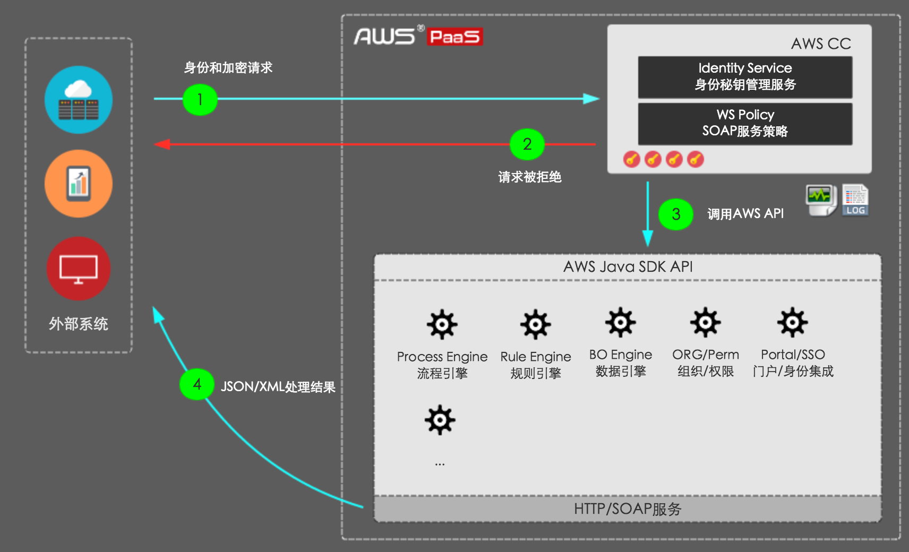

# 介绍

这里介绍**后端**编程接口

AWS PaaS支持的API协议类型

- HTTP(s) API（基于访问凭证/access_key和私钥/secret的URL签名访问）
- SOAP API（基于用户名/密码和x509证书身份的SOAP访问）
- Java SDK API（原生接口，开放给本地开发者）

架构图:

> 可以看到, JAVA SDK API是HTTP API和SOAP API的后端实现

# 疑问

* 流程属性, 实例属性

# 参考

* [AWS PaaS API参考指南](https://docs.awspaas.com/reference-guide/aws-paas-api-guide/index.html)