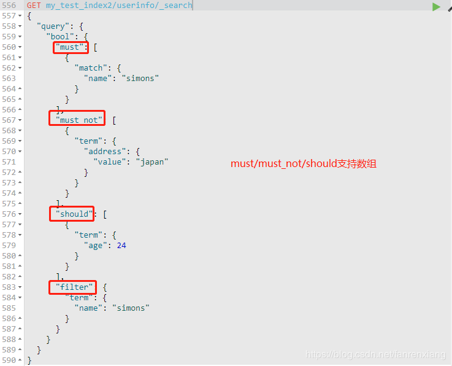
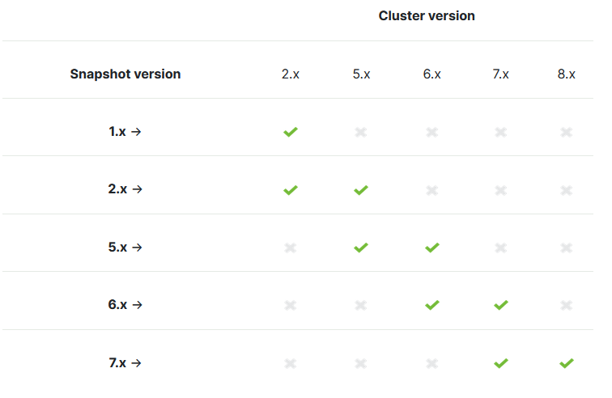
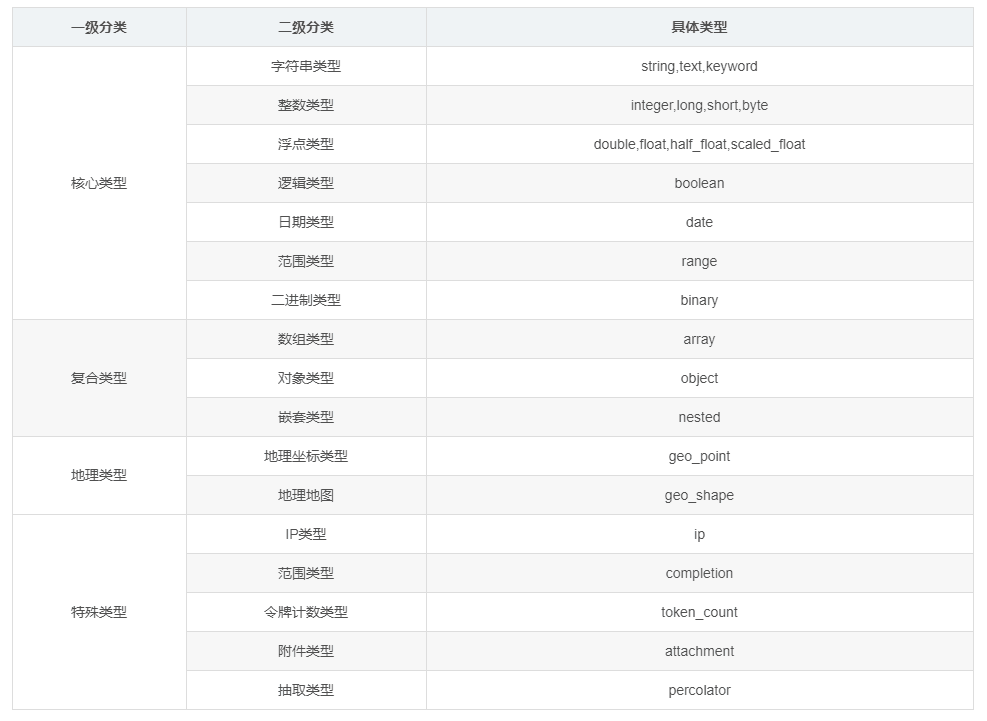

# 开始

## 介绍

* Elasticsearch是一个分布式文档数据库
* 常用作[全文检索](https://baike.baidu.com/item/%E5%85%A8%E6%96%87%E7%B4%A2%E5%BC%95/1140318?fr=aladdin), 和日志存储
* 提供Rest API的方式访问数据库

* 对中文进行全文索引时, 最好配置中文分词插件(原因见原理)

## 基本概念

* 文档 Document

  被索引到的基本单元, 可以代表一个文档, 文档或商品等, 以JSON对象描述.

* 索引 Index

  是一种倒排索引, 直接建立**词**与文档的映射关系. 定义了要索引的字段, 和分词方式.

* 类型 Type

  文档的类型. 类型上也可以配置使用的分词器.

--------

* 元数据

  * `_index, _type, _id`

    文档元数据为, 这三者可以唯一表示一个文档，_index表示文档在哪存放，_type表示文档的对象类别，_id为文档的唯一标识。

  * `_version`

    文档版本. 对指定`_id`的文档修改或新增时, `_version`会自增

  * `_score`

    查询时对文档打的分数, 分数越高, 排序越靠前

* Node & Cluster

  Elastic 本质上是一个分布式数据库，允许多台服务器协同工作，每台服务器可以运行多个 Elastic 实例。

  单个 Elastic 实例称为一个节点（node）; 一组节点构成一个集群（cluster）。

-----

* 关系

  * 一个索引内, 可存在多个类型, 多个文档
  *  一个文档只能属于一个类型. 

  * 类型最好有相似的结构. 若结构极大不同, 则因放入不同索引内.

* vs. 关系数据库

  
  
  **注意**, 其实这样的类比是不合理的, 因为Indices中的文档类型最好一样, 否则会导致搜索效率降低. 不像关系数据库的表一样, 不同表间结构可以完全不同. 因此7.0将弃用Type, 8.0完全移除. 见[Removal of mapping types](https://www.elastic.co/guide/en/elasticsearch/reference/7.3/removal-of-types.html#removal-of-types)

## 原理

### 倒排索引

* 索引过程

  维护一个分词库, 根据分词库对*文档*进行分词. 以分词库为目录, 建立一个索引, 记录分词与文档的映射关系.

* 查询过程

  在索引表中, 以O(log2n)的时间复杂度找到要查询的分词, 接着直接得到含有分词的文档位置.

### 分词器

#### 类型

* 默认分词 standard

  英文按照空格分词, 中文每个都分词. 这样分出的词无法携带语义, 查找出来的内容极有可能不是我们想要的.

* IK分词器

  一个开源的, 第三方分词器, 效果还行. 提供了两种分词器, 

  * `ik_smart` 做最粗粒度的拆分
  * `ik_max_word` 做最细粒度的拆分

* 其他

  smartCN,HanLP

#### IK分词器使用

安装

```java
./bin/elasticsearch-plugin install https://github.com/medcl/elasticsearch-analysis-ik/releases/download/v7.1.0/elasticsearch-analysis-ik-7.1.0.zip
```

创建索引时, 为中文字段设置分词器, 如

```bash
$ curl -X PUT 'localhost:9200/accounts' -d '
{
  "mappings": {
    "person": {
      "properties": {
        "user": {
          "type": "text",
          "analyzer": "ik_max_word",
          "search_analyzer": "ik_max_word"
        },
        "title": {
          "type": "text",
          "analyzer": "ik_max_word",
          "search_analyzer": "ik_max_word"
        },
        "desc": {
          "type": "text",
          "analyzer": "ik_max_word",
          "search_analyzer": "ik_max_word"
        }
      }
    }
  }
}'
```

## 安装 & 运行

### docker

```shell
docker run -d --name elasticsearch  -p 9200:9200 -p 9300:9300 -e "discovery.type=single-node" elasticsearch:7.8.0
```

> 上述运行单实例Elasticsearch, 生产环境需配置多个实例

接着, 运行`curl localhost:9200`命令, 检查程序是否启动成功

> 若要可视化查看Elasticsearch, 可安装Kibana, 见下.

### archive

下载&解压

```
wget https://artifacts.elastic.co/downloads/elasticsearch/elasticsearch-7.8.1-darwin-x86_64.tar.gz
tar -xzf elasticsearch-7.8.1-darwin-x86_64.tar.gz
```

前台运行&日志输出到控制台

```sh
./bin/elasticsearch
```

后台运行, 日志打印到`logs/`下

```
./bin/elasticsearch -d -p pid
```

结束进程

```
pkill -F pid
```

# 结构化操作

> 新建文档时, 若索引和类型不存在, 会自动创建

提供了Rest风格的API供访问.

## 索引

* 新建索引

    ```bash
    $ curl -X PUT 'localhost:9200/weather'
    ```

    新建的同时配置类型和字段

    ```bash
    $ curl -X PUT 'localhost:9200/accounts' -d '
    {
      "mappings": {
        "person": {
          "properties": {
            "user": {
              "type": "text",
              "analyzer": "ik_max_word",
              "search_analyzer": "ik_max_word"
            },
            "title": {
              "type": "text",
              "analyzer": "ik_max_word",
              "search_analyzer": "ik_max_word"
            },
            "desc": {
              "type": "text",
              "analyzer": "ik_max_word",
              "search_analyzer": "ik_max_word"
            }
          }
        }
      }
    }'
    ```
    
* 删除索引

    ```bash
    $ curl -X DELETE 'localhost:9200/weather'
    ```

* 列出所有索引

    ```bash
    $ curl -X GET 'http://localhost:9200/_cat/indices?v'
    ```
    
* 查看索引信息

    ```python
    curl -X GET "http://127.0.0.1:9200/productindex/_mapping?pretty" 
    ```

    > `mappings`包含所有类型信息

## 类型(弃用)

> 在7.0将弃用, 8.0彻底移除

* 所有的类型

  ```bash
  $ curl 'localhost:9200/_mapping?pretty=true'
  ```
  
* 为索引添加类型

  ```shell
  curl -XPOST "http://127.0.0.1:9200/productindex/product/_mapping?pretty" -d ' 
  {
      "product": {
              "properties": {
                  "title": {
                      "type": "string",
                      "store": "yes"
                  },
                  "description": {
                      "type": "string",
                      "analyzer": "standard"
                  },
                  "price": {
                      "type": "double"
                  },
                  "onSale": {
                      "type": "boolean"
                  },
                  "type": {
                      "type": "integer"
                  },
                  "createDate": {
                      "type": "date"
                  }
              }
          }
    }
  }'
  ```

* 新增一个字段

  ```shell
  curl -X POST "http://127.0.0.1:9200/productindex/product/_mapping -d '
  
  {
       "product": {
                  "properties": {
                       "amount":{
                          "type":"integer"
                     }
                  }
      }
  }'
  ```

* 修改字段? 不被允许的, 否则必将导致所有数据都要重新索引一遍

## 文档

* 新增文档

  指定id添加

  ```bash
  $ curl -X PUT 'localhost:9200/accounts/person/1' -d '
  {
    "user": "张三",
    "title": "工程师",
    "desc": "数据库管理"
  }' 
  ```

  自动生成id

  ```bash
  $ curl -X POST 'localhost:9200/accounts/person' -d '
  {
    "user": "李四",
    "title": "工程师",
    "desc": "系统管理"
  }'
  ```

* 查看记录

  ```bash
  $ curl 'localhost:9200/accounts/person/1?pretty=true'
  ```

  > `pretty`参数表示以更易读的方式返回的JSON

* 删除记录

  ```bash
  $ curl -X DELETE 'localhost:9200/accounts/person/1'
  ```

* 更新记录

  ```bash
  $ curl -X PUT 'localhost:9200/accounts/person/1' -d '
  {
      "user" : "张三",
      "title" : "工程师",
      "desc" : "数据库管理，软件开发"
  }' 
  
  {
    "_index":"accounts",
    "_type":"person",
    "_id":"1",
    "_version":2,
    "result":"updated",
    "_shards":{"total":2,"successful":1,"failed":0},
    "created":false
  }
  ```

  > 更新后, 版本`version`会自增. 状态由`created`变成`updated`
  
* 返回索引的类型下的所有文档

  ```bash
  $ curl 'localhost:9200/accounts/person/_search'
  
  {
    "took":2,
    "timed_out":false,
    "_shards":{"total":5,"successful":5,"failed":0},
    "hits":{
      "total":2,
      "max_score":1.0,
      "hits":[
        {
          "_index":"accounts",
          "_type":"person",
          "_id":"AV3qGfrC6jMbsbXb6k1p",
          "_score":1.0,
          "_source": {
            "user": "李四",
            "title": "工程师",
            "desc": "系统管理"
          }
        },
        {
          "_index":"accounts",
          "_type":"person",
          "_id":"1",
          "_score":1.0,
          "_source": {
            "user" : "张三",
            "title" : "工程师",
            "desc" : "数据库管理，软件开发"
          }
        }
      ]
    }
  }
  ```

  > `_score`为匹配度

# Query DSL

## 介绍

* ES搜索方式: URI Search 和 Query DSL. 主要以Query DSL为主, 类比SQL的Select

* Query DSL

  * 字段类查询
    
    只针对一个字段查询
    
    * 单词匹配(Term Level Query) 不对查询的内容进行分词
    * 全文匹配(Full Text Query) 对查询的内容进行分词, 如查询"我在马路边", 被分词为"我", "在", "马路"等, 然后再去匹配.
    
    > 不要将**全文匹配**和**全文索引**混淆, 全文匹配是对查询内容分词, 全文索引是对存储数据进行分词. 题外话, `text`类型的字段, 使用的全文索引.
    
  * 复合查询

    可以对一个或多个字段进行查询.

* 查询URL

  Query DSL查询的URL路径以`_search`结尾, 如

  查询索引的类型下的文档

  ```url
  localhost:9200/accounts/person/_search
  ```

  查询索引下的文档

  ```url
  localhost:9200/accounts/person/_search
  ```

  查询所有索引下的文档

  ```url
  localhost:9200/_search
  ```

## 字段类查询

只针对一个字段查询

>  参考[Elastic Search之Search API(Query DSL)、字段类查询、复合查询](https://blog.csdn.net/fanrenxiang/article/details/86477019)

### 全文匹配

基本用法, 各个单词匹配的结果默认进行"或"运算

```dsl
GET /_search
{
	"query":{
		"match":{
			"message":"this is a test"
		}
	}
}
```

设置"与"运算

```
GET /_search
{
	"query":{
		"match":{
			"message":"this is a test",
			"operator":"and"
		}
	}
}
```

### 单词匹配

```
{
	"query":{
		"term":{
			"your_field": "hello world"
		}
	}
}
```

## 复合查询

可以对一个或多个字段进行查询.

### bool查询

Bool Query是由一个或多个bool子句构成的，包括:

| 关键字   | 说明                                                         |
| :------- | ------------------------------------------------------------ |
| must     | 根据must中的条件过滤文档，返回的结果文档必须严格匹配条件，会影响相关性算分 |
| filter   | 根据must中的条件过滤文档，返回的结果文档必须严格匹配条件，和must不同的是，filter不会影响相关性算分 |
| should   | 根据should中的条件进行筛选，返回的结果文档应该包含should的条件，影响相关性 算分 |
| must_not | 根据must_not中的条件过滤文档，返回的结果文档必须不包含must_not条件，会影响相关性算分 |



* 每个bool字段由字段类查询语句组成
* must、must_not、should支持数组，同时filter的查询语句，es会对其进行智能缓存，因此执行效率较高，在不需要算分的查询语句中，可以考虑使用filter替代普通的query语句;

* 查询语句同时包含must和should时，可以不满足should的条件，因为must条件优先级高于should，但是如果也满足should的条件，则会提高相关性算分;

* 可以使用minimum_should_match参数来控制应当满足条件的个数或百分比;

* must、must_not语句里面如果包含多个条件，则各个条件间是且的关系，而should的多个条件是或的关系。

## 聚合操作

[Bucket Aggregations](https://www.elastic.co/guide/en/elasticsearch/reference/6.8/search-aggregations-bucket.html)

### terms聚合

> [Terms Aggregation](https://www.elastic.co/guide/en/elasticsearch/reference/6.8/search-aggregations-bucket-terms-aggregation.html)

根据字段值聚合

```
GET /_search
{
    "aggs" : {
        "genres" : {
            "terms" : { "field" : "genre" } 
        }
    }
}
```

* `field`为聚合字段, 可聚合的字段不适合为`text`类型的.
* `genres`是该聚合名, 可随意更改

例子: 

```
POST jy_description/_search
{
    "size": 0,
    "aggs": {
        "duplicateNames": {
            "terms": {
                "field": "term",
                "min_doc_count": 2
            }
        }
    }
}
```

* 定义了一个聚合`duplicateNames` 
*  `term`是字段名
* `size`表示查询所有
* `min_doc_count` 表示聚合的组必须有2个元素以上, 即重复

嵌套查询, 达到多个字段聚合的作用

```
{
  "size": 0,
  "aggs": {
    "duplicateNames": {
      "terms": {
        "field": "conceptId1",
        "min_doc_count": 2
      },
      "aggs": {
        "name": {
          "terms": {
            "field": "conceptId2",
            "min_doc_count": 2
          },
          "aggs": {
            "name2": {
              "terms": {
                "field": "branch",
                "min_doc_count": 2
              }
            }
          }
        }
      }
    }
  }
}
```


## 其他

### offset & size

```bash
$ curl 'localhost:9200/accounts/person/_search'  -d '
{
  "query" : { "match" : { "desc" : "管理" }},
  "from": 1,
  "size": 1
}'
```

* `query` 为查询语句集合; `match`是一个具体的语句, 表示动作; `desc`表示动作的描述
* `size` 查询多少条, 默认10条
* `from` 从哪个位置开始查询, 默认0

# 进阶

* 集群 & 节点
* 分片
* 备份

## 备份&恢复

* [elasticsearch备份与恢复](https://www.jianshu.com/p/22444c665ac3)

* [Snapshot and restore](https://www.elastic.co/guide/en/elasticsearch/reference/current/snapshot-restore.html)
* [elasticsearch数据备份和恢复](https://blog.csdn.net/jiahao1186/article/details/81058022)

### 介绍

* 可对整个集群备份, 或对单个索引备份

  > 备份数据包含索引

* 创建**快照**之前, 必须注册快照**仓库**

* 快照可存在本地或远程仓库. 远程仓库使用Amazon S3, HDFS等网络文件系统存放, 其他快照存储方式可由插件提供.

* 快照是增量的, 每次快照备份, 都是备份索引的diff

* 快照可以让集群恢复所有数据, 或者仅恢复某个索引的数据.

* 快照版本只能使用于特定版本, 但也有一定的向后兼容性. 即`6.x`可在`7.x`的elasticsearch中使用, 但反之不行.

  

### 仓库操作

配置快照存储位置 (必须)

```yaml
path.repo: ["/usr/local/backups/es_backup"]
```

> 不用手动创建目录, 若目录已存在, 需配置下权限
>
> ```shell
> chmod 755 /usr/local/backups/es_backup
> chown es:es /usr/local/backups/es_backup
> ```

* 创建仓库

  ```
  curl -X PUT http://localhost:9200/_snapshot/es_backup
  {
      "type": "fs",
      "settings": {
          "location": "/usr/local/backups/es_backup"
      }
  }
  ```

  > 创建了仓库`es_backup`

  * `type` : `fs`表示使用本地文件系统

  * `location` : 仓库地址, 必须在`path.repo`指定的目录下. **可以为相对地址**, 相对于`path.repo`

    > 配置详细见[Shared file system repository](https://www.elastic.co/guide/en/elasticsearch/reference/current/snapshots-register-repository.html#snapshots-filesystem-repository)

* 仓库修改

  ```
  curl -X POST http://localhost:9200/_snapshot/es_backup/ -d '
  {
      "type": "fs",
      "settings": {
      "location": "/usr/local/backups/es_backup",
          "max_snapshot_bytes_per_sec" : "50mb",
          "max_restore_bytes_per_sec" : "50mb"
      }
  }'
  ```
  
* 查看所有仓库信息

  ```
  GET /_snapshot/_all
  ```

### 快照操作

> 以下操作都支持添加参数`wait_for_completion=true` , 让请求阻塞, 直到操作完成

* 创建快照

  在仓库es_backup中, 创建快照`snapshot_1` . 默认是后台运行的

  ```
  curl -XPUT http://localhost:9200/_snapshot/es_backup/snapshot_1
  ```

  若要与api同步执行, 加`wait_for_completion`参数

  ```
  curl -XPUT http://localhost:9200/_snapshot/es_backup/snapshot_1?wait_for_completion=true
  ```

  仅备份部分索引

  ```
  curl -XPUT http://localhost:9200/_snapshot/es_backup/snapshot_2 -d '
  {
  	"indices": "index_1,index_2"
  }'
  ```

* 删除快照

  ```
  curl -XDELETE http://localhost:9200/_snapshot/es_backup/snapshot_1
  ```

* 恢复快照

  ```
  curl -XPOST http://localhost:9200/_snapshot/es_backup/snapshot_1/_restore
  ```

  > 可能会遇到问题, 说必须关闭或删除已存在的索引才能恢复. 关闭的API见[Open / Close Index API](https://www.elastic.co/guide/en/elasticsearch/reference/6.5/indices-open-close.html). 也可以使用elasticsearch-head来操纵

* 查看快照信息

  当前正在运行的快照
  
  ```
  GET /_snapshot/es_backup/_current
  ```
  
  某个快照的详细信息
  
  ```
  curl -XGET http://localhost:9200/_snapshot/es_backup/snapshot_1
  ```
  
  查看一堆快照信息(支持通配符)
  
  ```
  GET /_snapshot/es_backup/snapshot_*,some_other_snapshot
  GET /_snapshot/es_backup/_all
  ```
  
  

## 集群

[Elasticsearch集群配置](https://www.jianshu.com/p/15d6241e7844)

# 其他

## 字段类型



* 字符串
  * ~~`string`已弃用~~
  * `text` 用于全文索引, 字段内容会经过分词器拆分. 该类型字段不用于排序, 很少用于聚合
  * `keyword` 用于精确匹配.

> 详细见
>
> * [ElasticSearch 字段类型介绍](https://www.jianshu.com/p/bfef6a890b42)
> * [Field data types](https://www.elastic.co/guide/en/elasticsearch/reference/current/mapping-types.html)

## 映射参数

> [Mapping parameters](https://www.elastic.co/guide/en/elasticsearch/reference/current/mapping.html)

### fields

当一个字段有不同使用情况时, 可使用`fields`, 如

```console
PUT my_index
{
  "mappings": {
    "properties": {
      "city": {
        "type": "text",
        "fields": {
          "raw": { 
            "type":  "keyword"
          }
        }
      }
    }
  }
}

PUT my_index/_doc/1
{
  "city": "New York"
}

PUT my_index/_doc/2
{
  "city": "York"
}

GET my_index/_search
{
  "query": {
    "match": {
      "city": "york" 
    }
  },
  "sort": {
    "city.raw": "asc" 
  },
  "aggs": {
    "Cities": {
      "terms": {
        "field": "city.raw" 
      }
    }
  }
}
```

相当于多声明了一个字段`city.raw`, 但比仅多声明字段有更多的功能. 如上述`city.raw`是`city`的关键字类型的版本, `city`全文索引时, 可以按照`city.raw`排序和分组.

### properties

`properties`用来声明map类型字段的, 如:

```json
PUT my_index
{
  "mappings": {
    "properties": { 
      "manager": {
        "properties": { 
          "age":  { "type": "integer" },
          "name": { "type": "text"  }
        }
      }
    }
  }
}

PUT my_index/_doc/1 
{
  "region": "US",
  "manager": {
    "name": "Alice White",
    "age": 30
  }
}
```

# Kibana

> 推荐使用elasticsearch-head.

* 介绍

  Kibana 是一个开源的分析和可视化平台，旨在与 Elasticsearch 合作。Kibana 提供搜索、查看和与存储在 Elasticsearch 索引中的数据进行交互的功能。开发者或运维人员可以轻松地执行高级数据分析，并在各种图表、表格和地图中可视化数据。

* 运行

  ```shell
  docker run -d --name kibana -p 5601:5601 kibana:7.8.0
  ```

  打开http://localhost:5601 可访问到kibana
  
  > 注意, 还需要将elasticsearch和kibana加入到同一自定义bridge网络中, 否则容器间无法通信. (见[docker网络知识](https://sidian.live/article/?id=268#head-15-0-0-0-0-0))
  
* 基本使用

  * Index Patterns (*Management/Kibana/Index Patterns*)

    Index patterns定义匹配Index的模式, 聚集一组Index, 以便查询. 

    支持通配符`*`, 匹配0到多个字符

  * Discover

    查询文档, 这里用到了上述定义的Patterns. 

    还支持按字段查询.

* 参考

  * [Configure Kibana](https://www.elastic.co/guide/en/kibana/current/settings.html) kibana的配置
  * [Install Kibana with Docker](https://www.elastic.co/guide/en/kibana/current/docker.html)

# elasticsearch-head

**[elasticsearch-head](https://github.com/mobz/elasticsearch-head)**

[Windows下ElasticSearch的Head安装及基本使用](https://www.cnblogs.com/hong-fithing/p/11221020.html)

[elasticsearch-head的使用](https://www.cnblogs.com/xuwenjin/p/8792919.html)

# 踩坑

## 分片副本UNASSIGNED

[elasticsearch问题解决之分片副本UNASSIGNED](https://www.cnblogs.com/carryLess/p/9452000.html)

# 参考

* [Elasticsearch Reference](https://www.elastic.co/guide/en/elasticsearch/reference/current/index.html)

* [Elastic Stack and Product Documentation](https://www.elastic.co/guide/index.html) 官方文档

* [全文搜索引擎 Elasticsearch 入门教程 阮一峰](http://www.ruanyifeng.com/blog/2017/08/elasticsearch.html)
* [Elasticsearch简介与实战](https://www.jianshu.com/p/d48c32423789)

* [Query DSL](https://www.elastic.co/guide/en/elasticsearch/reference/current/query-dsl.html) 全文搜索语言
* [Elasticsearch(10) --- 内置分词器、中文分词器](https://www.cnblogs.com/qdhxhz/p/11585639.html)
* [ElasticSearch中文分词](https://www.jianshu.com/p/bb89ad7a7f7d)

* [elasticsearch教程--中文分词器作用和使用](https://blog.csdn.net/an88411980/article/details/83747230)
* [Elasticsearch全文检索入门这一篇就够了](https://zhuanlan.zhihu.com/p/94181307)