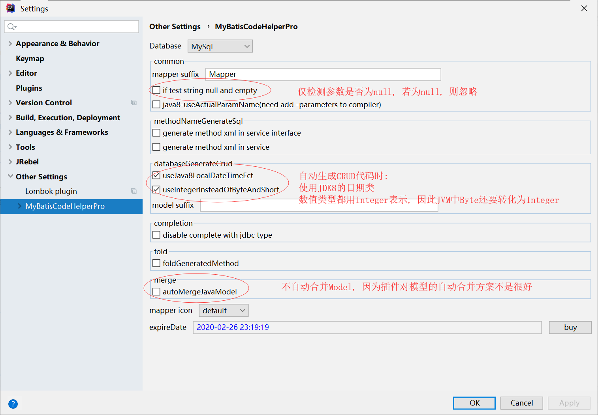

# 一 介绍
MyBatis是一个持久层框架，消除了大部分JDBC代码，包括手动设置参数、取回结果。通过xml或注解在java对象和数据库记录之间建立映射关系。

通过**xml**或**注解**，定义好**映射语句**，就可以使用它的唯一标识**名字空间**或**Mapper接口**来执行sql语句。其中，映射语句含有参数映射和结果映射关系，因此我们可以像使用方法一样，简单的传入参数和获取结果对象。并且，只要符合一定条件，mybatis就能为我们自动映射参数、结果。因此，实际上需要我们配置的很少。

# 二 使用
使用mybatis之前需
1. 引入mybatis的jar包
2. 配置mybatis的配置文件（如配置事务管理器和数据源）
3. 定义映射语句（多个映射语句存于映射文件或mapper接口中）并且**注册**。

然后才能使用。

mybatis中最核心的是SqlSession接口，通过该接口可以执行sql语句，处理事务，也可以绑定mapper接口到映射语句上。myabtis中SqlSession实现就是对jdbc中Connection进行了简单的封装。

## 导入jar包
只需导入mybatis-x.x.x.jar，如果使用日记，还需导入log4j的jar包。
```xml
<dependency>
  <groupId>org.mybatis</groupId>
  <artifactId>mybatis</artifactId>
  <version>x.x.x</version>
</dependency>
```
## 配置mybatis
单独使用mybatis，至少需要配置事务管理器、数据源和映射文件的位置（即注册mapper文件）。
>如果和spring整合，那么事务管理器和数据源的配置就交给了spring，映射文件可以通过专门的Bean扫描。

### 通过xml配置
首先定义xml配置文件，里面配置了事务管理器、数据源和映射文件位置（注册）。
```xml
<?xml version="1.0" encoding="UTF-8" ?>
<!DOCTYPE configuration
  PUBLIC "-//mybatis.org//DTD Config 3.0//EN"
  "http://mybatis.org/dtd/mybatis-3-config.dtd">
<configuration>
  <environments default="development">
    <environment id="development">
      <transactionManager type="JDBC"/>
      <dataSource type="POOLED">
        <property name="driver" value="${driver}"/>
        <property name="url" value="${url}"/>
        <property name="username" value="${username}"/>
        <property name="password" value="${password}"/>
      </dataSource>
    </environment>
  </environments>
  <mappers>
    <mapper resource="org/mybatis/example/BlogMapper.xml"/>
  </mappers>
</configuration>
```
然后在java中获得产生SqlSession的工厂类SqlSessionFactory：
```java
String resource = "org/mybatis/example/mybatis-config.xml";
InputStream inputStream = Resources.getResourceAsStream(resource);
SqlSessionFactory sqlSessionFactory =
  new SqlSessionFactoryBuilder().build(inputStream);
```
>mybatis提供了Resources类，方便从classpath下获得资源文件。Resources本质上是对ClassLoader的包装。

### 通过java配置
或直接在java代码中配置mybatis：
```java
DataSource dataSource = BlogDataSourceFactory.getBlogDataSource();
TransactionFactory transactionFactory = new JdbcTransactionFactory();
Environment environment = new Environment("development", transactionFactory, dataSource);
Configuration configuration = new Configuration(environment);
configuration.addMapper(BlogMapper.class);
SqlSessionFactory sqlSessionFactory = new SqlSessionFactoryBuilder().build(configuration);
```
上面通过`Configuration.addMapper`方法注册映射文件，而映射语句可以通过**xml**或**注解**创建，因此`addMapper`方法可以接收字符串，指出xml映射文件的位置；或者Mapper接口，该接口可以含有映射语句的注解配置。

由于注解的限制和一些映射的复杂性，mybatis还会加载与接口对应的映射文件，如注册com.example.BlogMapper.class接口，还会尝试加载com.example包下的BlogMapper.xml文件。**因此注解和xml可以混合用**，注解中给出简单的映射语句，xml中定义复杂的映射语句。

>如果在idea的maven项目中，报错说找不到xml文件，则参考：[maven之允许src目录下xml文件输出到target目录](https://blog.csdn.net/jdbdh/article/details/89068289)
## 映射语句
映射语句可以在xml映射文件中创建，也可以在接口的注解中创建。
### xml映射文件
```xml
<?xml version="1.0" encoding="UTF-8" ?>
<!DOCTYPE mapper
  PUBLIC "-//mybatis.org//DTD Mapper 3.0//EN"
  "http://mybatis.org/dtd/mybatis-3-mapper.dtd">
<mapper namespace="org.mybatis.example.BlogMapper">
  <select id="selectBlog" resultType="Blog">
    select * from Blog where id = #{id}
  </select>
</mapper>
```
一个映射文件中可以含有多个映射语句。`namespace`唯一标识映射文件，为了使用时绑定接口，一般以包名的形式存在，而映射语句的`id`则对应接口的方法名。当然，执行映射语句，也可以不绑定接口，可以直接使用`namespace`直接执行。

### 注解定义
```java
package org.mybatis.example;
public interface BlogMapper {
  @Select("SELECT * FROM blog WHERE id = #{id}")
  Blog selectBlog(int id);
}
```
>注解定义很是方便，参考：[java api](http://www.mybatis.org/mybatis-3/java-api.html)。注解定义没有xml映射灵活，但会更方便。如有不便，可以看看注解`@options`
## 使用
mybatis中最重要的类就是SqlSession了，可以通过namespace+id指定映射语句并执行：
```java
Blog blog = session.selectOne(
  "org.mybatis.example.BlogMapper.selectBlog", 101);
```
也可以绑定mapper接口，以执行方法的方式执行sql语句：
```java
BlogMapper mapper = session.getMapper(BlogMapper.class);
Blog blog = mapper.selectBlog(101);
```
绑定的前提是，已经注册了映射文件或Mapper接口。如果是映射文件，需要与绑定的Mapper接口对应起来，即全限定名与namespace对应，方法名与映射文件id对应，结果类型与方法返回类型对应等。
>Mapper接口哪里来的实现？应该是通过动态代理实现的吧。

>**千万注意**！！！！
>使用之前是需要在mybatis中注册的，可以手动在mybatis配置文件中注册，获得spring-mybatis项目中使用自动扫描，等等。
## 作用域
每个对象都有自己的作用域和生命周期：
* **SqlSessionFactoryBuilder**：通过配置，用于创建SqlSessionFactory，用完后即可丢弃，因此为**方法作用域（method scope）**。
* **SqlSessionFactory**：用于创建SqlSession，一旦被创建就应该存在于应用程序的整个生命周期，因为为**应用作用域（application scope）**。
* **SqlSession**：用于执行sql，类似于Connection，每个线程应该存在一个，因此为**请求或方法作用域（request or method scope）**。使用完后注意要关闭。
* **Mapper Instances**：mapper接口从SqlSession中绑定映射语句后，与SqlSession有关联，应该与SqlSession有同等作用域，但为了方便维护，最好还是使用**方法作用域（method scope）**。

>在和spring的整合框架中，不需要区分作用域，因为会创建一个线程安全、具有事务功能的SqlSession和Mapper。注意SqlSession只是接口哦。

# 三 配置
mybatis配置文件的结果如下：
* configuration：配置的根元素
	* properties：配置属性键值对，在其他元素中可以通`${propertyName}`取出。
	* settings：mybatis的行为的全局设置
	* typeAliases：为类型创建别名
	* typeHandlers：在参数和结果映射过程中，使用的处理器。
	* objectFactory
	* plugins
	* environments：mybatis的工作环境，可以配置多个，但只能使用一个
		* environment：环境具体的配置
			* transactionManager：事务管理器
			* dataSource：数据源
	* databaseIdProvider：数据库标识，拥有多个数据库供应商时使用
	* mappers：指出映射文件或含映射语句的接口的位置

## properties
配置属性键值对，在其他元素中可以通`${propertyName}`取出。如：
```xml
<properties resource="org/mybatis/example/config.properties">
  <property name="username" value="dev_user"/>
  <property name="password" value="F2Fa3!33TYyg"/>
</properties>
...
<dataSource type="POOLED">
  <property name="driver" value="${driver}"/>
  <property name="url" value="${url}"/>
  <property name="username" value="${username}"/>
  <property name="password" value="${password}"/>
</dataSource>
```
有三种方式配置属性：
1. 元素`property`中配置
2. `resource`指定外部属性配置文件
3. 属性传入`SqlSessionFactoryBuilder.build()`中

其中，优先级依次递增。还可以为属性配置默认值，默认这个功能不开启。

## settings
settings元素中可以配置mybatis的各种行为。

一些注意点如下:

* `jdbcTypeForNull`，为值为`null`的参数指定其JDBC类型, 默认`OTHER`

  > 在JDBC中, 值为`null`的参数, 是需要指定它的JDBC类型的, 该设置就为你指定了

* `mapUnderscoreToCamelCase`, 默认`false`, 即自动映射时不使用驼峰命名的转换.

## typeAliases
设置别名，用于在需要类名配置的地方减少拼写。如：
```xml
<typeAliases>
  <typeAlias alias="Author" type="domain.blog.Author"/>
  <typeAlias alias="Blog" type="domain.blog.Blog"/>
  <typeAlias alias="Comment" type="domain.blog.Comment"/>
  <typeAlias alias="Post" type="domain.blog.Post"/>
  <typeAlias alias="Section" type="domain.blog.Section"/>
  <typeAlias alias="Tag" type="domain.blog.Tag"/>
</typeAliases>
```
可以为整个包下的类设置别名，默认别名为首字母小写的非全限定类名：
```xml
<typeAliases>
  <package name="domain.blog"/>
</typeAliases>
```
mybatis为常用的基本类型设置了别名，详细参考官网。

## environments
可以配置多个环境，但每个`SqlSessionFactory`只能使用一个。一个配置如下：
```xml
<environments default="development">
  <environment id="development">
    <transactionManager type="JDBC">
      <property name="..." value="..."/>
    </transactionManager>
    <dataSource type="POOLED">
      <property name="driver" value="${driver}"/>
      <property name="url" value="${url}"/>
      <property name="username" value="${username}"/>
      <property name="password" value="${password}"/>
    </dataSource>
  </environment>
</environments>
```

mybatis提供了两种事务管理器：**JDBC**和**MANAGED**。在Mybatis的SqlSession实现中，一个SqlSession对应一个Connection，也含有一个事务管理器，提供SqlSession事务管理功能。而JDBC仅仅只是调用Connection的commit、rollback方法；在MANAGED中，不做任何事情，因此调用SqlSession的commit、rollback无效。
>在将事务管理交给其他框架管理时可以使用MANAGED，实际上很少用吧，比如spring与mybatis的整合中，SqlSession的实现中都没有了事务管理器。

mybatis提供了三种数据源实现：
* **UNPOOLED**：未使用连接池的数据源，简单的返回普通的Connection。
* **POOLED** ：实现了连接池，产生和连接池相关的Connection。
* **JNDI**：配置JNDI上下文中的数据源一起使用。
>仅mybatis项目中想使用其他数据源，就需要实现它的DataSourceFactory接口。

## mappers
定义好映射文件或含映射语句的接口后，需要注册它们，让mybatis知道如何找到它。
```xml
<!-- Using classpath relative resources -->
<mappers>
  <mapper resource="org/mybatis/builder/AuthorMapper.xml"/>
  <mapper resource="org/mybatis/builder/BlogMapper.xml"/>
  <mapper resource="org/mybatis/builder/PostMapper.xml"/>
</mappers>
<!-- Using url fully qualified paths -->
<mappers>
  <mapper url="file:///var/mappers/AuthorMapper.xml"/>
  <mapper url="file:///var/mappers/BlogMapper.xml"/>
  <mapper url="file:///var/mappers/PostMapper.xml"/>
</mappers>
<!-- Using mapper interface classes -->
<mappers>
  <mapper class="org.mybatis.builder.AuthorMapper"/>
  <mapper class="org.mybatis.builder.BlogMapper"/>
  <mapper class="org.mybatis.builder.PostMapper"/>
</mappers>
<!-- Register all interfaces in a package as mappers -->
<mappers>
  <package name="org.mybatis.builder"/>
</mappers>
```
注意，注册接口后，mybatis会自动查找有没有对应的xml映射文件，便于两种定义方式混合使用。

# 四 xml映射文件
mybatis最强大的功能就是映射语句，配置好映射文件后，就可以自动映射参数到sql语句、结果集到java对象中，它消除了大部分JDBC代码的使用。可配置的元素有：
* cache – Configuration of the cache for a given namespace.开启二级缓存
* cache-ref – Reference to a cache configuration from another namespace.
* resultMap – The most complicated and powerful element that describes how to load your objects from the database result sets.
* sql – A reusable chunk of SQL that can be referenced by other statements.
* insert – A mapped INSERT statement.
* update – A mapped UPDATE statement.
* delete – A mapped DELETE statement.
* select – A mapped SELECT statement.

## 参数
在编写映射语句时，不必指出参数类型，因为mybatis可以推断出，但是参数为Map时，必须给出参数类型，即map。
* 当参数是基本类型时，sql语句中占位符名可以任意。
* 当参数是pojo或javaBean时，占位符名为对象属性。
* 当参数是map是（此时参数类型必须给出），占位符名为map的key。
* 当参数有多个时，每个参数的占位符名为`#{paramN}`；如果编译时，启用了`-Parameter`选项，占位符名就是参数名；还可以通过`@Param`注解指定参数名。

> JDBC规定, 如果参数传入`null`时, 必须指定其JDBC类型, 见[setNull](https://docs.oracle.com/en/java/javase/11/docs/api/java.sql/java/sql/PreparedStatement.html#setNull(int,int)). 而JDBC已经为我们设置了`OTHER`作为默认值, 见3.2小节

## 联级
将结果集映射到简单对象时不需要联级，但是有时候对象中属性不简单时，就需要联级。mybatis有三种联级：`association`、`collection`、`discriminator`。当属性对象和对象有一对一的关系时，使用association定义映射关系；当属性对象是个集合时，使用collection定义映射关系；当需要根据结果集某个属性映射不同的属性时，使用discrimination。

有两种方式实现association和collection：
* nested select（嵌套查询）：就是额外执行一个sql语句

  > 这种情况下, 设置` fetchType `可延迟查询

* nested results（嵌套结果）：结果集中含有全部信息，抽取部分列值，组成对象属性。

mybatis在处理联级时，都是先建立属性对象，最后才创建最外层的对象。在建立属性对象的过程中需要进行对象间的比较，判断属性对象属于哪个外层对象，因此**联级中设置id元素是十分重要的**，能够大大提高效率。如果没有该元素，也许mybatis能够正常工作，但也极有可能报错。。。

## 自动映射
mybatis的一个强大功能就是自动映射，只要结果对象属性名与结果集的列名相同（忽略大小写），mybatis就会自动映射过去。如果列名对应不上，可以通过sql的`as`语句更改列名，或者手动映射。

在mybatis的全局配置中，`autoMappingBehavior`控制mybatis的自动映射行为，有三种取值：
* **NONE** - disables auto-mapping. Only manually mapped properties will be set.
* **PARTIAL(default)** - will auto-map results except those that have nested result mappings defined inside (joins).
* **FULL** - auto-maps everything.

默认值partial，嵌套结果不会自动映射，这事有原因的，主要为了防止不被期待的结果出现。如果想要映射嵌套结果，则设置对应元素的autoMapping属性。

## 缓存
mybatis中含有两级缓存，局部缓存一直被开启，一个局部缓存对应一个SqlSession。二级缓存默认不开启，用于事务管理。通过下列配置可开启二级缓存：
```xml
<cache/>
```
默认情况下，insert、update、delete会刷新局部和二级缓存。

## ${}
mybatis使用`#{}`作为sql语句的占位符，而`${}`用于字符串拼接，因此使用`${}`时可能会导致sql注入攻击的问题。

# 五 动态sql
mybaits提供了根据参数内容动态拼接sql语句的功能。

## if
根据一定条件判断是否添加sql片段：
```xml
<select id="findActiveBlogLike"
     resultType="Blog">
  SELECT * FROM BLOG WHERE state = ‘ACTIVE’
  <if test="title != null">
    AND title like #{title}
  </if>
  <if test="author != null and author.name != null">
    AND author_name like #{author.name}
  </if>
</select>
```
## choose,when,otherwise
条件满足时只应用一个sql片段，类似java中的switch：
```xml
<select id="findActiveBlogLike"
     resultType="Blog">
  SELECT * FROM BLOG WHERE state = ‘ACTIVE’
  <choose>
    <when test="title != null">
      AND title like #{title}
    </when>
    <when test="author != null and author.name != null">
      AND author_name like #{author.name}
    </when>
    <otherwise>
      AND featured = 1
    </otherwise>
  </choose>
</select>
```
## trim
`trim`有四个属性：`prefix`，`prefixOverrides`，`suffix`，`suffixOverrides`。对于`prefix`和`prefixOverrides`的规则如下：

* 如果只存在`prefix`，则直接在内容前添加`prefix`的内容。
* 如果只存在`prefixOverrides`，则删除内容前**存在的**`prefixOverrides`内容。
* 如果都存在，则`prefix`取代内容前**存在的**`prefixOverrides`; 不存在时, 则在内容前添加`prefix`。

该规则对`suffix`和`suffixOverrides`同样适用。如果`prefixOverrides`或`suffixOverrides`有多个可选值，通过`|`分隔。

## where
`where`元素中有内容时则在前面插入`WHERE`，并去掉内容前存在的`AND`或`OR`。如：
```xml
<select id="findActiveBlogLike"
     resultType="Blog">
  SELECT * FROM BLOG
  <where>
    <if test="state != null">
         state = #{state}
    </if>
    <if test="title != null">
        AND title like #{title}
    </if>
    <if test="author != null and author.name != null">
        AND author_name like #{author.name}
    </if>
  </where>
</select>
```

类似于：
```xml
<trim prefix="WHERE" prefixOverrides="AND |OR ">
  ...
</trim>
```
> 注意AND和OR的空格是有用的。

## set
`set`元素中有内容时则在前面插入`SET`，并去掉内容后存在的`,` 。如：
```xml
<update id="updateAuthorIfNecessary">
  update Author
    <set>
      <if test="username != null">username=#{username},</if>
      <if test="password != null">password=#{password},</if>
      <if test="email != null">email=#{email},</if>
      <if test="bio != null">bio=#{bio}</if>
    </set>
  where id=#{id}
</update>
```
## foreach
用于遍历集合的情况：
```xml
<select id="selectPostIn" resultType="domain.blog.Post">
  SELECT *
  FROM POST P
  WHERE ID in
  <foreach item="item" index="index" collection="list"
      open="(" separator="," close=")">
        #{item}
  </foreach>
</select>
```
collection属性指定集合类型，如果是数组类型的，`index`为索引，`item`为值；如果是map，则`index`为键，`item`为值。

# 六 logging
mybatis可以使用的日记有很多，mybatis会在classpath下查找日记实现的jar包，使用第一个被找到的jar包。

在很多环境中，会在所有应用能够访问的目录下提供Commons Logging日记jar包。那么Commons Logging会成为第一个被发现的jar包，其他的日记将不会使用，此时你的log4j配置将无效。
>为什么Commons Logging会第一个被访问？我才是因为mybatis使用了Resources类来获得classpath资源的，查看它的代码会发现，如果用户没有指定ClassLoader，那么会先使用系统类加载器，接着上下文类加载器。环境提供的应该在系统加载器对应的路径中的吧，然后我们自己的日记包被放在上下文类加载器对应的路径中。

此时可以通过在mybatis的全局配置中指定使用的日记包来解决：
```xml
<configuration>
  <settings>
    ...
    <setting name="logImpl" value="LOG4J"/>
    ...
  </settings>
</configuration>
```
----------------
下面配置log4j，在配置之前先加入Log4j的jar包，然后配置文件如下：
```property
# Global logging configuration
log4j.rootLogger=ERROR, stdout
# MyBatis logging configuration...
log4j.logger.org.mybatis.example.BlogMapper=TRACE
# Console output...
log4j.appender.stdout=org.apache.log4j.ConsoleAppender
log4j.appender.stdout.layout=org.apache.log4j.PatternLayout
log4j.appender.stdout.layout.ConversionPattern=%5p [%t] - %m%n
```
# 七 mybatis-spring
mybatis-spring是mybatis社区自动发起的一个项目，主要是为了让mybatis能够参与到spring的事务管理中，让事务管理更加的方便。

使用之前，需要导入mybatis-spring的jar包：
```xml
<dependency>
  <groupId>org.mybatis</groupId>
  <artifactId>mybatis-spring</artifactId>
  <version>1.3.2</version>
</dependency>
```
`SqlSessionFactoryBuilder`不是javaBean，不方便在spring中配置mybatis，于是mybatis-spring提供了`SqlSessionFactoryBean`来产生`SqlSessionFactory`对象。通过该对象，基本不需要额外的mybatis配置文件了。

mybatis的事务管理器和数据源配置全都交给了spring配置，因此mybatis不用配置这些，即使配置了也无效。

`SqlSessionFactoryBean`配置如下：
```xml
<bean id="sqlSessionFactory" class="org.mybatis.spring.SqlSessionFactoryBean">
  <property name="dataSource" ref="dataSource" />
</bean>
```
>注意这里的DataSource和spring事务管理使用的DataSource必须是一致的。

配置好mybatis后，还需要注册映射（Mappers），注册一个接口的方式如下：
```xml
<bean id="userMapper" class="org.mybatis.spring.mapper.MapperFactoryBean">
  <property name="mapperInterface" value="org.mybatis.spring.sample.mapper.UserMapper" />
  <property name="sqlSessionFactory" ref="sqlSessionFactory" />
</bean>
```
>查看源码得知，MapperFactoryBean在mybatis中注册Mappers时，也会在spring中生成Mapper bean。

但是，一个一个注册太过于麻烦，可以一下子注册一个包：
```xml
<bean class="org.mybatis.spring.mapper.MapperScannerConfigurer">
  <property name="basePackage" value="org.mybatis.spring.sample.mapper" />
</bean>
```
它底层使用的还是上面的`MapperFactoryBean`。

之后通过依赖注入Mapper到Dao对象中。

## SqlSessionFactoryBean
之前说了，使用`SqlSessionFactoryBean`只是因为它更适合在spring中配置mybatis罢了。该类实现了`FactoryBean`，实际上会产生`SqlSessionFactory`。数据源和事务管理器的配置都交给了spring来配置，但还需要传入数据源`dataSource`，并且与spring事务管理器使用的数据源要一致。

该类的另一个常用的属性为`mapperLocations`，用于指定xml映射文件的位置。因为mybatis-spring提供注册Mappers的方法是针对于Mapper接口的，只有接口对应的xml文件存在于同一包下才会加载xml文件。如果xml文件在其他的位置时，需要该属性给出。

还可以配置其他的属性，几乎消除了对mybatis配置文件的使用。

## SqlSession
mybatis中`SqlSession`的实现类是`DefaultSession`，它含有一个事务管理器，事务管理器含有一个数据源。`DefaultSession`每次执行sql语句时，会向事务管理器申请一个`Connection`，而事务管理器会检查`SqlSession`是否已经打开了一个连接并返回，如果没有则想数据源申请一个新的连接。`DefaultSession`的事务操作、连接申请和关闭都是通过事务管理器实现的。

但在spring，提供的事务管理功能更为的强大，但`DefaultSession`不能参与spring的事务管理功能，并且是线程不安全的。因此，mybatis-spring实现了新的`SqlSession`实现类：`SqlSessionTemplate`。该类将事务管理、连接的获取和关闭都交给了spring的事务管理器处理，能够使用上spring的强大事务功能，比如 `@Transactional`注解和 AOP风格的配置都支持。因此不要去手动关闭、提交和回滚`SqlSessionTemplate`，这样会抛出异常。

`SqlSessionTemplate`是线程安全的、可参与spring事务，因此可以直接将`SqlSessionTemplate`注入到Dao类中，不用考虑它的作用域。实际上，经常注入的是`Mapper`接口代理类，`Mapper`是与`SqlSession`绑定在一起的，只是相当于暴露了更少的接口。
>那spring的是事务管理器是如何控制`SqlSessionTemplate`的事务操作的？
>查看源码可知，每次`SqlSessionTemplate`执行sql语句时，都会从spring提供的静态方法`TransactionSynchronizationManager.getResource`中获得与当前线程和`SqlSessionFactory`绑定的`Connection`。那么，由于是从spring的事务管理器那获得的`Connection`，并且该`Connection`也与线程绑定在了一起，spring可以轻松的获取该连接，对mybatis进行事务处理。

从源码可以看出，当`SqlSessionTemplate`未处于事务环境时，每执行一句映射语句后，会自动提交。

将`SqlSessionFactory`转入`SqlSessionTemplate`的构造函数中便可以生成`SqlSessionTemplate`对象，而直接使用`SqlSessionFactory.builder`方法生成的是`DefaultSession`对象。

## 注册Mapper
注入Mapper到Dao类中之前，需要在mybatis中注册Mapper和生成Mapper bean。mybatis-spring项目提供了MapperFactoryBean来完成这两项任务。spring容器中不能有接口？没问题，mybatis会使用动态代理生成Mapper接口代理类。
>注意，这里注册Mapper的方法是通过扫描Mapper接口，xml映射文件需要与接口对应，否则参考7.1

### 注册一个Mapper
```xml
<bean id="userMapper" class="org.mybatis.spring.mapper.MapperFactoryBean">
  <property name="mapperInterface" value="org.mybatis.spring.sample.mapper.UserMapper" />
  <property name="sqlSessionFactory" ref="sqlSessionFactory" />
</bean>
```
MapperFactoryBean需要注入SqlSessionFactory或SqlSessionTemplate都行，如果都存在，则使用SqlSessionTemplate，因为最终目的还是调用`SqlSessionTemplate`的`addMapper`方法。

### 扫描Mappers
通过扫描包下的mappers，将所有的Mapper都注册，底层方法还是通过MapperFactoryBean实现的，它的属性会被自动注入进去。有三种方式可以扫描Mappers：
* `<mybatis:scan/>`：用于xml配置
	```xml
	<beans xmlns="http://www.springframework.org/schema/beans"
	  xmlns:xsi="http://www.w3.org/2001/XMLSchema-instance"
	  xmlns:mybatis="http://mybatis.org/schema/mybatis-spring"
	  xsi:schemaLocation="
	  http://www.springframework.org/schema/beans http://www.springframework.org/schema/beans/spring-beans-3.0.xsd
	  http://mybatis.org/schema/mybatis-spring http://mybatis.org/schema/mybatis-spring.xsd">
	 
	  <mybatis:scan base-package="org.mybatis.spring.sample.mapper" />
	
	</beans>
	```
* `@MapperScan`：用于注解配置
	```java
	@Configuration
	@MapperScan("org.mybatis.spring.sample.mapper")
	public class AppConfig {
	
	  @Bean
	  public DataSource dataSource() {
	    return new EmbeddedDatabaseBuilder().addScript("schema.sql").build()
	  }
	
	  @Bean
	  public SqlSessionFactory sqlSessionFactory() throws Exception {
	    SqlSessionFactoryBean sessionFactory = new SqlSessionFactoryBean();
	    sessionFactory.setDataSource(dataSource());
	    return sessionFactory.getObject();
	  }
	}
	```
* `MapperScannerConfigurer`：通过在容器中生成Bean来配置，这个Bean必须在Mapper注入Dao之前被注册，因此继承了BeanDefinitionRegistryPostProcessor接口
	```xml
	<bean class="org.mybatis.spring.mapper.MapperScannerConfigurer">
	  <property name="basePackage" value="org.mybatis.spring.sample.mapper" />
	</bean>
	```

# 八 映射语句
## 注意点

- 在xml中，语句必须指定结果类型（resultType、resultMap），参数类型不用指定。因为在用SqlSession的selectList、selectOne等方法时，可以从参数中反射推断类型，但不能推断返回值的类型（泛型）。

- 在注解中，sql语句绑定到了具体某个Dao的接口方法中，不能出现泛型，才能够推断出参数、结果类型。

- 注解不能使用动态SQL，因此可以考虑xml和注解混合使用。

- 自动映射：默认`PARTIAL` ，即除了嵌套层外，只要结果类型字段与sql结果列一致，就能自动映射。因此在使用级联时，需手动设置。

- 在resultMap中，id的使用很关键，尽管能自动映射，也要手动给出id的映射。

- 返回值

  查询语句中, 若无结果时, 返回`null`; 请注意结果本身就是`null`的情况

  其他语句中, 将返回被影响记录项的数量.

## 例子

### 查询

- 简单查询：

  ```xml
  <select id="allGroupByRoomID" resultType="Ticket">
      select roomID,movieID,price,playTime,count(*) as `column`,sum(IF(purchaseTime is not null,1,0)) as `row`
      from ticket
      group by roomID,playTime
      <if test="offset !=null and count!=null">
          limit #{offset},#{count}
      </if>
  </select>
  ```

- 注解：注意每一句后的空格

  ```java
  @Select("select * " +
          "from chatMessage " +
          "where id=#{id}")
  ChatMessage selectById(int id);
  ```

- 一对多简单映射：开启了嵌套映射的自动映射（collection元素），注意手动给出id映射

  ```xml
  <select id="selectUser2WithNoRead" resultMap="User2Map">
      select `user`.id,
      `user`.name,
      `user`.headUrl,
      chatMessage.id as msg_id,
      chatMessage.`from`,
      chatMessage.content,
      chatMessage.time
      from `user` inner join chatMessage
      on `user`.id=chatMessage.buyer
      where `from`=0 and isRead=0
  </select>
  <resultMap id="User2Map" type="User2" autoMapping="true">
      <id property="id" column="id"/>
      <collection property="msgs" autoMapping="true" ofType="ChatMessage2">
          <id property="id" column="msg_id"/>
      </collection>
  </resultMap>
  ```

- collection映射到`List<String>`，而不是对象的数组，因此无ID：

  ```xml
  <select id="selectGoods2" resultMap="goods2Map">
      select goods.*,mediaUrl.url
      from goods left join mediaUrl on goods.id=mediaUrl.goodsId
      where goods.size>0
      <if test="offset!=null and count!=null">
          limit #{offset},#{count}
      </if>
  </select>
  <resultMap id="goods2Map" type="Goods2" autoMapping="true">
      <id property="id" column="id"/>
      <collection property="mediaUrls" ofType="String">
          <result column="url"/>
      </collection>
  </resultMap>
  ```

- 级联映射时，使用了前缀`columnPrefix`：

  ```xml
  <select id="selectNoPayOrder2ByUserId" resultMap="Order2Map">
      select `order`.*
      ,goods.id as goods2_id
      ,goods.name as goods2_name
      ,goods.type as goods2_type
      ,goods.description as goods2_description
      ,goods.size as goods2_size
      ,goods.price as goods2_price
      ,mediaUrl.url as goods2_mediaUrl
      from `order` left join goods on `order`.goodsId=goods.id
      left join mediaUrl on `order`.goodsId=mediaUrl.goodsId
      where userId=#{userId} and `order`.isPay=0
  </select>
  
  <resultMap id="Order2Map" type="Order2" autoMapping="true">
      <id column="id" property="id"/>
      <association property="goods2" javaType="Goods2" autoMapping="true" columnPrefix="goods2_">
          <id column="id" property="id"/>
          <collection property="mediaUrls" ofType="String">
              <result column="mediaUrl"/>
          </collection>
      </association>
  </resultMap>
  ```

### 插入

- 简单插入：插入后产生的id返回到参数对象中（`useGeneratedKeys`的作用），`keyProperty`指定id赋值给参数对象的哪个字段上。

  ```xml
  <insert id="add" useGeneratedKeys="true" keyProperty="id">
      insert
      into customer(name,password,sex,birthday,phone,email,isAdmin)
      values(#{name},#{password},#{sex},#{birthday},#{phone},#{email},#{isAdmin})
  </insert>
  ```

- 注解版：

  ```java
  @Options(useGeneratedKeys = true,keyProperty = "id")
  @Insert("insert " +
          "into chatMessage(buyer,seller,`from`,content,`time`,isRead) " +
          "values(#{buyer},#{seller},#{from},#{content},#{time},#{isRead})")
  int insert(ChatMessage chatMessage);
  ```

### 修改

- xml版：使用到了mybatis提供的动态sql

  ```xml
  <update id="update">
      update media
      <set>
          <if test="name!=null">name=#{name},</if>
          <if test="content!=null">content=#{content},</if>
          <if test="type!=null">type=#{type}</if>
      </set>
      where id=#{id}
  </update>
  ```

- 注解版：目前没写过，因为注解不能使用动态sql，因此略。。

### 删除

- xml版：

  ```xml
  <delete id="delete">
      delete
      from movie
      where id=#{id}
  </delete>
  ```

- 注解版：

  ```java
  @Delete("delete " +
          "from chatMessage " +
          "where id=#{id}")
  int deleteById(int id);
  ```

# 九 分页

## 介绍

每种数据库都支持分页操作, 但是语法不一定兼容, 而PageHelper以Mybatis插件的方式提供分页功能, 屏蔽底层语法差异

## Maven依赖

这里给出SpringBoot的依赖

```xml
<dependency>
    <groupId>com.github.pagehelper</groupId>
    <artifactId>pagehelper-spring-boot-starter</artifactId>
    <version>1.2.13</version>
</dependency>
```

## 配置

一般无需配置, 这里给出常用配置

* `pagehelper.default-count`

  分页时, 是否顺带查出总数, 默认`true`

* ...

## 使用

提供了很多种使用方式, 这里介绍常用的

* 静态方法

  提供两种方式, 都返回`Page`对象

  * `PageHelper.startPage(pageNum,pageSize)`

    `pageNum`指页数, 从1开始; `pageSize`指查询数量

      ```java
    PageHelper.startPage(1, 10);
    List<User> list = userMapper.selectIf(1);
      ```

      > 注意, 紧跟在`PageHelper.startPage`方法后的**第一个**Mybatis的**查询（Select）**方法会被分页。

  * `PageHelper.offsetPage(offset,limit)`

    `offset`指起始位置, 以0开始; `limit`指查询数量

    ```
    PageHelper.offsetPage(1, 10);
    List<User> list = userMapper.selectIf(1);
    ```

* lambda表达式

  返回`Page`对象

  ```java
  Page<User> page = PageHelper.startPage(1, 10).doSelectPage(()-> userMapper.selectGroupBy());
  ```

  返回`PageInfo`对象

---------------------

* `Page` vs. `PageInfo`

  * `Page`继承`ArrayList`, 完成可当作`List`使用; `PageInfo`可当作一个普通Model类, 含页相关属性, 已经查询结果集.

  * 都含有和页相关的信息

  * 返回给前端的内容不一样, 如
  
    `Page`
  
    ```json
    [
      {
        "id": 5,
        "name": "说的"
      },
      {
        "id": 6,
        "name": "圣诞氛围"
      }
    ]
    ```
  
    > 表现像数组, 无页信息
  
    `PageInfo`
  
    ```json
    {
      "total": 11,
      "list": [
        {
          "id": 5,
          "name": "说的"
        },
        {
          "id": 6,
          "name": "圣诞氛围"
        }
      ],
      "pageNum": 3,
      "pageSize": 2,
      "size": 2,
      "startRow": 5,
      "endRow": 6,
      "pages": 6,
      "prePage": 2,
      "nextPage": 4,
      "isFirstPage": false,
      "isLastPage": false,
      "hasPreviousPage": true,
      "hasNextPage": true,
      "navigatePages": 8,
      "navigatepageNums": [
        1,2,3,4,5,6
      ],
      "navigateFirstPage": 1,
      "navigateLastPage": 6
    }
    ```
  
    > 表现像普通Model, 含页信息

## 使用限制

* `PageHelper.startPage`方法重要提示

  只有紧跟在`PageHelper.startPage`方法后的**第一个**Mybatis的**查询（Select）**方法会被分页。

* 请不要配置多个分页插件

  请不要在系统中配置多个分页插件(使用Spring时,`mybatis-config.xml`和`Spring`配置方式，请选择其中一种，不要同时配置多个分页插件)！

* 分页插件不支持带有`for update`语句的分页

  对于带有`for update`的sql，会抛出运行时异常，对于这样的sql建议手动分页，毕竟这样的sql需要重视。

* 分页插件不支持嵌套结果映射

  由于嵌套结果方式会导致结果集被折叠，因此分页查询的结果在折叠后总数会减少，所以无法保证分页结果数量正确。

## 参考

* [PageHelper](https://github.com/pagehelper/Mybatis-PageHelper/blob/master/wikis/en/HowToUse.md) 官方详细使用教程
* [Mybatis-PageHelper](https://github.com/pagehelper/Mybatis-PageHelper) PageHelper项目仓库
* [pagehelper-spring-boot](https://github.com/pagehelper/pagehelper-spring-boot) PageHelper在Spring中的Starter依赖, 的项目仓库

# Example

## 引言

在公司做项目时, 经常会遇到多字段, 复杂条件查询的情况. Mybatis提供了动态SQL编写的能力, 能够简化复杂条件的编写, 减少代码量和增加灵活性.

我在公司也见识到了这些复杂查询的SQL, 并且形成了一定规范, 适用于很多情况. 

但是问题来了, 复杂情况下动态SQL的编写还是很费劲的, 远远没有高级语言那么灵活. 将逻辑迁移到弱逻辑能力的语言上, 是不明智的选择, 即动态SQL逻辑能力太弱了. 其二, 编写SQL太容易出错了.

于是有了接下来的Example

## Example原理

Example提供了特定的方式在Java代码中构建`where`条件语句, 将条件按照一定规范组织起来. 正是这种规范, 让动态SQL的弱逻辑能力也能轻松的解析并拼接SQL.

## 实现简单分析

* 条件构建

  * `XXX`实体的条件构造器被命名为`XXXExample`

  * 条件构造器中的基本单元为`Criterion`类, 表示一个最基本的条件, 如`is is null`, `is >= 3`等

  * `Criteria`类表示由逻辑与`and`组成的条件集合

    > `GeneratedCriteria`类含义如其名, 用于指导`Criteria`怎么构建`Criterion`并加入到自身的集合中. 这是根据实体类字段自动生成的, 实体类字段越多, `GeneratedCriteria`的代码越庞大.

  * 构造器`XXXExample`则是这些`Criteria`通过逻辑或`or`组成的条件集合

* 分析&拼接

  构建的条件层次结构很清晰, 如

  * 构造器就是`where (....) or (...) ...`, 
  * `Criteria`就是`<condition> and <condition> and ...`
  * `Criterion`就是`id =3`, `name like '张` 等等

  这种解析与拼接, 动态SQL能轻松胜任!

具体怎么实现, 看代码啊....

## 使用

构造器可由插件自动生成; 至于API使用,,,, 这还用的着举例吗? 看懂了代码啥都会了, 况且生成的代码量并不多....

一般插件生成的Example无Builder, 通用Mapper提供的Example有.

> 详细用法可参考
>
> * [mybatis Example 使用方法](https://www.jianshu.com/p/d022fbbc3f8c) 未详尽所有的使用方式.
>
> * [example](https://github.com/abel533/Mapper/wiki/6.example) 通用Mapper提供的Example用法

# 演化

## 概述


一开始学Mybatis都是手撸Mapper文件的, 每张表基本都需要编写大量毫无逻辑的重复代码, 如单表增删改查.

Mybatis-generator用于自动生成这些重复代码. 但是问题来了, 当表结构重构时, 需要重新生成代码, 且可能会覆盖掉自己新增的代码.

于是通用Mapper和Mybatis-Plus都出来了, 都提供了常见的通用操作, 以及复杂条件构造器. 表字段改变后, 仅需修改实体类与数据库的映射关系即可. 

从功能上看, Mybatis-Plus确实完善点, 但是我觉得通用Mapper文档更有条理点, Mybatis-Plus文档存在大量描述性内容, 但较少量逻辑原理的讲解. 所以我选择了使用通用Mapper.

> 参考[Mybatis-generator/通用Mapper/Mybatis-Plus对比](https://blog.csdn.net/m0_37524586/article/details/88351833)

## 代码生成器

这里介绍的是代码生成器的集大成者MyBatisCodeHelper-Pro, 它用到了上述的Mybatis-generator, 并且做出了极大的增强.

MyBatisCodeHelper-Pro是idea中辅助mybatis编写的插件, 最主要的几个特点:

* 从Java类中生成建表语句
* 支持从数据库中生成crud代码
* 从方法名中生成crud代码
* 支持通用Mapper的代码生成
* 支持Mybatis-Plus的代码生成
* 支持代码比对, 来应对字段的新增, 而不是直接覆盖代码.

**配置**

* 配置idea中的`database`, 提供数据库信息给插件
* `setting->Language & Frameworks->SQL Dialects`为MySQL, 使得xml中SQL语句正确解析
* 插件的`database`也配置成MySQL, 指导xml中SQL生成.
* 然后插件设置中, 配置与CRUD生成相关的细节

---

下面是我的配置:




**使用**

* 从Java类中生成建表语句
  * 在Java类中按`alt+insert`
  * 仅支持部分引用类型, 见文档

* 从数据库中生成model,dao,service代码
  * 在database中右键数据库, 选择`Mybatis generator`, 然后指定存放位置的包.
  * 多次生成, 会与之前的代码合并. 合并细节如下
    * 自己的mapper方法和xml sql语句不会被删除, 自动生成的xml语句通过` @mbg generated`注释识别, 因此生成文件时一定要勾选生成注释.
    
    * 实体会保留`static`,`transient`字段与方法
    
      > 因此, 实体合并的功能最好关闭, 考虑到使用其他注解会被覆盖的问题
* 从方法名中生成crud代码
  
  * 在mapper接口中, 输入符合一定规范的方法名, 按`alt+enter->Generate mybatis sql`生成.
  * 具体方法规范见[方法名生成sql](https://gejun123456.github.io/MyBatisCodeHelper-Pro/#/methodNameToSql)

其他特性, 见文档

> 参考: [MyBatisCodeHelper-Pro](https://gejun123456.github.io/MyBatisCodeHelper-Pro/#/README?id=mybatiscodehelper-pro)

## 通用Mapper

### 开始

* 概述

  通用Mapper, 如其名, 提供表所有的通用操作. 只要继承通用Mapper, 不用写SQL, 就能对表进行操作.

  > 只对单表有用, 无多表操作

* 原理

  先说Mybatis, Mybatis扫描Mapper后, 会对每个方法建模`MappedStatement`, 对方法映射的SQL建模`SqlSource`. 然后将生成的对象存入`Configuration`中

  通用Mapper的思路就是, 想尽各种方式获取到`Configuration`, 继而获取`MappedStatement`, 判断该Statement是通用Mapper的方法, 就替换掉它的`SqlSource`实现.

  看起来像是Mybatis的一个插件

  > 详细参考[MyBatis 通用 Mapper 实现原理](https://blog.csdn.net/isea533/article/details/78493852)

### 集成

实现原理上述说过了, 就是想方设法替换`SqlSource`, 这里剖析各种方式, 但仅详尽Spring Boot的使用方法.

* Java集成方式

  * 方法一, `SqlSessionFactory`构建后

    通过`sqlSessionFactory`打开一个会话, 通过会话得到内部的`Configuration`对象, 然后改造它

    ```java
    //从刚刚创建的 sqlSessionFactory 中获取 session
    session = sqlSessionFactory.openSession();
    //配置通用Mapper
    MapperHelper mapperHelper = new MapperHelper();
    ...
    //修改Configuration
    mapperHelper.processConfiguration(session.getConfiguration());
    ```

  * 方法二, `SqlSessionFactory`构建前

    使用通用Mapper提供的`Configuration,` 即`tk.mybatis.mapper.session.Configuration`

    ```java
    //正常的Mybatis配置
    Configuration configuration = new Configuration();
    ...
    //通用Mapper的配置
    configuration.setMapperHelper(new MapperHelper());
    ...
    //构建SqlSessionFactory
    sqlSessionFactory = new SqlSessionFactoryBuilder().build(configuration);
    ```

* Spring 集成方式

  思路是替换掉`MapperScannerConfigurer`和`MapperFactoryBean`, 略

* Spring Boot集成

  只需添加通用Mapepr的Starter依赖, 该依赖引入了Mybatis, 且会自动配置Mybatis.

  ```xml
  <dependency>
    <groupId>tk.mybatis</groupId>
    <artifactId>mapper-spring-boot-starter</artifactId>
    <version>2.1.5</version>
  </dependency>
  ```

  > 不必引入`mybatis-spring-boot-starter`, 即使没有冲突, 但会造成官方的Starter自动配置生效
  >
  > 查看通用Mapper的Starter自动配置源码, 会发现, 大部分都是从`mybatis-spring-boot-starter`中拷贝过来的, 注释都没改.
  >
  > 因此, 官方Starter的配置项仍然可用.

### 使用


#### 数据库映射

* 介绍

  通用Mapper自动生成通用的SQl映射, 是需要通过实体类提供的. 存在一个映射关系. 

* 表名映射

  默认使用实体类名. `name`配置表名, `catalog`和`scheme`配置数据库名, `catalog`优先级高

  ```java
  @Table(name = "sys_user")
  public class User
  ```


* 字段映射方式

  支持以下方式映射, 默认原值映射

  ```
  normal,                     //原值(默认)
  camelhump,                  //驼峰转下划线
  uppercase,                  //转换为大写
  lowercase,                  //转换为小写
  camelhumpAndUppercase,      //驼峰转下划线大写形式
  camelhumpAndLowercase,      //驼峰转下划线小写形式
  ```

  配置方式一, 在类上添加注解

  ```java
  @NameStyle(Style.camelhumpAndUppercase)
  public class Country
  ```

  配置方式二, 使用全局配置

  ```yaml
  mapper.style=camelhumpAndUppercase
  ```

* 字段映射

  映射默认使用上述规则, 通过`@Column`可修改, 如

  ```java
  @Column(name = "user_name")
  private String name;
  ```

  或

  ```java
  @Column(name = "`order`")
  private String order;
  ```

  > 关键字需要用数据库对应的规则进行转义

  > 全局配置`wrapKeyword`可实现字段转换, 但经测试, 貌似无效

* 忽略的字段

  通用Mapper仅映射简单类型的字段, 基本类型和复杂类型字段会被忽略. 

  若还想忽略其他字段映射, 可使用`@Transient`注解

  ```java
  @Transient
  private String otherThings; //非数据库表中字段
  ```

* 主键字段

  通用Mapper没啥获知主键信息, 需要`@Id`注解配置.

  主键配置

  ```java
  @Id
  private Integer id;
  ```

  联合主键配置

  ```java
  @Id
  private Integer userId;
  @Id
  private Integer roleId;
  ```

  若无`@Id`注解的字段, 则默认所有的字段为联合主键.

#### 主键生成策略

插入数据后, 怎么获取其主键? 要分很多中情况. 

> 提供`@KeySql`和`@GeneratedValue`两种注解配置, `@keySql`更为方便, 这里仅介绍`@KeySql`

1. 数据库支持自增, 且支持JDBC的`getGeneratedKeys`方法

   如MySql, SqlServer, 用法如下

   ```java
   @Id
   @KeySql(useGeneratedKeys = true)
   private Long id;
   ```

   对应对应Mybatis代码

   ```xml
   <insert id="insert" useGeneratedKeys="true" keyProperty="id">
       insert into country (id, countryname, countrycode)
       values (#{id},#{countryname},#{countrycode})
   </insert>
   ```

2. 数据库仅支持自增

   新增数据后, 可通过对应SQL查出id, 下面是支持自增和查询的SQL

   - **DB2**: `VALUES IDENTITY_VAL_LOCAL()`
   - **MYSQL**: `SELECT LAST_INSERT_ID()`
   - **SQLSERVER**: `SELECT SCOPE_IDENTITY()`
   - **CLOUDSCAPE**: `VALUES IDENTITY_VAL_LOCAL()`
   - **DERBY**: `VALUES IDENTITY_VAL_LOCAL()`
   - **HSQLDB**: `CALL IDENTITY()`
   - **SYBASE**: `SELECT @@IDENTITY`
   - **DB2_MF**: `SELECT IDENTITY_VAL_LOCAL() FROM SYSIBM.SYSDUMMY1`
   - **INFORMIX**: `select dbinfo('sqlca.sqlerrd1') from systables where tabid=1`

   配置方式一

   ```java
   @Id
   @KeySql(dialect = IdentityDialect.MYSQL)
   private Integer id;
   ```

   配置方式二, 全局配置

   ```yaml
   mapper.IDENTITY=MYSQL
   mapper.order=AFTER
   ```

   对应Mybatis

   ```xml
   <insert id="insertAuthor">
       <selectKey keyProperty="id" resultType="int" order="AFTER">
         SELECT LAST_INSERT_ID()
       </selectKey>
       insert into country (id, countryname, countrycode)
       values (#{id},#{countryname},#{countrycode})
   </insert>
   ```

3. 都不支持, 只能通过自定义SQL获取

   Oracle通过序列获取

   ```java
   @Id
   @KeySql(sql = "select SEQ_ID.nextval from dual", order = ORDER.BEFORE)
   private Integer id;
   ```

   > 这里必须先生成主键

   对应Mybatis

   ```java
   <insert id="insertAuthor">
     <selectKey keyProperty="id" resultType="int" order="BEFORE">
       select SEQ_ID.nextval from dual
     </selectKey>
     insert into country (id, countryname, countrycode)
     values (#{id},#{countryname},#{countrycode})
   </insert>
   ```

   -------

   通过UUID获取

   ```java
   @Id
   @GeneratedValue(strategy = GenerationType.IDENTITY,generator = "select uuid()")
   private String id;
   ```

4. 通过自定义Java方法获取

   即`@keySql`的`genId`属性执行一个实现了`GenId`的类, 来提供生成Id的方法.

   略, 见[genId](https://github.com/abel533/Mapper/wiki/2.5-genId)

#### Mapper

自己的Mapper只要继承*通用Mapper*接口即可

```java
import com.example.hello.tkmapper.model.Country;
import org.apache.ibatis.annotations.Mapper;

@Mapper
public interface CountryMapper extends tk.mybatis.mapper.common.Mapper<Country> {
}
```

> 通用Mapper会通过泛型获取实体类信息, 继而产生各种通用方法.

然后直接使用通用Mapper接口提供的方法即可, 通用Mapper已经提供了实现.

-------------

除了通用Mapper提供了常见单表操作外, 新增新方法的方法与Mybatis一样, 如通过注解或XML提供SQL. 详细步骤如下

1. 接口新增方法

   ```java
   import com.example.hello.tkmapper.model.Country;
   import org.apache.ibatis.annotations.Mapper;
   
   @Mapper
   public interface CountryMapper extends tk.mybatis.mapper.common.Mapper<Country> {
       Country selectByCountryName(String countryname);
   }
   ```

2. 使用注解方式

   ```java
   import com.example.hello.tkmapper.model.Country;
   import org.apache.ibatis.annotations.Mapper;
   
   @Mapper
   public interface CountryMapper extends tk.mybatis.mapper.common.Mapper<Country> {
       @Select("select * from country where countryname = #{countryname}")
       Country selectByCountryName(String countryname);
   }
   ```

3. 使用XML方法

   ```java
   <!DOCTYPE mapper
           PUBLIC "-//mybatis.org//DTD Mapper 3.0//EN"
           "http://mybatis.org/dtd/mybatis-3-mapper.dtd">
   <mapper namespace="tk.mybatis.sample.mapper.CountryMapper">
       <select id="selectByCountryName" resultType="tk.mybatis.model.Country">
           select * from country where countryname = #{countryname}
       </select>
   </mapper>
   ```

除此之外, 还可使用接口的默认方法, 如

```java
public interface CountryMapper extends Mapper<Country> {
    //这个示例适合参考实现对乐观锁方法封装
    default void updateSuccess(Country country){
        Assert.assertEquals(1, updateByPrimaryKey(country));
    }
}
```

### 扩展通用Mapper

看看通用Mapper提供的通用Mapper接口是怎么实现的, 就知道怎么用了...

注意, @RegisterMapper 注解可以避免 mappers 参数配置，通用 Mapper 检测到该接口被继承时，会自动注册。

### Example

通用Mapper提供的条件构造器, 上述已有专门小节讲过Example, 除此之外, 通用Mapper还提供了Buidler方法.

### 参考

* [通用Mapper Wiki](https://github.com/abel533/Mapper/wiki)

* [MyBatis 为什么需要通用 Mapper ?](https://blog.csdn.net/isea533/article/details/83045335)

* [MyBatis 通用 Mapper 实现原理](https://blog.csdn.net/isea533/article/details/78493852)
* [通用Mapper全局配置](https://github.com/abel533/Mapper/wiki/3.config)

## Mybatis-Plus

略, 不想用!!!

# 其他

## `collection`与`List<Integer>`

当使用collection来收集id为数组时，如何办？

```xml
<id property="name" column="name"/>
<collection property="ids" ofType="Integer">
    <result column="id"/>
</collection>
```

> 参考：[Select List of Integers as Collection inside another result Map in Mybatis](https://stackoverflow.com/a/48617170/10248407)

## MyBatis-Plus

来自[官网介绍](https://mybatis.plus/)

> 只做增强不做改变，引入它不会对现有工程产生影响，如丝般顺滑。
>
> 只需简单配置，即可快速进行 CRUD 操作，从而节省大量时间。
>
> 热加载、代码生成、分页、性能分析等功能一应俱全。

个人感觉, 尽管简单的CRUD被直接提供了, 但是对于稍微复杂的SQL语句来说, 需要将SQL拆分, 混合Java代码来构建, 反而将问题复杂化了.

弃!

## 日期&时区

在Mysql中, `date`、`time`、`datetime`没有时区信息，类似java中的`Local...`类；`timestamp`含有时区信息。

在Mybatis中, 底层都是使用`java.util.Date`接收的, 它内部是以时间戳的形式表示的. 

也就是说, Mysql中不含时区的数据类型, 映射到Java `Date`类型的时间戳形式, 需要执行一个时区. 这里的时区来自JVM提供的系统时区. 至于`timestamp`, 无需转化, 直接可转化为`Date`对象.

至于Mybatis支持其他类型Java对象, 如`LocalDateTime`, 都是通过Mybatis的TypeHandler转化的, 它本质还是先转化为`Date`, 然后再转化到其他时间类型, 如`LocalDateTime`.

> 以上是我的猜测啊, 哈哈....

# 参考
mybatis：http://www.mybatis.org/mybatis-3/index.html
mybatis-spring：http://www.mybatis.org/spring/sample.html
java api及所有注解：http://www.mybatis.org/mybatis-3/java-api.html