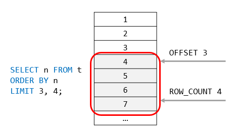
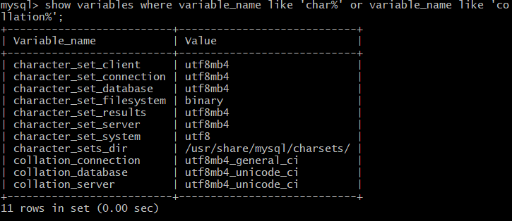
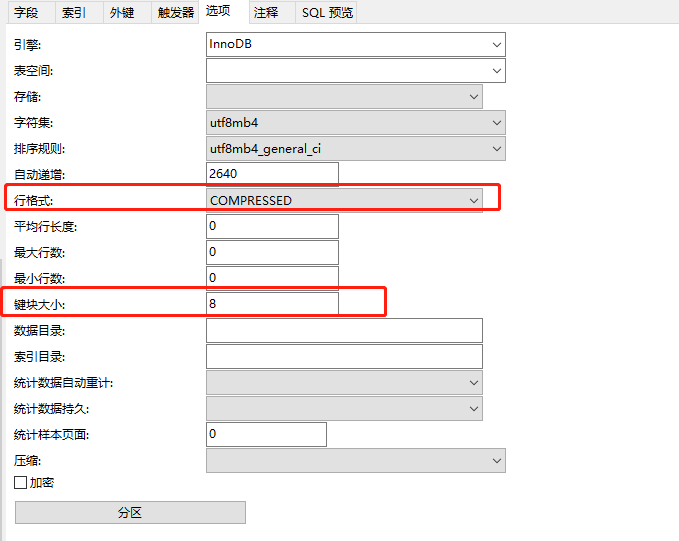

# 一 开始

## 介绍

* 数据库: 是数据的结构化集合.
* 数据库管理系统(DBMS): 操作数据库的软件, 如Oracle,MySQL等

* 配置,权限,主从复制
* **关键字**大小写不敏感, 其他不确定, 如Linux下数据库名,表名敏感, Windows上不敏感. 很多比较表达式也是不敏感的
* MySQL是一个关系型的, 开源的数据管理系统(DBMS).
* 特性
  * C,C++编写
  * 跨平台
  * 多线程
  * 提供事物和非事物引擎
  * 可嵌入式使用, 即嵌入到单个应用中
* MySQL8新变化
  * 默认`utf8mb4`编码, 之前默认`latin1`编码
  * 建表默认使用`InnoDB`引擎(事物的), ~~之前默认使用`MyISAM`引擎(非事物的)~~
  * 支持角色权限管理
  * 增强了`InnoDB`引擎功能
  * 增强了`JSON`存储功能

## 语法表示

* `[` 和 `]`表示其中的单词或语句可选

  ```mysql
  DROP TABLE [IF EXISTS] tbl_name
  ```

* `|`表示多个选项可选择一个, 可配合`[]`或`{}`使用

  ```mysql
  #与[]使用, 选择一个或零个
  TRIM([[BOTH | LEADING | TRAILING] [remstr] FROM] str)
  #与{}使用, 必须选择一个
  {DESCRIBE | DESC} tbl_name [col_name | wild]
  ```

* `...`表示语句省略, 或前面语法的重复

  ```mysql
  #仅表示部分语法省略
  SELECT ... INTO OUTFILE
  #与[]使用, 表示前面的语句重复
  RESET reset_option [,reset_option] ...
  ```

# 二 安装

官方网站给出了多种安装方式, 如源码安装,压缩包安装, 二进制安装(如`.deb`文件). 尽管可以通过包管理器 (如`apt`,`yum`) 来安装, 可能安装的并不是最新版的. 如果使用官方仓库源, 也不能保证兼容性.

因此这里使用压缩包方式安装MySQL8, 它适用于大多数发行版. 这里本系统为Deepin.

1. **环境预处理**: 安装前, 先删除原有mysql, 和配置,数据等文件, 如`/etc/my.cnf`或`/etc/mysql/`

2. **MySQL依赖**: mysql依赖于`libaio`库, 安装前先检查下是否已安装, 一般情况都有

   ```bash
   #检查是否已安装, 看是否提示已安装
   apt search libaio
   #安装
   apt install libaio1 #为啥多了个1? 因为仓库中名字就是这个..
   ```

3. **下载**: 通过浏览器下载, 地址:[Download MySQL Community Server](<https://dev.mysql.com/downloads/mysql/>); 或使用curl下载, 如下所示

   ```bash
   curl -L  https://dev.mysql.com/get/Downloads/MySQL-8.0/mysql-8.0.16-linux-glibc2.12-x86_64.tar.xz -O
   ```

4. **解压**: 解压后, 可以凭自己喜好存于某个位置

   ```bash
   tar -xJvf mysql-8.0.16-linux-glibc2.12-x86_64.tar.xz
   ```

5. **创建mysql用户**: 官网建议, 以非root用户运行mysqld, 有助于安全性. 这里创建了`mysql`用户

   ```bash
   # 创建一个不能登录的系统用户mysql, 默认也创建了组
   useradd -r -s /bin/false mysql
   ```

6. **初始化mysqld** : 在这个过程中会建立root用户, 生成权限表等, 并存入数据目录中, 如果不存在会自动生成, 经测试为`data`目录, 而不是官方说的`mysql-files`(这是一个坑)!  初始化有以下两种方式:

   > mysqld就是mysql服务端程序, 这里就是初始化该程序.
   >
   > 下面我们会通过`--user`指定mysqld以`mysql`身份运行, 由于切换身份需要root权限, 所以还要加上`sudo`
   >
   > 该数据目录是mysqld存放数据库等文件的地方, 此时该文件夹的拥有者为mysql, 也就是说mysqld以mysql身份运行时只能写该目录内的数据, 大大保证了安全性

   * `--initialize`: 生成root密码, 打印在控制台

     ```bash
     sudo bin/mysqld --initialize --user=mysql
     ```
     
     > 若控制台未打印, 则可查看`data/`下的`mysql.err`文件
     
   * `-initialize-insecure`: root账户无密码

     ```bash
     bin/mysqld --initialize-insecure --user=mysql
     ```

   > 可更改数据目录, 如`--datadir=/data/mysql`

   > 注意!!!
   >
   > 如果这一步失败, 说明mysql无访问当前目录的权限, 无法创建`data/`目录中相关内容, 请至少赋予`other` `x`权限

7. **运行mysqld** : 同样的, 以`mysql`身份运行, 这里的mysqld_safe一个启动mysqld方便的工具.

   ```bash
   sudo bin/mysqld_safe --user=mysql &
   ```

8. **修改root密码**: `mysql`是一个命令行客户端, 在bin目录下, 最好设置环境变量, 这里略.

   ```bash
   #root有密码的登录方式
   mysql -u root -p 
   #root无密码的登录方式
   mysql -u root --skip-password
   #进入后修改密码
   ALTER USER 'root'@'localhost' IDENTIFIED BY 'root-password';
   ```

   > 此时mysql的`root`用户只能在服务器上登陆, 若向从其他主机上登陆呢? 见第五章-[权限控制]
   >
   > 修改完后请关闭msyqld, 怎么关? 思路是使用`ps`的到进程号, `kill`杀死它

9. **增加安全性**(可选) : mysql提供了`mysql_secure_installation`脚本来配置msyqld安全方面的配置, 功能如

   * 设置root账户密码

   * 阻止外部访问root账户

   * 删除匿名用户

   * 等等

     > 使用后最直观感受是, 用户密码不能是简单的123456了, 必须复杂... 开发环境下不建议使用.

   ```bash
   #直接运行即可
   mysql_secure_installation
   ```

10. **自启配置**: 我们要自启的是mysqld, 但是我不熟悉它的配置, 但是它提供了一个`mysql.server`, 能够方便的开启和关闭mysqld. 该脚本被写死了, 它规定mysql必须存在于`/usr/local/`下, 目录名`mysql`, 这里我使用符号连接来解决:

    ```bash
    ln -s $PWD/mysql-8.0.16-linux-glibc2.12-x86_64 /usr/local/mysql
    ```

    deepin使用systemd来管理启动程序的, 它兼容Sys V, 因此也可使用Sys V的方式来让mysql加入自启, 如:

    ```bash
    cp support-files/mysql.server /etc/init.d/mysql.server
    ```

    但新时代就用新方法, 这里通过Systemd的方式加入自启, 在`/usr/lib/systemd/system/`目录下创建配置文件`mysqld.service`

    ```plain
    [Unit]
    Description=MySQL Server
    After=network.target local-fs.target remote-fs.target
    
    [Service]
    Type=forking
    PIDFile=/usr/local/mysql/data/sidian-PC.pid
    ExecStart=/usr/local/mysql/support-files/mysql.server start
    ExecStop=/usr/local/mysql/support-files/mysql.server stop
    ExecReload=/usr/local/mysql/support-files/mysql.server restart
    User=mysql
    
    [Install]
    WantedBy=multi-user.target
    ```
    
    > 要注意点是, PIDFile的名字一般为你电脑的域名, 如我的`sidian-PC`, 通过`hostname`命令获取.
    >
    > `User`选项规定mysql以mysql身份运行.
    
    接下来启动它
    
    ```bash
    sudo systemctl enable mysqld.service # 加入自启
    sudo systemctl start mysqld.service # 现在启动mysqld
    ```
    
    > 或(Sys V方式)
    >
    > ```shell
    > service mysql start
    > ```
    
    大功告成!
    
    

> 参考
>
> * [Installing and Upgrading MySQL](<https://dev.mysql.com/doc/refman/8.0/en/installing.html>) : 简述安装的大致步骤
> * [Postinstallation Setup and Testing](<https://dev.mysql.com/doc/refman/8.0/en/postinstallation.html>) : 初始化设置

-------------

一个供参考的配置文件

```conf
[mysqld]
bind-address=0.0.0.0
port=3306
user=mysql
basedir=/usr/local/mysql
datadir=/data/mysql
socket=/tmp/mysql.sock
log-error=/data/mysql/mysql.err
pid-file=/data/mysql/mysql.pid
# Disabling symbolic-links is recommended to prevent assorted security risks
symbolic-links=0
#character config
character_set_server=utf8mb4
explicit_defaults_for_timestamp=true
wait_timeout=31536000
interactive_timeout=31536000
net_read_timeout=6000
net_write_timeout=6000
max_connections=1000
# Settings user and group are ignored when systemd is used.
# If you need to run mysqld under a different user or group,
# customize your systemd unit file for mariadb according to the
# instructions in http://fedoraproject.org/wiki/Systemd

# 设置SQL模式
sql_mode =STRICT_TRANS_TABLES,NO_ZERO_IN_DATE,NO_ZERO_DATE,ERROR_FOR_DIVISION_BY_ZERO,NO_ENGINE_SUBSTITUTION

[mysqld_safe]
#log-error=/var/log/mariadb/mariadb.log
#pid-file=/var/run/mariadb/mariadb.pid

#
# include all files from the config directory
#
!includedir /etc/my.cnf.d
```

# 三 基础

* `mysql`是一个连接mysql服务端的客户程序, 提供命令行界面.


## 连接与断开

* 连接到远程主机

  ```bash
  shell> mysql -h host -u user -p
  Enter password: ********
  ```

* 连接到本地

  ```bash
  shell> mysql -u user -p
  ```

* 在mysql中退出

  ```mysql
  quit
  # 或
  exit
  ```

* 连接的时候同时指定密码

  ```
  mysql -u root -p123456
  ```

## 查询常识

* SQL语句后接`;` , 一些语句不用,如 `exit`,`use`
* 查询时, 语句在server上执行, client显示结果
* 列名通常为表列名, 也可以是表达式.

* 大小写不敏感

* 查询时可以进行表达式计算

* 查看当前用户

  ```mysql
  select user();
  ```

* 查看当前被选择的数据库

  ```mysql
  select database();
  ```
  
* 布尔运算以0和1作为返回值

## 创建和使用数据库

* `SHOW DATABASES;` 显示你有权限查看的数据库

* `USE test` 使用(选择)一个数据库

* 赋予数据库全部权限给某个用户

  ```mysql
  mysql> GRANT ALL ON menagerie.* TO 'your_mysql_name'@'your_client_host';
  ```

* 创建数据库

  ```mysql
  mysql> CREATE DATABASE menagerie;
  ```

* `SHOW TABLES;` 查看所选数据库的表

* 创建表

  ```mysql
  mysql> CREATE TABLE pet (
      	name VARCHAR(20), 
      	owner VARCHAR(20),
          species VARCHAR(20), 
      	sex CHAR(1), 
      	birth DATE, 
      	death DATE
  	);
  ```

* `describe pet;` 查看表结构

* `load data`语句可以从文件中读取固定格式的数据并插入表中, 感觉不太满意, 用法略. 当然, 以`mysql`身份运行时只能访问`data`数据目录.


## 查询进阶

* `select`常用形式

  ```mysql
  SELECT what_to_select #选出什么内容,a list of columns或 * 表示所有列
  FROM which_table  # 表名
  WHERE conditions_to_satisfy; #选择条件, 可选
  ```

* 比较

  * 字符比较是大小写不敏感的
  * 是否为`null`, 只能使用操作符`is not null`或`is null`
  * 0和NULL表示false, 其他的true

* 选择某一列时, 可能会重复, 可通过`distinct`去掉

  ```mysql
  SELECT DISTINCT owner FROM pet;
  ```

* 通过`where`限制行范围, 设置column lists选择特定列

* 排序`order by`

  * 默认递增排序, 大小写不敏感

    ```mysql
    SELECT name, birth FROM pet ORDER BY birth;
    ```

  * 可指定大小写敏感

    ```mysql
    ORDER BY BINARY col_name
    ```

  * 可指定降序排序

    ```mysql
    SELECT name, birth FROM pet ORDER BY birth DESC;
    ```

  * 排序多列, 不同升降序

    ```mysql
    SELECT name, species, birth FROM pet
           ORDER BY species, birth DESC;
    ```

* 日期计算: 提供了相关的函数操作日期

  * 计算年龄

    ```mysql
    SELECT name, birth, CURDATE(),
    TIMESTAMPDIFF(YEAR,birth,CURDATE()) AS age
    FROM pet;
    ```

  * 选择下一个月生日的宠物

    ```mysql
    SELECT name, birth FROM pet
           WHERE MONTH(birth) = MONTH(DATE_ADD(CURDATE(),INTERVAL 1 MONTH));
    ```

    

* NULL值: 表示没有值, 注意, `0`和`''`是有值的(not null)
  * NULL参与的算术比较总是NULL
  * 判断是否为NULL, 使用操作数`is null`和`is not null`
  * 在`group by`中, 两个NULL被视为相等
  * 在`order by`中, NULL被当作最小来排序

*   模式匹配: 支持标准SQL模式匹配和正则表达式, 默认大小写不敏感 ,

  * 标准SQ: 操作符使用`LIKE`或`
    NOT LIKE`, 仅当模式匹配整个字符串时true
    * `_`匹配单个字符
    * `%`匹配0到多个任意字符

  * 正则: 使用[`REGEXP_LIKE()`](https://dev.mysql.com/doc/refman/8.0/en/regexp.html#function_regexp-like)函数或[`REGEXP`](https://dev.mysql.com/doc/refman/8.0/en/regexp.html#operator_regexp) or [`RLIKE`](https://dev.mysql.com/doc/refman/8.0/en/regexp.html#operator_regexp) 操作符, 成功匹配字符串内一段内容也true, 如果想匹配整个字符串, 使用边界定位符, 如`^`,`$`

    > 注意大小写也不敏感, 有多种方法解决, 见[Pattern Matching](<https://dev.mysql.com/doc/refman/8.0/en/pattern-matching.html>)

* `count(*)`计算组的个数, 通过`group by`分组, 没有时视整个表为一组.

* 多表连接

  ```mysql
  mysql> SELECT pet.name,
         TIMESTAMPDIFF(YEAR,birth,date) AS age,
         remark
         FROM pet INNER JOIN event
           ON pet.name = event.name
         WHERE event.type = 'litter';
  ```

  `from`语句上指定多个表连接成一张表, `inner join`或`join`(内连接)表示连接类型, 还有外连接, `on`指定连接条件. 内连接表示两张表中的记录必须满足条件才能放入结果表中. 

  除此之外, 还可与自身连接

  ```mysql
  mysql> SELECT p1.name, p1.sex, p2.name, p2.sex, p1.species
         FROM pet AS p1 INNER JOIN pet AS p2
           ON p1.species = p2.species
           AND p1.sex = 'f' AND p1.death IS NULL
           AND p2.sex = 'm' AND p2.death IS NULL;
  ```

  取个不同别名即可当作两张表使用

## 获取数据库,表信息

* 显示所有数据库[`SHOW DATABASES`](https://dev.mysql.com/doc/refman/8.0/en/show-databases.html)
* 当前被选择的数据库`SELECT DATABASE();`

* 显示被选择数据库的所有表`SHOW TABLES;`

* 显示表结构

  ```mysql
  mysql> DESCRIBE pet;
  +---------+-------------+------+-----+---------+-------+
  | Field   | Type        | Null | Key | Default | Extra |
  +---------+-------------+------+-----+---------+-------+
  | name    | varchar(20) | YES  |     | NULL    |       |
  | owner   | varchar(20) | YES  |     | NULL    |       |
  | species | varchar(20) | YES  |     | NULL    |       |
  | sex     | char(1)     | YES  |     | NULL    |       |
  | birth   | date        | YES  |     | NULL    |       |
  | death   | date        | YES  |     | NULL    |       |
  +---------+-------------+------+-----+---------+-------+
  ```

  其中, `Field`表示字段名(列名), `Type`表示字段类型, `Null`表示字段是否允许为空, `key`表示该字段是否被索引, 如主键`PRI`, `Default`表示字段默认值, `Extra`表示额外信息, 如`auto_increment`等, 详细见[show columns](<https://dev.mysql.com/doc/refman/8.0/en/show-columns.html>)

* 显示建表语句[`SHOW CREATE TABLE`](https://dev.mysql.com/doc/refman/8.0/en/show-create-table.html)

* 显示表的索引`SHOW INDEX FROM tbl_name`

## 批处理模式

即一次执行文件中的大量sql语句

* 从文件中读取sql语句, 结果输出到文件中(默认到控制台上)

  ```bash
  shell> mysql -h host -u user -p < batch-file  >mysql.out
  Enter password: ********
  ```

  * 加上`--force`, 即使部分语句错误也不会导致脚本停止
  * `-t`输出内容与交互模式一致
  * `-v`输出被执行的语句

* mysql内读取文件

  ```mysql
  mysql> source filename;
  mysql> \. filename
  ```

  

## 通用查询例子

* `select`,`from`,`where`语句中都可使用子查询, 子查询又分为相关子查询和非相关子查询, 相关子查询使用到了外层查询的内容. 通常情况下子查询可转化为多表连接来解决, 并且效率更高

* `limit`限制查询个数

* 将查询结果存入变量中, 然后使用, 如

  ```mysql
  mysql> SELECT @min_price:=MIN(price),@max_price:=MAX(price) FROM shop;
  mysql> SELECT * FROM shop WHERE price=@min_price OR price=@max_price;
  ```

* InnoDB支持外键约束, 其他引擎无作用, 仅用作注释
* `auto_increment`列, 在没有被赋值或赋null时, 会以递增的方式自动设置 ,从1开始. 产生的值可通过[`LAST_INSERT_ID()`](https://dev.mysql.com/doc/refman/8.0/en/information-functions.html#function_last-insert-id)获取.

## 其他

* 转义

  列名, 表名, 数据库名可能会与保留字冲突, 需要转义, 如

  ```
  select `name` from `student`
  ```

* 注释

  ```sql
  # 我是注释
  ```

# 详细语法

## limit

```sql
SELECT 
    select_list
FROM
    table_name
LIMIT [offset,] row_count;
```

- The `offset` specifies the offset of the first row to return. The `offset` of the first row is 0, not 1.
- The `row_count` specifies the maximum number of rows to return.




# 四 MySQL Server管理

* server**系统**变量: 系统变量用来控制server行为, 每个系统变量都有默认值. `select`语句查看, `set`语句态修改.  查询时加上`@@GLOBAL.`

  > 变量分为系统变量和会话变量

* mysqld是mysql服务端程序, 默认配置见`mysqld --verbose --help`. 配置文件读取顺序如下
  * `/etc/my.cnf`
  * `/etc/mysql/my.cnf`
  * `/usr/local/mysql/etc/my.cnf`
  * `~/.my.cnf`

  > mysqld和mysql使用同一个配置文件, 使用`[mysqld]`,`[mysql]`来区分配置
  
* 查看mysqld当前配置或可配置选项

  ```mysql
  mysqld --verbose --help |less
  ```

* 查看当前server系统变量

  ```mysql
  mysql> SHOW VARIABLES;
  ```

* 查看当前server状态

  ```mysql
  mysql> SHOW STATUS;
  ```

* [时区](https://dev.mysql.com/doc/refman/8.0/en/time-zone-support.html)
  
  * 系统时区: 默认使用操作系统的时区

  * 会话时区: 客户端使用的时区, 默认为系统时区. 会影响 [`NOW()`](https://dev.mysql.com/doc/refman/8.0/en/date-and-time-functions.html#function_now) or[`CURTIME()`](https://dev.mysql.com/doc/refman/8.0/en/date-and-time-functions.html#function_curtime)的值, 不会影响[`UTC_TIMESTAMP()`](https://dev.mysql.com/doc/refman/8.0/en/date-and-time-functions.html#function_utc-timestamp) 和[`DATE`](https://dev.mysql.com/doc/refman/8.0/en/datetime.html), [`TIME`](https://dev.mysql.com/doc/refman/8.0/en/time.html), or [`DATETIME`](https://dev.mysql.com/doc/refman/8.0/en/datetime.html) 字段的值, 这些字段的数据类型是与时区无关的. 但会影响[`TIMESTAMP`](https://dev.mysql.com/doc/refman/8.0/en/datetime.html) 字段的值, 存储时会转化为UTC再存储, 取出时转化为会话时区再显示.
  
  * 查看系统, 会话时区 :
  
    ```mysql
    SELECT @@GLOBAL.time_zone, @@SESSION.time_zone;
    ```
  
* 数据目录: mysql server管理的数据都会被存入数据目录中, 在这里为`mysql-x.x.x/data`目录, 该目录下的大致内容如下所示
  * 所有的数据库文件
  * 日记
  * SSL和RSA证书及秘钥
  * server进程id文件(`.pid`)

* 字符编码配置

  ```mysql
  [client]
  default-character-set=utf8mb4
  [mysql]
  default-character-set=utf8mb4
  [mysqld]
  character-set-server=utf8mb4
  collation-server = utf8mb4_unicode_ci
  ```

  然后重启mysqld, 进入mysql查看

  ```mysql
   show variables where variable_name like 'char%' or variable_name like 'collation%'
  ```

  
  
* SQL Mode配置, 避免出现`ONLY_FULL_GROUP_BY`的问题

  `my.cnf`

  ```
  sql_mode =STRICT_TRANS_TABLES,NO_ZERO_IN_DATE,NO_ZERO_DATE,ERROR_FOR_DIVISION_BY_ZERO,NO_ENGINE_SUBSTITUTION
  ```

# 五 权限控制

* 用户的**标识**(identity)由`host`(主机)和`username`(用户名)决定, 而不是`username`决定, 然后授权也是根据这个标识授权的. 简而言之, 即使使用同一个用户名在不同地方访问mysql server可能会有不同的权限, 可通过以下命令打印该标识的权限:

    ```mysql
    SHOW GRANTS FOR 'joe'@'office.example.com';
    SHOW GRANTS FOR 'joe'@'home.example.com';
    ```

* 账户密码存在`mysql`数据库的`user`表中, 密码也不是明文储存, 加了密的.

* 账户名: 由`host`和`username`组成, 形式大致如下

  ```mysql
  'user_name'@'host_name'
  ```

  * 名字合法的情况下可省略引号
  * `host_name`可以使用sql的通配符
  * 仅给出用户名时, 如`user_name`, 相当于`'user_name'@'%'` 即允许任何主机访问
  * 用户名为空时, 如`''@'localhost'` 是匿名用户
  * 允许部分主机访问可使用通配符, 如`'user_name'@'198.51.100.%'` 或者使用子网掩码, 如`'david'@'198.51.100.0/255.255.255.0'`

* 创建账户: 同时给出账户名和密码

  ```mysql
  CREATE USER 'user_name'@'host_name' IDENTIFIED BY 'your_password';
  ```

* 修改密码

    ```shell
    use mysql;
    ALTER USER 'root'@'localhost' IDENTIFIED BY '要修改的密码';
    ```

* 修改用户host

    > 仅Mysql 8可用, Mysql5.7可考虑创建新账号, 如`root@%`

    ```shell
    update user set host = "%" where user='root';
    ```

* 角色: 略

* 授权: 这里直接给出授权一个数据库所有权限的例子

  ```mysql
  GRANT ALL ON db_name.* TO 'user_name'@'host_name';
  ```

* **刷新**(重要!!!!!!)

  修改权限或账号后, 请让服务器重新加载权限表

  ```shell
  FLUSH PRIVILEGES;
  ```


# 六 数据类型

* 数据类型大致分类: 

  * numeric types 
  * date and time types
  * string (character and byte) types
  * spatial types
  * [`JSON`](https://dev.mysql.com/doc/refman/8.0/en/json.html) data type.

* 描述约定

  * `M`, 在数值类型中, 表示最大**显示**宽度; 在浮点与定点数值类型中, 表示**存储**时的数字个数(**精度**); 在字符类型中, 表示**字符**长度, 但M的最大值取决于数据类型和字符编码.
  * `D`, 用在浮点和定点类型中, 表示小数点后数字的个数(scale). 最大值可为30, 但不应该超过`M-2`
  * `fsp`用于`TIME`,`DATETIME`和`TIMESTAMP`类型中, 表示秒小数部分的位数. 选值范围0-6, 默认0, 与标准SQL默认的6相反.
* `[`和`]`表示类型定义中可选的部分

一些数据类型是同一个, 仅为了兼容性, 如兼容标准SQL类型.

## Numeric

* 修饰属性
  * 显示宽度属性, `zerofill`属性将被弃用
  * 允许`unsigned`和`signed`属性(默认), 修饰在浮点数上的方式将被弃用
* 整形数值类型

    | 类型            | 位数 | 最大值(unsigned)     |
    | --------------- | ---- | -------------------- |
    | `TINYINT`       | 1    | 255                  |
    | `SMALLINT`      | 2    | 65535                |
    | `MEDIUMINT`     | 3    | 16777215             |
    | `INT`,`INTEGER` | 4    | 4294967295           |
    | `BIGINT`        | 8    | 18446744073709551615 |

    > 后接`(M)`控制显示宽度, 无用且弃用.

* 定点数: `DECIMAL[(M[,D])]`,`NUMERIC[(M[,D])]`两者无区别, 存精确的值, 适用于保存货币数据. 默认`M`为10, `D`为0

* 浮点数: `FLOAT`表示4字节单精度浮点数, `DOUBLE`表示8字节双精度浮点数. 浮点数是近似值, 受限于平台实现. 一般进度分别为7,15位, 也可通过`(M,D)`限制它(一般不限制). 未来将被弃用.

* 位值(`BIT(M)`): 存二进制数据, 略
* `BOOL`, `BOOLEAN`: 与`TINYTIN(1)`无区别, 但非0视作true, 0视为false. 注意关键字`true`与`false`分别对应0和1, 2不等于`true`!!

## 时间

有的类型后接`(fsp)`, 表示秒的小数位数, 可选值0-6, 默认0.

类型如下

| 类型        | 范围                                                         |
| ----------- | :----------------------------------------------------------- |
| `DATE`      | '1000-01-01' to '9999-12-31'                                 |
| `TIME`      | '-838:59:59.000000' to '838:59:59.000000'                    |
| `DATETIME`  | '1000-01-01 00:00:00.00000' to '9999-12-31 23:59:59.999999'  |
| `TIMESTAMP` | '1970-01-01 00:00:01.000000' UTC to '2038-01-19 03:14:07.999999'utc |
| `YEAR`      | 1901 to 2155                                                 |

> `datetime`与`timestamp`
>
> 两者都能获取和存入`YYYY-MM-DD hh:mm:ss`类型的时间, 但是`timestamp`实际上存入的是从`'1970-01-01 00:00:00' UTC`到现在的时间戳. 当取出时, 将时间戳根据当前会话时区转化为时间, 存入时将时间转化为UTC时区的时间戳后才存入.
>
> 因此, 改变当前时区后, 相同的`timestamp`值得到不同的时间, 因为时区不同.

## 字符串

* 修饰属性

  * `character set`或`charset`指定编码
  * `collate`指定排序顺序

* 字符串: 以下类型中`M`均表示**字符**长度. **说三遍**, 字符,字符,字符!!!

  | 类型                      | 描述                                                         |
  | ------------------------- | ------------------------------------------------------------ |
  | `char(M)`或`character(M)` | 定长字符串. `M`范围0到255个, 默认1                           |
  | `varchar(M)`              | 可变长字符串. **字节**大小不能超过2^16^-1, <br />通过一个2字节前缀记录长度.<br />一个例子, 假设每个utf-8字符占3字节, 则`M`最大值为21833. |
  | `tinytext`                | 可变长字符串, 字节大小不超过2^8^-1, 1字节前缀记录长度        |
  | `text(M)`                 | 可变长字符串, 字节大小不超过2^16^-1, 2字节前缀记录长度<br />与`varchar(M)`类似, 但`M`是可选的, 且退化为定长字符串 |
  | `mediumtext`              | 可变长字符串, 字节代销不超过2^24^-1, 3字节前缀               |
  | `longtext`                | 可变, 不超过2^32^-1, 4字节前缀                               |

* 字节串: 即存二进制数据的, 以下类型中`M`就是表示**字节**个数

  | 类型           | 描述                                          |
  | -------------- | --------------------------------------------- |
  | `binary(M)`    | 定长字节串, `M`范围0-255, 默认1               |
  | `varbinary(M)` | 可变字节串, 字节数(M)不超过2^16^-1, 2字节前缀 |
  | `tinyblob`     | 可变字节串, M不超过2^8^-1, 1字节前缀          |
  | `blob`         | 可变字节串, M不超过2^16^-1, 2字节前缀         |
  | `mediublob`    | 可变字节串, M不超过2^24^-1, 3字节前缀         |
  | `longblob`     | 可变字节串, M不超过2^32^-1, 4字节前缀         |

> text与blob系列类型: 是专门用来存储大数据的, 会不会影响表查询效率? 我想应该不会吧, mysql应该会对该类型做相应的优化. 

* `enum`, `set`略

# 函数

> 参考 [Reference](https://dev.mysql.com/doc/refman/8.0/en/sql-function-reference.html)

## 时间

*  [`FROM_UNIXTIME()`](https://dev.mysql.com/doc/refman/8.0/en/date-and-time-functions.html#function_from-unixtime) 转化时间戳 (单位s) 为Date

  ```sql
  SELECT FROM_UNIXTIME(1447430881);
          -> '2015-11-13 10:08:01'
  ```

* [`UNIX_TIMESTAMP()`](https://dev.mysql.com/doc/refman/8.0/en/date-and-time-functions.html#function_unix-timestamp) 转化Date为时间戳 (单位s)

  ```sql
  SELECT UNIX_TIMESTAMP('2005-03-27 03:00:00');
  ```


## 组

* [`GROUP_CONCAT(*`expr`*)`](https://dev.mysql.com/doc/refman/8.0/en/aggregate-functions.html#function_group-concat) 合并组的元素

# 命令

## mysql

* `-u` 用户名
* `-p` 密码, 可空着, 之后会提示填. 或写在命令行上, 但与`-p`之间不能有空格
* `-P` Server端口
* `-h` Server地址

## 备份与恢复

* 备份所有数据库

  ```shell
  mysqldump -u root -p --ignore-table=mysql.innodb_index_stats --ignore-table=mysql.innodb_table_stats --all-databases > all-databases.sql
  ```

  > `innodb_index_stats`和`innodb_table_stats`表在恢复时会报错, 所以备份时需要忽略

* 迁移数据

  ```shell
  mysqlpump -u root -p  --exclude-databases=information_schema,mysql,performance_schema,sys  --all-databases --add-drop-database --add-drop-table > all-databases.sql
  ```

  > 一般迁移, 仅迁移数据的吧, 就不备份系统数据库了.

  > 与mysqldump相比, mysqlpump是更强大的工具

* 指定数据库备份

  ```shell
  mysqlpump -u root -p --include-databases=db_tcm_symptom,db_tcm_disease,db_tcm_syndrome --add-drop-database --add-drop-table > all-databases.sql
  ```


* 恢复

  ```shell
  mysql -u root -p < all-databases.sql
  ```
  
  > 实际上就是执行备份的sql
  
* 远程恢复

  ```shell
  mysql -h host -u root -p < all-databases.sql
  ```

  > `-P`指定端口

> 参考: [MySQL Backup and Restore Commands for Database Administration](https://www.tecmint.com/mysql-backup-and-restore-commands-for-database-administration/)

# 其他

* 对于大文件，经常访问的可以存入数据库，数据库有对应字段，应该是优化过了的，为大字段单独存一张表应该没必要。但是不经常访问，或则实在太大了，则放入文件中。
* utf8 vs. utf8mb4 : UTF-8是一种可变长编码方式, 字符可由1到4个字节编码. 但在MySQL中的UTF-8实际上最多只存3个字节, 实际上是utf8mb3, 仅涵盖BMP编码集; 而utf8mb4能够存四字节编码的字符.
* 导入导出方法: [`LOAD DATA`](https://dev.mysql.com/doc/refman/8.0/en/load-data.html) and [`SELECT ... INTO OUTFILE`](https://dev.mysql.com/doc/refman/8.0/en/select-into.html) , 受[secure_file_priv](<https://dev.mysql.com/doc/refman/8.0/en/server-system-variables.html#sysvar_secure_file_priv>)变量影响

## 变量

MySQL变量分为系统变量和会话变量. 

### 系统变量

* 查看所有系统变量

  ```mysql
  mysql> SHOW VARIABLES;
  ```

* 设置系统变量

  ```mysql
  SET GLOBAL time_zone = '+8:00';
  SET GLOBAL time_zone = 'Europe/Helsinki';
  SET @@global.time_zone = '+00:00';
  ```

* 查看系统变量

  ```mysql
  mysql> SELECT @@GLOBAL.time_zone;
  ```

### 会话变量

* 查看所有会话变量: ??? 不会

* 设置会话变量

  ```mysql
  SET time_zone = 'Europe/Helsinki';
  SET time_zone = "+00:00";
  SET @@session.time_zone = "+00:00";
  ```

* 查看会话变量

  ```mysql
  SELECT @@SESSION.time_zone;
  ```

### 其他

* 模糊查询

  ```shell
  show variables like '%Aborted%';
  ```

  

## 连接参数

在编程语言中, 连接MySQL server需要提供URL, 常用URL如

```url
jdbc:mysql://localhost:3306/database_name?useSSL=false&serverTimezone=GMT%2B8&allowPublicKeyRetrieval=true&createDatabaseIfNotExist=true&charset=utf8
```

* `useSSL`是否使用安全套接字

* `serverTimezone`设置会话时区

  > 由于url不允许存在`+`, 因此需要实现进行urlencode编码.

* `allowPublicKeyRetrieval`不知道

* `createDatabaseIfNotExist` 若数据库不存在, 则自动创建

* `charset`设置字符编码

> <span style="color:red">注意</span>, 如果出现链接错误, 可能是`useSSL`造成的, 其他选项可以不用, 仅设置时区也行.
>
> ```
> jdbc:mysql://localhost:3306/database_name?serverTimezone=GMT%2B8
> ```

> 参考:
>
> * [Connection URL Syntax](https://dev.mysql.com/doc/connector-j/8.0/en/connector-j-reference-jdbc-url-format.html)
>
> * [Configuration Properties](https://dev.mysql.com/doc/connector-j/8.0/en/connector-j-reference-configuration-properties.html)

# 坑

## too many connections

Mysqld连接数上线太小了, 100左右, 应用的线程池空闲时间又太长, 连接得不到释放, 导致其他应用获取不到连接.

查看最大连接数

```sql
mysql>  show variables like 'max_connections'; 
+-----------------+-------+
| Variable_name   | Value |
+-----------------+-------+
| max_connections | 151   |
+-----------------+-------+
1 row in set (0.01 sec)
```

临时设置

```mysql
mysql> set GLOBAL max_connections=1000; 
Query OK, 0 rows affected (0.00 sec)
--查看
mysql>  show variables like "max_connections";
+-----------------+-------+
| Variable_name   | Value |
+-----------------+-------+
| max_connections | 1000  |
+-----------------+-------+
1 row in set (0.00 sec)
```

永久设置

```
[mysqld]
max_connections=1000
```

但是, 如果看日志的话, 会发现, 因为某种限制, 最大连接数达不到1000, 仅214. 这里修复`mysqld.service`文件, `[Service]`中添加:

```systemd
[Service]
LimitNOFILE = 65535
```

## sql_mode

```
# 设置SQL模式
sql_mode =STRICT_TRANS_TABLES,NO_ZERO_IN_DATE,NO_ZERO_DATE,ERROR_FOR_DIVISION_BY_ZERO,NO_ENGINE_SUBSTITUTION
```

## Row size too large (> 8126)

> 参考[mysql错误：Row size too large (> 8126).](https://blog.csdn.net/huangbaokang/article/details/90746719)

1. 修改`my.cnf`

   ```
   innodb_file_per_table
   innodb_file_format = Barracuda
   ```

   > 然后重启

2. 修改表属性

   ```
   ALTER TABLE $TABLE
   ENGINE=InnoDB
   ROW_FORMAT=COMPRESSED 
   KEY_BLOCK_SIZE=8;
   ```

在Navicat中传输数据时, 修改出现错误的表:



传输窗口中勾选下列选项


# 待学

* 全文索引
* JSON类型

# 参考

* [MySQL 8.0 Reference Manual](<https://dev.mysql.com/doc/refman/8.0/en/>)

* 推荐阅读, 大佬MySQL笔记:https://zhuanlan.zhihu.com/p/71232689