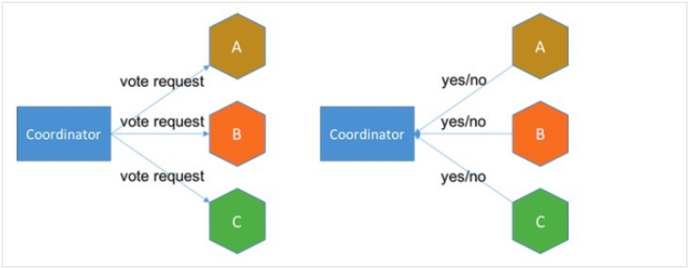
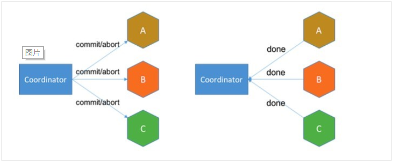

# 事务

## ACID

事务（Transaction）是一组SQL语句，被视作一个工作单元，所有的语句要么全部执行，要么全部不被执行。事务必须满足ACID：
* **Atomicity**（原子性） − A transaction should be treated as a single unit of operation, which means either the entire sequence of operations is successful or unsuccessful.
* **Consistency**（一致性） − This represents the consistency of the referential integrity of the database, unique primary keys in tables, etc.
* **Isolation**（隔离性） − There may be many transaction processing with the same data set at the same time. Each transaction should be isolated from others to prevent data corruption.
* **Durability**（持久性） − Once a transaction has completed, the results of this transaction have to be made permanent and cannot be erased from the database due to system failure.

## 锁

理解原理之前，需要知道，一般DBMS使用**两端封锁协议**（[Two-phase locking][4]）来实现并发控制。主要存在两种锁：**写锁**（独占锁）和**读锁**（共享锁）。

一个对象可能会被加多个锁，或者只有一个锁，说明有的锁是兼容的，有的不是，如下锁兼容性表所示：

| Lock type  | read-lock | write-lock |
| ---------- | --------- | ---------- |
| read-lock  |           | X          |
| write-lock | X         | X          |

> `x`表示不兼容

一个事务尝试对已加过锁的对象加锁时，会判断两者是否兼容，如果不兼容就被阻塞，该事务加入到对象的等待队列中。

> <span style="color:red">另外</span>，不要被锁的名字给迷惑，并不是说加了写锁的对象就一定只能写入。锁只是表明一种意图，而不是规定它的操作。一般对数据增删改(DML)时会加写锁，对数据查(DQL)时会加读锁。
>
> 锁又可分为悲观锁和乐观锁, 在读比较多的情况下, 乐观锁性能较高.

## 隔离性
隔离性主要为了让事务之间互不干扰，但良好的隔离性和性能不可兼得，因此出现了不同的隔离级别，解决不同的问题：

| Isolation Level              | 丢失修改 | Dirty Reads | Non-Repeatable Reads | Phantom Reads |
| :--------------------------- | :------- | :---------- | :------------------- | :------------ |
| TRANSACTION_NONE             | ×        | ×           | ×                    | ×             |
| TRANSACTION_READ_UNCOMMITTED | ✔        | ×           | ×                    | ×             |
| TRANSACTION_READ_COMMITTED   | ✔        | ✔           | ×                    | ×             |
| TRANSACTION_REPEATABLE_READ  | ✔        | ✔           | ✔                    | ×             |
| TRANSACTION_SERIALIZABLE     | ✔        | ✔           | ✔                    | ✔             |

> ×表示未解决，✔表示能够解决
> mysql的默认隔离级别：repeatable_read。

和隔离性相关的问题如下：
* 丢失修改：事务A读取值，之后事务B也读取值并修改然后提交，事务A修改后提交。此时事务B修改的值被丢失。
* 脏读：事务A读取事务B尚未提交的值。如果事务B回滚，则事务A读的值就“脏”了。
* 不可重复读：事务A读取值，事务B修改该值并提交，事务A再次读取该值，发现值不同了。
* 幻读：事务A根据一定条件读取一组数据，事务B插入一组满足该条件的数据并提交，事务A再根据同样条件读取一组数据，发现多了一组数据。

隔离性的实现和锁有关，下面通过讲述各个隔离级别的实现原理：
* read_uncommited：加写锁，直到事务结束释放，解决丢失修改问题。

  > 事务A加写锁, 事务B等待加写锁, A结束后才执行, 从而保证了B的修改不被丢失

* read_commited:在上一级别基础上加读锁，读完立即释放，解决脏读。

  > 事务B加写锁, 事务A等待加读锁, B结束后读取最新数据, 解决脏读

* repeatable_read：在read_uncommited基础上加读锁，直到事务结束释放，解决不可重复读问题。

* serializable：在上一级别基础上加间隙锁等等等等，因此解决了幻读。

> 不加锁, 是可以直接读写的, 获得锁后才读写, 只是为了保证隔离性的一个约定

> 参考：
>
> * [Isolation (database systems)](https://en.wikipedia.org/wiki/Isolation_(database_systems)#Repeatable_reads)
> * [Concurrency control](https://en.wikipedia.org/wiki/Concurrency_control)
> * [Two-phase locking](https://en.wikipedia.org/wiki/Two-phase_locking)

[4]:https://en.wikipedia.org/wiki/Two-phase_locking

# 分布式事务

## 基础储备

### CAP定理

- 一致性 **C**onsistency

  所有节点在同一时间内都存在相同数据

- 可用性 **A**vailability

  任何节点总是可成功读写的

- 分区容错性 **P**artition tolerance

  整个分布式系统在某个节点或分区故障后, 仍能对外提供一致性和可用性的服务.

由于网络延迟, CAP最多只能满足两个

> 详细见文章--零碎知识

### BASE理论

BASE理论是由CAP定理得到的妥协方案

* **BA**指基本业务可用性, 支持分区容错
* **S**表示柔性状态, 即允许短时间数据不一致
* 但最终**E**处于一致性.

下面的分布式事务方案都是以达到BASE理论的要求而存在的.

## 挑战

单机时, 应用知道何时提交事务, 何时回滚. 但在分布式系统中, 有调用关系的节点间, 事务没有关联, 会出现一些节点提交事务, 一些节点回滚事务, 导致数据不一致的问题.

## 解决方案

下面的方案都是以不同的方式让不同节点感知到其他节点的事务状态, 而做出正确的操作 ( 回滚或提交)

### 两阶段提交(2PC)

两阶段提交（Two-phase Commit，2PC），通过引入协调者（Coordinator）来协调参与者的行为，并最终决定这些参与者是否要真正执行事务。

#### 运行过程

1. 准备阶段

   协调者定时询问所有相关节点, 是否业务逻辑执行成功. 

   > 若某个节点未执行完, 且其他节点未出错时, 则等待该该节点的执行结果

   

2. 提交阶段

   若所有节点都执行成功, 则要求他们提交事务; 否则只要一个出错, 都要求他们回滚

   

#### 问题

* 同步阻塞

  所有事务参与者在等待其它参与者响应的时候都处于同步阻塞状态，无法进行其它操作。

* 单点问题

  协调者故障了, 将造成所有节点等待

### 补偿事务(TTC)

补偿事务核心思想: 针对每个操作，都要注册一个与其对应的确认和补偿（撤销）操作.

TTC ( Try Confirm Cancel )是事务补偿机制方案的一种实现, 分为阶段

- Try 阶段主要是对业务系统做检测及资源预留
- Confirm 阶段主要是对业务系统做确认提交，Try阶段执行成功并开始执行 Confirm阶段时，默认 Confirm阶段是不会出错的。即：只要Try成功，Confirm一定成功。
- Cancel 阶段主要是在业务执行错误，需要回滚的状态下执行的业务取消，预留资源释放。

看不懂? 我也感到莫名奇妙的, 略


# 索引

## 介绍

索引是一种特殊的查询表，可以被数据库搜索引擎用来加速数据的检索。简单说来，索引就是指向表中数据的指针。数据库的索引同书籍后面的索引非常相像。

例如，如果想要查阅一本书中与某个特定主题相关的所有页面，你会先去查询索引（索引按照字母表顺序列出了所有主题），然后从索引中找到一页或者多页与该主题相关的页面。

索引能够提高 SELECT 查询和 WHERE 子句的速度，但是却降低了包含 UPDATE 语句或 INSERT 语句的数据输入过程的速度。索引的创建与删除不会对表中的数据产生影响。

创建索引需要使用 CREATE INDEX 语句，该语句允许对索引命名，指定要创建索引的表以及对哪些列进行索引，还可以指定索引按照升序或者降序排列。

同 UNIQUE 约束一样，索引可以是唯一的。这种情况下，索引会阻止列中（或者列的组合，其中某些列有索引）出现重复的条目。

## 创建

**CREATE INDEX**命令的基本语法如下：

```
CREATE INDEX index_name ON table_name;
```

### 单列索引

单列索引基于单一的字段创建，其基本语法如下所示：

```
CREATE INDEX index_name
ON table_name (column_name);
```

### 唯一索引

唯一索引不止用于提升查询性能，还用于保证数据完整性。唯一索引不允许向表中插入任何重复值。其基本语法如下所示：

```
CREATE UNIQUE INDEX index_name
on table_name (column_name);
```

### 聚簇索引

聚簇索引在表中两个或更多的列的基础上建立。其基本语法如下所示：

```
CREATE INDEX index_name
on table_name (column1, column2);
```

创建单列索引还是聚簇索引，要看每次查询中，哪些列在作为过滤条件的 WHERE 子句中最常出现。

如果只需要一列，那么就应当创建单列索引。如果作为过滤条件的 WHERE 子句用到了两个或者更多的列，那么聚簇索引就是最好的选择。

### 隐式索引

隐式索引由数据库服务器在创建某些对象的时候自动生成。例如，对于主键约束和唯一约束，数据库服务器就会自动创建索引。

## 删除

索引可以用 SQL **DROP** 命令删除。删除索引时应当特别小心，数据库的性能可能会因此而降低或者提高。

其基本语法如下：

```
DROP INDEX table_name.index_name;
```

## 使用规范

尽管创建索引的目的是提升数据库的性能，但是还是有一些情况应当避免使用索引。下面几条指导原则给出了何时应当重新考虑是否使用索引：

- 小的数据表不应当使用索引；
- 需要频繁进行大批量的更新或者插入操作的表；
- 如果列中包含大数或者 NULL 值，不宜创建索引；
- 频繁操作的列不宜创建索引。

# 命名

* 表名代表表中的一行

  > 如学生表, 表中每一行都代表一名学生, 表是学生的集合

* 表名应为名词, 单数.

* 前后缀

  * 同一模块中的表要有前缀
  * 除表外, 其他的用加后缀, 如
    * `_V` View (with the main `TableName` in front, of course)
    * `_fk` Foreign Key (the constraint name, not the column name)
    * `_cac` Cache
    * `_seg` Segment
    * `_tr` Transaction (stored proc or function)
    * `_fn` Function (non-transactional), etc.

> 参考[Relational table naming convention ](https://stackoverflow.com/questions/4702728/relational-table-naming-convention)

# Oracle

* 字符串只能使用单引号

* 字段,别名可使用单,双引号. 此时可转义关键字

  > 但IDEA中建议使用双引号和非关键字, 因为语法支持不是很好

# 其他

* `union [all]`连接两个集合, 每项字段类型需一致, 无`all`时会去重

# 参考

* [SQL教程](https://book.itxueyuan.com/alo8?breadcrumb=index)