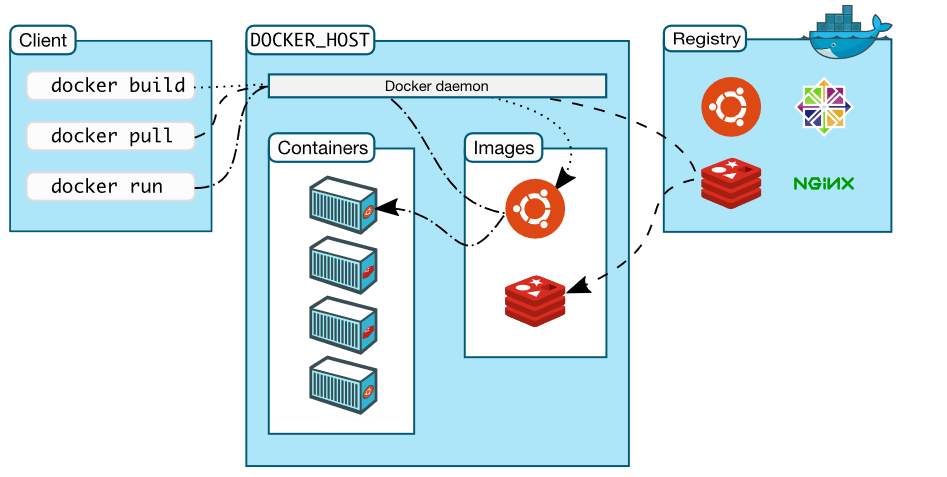
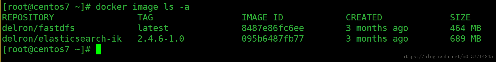

# 开始

## 介绍

> Docker只是方便了应用的分发与管理, 简化运维人员负担. 但于开发者而言, 除了方便搭建依赖组件(MySQL,Redis), 于开发无益, 徒增烦恼. 
>
> 目前okteto项目支持将代码修改同步到容器中, 利用热加载来看到修改的效果. 但体验仍不是很好.

* 基于**进程隔离**技术, 将程序以及其运行环境一起打包, 称之为**镜像**. 镜像可安全的运行在Docker存在的环境中, 而不会出现进程冲突, 此时运行的镜像称为**容器**. ( 类似程序和进程 )

* 与虚拟机本质上的区别是, 容器不带有内核, 容器功能是基于内核提供的进程隔离功能的; 而虚拟机虚拟了物理环境, 需要在该环境上运行操作系统. 

  > 因此有些容器装载了整个Linux发行版, 如Ubuntu, 但却无内容的. 有些容器可仅装可执行文件. 

* 关于性能, 并不会受太大影响, 但是内存可能会消耗更多, 因为运行了多份相同环境.

* Docker provides the ability to package and run an application in a loosely isolated environment called a container. 

* 好处
  * Docker将程序已经环境打包, 让你能够快速分发应用.
  * 使得上线和线下环境一致

* Container

  * Windows Container

    * Windows Server Container

      原生的Windows容器, 于Linux类似, 基于进程隔离 , 运行WIndows的软件.

    * Hyper-V Container

      通过Hyper-V启动**很小的**Linux虚拟机, 然后运行的Linux容器

  * Linux Container

    Linux上的容器

  > 参考
  >
  > * [Windows Container 和 Docker：你需要知道的5件事](https://www.cnblogs.com/ups216/p/6385663.html)
  >* [Windows系统下的Windows Container和Linux Contaner](https://blog.csdn.net/littleworm0/article/details/102626516)

## Docker Engine


Docker Engine是一个提供容器服务的软件, 主要由三部分组成:

1. 运行容器的守护进程dockerd
2. 提供与dockerd交互的Rest API
3. 提供与dockerd交互的命令行客户端.

## 架构



一眼就能看懂的CS架构

* Client

  客户端

* Docker Host

  服务端, Docker Engine提供服务, 同时管理镜像和容器

* Registry

  镜像注册中心, 如Docker Hub

## Docker对象

* 镜像Images

  * 是一个可读的模板, 指导Docker创建容器.
  * 镜像可以基于其他镜像构建, 或者直接构建

* 容器Containers

  * 镜像的运行实例
  * 可以创建, 开始i, 停止, 移动和删除镜像
  * 可以连接容器到网络, 添加存储
  * 默认容器间是隔离的
  * 当容器被删除时, 未写入到持久层的数据都将消失
  
  

## 安装

### Docker Desktop

* 介绍

  Docker Desktop提供了WIndows容器和Linux容器. 

  * Windows容器使用系统本身的进程隔离技术;
  * Linux容器使用Windows原生虚拟机方案Hyper-V创建虚拟机, 进而使用Linux系统的进程隔离技术.

* 安装

  ...

* 卸载

  右键卸载即可, 有些电脑却卡死, 这里给出脚本卸载方式.
  
  新建脚本, 如`remote-docker.ps1`, 内容:
  
  ```powershell
  $ErrorActionPreference = "SilentlyContinue"
  
  kill -force -processname 'Docker for Windows', com.docker.db, vpnkit, com.docker.proxy, com.docker.9pdb, moby-diag-dl, dockerd
  
  try {
  ./MobyLinux.ps1 -Destroy
  } Catch {}
  
  $service = Get-WmiObject -Class Win32_Service -Filter "Name='com.docker.service'"
  if ($service) { $service.StopService() }
  if ($service) { $service.Delete() }
  Start-Sleep -s 5
  Remove-Item -Recurse -Force "~/AppData/Local/Docker"
  Remove-Item -Recurse -Force "~/AppData/Roaming/Docker"
  if (Test-Path "C:\ProgramData\Docker") { takeown.exe /F "C:\ProgramData\Docker" /R /A /D Y }
  if (Test-Path "C:\ProgramData\Docker") { icacls "C:\ProgramData\Docker\" /T /C /grant Administrators:F }
  Remove-Item -Recurse -Force "C:\ProgramData\Docker"
  Remove-Item -Recurse -Force "C:\Program Files\Docker"
  Remove-Item -Recurse -Force "C:\ProgramData\Microsoft\Windows\Start Menu\Programs\Docker"
  Remove-Item -Force "C:\Users\Public\Desktop\Docker for Windows.lnk"
  Get-ChildItem HKLM:\software\microsoft\windows\currentversion\uninstall | % {Get-ItemProperty $_.PSPath}  | ? { $_.DisplayName -eq "Docker" } | Remove-Item -Recurse -Force
  Get-ChildItem HKLM:\software\classes\installer\products | % {Get-ItemProperty $_.pspath} | ? { $_.ProductName -eq "Docker" } | Remove-Item -Recurse -Force
  Get-Item 'HKLM:\software\Docker Inc.' | Remove-Item -Recurse -Force
  Get-ItemProperty HKCU:\software\microsoft\windows\currentversion\Run -name "Docker for Windows" | Remove-Item -Recurse -Force
  #Get-ItemProperty HKCU:\software\microsoft\windows\currentversion\UFH\SHC | ForEach-Object {Get-ItemProperty $_.PSPath} | Where-Object { $_.ToString().Contains("Docker for Windows.exe") } | Remove-Item -Recurse -Force $_.PSPath
  #Get-ItemProperty HKCU:\software\microsoft\windows\currentversion\UFH\SHC | Where-Object { $(Get-ItemPropertyValue $_) -Contains "Docker" }
  ```
  
  以管理员权限打开Powershell, 在里面运行该脚本即可.
  
  > 参考: [How to completely remove Docker in Windows 10](https://success.docker.com/article/how-to-completely-remove-docker-in-windows-10)

### Docker Toolbox

* 介绍

  对于不满足安装Docker Desktop的比较老的Mac和Windows系统, Docker Toolbox提供了传统方案. Toolbox使用VirtualBox而非Hyper-V来创建虚拟机.

* 安装条件

  * 64位
  * Windows7+
  * 使能虚拟化

  > 一般都满足

* 开始安装

  * 下载[Toolbox Releases](https://github.com/docker/toolbox/releases), 并安装

    > 默认就好

  * 安装好后, 双击Docker Quickstart Terminal, 首次打开会进行初始化.

    > 可能会碰到一些问题, 如文件下载失败, 手动下载即可; 还会遇到其他问题, 重试即可; 总之随机应变

  * Ok, 安装完毕. 但是每次重启, 都需要通过Docker Quickstart Terminal来启动Docker. 之后可以在该Terminal中执行Docker命令, 或者在其他终端中执行. ( 命令已添加到PATH下)

> 参考[Docker Toolbox overview](https://docs.docker.com/toolbox/overview/)

### Linux

```shell
apt install docker
```

# 基本使用

## 基础知识

* `docker`命令在Client发起, 但在Docker Daemon中执行. 一般的, 每个Host都配套有Client和Daemon

* `docker build`构建时, 会在本地Daemon中构建, 并产生一个唯一ID, 如`0e5574283393`, 也可在构建的同时加上名字或tag (`--tag`) . 之后也可以为镜像添加别名`docker tag`. 

  > 构建的镜像只有提交并打上标签才会被保存下来, 如
  >
  > ```
  > docker tag 0e5574283393 fedora/httpd:version1.0
  > ```
  >
  > 或
  >
  > ```
  > docker tag 0e5574283393 fedora/httpd:version1.0
  > ```

* 有私有Hub的别名, 配合`docker push`, 能将镜像发布到私有仓库中

* 命令规则:

  ```
  myregistryhost:5000/fedora/httpd:version1.0
  ```

  * 仓库地址

    第一个部分`myregistryhost:5000`, 是私有仓库地址. 若不发布镜像, 则可省略, 镜像存在于本地Host中.

  * 标签

    最后一部分`version1.0` , 是tag表示镜像版本号, 若省略, 则默认`latest`

  * 镜像名

    中间的`/fedora/httpd`是镜像名. 官方Hub中, 最多只有一个`/`,  `/`前的是组名, 可省略. 私有仓库可有多个`/`, 如`a/b/c`

  > 参考[A quick introduction to Docker tags](https://www.freecodecamp.org/news/an-introduction-to-docker-tags-9b5395636c2a/)

* docker很多命令的功能是重复的. 如`docker image push` <=>`docker push`

## 镜像操作

### 列出镜像

```shell
docker image ls -a
```



- REPOSITORY：镜像所在的仓库名称, 也即完整镜像名.
- TAG：镜像标签
- IMAGEID：镜像ID
- CREATED：镜像的创建日期(不是获取该镜像的日期)
- SIZE：镜像大小

镜像有不同版本, 通过标签来表示. 可通过`ubuntu:12.04`的方式使用某具体版本的镜像.

### 拉取镜像

```shell
docker image pull library/hello-world
```

其中, `library`是镜像所在组, `hello-world`是镜像名. 组可省略, 此时默认组`library`, 该组由官方提供.

拉去镜像时, 首先会从本地查找, 然后去官方Hub中查找

### 删除镜像

删除镜像

```shell
docker image rm <镜像>
```

> 正在运行容器的镜像是无法删除的

删除镜像, 但是, 若一个镜像有多个tag, 则仅删除一个tag

```shell
docker rmi [OPTIONS] IMAGE [IMAGE...]
```

### 构建镜像

构建镜像的同时指定镜像名和版本号

```shell
docker build --tag bulletinboard:1.0 ./
```

从git仓库中构建

```shell
$ docker build https://github.com/docker/rootfs.git#container:docker
```

Daemon会下载仓库并构建. 上述`#container`指定了版本信息, 最后的`docker`执行构建的工作目录, 默认为仓库根目录

### 镜像别名

为镜像赋予别名, 或添加私有Hub信息, 以便发布

```
$ docker tag rhel-httpd registry-host:5000/myadmin/rhel-httpd
```

> 镜像名可在构建时赋予

### 发布镜像

发布镜像到私有Hub前, 镜像的名字中必须含有hub地址信息, 才能发布到私有仓库中, 如

```
$ docker tag rhel-httpd registry-host:5000/myadmin/rhel-httpd

$ docker push registry-host:5000/myadmin/rhel-httpd
```

## 容器操作

### 创建容器

```shell
docker run [option] <镜像名> [向启动容器中传入的命令]
```

> 若镜像不存在, 会自动从你配置的仓库中下拉

常用可选参数

* `-i` 以交互模式运行, 即连接容器的输入输出流.

* `-t` 在容器中创建一个伪终端.

  ----------------

* `--name=<容器名>` 为创建的容器命名

* `-d` 容器守护进程化

  > 貌似此时, `-it`将失效

* `-e` 为容器设置环境变量

  --------------------

* `-v <主机目录>|<容器内目录>` 目录映射, 该选项可存在多个

* `-p <主机端口>|<容器端口>` 端口映射, 该选项可存在多个

* `--network=host` 将主机的网络环境映射到容器中，容器的网络与主机相同.

  > 貌似默认连接到当前主机的.
  
  ------------
  
* `--rm` 当容器结束后自动删除

例子

* 交互式容器

  创建一个交互式容器，并命名为mycentos

  ```shell
  docker run -it --name=mycentos centos /bin/bash
  ```

  > 容器中可以随意执行linux命令，就是一个ubuntu的环境，当执行exit命令退出时，该容器也随之停止。

* 守护式容器

  创建一个守护式容器，并命名为mycentos2

  ```shell
  docker run -dit --name=mycentos2 centos
  ```

  > 创建一个守护式容器:如果对于一个需要长期运行的容器来说，我们可以创建一个守护式容器。在容器内部exit退出时，容器也不会停止。

### 进入已运行的容器中

```shell
docker exec -it <容器名或容器id> <进入后执行的第一个命令>
```

如

```shell
docker exec -it mycentos2 /bin/bash
```

> 加上选项`-u 0` 将以root身份登录shell.

### 查看容器

> [查看容器](https://docs.docker.com/engine/reference/commandline/ps/)

```shell
列出本机正在运行的容器
docker container ls
列出本机所有容器，包括已经终止运行的
docker container ls --all
```

### 停止与启动容器

* 停止在运行的容器

  ```
  docker container stop 容器名或容器id
  ```

  会向容器中主程序发送`SIGTERM`, 适当时间后, 继续发送`SIGKILL`

  `--time, -t` 发送`SIGKILL`的间隔, 单位s, 默认10s.

* 杀死正在运行的容器

  ```
  docker container kill 容器名或容器id
  ```

  直接发送`SIGKILL`信号, 可修改.

* 启动已停止的容器

  ```
  docker container start 容器名或容器id
  ```

### 删除容器

```shell
docker container rm 容器名或容器id
```

### 提交容器为镜像

通过如下命令将容器保存为镜像

```
docker commit 容器名 镜像名
```

### 文件系统相关

* 导出容器文件系统为tar

  ```docker
  docker container export -o <file> <container_name>
  ```

* 文件拷贝--容器<=>本地文件系统

  ```docker
  docker cp <container_name>:<src_path> <dest_path>
  docker cp <src_path> <container_name>:<dest_path>
  ```
  
* 打印容器内文件,目录的改变

  ```shell
  docker container diff CONTAINER
  ```

## 镜像备份与迁移

可以通过save命令将镜像打包成文件，拷贝给别人使用

```shell
docker save -o 保存的文件名 镜像名
```

> 例如：`docker save -o ./centos.tar centos`

对方在拿到镜像文件后，可以通过load方法，将镜像加载到本地

```shell
docker load -i ./centos.tar
```

## 资源管理

* 容器资源使用

  ```shell
  docker stats redis1 redis2
  ```

* Docker对象查看

  打印Docker对象的JSON表示, 可获得运行时设置的环境变量, 存储, 端口映射等信息.
  
  ```
  docker inspect [OPTIONS] NAME|ID [NAME|ID...]
  ```


* 查看日志

  ```
  docker logs [OPTIONS] CONTAINER
  ```
  
  * `--follow , -f` 持续输出日志
  * `--tail`  查看尾部几行日志
  
* 查看Docker磁盘占用. 

  如镜像, 容器, Volume, 缓存占用

  ```shell
  docker system df
  ```

* 清空无用数据

  ```shell
  docker system prune
  ```
  
  * `-a` 删除所有无用镜像 (不仅仅dangling(无名)的镜像)

# 自建Hub

* 下载并运行Registry

  ```
  docker run -d -p 5000:5000 --restart always --name registry registry:2
  ```

* 然后发布镜像

  ```
  $ docker pull ubuntu
  $ docker tag ubuntu localhost:5000/ubuntu
  $ docker push localhost:5000/ubuntu
  ```

* 查看已有镜像

  ```
  http://localhost:5000/v2/_catalog
  ```
  
* 查看镜像所有tag

  ```shell
  http://localhost:5000/v2/<name>/tags/list
  ```

> 参考[registry](https://hub.docker.com/_/registry)

# Dockerfile

> [Dockerfile reference](https://docs.docker.com/engine/reference/builder/)

## Demo

```dockerfile
FROM java:8
VOLUME /tmp
MAINTAINER stefan "XXXXXXX@qq.com"
ADD ./target/drug-service-0.0.1-SNAPSHOT.jar drug-service.jar
ENV SPRING_APPLICATION_NAME="drug-service"
ENV JAVA_OPTS="-Xmx512m -Xms512m"
WORKDIR /root/apps/terminology-server
EXPOSE 8000
RUN ln -sf /usr/share/zoneinfo/Asia/Shanghai  /etc/localtime
ENTRYPOINT [ "sh", "-c", "java -jar /drug-service.jar","-Djava.security.egd=file:/dev/./urandom","-Dspring.profiles.active=dev","-Dswagger.doc-url=http://111.11.100.15:8009/","--spring.application.name=${SPRING_APPLICATION_NAME}"]
```

> `ENTRYPOINT`的命令有问题, 即系统变量都不生效, 待改.

## 指令详解

* `volume` 创建一个匿名volume, 参数为容器中的挂载目录

* `WORKDIR` 设置`RUN`, `CMD`, `ENTRYPOINT`, `COPY`和`ADD`命令的工作目录. 好像默认`/`目录

* `EXPOSE` 设置暴露的端口, 只有docker运行容器时添加了`-P`选项才生效.

  > 参考https://stackoverflow.com/a/30126645

### ENV

* 用于设置环境变量

  ```Dockerfile
  ENV <key> <value>
  ENV <key>=<value> ...
  ```

  若未转义, 引号`"`将被省略

  环境变量会影响其他指令, 若仅作用于某个指令, 可:

  ```Dockerfile
  RUN <key>=<value> <command>
  ```

  实例化容器时, 可通过`docker`命令覆盖Dockerfile的环境变量, 如

  ```Dockerfile
  docker run --env <key>=<value> <IMAGE-ID>
  ```

* 使用

  环境变量可在Dockerfile的其他指令中作为一个变量使用. 变量以`$variable_name`或`${variable_name}`表示. 使用例子如下:

  ```Dockerfile
  FROM busybox
  ENV foo /bar
  WORKDIR ${foo}   # WORKDIR /bar
  ADD . $foo       # ADD . /bar
  COPY \$foo /quux # COPY $foo /quux
  ```

  > `#`仅作演示, 并非注释

* 查看镜像/容器环境变量

  ```shell
  docker inspect <CONTAINER-NAME> OR <CONTAINER-ID>
  ```

* 支持环境变量使用的指令有:
  * ADD
  * COPY
  * ENV
  * EXPOSE
  * FROM
  * LABEL
  * STOPSIGNAL
  * USER
  * VOLUME
  * WORKDIR
  * ONBUILD

> 详细见[Environment replacement](https://docs.docker.com/engine/reference/builder/#environment-replacement)

# 容器配置

## 自动启动容器

* 使用

  在`docker run`上添加`--restart`选项, 可选值有

  | Flag             | Description                                                  |
  | :--------------- | :----------------------------------------------------------- |
  | `no`             | 不自动重启容器(默认)                                         |
  | `on-failure`     | 容器因错误结束 (返回值非0) 时重启.                           |
  | `always`         | 当容器停止时便重启. 特例: 若被手动停止, 只能手动启动, 或Docker重启时启动. |
  | `unless-stopped` | 类似`alwaus`, 但若手动停止, 只能手动重启.                    |

* 注意点

  * 上述重启策略生效, 仅当容器启动成功. 启动成功意味着容器运行10以上, 且Docker已启动监听.
  * 手动停止容器, 不会立即重启.
  * 重启策略仅作用于容器. swarm service需要通过其他方式配置.

## 容器存活

当Docker进程结束时, 默认将关闭所有运行的容器. 有两种方法可以配置, 让容器存活下来

1. 添加配置

   在`/etc/docker/daemon.json`文件中, 添加

   ```json
   {
     "live-restore": true
   }
   ```

   重启Docker进程, 如

   ```shell
   systemctl reload docker
   ```

2. 手动运行`dockerd`, 添加参数`--live-restore`

## 运行多个进程

* 原则上, 一个容器含有一个进程即可, 通过`ENTRYPOINT`或`CMD`指定. 但也允许多个.

* 可通过Bash脚本运行多个进程, 如

  ```dockerfile
  FROM ubuntu:latest
  COPY my_first_process my_first_process
  COPY my_second_process my_second_process
  COPY my_wrapper_script.sh my_wrapper_script.sh
  # 该脚本运行上述两个脚本
  CMD ./my_wrapper_script.sh
  ```

* 通过容器类的进程管理器, 如

  ```dockerfile
  FROM ubuntu:latest
  RUN apt-get update && apt-get install -y supervisor
  RUN mkdir -p /var/log/supervisor
  COPY supervisord.conf /etc/supervisor/conf.d/supervisord.conf
  COPY my_first_process my_first_process
  COPY my_second_process my_second_process
  CMD ["/usr/bin/supervisord"]
  ```

* 为防止多个进程不能随容器关闭而结束, 可添加`--init`参数, docker会添加一个小的init进程, 帮助关闭容器内所有进程.

## 日志

`docker logs` 显示运行容器的日志信息.  日志来自于`STDOUT`和`STDERR`. 若容器的进程不打印日志stdout, stderr中, 该命令将看不到日志.

这种日志收集方式, 可以通过logging driver控制, 略.

# 网络

## 介绍

Docker提供了多种网络驱动Network drivers, 用于控制**容器间**如何进行网络访问.

> 若不映射容器端口到host主机上, host主机是访问不了容器网路的.

* `bridge`

  默认的网络驱动. 容器间以桥接的方式连接, 类似网桥的概念, 即同一网桥内的容器可以相互访问, 处于同一网段; 不同网桥的容器处于不同网段, 不能相互访问.

* `host`

  容器直接运行在主机的网络环境中.

  > 这种模式化, 容器监听端口直接绑定到host主机上. host主机可以访问容器网络. 
  >
  > 并且此时端口映射配置失效, 因为已经不需要映射了.
  >
  > 但是, 该模式仅适用于Linux系统

* `overlay`

  用于swarm services间的网路访问

* `macvlan`

  允许给容器配置MAC地址, 使容器感觉运行在一个物理设备上

* `none`

  禁用网络连接, 只能用loopback网络接口.

## bridge网络详解

启动Docker后, 存在一个默认的bridge网络, 叫`bridge`.  也可以自定义自己的bridge网络. 并且两者是有区别的.

自定义bridge提供自动DNS解析, 即支持容器名作为域名使用; 默认bridge只能通过IP访问

* 创建自定义bridge

  ```shell
  docker network create --driver bridge my-net
  ```

  > 由于`bridge`是默认的驱动, 因此`--driver`选项可以省略

* 连接容器到自定义bridge上

  在创建时连接`--network`

  ```shell
  $ docker create --name my-nginx \
    --network my-net \
    --publish 8080:80 \
    nginx:latest
  ```

  在运行后连接

  ```shell
  docker network connect my-net my-nginx
  ```

  > 貌似这个只会在原有基础上新增bridge网络, 与主机连接到多个网桥类似.

## host网络详解

```shell
docker run --rm -d --network host --name my_nginx nginx
```

## 其他操作

* 为容器添加网络接口

  ```shell
  docker network connect my-net my-nginx
  ```

* 删除网络接口

  ```shell
  docker network rm alpine-net
  ```

* 查看所有网络接口

  ```shell
  docker network ls
  ```

* 检查某个网络接口信息

  ```shell
  docker network inspect alpine-net
  ```


## 容器网络

* 映射端口

  容器无论使用哪种网络驱动(host除外), 容器的服务都不被外部访问, 需要进行端口映射

  | Flag value                      | Description                                                  |
  | ------------------------------- | ------------------------------------------------------------ |
  | `-p 8080:80`                    | Map TCP port 80 in the container to port 8080 on the Docker host. |
  | `-p 192.168.1.100:8080:80`      | Map TCP port 80 in the container to port 8080 on the Docker host for connections to host IP 192.168.1.100. |
  | `-p 8080:80/udp`                | Map UDP port 80 in the container to port 8080 on the Docker host. |
  | `-p 8080:80/tcp -p 8080:80/udp` | Map TCP port 80 in the container to TCP port 8080 on the  Docker host, and map UDP port 80 in the container to UDP port 8080 on  the Docker host. |

* IP地址和域名

  只要连接到Docker网络接口上的容器, 都会被分配个IP已经域名. IP默认从网络接口的IP池上获取, 也可通过`--ip`显式指定. 域名默认从容器ID上获取, 也可通过`--hostname`显式指定.

* DNS配置

  容器默认继承Docker守护进程的DNS配置. 也可修改, 略.

# 数据管理

## 介绍

容器的数据默认存储在容器的读写层中, 但有如下缺点 

* 一旦容器被删除, 数据将消失
* 容器会数据的增加而变大, 且数据不容易被移到其他地方去
* 读写层访问, 需要经过[storage driver](https://docs.docker.com/storage/storagedriver/), 增加了性能消耗.

Docker提供了多种持久化数据的方式, 如Volumes, Bind mounts等

## 挂载类型

不同挂载类型都是将外部存储挂载到容器内的某个目录上.即使挂载类型不同, 但在容器内的进程看来, 使用上并无区别, 参考Linux的挂载.

* Volume

  * Volume由Docker**创建**和**管理**. Volume被存储在Docker主机的某个目录上(如`/var/lib/docker/volumes`). 即使容器被删除, Volume也不会消失. 

  * Volume可以同时挂载到**多个**容器上共享数据.

  * Volume可以显式创建`docker volume create`, 也可以在创建容器时自动创建 (需要对应选项).

  * Volume被创建时可指定名字, 若未指定(**匿名**), Docker将给与该Volume一个唯一的名字.

  * Volume支持`volume drivers`的使用, 可达到将数据存储到远程主机或远端的目的.
  * 当挂载一个**空volume**到容器的目录中, 且该目录有数据时, 这些数据将传播(拷贝)到volume中. 挂载**非空Volume**时, 若容器中有数据, 则会被隐藏掉. (即数据未消失, 但暂时访问不到)

* Bind Mount

  * Bind Mount就是将主机的某个目录挂载到容器的某个目录上. 

  * 指定目录时, 必须使用完整的路径名; 主机上被挂载的目录也可不必存在, 在需要的时候会自动创建.
  * 当挂载容器的目录中, 且该目录有数据时, 这些数据将被隐藏掉. (即数据未消失, 但暂时访问不到)

* tmpfs mount

  `tmpfs`挂载内存到容器的某个目录上, 使用内存存储数据. 当容器停止时, 数据将消失

* named pipe

  略, 不重要

## 使用策略

* 多个容器间共享数据, 用volume
* 远程存储数据, 用volume
* 由主机提供容器所需配置文件, 用bind mount
* 开发时共享源代码和构建的artifact, 用bind mount

* 不想持久化数据, 侧重于安全性和性能, 使用tmpfs

## 详细操作

以下挂载类型都支持两种使用方式:  `-v`和`--mount`(推荐)

### volume

#### 创建

* 参数使用

  > 创建容器时, 同时创建Volume与映射所使用的参数

  * `-v`或`--volume`

    由三个以`:`分隔的字段组成

    1. 第一个字段, 指定volume的名字, 若匿名, 可忽略.
    2. 第二个字段, 指定容器中要挂载的目录(全路径名)
    3. 第三个字段, 指定可选的参数, 如只读`ro`, 多个参数以`,`分隔

  * `--mount`

    由键值对`<key>=<value>`组成, 多个键值对以`,`分隔.

    * `type`  指定挂载类型, 这里为`volume`
    * `source` volume名, 若匿名, 则忽略.
    * `destination` 容器中要挂载的目录(全路径名)
    * `readonly` 只读. 非键值对, 存在即为生效
    * `volume-opt` 略

  > 容器结束后, 一般不会删除匿名volume. 运行时可加`--rm`, 达到自动删除的目的. 
  >
  > Dockerfile中也可以配置匿名volume.

* 显式创建Volume

  ```shell
  $ docker volume create my-vol
  ```

* 启动时创建Volume并使用

  ```shell
  $ docker run -d \
    --name devtest \
    --mount source=myvol2,target=/app \
    nginx:latest
  ```

  或

  ```shell
  $ docker run -d \
    --name devtest \
    -v myvol2:/app \
    nginx:latest
  ```
  
* 使用只读volume

  ```shell
  $ docker run -d \
    --name=nginxtest \
    --mount source=nginx-vol,destination=/usr/share/nginx/html,readonly \
    nginx:latest
  ```

  或

  ```shell
  $ docker run -d \
    --name=nginxtest \
    -v nginx-vol:/usr/share/nginx/html:ro \
    nginx:latest
  ```


#### 查看


* 查看所有volume

  ```shell
  $ docker volume ls
  
  local               my-vol
  ```

* 检查volume对象

  ```shell
  $ docker volume inspect my-vol
  [
      {
          "Driver": "local",
          "Labels": {},
          "Mountpoint": "/var/lib/docker/volumes/my-vol/_data",
          "Name": "my-vol",
          "Options": {},
          "Scope": "local"
      }
  ]
  ```

#### 删除


* 删除有名的volume

    ```shell
    $ docker volume rm my-vol
    ```
    
* 自动删除匿名Volume

    使用`--rm`, 容器被删除后, 也将删除匿名volume

    ```shell
    $ docker run --rm -v /foo -v awesome:/bar busybox top
    ```

    > 容器被删除后, 挂载到`/foo`的volume也将被删除, 而`awesome`不会

* 删除所有未被使用的volume

    ```shell
    $ docker volume prune
    ```

### bind mount

* 参数使用

  * `-v`或`--volume`

    由三个以`:`分隔的字段组成

    1. 第一个字段, 指定主机上的目录名(全路径名)
    2. 第二个字段, 指定容器中要挂载的目录名(全路径名)
    3. 第三个字段, 指定可选的, `,`分隔的参数, 如`ro`(只读), `consistent`, `delegated`, `cached`, `z`等

  * `--mount`

    由键值对`<key>=<value>`组成, 多个键值对以`,`分隔.

    * `type`  指定挂载类型, 这里为`bind`
    * `source` 主机上的目录名(全路径名)
    * `destination` 容器中要挂载的目录(全路径名)
    * `readonly` 只读. 非键值对, 存在即为生效
    * 其他参数, 略

* 开启容器的同时挂载

  ```shell
  $ docker run -d \
    -it \
    --name devtest \
    --mount type=bind,source="$(pwd)"/target,target=/app \
    nginx:latest
  ```

  或

  ```shell
  $ docker run -d \
    -it \
    --name devtest \
    -v "$(pwd)"/target:/app \
    nginx:latest
  ```

* 查看挂载信息

  ```shell
  $ docker inspect devtest
  "Mounts": [
      {
          "Type": "bind",
          "Source": "/tmp/source/target",
          "Destination": "/app",
          "Mode": "",
          "RW": true,
          "Propagation": "rprivate"
      }
  ],
  ```

* 只读挂载

  ```shell
  $ docker run -d \
    -it \
    --name devtest \
    --mount type=bind,source="$(pwd)"/target,target=/app,readonly \
    nginx:latest
  ```

  或

  ```shell
  $ docker run -d \
    -it \
    --name devtest \
    -v "$(pwd)"/target:/app:ro \
    nginx:latest
  ```

  

### tmpfs

tmpfs能将内存挂载到容器的某个目录上, 如

> 使用方式类似, 同上

```shell
$ docker run -d \
  -it \
  --name tmptest \
  --mount type=tmpfs,destination=/app \
  nginx:latest
```

或

```shell
$ docker run -d \
  -it \
  --name tmptest \
  --tmpfs /app \
  nginx:latest
```

此外, `tmpfs-size`和`tmpfs-mode`分别可控制内存使用量, 和文件默认mode, 详细略.

## 其他

### 数据传播

* 当挂载一个**空volume**到容器的目录中, 且该目录有数据时, 这些数据将传播(拷贝)到volume中.
* 当使用**bind mount或非空volume**挂载容器的目录中, 且该目录有数据时, 这些数据将被隐藏掉. 即数据未消失, 但暂时访问不到, 参考Linux的mount.

# 参考

* [Docker 入门教程](http://www.ruanyifeng.com/blog/2018/02/docker-tutorial.html)
* [Docker 微服务教程](http://www.ruanyifeng.com/blog/2018/02/docker-wordpress-tutorial.html)
* [【 全干货 】5 分钟带你看懂 Docker ！](https://zhuanlan.zhihu.com/p/30713987)
* [Docker Documentation](https://docs.docker.com/) 官方文档
* [Docker Quick Start](https://hub.docker.com/?overlay=onboarding) 官方入门
* [Docker最全教程——从理论到实战(一)](https://www.cnblogs.com/codelove/p/10030439.html) 

# ----我是帅气的分割线-----

# Docker overview

* Docker Engine

  

  Client-Server程序, 组成部分如下

  * Server, 一个长期运行的守护进程`dockerd`
  * Rest API, 与server交互的接口
  * CLI, 与server交互的命令行接口, 通过Rest API实现

* Docker网络拓扑

  

  Client发起命令请求给Docker daemon, daemon执行命令, 如构建镜像, 创建容器.  镜像可自己构建, 可来自本地, 或远程的仓库Registry.

* Docker对象

  * 镜像

    只读的模板, 用于创建容器

  * 容器

    镜像的运行实例. 容器可以连接到多个网络networks, 附上存储volumes, 或基于当前容器创建镜像

  * Services

    暂不清楚

* 例子: 容器创建过程

  以交互的形式创建`ubuntu`的容器, 并在容器中运行`bash`

  ```shell
  $ docker run -i -t ubuntu /bin/bash
  ```

  执行过程如下:

  1. 若本地不存在`Ubuntu`, 将从Registry中拉去镜像, 并创建容器.

  2. 为容器创建可读写文件系统, 作为最终层. 允许容器在该层中读写文件目录.

     > 该层存储非持久的, 容器删除后将消失.

  3. 在容器中创建*网络接口network interface* , 同时分配该接口范围内的IP给容器.

     > 容器可通过该接口, 与主机网络交互, 和访问外部网络.

  4. 启动容器, 并执行`bash`, 由于`-i`和`-t`的作用, 你可以与`bash`交互

  5. 输入`exit`, 容器将被停止

     > 注意, 不是被删除, 被停止的容器还能够再次被运行.

* 底层原理

  * Namespaces

    名字空间提供隔离层, 让容器工作在自己的工作环境中, 在Linux中用到的名字空间如下

    - **The `pid` namespace:** Process isolation (PID: Process ID).
    - **The `net` namespace:** Managing network interfaces (NET: Networking).
    - **The `ipc` namespace:** Managing access to IPC resources (IPC: InterProcess Communication).
    - **The `mnt` namespace:** Managing filesystem mount points (MNT: Mount).
    - **The `uts` namespace:** Isolating kernel and version identifiers. (UTS: Unix Timesharing System).

  * Control groups

    cgroups限制应用对特殊资源的使用, 如限制容器对内存的使用量

  * Union file systems

    创建容器时添加的读写层(非持久).

  * 容器格式

    Docker Engine组合namespaces, cgroups和UnionFS成容器的方式, 即为容器格式.


# Quick Start

* 镜像&文件系统

  镜像有自己的文件系统, 构建时, 可以将本地的文件克隆到镜像中. 容器实例化时, 也会产生存储层, 从镜像的文件系统中克隆的.

* Dockerfile

  > 文件名也是`Dockerfile`

  `Dockerfile` 文件提供构建镜像的指令

  ```dockerfile
  # 该镜像基于node镜像构建
  FROM node:current-slim
  
  # 设置在镜像中操作时的工作目录
  WORKDIR /usr/src/app
  
  # 拷贝本机文件到当前目录中
  COPY package.json .
  
  # 构建镜像时运行的命令
  RUN npm install
  
  # 貌似仅做申明, 给自己看的, 没啥作用
  EXPOSE 8080
  
  # 指定启动容器时执行的命令
  CMD [ "npm", "start" ]
  
  # 拷贝剩余文件到镜像中
  COPY . .
  ```

* 关于网络

  貌似`EXPOSE`没啥用, `-p`才能映射端口. 若是都不存在, 容器将默认映射内容内的端口到本机中.

  > 参考https://stackoverflow.com/a/47594352/12574399

# Best Practices

## 保持镜像足够小

* 使用恰当的基础镜像

  如仅需JDK, 使用`openjdk`即可, 而不是`ubuntu`, 然后之上安装`openjdk`.

* 使用多阶段构建

  如, 使用`maven`镜像构建Java程序, 然后重置到`tomcat`镜像中, 将构建的Java包放入正确的目录下. 所有步骤都写在同一个dockerfile中

  若使用的Docker版本不支持多阶段构建, 可以通过合并`RUN`命令的形式减少镜像层数.

* 抽离公共部分

  若多个镜像存在公共部分, 可将之抽离成基础镜像, 其他镜像引入. 这样该基础镜像在第一次被使用后, 可以缓存起来, 导致构建速度加快.

* 标签最好不要依赖自动生成的`latest`标签.

## 持久化数据

有三种存储数据的方式

* 使用容器的可读可写层.
* 使用Volumes
* 使用挂载(bind mounts)

尽量避免使用容器的读写层, 有三点原因:

1. 容器删除后, 数据将消失
2. 将增加容器大小
3. IO访问是低效的

开发环境推荐使用挂载目录的方式, 生产环境使用Volumes. 

> secrets, configs 是什么? 

# Dockerfile Best Practices

* Docker镜像由多个只读层组成, 每层都代表一个Dockerfile指令. 每一层都是上一次的增量Delta

* 例子

  ```dockerfile
  # 从ubuntu:18.04中创建一层
  FROM ubuntu:18.04
  # 在新一层中添加目录
  COPY . /app
  # 在新一层中添加make后的结果
  RUN make /app
  # 在新一层中添加运行的命令
  CMD python /app/app.py
  ```

  生成容器时, 也会新增一层可读写层(container layer)
  
* 仅`RUN`, `COPY`, `ADD`命令会创建层, 其他命令不会, 也不会增加构建镜像的大小.

# multi-stage builds

> 要求Docker 17.05+

```dockerfile
FROM golang:1.11-alpine AS build

# Install tools required for project
# Run `docker build --no-cache .` to update dependencies
RUN apk add --no-cache git
RUN go get github.com/golang/dep/cmd/dep

# List project dependencies with Gopkg.toml and Gopkg.lock
# These layers are only re-built when Gopkg files are updated
COPY Gopkg.lock Gopkg.toml /go/src/project/
WORKDIR /go/src/project/
# Install library dependencies
RUN dep ensure -vendor-only

# Copy the entire project and build it
# This layer is rebuilt when a file changes in the project directory
COPY . /go/src/project/
RUN go build -o /bin/project

# This results in a single layer image
FROM scratch
COPY --from=build /bin/project /bin/project
ENTRYPOINT ["/bin/project"]
CMD ["--help"]
```

> Dockerfile构建的镜像, 最终来至于最后一个`From`与之后的命令. 之前的构建过程可以被引入, 但最终会消失.

Dockerfile中可存在多个`From`指令, 每个`Form`使用不同的`base`, 同时开启新的构建*阶段 stage*. 你可从某个阶段的中拷贝文件到后面的阶段中. 最终构建的镜像来自于最后的那个阶段.

引入上个阶段构建的内容, 有两种方式

1. 使用索引, 索引以0开始

   ```dockerfile
   COPY --from=0 /java/scr/target/demo.jar  ./
   ```

2. 命名阶段, 以名字索引

   ```dockerfile
   FROM golang:1.7.3 AS builder
   ...
   
   FROM alpine:latest  
   ...
   COPY --from=builder /go/src/app ./
   ```

可以从外部镜像中拷贝文件

```dockerfile
COPY --from=nginx:latest /etc/nginx/nginx.conf /nginx.conf
```

# Create a base image

创建基础镜像, 有两种方式

* 从当前环境创建

  如把本机系统的Ubuntu发行版打包成镜像

  ```dockerfile
  $ sudo debootstrap xenial xenial > /dev/null
  $ sudo tar -C xenial -c . | docker import - xenial
  
  a29c15f1bf7a
  
  $ docker run xenial cat /etc/lsb-release
  
  DISTRIB_ID=Ubuntu
  DISTRIB_RELEASE=16.04
  DISTRIB_CODENAME=xenial
  DISTRIB_DESCRIPTION="Ubuntu 16.04 LTS"
  ```

  > 具体在干啥我看不懂

  重点就是`docker import`, 它支持从归档文件tarball中创建镜像.

* 从`scratch`镜像中创建

  `scratch`是最基础, 最小的镜像, 应该啥都没有

  > 文件系统是镜像必备的

  ```dockerfile
  FROM scratch
  ADD hello /
  CMD ["/hello"]
  ```

# Docker Compose

Docker Compose 是单主机容器编排工具, Docker Swarm和Kubernetes可以跨主机编排容器.

参考[Docker，Docker Compose，Docker Swarm，Kubernetes之间的区别](https://blog.csdn.net/notsaltedfish/article/details/80959913)

# Swarm

## 介绍

* Docker原生的容器编排技术

* Service

  同时提供调度和网络功能.

  > 在k8s中, Service仅提供网络功能, Deployment提供调度功能.

## 操作

* 检查Swarm是否启动

  ```shell
  docker system info
  ```

  > 接着查看`Swarm`字段

* 启动Swarm

  ```shelll
  docker swarm init
  ```

  此时该节点成为管理节点

* 创建Service

  ```shell
  docker service create --name demo alpine:3.5 ping 8.8.8.8
  ```

* 列出Service

  ```shell
  docker service ps demo
  ```

* 查看Service日志

  ```shell
  docker service logs demo
  ```

* 删除Service

  ```shell
  docker service rm demo
  ```

## stack文件

用于描述Swarm对象, 如`bb-stack.yaml`

```yaml
version: '3.7'

services:
  bb-app:
    image: bulletinboard:1.0
    ports:
      - "8000:8080"
```

运行

```shell
$ docker stack deploy -c bb-stack.yaml demo
Creating network demo_default
Creating service demo_bb-app
```

> 创建了一个service和network

删除

```shell
$ docker stack rm demo
```


# Kubernetes

* 介绍

  k8s用于管理, Scale和维护容器化应用

* 启动

  Docker Desktop都内置了k8s的所有功能, 在*Preferences/Kubernetes*中启动

  > 生产环境呢? 暂不知道.

* 操作

  * 创建k8s对象

    ```shell
    kubectl apply -f bb.yaml
    ```

  * 查看deployments对象

    ```shell
    kubectl get deployments
    ```

  * 查看services对象

    ```shell
    kubectl get services
    ```

  * 查看pods对象

    ```shell
    kubectl get pods
    ```

  * 查看pod日志

    ```shell
    kubectl logs demo
    ```

  * 删除k8s对象

    ```shell
    kubectl delete -f bb.yaml
    ```

* yaml配置

  配置通用模式

  * `apiVersion` 解析该对象的k8s API
  * `kind` 对象类型
  * `metadata` 元数据, 如对象名
  * `spec` 对象的所有参数和配置

  例子

  ```yaml
  apiVersion: apps/v1
  kind: Deployment
  metadata:
    name: bb-demo
    namespace: default
  spec:
    replicas: 1
    selector:
      matchLabels:
        bb: web
    template:
      metadata:
        labels:
          bb: web
      spec:
        containers:
        - name: bb-site
          image: bulletinboard:1.0
  ---
  apiVersion: v1
  kind: Service
  metadata:
    name: bb-entrypoint
    namespace: default
  spec:
    type: NodePort
    selector:
      bb: web
    ports:
    - port: 8080
      targetPort: 8080
      nodePort: 30001
  ```

  > 该文件定义了两个对象, 以`---`分隔


