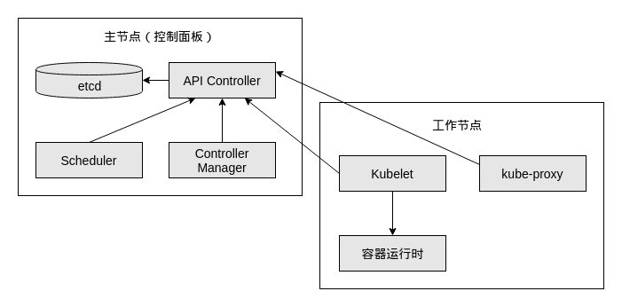

# 介绍

## 功能

* 提供容器编排, 调度服务
*  服务发现和负载均衡
* 健康检查和自修复
* 提供硬件资源利用率

## 集群架构

k8s集群由一个主节点和多个工作节点组成

* 主节点
  
  **The Master is responsible for managing the cluster.** The master coordinates all activities in your cluster, such as scheduling applications, maintaining applications' desired state, scaling applications, and rolling out new updates.
  
  - **Kube-apiserver** 
  
    Exposes the API. 命令行工具`kubectl`也与之交互
  
  - **Etcd** 
  
    Key value stores all cluster data. (Can be run on the same server as a master node or on a dedicated cluster.)
  
  - **Kube-scheduler** 
  
    Schedules new pods on worker nodes.
  
  - **Kube-controller-manager** 
  
    Runs the controllers.
  
  - **Cloud-controller-manager** 
  
    Talks to cloud providers.
  
* 工作节点

  which is an agent for managing the node and communicating with the Kubernetes master.

  * **Kubelet**

    Agent that ensures containers in a pod are running.

  * **Kube-proxy** 

    Keeps network rules and perform forwarding. Service的映射功能就是kube-proxy提供的.

  * **Container runtime** 
  
    Runs containers.

## k8s对象

仅列出常用的

### Pod

* 一组容器的集合
* 共享存储层
* 共享同一IP和端口范围, 容器间可通过环路地址(localhost)相互访问
* k8s操作的最小调度单位

可以将Pod看作一个逻辑主机

### Deployment

* 管理Pods的创建和扩展, 即管理Pod实例个数.
* Pod健康检查和重启

### Service

* 介绍
  * Service功能由kube-proxy提供, 而kube-proxy位于每个工作节点上.
  * 提供让一组Pod被访问的网络功能. 该组Pod通常是同一个Pod的多个拷贝, 由Deployment规定.
  * 一个Pod只能位于一个工作节点上, 而一个Service的Pod集合可以分散在多个工作节点上. 因为Service的网络映射规则与节点位置关系不大.
  * Service通过`label selector`来选择要应用网络规则的Pod.
  * 一个Service被分配一个IP地址(cluster IP), 用于服务将调用
  * 支持DNS映射, 即Service名作为域名.
  * Service能够负载均衡的将请求转发到Service内具体的一个Pod上.

  把Pod看作逻辑主机, 可将Service看作逻辑路由器... 

* Service类型

  * ClusterIP (default)

    一个Service被分配个IP, 在同一k8s集群中, 可被其他Service访问

  * NodePort

    将工作节点IP上的某个端口与该Service关联. 

  * LoadBalancer

    看不懂

  * ExternalName

    将域名映射到Service, 如`foo.bar.example.com`

* 实现原理

  kube-proxy的提供的功能, 而ExternalName需要其他组件的协助

* 参考

  [Kubernetes Services: A Beginner’s Guide](https://www.bmc.com/blogs/kubernetes-services/)

### Namespace

提供在一个集群中划分多个虚拟k8s集群的功能, 用于满足不同环境不同用户使用的隔离需求. 

## Minikube

是Kubernetes的轻量级实现, 即在主机上创建一个虚拟机, 仅部署含一个节点的k8s集群.

# 使用

# 参考

[A Kubernetes Basics Tutorial](https://www.bmc.com/blogs/what-is-kubernetes/) 