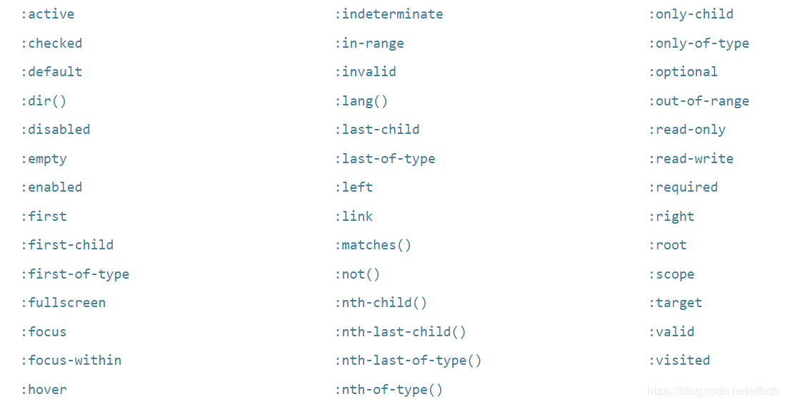
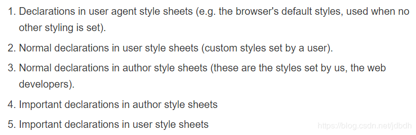
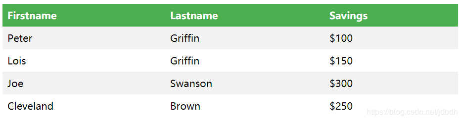

[TOC]

# 一、介绍
css（Cascading Style Sheets）叠层样式表，用来设计网页的外观。不要因为某个html元素有自己想要的样式就乱用元素，而是根据语义来选择元素，而css可以为你完成几乎任何想要的外观。

css内容很多，看看目录就知道了。学习css首先需要了解它的语法规则、选择器、盒子模型等基础知识，然后学习一堆的样式（即属性）。很多，学了又忘，但是每个属性都有它的文法，只要理解了文法规则，那么在了解属性的作用后，就能轻松使用该属性了。属性之间都不是单独存在的，很多属性都可以归为一类，因此按照类别来学习css属性十分有必要。再之后需要了解css的布局，css最强大的功能之一就是它的布局功能了。如果有必要，还可以了解一些和动画相关的内容。

# 二、基础知识
css（Cascading Style Sheets）叠层样式表，用于改变网页样式，最终和html形成DOM（Document Object Model ），而浏览器则将DOM展示出来。过程如下：


一个最简单的例子：
index.html:
```html
<!DOCTYPE html>
<html>
  <head>
    <meta charset="utf-8">
    <title>My CSS experiment</title>
    <link rel="stylesheet" href="style.css">
  </head>
  <body>
    <h1>Hello World!</h1>
    <p>This is my first CSS example</p>
  </body>
</html>
```

style.css:
```css
h1 {
  color: blue;
  background-color: yellow;
  border: 1px solid black;
}

p {
  color: red;
}
```

## [应用css样式表][1]
一共三种方法可以将样式表应用到html文档中。

[1]:https://developer.mozilla.org/en-US/docs/Learn/CSS/Introduction_to_CSS/How_CSS_works#How_to_apply_your_CSS_to_your_HTML

### 外部样式
`head`元素中添加`<link rel="stylesheet" href="style.css">`即可。
```html
<!DOCTYPE html>
<html>
  <head>
    <meta charset="utf-8">
    <title>My CSS experiment</title>
    <link rel="stylesheet" href="style.css">
  </head>
  <body>
    <h1>Hello World!</h1>
    <p>This is my first CSS example</p>
  </body>
</html>
```

### 内部样式
将css样式放入`<style>`元素，而`<style>`元素位于`<head>`元素中。
```html
<!DOCTYPE html>
<html>
  <head>
    <meta charset="utf-8">
    <title>My CSS experiment</title>
    <style>
      h1 {
        color: blue;
        background-color: yellow;
        border: 1px solid black;
      }
      p {
        color: red;
      }
    </style>
  </head>
  <body>
    <h1>Hello World!</h1>
    <p>This is my first CSS example</p>
  </body>
</html>
```

### 内联样式
每个元素都有`style`属性，定义只作用该元素的样式。
```html
<!DOCTYPE html>
<html>
  <head>
    <meta charset="utf-8">
    <title>My CSS experiment</title>
  </head>
  <body>
    <h1 style="color: blue;background-color: yellow;border: 1px solid black;">Hello World!</h1>
    <p style="color:red;">This is my first CSS example</p>
  </body>
</html>
```

## css语法
css尽管是声明式语言，语法简单，易懂，但是了解它的组成还是很重要的，即使使用时大家都不会提到接下来的概念。。

所有html元素都可以通过样式**属性**赋值该改变它的样式。属性和它的值形成**声明**（declarations），多条声明形成**声明块**（declaration blocks），声明块和选择器形成完整的**css规则**（CSS rules）。css规则是**css语句**的一种，还有其他语句，比如@**开始的语句**`@media....`，**注释**等。最后一点，很多属性都存在**速写**（shorthand），如`background,font,padding,border and margin`，即一个属性可以设置很多属性的值。

**注意**，如果样式写错了，浏览器会自动忽略它。

### css declarations
声明即为属性的键值对，冒号隔开。


### css declaration blocks
多个声明组成的声明块，分号隔开。最后一个声明可不写分号，但是最好写上。即使块为空，语法也是正确的。


### css rules
声明块和选择器组成了css规则。选择器很复杂，后面会介绍。选择器逗号分隔表示多个选择器共用一个样式表。


### at-rules
另一种css语句，用于提供元数据、条件、描述信息的，这里只提一提。语句从`@`开始，后面跟着标识符（规定该语句为何种css语句），后面为对应的语法块。每种at语句都有自己的语法。下面给出一些例子：
1. `@charset` and `@import` (metadata)
2. `@media` or `@document` (conditional information, also called nested statements, see below.)@media or @document (conditional information, also called nested statements, see below.)
3. `@font-face` (descriptive information)@font-face (descriptive information)

例如：
```css
/*导入其他css文件到当前css中*/
@import 'custom.css';
/*块中样式在页面超过800px时起作用*/
@media (min-width: 801px) {
  body {
    margin: 0 auto;
    width: 800px;
  }
}
```

### 注释
注释以`/*`开始，`*/`结束，正如上面的例子所示。

### 速写（shorthand）
一些属性可以让多个属性值写在一行，这些属性称为**shorthand properties**，如`font`, `background`, `padding`, `border`, and `margin`。至于那些属性是速写属性，需要查阅的文档，其实也有一定规律，可以猜出是否是速写属性，自己找规律、不介绍。

但是有些速写属性的属性值有一定的规律，这里提一下。下面举个例子，很多属性都适用，且有一定规律，自己挖掘去。

```css
padding:15px 15px 15px 15px;分别表示上、右、下、左内边距，顺时针的方向。

padding:15px;
相当于
padding:15px 15px 15px 15px;

padding:15px 14px;
相当于
padding:15px 14px 15px 14px;

padding:15px 14px 13px;
相当于
padding:15px 14px 13px 14px;
```

**注意**，有些属性可以拥有多个值，但是它不是速写属性。

## 选择器（selector）
css中选择器用于定位将要作用元素的位置，它的作用强大，但内容多、复杂。多个选择器同时选择到同一个时，会涉及到哪个样式将作用的问题，后面会提及到。

1. **Simple selectors**: Match one or more elements based on `element type`, `class`, or `id`.
2. **Attribute selectors**: Match one or more elements based on their `attributes/attribute values`.
3. **Pseudo-classes**: Match one or more elements that `exist in a certain state`, such as an element that is being hovered over by the mouse pointer, or a checkbox that is currently disabled or checked, or an element that is the first child of its parent in the DOM tree.
4. **Pseudo-elements**: Match one or more `parts of content` that are in a certain position in relation to an element, for example the first word of each paragraph, or generated content appearing just before an element.
5. **Combinators**: These are not exactly selectors themselves, but `ways of combining two or more selectors` in useful ways for very specific selections. So for example, you could select only paragraphs that are direct descendants of divs, or paragraphs that come directly after headings.**就是将多个选择器组合在一起选择元素**。
6. **Multiple selectors**: Again, **these are not separate selectors**; the idea is that you can put multiple selectors on the same CSS rule, separated by commas, to apply a single set of declarations to all the elements selected by those selectors.**就是逗号隔开，多个选择器共用一个样式表。**

### 简单选择器
简单选择器就是直接通过元素名称、class或id来选择元素。由于id在文档中只能存在一个，因此id只能选择一个元素；多个元素可以同时使用一个class，因此可以选择多个元素，但是要注意的是，一个元素也可以拥有多个class，至于样式冲突时，估计是后面class的样式覆盖前面class的样式吧。

下面给出不详细的例子：
```css
/*元素选择器，所有的p元素文本颜色为红色*/
p {
  color: red;
}
/*类选择器*/
.first {
  font-weight: bold;
}
/*id选择器*/
#rude {
  font-family: monospace;
  text-transform: uppercase;
}
```
#### 通用选择器
`*`表示通用选择器，选择网页内所有元素。常用于设置元素盒子模型的高宽的计算方法：
```css
* {
    box-sizing: border-box;
}
```

### [属性选择器][2]
根据属性或属性值选择特定元素，语法：[]中给定属性名和可选的属性值。分为两种：**匹配确切属性值的选择器**和**匹配包含特定属性值的选择器**。

[2]:https://developer.mozilla.org/en-US/docs/Learn/CSS/Introduction_to_CSS/Attribute_selectors

#### Presence and value attribute selectors
匹配确切属性值：
1. `[attr]` : This selector will select all elements with the attribute attr, `whatever its value`.
2. `[attr=val]` : This selector will select all elements with the attribute attr, `but only if its value is val`.
3. `[attr~=val]`: This selector will select all elements with the attribute attr, but only if  val is `one of a space-separated list` of words contained in attr's value. 

讲到这里，要提一下html5的全局属性[data-*][3]，它可以定义自己的属性，解析啥滴都由自己确定。

[3]:https://www.w3schools.com/tags/att_global_data.asp

#### Substring value attribute selectors
不完全匹配，包含即可：
1. `[attr^=val]` : This selector will select all elements with the attribute attr for which the value `starts with val`.
2. `[attr$=val]` : This selector will select all elements with the attribute attr for which the value `ends with val`.
3. `[attr*=val]` : This selector will select all elements with the attribute attr for which the value `contains the substring val`. (A substring is simply part of a string, e.g. "cat" is a substring in the string "caterpillar".) 
4. `[attr|=val]`：与第一种类似，选择所有属性值以`val`或`val-`（没看错，这里有个破折号）开始的元素。主要用于匹配`lang="en"`或`lang="en-US"`之类的属性，不常用。

### [Pseudo-classes and pseudo-elements][4]
伪类用于匹配处于某一状态的元素；伪元素匹配元素的部分内容。

[4]:https://developer.mozilla.org/en-US/docs/Learn/CSS/Introduction_to_CSS/Pseudo-classes_and_pseudo-elements

#### 伪类
`:`冒号开始，跟着一关键字，表示匹配元素的某种状态，比如鼠标是否悬停在元素上、元素是否被选中、元素是否激活、元素是否为父元素的第一个元素等等。总之内容之多，不详讲，只给出参考链接：[Pseudo-classes][5]

下面给出一个例子：
```css
* These styles will style our link
   in all states */
a {
  color: blue;
  font-weight: bold;
}
/* We want visited links to be the same color
   as non visited links */
a:visited {
  color: blue;
}
/* We highlight the link when it is
   hovered (mouse), activated
   or focused (keyboard) */
a:hover,
a:active,
a:focus {
  color: darkred;
  text-decoration: none;
}
```
还有其他伪类，请参考链接，这里给出图示：



[5]:https://developer.mozilla.org/en-US/docs/Learn/CSS/Introduction_to_CSS/Pseudo-classes_and_pseudo-elements#Pseudo-classes

#### [伪元素][6]
`::`两个冒号开始，用于选择元素的某一部分。


例子，在元素内容之后添加内容：
```html
<ul>
  <li><a href="https://developer.mozilla.org/en-US/docs/Glossary/CSS">CSS</a> defined in the MDN glossary.</li>
  <li><a href="https://developer.mozilla.org/en-US/docs/Glossary/HTML">HTML</a> defined in the MDN glossary.</li>
</ul>
```
```css
[href^=http]::after {
  content: '⤴';
}
```
结果：


[6]:https://developer.mozilla.org/en-US/docs/Learn/CSS/Introduction_to_CSS/Pseudo-classes_and_pseudo-elements#Pseudo-elements

### [Combinators and groups of selectors][7]
多个选择器利用它们之间的联系，组合在一起选择元素，即combinators；多个选择器也可以共用一个样式表，即groups of selectors。


注意：多个类之间没有空格组合在一起，仍然处于一个选择器，比如：`.class1.class2`


[7]:https://developer.mozilla.org/en-US/docs/Learn/CSS/Introduction_to_CSS/Combinators_and_multiple_selectors#Combinators_and_groups_of_selectors

## 叠层和继承
当多个选择器匹配到同一个元素，且某个样式冲突时，哪个样式会生效？这个问题通过叫做叠层（Cascade）的机制解决。这也是为什么css被叫做叠层样式表的原因。当然，继承也是一个很重要的内容，顾名思义，继承就是子元素从父元素上继承样式，但只有部分属性是默认从父元素上继承的。

这里先讨论叠层。这里要强调的是，**只有多个属性同时作用一个元素时才会考虑叠层的问题**！！！即使一个css规则（rule）的选择器优先级高，如果它们的属性不冲突，那么都会起作用的。只有冲突了的属性才会考虑到叠层的问题。

在叠层中，如果冲突了，哪个样式生效，主要看三个因素：
1. Importance
2. Specificity
3. Source order

通过这三条规则来解决冲突，**如果前面的已经解决了，那么就不会考虑后面的方法了**。

### Importance
如果样式冲突后，如果某个样式被`!important`声明，那么该样式优先级高，最终生效。如果冲突的样式都有`!important`声明，那么会查看下一个因素：**Specificity**

**浏览器自身也有一个默认样式**，用户也有自己的样式，通过`!important`可以提高样式重要性。总的样式重要性顺序为（重要性依次递增）：


看个例子，即使`#winning`优先级是最高的（和specificity有关，后面会讲到），但是由于color和padding没有样式冲突，因此会使用第三个样式表的样式。而`background-color`则使用第一个样式表的样式。对于border属性来说，在第二个样式表中被声明了`!important`，因此第二个样式表的样式生效，因为先考虑important然后specificity。
```html
<p class="better">This is a paragraph.</p>
<p class="better" id="winning">One selector to rule them all!</p>
```
```css
#winning {
  background-color: red;
  border: 1px solid black;
}

.better {
  background-color: gray;
  border: none !important;
}

p {
  background-color: blue;
  color: white;
  padding: 5px;
}
```

### Specificity
如果Important不能区分后才会考虑specificity。specificity是用来衡量选择器重要性的工具，每个选择器都可以计算出一个数值，大的生效。

计算方法：
1. **千位**：如果样式直接声明在元素style属性中，那么specificity为1000，否则0。
2. **百位**：有个id选择器就加一。
3. **十位**：每个类选择器、属性选择器、伪类都加一。
4. **个位**：每个元素选择器、伪元素都加一。

*提醒：貌似如果是groups of selectors，那么每个选择器是单独计算的？*

下面看个计算过程：


注意：
> Universal selector (*), combinators (+, >, ~, ' ') and negation pseudo-class (:not) have no effect on specificity.

### Source order
如果前面两个方法得出的重要性都一样，那么最后只看它的先后关系了，后面的样式会被使用。

**注意**，不要认为style元素内的样式一定比外部样式要近！！如果link元素位于style元素之后，那么同等重要性下，link元素对应的外部样式将生效~~。但是就近而言，style属性的样式一定是最近的！

### [继承][8]
继承控制当一个属性没有指定一个值的时候会发生什么。属性分为可继承属性（inherited property）和不可继承属性（Non-inherited property）。如`font-family`和`color`是可继承属性，`margin`、`padding`、`border`和`background-image`是不可继承属性。

可继承属性在没有被指定值时会从父元素中继承值。而html作为根元素，没有父元素，只能获得浏览器赋予该属性的**初始值**了。可能会发现在`<a>`元素中即使color是可继承属性，也不能从父元素中获取值，这是因为浏览器一般会有个**默认样式**!!此时是有指定值的。

不可继承属性在没有被指定值时会获得浏览器赋予该属性的**初始值**。

但是css提供了控制继承的属性值：
1. inherit：属性值继承父元素属性值。
2. initial：属性值为浏览器的默认属性值，如果没有则被设置成inherit（我觉得这种情况不会存在，请忽略）
3. unset：重置该属性为**自然值**（what？？），其实就是相当于该属性没有被设置一样，那么如果是可继承属性，会继承父元素属性值，相当于inherit；如果是不可继承属性，会获得该属性的**初始值**，相当于initial。
4. revert：如果属性没有被赋予值，那么会将该属性值置为它曾有过的值，用户定义的或者该元素的默认样式值。不太了解，不深究。

说了这么多**初始值**，我这里强调了一下，每个属性都有且只有一个初始值，不会因为html元素而改变，浏览器规定的。至于html元素，每个元素都有一个**默认样式**（user agent stylesheet），覆盖了初始值。

最后一个小内容，属性`all`，它是一个速写属性，为一个元素的所有属性设置继承值。有点用吧，使用unset重置元素样式啥滴。

[8]:https://developer.mozilla.org/en-US/docs/Learn/CSS/Introduction_to_CSS/Cascade_and_inheritance#Inheritance

额外参考：[Inheritance](https://developer.mozilla.org/en-US/docs/Web/CSS/inheritance)

## 值和单位
每个属性最终都会被赋予值，但这些值可以被分为很多类。比如一些属性只接受预定义的一些值；或一些数值，这些数值有的有单位，有的没有单位；或颜色；或函数，没看错，函数也能作为属性的值；或百分比。大部分属性可以接受**很多类型**的值。在MDN上，每种类型都有对应的名称，如数值类型`<length>`，颜色`<color>`，链接`<url>`等，所有的请参考：[css basic data type][10]。下面看看MDN上的分类（部分）：


[10]:https://developer.mozilla.org/en-US/docs/Web/CSS/CSS_Types

### 数值
很多属性都需要用数值作为属性值，有的数值可以有单位，有的数值可以没有单位。
#### 有单位数值
这些单位可分为**绝对单位**和**相对单位**。使用绝对单位，不管什么设备、什么设置都是相同的大小；使用相对单位，那么这些单位都是相对于字体大小或视口大小的。

**绝对单位**：
| Unit     | Description                  |
| -------- | :--------------------------- |
| cm       | centimeters                  |
| mm       | millimeters                  |
| in       | inches (1in = 96px = 2.54cm) |
| **px** * | pixels (1px = 1/96th of 1in) |
| pt       | points (1pt = 1/72 of 1in)   |
| pc       | picas (1pc = 12 pt)          |

由于px大小固定，而不同设备分辨率不同，因此不同设备一个px对应的物理像素点（device pixel）个数不同。比如低分辨率设备中可能1px对应一个物理像素点，高分辨率设备中可能1px对应多个物理像素点。

**相对单位**：
1. **em**：1em和**父元素**字体大小一致（一般16px）。需要注意的是，font-size是可继承属性！！因此不同元素中1em表现的大小可能不一样。
2. **rem**：和em类似，不过是相对于文档根元素的（即`<html>`），一般16px，因此不会被父元素设置的font-size影响。
3. **vw**，**vh**：分别相当于视口宽、长的1/100。
4. ex，ch：没啥用，不看了

*知道了为什么设置浏览器字体大小，网页字体也会改变了吧？如果使用了绝对单位不能改变，那只能缩放网页了...*

#### 无单位数值
有些属性接收数值，但可以没有单位。

比如`margin`和`padding`中，0可以不使用单位。如：

	margin: 0;
设置行高`line-height`时，可以无单位，相当于放大系数。

	p {
	  line-height: 1.5;
	}
还有比如设置动画时，一些属性可以不使用单位。等等之类不再列举。

额外参考：[css units](https://www.w3schools.com/cssref/css_units.asp)

### 百分数
百分数可以作为**width**、**height**的值，占用父元素content的百分比长宽。但是要注意的是，父元素没有明确规定height，那么子元素height使用百分比是没有用的。为什么？因为父元素的height是尽可能的包含子元素。

**font-size**也可以使用百分数，不过是相对于父元素font-size的百分比，类似于**em**。

当然，还有其他属性可以使用百分数，比如margin等等。

### 颜色
背景色、前景色，都需要指定颜色。颜色的表示有很多种。

1. **关键字**
	css预定义了一些标识符用于表示颜色，比如red、green、yellow、blue等。
		
		p {
		  background-color: red;
		}
2. **十六进制值**
	类似`#xxxxxx`的表示，每两位十六进制分别表示红绿蓝。
		
	
		background-color:#ff0000;/*红色*/
3. **RGB**
	一个函数`rgb()`，分别传入十进制红绿蓝分量，数值从0到255。
		
	
		background-color: rgb(0,0,255);/*蓝色*/
4. **HSL**
	不同于RGB的HSL模型，使用**色调**（hue）、**饱和度**（saturation）和**亮度**（lightness）三种值来表示颜色。使用`hsl()`函数来接收三种值。
	
	可以使用一张图清晰显示颜色和这三种值的关系：
	
	可以清楚看出（我的理解），色调大致确定颜色趋势；饱和度确定颜色是否丰富，不丰富就灰色；亮度如其名就是亮不亮...太亮了就成白色了，不亮就成黑色了。。
	
		background-color: hsl(0,100%,50%);
5. **RGBA**和**HSLA**
	设置颜色时，也可以同时设置透明度：
		
		background-color: rgba(255,0,0,0.5);
		background-color: hsla(240,100%,50%,0.5);
6. **Opacity**
	`opacity`属性也可以设置透明度，但是设置了当前元素及其子元素的**前、背景色**的透明度。不像上面的RGBA、HSLA只设置一种颜色的透明度。
	
		opacity: 0.5;

### 函数
函数也能作为属性值，正如前面提到的rgb(),hsl()等等。这里只提一提。

## 盒子模型
盒子模型是css布局的基础，每个元素都表示成一个盒子，有外边距（margin）、边框（border）、内边距（padding）和内容（context）。盒子模型有很多种，默认inline，但是默认样式（user agent styles）一般会为特定元素设置盒子模型，比如block。盒子模型类型通过`display`属性指定。

盒子模型如下，通过width和height可以指定context长宽，但是还有更好的选择就是min-width,max-width,min-height,max-height；padding属性设置内边距；margin属性设置外边距；border属性设置边框。


这里要注意的是：
1. height不能设置百分数，除非父元素height固定。默认height只采用context的大小。
2. border也不能设置百分数。

很多情况下想通过width、height指定box真实长度（即context+left padding+right padding+left border+right border），而不是context长宽，则需要box-sizing设置一下盒子模型长宽计算方式`box-sizing:border-box`


### 外边距坍塌
如果两个block类型的盒子模型**上下**紧挨，那么两个元素border之间的距离等于两者之间margin最大的距离，这种现象称为margin collapsing。**在float布局和position绝对布局中，不会发生坍塌**。

参考[Mastering margin collapsing][9]，发现父元素和第一个、最后一个子元素也会发生坍塌。如果父元素没有border、padding等等（其他的我不认识），那么父元素的margin-top和子元素的margin-top发生坍塌或者父元素的margin-bottom和子元素的margin-bottom发生坍塌。如果子元素是inline呢？由于这种类型的盒子模型本身就决定了inline不会早会坍塌，后面详讲。

如果块状元素没有border，padding，context等等，那么它的margin-top和margin-bottom会发生坍塌。

至此，以上共三种坍塌类型，资料上说margin负值也是坍塌？

[9]:https://developer.mozilla.org/en-US/docs/Web/CSS/CSS_Box_Model/Mastering_margin_collapsing

### 盒子模型类型
通过`display`属性可以指定盒子模型的类型。最常用的是：**block、inline和inline-block**。而上面讲的所有内容都对block元素生效。所有元素默认为inline，但是默认样式通常会重置一些元素为block类型。其他类型的盒子模型和布局有关，后面解析或以后补充。现在来看看这三个的区别：
1. **inline**：inline表现的就和文字一样，和其他的文字并排，适当位置自动换行，不会维持一个盒子的样子。它的margin和padding只能推开周围其他的inline元素或text，不会影响周围block元素的位置。一些元素比如``，即使是inline元素，但是表现的和inline-block一样....
	
	>注意，inline元素中的block元素也不会尊重父inine元素的width、width，因此子block元素的height:100%无效
	
2. **block**：block元素不会并排在一起，而是元素**上下**都会换行，也就是另起一行。默认情况下width会尽可能的水平占据空白空间，而height会尽可能的包含context，注意边距坍塌现象哦。可以设置长宽、padding、margin。
3. **inline-block**：inline-block介于上述两者之间，它不会在元素前后欢迎，因此可以和inline元素并排。但是其他的都和block一样，因此可以设置长宽，margin、padding也会被重视，影响布局。不会像inline那样被打破盒子的模型，如果剩余空间占不下，会另起一行，新行实在占不下就溢出...


这里要**提醒**一下子，使用了float或position后，元素会被自动设置为block元素，但是又和block元素不太一样，因为元素前后不会在换行了，而且width只会竟可能占据所需的空间。我感觉此时它表现的和inline-block没啥子区别。哦，flex布局的item也是会变为block，这只能说明盒子模型具体表现成什么样子还要看它的具体情况。

具体请参考4.1小结。

### 其他相关内容
这里谈及一些和盒子模型相关的一些内容：溢出、背景和outline。

1. **overflow**
	如果盒子大小固定了，context填不下时会发生溢出。通过overflow可以控制溢出现象。`overflow:auto`提供滑动条；`overflow:hidden`隐藏溢出内容；`overflow:visible`直接在盒子之外显示溢出的内容（**默认行为**）。然而如果文档根元素`<html>`溢出了，浏览器会提供滚动条的。
2. **background-clip**
	使用`background-color`，`background-image`时，背景默认延伸至border的外边缘（outer edge）。`background-clip`可以控制这种行为，值`border-box`为默认值，值`padding-box`延伸至padding的外边缘，值`context-box`延伸至context的边缘。
3. **outline**
	outline看起来像border，但不是盒子模型的一部分。outline被画在border之外，margin出现的位置。使用outline很有可能使outline与其他元素重合。
4. **max-width**，**min-width**，**width**
	在响应式布局中，通常使用者三个属性来限制宽度，如：
		
		width: 70%;
		max-width: 1280px;
		min-width: 480px;
		margin: 0 auto;
	这样在元素可用空间在1280px到480px之间，那么实际占用可用空间的70%。如果不在范围之内就会被限制在临界值上。

# 三、Style
在第二章中提到了几乎css所有应该要了解的理论知识，剩下的便是对css每个属性的学习。多个同类css属性会被归纳到一个小节中，比如和文字、盒子模型、元素特有的属性等等。css属性太多以至于根本不可能记下来，所以必须要知道css属性值的语法规则。

知道了语法规则后，剩下的就是熟悉一下某一类样式的各个属性。知道了属性的含义，即使不会用，查一查手册，利用已知的语法规则，立马就会了！so easy。

## [css值语法规则][13]
css的值的语法规则有点复杂，和正则表达式类似。值文法由三种组件组成：**types**、**combinators**和**multipliers**。每个值都有其类型（types）；多个值通过组合器（combinators）可以组合在一起；默认情况下值最多只能出现一次，multipliers可以指定值出现的次数。下面讲述中也可能把值称为实体。

实体的类型分很多种：**关键字**（keywords）、**字面值**（literals）和**数据类型**（data types）。
1. 关键字是一些预定义的标识符，如： auto, smaller or ease-in；
2. 字面值是一些特殊符号，如：'`/`','`,`'等等，是值的组成部分；
3. 数据类型分为`Basic data types`和`Non-terminal data types`，数据类型用来表示某一类的值。
	1. basic data types在参考链接中有，很通用的一些数据类型，通过`<`和`>`包裹，如:<length>,<color>,<string>等等。有印象吧？length和color在2.5小结中都有讲过；
	2. 而Non-terminal data types也被环绕在`<`和`>`中，分为两类：一类和属性有着同样的名字，通过单引号括起来，如：`<'font-style'>`，表示该实体为对应属性的值文法表示的值，常用于速写属性语法表示中；另一种是没有对应的属性名，此时不用单引号括起来，表明该data types对应的值文法就在附近会被给出。
		

类型（types）清楚后，combinators和multipliers就很简单了，下面直接给出表格，想仔细了解请参考链接。


**优先级**：multipliers >  [ ] > 空格 > && > || > |

这里要注意的是，在实际使用过程会碰到`<number>#{3}`的形式，在这里#原表示可以一次或多次，逗号分隔，但是{3}却规定了它必须是3次，逗号分隔。`#{2,}`这个应该表示两次及两次以上，逗号分隔。

[MDN css reference][11]
[value definition syntax][13]

### 例子一`font `
[font][12]是一个速写速写属性，一个属性指定多个属性的值。其语法形式如下：


从上面可以知道，font-style、font-variant-css21、font-weight、font-strecth可选，也可以存在其中几个，以任何顺序。可以选择值为关键字，比如caption。而，比如说`<'font-style'>`不是一个具体的值，是数据类型，还可以细分，查看它的语法，可以取值italic。如果`<'font-style'>`都存在了，那么`<font-size>`和`<'font-family`>也必须存在。

还有等等之类的规则，都可以从语法中看出来，我也是从语法中推出它的用法的。

那值的具体含义呢？如果有些值没有指定，那它会是多少呢？这个得看它的问题说明了，都会给出默认值的。

### 例子二`background-position`
[background-position][34]用来设置背景图片的初始位置。初始位置由x和y轴确定。首先看它的文法规则：


是不是懵逼了？2333，这里重点是要理清combinators的优先级关系，现在我们调整下`<bg-position>`的排位，从左到右按照优先级升高的方向排序：
```
	[ 
		[ left | center | right | top | bottom | <length-percentage> ] 
		|
				[ left | center | right | <length-percentage> ] 
				[ top  | center | bottom | <length-percentage> ] 
		|
			[ center | [ left | right ] <length-percentage>? ] 
			&&
			[ center | [ top | bottom ] <length-percentage>? ] 
	]
```
可以看出，有三种选择。
1. `[ left | center | right | top | bottom | <length-percentage> ]` ，此时指定一个值，另一个默认，这样的形式：`background-position: top;`
2. `[ left | center | right | <length-percentage> ] 	[ top  | center | bottom | <length-percentage> ] `，指定两个值，如：`background-position: 25% 75%;`
3. `[ center | [ left | right ] <length-percentage>? ] &&[ center | [ top | bottom ] <length-percentage>? ] `，最多指定4个值，如：`background-position: bottom 50px right 100px;`

so easy！！但是关于的具体含义，可查阅参考链接，后面也会提到一点。

[34]:https://developer.mozilla.org/en-US/docs/Web/CSS/background-position

### 例子三`background-color`
[background-color][14]的文法规则要复杂一点点：


可以看出，值就是由`<color>`这个数据类型组成，表示颜色，2.5小结中已经谈及过了，不过这里咋们仔细看看它的可选值`rgb()`函数。这个函数比较复杂点：


观察其文法，发现这些是允许的：

	rgb(30%)
	rgb(30% / 0.1)
	rgb(111 0 0)
	rgb(111 0 0 /0.5)
	rgb(255 ,255,255,0.5)

很多教程都没有谈及这些语法，但是我们学了语法规则后就知道可以这样使用了，是不是很牛逼？是不是屌炸天？233333 

所以说呀，下面只简单的介绍必要的一些知识点，其他属性具体用法到时查一查便知了。

[11]:https://developer.mozilla.org/en-US/docs/Web/CSS/Reference
[12]:https://developer.mozilla.org/en-US/docs/Web/CSS/font
[13]:https://developer.mozilla.org/en-US/docs/Web/CSS/Value_definition_syntax
[14]:https://developer.mozilla.org/en-US/docs/Web/CSS/background-color#rgb()

## style text
和文字相关的属性有很多，但大致分为两类：和字体有关的样式（**font styles**），和文字布局有关的样式（**text layout styles**）。大部分样式其实是针对英文的，对于咋们中文来说很多用不上，，，因此只要知道部分，其他的粗略了解即可。

*小知识，可以将文字当做inline元素来理解...*

### font
[**color**][15]
设置元素前景色的，也就是设置文字颜色。可继承属性。

[**font families**][16]
设置字体的，稍许复杂点，有几个概念需要了解。并不是所有的字体在所有的系统上被支持，如果网页指定的字体不被支持，那么浏览器会使用**默认字体**。但是有些字体目前被所有的字体支持，被称为**网络安全字体**（web safe fonts），[cssfontstack][17]上维护了一些安全字体。

css大致将字体归为了五类（**generic fonts**）：  serif, sans-serif, monospace, cursive and fantasy 。generic fonts是比较抽象的概念，每一类都有该中字体的特点，前三种是用得最多的。sans-serif字体看起来中规中矩，serif字体对细节看中了点，monospace是等宽字体，其余两个不介绍。下面一幅图仔细看看sans-serif和serif区别：


generic fonts只是大致对字体的划分，如果在font-families上指定该字体，那它具体使用的是哪种字体呢？这个我不关心，反正有默认值就是了。如果没有指定字体，那么浏览器模式使用哪种generic fonts？我也不关心，没查过，我只知道我的电脑默认使用微软雅黑。。

下面一张图解释五种generic fonts的关系：


font-family可以指定多个逗号分隔的字体，形成一个字体栈，系统中依次从前往后查找是否存在该字体，为了保证一定有个字体浏览器能够找出来，会在最后指定一个generic fonts，而不是让系统自己选择一个generic fonts ，这种方式被称为**字体栈**。如：
	
	/*字体名字有空格就使用双引号*/
	font-family: "Trebuchet MS", Verdana, sans-serif;
	/*或者来使用咋们的楷体吧。。*/
	font-family:楷体, serif;

----------------
还有一个和字体相关的重要内容为**网络字体**（web fonts）。如果系统不支持，那么就不会显示对应支持。但是如果浏览器下载网页时连同对应字体也下载下来，那么浏览器就能显示对应字体了，这种字体就是网络字体。

在css中首先要指定网络字体位置和该字体的名字：

	@font-face {
	  font-family: "myFont";
	  src: url("myFont.ttf");
	}
然后字体`myFont`和平常字体使用一般无二：
	
	html {
	  font-family: "myFont", "Bitstream Vera Serif", serif;
	}

over~~ over\~\~ 字体内容还是提多的。。。

[**font-size**][18]
指定字体大小，默认16px。属性值2.5小结中有提到过，也可参考链接。

[**font-style**][19]
字体样式，正常（`normal`）还是斜体（`italic`）。

[**font-weight**][20]
设置字体有多粗。关键字`bold`表示粗体。

[**text-transform**][21]
设置字体如果变形，也就是是否全大写（`uppercase`）、小写（`lowercase`）或不变形（`none`）等等。

[**text-decoration**][22]
是否设置下滑线（`underline`）、上划线（`overline`）、删除线（`line-through`）或无（`none`）。元素`<a>`默认设置为underline。

[**text-shadow**][23]
设置文字阴影，有点用，建议参考链接了解详细用法。语法如下：


三个`<length>`分别对应：offset-x（可负值）、offset-y（可负值）、blur-radius（模糊半径，可选，默认0）；`<color>`为阴影颜色，可选，默认为字体前景色。

[15]:https://developer.mozilla.org/en-US/docs/Web/CSS/color
[16]:https://developer.mozilla.org/en-US/docs/Web/CSS/font-family
[17]:https://www.cssfontstack.com/
[18]:https://developer.mozilla.org/en-US/docs/Web/CSS/font-size
[19]:https://developer.mozilla.org/en-US/docs/Web/CSS/font-style
[20]:https://developer.mozilla.org/en-US/docs/Web/CSS/font-weight
[21]:https://developer.mozilla.org/en-US/docs/Web/CSS/text-transform
[22]:https://developer.mozilla.org/en-US/docs/Web/CSS/text-decoration
[23]:https://developer.mozilla.org/en-US/docs/Web/CSS/text-shadow

### text layout
前面讲的是和字体相关的设置，现在谈及字体之间的布局。

[**text-align**][24]
控制文字在盒子context中的对齐方向。left：左边；right：右边；center：居中；justify：文字间隙增大，保证左右边缘都有文字贴着。

[**line-height**][25]
设置行高，常使用无单位数值。

**letter-spacing**和**word-spacing**
设置字母间距、单词间距。针对英文的，不提也罢。。

### 空白,溢出,break

* [white-space](https://www.w3schools.com/cssref/pr_text_white-space.asp): 空白在元素内如何被处理

  * `normal`(默认): 多个空格被当作一个空格, 必要时换行(包括软,硬换行)

  * `nowrap`: 多个空格被当作一个空格, 但从不换行(包括软,硬换行).

  * `pre`: 空格被保留, 不软换行. 

    > `pre`元素默认该值

* **word-break**: 一般的软换行很容易解决, 但是一个单词太长了怎么办? 这里就要靠`word-break`制定软换行的具体方式了, 详细介绍见[css之word-break及word-wrap(overflow-wrap)](https://blog.csdn.net/jdbdh/article/details/83687049 )

* [text-overflow](https://developer.mozilla.org/en-US/docs/Web/CSS/text-overflow): 无论何种情况, 文字溢出了, 我还可以直接省略溢出的部分.

### 其他
上面只是列举了一部分，还有很多很多和字体、字体布局相关的属性没有列出来。如果不是搞编辑器相关工作的可以忽略。

不过要提一点，文字如果一行填充不下，会自动换行的，当时一串很长的**单词**填充不下是直接溢出的。。。想了解相关内容参考：[Line breaking 换行][26]和[css之word-break及word-wrap(overflow-wrap)][27]

剩余的属性参考：[Other properties worth looking at][28]

**很多和text相关的属性都可以通过速写属性[font][29]来设置。**

[24]:https://developer.mozilla.org/en-US/docs/Web/CSS/text-align
[25]:https://developer.mozilla.org/en-US/docs/Web/CSS/line-height
[26]:https://blog.csdn.net/jdbdh/article/details/83685804
[27]:https://blog.csdn.net/jdbdh/article/details/83687049
[28]:https://developer.mozilla.org/en-US/docs/Learn/CSS/Styling_text/Fundamentals#Other_properties_worth_looking_at
[29]:https://developer.mozilla.org/en-US/docs/Web/CSS/font

## style lists
列表和`<ol>`,`<ul>`,`<li>`这几个html元素有关（还有dd、dt、dl，不谈及），其实`ol`和`ul`之间没啥子区别，就是默认样式设置不一样而已。而`li`的`diplay`为`list-item`，不同的盒子模型，因此有不一样的表现和特定的css属性。
* list-style-type：设置列表前面的marker ，圆圈、数字啥滴
* list-style-position：设置marker 在元素内还是元素外
* list-style-image：允许使用自定义图片作为marker ，但通常都是利用背景图片来设置marker 。

通过[list-style][30]可以同时设置这三个属性，语法如下：

	<'list-style-type'> || <'list-style-position'> || <'list-style-image'>

一把在使用时都是直接清除它的默认样式的，好自定义list样式：
```css
ul,ol{
	padding-left:0;
	list-style-type:none;
	/*或者:list-style:none;*/
}
```
明明bullets是`display:list-item`元素的样式，而ul，ol为`block`元素，为啥要设置样式到ul，ol上呢？因为list-style-type是可继承属性，而且默认样式也是设置在ul，ol元素上的~~

[30]:https://developer.mozilla.org/en-US/docs/Web/CSS/list-style

## style links
链接的默认样式使用到了[color][31]、[cursor][32]和[text-decoration][33]三个属性，分别是text颜色、元素之上鼠标的图案、文本修饰。如果自定义链接样式都会考虑清除这三个样式的。

如果自定义链接，必须按照下面的顺序写，用逗号将选择器归为一组也行（根据语义可以分为三组）：
```css
/*链接未访问状态，尽管和a:link处于同一状态，但是至少优先级比默认样式高*/
a {
}
/*链接未访问状态*/
a:link {
}
/*已被访问状态，浏览器会记录访问过的链接的*/
a:visited {
}
/*
或者上面三个写在一起
a,a:link,a:visited{
}
*/
/*元素被focus时的状态*/
a:focus {
}
/*鼠标悬挂元素之上的状态*/
a:hover {
}
/*
或者上面两个写在一起
a:focus,a:hover{
}
*/
/*链接正在被点击的状态*/
a:active {
}
```
为什么顺序必须要这样？这就和2.4小结叠层的知识有关了，它们的importance和specificity一致，谁在后面谁的优先级就越高。如果:hover位于:link和:visited之前，那么即使鼠标位于元素之上，:hover的优先级也要比后两个要低，它的样式会失效。

[31]:https://developer.mozilla.org/en-US/docs/Web/CSS/color
[32]:https://developer.mozilla.org/en-US/docs/Web/CSS/cursor
[33]:https://developer.mozilla.org/en-US/docs/Web/CSS/outline

## style background
每个元素都有前景（text）和背景，背景默认位于context、padding和border之下。背景可以是颜色（`background-color`）或图片（`background-image`）。允许存在多个**背景图片**，因此存在一个**层级关系**，高层背景覆盖底层背景。如果加上`border-image`，那么层次关系为：
>注意，最先定义的背景图片层次要高
>border-image > background-image（先定义）> ...  > background-image（最后定义）> background-color

背景绘制的区域可以通过`background-clip`和`background-origin`修改。background-origin可设置**绘制区域**，但是一般图片太大还是会绘制到区域外的。因此`background-clip`可以设置它的**可视区域**，绘制在外的不被显示。默认绘制区域为padding-box，可视区域为border-box。

既然确定了绘制区域，这里假设一个x、y坐标轴，**相对于绘制区域**，图片默认从0，0的位置绘制。通过`background-position`（测试只对图片有效）可以修改绘制位置。

如果图片太小，会水平、垂直方向重复图案直到填满**可视区域**（你没看错），但是通过`background-repeat`可以修改这种行为。

图片大小不合适可以通过`background-size`设置它的大小，最强大之处在于它可以**动态**调整背景图的大小！！

如果元素内容太多出现了滚动条，可以通过`background-attachment`设置背景图片是否随着内容滚动。注意，它的导致background-origin失效，那会怎样？没兴趣，不深究。

这里已经按照一定逻辑理清了和背景相关的属性，后面详细给出介绍。最后重点介绍`background`速写属性，一般我们都是用速写属性的，和`font`速写属性一样，方便省事，但前提是了解了各个子属性。

[**background-color**][35]
设置颜色，默认**透明**，不是白色哦~~通常即使有了background-image也设置一个color，防止图片加载失败时显示用的。

[**background-image**][36]
设置背景图片，值的文法有点小复杂，下面只列出**部分**：
```markup
<bg-image>#
where 
<bg-image> = none | <image>

where 
<image> = <url> | <image()> | <image-set()> | <element()> | <cross-fade()> | <gradient>

where 
<gradient> = <linear-gradient()> | <repeating-linear-gradient()> | <radial-gradient()> | <repeating-radial-gradient()>

where 
<linear-gradient()> = linear-gradient( [ <angle> | to <side-or-corner> ]? , <color-stop-list> )
<repeating-linear-gradient()> = repeating-linear-gradient( [ <angle> | to <side-or-corner> ]? , <color-stop-list> )

where 
<side-or-corner> = [ left | right ] || [ top | bottom ]
<color-stop-list> = <color-stop>#{2,}

where 
<color-stop> = <color> <length-percentage>?
<length-percentage> = <length> | <percentage>
```
因此可以通过`url()`函数来设置图片来源。但有趣的是，它还可以设置**渐变色**（gradients），渐变色分为线性渐变色（linear gradients）和radial gradients。radial gradient用处不大，因此这里这探讨线性渐变色。

从语法上看，很简单，首先指定渐变方向（默认向右？），可以是度数或者标识符，然后至少2个渐变色，同时可以指定具体位置为哪个值。如：

	background-image: linear-gradient(to bottom, yellow, #dddd00 50%, orange);

如果位置为绝对位置，且还有剩余空间，可以使用`repeating-linear-gradient()`来重复渐变色，如：

	background-image: repeating-linear-gradient(to right, yellow, orange 25px, yellow 50px);

[gradients](https://developer.mozilla.org/en-US/docs/Learn/CSS/Styling_boxes/Backgrounds#Background_image_gradients)

[**background-position**][37]
设置图片绘制位置，x，y坐标，相对于绘制区域的，默认0，0。文法如下：
```markup
<bg-position>#
where 
<bg-position> = [ [ left | center | right | top | bottom | <length-percentage> ] | [ left | center | right | <length-percentage> ] [ top | center | bottom | <length-percentage> ] | [ center | [ left | right ] <length-percentage>? ] && [ center | [ top | bottom ] <length-percentage>? ] ]

where 
<length-percentage> = <length> | <percentage>
```
关于文法，3.1.1小节讲过了。这里说说具体意思。

一个值时，x坐标为该值，y默认center。两个值时，哪个值属于x、y得看情况，不过很简单，不说了，自己看链接。

这里有个有意思的地方要注意，确定x，y坐标后，会将图片左上角绘制在这个点？？我发现并不是，会随着坐标变化而变化，因此坐标`50% 50%`，此时图片位于正中间！坐标`100% 100%`时，右、下边紧挨绘制区域边缘！

[**background-attachment**][38]
设置背景是否随着内容滚动而滚动，导致background-origin失效，而clip有用，就是说可视区域有效。
1. scoll：背景**相对于元素border**而固定，随着网页滚动而滚动。
2. fiexd：背景**相对于视口**而固定，随着网页滚动只会看到背景的不同区域（所以说可视区域有效）。
3. local：背景**相对于元素内容**而固定，随着元素内容滚动而滚动。

通过[background-attachment.html][39]可以观察到三者之间的不同，第二个要仔细观察哦~~

[**background-size**][40]
可动态调整背景图片大小，很有用。
```markup
<bg-size>#
where 
<bg-size> = [ <length-percentage> | auto ]{1,2} | cover | contain

where 
<length-percentage> = <length> | <percentage>
```
下面介绍下重要一点的**部分**值：
1. contain：保持图片比例缩放直到碰到绘制区域边界
2. cover：保持图片比例缩放直到绘制区域没有空余。
3. auto：如果两个值都为auto，那么会保持原本**大小**和**比例**；如果只有auto或另一个值默认（其实就是auto），那么auto的一边会拉伸直到比例不变。

[**background-clip**][41]和[**background-origin**][42]
这两个之前介绍的很清楚了，没啥好讲的。就是一个设置可视区域大小，一个设置绘制区域大小。

[**background**][43]
这个是速写属性，可以设置前面讲过的所有属性，十分方便，通常也是使用这个。部分文法如下，具体用法一看便知：
```markup
[ <bg-layer> , ]* <final-bg-layer>
where 
<bg-layer> = <bg-image> || <bg-position> [ / <bg-size> ]? || <repeat-style> || <attachment> || <box> || <box>
<final-bg-layer> = <'background-color'> || <bg-image> || <bg-position> [ / <bg-size> ]? || <repeat-style> || <attachment> || <box> || <box>
```
据文法可以看出，可以设置多个背景，不过最后一个背景才能设置color。大部分样式的顺序都是任意的，但是size必须在position之后。

最后看到了两个`box`没？分别对应`background-origin`和`background-clip`。如果没有指定则使用默认值；如果给定一个，则同时设置两个。

给个例子吧：

	  background-color: yellow;
	  background: url(https://mdn.mozillademos.org/files/13026/fire-ball-icon.png) no-repeat 99% center,
	              linear-gradient(to bottom, yellow, #dddd00 50%, orange);

为什么还设置color呢？这是为了防止背景图片失效，不过color写在background属性中也是可以的。

[35]:https://developer.mozilla.org/en-US/docs/Web/CSS/background-color
[36]:https://developer.mozilla.org/en-US/docs/Web/CSS/background-image
[37]:https://developer.mozilla.org/en-US/docs/Web/CSS/background-position
[38]:https://developer.mozilla.org/en-US/docs/Web/CSS/background-attachment
[39]:http://mdn.github.io/learning-area/css/styling-boxes/backgrounds/background-attachment.html
[40]:https://developer.mozilla.org/en-US/docs/Web/CSS/background-size
[41]:https://developer.mozilla.org/en-US/docs/Web/CSS/background-clip
[42]:https://developer.mozilla.org/en-US/docs/Web/CSS/background-origin
[43]:https://developer.mozilla.org/en-US/docs/Web/CSS/background

## style borders
可以设置border的宽度（width）、样式（style）和颜色（color），可以通过速写属性[border][44]设置；还可以为border设置圆角（rounded corners），通过[border-radius][45]设置；通过[border-image][46]，我感觉暂时用不到，相关内容先空着。

[**border**][44]
文法简单，三个样式顺序任意，值同时作用于四个边框：

	<line-width> || <line-style> || <color>
如果想分别对它的边框设置不同样式，可以使用它更具体的属性。参考：[longhand options][47]

[**border-radius**][45]
设置圆角，如果设置椭圆的角，通过"/"设置第二条边。

	<length-percentage>{1,4} [ / <length-percentage>{1,4} ]?
	where 
	<length-percentage> = <length> | <percentage>

如果设置圆角，但是使用百分比的话，**估计**是相对于长边的。

`border-radius:50%`不一定表示border为圆形，可能是椭圆形，除非元素为正方形。

[44]:https://developer.mozilla.org/en-US/docs/Web/CSS/border
[45]:https://developer.mozilla.org/en-US/docs/Web/CSS/border-radius
[46]:https://developer.mozilla.org/en-US/docs/Web/CSS/border-image
[47]:https://developer.mozilla.org/en-US/docs/Learn/CSS/Styling_boxes/Borders#Longhand_options

## style tables
每个和table相关的元素几乎都有特定的`display`值，说明它的内部结合和熟知的block元素不太一样。比如下面的表格，表格单元和表格之间有间隙：


这和它的display值有关。但是通过[border-collapse][48]去掉间隙（坍塌）。

`<th>`表头默认会居中，通过text-align可以去除。

下面给出一个详细例子：
```css
table {
    border-collapse: collapse;
    width: 100%;
}

th, td {
    text-align: left;
    padding: 8px;
}

tr:nth-child(even){background-color: #f2f2f2}

th {
    background-color: #4CAF50;
    color: white;
}
```
通过这个样式，表格会是如下样子：


对了，如果单个cell太高了，可以使用`vertical-align`垂直对齐它的内容。对其他元素无效。


[48]:https://developer.mozilla.org/en-US/docs/Web/CSS/border-collapse

## [advanced box effects][49]
对于设计盒子样式还有其他的技巧，比如盒子阴影、blend modes和filters。但是除了阴影，其他的貌似用不着，所以也不深究了。

[**box-shadow**][50]
好看的阴影不能凭空想象出来，最好通过工具自动生成css代码，[Box-shadow generator][51]便是这样的一个工具。一般浏览器的调试工具也会提供这样的工具。

部分语法如下：
```markup
none | <shadow>#

where 
<shadow> = inset? && <length>{2,4} && <color>?
```
默认阴影在盒子外面，insert表示阴影绘制在盒子里面。接着的四个数值表示：offset-x,offerset-y,blur-radius（模糊半径）,spread-radius（就是阴影有多大）。再然后一个可选的color

[49]:https://developer.mozilla.org/en-US/docs/Learn/CSS/Styling_boxes/Advanced_box_effects
[50]:https://developer.mozilla.org/en-US/docs/Web/CSS/box-shadow
[51]:https://developer.mozilla.org/en-US/docs/Web/CSS/CSS_Box_Model/Box-shadow_generator

## 其他
### object-fit
设置replaced元素（如img、video）的内容大小如何调整以满足容器。
>参考：[object-fit](https://developer.mozilla.org/en-US/docs/Web/CSS/object-fit)
# 四、布局
上面介绍了和文字、盒子模型相关的样式属性，现在介绍一下布局。在flex、grid开始之前，都一直使用float、table来布局网页，但是float属性、table表格本意不是用来布局的，而且不太方便。随着flex、grid布局的出现，float和table都回归到了它原来的位置上。position也能够用来布局，但更多的是用来微调元素。

## display
几乎所有的布局都能够和display属性扯上关系，因为[display][88]定义了元素的展示类型，其由两部分组成：外部的展示类型和内部的展示类型。即定义了元素的**外在表现**和**内在表现**。

举个例子，就**外在表现**而言，比如block和inline元素，block元素会前后换行，width尽可能的大；而inline元素不换行，width、height都尽可能的包含content，不能设置width和height，margin和padding不被尊重（即不影响block元素布局）。这就是它们外在表现的不同，总的相关值有：
```css
/* <display-outside> values */
display: block;
display: inline;
display: run-in;
```
>注意，inline元素中的block元素也不会尊重父inine元素的width、width，因此子block元素的height:100%无效

就**内在表现**而言，上面几个盒子模型表现都是一样的，而且content结构简单。内在表现就是指content结构不同，**但是都会提供一些属性来控制这种结构**，比如display:table，table的每个cell之间都有一定的间隙，而属性border-collapse专门用于去除间隙。更复杂的内部结构就是flex、grid等布局了，跟着还有一系列的属性设置布局，接下来会讲到这些布局。这种类型的值有：
```css
/* <display-inside> values */
display: flow;
display: flow-root;
display: table;
display: flex;
display: grid;
display: ruby;
```
两种类型的display值可以一起使用，即同时指定外在表现和内在表现，一些例子：
```css
/* <display-outside> plus <display-inside> values */
display: block flow;
display: inline table;
display: flex run-in;
```
还有另一种方案也可同时指定外在、内在表现，这是历史遗留方案，比如inline-block。inline-block元素是两者的综合，即前后不换行，width尽可能包含元素，可以设置height、width，margin和padding被尊重。其他值如下：
```css
/* <display-legacy> values */
display: inline-block;
display: inline-table;
display: inline-flex;
display: inline-grid;
```

`display:none`表示该元素消失，不显示。还有一些和table、list相关的值不给出了，有兴趣自己翻阅资料。

[88]:https://developer.mozilla.org/en-US/docs/Web/CSS/display

## flexbox layout
flexbox（flexible box module）被设计成**一维**的布局。通过`display:flex`或`display:inline-flex`设置**flex容器**（flex container），它的**直接子元素**成为**flex items**。成为flexbox后，容器和flex items此时有了一些和该布局相关的属性可以设置，并且已经被赋予了初始值。

比如，flex布局的**方向**通过`flex-direction`来设置，默认水平方向（row）。通过`flex-basis`指定item基础大小（base size），布局在水平方向时，`flex-basis`则设置元素的width，否则height。

如果item放入容器后，并且有**剩余空间**，此时我们可以选择将空间填充到items中，通过`flex-grow`指定剩余空间分配比例；但是也可以不填充（默认不填充），而是通过`justify-content`调整items间的剩余空间，使items在默认方向上（main axis）**对齐**。

如果items总的大小（加上margin）超过了容器大小，通过`flex-shrink`设置items**收缩比例**，使得items能够填充到容器中，默认比例1；不设置则溢出，但是即使设置了，如果元素实在腾不出空间了，也会导致溢出。也可以通过`flex-flow`设置环绕，即溢出时则跳到新行，此时可以看做**两个flex容器**。

容器cross axis方向（一般为垂直反向）如何处理剩余空间？也是填充到元素中或者对齐。通过`align-items`设置，默认stretch，即拉伸，占据所有空间，此时所有元素高度一致，以最高的元素为准（因为该方向上容器默认要尽可能包裹所有元素）；设置center，会居中items，使用它item默认高度。

之前谈到多行的flex，貌似已经不是一维了，但是我们可以将它看做是每行一个flex容器。实际上还是一个容器，如果固定了容器高度，此时可能会有剩余空间，那么怎么办？通过`align-content`对齐这些row（或“容器”）。

item通过`order`设置它自己的排列顺序。item通过`align-self`覆盖align-items的设置。

----------------------
此时可以看出，大部分属性的功能都和**剩余空间**有关：有剩余空间，咋办？填充给items（相对于设置item大小）还是用来对齐元素？小部分和容器方向、item顺序有关。

### 默认行为及分类
上面属性可分为：和容器有关的属性，和flex item有关的属性。如下并给出默认值：
**容器**
```markup
flex-direction 方向（row）
flex-wrap 是否环绕 （nowrap）
flex-flow 前两个的速写属性
justify-content 水平对齐items  （flex-start）
align-items 垂直对齐item  （stretch）
align-content 垂直对齐多行的“容器”   （stretch）
```
**flex item**
```markup
order 顺序  （0）
flex-grow 剩余空间分配比例 （0）   
flex-shrink 收缩时负剩余空间分配比例 （1）
flex-basis 初始大小（auto）
flex 上面三个的简写
align-self 单个item覆盖align-items设置 （auto，即继承容器align-items属性）
```
从上面的默认值可以看出，flex容器默认水平方向；不环绕，可能会导致溢出；items左对齐；垂直方向items拉伸填充，最终所有items和最高的item高度一致（即容器高度）；order相等则按照item定义位置排序；items不分配剩余空间；溢出时（即负剩余空间）等比例收缩；item大小auto，即宽为元素的width属性，没有width设置，则为元素的内在大小有关（和box-sizing有关）。

### 基础概念
在理解属性概念时需要知道一些flexbox相关的基础概念。


flex布局有两个轴线：main axis，cross axis。`flex-direction`设置的就是main axis的方向。main start不一定就在左边，也可能在右边，比如`flex-direction:row-reverse`。

-----

**剩余空间**和**负剩余空间**
如果items的基础大小（通过`flex-basis`设置）总和小于容器大小，那么就会出现剩余空间。


但是如果超出了容器总和，多余的部分称为负剩余空间。


一定要注意，剩余空间是items使用原本大小占据空间后剩下的空间！！

------

**min-content和max-content**
min-content，就是最小的内容宽度，所有可以换行的地方都软换行。max-content，就是最大的内容宽度，不进行软换行。如图：

这个和`flex-grow`和`flex-shrink`有关。

### 属性详解
[**flex-direction**][52],[**flex-wrap**][53]和[**flex-flow**][54]
`flex-direction`指定main axis方向，水平或者垂直。row-reverse中，main start和main end位置互换，column-reverse类似。默认row，文法如下：
	
	row | row-reverse | column | column-reverse

`flex-wrap`指定items的basis总和超过容器大小溢出时是否换行。换行后可以将每一行**看做**一个flex容器。默认nowrap，文法：

	nowrap | wrap | wrap-reverse

`flex-flow`是这两个的速写属性。默认row nowrap，文法：

	<'flex-direction'> || <'flex-wrap'>

[**flex-grow**][55],[**flex-shrink**][56],[**flex-basis**][57]和[**flex**][58]
`flex-basis`设置flex item的**初始大小**，受`box-sizing`影响。如果同时存在flex-basis（除了值auto）和width（或height，main axis在垂直的情况下），那么flex-basis有优先权。如果flex-baise:auto，那么使用元素的width（或height）作为初始大小；但是元素没有设置width，那么使用**max-content**作为它的初始大小。默认auto，文法：

	content | <'width'>

`flex-grow`设置剩余空间分配比例。注意只有当有剩余空间时该属性才会作用，剩余空间会按比例分配给flex items。为0时表示不拉伸。默认0。

`flex-shrink`设置**负**剩余空间分配比例。只有有负剩余空间时该属性才会作用，负剩余空间按比例从flex items中减去，直到某个item达到了它的min-context，该item才会停止缩小。为0表示不缩小。默认1。min-width或min-height可改变item缩小的最小大小。

`flex`上面三个的速写属性。文法：

	none | [ <'flex-grow'> <'flex-shrink'>? || <'flex-basis'> ]

默认1 1 0px。flex-basis必须带单位，以免与前两个混淆。flex还定义了一些关键字：
1. auto：flex: 1 1 auto
2. initial: flex:0 1 auto
3. none: flex:0 0 auto
4. <正整数>: flex:<正整数> 1 0

注意：只有items的basis总和（加上margin）超过容器width（或height）才会拉伸，不超过次才会缩小，前提是设置了可拉伸可缩小。

注意basis为**零**的情况，此时不是考虑分配后的剩余空间，而是将所有的容器空间当做剩余空间，因此所有items的**比例始终一致**！！！必须设置flex-flow，比如flex:1 0 0;

因为basis为零时，元素发生了[坍塌][59]，所以显示min-content内容。但毕竟宽度为0了，所以设置隐藏溢出时会导致元素消失，比如：`flex:0 0 0;overflow:hidden`（不要设置flex-grow）。

[**justify-content**][60]
设置main axis方向如何对齐items，不能设置flex-grow，因为有了剩余空间才能拿对齐。默认flex-start。


[**align-items**][61]
items在cross axis方向如何对齐。默认stretch，所以所有items才会等高。


那个baseline请自行忽略，我也不太清楚。。

[**align-content**][62]
如果可换行（flex-wrap:wrap），并产生了多行，且容器固定了高度，那么可以通过该属性对齐**这几行**。默认stretch。


[**order**][63]
设置items排序时的位置。默认0，因此按照元素出现位置排序。值越小，位置越靠前。可负数。

[**align-self**][64]
覆盖容器设置的align-items的值，默认auto，即容器的align-items值。

flexbox这一章就此结束了，可以参考这篇教程，主要图多：<https://css-tricks.com/snippets/css/a-guide-to-flexbox/>


参考：
[flexible box layout](https://developer.mozilla.org/en-US/docs/Web/CSS/CSS_Flexible_Box_Layout)

[52]:https://developer.mozilla.org/en-US/docs/Web/CSS/flex-direction
[53]:https://developer.mozilla.org/en-US/docs/Web/CSS/flex-wrap
[54]:https://developer.mozilla.org/en-US/docs/Web/CSS/flex-flow
[55]:https://developer.mozilla.org/en-US/docs/Web/CSS/flex-grow
[56]:https://developer.mozilla.org/en-US/docs/Web/CSS/flex-shrink
[57]:https://developer.mozilla.org/en-US/docs/Web/CSS/flex-basis
[58]:https://developer.mozilla.org/en-US/docs/Web/CSS/flex
[59]:https://stackoverflow.com/questions/47578958/the-difference-between-flex-basis-auto-and-0-zero
[60]:https://developer.mozilla.org/en-US/docs/Web/CSS/justify-content
[61]:https://developer.mozilla.org/en-US/docs/Web/CSS/align-items
[62]:https://developer.mozilla.org/en-US/docs/Web/CSS/align-content
[63]:https://developer.mozilla.org/en-US/docs/Web/CSS/order
[64]:https://developer.mozilla.org/en-US/docs/Web/CSS/align-self

## grid layout
grid layout是一个**二维**的布局，就像表格一样，有行和列。简单的说，**grid**是一组水平线和垂直线的集合，分割的单元称为**cell**，行和列分别称为**row tracks**和**column tracks**。tracks之间的空白称为**cutters**或者**gap**，它位于**线**（line）所在的位置，可以将它看做比较粗的线（line）。grid中也有两个方向：**block or column axis**和**inline or row axis**。grid布局中的元素为**grid items**，它可以占据多个cell，这几个cell连同范围内的gap被称为**grid area**。

被`display:grid`和`display:inline-grid`声明的元素作为**grid容器**，它的直接子元素会被当做**grid items**。

通过`grid-template-columns`定义列的个数和占据大小，而`grid-template-rows`定义行的个数和行占据大小，但是一般不使用该属性，因为你不是很确定行的个数，因此一般使用`grid-auto-rows`只设置行的大小。对应的属性还有`grid-auto-columns`

定义好tracks后，有四种方式指定grid items的位置（grid area）所在：
1. line-based placement：grid布局由线（line）组成，items通过`grid-column`和`grid-row`指定行列边界线位置，线内的空间就是items位置所在。line number从1开始。
2. grid template areas：就是通过`grid-template-areas`为grid中一块区域（area）命名，在item中通过`grid-area`指定area 名字，那么该item就被放置在该处。
3. name grid lines：也是在item中指定它的边界线来决定放置位置，但是此时指定的是线的名字，因此需要在容器中设置线名。我觉得不常用。
4. auto-placement：就是自动从左到右，从上到下放置item，一个cell一个item，如果超过，比如规定的行数，那么grid会自动补加行。

这里又引申出两个概念：**implicit grid**和**explicit grid**。被`grid-template-columns`和`grid-template-rows`固定行列大小、个数的grid被称为explicit grid；而只限制一列（或一行）的grid，随着items的放置，自动生成行，这种grid为implicit grid。通过`grid-auto-columns`或`grid-auto-rows`可以限制生成行或列的大小。

为啥这么多概念？？因为不分清的话看不懂英文文档在说啥，查集料都不方便。。。。没办法。。

放置items后，每个Item都有了自己的区域（grid area），然后就可以在area中对齐items了，比如水平对齐`justify-items`和垂直对齐`align-items`，默认stretch，即拉伸占据所有空间。

最后，还可以对齐下tracks，即gap空间的分派使不同tracks对齐。比如水平对齐`justify-content`和垂直对齐`align-content`，都默认start，即位于左上角。它会导致grid-gap失效。注意tracks对齐的前提是对应方向的track长度固定，有足够剩余空间。

### 部分属性
[**grid-template-columns**][65] ,[**grid-template-rows**][66]
文法复杂了点，就不给出了。这两个属性分别用来确定列、行的个数和大小。同时可以给出线名。

长度可以是固定或者相对的。`fr`是一个相对单位，一个对剩余空间分配的比例。注意是固定，比如列值后剩余空间的分配。
```css
/*定义三列*/
grid-template-columns: 200px 200px 200px;
/*两列，但是第二列占据所有剩余空间*/
grid-template-columns: 100px 1fr;
```
通过`repeat`函数可以重复生成列（或行）值，minmax可以指定列（或行）的最大和最小值。如：
```css
/*按照每个item 200px的大小再一行上尽可能多的划分列，然后剩余空间等比例分配*/
grid-template-columns:repeat(auto-fill,minmax(200px,1fr);
```

[**grid-auto-columns**][67] ,[**grid-auto-rows**][68] ,[**grid-auto-flow**][69]
grid中可能会出现grid中item超过cell个数的情况，此时会产生新行（或列），也就是产生了implicit grid。。`grid-auto-columns`和`grid-auto-rows`设置这些自动生成的行、列的大小。这些items会使用自动放置（auto replacement），而`grid-auto-flow`控制自动放置算法，文法：
```markup
[ row | column ] || dense
```
指定放置的方向和具体的算法：sparse或dense。dense看起来会紧凑一点，适合用来做画廊。

[**grid-column-gap**][73] ,[**grid-row-gap**][74] ,[**grid-gap**][75]
设置tracks间的间距，grid-gap为前两个的速写属性。

[**order**][85]
在auto replacement中，通过order可以改变自动放置的顺序。貌似用处不大。

### line-base placement
上面设置好grid 的track（行列后），就可以通过[grid-column][70]和[grid-row][71]来指定item位置的范围了（在4条边线之间的范围）。线从1开始数起，最后一条线可以用负数表示，比如-1表示该方向上最后一条线。注意负数不能使用在implicit grid中，因为最后一条线不确定。

例子：
```css
/*不给出另一条线表示占一列*/
grid-column: 1;
grid-column: 1 / 3;
/*从第2列开始到最后一列*/
grid-column: 2 / -1;
/*span表示占据两列，即第1列和第2列*/
grid-column: 1 / span 2;
```
如果线被定义了线名，那么grid-column和grid-row也可以用指定线名。

[grid-area][72]属性主要在item中指定该item占据的grid area名字，但是也可以直接指定线号（line number）：
```css
/*分别为grid-row-start,grid-column-start,grid-row-end,grid-column-end  。和margin类似*/
grid-area: 1 / 3 / 3 / 4;
```
### grid template areas
通过[grd-template-areas][76]在容器中为多个cell命名，如：
```css
.wrapper {
    display: grid;
    grid-template-columns: repeat(9, 1fr);
    grid-auto-rows: minmax(100px, auto);
    grid-template-areas: 
      "hd hd hd hd   hd   hd   hd   hd   hd"
      "sd sd sd main main main main main main"
      "sd sd sd  ft  ft   ft   ft   ft   ft";
}
```
结果：


如果某一个cell为空，那么使用`.`逗号来代替。area必须为长方形。

然后item元素通过[grid-area][77]指定area名：
```css
.header {
    grid-area: hd;
}
```
### named grid lines
上面说过grid-template-columns和grid-template-rows在定义tracks（行列）时可以同时定义线名（line name），然后在grid-row中使用。感觉用处不大，直接给出参考链接：[Layout using namd grid lines][78]

### 对齐
[align-items][79]垂直对齐item，justify-items[80]水平对齐item。默认都为stretch，但是对于有intrinsic size的元素来说表现起来像start，比如说img。部分可选值：
normal
start
end
center
stretch 
baseline

而[align-self][81]和[justify-self][82]用于item，覆盖容器的对齐设置。

tracks也可以被对齐，[align-content][83]用来对齐column tracks（列），[justify-content][84]用来对齐row tracks（行）。默认start。可以对齐的前提是还有剩余空间，即容器大小比items总和要大。部分可选值：
normal
start
end
center
stretch
space-around
space-between
space-evenly
baseline

与flexbox取值差不多，可以参考下。

[grid layout mdn 参考资料](https://developer.mozilla.org/en-US/docs/Web/CSS/CSS_Grid_Layout/Basic_Concepts_of_Grid_Layout)


[65]:https://developer.mozilla.org/en-US/docs/Web/CSS/grid-template-columns
[66]:https://developer.mozilla.org/en-US/docs/Web/CSS/grid-template-rows
[67]:https://developer.mozilla.org/en-US/docs/Web/CSS/grid-auto-columns
[68]:https://developer.mozilla.org/en-US/docs/Web/CSS/grid-auto-rows
[69]:https://developer.mozilla.org/en-US/docs/Web/CSS/grid-auto-flow
[70]:https://developer.mozilla.org/en-US/docs/Web/CSS/grid-column
[71]:https://developer.mozilla.org/en-US/docs/Web/CSS/grid-row
[72]:https://developer.mozilla.org/en-US/docs/Web/CSS/grid-area
[73]:https://developer.mozilla.org/en-US/docs/Web/CSS/grid-column-gap
[74]:https://developer.mozilla.org/en-US/docs/Web/CSS/grid-row-gap
[75]:https://developer.mozilla.org/en-US/docs/Web/CSS/gap
[76]:https://developer.mozilla.org/en-US/docs/Web/CSS/grid-template-areas
[77]:https://developer.mozilla.org/en-US/docs/Web/CSS/grid-area
[78]:https://developer.mozilla.org/en-US/docs/Web/CSS/CSS_Grid_Layout/Layout_using_Named_Grid_Lines
[79]:https://developer.mozilla.org/en-US/docs/Web/CSS/align-items
[80]:https://developer.mozilla.org/en-US/docs/Web/CSS/justify-items
[81]:https://developer.mozilla.org/en-US/docs/Web/CSS/align-self
[82]:https://developer.mozilla.org/en-US/docs/Web/CSS/justify-self
[83]:https://developer.mozilla.org/en-US/docs/Web/CSS/align-content
[84]:https://developer.mozilla.org/en-US/docs/Web/CSS/justify-content
[85]:https://developer.mozilla.org/en-US/docs/Web/CSS/order

## float
在flex和grid布局没有出现时，float常用于创建**多列**的布局。但是float本意就是为了让图片悬浮、被文字环绕，所以不太适合用来布局。因此目前随着flex和grid的出现，float布局已成为历史。。当然`display:inline`也是可以用来做多列布局的，比float更不常用。

被声明float的元素，无论原本是inline、inline-block还是block元素，都会被转化为block元素，但是表现的和inline-block元素，即前后不换行、width和height尽可能的包含context。

float元素会脱离文档流，浮动在左（或右）边，漂浮到上一个block元素之下。后面的元素会占据float元素的位置。旁边的文字会自动环绕在float元素旁边。

漂浮在同一方向的float元素会并排，所以可以作为多列布局的工具。

但float元素有个问题，就是如果父元素的context大小（这里不把float元素算在内）小于float元素，那么float会溢出，显示在父元素之外。下面给出三种方法解决该问题（即让父元素完全包裹float元素），先给出一个例子：
html
```html
<div class="wrapper">
  <div class="box">Float</div>

  <p>Lorem ipsum dolor sit amet, consectetur adipiscing elit. Nulla luctus aliquam dolor, eu lacinia lorem placerat vulputate.</p>
</div>
```
css
```css
.box{
  float: left;
  margin-right: 15px;
  width: 150px;
  height: 100px;
  border-radius: 5px;
  background-color: rgb(207,232,220);
  padding: 1em;
}
```
1. clearing float：通过clear属性清除浮动，即被清除的一边不能出现float元素。
		
		
	```css
	.wrapper::after {
			  content: "";
			  clear: both;
		  display: block;
			}
	```
	
	
	
2. overflow：overflow设置成auto会让父元素包含float元素，但是可能会造成不被预期的滚动条。
		
		
	```css
	.wrapper{
			overflow:auto;
		}
	```
	
	
	
3. display:flow-root：父元素被声明为flow-root虽然可以解决该问题，但是并不是所有的浏览器都支持这个值：
		
		
	```css
	.wrapper{
			display:flow-root;
		}
	```
	
	

注意，float元素之间不会发生margin坍塌，position元素也是一样，因为脱离了文档流。但position:relative元素没有脱离文档流，因为不会坍塌。

## position
position覆盖了文档流的默认行为，多用来微调布局，常用于ui控件布局或相当于视口的绝对布局。position五种取值如下：
1. static：所有元素都默认该值，表示元素放入文档流中正常位置。
2. relative：元素原占据的空间保留，相对于元素原位置偏移。通过`top`,`bottom`,`left`,`right`属性指定偏移大小，下同。比如`top:30px;left:30px;`，元素在上边距离原位置30px，左边距离原位置30px。
3. absolute：脱离文档流，位置相对于`html`或最近position父元素。（注意，如果没有指定位置信息，会停留在原位置，但依然不在文档流中）
4. fixed：脱离文档流，位置相对于视口。
5. sticky：相当于relative和fixed的混合体，即一般表现像relative元素，一旦元素滑动达到它的闸值（threshold point，比如top:10px，顶部达到相对于视口的10px的位置），此时表现像fixed元素。

一般脱离文档流的元素位于新一层，能够覆盖文档流的元素，而position元素越高，越不被覆盖，通过[z-index][86]属性指定。

注意：position不会像foat那样改变元素display值，但是脱离文档流的position也不会发生margin坍塌。

[86]:https://developer.mozilla.org/en-US/docs/Web/CSS/z-index

## multiple-column layout
多列布局就是类似新闻报纸一样的布局，元素先在一列上展示内容，到达列低时从另一列开始。通过`column-count`或`column-width`指定，column-count给定列值，那么宽度自适应；column-width给定列宽度，那么列数自适应。

由于样式不能单独作用某一列，所以这种布局用处不大。这里给出参考资料：[multiple-column layout][87]

[87]:https://developer.mozilla.org/en-US/docs/Learn/CSS/CSS_layout/Multiple-column_Layout

# 五、其他
这里会添加一些其他方面的内容，包括目前支持不太好的一些样式，使用时要特别注意。

## media queries
media queries可以让我们根据设备类型（比如打印机或屏幕）或特定特征（比如屏幕分辨率或视口宽度）来应用不同的样式。

media queries有自己的语法规则，可以通过这三种方式来使用：
1. 在@media或@import中使用
2. 在`<link>`,`<source>`或其他html元素中使用
3. 在js的Window.matchMedia()和MediaQuaryList.addListener()方法中使用。

------

media type有自己的文法，有点小复杂，主要由三部分组成：media type，media features表达式和逻辑运算符。

media type就是指定何种设备：


media features描述设备的一些特征，表达式必须被小括号围住。我觉得我用的上的就只有视口长宽了：


逻辑表达式由：not，and和only。not取反操作数，and要求操作数同时true才true，only防止老浏览器在不认识媒体类型直接应用样式。

语法有点小复杂，需要直接看文法才能够直接掌握语法规则，部分文法：
```markup
@media <media-query-list> {
  <group-rule-body>
}
where 
<media-query-list> = <media-query>#

where 
<media-query> = <media-condition> | [ not | only ]? <media-type> [ and <media-condition-without-or> ]?

where 
<media-condition> = <media-not> | <media-and> | <media-or> | <media-in-parens>
<media-type> = <ident>
<media-condition-without-or> = <media-not> | <media-and> | <media-in-parens>

where 
<media-not> = not <media-in-parens>
<media-and> = <media-in-parens> [ and <media-in-parens> ]+
<media-or> = <media-in-parens> [ or <media-in-parens> ]+
<media-in-parens> = ( <media-condition> ) | <media-feature> | <general-enclosed>
```
可以看出
1. 多个media-query通过逗号隔开，只要一个query正确就true。
2. 使用了not或only后必须后面跟着media-type
3. 多个meida feature表达式通过逻辑运算符连接再一起
...

可以看出的语法很多，不多说，直接给出一下例子：
```css
@media screen and (min-width: 480px){
...}
@media screen and (min-width: 480px) and (max-width:800px){
...}
```
奇怪上面给出的media features中没有min-width？其实min-width就是width的内容，可以自己去翻阅下面给出的资料。

参考：
[语法](https://developer.mozilla.org/en-US/docs/Web/CSS/Media_Queries/Using_media_queries)
[文法](https://developer.mozilla.org/en-US/docs/Web/CSS/@media)

## transitions（过渡）
当**属性改变**时，transitions（过渡）提供了一种控制属性过渡时动画的方法。与其属性瞬间改变，还不如改变持续一段时间。

但是并不是所有的属性都能够产生动画。**transition貌似也没有被完全支持，必要时需要添加前缀。**

`transition-property`属性指定应用transitions的属性；`transition-duration`指定transitions持续多久；`transition-timing-function`指定过渡的快慢，一般是线性变化，即匀速；`transition-delay`指定transition开始前的延迟。

`transition`是前面4个属性的速写属性，真正实际用到的属性。部分文法如下：
```markup
<single-transition>#
where 
<single-transition> = [ none | <single-transition-property> ] || <time> || <single-transition-timing-function> || <time>
```
第一个time是持续时间，第二个是延迟。

参考：
[transitions](https://developer.mozilla.org/en-US/docs/Web/CSS/CSS_Transitions)

## transforms（变换）
css transforms可以让你对元素进行translate（移动）,rotate（旋转），scale（拉伸），skew（倾斜）等变换。css同时支持2d和3d变换。

主要涉及到两个属性：
1. transform：指定何种变换应用到元素上。
2. transform-origin：一些变换需要原点信息，比如rotation、scaling、skewing。默认元素中间。

主要使用`transform`属性，部分文法如下：
```markup
none | <transform-list>
where 
<transform-list> = <transform-function>+

where 
<transform-function> = <matrix()> | <translate()> | <translateX()> | <translateY()> | <scale()> | <scaleX()> | <scaleY()> | <rotate()> | <skew()> | <skewX()> | <skewY()> | <matrix3d()> | <translate3d()> | <translateZ()> | <scale3d()> | <scaleZ()> | <rotate3d()> | <rotateX()> | <rotateY()> | <rotateZ()> | <perspective()>

where
<translate()> = translate( <length-percentage> [, <length-percentage> ]? )
<translateX()> = translateX( <length-percentage> )
<translateY()> = translateY( <length-percentage> )
...
```

参考：
* [transforms](https://developer.mozilla.org/en-US/docs/Web/CSS/CSS_Transforms/Using_CSS_transforms)
* [Intro to CSS 3D transform](https://3dtransforms.desandro.com/)：深度介绍了3d变换的使用，给出了几个例子

## animations
css能够让元素从一个样式**过渡**到另一个样式上，即为动画（animations），animation由两部分组成：描述animation的属性和keyframes（关键帧）。keyframes指定动画开始结束帧和可选的中间帧的样式。

-----

keyframes使用`@Keyframes`语句来表示，如：
```css
@keyframes important1 {
  from { margin-top: 50px; }
  50%  { margin-top: 150px !important; } /* ignored */
  to   { margin-top: 100px; }
}
```
后面的important1表示**帧名**；接着是每一帧对应的样式，使用百分数表示帧序列中的位置。0%表示开始，匿名为**from**，而100%表示结束，匿名为**to**。其他帧使用百分数表示。

注意，动画结束后帧的样式一般不会作用在元素上，可以通过animation-fill-mode属性修改这种默认行为。

------------

`animation`属性用来描述动画，它是一个速写属性，它的子属性如下：
1. animation-delay：动画开始前的延迟
2. animation-direction：指针帧的播放方向。如normal（默认）表示每次循环都是**前进**方向，即帧从0%开始，100%结束；reverse则**后退**反向，即从100%开始，0%结束；alternate每次都**改变方向**，先从前进方向开始；altenate-reverse每次都改变方向，但是从后退方向开始。
3. animation-duration：动画持续时间。
4. animation-iteration-count：动画持续次数。
5. animation-name：帧名，即@keyframes声明的帧序列。
6. animation-play-state：停止或恢复动画。
7. animation-timing-function：动画的时间函数，就是不同时刻的播放速度的函数。
8. animation-fill-mode：指定帧是否会影响元素的样式。none（默认）表示动画前后都不会影响元素样式；forwards表示动画结束后元素保留最后一帧的样式，不一定是100%帧的样式哦；backwards让元素在动画开始前（即延迟期）应用第一帧的样式，仅持续一个延迟期；both表示forwards和backwords规则同时运用，导致元素样式显示不出来。

`animation`是上面的速写属性，部分文法如下：
```markup
<single-animation>#
where 
<single-animation> = <time> || <single-timing-function> || <time> || <single-animation-iteration-count> || <single-animation-direction> || <single-animation-fill-mode> || <single-animation-play-state> || [ none | <keyframes-name> ]
```
第一time表示持续时间，第二个是延迟时间。

参考：
[animations](https://developer.mozilla.org/en-US/docs/Web/CSS/CSS_Animations)
[w3schools animations](https://www.w3schools.com/css/css3_animations.asp)

## @import
`@import`用于引入其他样式表的样式，该规则必须位于其他规则之前，除了`@charset`。部分语法如下：
```css
@import 'custom.css';
@import url("chrome://communicator/skin/");
@import url('landscape.css') screen and (orientation:landscape);
```
可以使用`<string>`或`<url>`指定引入的样式表的位置，应该都是url地址吧。看以看出，`@import`可以进行媒体查询，以确定是否引入。

>参考：[@import](https://developer.mozilla.org/en-US/docs/Web/CSS/@import)
## 计数器

定义一个计数器, 通过css选择器附着在多个元素上, 通过`counter-increment`可以让不同的元素获得不同的计数值. 

> 注意, 这些元素上的计数器还是同一个, 只是可取得的值不一样罢了

当创建定时器时, 发现附着的元素之间存在层级关系(父子或祖先)时, 内层的元素会自动创建一个同名定时器. 此时`counter()`只能获取最近的计数器的值, 而`counters()`可以获取所有嵌套的同名计数器的值.

> 除此之外, 不能够创建多个同名计数器.

------------

设置计数器和增加计数值的方法

* [counter-set](https://developer.mozilla.org/en-US/docs/Web/CSS/counter-set): 赋值一个值给计数器(默认0), 如果该计数器不存在则创建
* [counter-reset](https://developer.mozilla.org/en-US/docs/Web/CSS/counter-reset): 重置计数器到指定值(默认0), 如果不存在则创建
* [counter-increment](https://developer.mozilla.org/en-US/docs/Web/CSS/counter-increment): 每次都增加计数器一个值(默认1, 可以为负数)
* [@counter-style](https://developer.mozilla.org/en-US/docs/Web/CSS/@counter-style): 设置计数器显示其他字符. 没咋看懂

获取计数器值的函数

* [counter(name,[style])](https://developer.mozilla.org/en-US/docs/Web/CSS/counter): 向上查找最近的含指定计数器的祖先元素,(含父元素) 并获取该计数器值

  > 除了获取数字外, 还可以通过`style`获取其他字符. 如设置为`simp-chinese-informal`时, 获取的是中文字符一,二三等.

* [counters(name,string)](https://developer.mozilla.org/en-US/docs/Web/CSS/counters): 向上查找到**所有**含指定计数器的祖先元素(含父元素), 从最外存计数器开始, 合并他们的值, 以参数`string`作为分隔符.

> 参考
>
> * [Using CSS counters](https://developer.mozilla.org/en-US/docs/Web/CSS/CSS_Lists_and_Counters/Using_CSS_counters): 官方文档
> * [typora-toc-number](https://github.com/sidian123/typora-toc-number): 我为typora写的一个自动生成标题标号的css样式.

## 自定义属性(变量)

自定义属性也是一个变量, 以`--`开始定义, 通过`var()`获取, 用以给其他属性赋值.

```css
var( <custom-property-name> , <declaration-value>? )
```

* first参数, 变量的名字
* second参数, 变量无值时则使用该值

使用例子:

```css
:root {
  --main-bg-color: pink;
}

body {
  background-color: var(--main-bg-color);
}
```

> 参考[Using CSS custom properties (variables)](https://developer.mozilla.org/en-US/docs/Web/CSS/Using_CSS_custom_properties)


# 参考
[MDN教程](https://developer.mozilla.org/en-US/docs/Learn)
[w3schools.com教程](https://www.w3schools.com/css/default.asp)

[MDN css reference](https://developer.mozilla.org/en-US/docs/Web/CSS/Reference)
[w3schools css reference](https://www.w3schools.com/cssref/default.asp)

[cascading style sheets](https://developer.mozilla.org/en-US/docs/Web/CSS)

[MDN--display](https://developer.mozilla.org/en-US/docs/Web/CSS/display)
[css tricks--display](https://css-tricks.com/almanac/properties/d/display/)

[css basic data type](https://developer.mozilla.org/en-US/docs/Web/CSS/CSS_Types)

[value definition syntax](https://developer.mozilla.org/en-US/docs/Web/CSS/Value_definition_syntax)

[web safe fonts][17]

[flexbox教程，有图，比较详细，没原理知识](https://css-tricks.com/snippets/css/a-guide-to-flexbox/)
[w3schools flexbox教程，没有太多的原理知识](https://www.w3schools.com/css/css3_flexbox.asp)
[MDN flexbox入门教程，有理论知识](https://developer.mozilla.org/en-US/docs/Learn/CSS/CSS_layout/Flexbox)
[MDN flexbox进阶](https://developer.mozilla.org/en-US/docs/Web/CSS/CSS_Flexible_Box_Layout/Basic_Concepts_of_Flexbox)
[flexbox再进阶...](https://developer.mozilla.org/en-US/docs/Web/CSS/CSS_Flexible_Box_Layout/Controlling_Ratios_of_Flex_Items_Along_the_Main_Ax)