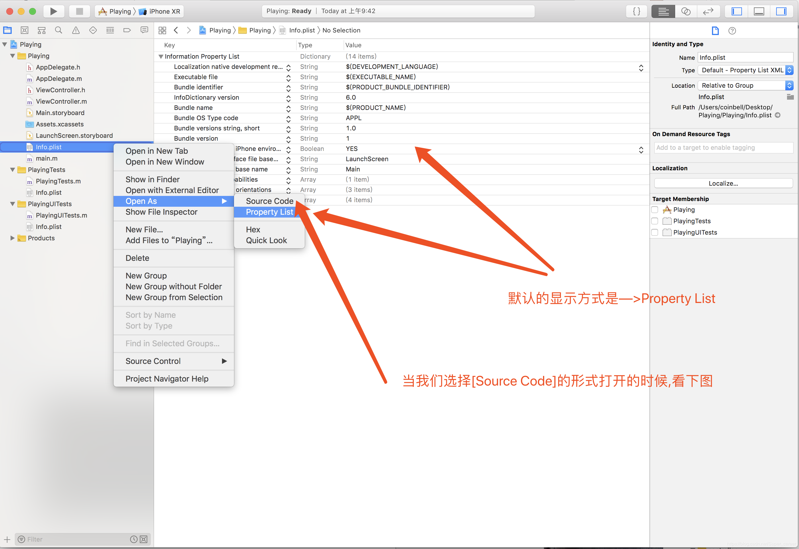
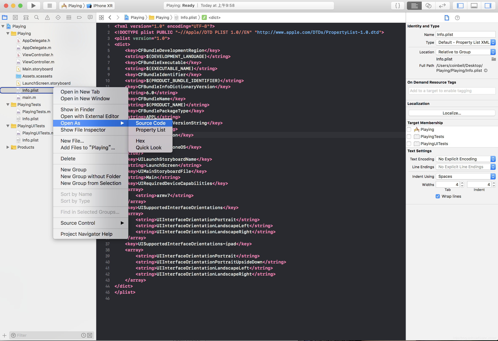
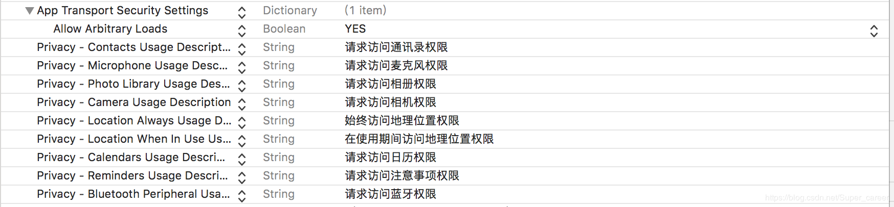
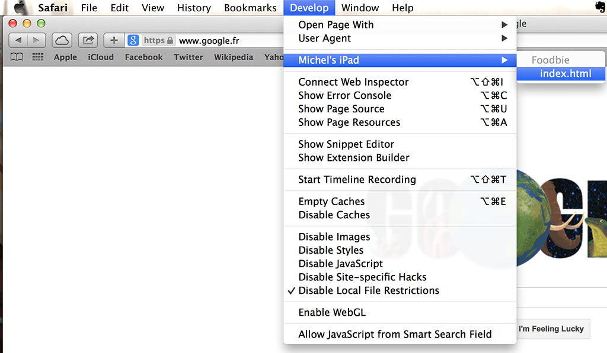

# Cordova

## 基本操作

> 参考[CLI Reference](https://cordova.apache.org/docs/en/latest/reference/cordova-cli/index.html)

安装cordova

```undefined
npm install -g cordova
```

安装指定版本的cordova

```css
npm install -g cordova@3.1.0-0.2.0
```

查看版本

```undefined
cordova -v
```

创建APP

```css
cordova create hello com.example.hello HelloWorld
```

进入项目

```bash
cd hello
```

查看本机安装的平台

```cpp
cordova platforms list
```

查看安装平台的先决条件

```undefined
cordova requirements
```

给项目添加平台支持【当然你也可以添加其他平台的支持，前提是你的本机有】

```csharp
cordova platform add android
```

对项目删除指定平台

```undefined
cordova platform rm android
```

保存平台

```undefined
cordova platform save
```

恢复平台

```undefined
cordova prepare
```

更新平台

```undefined
cordova platform update
```

添加cordova插件

```csharp
cordova plugin add cordova-hot-code-push-plugin【热更新插件】
```

或者使用repo url直接安装（不稳定）

```csharp
cordova plugin add [https://github.com/nordnet/cordova-hot-code-push.git](https://github.com/nordnet/cordova-hot-code-push.git)
```

或者安装本地插件

```csharp
cordova plugin add E:\project\plugins\cordova-hot-code-push-local-dev-addon
```

查看项目安装的插件

```cpp
cordova plugin list
```

唤起插件搜索列表页面

```undefined
cordova plugin search camera
```

安装指定版本号的插件

```csharp
cordova plugin add
```

删除插件

```csharp
cordova plugin remove
```

插件保存

```undefined
cordova plugin save
```

查看已经安装的插件列表以及环境版本情况

```undefined
cordova info
```

查看cordova全部命令

```bash
cordova help
```

编译项目

```undefined
cordova build android 【他会在 platforms/android/bin/ 下已经生成了 apk 文件】
```

启动 android 虚拟机

```bash
cordova emulate android
```

运行 app 项目（在虚拟机或者在真机）

```undefined
cordova run android
```

重新编译

```bash
cordova emulate
```

## Config.xml

# 插件

## cordova-plugin-whitelist

用于配置App在外部可访问的资源, 即白名单(whitelist)

### 安装

```shell
$ cordova plugin add cordova-plugin-whitelist
$ cordova prepare
```

### 可导航的白名单

控制WebView可被导航到哪个URL上, 默认仅被允许导航到`file://`

可在`config.xml`中修改

```xml
<widget ...>
    <!-- Allow links to example.com -->
    <allow-navigation href="http://example.com/*" />

    <!-- Wildcards are allowed for the protocol, as a prefix
         to the host, or as a suffix to the path -->
    <allow-navigation href="*://*.example.com/*" />

    <!-- A wildcard can be used to whitelist the entire network,
         over HTTP and HTTPS.
         *NOT RECOMMENDED* -->
    <allow-navigation href="*" />

    <!-- The above is equivalent to these three declarations -->
    <allow-navigation href="http://*/*" />
    <allow-navigation href="https://*/*" />
    <allow-navigation href="data:*" />
</widget>
```

> Quirks: on Android it also applies to iframes for non-http(s) schemes.

### Intent Whitelist

控制哪个URL, App允许系统去在浏览器中打开. 配置如下

```xml
<widget ...>
	<!-- Allow links to web pages to open in a browser -->
    <allow-intent href="http://*/*" />
    <allow-intent href="https://*/*" />

    <!-- Allow links to example.com to open in a browser -->
    <allow-intent href="http://example.com/*" />

    <!-- Wildcards are allowed for the protocol, as a prefix
         to the host, or as a suffix to the path -->
    <allow-intent href="*://*.example.com/*" />

    <!-- Allow SMS links to open messaging app -->
    <allow-intent href="sms:*" />

    <!-- Allow tel: links to open the dialer -->
    <allow-intent href="tel:*" />

    <!-- Allow geo: links to open maps -->
    <allow-intent href="geo:*" />

    <!-- Allow all unrecognized URLs to open installed apps
         *NOT RECOMMENDED* -->
    <allow-intent href="*" />
</widget>
```

若无`,allow-intent`元素, 外部资源将不被在浏览器中打开. 但Cordova为你配置了一些.

### 网络请求白名单(重点)

控制哪个资源可被App请求到, 如images, XHRs等. 

Cordova提供了两种方式, 从不同方面去配置

* 请求URL配置

  > 这个是通过Cordova的回调方法配置到生成的平台相关的配置中的

  ```xml
  <widget ...>
  	<!-- Allow images, xhrs, etc. to google.com -->
      <access origin="http://google.com" />
      <access origin="https://google.com" />
  
      <!-- Access to the subdomain maps.google.com -->
      <access origin="http://maps.google.com" />
  
      <!-- Access to all the subdomains on google.com -->
      <access origin="http://*.google.com" />
  
      <!-- Enable requests to content: URLs -->
      <access origin="content:///*" />
  
      <!-- Don't block any requests -->
      <access origin="*" />
  </widget>
  ```

  无`access`元素, 将仅允许请求`file://`资源, 但Cordova默认添加`<access origin="*">`

* Content Security Policy

  > 这些配置是通过WebView自身功能实现的

  需要在入口`.html`页面中配置

  ```html
  <!-- Good default declaration:
      * gap: is required only on iOS (when using UIWebView) and is needed for JS->native communication
      * https://ssl.gstatic.com is required only on Android and is needed for TalkBack to function properly
      * Disables use of eval() and inline scripts in order to mitigate risk of XSS vulnerabilities. To change this:
          * Enable inline JS: add 'unsafe-inline' to default-src
          * Enable eval(): add 'unsafe-eval' to default-src
  -->
  <meta http-equiv="Content-Security-Policy" content="default-src 'self' data: gap: https://ssl.gstatic.com; style-src 'self' 'unsafe-inline'; media-src *">
  
  <!-- Allow everything but only from the same origin and foo.com -->
  <meta http-equiv="Content-Security-Policy" content="default-src 'self' foo.com">
  
  <!-- This policy allows everything (eg CSS, AJAX, object, frame, media, etc) except that 
      * CSS only from the same origin and inline styles,
      * scripts only from the same origin and inline styles, and eval()
  -->
  <meta http-equiv="Content-Security-Policy" content="default-src *; style-src 'self' 'unsafe-inline'; script-src 'self' 'unsafe-inline' 'unsafe-eval'">
  
  <!-- Allows XHRs only over HTTPS on the same domain. -->
  <meta http-equiv="Content-Security-Policy" content="default-src 'self' https:">
  
  <!-- Allow iframe to https://cordova.apache.org/ -->
  <meta http-equiv="Content-Security-Policy" content="default-src 'self'; frame-src 'self' https://cordova.apache.org">
  ```

  > 注意, 第一个是默认值啊
  
  > 详细CSP配置说明见[Content Security Policy Reference](https://content-security-policy.com/#source_list)


### 我的配置

最稳妥的配置, 就是基本权限全开....

1. 首先必须存在`cordova-plugin-whitelist`

2. `config.xml`文件中添加

   ```xml
   <allow-navigation href="*" />
   <allow-intent href="*" />
   <access origin="*" />
   ```

3. 入口html页面中添加

   ```html
   <meta http-equiv="Content-Security-Policy" content="default-src *; frame-src *; style-src * 'self' 'unsafe-inline' 'unsafe-eval';  script-src * 'self' 'unsafe-inline' 'unsafe-eval';">
   ```

   > 注意, `Content-Security-Policy`大小写敏感!!!!

> 参考[Cordova 5.3.1 Android app can't access the internet](https://stackoverflow.com/questions/32605034/cordova-5-3-1-android-app-cant-access-the-internet)

# Android

## 环境搭建

### JDK

* 使用Jdk8+以上版本
* 设置`JAVA_HOME`变量, 并添加PATH路径

### Gradle

Gradle是访问不了国外仓库的， 因此需要配置国内镜像。

安装后需添加PATH路径

* 全局配置， 在`$HOME/.gradle`下配置`init.gradle`文件

  ```
  buildscript {
      repositories {
          maven { url 'http://maven.aliyun.com/nexus/content/groups/public/' }
          maven { url 'http://maven.aliyun.com/nexus/content/repositories/jcenter'}
      }
  
      dependencies {
          classpath 'com.android.tools.build:gradle:3.2.0-alpha16'
      }
  }
  
  allprojects {
      repositories {
          maven { url 'http://maven.aliyun.com/nexus/content/groups/public/' }
          maven { url 'http://maven.aliyun.com/nexus/content/repositories/jcenter'}
  
      }
  }
  ```

  > 上面写死了`om.android.tools.build:gradle`版本， 是因为国内镜像源还没有那么新。

* 局部配置，配置优先级更高， 在Cordova项目中必须配置，否则会被项目中的配置覆盖全局配置。

  按照上述方式， 修改`platforms/android/build.gradle`文件即可。然而配置文件有被覆盖的可能.

> 参考[Could not resolve all artifacts for configuration ':classpath'.](https://www.oschina.net/question/114943_2303892?nocache=1551403814162)

### SDK

安装Android Studio, 找到Android SDK Manager (`Tools > SDK Manager`) 

确保下述被安装

1. Android Platform SDK for your targeted version of Android
2. Android SDK build-tools version 19.1.0 or higher
3. Android Support Repository (found under the "SDK Tools" tab)

设置环境变量

* 设置`ANDROID_HOME`变量, 即Android SDK的安装位置.
* 将SDK的`tools`, `tools/bin`和`platform-tools` 添加到`PATH`路径下

----------------


## 模拟器

* 创建Android虚拟设备(AVD), 见[managing AVDs](https://developer.android.com/studio/run/managing-avds.html), [configuring the emulator](https://developer.android.com/studio/run/emulator.html#about)和[setting up hardware acceleration](https://developer.android.com/studio/run/emulator-acceleration.html)

* 运行Cordova应用到模拟器上

  ```shell
  $ cordova run --emulator
  ```


## 签名

应用必须用证书签名后, 才能安装到设备上. (开发时可用*开发证书*)


# IOS

## 权限配置info.plist

IOS APP开发过程中需要用到手机的某些功能, 需要先在`info.plist`中授权才可用. 

`info.plist`中通过键值对的方式配置. 它的值可以是`string`, `array`, `dict`等

> 参考[[iOS干货]—info.plist简单使用,以及访问权限的配置](https://blog.csdn.net/Super_career/article/details/88102624?utm_medium=distribute.pc_relevant.none-task-blog-BlogCommendFromMachineLearnPai2-2&depth_1-utm_source=distribute.pc_relevant.none-task-blog-BlogCommendFromMachineLearnPai2-2)

### 打开方式

xcode中提供了两种方式打开

* 属性列表模式

  

* 源代码模式

  

  > 紧接着`key`的元素为`key`的值

### 常用属性

| 属性                                    | 具体作用                                                     |
| --------------------------------------- | ------------------------------------------------------------ |
| Localization native development region  | 与本地化设置有关，为默认的开发语言                           |
| Executable file                         | 程序安装包的名称                                             |
| InfoDictionary version                  | 版本信息                                                     |
| Bundle identifier                       | 软件唯一的标识，是根据公司的标识与项目名称自动生成的，在上传和测试的时候会用到 |
| Bundle name                             | App安装后显示的名称                                          |
| Bundle OS Type code                     | 用来标识软件包类型                                           |
| Bundle versions string, short           | 发布的版本字符串                                             |
| Bundle creator OS Type code             | 创建者的标识                                                 |
| Bundle version                          | 应用程序版本号                                               |
| Application requires iPhone environment | 用于指示程序包是否只能运行在iPhone OS 系统上，默认为YES      |
| Launch screen interface file base name  | 欢迎界面的文件名称                                           |
| Main storyboard file base name          | 默认情况下程序的主入口                                       |
| Supported interface orientations        | 设置程序默认支持的方向                                       |

### 权限属性



对应代码

```xml
<key>NSAppTransportSecurity</key>
<dict>
    <key>NSAllowsArbitraryLoads</key>
    <true/>
</dict>
<key>NSContactsUsageDescription</key>
<string>请求访问通讯录权限</string>
<key>NSMicrophoneUsageDescription</key>
<string>请求访问麦克风权限</string>
<key>NSPhotoLibraryUsageDescription</key>
<string>请求访问相册权限</string>
<key>NSCameraUsageDescription</key>
<string>请求访问相机权限</string>
<key>NSLocationAlwaysUsageDescription</key>
<string>始终访问地理位置权限</string>
<key>NSLocationWhenInUseUsageDescription</key>
<string>在使用期间访问地理位置权限</string>
<key>NSCalendarsUsageDescription</key>
<string>请求访问日历权限</string>
<key>NSRemindersUsageDescription</key>
<string>请求访问注意事项权限</string>
<key>NSBluetoothPeripheralUsageDescription</key>
<string>请求访问蓝牙权限</string>
```

> `NSAppTransportSecurity`表示是否允许HTTPS请求
>
> 其他的都是配置请求对应资源时的描述语`Description`, 应该是没有描述就丁点机会都没有?

## 调试

* 启动iMAC上Safari的调试模式， 在`Safari/Preferences/Advanced`中勾选`Show Develop menu in menu bar`

* 启动iOS上Safari的调试模式，在`Settings/Safari/Advanced`中勾选`JavaScript`和`Web Inspector`

* 启动iOS上的H5应用，在iMac的Safari上可以找到手机端打开的页面

  

  > 注意，必须是Debug版本的APP

> 参考[Apache Cordova and Remote Debugging on iOS](https://geeklearning.io/apache-cordova-and-remote-debugging-on-ios/)

# 踩坑

用的Cordova写的跨平台应用, 写IOS应用特别恶心!!!!! IOS真是垃圾中的战斗机!!!!

## 后端证书无效

* for IOS

    编译后, 在Xcode中, 找到`Classess/AppDelegate.m`文件, 添加

    ```objective-c
    @implementation NSURLRequest(DataController)
    + (BOOL)allowsAnyHTTPSCertificateForHost:(NSString *)host
    {
        return YES;
    }
    @end
    ```
    
* for Android

    找到并修改`project/platforms/android/CordovaLib/src/org/apache/cordova/engine/SystemWebViewClient.java`文件

    ```java
    public void onReceivedSslError(WebView view, SslErrorHandler handler, SslError error) {
      final String packageName = this.cordova.getActivity().getPackageName();
      final PackageManager pm = this.cordova.getActivity().getPackageManager();
    
      ApplicationInfo appInfo;
      try {
        appInfo = pm.getApplicationInfo(packageName, PackageManager.GET_META_DATA);
        if ((appInfo.flags & ApplicationInfo.FLAG_DEBUGGABLE) != 0) {
          // debug = true
          handler.proceed();
          return;
        } else {
          // debug = false
          // THIS IS WHAT YOU NEED TO CHANGE:
          // 1. COMMENT THIS LINE
          // super.onReceivedSslError(view, handler, error);
          // 2. ADD THESE TWO LINES
          // ---->
          handler.proceed();
          return;
          // <----
        }
      } catch (NameNotFoundException e) {
        // When it doubt, lock it out!
        super.onReceivedSslError(view, handler, error);
      }
    }
    ```

> 参考:
>
> * [Ignoring invalid SSL certificates on Cordova for Android and iOS](http://ivancevich.me/articles/ignoring-invalid-ssl-certificates-on-cordova-android-ios/)
>
> * [Cordova/PhoneGap iOS HTTPS/SSL issues](https://stackoverflow.com/questions/12627774/cordova-phonegap-ios-https-ssl-issues)

## Xcode不能打包

不能打包, 按钮灰的

设置选择*Generic iOS Device*

## 无网络连接

参考上述白名单插件的配置

----------

~~请求权限, 安装` cordova-plugin-whitelist`, 并在`config.xml`文件中添加~~

```xml
<allow-navigation href="*" />
<allow-intent href="http://*/*" />
<allow-intent href="https://*/*" />
```

~~接着, 还要为IOS单独添加`cordova-plugin-ios-plist`插件~~

-----------------------

[Android高版本http网络请求失败的Cordova配置处理](https://www.jianshu.com/p/12ab6718e81c)

## 跨域, 证书问题

存在跨域问题, 但是按照上述白名单中*Content Security Policy*的配置, 可以解决. 不被信任证书的问题就不知道了, 没有仔细测试过了.

# 调试神器

vconsole

# ---第二次学习的分割线---

# Overview

## 架构


* Plugins扩充WebView能力, 让Js可调用OS原生功能

## 开发方式

* 跨平台工作流

  一切操作都通过`cordova`命令行工具上进行, 能保证打多个平台的包

* 聚焦特定平台的工作流

  将Cordova嵌入到原生应用中(embedding webbiew).

# 创建第一个APP

* 安装`cordova`命令行工具

  ```shell
  sudo npm install -g cordova
  ```

* 创建App

  ```shell
  cordova create hello com.example.hello HelloWorld
  ```

  > 生成的脚手架中, `www/index.html`文件为入口页面.

* 添加App的目标平台

  ```bash
  cordova platform add ios
  cordova platform add android
  cordova platform add browser # 无需任何SDK
  ```

  > 这些平台信息将被保存在`config.xml` 和 `package.json`中; 
  >
  > 同时平台文件被存入`/platforms/`目录中, 不要试着去修改平台文件, 因为修改的内容容易被覆盖.

* 安装必备环境

  构建时, 对应平台的构建环境必须搭建. 通过`cordova requirements`可检查缺少什么环境. 其中平台`browser`无需任何SDK配置

  ```bash
  $ cordova requirements
  Requirements check results for android:
  Java JDK: installed .
  Android SDK: installed
  Android target: installed android-19,android-21,android-22,android-23,Google Inc.:Google APIs:19,Google Inc.:Google APIs (x86 System Image):19,Google Inc.:Google APIs:23
  Gradle: installed
  
  Requirements check results for ios:
  Apple OS X: not installed
  Cordova tooling for iOS requires Apple OS X
  Error: Some of requirements check failed
  ```

* 构建App

  为所有平台构架App

  ```shell
  cordova build
  ```

  仅为一个平台构建App

  ```shell
  cordova build ios
  ```

* 测试App

  在模拟器中运行

  ```shell
  cordova emulate android
  ```

  在真机中运行, 电脑需要连接上设备.

  ```shell
  cordova run android
  ```

* 插件操作

  插件将原生SDK功能, 通过Javascript API暴露出来

  搜索插件

  ```shell
  cordova plugin search camera
  ```

  添加插件

  ```shell
  cordova plugin add cordova-plugin-camera
  ```

  列举已安装插件

  ```shell
  cordova plugin ls
  ```

* 根据不同平台自定义化

  在构建不同平台APP时, `/merges`下平台相关的文件夹内的内容, 都将被**移入**或**覆盖**到`/www`对应目录下.

  例子, 构建IOS APP时, `/merges/ios/css/a.css`文件将被移入或覆盖到`/www/css/`目录下.

* 更新

  更新cordova命令行工具, 使用`npm`更新的方式即可

  更新平台:

  ```bash
  $ cordova platform update android --save
  $ cordova platform update ios --save
  ```

# App模板

> NPM上提供的仓库大部分都很老了, 不建议使用. 且Cordova+Vue集成超级简单.

## 介绍

`cordova create`创建项目时, 使用默认模板[cordova-app-hello-world](https://github.com/apache/cordova-app-hello-world)生成的项目.

也可使用其他模板, 模板可来自于NPM仓库, Git仓库或本地:

```shell
$ cordova create hello com.example.hello HelloWorld --template <npm-package-name>
$ cordova create hello com.example.hello HelloWorld --template <git-remote-url>
$ cordova create hello com.example.hello HelloWorld --template <path-to-template>
```

NPM仓库中的模板可在[npm](https://www.npmjs.com/search?q=cordova%3Atemplate) 搜索

## 创建模板

模板结构

```
template_package
├── package.json (生产模板时需要的依赖)
├── index.js (模板生成入口, 需要提供模板地址)
└── template_src (index.js中指定的模板地址, 含App所需的所有模板)
    ├── package.json
    ├── config.xml
    └── (files and folders that make up the template)
```

重点在于`index.js`文件

```javascript
const path = require('path');

module.exports = {
    dirname : path.join(__dirname, 'template_src') //提供模板地址
};
```

`package.json`最好添加关键字`"cordova:template"`, 这样, 模板上传到NPM仓库时, 便于搜索出来, 如

```json
{
    "name": "cordova-example-template",
    "version": "1.0.0",
    "...": "...",
    "keywords": [
        "cordova:template"
    ]
}
```

注意, 模板目录(`template_src`下都会被拷贝到新建的项目中, 但模板文件`.gitignore`必须重命名为`gitignore`, 以避免冲突. 生成项目时, 会自动为你恢复命名.

> 详细参考[cordova-app-hello-world](https://github.com/apache/cordova-app-hello-world)

# 其他

* Cordova Plugins的搜索
  * [plugin search](https://cordova.apache.org/plugins/)
  * [npm](https://www.npmjs.com/search?q=ecosystem%3Acordova)

* 获取`cordova`命令帮助

  ```shell
  # 使用简述
  cordova
  # 具体命令使用
  cordova help <command>
  ```

  或看文档[CLI Reference](https://cordova.apache.org/docs/en/latest/reference/cordova-cli/index.html)


