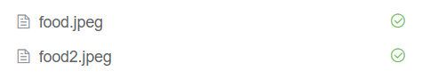
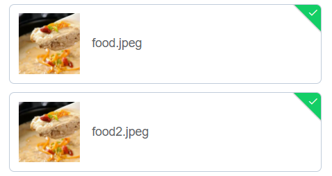
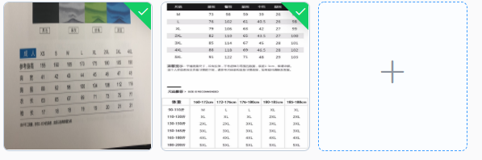

# 使用

安装：

```bash
npm i element-ui -S
```

全局使用：在入口文件中添加

```javascript
import ElementUI from 'element-ui';
import 'element-ui/lib/theme-chalk/index.css';

Vue.use(ElementUI);
```

# 基础

## Layout

- **介绍**：`el-row`元素表示一行，`el-col`表示一列，一共**24**列
- **列数**：`el-col`的`span`属性设置占用列数
- **间隔**：`el-row`的`gutter`属性设置列间间隔
- **偏移**：`el-col`的`offset`属性设置偏移量
- **对齐**：`el-row`设置`type="fex"后`，`justify`可指定对齐方式。
- **响应式**：`el-col`可设置`xs`,`sm`,`md`,`lg`,`xl`

# 表单

## Select

- **介绍**：提供下拉菜单供选择。`el-select`元素代表下拉菜单，`el-option`元素代表其中一项。

- **基本使用**：`el-select`上使用`v-model`；`el-option`的`label`属性设置标签，`value`属性设置选中后得到的值。

  > 使用`v-for`指令时务必设置`key`

- **禁用select**：`el-select`添加`disabled`

- **可清除**：添加清除图标，`el-select`添加`clearable`属性

- **多选择**：`el-select`添加`multiple`允许选择多个；默认选择的选型显示成标签模式，添加`collapse-tags`进入压缩模式。

- **自定义选项**：略

- **选项组**：。。。

- 。。。

- **创建新选项**：`el-select`添加`allow-create`属性，并且必须设置`filterable`属性。

  > 一般设置`multiple`允许多选；设置`default-first-option`允许回车选择第一个

## Upload

文件上传控件，需放入子元素，才能触发文件选择。通过`list-type`属性，可设置已上传文件的列表样式。如果不满意，可自行禁止列表`show-file-list`，然后自定义子元素。详细见文档的例子User avatar upload。

- 常用属性

  - action（必须）：请求url

  - name：上传文件的参数名，默认`file`

  - auto-upload：是否自动上传，默认`true`

    ------

  - multiple：是否允许一次上传多个文件，即一次选择多个文件。默认`false`

  - drag：是否允许拖拽上传，默认`false`

  - limit：最大上传文件个数。

    - on-exceed：超过limit时的回调函数。

    ------

  - show-file-list：是否显示已上传文件列表，默认`true`

  - list-type：文件列表类型。

    - text（默认）：
    - picture：
    - picture-card：

  - file-list：默认已上传文件，默认`[]`

    ------

  - headers：请求头字段

  - data：请求的额外数据

  - with-credentials：是否携带凭证（cookies），用于跨域。

- 一堆回调函数：略

- Slot

  - trigger：触发文件对话框的内容。貌似没有指定时，触发内容为默认slot
  - tip：提示内容

- 方法：比如`submit`，手动上传时使用；等等；

## Form

- **介绍**：`el-form`表示表单，`el-form-item`表示表单项（包裹`input`元素）。能够提供收集、**验证**（主要使用原因）和提交数据的功能。
- **基本使用**：`el-form`的`model`设置表单数据，`label-width`：设置标签宽度；`el-form-item`的`label`属性设置标签名
- **inline form**：`el-form-item`默认为`block`，`el-form`的`inline`属性将之设置为`inline-block`
- **标签位置**：`el-form`的`label-position`设置标签位置，值`left/right/top`
- **验证**：`el-form`的`rules`属性设置所有规则，`el-form-item`的`prop`属性设置某个规则对应的键值。

。。。还是觉得十分不好用，还是用vue的watch来验证比较合适。

