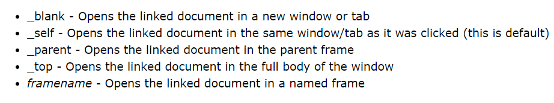
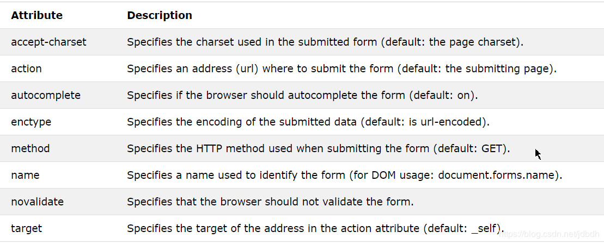

[TOC]

# 一、介绍
html全称超文本标记语言（Hyper Text Markup），用于在网页上展现超文本的标记语言。

html经历了很多的版本，最新的为html5，这里介绍的就是**html5**。浏览器对html的容错性大，即使语法不正确浏览器也能正确解析，但是最好还是使用正确的语法。

html网页中可以同时完成内容展示、页面渲染和用户交互。但是一般都是将这些分离到不同的地方去，比如html只用来展示内容，元素最好体现出语义；css用来美化界面；javascript用来与用户交互。**因此这里只给出标签的含义、功能和用法**。

html5默认使用**utf-8**作为文本编码，元素标签大小写不敏感，但建议**小写**。html默认会过滤掉多余的空格或换行，但是可以通过css改变这种设置。

# 二、组成
html文档声明、元素和注释组成。
## 模板
```html
<!DOCTYPE html>
<html lang="zh-CN">
<head>
<meta charset="UTF-8">
<title>Insert title here</title>
<meta name="viewport" content="width=device-width, initial-scale=1.0">
</head>
<body>
in test.html
</body>
</html>
```
这里的模板并不是最简单的形式。最简单的形式可以没有`head`元素。`html`为文档的根元素，`head`元素描述了一些和文档相关的内容。所有的可视元素写在`body`中。

`<!DOCTYPE>`声明该文档为html5，**只能出现一次，且必须在最顶部**。大小写不敏感。

`<meta charset="UTF-8">`为html5指定网页编码的方式，不需要使用使用`<meta http-equiv="content-type" content="text/html; charset=UTF-8">`。浏览器事先不知道文档编码却又为何可以读取该元素？请参考：[4.3、编码猜测][1]

`<meta name="viewport" ...`设置网页大小与**视口**一致，与css有关，这里不展开。请参考：[viewport meta 元素][2]

[1]:https://blog.csdn.net/jdbdh/article/details/83651915#4.3%E3%80%81%E7%BC%96%E7%A0%81%E7%8C%9C%E6%B5%8B
[2]:https://blog.csdn.net/jdbdh/article/details/81329822

## 元素
html元素通常由**开始标签**、**结束标签**和**内容**组成，标签和属性名大小写不敏感。开始标签中可以有**属性**，键值对的形式，可用**双引号**（*建议使用*）或单引号围住值，也可不用，多个属性通过空格隔开；如果属性值是布尔值，那么可以直接写上属性名不带值；内容可以包含其他元素。**空元素**没有内容和结束标签，有两种写法，如`<br>`，`<br/>`。

	<tagname attri="value">content goes here...</tagname>

html元素可以大致分为**block元素**和**inline元素**。block元素**前后**会换行然后**尽可能**的占据所有的行空间；inline元素**不换行**，占据**仅需要**的空间。这里会涉及到css，这里暂不展开。

~~inline元素不能嵌套block元素，即使使用样式`display:block`改变它的显示方式也不能嵌套。~~

## 注释
注释会被浏览器忽略。

	<!-- Write your comments here -->

# 三、[元素][5]
html元素是html最重要的组成部分，这里会简略讲解**html5**各个元素，如果没有对应标签，说明不是html5规定的标签。有关css的内容会在另一篇博客中给出。

[5]:https://www.w3schools.com/tags/ref_byfunc.asp

## 属性
属性为html元素提供额外信息。每个元素都有不同的属性，在讨论具体元素时给出，但是有些属性是所有元素都有的，称为**全局属性**。这里讨论全局属性，全部全局属性参考：[Global Attributes][3]

| 属性            | 描述                                                         |
| --------------- | :----------------------------------------------------------- |
| [id][4]         | 为一个元素指定一个在**该网页**中**唯一**的id，css和js都可以通过id访问到该元素。链接和id组合，可以链接到具体一个元素。 |
| class           | 可以为**多个元素**指定一个class，相当于将多个元素归为一类。通过css和js可以访问到这一组元素。 |
| style           | 设置内联样式                                                 |
| lang            | 指定文档使用的语言                                           |
| title           | 提供额外信息，鼠标悬停元素之上时会显示出来                   |
| contenteditable | 指定元素是否可以被编辑                                       |
| hidden          | 隐藏元素，即display:none                                     |
| data-*          | 自定义属性，在元素中存储数据                                 |
| tabindex        | 让元素可focus, 且能够参与`tab`键切换元素.                    |

详细介绍:

* **style**属性值的设置格式如下：

    ```html
    <tagname style="property:value;[property:value;]...">
    ```
    
* `tabindex`

    * `-1` 可被focus, 但不参与`tab`键切换
    * `0` 可focus, 以自然顺序参与`tab`切换
    * 正数, 尚不清除

其他属性请参考链接。

[3]:https://www.w3schools.com/tags/ref_standardattributes.asp
[4]:https://www.w3schools.com/html/html_id.asp

## basic 元素
| Tag              | Description                            |
| ---------------- | :------------------------------------- |
| `<!DOCTYPE>`     | Defines the document type              |
| `<html>`         | Defines an HTML document               |
| `<head>`         | Defines information about the document |
| `<title>`        | 标题，会显示在浏览器的地址栏上         |
| `<body>`         | Defines the document's body            |
| `<h1> `to` <h6>` | Defines HTML headings                  |
| `<p>`            | Defines a paragraph                    |
| `<br>`           | 软换行                                 |
| `<hr>`           | 另起一行，画一条水平线                 |
| `<!--...-->`     | Defines a comment                      |

## formatting 元素
formatting元素就是用来格式化（比如加粗、倾斜、变小、加删除线等）文本或其他内容的，对于不同元素浏览器都会提供默认样式。这些样式**完全**可以通过css改变，因此不要在意是否好看，而是**根据语义**决定是否使用该元素。

这些元素在平常布局时是不常用的，但是一些编辑器中会被使用到，比如Markdown。这里给出一些有意思的元素。

1. `<pre>`：内容的格式会被保存。
2. .....没了

下面是全部元素：

| Tag            | Description                                                  |
| -------------- | ------------------------------------------------------------ |
| `<abbr>`       | Defines an abbreviation or an acronym                        |
| `<address>`    | Defines contact information for the author/owner of a document/article |
| `<b>`          | Defines bold text                                            |
| `<bdi>`        | Isolates a part of text that might be formatted in a different direction from other text outside it |
| `<bdo>`        | Overrides the current text direction                         |
| `<blockquote>` | Defines a section that is quoted from another source         |
| `<cite>`       | Defines the title of a work                                  |
| `<code>`       | Defines a piece of computer code                             |
| `<del>`        | Defines text that has been deleted from a document           |
| `<dfn>`        | Represents the defining instance of a term                   |
| `<em>`         | Defines emphasized text                                      |
| `<i>`          | Defines a part of text in an alternate voice or mood         |
| `<ins>`        | Defines a text that has been inserted into a document        |
| `<kbd>`        | Defines keyboard input                                       |
| `<mark>`       | Defines marked/highlighted text                              |
| `<meter>`      | Defines a scalar measurement within a known range (a gauge)  |
| `<pre>`        | Defines preformatted text                                    |
| `<progress>`   | Represents the progress of a task                            |
| `<q>`          | Defines a short quotation                                    |
| `<rp>`         | Defines what to show in browsers that do not support ruby annotations |
| `<rt>`         | Defines an explanation/pronunciation of characters (for East Asian typography) |
| `<ruby>`       | Defines a ruby annotation (for East Asian typography)        |
| `<s>`          | Defines text that is no longer correct                       |
| `<samp>`       | Defines sample output from a computer program                |
| `<small>`      | Defines smaller text                                         |
| `<strong>`     | Defines important text                                       |
| `<sub>`        | Defines subscripted text                                     |
| `<sup>`        | Defines superscripted text                                   |
| `<template>`   | Defines a template                                           |
| `<time>`       | Defines a date/time                                          |
| `<u>`          | Defines text that should be stylistically different from normal text |
| `<var>`        | Defines a variable                |
| `<wbr>`        | Defines a possible line-break          |

## Links 元素
| Tag          | Description                                                  |
| ------------ | :----------------------------------------------------------- |
| `<a>`        | Defines a hyperlink                                          |
| `<link>	` | Defines the relationship between a document and an external resource (most used to link to style sheets) |
| `<nav>	`  | Defines navigation links，用做链接的容器                     |

### a
**语法：**

	<a href="url"  [target="value"] >inline context</a>

**属性：**
1. **href**：指定链接地址，可以是相对地址。

   > 当不想让其跳转时, `href`值可设置为`#`或`javascript:void`

2. **target**：指定在哪里打开链接
    
    如果target为_top，那么在iframe中点击链接，那么会在**当前网页**打开链接。

这里要注意的是，url可以与元素id结合（如`html_demo.html#C4`），点击该链接时，浏览器会自动定位到该元素。

内容不仅仅是文本，还可以是其他inline元素，比如image。

### link
**示例：**
	
	<link rel="stylesheet" type="text/css" href="theme.css">

**属性：**
1. rel：链接文档与当前文档的关系
2. type：链接文档的媒体类型
3. href：链接文档的地址

常用于链接样式表，type可以省略。

## images 元素

 Tag          | Description
--------------|---------------------
  ``        | Defines an image
`<map>`        | Defines a client-side image-map                                      
 `<area>`       | Defines an area inside an image-map                                  
 `<canvas>`     | Used to draw graphics, on the fly, via scripting (usually JavaScript) 
 `<figcaption>` | Defines a caption for a `<figure>` element                        
 `<figure>`     | Specifies self-contained content                                   
 `<picture>`    | Defines a container for multiple image resources                      
 `<svg>`        | Defines a container for SVG graphics                                  

### img
**示例：**

	

src和alt必须指定，如果src指定的文件不存在时，会显示alt的文字。

通过width和height可以指定大小，但是如果没有指定，会显示图片默认大小。单位px，但是经测试可以用%。可以被样式覆盖。

## Lists 元素
| Tag     | Description                                                  |
| ------- | :----------------------------------------------------------- |
| `<ul>`  | Defines an unordered list                                    |
| `<ol>`  | Defines an ordered list                                      |
| `<li>`  | Defines a list item                                          |
| `<dir>` | Not supported in HTML5. Use `<ul>` instead.Defines a directory list |
| `<dl>`  | Defines a description list                                   |
| `<dt>`  | Defines a term/name in a description list                    |
| `<dd>`  | Defines a description of a term/name in a description list   |

**示例：**
	
	无序列表
	<ul>
	  <li>Coffee</li>
	  <li>Tea</li>
	  <li>Milk</li>
	</ul>
	有序列表
	<ol>
	  <li>Coffee</li>
	  <li>Tea</li>
	  <li>Milk</li>
	</ol>

通过样式可以控制列表的外观，通过语义使用它即可。

## tables
| Tag          | Description                                                  |
| ------------ | :----------------------------------------------------------- |
| `<table>`    | Defines a table                                              |
| `<caption>`  | Defines a table caption                                      |
| `<th>`       | Defines a header cell in a table                             |
| `<tr>`       | Defines a row in a table                                     |
| `<td>`       | Defines a cell in a table                                    |
| `<thead>`    | Groups the header content in a table                         |
| `<tbody>`    | Groups the body content in a table                           |
| `<tfoot>`    | Groups the footer content in a table                         |
| `<col>`      | Specifies column properties for each column within a `<colgroup>` element |
| `<colgroup>` | Specifies a group of one or more columns in a table for formatting |

其中

* `td`元素
  * `colspan` 跨多少列
  * `rowspan` 跨多少行
  
* `colgroup`, `col` 用于给列设置样式, 如

  ```html
  <table class="inner-table">
      <colgroup>
          <col style="width:25%"/>
          <col style="width:25%"/>
          <col style="width:50%"/>
      </colgroup>
      <tbody>
          <tr>
              <td>1</td>
              <td>2</td>
              <td>3</td>
          </tr>
          <tr>
              <td colspan="2">4</td>
              <td>5</td>
          </tr>
      </tbody>
  </table>
  ```

## frames

在html5中，只有`<iframe>`可用了。

示例：
	
	<iframe src="https://www.baidu.com/" height="200" width="300"></iframe>

效果：
<iframe src="https://www.baidu.com/" height="200" width="300"></iframe>
要注意的是，链接`<a>`的target属性可以指定要打开链接的的iframe名字。iframe名字通过name给定。

## forms and input
| Tag          | Description                                                |
| ------------ | :--------------------------------------------------------- |
| `<form>`     | Defines an HTML form for user input                        |
| `<input>`    | Defines an input control                                   |
| `<textarea>` | Defines a multiline input control (text area)              |
| `<button>`   | Defines a clickable button                                 |
| `<select>`   | Defines a drop-down list                                   |
| `<optgroup>` | Defines a group of related options in a drop-down list     |
| `<option>`   | Defines an option in a drop-down list                      |
| `<label>`    | Defines a label for an `<input>` element                   |
| `<fieldset>` | Groups related elements in a form                          |
| `<legend>`   | Defines a caption for a `<fieldset>` element               |
| `<datalist>` | Specifies a list of pre-defined options for input controls |
| `<output>`   | Defines the result of a calculation     |

示例：

	<form action="/action_page.php" method="get" target="_self">
	  First name:<br>
	  <input type="text" name="firstname" value="Mickey"><br>
	  Last name:<br>
	  <input type="text" name="lastname" value="Mouse"><br><br>
	  <input type="submit" value="Submit">
	</form>

有name属性的表单元素才会被发送，发送给`form`元素action指定的网页，通过method指定的方法发送，然后在target指定的位置打开。

### form

**属性：**

1. action：指定发送数据的目的地（默认当前网页）
2. method：发送的请求方式（默认get）
3. target：响应展示的位置（默认_self）
4. novalidate：表单是否验证，一些表单在发送前会进行验证。
5. [enctype][10]：被提交数据如何编码（MIME类型，默认application/x-www-form-urlencoded）


当上传文件时，method必须使用post方式，enctype使用multipart/form-data。

[10]:https://www.w3schools.com/tags/att_form_enctype.asp

> 参考[form](https://www.w3schools.com/tags/tag_form.asp)

### [input][7]


[7]:https://www.w3schools.com/tags/tag_input.asp

输入表单需要指定输入类型（type属性），只有含有name属性才会被发送。

能够发送给服务端的数据有很多，比如文本、密码、颜色、email、文件、日期、image等，都可以通过type类型指定。一些输入表单可以验证输入，但是form的属性可以取消验证。type可选的值有：
>button checkbox color date  datetime-local  email  `file` `hidden` image month  number  `password` `radio` range  reset search `submit` tel `text` time  url week

参考：[HTML Input Types](https://www.w3schools.com/html/html_form_input_types.asp)

input有一些十分有用的属性：
1. pattern：给定正则表达式，浏览器在提交时会自动验证
2. required：该表单必须输入值
3. disabled：该字段被禁用
4. readonly：只读
5. name：表单名，后端会接收到该名字
6. value：默认值
7. placeholder：占位符，用来提示用户输入类容的
8. mutiple：允许多选

参考：[HTML Input Attributes](https://www.w3schools.com/html/html_form_attributes.asp)

还可以为input表单提供参考值，如示例：
```html
	<form action="/action_page.php">
	  <input list="browsers">
	  <datalist id="browsers">
	    <option value="Internet Explorer">
	    <option value="Firefox">
	    <option value="Chrome">
	    <option value="Opera">
	    <option value="Safari">
	  </datalist> 
	</form>
```

### 其他表单
`<select>`可以提供下来列表

`<textarea>`提供文本框

## audio/video
| Tag        | Description                                                  |
| ---------- | :----------------------------------------------------------- |
| `<audio>`  | Defines sound content                                        |
| `<source>` | Defines multiple media resources for media elements (`<video>`, `<audio>` and `<picture>`) |
| `<track>`  | Defines text tracks for media elements (`<video>` and `<audio>`) |
| `<video>`  | Defines a video or movie                                     |

## styles and semantics
| Tag         | Description                                                 |
| ----------- | :---------------------------------------------------------- |
| `<style>`   | Defines style information for a document                    |
| `<div>`     | Defines a section in a document                             |
| `<span>`    | Defines a section in a document                             |
| `<header>`  | Defines a header for a document or section                  |
| `<footer>`  | Defines a footer for a document or section                  |
| `<main>`    | Specifies the main content of a document                    |
| `<section>` | Defines a section in a document                             |
| `<article>` | Defines an article                                          |
| `<aside>`   | Defines content aside from the page content                 |
| `<details>` | Defines additional details that the user can view or hide   |
| `<dialog>`  | Defines a dialog box or window                              |
| `<summary>` | Defines a visible heading for a `<details>` element         |
| `<data>`    | Links the given content with a machine-readable translation |

html5提供了很多元素，它没有特殊的作用，除了拥有鲜明的语义，可以作为网页不同组件的容器，然后通过css可以渲染网页。而不必自己提供对应的class属性，规范化了html的编写。

### style
用于为单个网页定义样式信息。

	<style>
	  body {background-color: powderblue;}
	  h1 {color: red;}
	  p {color: blue;}
	</style>

## meta info
| Tag          | Description                                                  |
| ------------ | :----------------------------------------------------------- |
| `<head>`     | Defines information about the document                       |
| `<meta>	` | Defines metadata about an HTML document                      |
| `<base>`     | Specifies the base URL/target for all relative URLs in a document |

### meta
`<meta>`是一些关于数据的数据，常用于指定编码、视口大小，指明编辑作者、网页的关键字等，示例如下：
	
	<head>
	  <meta charset="UTF-8">
	  <meta name="description" content="Free Web tutorials">
	  <meta name="keywords" content="HTML,CSS,XML,JavaScript">
	  <meta name="author" content="John Doe">
	  <meta name="viewport" content="width=device-width, initial-scale=1.0">
	</head>

### base
默认情况下`<a href="foo.html">`中的相对地址（具体是指path-relative url，即路径不以“/”开始）是相对于当前网页的，但是可以通过base元素修改。base元素为所有path-relative url定义默认base url或target属性。

	<base href="http://www.baidu.com/" target>

**注意**：base可以是path-absolute的地址（即相对于根路径）；base对Domain-absolue和path-absolute路径的链接无效。参考4.1小结。

<https://stackoverflow.com/questions/51619597/html5-base-tag-with-root-relative-url>

## programming
| Tag          | Description                                                  |
| ------------ | :----------------------------------------------------------- |
| `<script>`   | Defines a client-side script                                 |
| `<noscript>` | Defines an alternate content for users that do not support client-side scripts |
| `<applet>`   | Not supported in HTML5. Use `<embed>` or `<object>` instead.Defines an embedded applet |
| `<embed>`    | Defines a container for an external (non-HTML) application   |
| `<object>`   | Defines an embedded object                                   |
| `<param>`    | Defines a parameter for an object                            |

### script
`<script>`元素中可以写javascrpit代码，或者直接指向外部的js文件，如：

```java
<!-- js写在script中：-->
<script>
function myFunction() {
   document.getElementById("demo").innerHTML = "Paragraph changed.";
}
</script>
链接外部js：
<script src="myScript1.js"></script>
```

要注意的是，如果src属性存在，`<script>`元素必须为空。

# 四、其他
## 路径
URL是URI的一种，使用URI的语法表示：

	URI = scheme:[//authority]path[?query][#fragment]
	authority = [userinfo@]host[:port]

--------------------------

全部给出，即为**绝对地址**（absolute url），即：`https://en.wikipedia.org/wiki/URL`。其他的都为相对地址，但是还可以细分下去。

-----------------

如果不给出scheme，即为**协议相对地址**（protocol relative url 或 domain absolute url）。如：

	<a href="//services/">
	<a href="//services/video-production/corporate-videos">

以“//”开始，协议与链接所在网页使用的协议一致，所有是协议相对的。

-----------------------------

如果authority（域名）也不给出，即为**根相对地址**（root relative url 或 path absolute url）。：如：
	
	<a href="/services/">
	<a href="/services/video-production/corporate-videos">

路径以“/”开始，即相对于的web服务器的根路径。

**注意**：对于java web应用的话，千万不要把该地址当做web应用根路径。

-------------

相对于当前网页的地址称为**路径相对地址**（path relative url）。即路径不以“\”开始，如：
	
	<a href="services/video-production/corporate-videos">
	<a href="corporate-videos">

-------------------

相对于当前目录或上级目录的地址称为**目录相对地址**（relative directory traversal）。以“..”或"."开始，分别是相对于父路径和当前路径，如：

	../file
	./directory/file

-----------------------------------------

**注意**：路径可以指向文件（path以文件名结尾），也可以指向目录（path以“/”结尾）。但是即使指向目录，服务器都会正确返回一个文件，比如index.html文件。当然，服务器可以控制这种行为。

[url](https://en.wikipedia.org/wiki/URL)
[\<base\ tag with root relative url>](https://stackoverflow.com/questions/51619597/html5-base-tag-with-root-relative-url)
[relative vs. absolute urls and seo](http://www.dirigodev.com/blog/seo-web-best-practices/relative-vs-absolute-urls-seo/)

## url编码
url传输时只能是通过ascii码传输，非ascii字符会被编码，通过网页指定的编码来编码（默认utf-8），编码成“%”紧跟十六进制的形式。如果有空格，会被`+`或者`%20`代替。

如使用utf-8编码的网页发送一个链接，含有一个“`牛`”字，会被编码成`%E7%89%9B`，查看它的utf-8编码：`E7 89 9B`发现会一一对应。

## html实体
一些字符为html保留字符，不能被直接使用；字符集数量太大，以至于不能全部被打印出来。这两个问题都可以通过html实体来表示，可以通过**实体名**或者**实体码**来表示。形式如下：

	实体名
	&entity_name;
	实体码，也就是字符对应的code point，默认十进制，但是以“x”开头则使用十六进制
	&#entity_number;

因为html5使用的是**unicode字符集**，因此可以通过实体展示unicode任何字符。

如：空格使用`&nbsp;`或`&#160;`表示。

有意思的是，emoji表情也在unicode字符集中，因此可以直接显示出emoji表情出来。如笑脸code point为`U+1F600`，那么实体为`&#x1F600;`。显示效果：<span>&#x1F600;</span>

[emoji](https://en.wikipedia.org/wiki/Emoji)

-------

当使用`innerHTML`属性赋值字符串时, 如果不想被解析成元素, 可将以下字符转义:

* `&lt;` <=> `<`

* `&gt;` <=> `>`

* `&amp;` <=> `&`

* `&quot;` <=> `"`

* `&nbsp;` <=> ` `

  > 这个不是必须的, 但是为了保证格式一直, 最好转义

> 注意, 最好`&`先转义, 否则实体将不生效. 含实体的字符串给`innerHTML`属性赋值时才生效

> 参考[Entity](https://developer.mozilla.org/en-US/docs/Glossary/Entity)

## MIME类型
MIME（Multipurpose Internet Mail Extensions）是一种指定文件类型的标准，广泛使用在web数据传输上，告诉对方数据组织的格式，便于对方解析。

MIME类型的通用结构如下：
>type/subtype

type执行文件类型的主要分类，分为两种：discrete和multipart。subtype是该type类型中具体的类型。

>文件扩展名也可以确定文件类型，但是在web传输中仅使用MIME，在头字段`Content-type`中指定。在tomcat中，全局文件web.xml几乎对每种可能的扩展文件指定了一种MIME类型。

### Discrete types
| Type        | Description                                                  | Example of typical subtypes                                  |
| ----------- | :----------------------------------------------------------- | :----------------------------------------------------------- |
| text        | Any document that contains text and is theoretically human readable | text/plain, text/html, text/css, text/javascript, text/markdown |
| image       | Any kind of image. Videos are not included, though animated images (like animated GIF) are described with an image type. | image/gif, image/png, image/jpeg, image/bmp, image/webp, image/vnd.microsoft.icon |
| audio       | Any kind of audio file                                       | audio/midi, audio/mpeg, audio/webm, audio/ogg, audio/wav     |
| video       | Any kind of video file                                       | video/webm, video/ogg                                        |
| application | Any kind of binary data, especially data that will be executed or interpreted somehow. | application/octet-stream, application/pkcs12, application/vnd.mspowerpoint, application/xhtml+xml, application/xml, application/pdf application/x-www-form-urlencoded |

如果文本文档不知道具体类型，一般`text/plain`会被使用；如果二进制文档不知道具体类型，一般会使用`application/octet-stream`。

### Multipart types
>multipart/form-data
>multipart/byteranges

Multipart表示会将文档分为多个部分，经常每个部分都有不同的MIME类型。

form表单上传文件时必须使用第二种。

参考：[MIME types](https://developer.mozilla.org/en-US/docs/Web/HTTP/Basics_of_HTTP/MIME_types)

### 其他
#### application/x-www-form-urlencoded
在form表单中默认使用该类型保存参数键值对。键值对以`&`分隔，键值用`=`分隔，空格用`+`替代，非字母数字字符使用如下十六进制表示：`%HH`。

如可能的消息体内容如下：
```normal
MyVariableOne=ValueOne&MyVariableTwo=ValueTwo
```
其中，url编码也使用了这种方法。

#### multipart/form-data
在form表单中常用于文件传输。该类型将键值对分成几个**part**，每个part被特殊字符边界分隔（在content-Type中定义）。每个part都有一些可选的头字段，如Content-Type、Content-Disposition等。其中Content-Disposition含有字段名或文件名信息。

例子：
```html
<form action="http://localhost:8000/" method="post" enctype="multipart/form-data">
  <label>Name: <input name="myTextField" value="Test"></label>
  <label><input type="checkbox" name="myCheckBox"> Check</label>
  <label>Upload file: <input type="file" name="myFile" value="test.txt"></label>
  <button>Send the file</button>
</form>
```
```normal
POST / HTTP/1.1
Host: localhost:8000
User-Agent: Mozilla/5.0 (Macintosh; Intel Mac OS X 10.9; rv:50.0) Gecko/20100101 Firefox/50.0
Accept: text/html,application/xhtml+xml,application/xml;q=0.9,*/*;q=0.8
Accept-Language: en-US,en;q=0.5
Accept-Encoding: gzip, deflate
Connection: keep-alive
Upgrade-Insecure-Requests: 1
Content-Type: multipart/form-data; boundary=---------------------------8721656041911415653955004498
Content-Length: 465

-----------------------------8721656041911415653955004498
Content-Disposition: form-data; name="myTextField"

Test
-----------------------------8721656041911415653955004498
Content-Disposition: form-data; name="myCheckBox"

on
-----------------------------8721656041911415653955004498
Content-Disposition: form-data; name="myFile"; filename="test.txt"
Content-Type: text/plain

Simple file.
-----------------------------8721656041911415653955004498--
```

参考：
[application/x-www-form-urlencoded or multipart/form-data?](https://stackoverflow.com/a/4073451/10248407)
[HTML <form> enctype Attribute](https://www.w3schools.com/tags/att_form_enctype.asp)
[MDN multipart/form-data](https://developer.mozilla.org/en-US/docs/Web/HTTP/Basics_of_HTTP/MIME_types#multipartform-data)
[Content-Disposition](https://developer.mozilla.org/en-US/docs/Web/HTTP/Headers/Content-Disposition)

----------------------
其他的以后补充

## 编辑器

如果通过HTML元素作为编辑器, 该如何? 

首先看HTML原生提供的可作为编辑器的内容:

* `textarea`: 是一个表单元素, 该元素提供一个多行文本框, 输入的字符串的格式会被保存下来
* 元素上添加`contenteditable="true"` 会根据输入字符串的格式和所处环境, 生成对应的子元素.

然后, 上述方式并不满足一般应用的需要. 所以这里介绍一些现场的编辑器.

主要有两种编辑器: 富文本编辑器和通用文本编辑器

* 富文本编辑器
  * [ProseMirror](http://prosemirror.net/): 构建富文本所需的工具, 比较底层
  * [tiptap](https://github.com/scrumpy/tiptap): 基于ProseMirror编写的富文本编辑器.
  * ...
* 通用文本编辑器
  * [CodeMirror](https://github.com/codemirror/codemirror)

# 参考
* [html5教程](https://www.w3schools.com/html/default.asp)
* [html参考](https://www.w3schools.com/tags/default.asp)
* [url](https://en.wikipedia.org/wiki/URL)
* [\<base\ tag with root relative url>](https://stackoverflow.com/questions/51619597/html5-base-tag-with-root-relative-url)
* [relative vs. absolute urls and seo](http://www.dirigodev.com/blog/seo-web-best-practices/relative-vs-absolute-urls-seo/)
* [emoji](https://en.wikipedia.org/wiki/Emoji)
* [字符编码](https://blog.csdn.net/jdbdh/article/details/83651915)
* [http协议](https://blog.csdn.net/jdbdh/article/details/83021497)
* [viewport meta](https://blog.csdn.net/jdbdh/article/details/81329822)

* [兼容性查看](https://caniuse.com/)