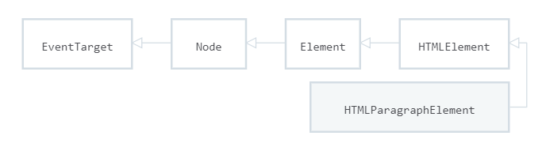

[TOC]

# 一、介绍
html用于定义网页的结构，css设置网页格式和外观，javascript则添加交互内容。

在浏览器的环境下，javascript并不仅仅指的语言，它包括了：核心语言（ECMAScript）和Web APIs（包括DOM） 。
1. **核心语言（ECMAScript）**：ECMAScript只定义了语言规则，不仅仅用于浏览器环境，还可以用于服务端脚本，如node.js。javascript几乎实现了ECMAScript所有的规范，包括:
	* **Language syntax** (parsing rules, keywords, control flow, object literal initialization, ...)
	* **Error handling mechanisms** (throw, try/catch, ability to create user-defined Error types)
	* **Types** (boolean, number, string, function, object, ...)
	* **The global object**. In a browser, this global object is the window object, but ECMAScript only defines the APIs not specific to browsers, e.g. parseInt, parseFloat, decodeURI, encodeURI...
	* **A prototype-based inheritance mechanism**
	* **Built-in objects and functions** (JSON, Math, Array.prototype methods, Object introspection methods, etc.)
	* **Strict mode** (see here)
2. **DOM APIs**：浏览器环境中提供的api。其中DOM代表文档，可以通过DOM与文档交互。还包括一些其他的api，比如XMLHttpRequest、Canvas 2D Context相关的api。

众所周知，，DOM在所有浏览器中差异性很大，一些特性不兼容。因此通过一些可靠的、跨浏览器兼容的库来抽象DOM特性，比如JQuery、prototype和YUI。

参考：
[JavaScript technologies overview](https://developer.mozilla.org/en-US/docs/Web/JavaScript/JavaScript_technologies_overview)
[Introduction](https://developer.mozilla.org/en-US/docs/Web/JavaScript/Guide/Introduction)

# 二、语法
这里开始介绍javascript的核心语法，即ECMAScritp的内容，奈何它的语法太多了，这里只介绍了**入门**所需要的知识。

javascript是一种面向对象、动态类型、函数式编程等等等语言。声明变量时不需要指定类型，一切皆为对象，不论是数组、还是函数，都是一种特殊的对象。所谓对象，即有方法有属性的变量。在javascript并没有类，但是有prototype机制，因此照样可以继承其他对象的属性和方法，也因此可以通过构造函数来生成对象。构造函数和普通函数并没有什么区别，只是在使用new关键值时被当做了构造函数。函数也是一种对象，但可以储存代码，在其他对象中传递，因此会出现闭包的概念。

一切皆为对象，那么在全局作用域内定义的变量和函数属于谁？ECMAScript规定了一个全局对象，属于该对象的属性和方法。ECMAScript定义了全局变量的接口，由所处的环境提供该变量，通过该对象操作环境，在浏览器的环境中为**window**。

注意！！ECMAScript和环境无关，只是语言，比如javascript就实现了ECMAScript的所有语法，是js的一部分；node.js也是使用ECMAScript作为脚本语言；在qt中，ECMAScript也被实现过。等等等。

参考：
[A re-introduction to JavaScript (JS tutorial)](https://developer.mozilla.org/en-US/docs/Web/JavaScript/A_re-introduction_to_JavaScript)

## 2.1、变量
变量是用来存储数据的容器，可以是**任何类型数据**。javascript是**动态类型语言**（也称弱类型语言），声明变量时不需要指定数据类型，但通过操作符`typeof`可以打印变量类型。

变量必须被声明才能被使用，否则报错。声明变量没有赋初始值时，则默认`undefined`。

### 2.1.1、变量命名
javascript支持unicode字符集，变量也可以使用中文来命名。但是命名最好还是要符合一定规范，下面给出的不是强制的，但最好准守：
1. 使用数字（0-9）、字母（a-z，A-Z）和下划线命名。
2. 不要以下划线、数字开头。下划线开始的变量名有特殊意义。
3. 最好使用驼峰命名法，即变量和方法的首个单词小写，之后的每个单词首字母大写。方法第一个单词最好是动词。
4. 不要使用保留字和DOM对象的名字。

大小写敏感。

### 2.1.2、变量声明
javascript中使用`var`、`let`和`const`来定义变量。

`var`声明的变量
1. 没有[block scope][1]（块作用域）,只有function scope；
2. 并且**声明**有[hoisting][2]现象，但**初始化**没有该现象；
3. 可以多次声明变量。

hoisting表示任何地方的变量声明都会被放到作用域内最顶端。例子如下：
```javascript
bla=2;//由于hoisting的存在，下面的声明会跑到作用域顶端，因此可以对比变量赋值
var bla;

console.log(a);//undefined。即使声明会hoisting，但是初始化不会，因此还是未赋值状态。
var a=3;

var x=1;
{
	var x=2;//允许多次声明变量
}
console.log(x);//2,因为没有块作用域

//var变量i没有块作用域，因此这里可以访问到
for(var i=0;i<10;i++){
	//i这里可以访问
}
//i这里可以访问
```
注意，**函数声明**也存在hosting现象，几乎没有块作用域，但是block作用域会限制函数声明hosting到该block作用域的顶端。但要注意，**函数名**是隐性的变量名。如：
```javascript
myfun1();//函数声明也可hosting，因此可调用
function myfun1(){...};

foo();//错误，因为函数声明被限制在块作用域顶端
foo;//undefined，因为函数名是一个隐性变量，不受块作用域影响，因此相当于被声明了但没赋值。
{
	function foo(){...}
	foo();//正确
}
foo();//几乎没有块作用域，现在能够看到函数声明了
```

---------
看到了吧,var即复杂，又和我们使用的习惯不一样（对于c++，java程序员来说），因此后面又出现了`let`和`const`关键值来声明变量。

`let`有块作用域，没有hoisting现象，和c++、java声明的变量一样。如：
```javascript
a=3;//错误，未定义不能使用。
let a;
a=4;//正确

//i不能在这访问
for(let i=0;i<10;i++)｛
	//i可以在这访问
｝
//i不能在这访问
```

`const`与let类似，但声明的时候必须初始化，并且不能被修改。

[1]:https://developer.mozilla.org/en-US/docs/Web/JavaScript/Reference/Statements/block
[2]:https://developer.mozilla.org/en-US/docs/Web/JavaScript/Reference/Statements/var#var_hoisting

## 2.2、类型
大致分为如下：
* Six data types that are primitives:
	* Boolean
	* Null
	* Undefined
	* Number
	* String
	* Symbol (new in ECMAScript 6)
* Object
	* Function
	* Array
	* Date
	* RegExp

在javascript中，尽管一切皆为对象，但是它还是有六种基本类型的。。并且**值是不可变的**，传参时是**按值传递**，而不是按引用传递！！

除了null和undefined，其它基本类型都有对应的包装对象，可以调用它的实例方法。如：
```javascript
"tom".toUpperCase();//"TOM"
(2).toString();"2"
```
注意，typeof null;//"object"  。。。

### 2.2.1、Numbers
根据说明书，数值都是用双精度浮点数表示的，但是实际上整数还是被当做32位int。但也不用担心`3/2=1`问题的出现，并且整数可以使用按位运算。

一些内置函数可以将字符转化为Number，如`parseInt()`,`parseFloat()`。`+`，`Number()`也可以将字符转化为数值。如：
```javascript
parseInt('123', 10); // 123
parseInt('010', 10); // 10，忽略0，不会当做八进制
parseInt('0x10'); // 16 ，会当作二进制
parseInt('11', 2); // 3，指定二进制
+ '42';   // 42
+ '010';  // 10，同样，不当作八进制。。
+ '0x10'; // 16
Number('123');//123
```
运算过程中会出现一些特殊值：**NaN**（Not a Number）、`Infinity`（无穷大）和`-Infinity`（负无穷大），如：
```javascript
parseInt('hello', 10); // NaN
1 / 0; //  Infinity
-1 / 0; // -Infinity
```
参考：
[Number](https://developer.mozilla.org/en-US/docs/Web/JavaScript/Reference/Global_Objects/Number)

### 2.2.2、Strings
使用utf-16的code units编码，因此一个字符1或2个code units编码，并且length属性以code unit为单位。

字符串用单引号或双引号围起来，单引号内可以存在双引号，反之亦然。特殊字符也可以通过转义，成为普通字符。+可以连接字符串与字符串，字符串与数值。Number()函数可将字符串转化为数值。数值变量的toString()方法可将数值转化为字符串。

一切皆为对象，string也为对象，有一些属性和方法可使用：
1. length：得到字符串长度。
2. []：通过下标获取某个字符。
3. indexof()：找到子串出现的开始位置。
4. slice()：通过索引截取子串。
5. toLowerCase(),toUpperCase()：获得全小写或大写的字符串。
6. replace()：将字符串中的子串替换成其他的子串。

参考：
[String](https://developer.mozilla.org/en-US/docs/Web/JavaScript/Reference/Global_Objects/String)

### 2.2.3、其他类型
`null`表示**故意设置**的、不存在的值；`undefined`表示变量还未初始化，函数没有返回值时也会返回undefined。

**任何值**都可以被转化为布尔值，根据如下规则：
1. false, 0, empty strings (""), NaN, null, and undefined all become false.称为**falsy**
2. All other values become true.称为**truthy**

Boolean()可以显示转化值为布尔值，但是很少使用，因为会自动转化（java中不会）。

## 2.3、操作符
完整操作符内容可以参考：[Expressions and operators][3]

`+`可以用来做字符串连接：
```javascript
'hello' + ' world'; // "hello world"
'3' + 4 + 5;  // "345" ，连接之前先转换成字符串
 3 + 4 + '5'; // "75"
```

比较运算符要注意`===`，`!==`与`==`，`!=`的区别，前者同时比较变量的类型和值，而后者仅仅比较值。
```javascript
//比较前会先转换成同一类型
123 == '123'; // true
1 == true; // true
//类型不同，false
123 === '123'; // false
1 === true;    // false
```
`&&`和`||`使用短路逻辑，即是否执行第二个条件取决于第一个。如：
1. 访问对象属性之前检查该对象是否为null：
	```javascript
	var name = o && o.getName();
	```
2. 当值是falsy，则赋值一个：
	```javascript
	var name = cachedName || (cachedName = getName());
	```
`typeof`可以打印变量类型，返回的string形式。

[3]:https://developer.mozilla.org/en-US/docs/Web/JavaScript/Guide/Expressions_and_Operators

## 2.4、控制语句
完整控制语句参考：[Loops and iteration][4]
语句有：if else、while、do-while、for、switch。

要注意，block语句（即｛｝）可以看做一个语句。

for语句有两种变种：
1. for...in：用于遍历对象所有可遍历**属性**。
	```javascript
	for (let property in object) {
	  // do something with object property
	}
	```
2. for...of：用于遍历array的值。
	```javascript
	for (let value of array) {
	  // do something with value
	}
	```
switch中，表达式和case值之间是通过`===`来比较的。

三元运算符：
```javascript
condition ? exprT : exprF 
```
[4]:https://developer.mozilla.org/en-US/docs/Web/JavaScript/Guide/Loops_and_iteration#do...while_statement

## 2.5、Arrays
数组是一个可以存入多个任意类型值的对象。下标访问、赋值，从0开始。
```javascript
//create array
var random = ['tree', 795, [0, 1, 2]];
var shopping = ['bread', 'milk', 'cheese', 'hummus', 'noodles'];
//access array
shopping[0];
//modify array items
shopping[0]='tahini';
//access two-dimensional array
random[2][2];
```

`length`属性实际上是**最大索引+1**，有时候不表示数组实际个数。

访问不存在数组，返回undefined。可以使用`for...of`遍历数组。

一些有用的数组方法：
* String的split()方法分割字符串产生数组
* Array的join()方法合并数组成为字符串
* Array的toString()方法将数组转化为字符串
* push()和pop()方法分别在数组底端添加和删除数组。
* unshift()和shift()方法分别在数组前端添加和删除数组。
* `splice`用于在某个索引上添加或删除元素。
* `Array.from`：浅拷贝
## 2.6、Objects
对象是一组属性和方法的集合。其实对象就是**键值对**的集合，键是名字，值可以是任意类型，比如函数、对象、数组等。

对象可以通过构造函数或对象字面值（object literal）创建。如：
```javascript
//构造函数
var obj = new Object();
//object literal
var obj = {
  name: 'Carrot',
  for: 'Max', // 'for' is a reserved word, use '_for' instead.
  details: {
    color: 'orange',
    size: 12
  }
};
```
通过Dot notation或Bracket notation访问对象，也可以创建新的属性或方法。Bracket notation最为灵活，通过字符串来访问属性或方法，甚至使用变量提供变量名。
1. Dot notation
	```javascript
	//access
	person.age
	//set
	person.age=2323;
	//set non-exist property or method
	person.newProperty="i'm a new property";
	person.newFun=function(){...};
	```
2. Bracket notation
	```javascript
	//access
	person['age'];
	//set
	person['age']=2222;
	//set non-exist method
	person['newFun']=function(){...};
	//set property dynamically by using variable
	let propName="name";
	person[propName]=....
	```

### 2.6.1、literal
上面已经谈到过了对象字面值，这里深入一下。

literal由零个或多个键值对的列表组成，被花括号包含起来。属性名可以是标识符、数字或字符串，值可以是任意类型对象或其字面值。
```javascript
var person = {
  name: ['Bob', 'Smith'],
  age: 32,
  gender: 'male',
  interests: ['music', 'skiing'],
  bio: function() {
    alert(this.name[0] + ' ' + this.name[1] + ' is ' + this.age + ' years old. He likes ' + this.interests[0] + ' and ' + this.interests[1] + '.');
  },
  greeting: function() {
    alert('Hi! I\'m ' + this.name[0] + '.');
  }
};
```

如果属性名不是合理的标识符或数子，则必须使用字符串表示属性名，然后通过bracket notation（[ ]）来访问该属性。如：
```javascript
var unusualPropertyNames = {
  '': 'An empty string',
  '!': 'Bang!'
}
console.log(unusualPropertyNames['']);  // An empty string
console.log(unusualPropertyNames['!']); // Bang!
```
object literal还支持:
1. setting the prototype at construction
2. shorthand for `foo: foo` assignments
3. defining methods
4. making super calls
5. computing property names with expressions

如：
```javascript
var obj = {
    // __proto__
    __proto__: theProtoObj,
    // Shorthand for ‘handler: handler’
    handler,
    // Methods
    toString() {
     // Super calls
     return 'd ' + super.toString();
    },
    // Computed (dynamic) property names
    [ 'prop_' + (() => 42)() ]: 42
};
```

参考：
[Object literals](https://developer.mozilla.org/en-US/docs/Web/JavaScript/Guide/Grammar_and_Types#Object_literals)

### 2.6.2、JSON
尽管JSON已经不是Object的内容了，但是由于JSON是基于Object literal表示法的，因此很有必要在这里谈一下。

JSON的完整语法可以参考：[Full JSON syntax][5]

部分语法如下：
```markup
JSON = null
    or true or false
    or JSONNumber
    or JSONString
    or JSONObject
    or JSONArray
```
可见值的类型可以是对象、数组、数值、字符串、boolean和null。

JSON和literal的一些区别如下：
1. 属性名必须使用双引号的字符串
2. 不能有方法
3. 除了上面的类型外，其他的可以用字符串表示，比如Date.toJSON()返回日期的字符串表示。
4. 数值的首个数字不能为0，小数后面必须接一个数字。
...

这些区别在JSON的语法中都可以清楚的看出来。

[5]:https://developer.mozilla.org/en-US/docs/Web/JavaScript/Reference/Global_Objects/JSON#Full_JSON_syntax

### 2.6.3 解构(Destructuring)
解构，即将数组的元素或对象的属性赋值到单个变量中。数组按位置赋值，对象按变量名赋值，如下所示：
```javascript
//数据安装位置赋值
var a, b, rest;
[a, b] = [10, 20];
console.log(a); // 10
console.log(b); // 20

[a, b, ...rest] = [10, 20, 30, 40, 50];
console.log(a); // 10
console.log(b); // 20
console.log(rest); // [30, 40, 50]

//对象按照变量名赋值
({ a, b } = { a: 10, b: 20 });//需要小括号，防止{a,b}被解析为块语句
console.log(a); // 10
console.log(b); // 20

({a, b, ...rest} = {a: 10, b: 20, c: 30, d: 40});
console.log(a); // 10
console.log(b); // 20
console.log(rest); // {c: 30, d: 40}
```
>参考：[Destructuring assignment](https://developer.mozilla.org/en-US/docs/Web/JavaScript/Reference/Operators/Destructuring_assignment)

### 2.6.4 其他
#### 2.6.4.1 Object.assign()
将源对象的可遍历属性拷贝给目标对象，如果目标对象有相同属性，则被覆盖。属于浅拷贝。
**语法**：
```javascript
Object.assign(target, ...sources)
```
**参数**：
>* target：目标对象
>* sources：源对象

**返回值**：
>* 目标对象
## 2.7、Functions
简单的一个函数：
```javascript
function add(x, y) {
  var total = x + y;
  return total;
}
```
1. 函数可以接收0到多个参数，如果调用时没有传入参数，那么参数默认为undefined
2. 如果函数定义时没有参数列表，但是调用时传入了参数，可以通过[arguments][6]对象访问这些对象。
3. return用来返回值并结束函数，可以直接`return;`不返回值但结束函数。如果函数没有返回值时，函数默认返回undefined。
4. 函数的定义会引入函数作用域。

[arguments][6]是一个类似array的**对象**，存有所有传入函数的参数。可以通过下标访问参数，有length属性。也可通过for of语句遍历：
```javascript
function add(){
	var sum=0;
	for(let value of arguments){
		sum+=value;
	}
	return sum;
}
add(2,3,4,5);//14
```

[Rest parameter syntax][7]允许接收无限个参数，然后存入到一个数组中。
```javascript
//除了第1、2个参数外，其他参数组合构建成一个数组存入theArgs中。
function f(a, b, ...theArgs) {
  // ...
}
```

[spread operator][8]用于函数调用时将数组展开成逗号分隔的参数，如`avg(...numbers)`

匿名函数，没有方法名，作为一个表达式，最好添加分号在语句尾。
```javascript
var avg=function(){...};
```

[6]:https://developer.mozilla.org/en-US/docs/Web/JavaScript/Reference/Functions/arguments
[7]:https://developer.mozilla.org/en-US/docs/Web/JavaScript/Reference/Functions/rest_parameters
[8]:https://developer.mozilla.org/en-US/docs/Web/JavaScript/Reference/Operators/Spread_operator

### 2.7.1 apply()和call()
>预备知识：2.8.1 this

都是**Function.prototype**的方法，即所有函数可调用。这两个可以方法指定`this`和`arguments`来调用函数。`apply()`和`call()`在于，`apply()`的`arguments`参数接收array-like对象。

语法：
```javascript
function.apply([thisArg, [argsArray]])
```
参数：
* `thisArg`：函数调用的`this`值。如果没有给定，在non-strict mode中，会自动包装（auto box）为调用该方法的对象；strict mode中，不会自动包装，`this`值为`undefined`
* `argsArray`：传给函数调用的参数，array-like对象。

>`bind()`方法返回该函数的拷贝，除了`this`指针指向被指定的值。

>参考：[Search Function.prototype.apply()](https://developer.mozilla.org/en-US/docs/Web/JavaScript/Reference/Global_Objects/Function/apply)

### 2.7.2 函数声明
函数有两种方法定义：函数声明和函数表达式

函数声明：
```javascript
function a(){}
```
函数表达式（匿名函数）：
```javascript
var a=function(){}
```
实际上，函数表达式也可以拥有名字，但只能在函数内部使用，通过函数`name`属性取出。但感觉没啥子用处。

>class可以说是一种特殊的函数，也有上述两种定义方式。

>对象中的方法定义可以使用简写，见2.6.1小节

## 2.8、对象实例化与继承
JavaScript是基于原型（prototype）的语言，没有class语句的存在。*不过现在有了class语句了，但只是prototype的语法糖罢了，这里不介绍或以后介绍了。*

除了对象字面值可以直接建立对象，还可以通过构造函数来实例化对象。构造函数实例化的方式很复杂，首先先理解几个概念。

### 2.8.1、this
`this`关键词，在函数中通常为`undefined`，当然也可以使用`call()`、`apply()`方法手动设置`this`值；在对象方法中指向该对象。由于**自动包装**(auto box)的存在，`undefined`或`null`值将被替换为全局对象（如`window`），`primitive`值被包装成对象。但在**strict mode**下，不会发生自动包装。

下面看看两个非strict模式下自动包装的例子：
```javascript
var s={first:"Simon",
	last:"Willison",
	fullName:function(){

		return this.first+' '+this.last
	}
};
s.fullName();//"Simon Willison" ，此时this指向s
var fullName=s.fullName;
fullName();//undefined undefined ,fullName是全局变量window的方法，因此this指向window
```
----------
```javascript
function test(){
    test.a="aaa";
    function innerTest(){
        console.log(this.a)//因为this还是指向全局变量window，因此输出undefined
    }
    innerTest();
}
test();
```
>参考：[Does javascript autobox?](https://stackoverflow.com/a/17216967/10248407)
### 2.8.2、prototype
每个对象都有一个**prototype object**（原型对象），被存入到对象的__proto__属性中。prototype object的所有属性和方法都会被该对象继承。而prototype object对象源自于构造函数（constructor function）的prototype属性，该属性也是一个对象，Object。prototype object中有个属性constructor，指向它的构造函数。

对象调用属性或方法的过程，以调用方法为例：
>1. 先查看该对象是否有该方法，有则执行该方法。
>2. 如果没有，则查看对象的__proto__属性，看是否有对应方法，如果有则执行，否则继续查看__proto__的__proto__属性，直到达到prototype chain底部。
>3. 执行时要注意，this指向的是调用该函数的对象。

重申一下`new`关键字的过程：
>1. new后面的函数被当作构造函数，因此先创建一个Object对象，构造函数中 this指向该对象。
>2. 为构造函数创建prototype属性（一个Object对象）；prototype对象中创建一个constructor属性，指向该构造函数。
>3. 将构造函数的prototype属性赋值该新对象的__proto__属性上。
>4. 执行构造函数。
>5. 返回该对象。

每个被构造函数实例化的对象的__proto__都**引用**构造函数的prototype属性，**因此实际上prototype object被所有对象共享**。例如，里面声明的方法只有一份。因此，当添加一个新的方法到构造函数的prototype属性上，所有对象都能够使用该方法。

理解了上面的过程，也就理解构造函数实例化对象的过程。举个例子：
```javascript
function Person(first, last) {
  this.first = first;
  this.last = last;
}
Person.prototype.fullName = function() {
  return this.first + ' ' + this.last;
};
Person.prototype.fullNameReversed = function() {
  return this.last + ', ' + this.first;
};
//instantiation
let person1=new Person("Simon","Willsion");
person1.fullName();//"Simon Willsion"
```
实例化person1的过程中，`new`关键字创建了一个对象，构造函数中的this指向了该对象。构造函数中对该对象添加了两个属性。同时该对象的__proto__属性指向了构造函数的prototype属性。然后返回对象给person1变量。person1调用fullName时，person1自身没有方法fullName，查看了它的prototype object，即__proto__属性，发现有该函数，于是调用。由于person1是调用该函数的对象，因此fullName方法中的this正确的指向了person1，然后返回正确结果。

前面的例子是一个很好的模板，不建议在构造函数中为构造函数的prototype属性添加方法，如果这样，那么每次实例化对象都会创建新的方法然后覆盖原方法上，影响效率。

### 2.8.3、继承
javascript中的继承是**对象之间**的继承，即一个对象继承另一个对象所有属性，作为对象的属性；而原型方法（即构造函数prototype属性中定义的方法）则构成一个prototype chain。

一般对象是通过构造函数来创建的，因此对象之间的继承通过改写构造函数来完成。用到了几个方法：
1. `function.call(thisArg, arg1, arg2, ...)`：在thisArg的上下文中调用函数。此时this会指向拥有该上下文的对象，即thisArg。
2. `Object.create()`：创建新对象，参数中的对象作为新对象的原型对象（prototype object）。

具体例子或模板：
```javascript
function Person(...){
	//实例化后对象的属性
	this....=...
	...
｝
//实例化后对象的方法
Person.prototype....=function(...){...}
...

function Teacher(...){
	//在this上下文中执行构造函数Person，即Person函数中的this指向Teacher实例化的对象。
	Person.call(this,....);
	//创建实例化后对象的属性，必须在后面，才能覆盖Person函数创建的属性。
	this....=...
	...
}
//prototye指向新对象，该新对象的__proto__属性指向Person.prototyep，这样构成了一个原型链。
Teacher.prototype=Object.create(Person.prototype);
//新创建的对象没有该属性，需要自己创建。
Teacher.prototype.constructor=Teacher;
//实例化后对象的原型方法
Teacher.prototype....=function(...)...
...
```
看不懂？呵呵。。我觉得我过几天自己都看不懂。。。

## 2.9、闭包
函数中还可以定义函数，而且可以访问外部函数的变量。如：
```javascript
function parentFunc() {
  var a = 1;

  function nestedFunc() {
    var b = 4; // parentFunc can't use this
    return a + b; 
  }
  return nestedFunc(); // 5
}
```
但是下面呢？
```javascript
function makeAdder(a) {
  return function(b) {
    return a + b;
  };
}
var x = makeAdder(5);
var y = makeAdder(20);
x(6); // ?
y(7); // ?
```
这里涉及一个概念：作用域对象（scope object）。每当函数开始执行时，一个新的作用域对象就会被创建，这个对象会保存所有在函数内创建的变量（包括参数）。不像全局对象（可以通过this访问，在浏览器中为window），这些作用域对象不能被直接访问。

因此，当makeAdder()函数被调用时，作用域对象也被创建。即使makeAdder()函数结束后，scope对象也不会消失，因为被创建的内部函数没有结束，仍有引用指向scope对象的引用，因此垃圾回收器不会回收该对象。

于是:
```javascript
x(6); // returns 11
y(7); // returns 27
```
## 2.10 strict mode
strict mode限制了一些javascript语法的使用，并且赋予了普通代码新的含义。strict mode的一些规则或作用：
1. 一些错误（silent errors）会被忽视，但strict mode抛出该错误
2. 更好的优化效率
3. 一些在以后ECMAScript版本中使用的语法或word会被保留
4. 不能对未定义变量赋值。
5. 不能删除不可配置属性
6. 作用域：将`use strict;`写在脚本最顶部，则作用到**全局作用域**中。但是多个脚本拼接后，`use strict`未位于顶部，则失效。将`use strict`写在函数顶部，则为**函数作用域**，函数中的函数也会在strict mode中。
7. 函数中this，见2.8.1小结
8. 非non-strict mode中，可以通过修改`arguments`来修改函数中的**命令**参数；但strict mode中，arguments中保存了一份命令参数的拷贝，因此修改不能作用到命令参数中了。
9. 对`eval`做出了一些修改，略。。。
10. 略！！！。。 

>参考：
>* [Transitioning to strict mode](https://developer.mozilla.org/en-US/docs/Web/JavaScript/Reference/Strict_mode/Transitioning_to_strict_mode)
>* [Strict mode](https://developer.mozilla.org/en-US/docs/Web/JavaScript/Reference/Strict_mode)

## 2.11 class
类只是javascript原型继承链的语法糖，并没有引入新的对象继承模型。因此可以参考2.8小节来理解。

* **类定义**：类实际上是一个特殊的函数，因此可以与函数一样，通过class声明、class表达式定义。但定义的class没有hoisting现象。
* **strict mode**：class的body处于strict mode中，即使实例对象将原型、静态方法赋值给其他变量或对象，该方法也处于strict mode中。
* **组成**：class中由构造函数`constructor`、原型方法、静态方法、字段声明（目前处于实验阶段，建议不用）组成。
	* **构造方法**：一般用于定义字段，有且只能有一个；
	* **原型方法**：实例对象后，原型方法会位于对象的`__proto__`中；
	* **静态方法**：就是class这个“特殊”的函数（亦为对象）的自己的方法啦，不会出现在实例对象的原型链中，因此不能被实例对象访问。
* `this`、`super`：构造方法、原型方法中应该使用this来引用其字段；`super`在子类中引用父类。使用准则：一般常在构造方法中使用`this`创建字段，在原型方法中引用字段；常使用`super()`调用父类构造函数。
* **字段声明**：目前字段声明处于实验阶段，因此这里只提一提。首先，字段声明在class body内前端，可以有默认值。
	* **公有字段**：使类具有自我描述性，仅此而已。
        ```javascript
        class Rectangle {
          height = 0;
          width;
          constructor(height, width) {    
            this.height = height;
            this.width = width;
          }
        }
        ```
    * **私有字段**：类外使用不被允许，且不被看到。但必须在body内前端声明，否则之后再创建也会被认作普通属性。
        ```javascript
        class Rectangle {
          //私有字段必须存在，且#开头
          #height = 0;
          #width;
          constructor(height, width) {    
            this.#height = height;
            this.#width = width;
          }
        }
        ```
* **继承**：使用`extends`继承父类，然后构造`constructor`顶部使用`super()`调用父类构造函数创建父类的实例属性。
	**继承的结果**：子类实例对象获得子类和父类的实例属性，子类与父类的原型方法构成原型链，存入实例对象的prototype对象中（即`__proto__`），然后子类的可以覆盖父类的。与2.8.3小节实现并无啥子差别。
	
	>因为继承也是语法糖，也可以通过一定手段继承传统的构造函数，略！

例子：
```javascript
    class Animal { 
      //构造方法
      constructor(name) {
        //实例属性
        this.name = name;
      }
      //原型方法
      speak() {
        console.log(this.name + ' makes a noise.');
      }
      //静态方法
      static staticMethod(){
          console.log("i'm static method in Animal class");
      }
    }
    //class自己的属性
    Animal.aaaa="i'm normal property for Animal because it's a special function or object";
    //把class当作构造函数。。
    Animal.prototype.bbbb=function(){
        console.log("alse could consider it as traditional constructor");
    }

    //继承
    class Dog extends Animal {
      constructor(name) {
        //调用父类构造函数，创建父类实例属性
        super(name); 
        //也可以创建子类实例属性，覆盖父类的
        //this.name="tom";
      }

      speak() {
        console.log(this.name + ' barks.');
      }
    }

    let d = new Dog('Mitzie');
    d.speak(); // Mitzie barks.
    //类也是一种对象或方法，它自己的方法不会出现在实例对象的原型链中；它自己的属性不会出现在实例对象的属性中
    Animal.staticMethod();
```
是否注意到了，class中方法定义的不同？class中方法定义使用简写方式，见2.6.1，且只能这样定义！
>参考：[Classes](https://developer.mozilla.org/en-US/docs/Web/JavaScript/Reference/Classes)

## 2.12、其他
### 2.12.1、注释
1. 单行注释
    ```javascript
    // I am a comment
    ```
2. 多行注释
    ```javascript
    /*
      I am also
      a comment
    */
    ```
### 2.12.2 模板字符串(Template literals)
模板字符串（Template）允许在字符串中嵌入表达式，语法如下：
```javascript
`string text`

`string text line 1
 string text line 2`

`string text ${expression} string text`

tag `string text ${expression} string text`
```
最后一个才是最全的写法，tag是一个自定义的函数名，它处理模板字符串，默认行为是将这些部分concatenate（组装）成一个字符串。

执行过程：表达式`${expression}`将模板字符串分割成多个部分（parts），执行表达式，所有部分（parts）全都传入函数tag中，返回函数处理结果。

tag函数编写，略！
>参考：[Template literals](https://developer.mozilla.org/en-US/docs/Web/JavaScript/Reference/Template_literals)

## 2.13 模块
模块（module）和脚本（script）类似，都是一个含有JavaScript代码的文件，但还有一些不同。

* 模块中只有被`export`（导出）的部分，才能在其他模块`import`（导入）并使用，`import()`可以动态导入。
* 模块默认处于**strict mode**
* 模块默认使用`defer`方式异步加载，关于`defer`见[JavaScript入门3.3小节][2131]
* `import`可以在模块中使用，也能在html的内嵌脚本中使用，但必须加上`type="module"`属性；但`import()`可以在普通脚本中使用；`export`只能在模块中使用。
* 引入的模块，受同源政策限制。（因此有引入模块的html代码最好在服务器下打开）
* html中多次引入模块，只执行一次。

>习惯使用后缀`.mjs`区分普通js文件

[2131]:https://blog.csdn.net/jdbdh/article/details/84770324#33javascript_764

### 2.13.1 模块导出(export)
模块写好后，需要使用`export`导出允许其他模块使用的部分。部分语法如下：
```javascript
//导出变量、方法、类，指定名字
export { name1, name2, …, nameN };//导出变量、方法、类，name为其名字
export let name1, name2, …, nameN; // 导出变量，也可以使用var const
export function FunctionName(){...}//导出函数
export class ClassName {...}//导出类

//导出默认部分，因此可以不给出名字
export default expression;
export default function (…) { … } // also class, function*
export default function name1(…) { … } // also class, function*
export { name1 as default, … };

//重定向，即导出其他模块的内容
export * from …;
export { name1, name2, …, nameN } from …;
export { import1 as name1, import2 as name2, …, nameN } from …;
export { default } from …;
```

例子如：
test.js
```javascript
export const repeat = (string) => `${string} ${string}`;
export function shout(string) {
  return `${string.toUpperCase()}!`;
}
export default "aaa";
```
### 2.13.2 模块导入(import)
使用`import`导入其他模块export的部分。部分语法如下：
```javascript
import defaultExport from "module-name";//导入模块默认export部分，defaultExport是赋予该默认部分的名字。
import * as name from "module-name";//导入模块所有被export的部分，并放入名字空间name中
import { export } from "module-name";//导入模块exprot部分
import { export as alias } from "module-name";//导入同时换名字
import { export1 , export2 } from "module-name";//导入模块多个export部分
import { foo , bar } from "module-name/path/to/specific/un-exported/file";//？？？
import { export1 , export2 as alias2 , [...] } from "module-name";
import defaultExport, { export [ , [...] ] } from "module-name";//同时导入模块默认export部分和export部分。
import defaultExport, * as name from "module-name";
import "module-name";//执行模块中的全局代码，但不引入任何值。貌似在Webpack中还能引入静态资源、如img、css
var promise = import("module-name"); // This is a stage 3 proposal.动态导入，以后研究
```
注意，module-name必须是绝对地址，或以`/`，`./`， `../`开始的相对地址。

例子如下：
index.js
```javascript
import bb, {repeat, shout} from './test.js';


console.log(repeat('hello'));
// → 'hello hello'
console.log(shout('Modules in action'));
// → 'MODULES IN ACTION!'

console.log(bb);
```

### 2.13.3 html中引入
模块最后需要在html引入，如下所示：
```html
<script type="module" src="main.mjs"></script>
<script nomodule src="fallback.js"></script>
```
如果引入的是模块，必须指定属性`type="module"`。第二个`script`元素是用来兼容不支持模块的浏览器的，但浏览器支持模块时，`nomodule`属性的`script`会不被执行。

也可以在内嵌脚本中引入模块：
```html
<script type="module">
    import bb, {repeat, shout} from './test.js';
</script>
```
>参考：
>* [Using JavaScript modules on the web](https://developers.google.com/web/fundamentals/primers/modules)
>* [MDN import](https://developer.mozilla.org/en-US/docs/Web/JavaScript/Reference/Statements/import)
>* [MDN export](https://developer.mozilla.org/en-US/docs/Web/JavaScript/Reference/Statements/export)
>* [MDN script](https://developer.mozilla.org/en-US/docs/Web/HTML/Element/script)
## 2.14 promise

promise相当于一个代理，表示一个**异步**操作成功或失败的结果，即使不能立马获得promise表示的值，但可以为promise附上成功或失败的回调函数。

### 例子

```javascript
function myAsyncFunction(url) {
  return new Promise((resolve, reject) => {
    const xhr = new XMLHttpRequest();
    xhr.open("GET", url);
    xhr.onload = () => resolve(xhr.responseText);
    xhr.onerror = () => reject(xhr.statusText);
    xhr.send();
  });
}
```

`myAsyncFunction`函数返回一个promise，它代表xhr异步请求后的结果。在promise对象被创建后，它的`executor`函数（第一个参数）会立马被执行。因为这是异步请求，因此不能立马获得结果。但你可以附上处理函数，一般产生结果或失败时执行，如：

```javascript
myAsyncFunction("localhost/api/get")
.then(function(successData){
    console.log(succssData);
})
.catch(function(failueData){
    console.log(failueData);
});
```

当promise的executor函数中的异步结果出现后，即执行了`resolve(data)`，data为promise的结果，会执行`then`的第一个参数（函数），来处理成功的结果。

当`myAsyncFunction`函数中执行了`reject(data)`或抛出异常时，会执行`then`的第二个参数（函数），来处理异步操作的错误。`.catch(onRejected)`是`then.(undefined,onRejected)`的简写。

### Promise

```javascript
new Promise(executor)
```

当promise被创建时，executor函数会被立刻执行，executor函数将被传入`resolve`和`reject`方法。当executor中的异步操作结束后，需要调用`resolve`或`reject`方法表示成功或失败。一旦被调用，通过`then`方法附着在promise上的处理器(`then`的两个参数之一)会被调用。这两个函数(`resolve`和`reject`)执行时传入的参数会被处理器(同上)接收。

### then

```javascript
p.then(onFulfilled[, onRejected]);

p.then((value) => {
  // fulfillment
}, (reason) => {
  // rejection
});
```

参数：

- `onFulfilled`：promise的executor执行resolve后执行该处理器。方法的参数为resolve执行时传入的参数。
- `onRejected`；promise的executor执行reject后（或抛出异常）执行该处理器。方法的参数为reject执行时传入的参数（或异常）。

返回值：

返回一个promise对象，因此可以**链式**使用`then`方法。但此时先搞懂promise代表什么值，当处理器：

- 返回一个值时，promise表示该值
- 不返回值时，promise表示undefined
- 抛出异常时，promise表示失败了（reject）, 值为`error`的值
- 返回promise，该promise的最终结果，就是`then`返回的promise的最终结果。

> 貌似一个失败了（reject）的promise不被then的`onRejected`处理器处理时~~（即onRejected不存在）~~，会继续传给下一个。

> 参考
>- [Using promises](<https://developer.mozilla.org/en-US/docs/Web/JavaScript/Guide/Using_promises>)
>- [Promise](<https://developer.mozilla.org/en-US/docs/Web/JavaScript/Reference/Global_Objects/Promise>)
>- [then](<https://developer.mozilla.org/en-US/docs/Web/JavaScript/Reference/Global_Objects/Promise/then>)
>- [catch](<https://developer.mozilla.org/en-US/docs/Web/JavaScript/Reference/Global_Objects/Promise/catch>)

# 三、浏览器相关
## 3.1、浏览器解析过程
浏览器有三个解析器：html parser，javascript parser 和 css parser。

html解析器最先开始运行，可以调用其他两个解析器。**从上到下按照顺序解析每个元素标记**，生成元素、注册到DOM名字空间中、属性添加到dom元素节点上。

如果遇到css，则**加载**并调用css解析器**解析**。此过程与html解析器同时进行，非阻塞，因为css规则会一直被**应用**。这是为什么新定义的css规定能够导致元素重画的原因。

如果遇到javascrpt，则**加载**并调用javascript解析器**运行**。会导致html解析器停止运行、阻塞，直到javascript运行完毕。

参考：<https://stackoverflow.com/questions/1795438/load-and-execution-sequence-of-a-web-page>

## 3.2、引入javascript
在html中引入javascript中有三种方式：
1. internal javascript
    ```
    <script>
      // JavaScript goes here
    </script>
    ```
2. external javascript
    ```
    <script src="script.js"></script>
    ```
3. inline javascript handles
    ```
    <button onclick="createParagraph()">Click me!</button>
    ```
## 3.3、javascript加载问题
**问题**：
1. javascript在加载并解析时会导致html解析器停止运行，导致网页的加载性能下降。
2. javascript在加载并运行时，html元素并未全部被解析，因此js操作元素会出错。

**办法**：
1. `script`元素放到网页最底部,仅仅`</bdy>`标签前面。解决第一个问题。
2. 脚本中监听window的onload事件，文档全部加载完毕才执行js。解决第二个问题。
3. 使用script的async或defer属性。async异步加载，但是加载完后执行时还是会阻塞html解析器，能解决第一个问题；defer异步加载，但是在**html解析完毕后、document的onload事件出发前**执行js，同时能直接两个问题。

**注意**：有async属性的script只能是外部链接，而且执行顺序不确定；而defer**执行顺序与源码一致**。由于defer脚本是在onload事件前执行的，因此此时css和图片可能仍在加载与解析。

参考：<https://flaviocopes.com/javascript-async-defer/>

## 3.4、DOM
DOM（Document Object Model）是一个用于操作HTML或XML文档的编程**接口**。DOM将文档的内容当作**节点以树的方式**表示文档。并且是与语言无关的，DOM只定义了每个接口的内容。

DOM接口大致分为两类：DOM核心接口和与html元素相关的接口。DOM核心接口定义了一些主要和DOM文档操作、事件相关的接口。其中`Node`接口代表节点，`Element`接口继承Node，代表元素；而其他接口定义了和html元素相关的接口，含有对应元素特定的属性。其中`HTMLELement`代表html元素，然后是继承该接口的其他更具体的接口，比如`HTMLTableElement`。

在实际使用中，都是对对象操作的，那对象与接口的关系如何？接口与接口之间是有继承关系的，因此对象可以使用多个接口定义的属性或方法。比如`<p>`对应的接口`HTMLParagraphElement`，该接口可以设置和p元素相关的属性；它的继承对象为`HTMLElement`，该接口拥有操作html元素通用的方法；在之上为`Element`、`Node`，提供了操作dom节点的方法。经常使用的还是window和document对象，前者代表浏览器，后者代表文档，提供了查找某个元素的方法。


下面给出一些常用的方法：

* Document.querySelector()：通过css选择器来选择html元素。
* Document.querySelectorAll()
* Document.getElementById()
* Document.getElementsByTagName()
-----------
* Document.createElement()
* Node.appendChild()
* Node.removeChild()
-----------
* Element.innerHTML
* Node.textContent
* element.style.left
* element.setAttribute()
* element.getAttribute()
* element.addEventListener()
----------
* window.content
* window.onload
* console.log()
* window.scrollTo()

参考：
[Document Object Model (DOM)](https://developer.mozilla.org/en-US/docs/Web/API/Document_Object_Model)

### 3.4.1 Window
Window接口表示一个包含了DOM文档的窗口，在浏览器中具体表现为一个标签页。Window接口的对象window含有所有和窗口相关的内容，也是JavaScript的运行环境，JavaScript中的全局变量、函数就是该window对象的属性或方法；除了DOM和脚本外，还涉及其他对象，如location（代表链接）、History（代表理事）等等。

>具体使用参考
>* [Window MDN](https://developer.mozilla.org/en-US/docs/Web/API/Window)
>* [Wndow w3schools](https://www.w3schools.com/jsref/obj_window.asp)
## 3.5、事件
### 3.5.1、介绍
**事件**是系统（browser）中某个动作或事件的发生，系统会产生一个信号（**event**），这个信号含有关于该事件的信息。随着信号的产生，**事件处理器或监听器**会采取一定动作处理该事件。这种事件处理机制称为**事件模型**。事件模型不是javascript特有的，不同的上下文中会有不同的**事件模型**，即事件模型的实现机制不太一样，比如web api、插件、Node.js等等上下文。

这里讲的事件模型是DOM相关的，所有的事件都在DOM中发生，比如用户产生的（鼠标、键盘事件），或者被API产生（动画结束、视频暂停等）。也能够通过代码触发事件，如`HTMLElement.click()`模拟点击事件；或者自定义事件，通过`EventTarget.dispatchEvent()`发送给某个元素。`Event`是最泛化的事件接口，其他接口都继承该接口。

许多DOM元素都可以监听事件，然后执行元素的事件处理器。通过`EventTarget.addEventListener()`可以让事件处理器附着在元素上，并且同一事件还可以同时被多个处理器监听。`removeEventListener()`则可以删除连接的事件。

事件传播一般是从DOM树中从下至上传播的，即**bubbling**。由于同一事件可能有多个处理器，因此事件被传到一个元素时，会横向传播，然后在向上传播（bubbling）。一些元素都有对事件有默认行为，如链接点击会打开网页、表单按钮点击发送表单等等，默认行为会在事件横向传播时执行，通过`Event.preventDefault()`可以阻止默认行为。`Event.stopPropagation()`可以阻止事件向上传播，但允许横向传播。`Event.stopImmediatePropagation()`同时阻止事件横向和向上传播。

参考：https://developer.mozilla.org/en-US/docs/Web/API/Event

### 3.5.2、使用
一共有三种方法可以使用事件：
1. **Event handler properties**：html元素对应的javascript对象存在一些用于执行事件处理器的属性。
	```javascript
	var btn = document.querySelector('button');
	btn.onclick = function() {...};
	```
2. **Inline event handlers**：不建议使用。html元素的一些属性可以指定事件处理的javascript**代码块**。
	```javascript
	<button onclick="alert('Hello, this is my old-fashioned event handler!');">Press me</button>
	```
3. **addEventListener() and removeEventListener()**：前者可以为事件注册事件监听器**且同时能注册多个**，后者能够删除事件监听器。
	```javascript
	//add handler
	btn.addEventListener('click', bgChange);
	//remove handler
	btn.removeEventListener('click', bgChange);
	//add multiple handlers
	myElement.addEventListener('click', functionA);
	myElement.addEventListener('click', functionB);

	```
参考：
[全局事件处理器](https://developer.mozilla.org/en-US/docs/Web/API/GlobalEventHandlers)
[所有event](https://developer.mozilla.org/en-US/docs/Web/Events)
[事件的所有键值key](https://developer.mozilla.org/en-US/docs/Web/API/KeyboardEvent/key/Key_Values)

### 3.5.3、Event object
事件发生后，会同时产生event对象，通过该对象可以获得关于事件的信息，比如Event.target指定具体产生event的对象。

事件处理器都可以接收event对象，只要函数定义时指定参数即可：
```javascript
let button=document.querySelector('div');
button.addEventListener('click',function(event){
  console.log(event.target);
});
```
`Event`对象是一个泛型类，含有事件通用的方法和属性。每个具体的事件还有它特有的属性方法。

下面是`Event`的有用的属性和方法：
1. event.target – the deepest element that originated the event.
2. event.currentTarget (=this) – the current element that handles the event (the one that has the handler on it)
3. event.eventPhase – the current phase (capturing=1, bubbling=3).
4. event.stopPropagation()：事件停止向上传播，但在当前元素内可以纵向传播给同一事件的其他处理器。
5.  event.stopImmediatePropagation()：停止事件横向、纵向传播。
6. event.defaultPrevented()：阻止默认行为。注意，在html元素的事件处理属性中`return false`也能阻止默认行为，但是在其他地方行不通，因此不建议使用。

### 3.5.4、Event bubbling and capture
当事件发生时，event对象会传播给目标对象，执行处理器。但是这个过程分为三个阶段：
1. Capturing phase – the event goes down to the element.
2. Target phase – the event reached the target element.
3. Bubbling phase – the event bubbles up from the element.

默认处理器时注册在bubbling阶段的，因此先执行target对象的处理器，然后执行顶层元素的处理器。

addEventListener的第三个参数为true时（默认false）注册在capturing阶段。

target阶段不能单独存在，而是包含在其他两个阶段内。比如，capturing阶段最后一个处理器和budding阶段第一个处理器就发生在该阶段。

### 3.5.5、事件代理
这里的代理就是指父类来处理子类的事件。比如点击`li`，但监听器设置在`ul`上，通过event.target就知道具体哪个元素被点击，于是可以方便其代为处理该事件。利用事件传播原理。

参考：<https://javascript.info/bubbling-and-capturing>

## 3.6 存储
html5后引入了web storage（本地储存），比cookies更好用。本地存储分两类：
* `window.localStorage` - stores data with no expiration date
* `window.sessionStorage` - stores data for one session (data is lost when the browser tab is closed)

使用`setItem`保存键值对，`getItem`获得键值对。注意，键值对被存为字符串形式，因此存入和取出时做好转化。

>参考：[HTML5 Web Storage](https://www.w3schools.com/html/html5_webstorage.asp)
# 四、其他
## 4.1、一些概念
* javascript：语言
* Browser APIs：内置在浏览器的api
* Third party APIs：构建在三方平台上的api。
* javascript libraries：通常为含有自定义函数的javascript文件，比如Jquery、React、Mootools。
* javascript frameworks：高于libraries，为html、css、js和其他技术的集合。也libraries的区别是框架是**控制反转**的，即框架调用开发者的代码。

----------
错误大致类型：语法错误和逻辑错误。console.log()函数用于输出数据到控制台。

* javascript单线程，异步

# 参考
* [A re-introduction to JavaScript (JS tutorial)](https://developer.mozilla.org/en-US/docs/Web/JavaScript/A_re-introduction_to_JavaScript)
* [JavaScript](https://developer.mozilla.org/en-US/docs/Web/JavaScript)
* [Web APIs](https://developer.mozilla.org/en-US/docs/Web/API)
* [DOM](https://developer.mozilla.org/en-US/docs/Web/API/Document_Object_Model)
* [javascript reference](https://developer.mozilla.org/en-US/docs/Web/JavaScript/Reference)