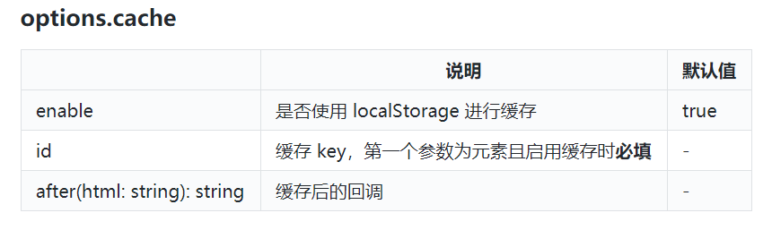

* 安装

  ```bash
  npm install vditor --save
  ```

* 引入

  ```vue
  import Vditor from 'vditor'
  import "vditor/src/assets/scss/index.scss"
  ```

* 功能
  * 分屏预览
  * 所见所得
  * 即时渲染 (类似Typora)
  
* 缓存

  但初始化Vditor时, 传入的元素, 需将缓存禁止, 或设置缓存key.

  > 不知为啥有这限制

  那么, 以缓存key为名, 编辑内容为值的键值对, 会被缓存到localStorage中.

  

* 图片相对地址

  `options.preview.markdown.linkBase`可设置, 编辑和渲染时, 都可设置该参数

* 参考
  * [Vditor](https://ld246.com/article/1549638745630) 官方教程
  * [Demo](https://b3log.org/vditor/demo/index.html) 使用Demo

