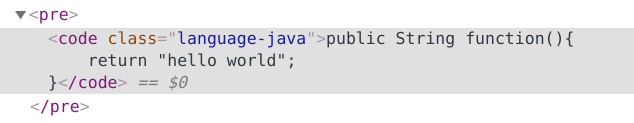
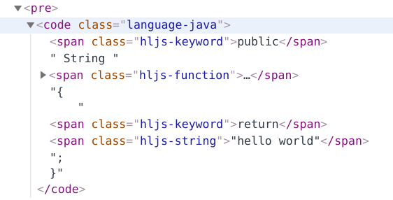
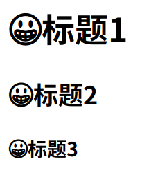

# 一 介绍

* Marked是一个由JavaScript编写的Markdown解析器. 

* 速度快, 解析以毫秒为单位, 见[Marked Demo](https://marked.js.org/demo/)

* 轻量但实现了所有Markdown的特性
* 可以运行Node和浏览器的环境下.

# 二 安装

npm安装如下:

```bash
npm install marked
```

> marked可以在CLI中运行, 如
>
> ```bash
> $ marked -s "*hello world*"
> <p><em>hello world</em></p>
> ```
>
> 局部安装时要加上前缀`npx`

# 三 使用

> * 解析Markdown字符串
>
> 	 ```javascript
> 	 marked(markdownString [,options] [,callback])
> 	```
>
> 	 * `markdownString(string)`: 待编译的markdown字符串
> 	 * `options(object)`: 选项对象
> 	 * `callback(function)`: 解析结束后的回调函数.
> 	
>  * 设置默认选项
>
>    ```javascript
>    marked.setOptions(options);
>    ```

选项很多, 这里给出部分有意思的:

* `breaks(boolean)`: 默认false, true时则软换行时会换行...
* `xhtml(boolean)`: 默认false, true时, HTML元素必须有结束标签, 如`<br/>`, ``.
* `silent(boolean)`: 默认false, true时解析器不会抛出任何异常.
* `highlight(function)`: 默认null. 用于高亮代码块的函数.
* `renderer(object)`: 默认`new marked.Renderer()`. 该对象含有渲染token到html的函数, 即比较底层的渲染器.

## 高亮

marked默认不高亮, 而是简单的将代码块放入`code`元素中, 如



可以提供`highlight`函数后, 在函数内解析代码块, 生成对应的html元素, 如

```javascript
marked.setOptions({
  highlight: function(code) {
    return highlight.highlightAuto(code).value;
  }
});

console.log(marked(markdownString));
```

效果如下:



> 这里用到了`highlight.js`, 注意安装并引入它才能使用.
>
> 安装: `npm install highlight.js`
>
> 引入:
>
> ```javascript
>     import highlight from 'highlight.js'
>     import 'highlight.js/styles/github.css'
> ```
>
> > 样式很多, 可以自行打开目录一览

-------------

同时, `highlight`也支持异步操作, 只需将结果传给回调函数`callback`即可, 如

```javascript
marked.setOptions({
  highlight: function(code, lang, callback) {
    require('pygmentize-bundled') ({ lang: lang, format: 'html' }, code, function (err, result) {
      callback(err, result.toString());
    });
  }
});

console.log(marked(markdownString));
```

> 这里用到了`pygmentize.js`, 注意安装并引入, 具体操作略.

## 渲染器Renderer

一般情况下, `## 标题`将被渲染成`<h2>标题</h2>`, 这是渲染器Renderer的默认行为. 

如果我想扩展它的功能呢? 通过重写渲染器对应的函数来实现, 如下在每个标题前添加个表情&#x1F600;:

```javascript
let renderer=new marked.Renderer();
renderer.heading=function (text, level) {
    return `<h${level}>&#x1F600;${text}</h${level}>`;
};

marked.setOptions({
    renderer: renderer
});
this.content=marked(`
# 标题1
## 标题2
### 标题3
`);
```

效果如下:



So Good! 可扩展性非常好!!!

类似的函数还有, 详细见[Renderer](https://marked.js.org/#/USING_PRO.md#renderer)

# 参考

* [Marked.js Documentation](https://marked.js.org/#/README.md)

* [marked github](https://github.com/markedjs/marked)
* [Marked Demo](https://marked.js.org/demo/)


