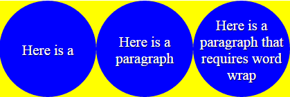

* `text`元素居中, 即文本中心, 位于指定坐标中心

  ```html
  <text 
        text-anchor="middle" 
        dominant-baseline="central" 
        x="50%" y="50%"
  >
      Centered
  </text>
  ```

  > `text-anchor`水平居中, `dominant-baseline`垂直居中.

  > 参考[SVG center text in circle](https://stackoverflow.com/a/60919616/12574399)

* 内嵌HTML

  如实现圆内文本居中的效果

  ```html
  <svg>
      <foreignObject width="200" height="200" x="100" y="100" transform="translate(-100,-100)">
          <div class="circle">
              <span>Here is a</span>
          </div>
      </foreignObject>
  
      <foreignObject width="200" height="200" x="300" y="100" transform="translate(-100,-100)">
          <div class="circle">
              <span>Here is a paragraph</span>
          </div>
      </foreignObject>
  
      <foreignObject width="200" height="200" x="500" y="100" transform="translate(-100,-100)">
          <div class="circle">
              <span>Here is a paragraph that requires word wrap</span>
          </div>
      </foreignObject>
  </svg>
  ```

  ```css
  svg {
      width: 600px;
      height: 200px;
      background-color: yellow;
  }
  .circle {
      background-color: blue;
      height: 100%;
      border-radius: 100%;
      text-align: center;
      line-height: 200px;
      font-size: 30px;
  }
  .circle span {
      line-height: normal;
      display:inline-block;
      vertical-align: middle;
      color: white;
      text-shadow: 1px 1px 2px rgba(0, 0, 0, 0.8);
  }
  ```

  

  > 参考[Wrap text within circle](https://stackoverflow.com/a/30933053/12574399)