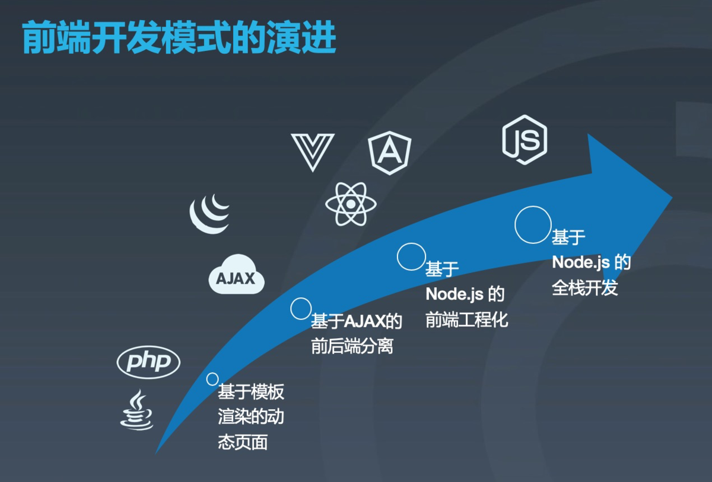
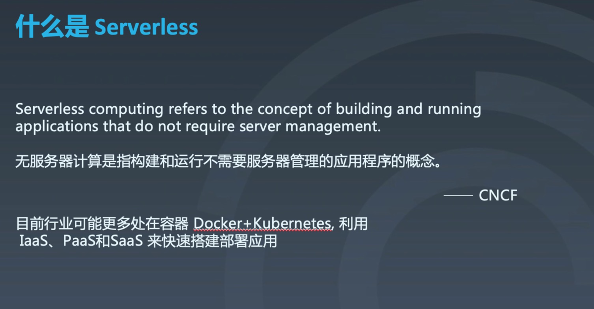
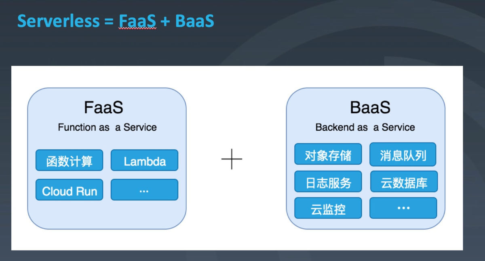
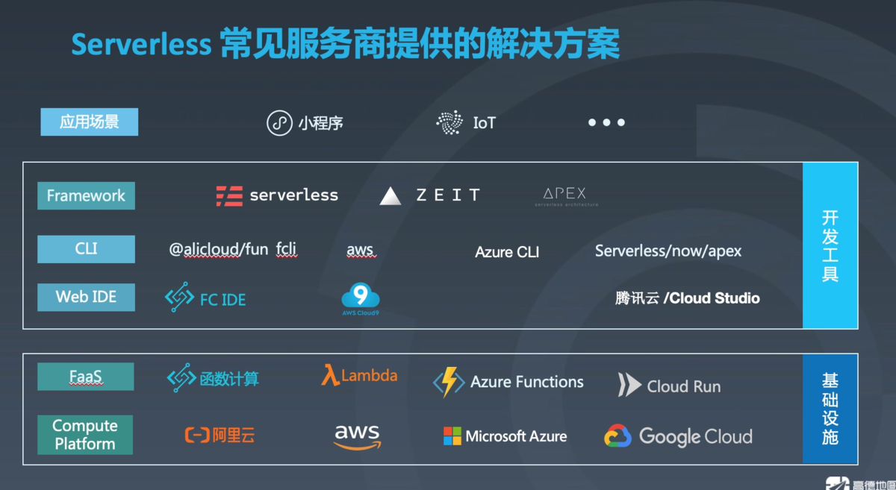
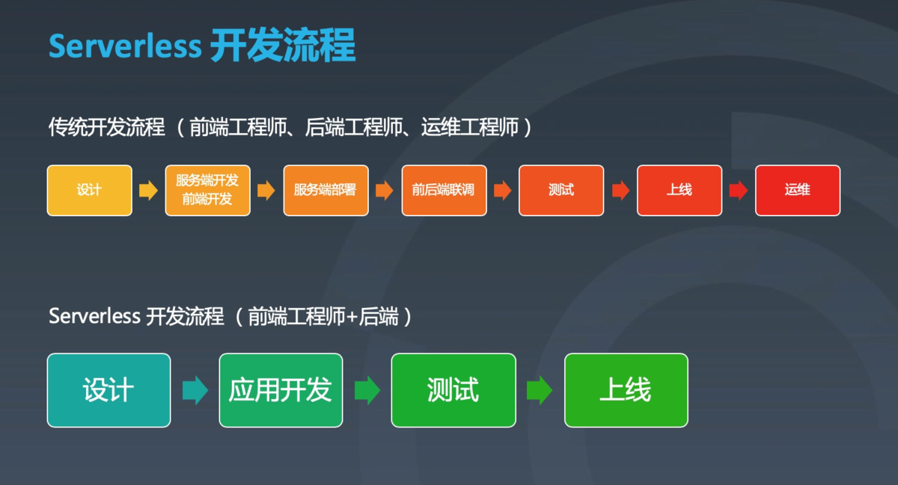
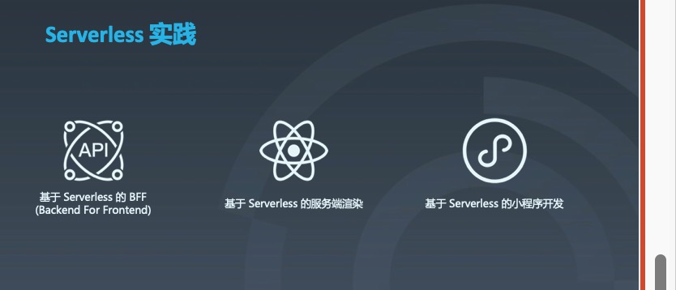
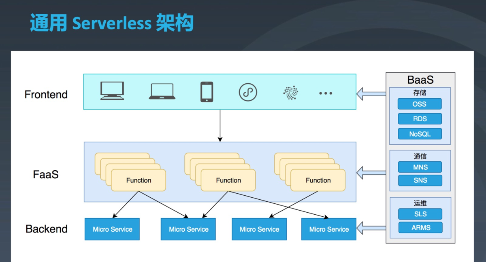

> 转载至[serverless-简书](https://www.jianshu.com/p/92632d6c2269)

# 前言

最近关于 Serverless 的讨论越来越多。看似与前端关系不大的 Serverless，其实早已和前端有了颇深渊源，并且将掀起新的前端技术变革。此次分享根据个人理解和总结，从前端开发模式在serverless的演进、Serverless 常见服务商提供的解决方案以及 基于Serverless 的前端开发模式等方面，与大家探讨 Serverless 中的前端开发模式。

# 前端开发模式的演进



首先回顾一下前端开发模式的演进，我觉得主要有四个阶段。。

1、基于模板渲染的动态页面
 2、基于 AJAX 的前后端分离
 3、基于 Node.js 的前端工程化
 4、基于 Node.js 的全栈开发

## 基于模板渲染的动态页面

在早起的互联网时代，我们的网页很简单，就是一些静态或动态的页面，主要目的是用来做信息的展示和传播。这个时候开发一个网页也很easy，主要就是通过 JSP、PHP 等技术写一些动态模板，然后通过 Web Server（nginx，apache） 将模板解析成一个个 HTML 文件，浏览器只负责渲染这些 HTML 文件。这个阶段还没有前后端的分工，通常是后端工程师顺便写了前端页面。

JSP: Java Server Page: Java服务端页面，在html页面中编写Java代码的页面
 WebServer：网站服务器或web服务器

## 基于 AJAX 的前后端分离

2005 年 AJAX 技术的正式提出，翻开了 Web 开发的新篇章。基于 AJAX，我们可以把 Web 分为前端和后端，前端负责界面和交互，后端负责业务逻辑的处理。前后端通过接口进行数据交互。我们也不再需要在各个后端语言里面写着难以维护的 HTML。网页的复杂度也由后端的 Web Server 转向了浏览器端的 JavaScript。也正因如此，开始有了前端这个职位。

## 基于 Node.js 的前端工程化

2009年 Node.js 的出现，对于前端来说，也是一个历史性的时刻。随着 Node.js 一同出现的还有 CommonJS 规范和 npm 包管理机制。随后也出现了 Grunt、Gulp、Webpack 等一系列基于 Node.js 的前端开发构建工具。

在 2013 年前后，前端三大框架 React.js/Angular/Vue.js 相继发布第一个版本。我们可以从以往基于一个个页面的开发，变为基于一个个组件进行开发。开发完成后使用 webpack 等工具进行打包构建，并通过基于 Node.js 实现的命令行工具将构建结果发布上线。前端开发开始变得规范化、标准化、工程化。

## 基于 Node.js 的全栈开发

Node.js 对前端的重要意义还有，以往只能运行在浏览器中的 js 也可以运行在服务器上，前端可以用自己最熟悉的语言来写服务端的代码。于是前端开始使用 Node.js 做全栈开发，开始由前端向全栈的方向转变。这是前端主动突破自己的边界。
 另一方面，前端在发展，后端也在发展。也差不多在 Node.js 诞生那个时代，后端普遍开始由`巨石应用模式`向`微服务架构`转变。这也就导致以往的前后端分工出现了分歧。随着微服务架构的兴起，后端的接口渐渐变得原子性，微服务的接口也不再直接面向页面，前端的调用变得复杂了。于是 BFF（Backend For Frontend）架构出现了，在微服务和前端中间，加了一个 BFF 层，由 BFF 对接口进行聚合、裁剪后，再输出给前端。而 BFF 这层不是后端本质工作，且和前端的关系最大，所以前端自然而然选择了 Node.js 来实现。这也是当前 Node.js 在服务端较为广泛的应用的原因。

###### 巨石应用：大部分web工程是将所有的功能模块(service  side)打包到一起并放在一个web容器中运行，很多企业的Java应用程序打包为war包

###### 微服务架构：微服务架构是一种架构理念，是指将功能分解到离散的各个服务当中，从而降低系统的耦合性，并提供更加灵活的服务支持。把一个大型的单体应用程序和服务拆分为数个或数十个的微小型服务，它可扩展单个组件而不是整个的应用程序堆栈，从而满足服务等级协议。

## 下一代前端开发模式

说完了这几个阶段，可以看到，每一次前端开发模式的变化，都因某个变革性的技术而起。先是 AJAX，而后是 Node.js。那么下一个变革性的技术是什么？不言而喻，个人觉得就是 Serverless。

### 什么是serverless



CNCF，全称Cloud Native Computing Foundation（云原生计算基金会），成立于 2015 年7月21日（于美国波特兰OSCON 2015上宣布），其最初的口号是坚持和整合开源技术来让编排容器作为微服务架构的一部分，其作为致力于云原生应用推广和普及的一支重要力量，不论您是云原生应用的开发者、管理者还是研究人员都有必要了解。

目前行业可能更多处在容器 Docker+Kubernetes, 利用
 IaaS、PaaS和SaaS 来快速搭建部署应用

基础架构即服务（Infrastructure as a Service，IaaS）、平台即服务（Platform as a Service，PaaS）以及软件即服务（Software as a Service，SaaS）。

Docker是一个平台，它主要是提供一些服务，任何一台装有docker的机器你都可以建立、发布、运行你的应用程序，使用docker很省钱省时。

简单的介绍Kubernetes。它就是一套成熟的商用服务编排解决方案。Kubernetes定位在Paas层，重点解决了微服务大规模部署时的服务编排问题。

### 现有案例

其实 Serverless 早已和前端产生了联系，只是我们可能没有感知。

1、CDN: 相信大家都使用过 CDN，我们开发完成之后，直接将静态文件部署到 CDN 上，通过 CDN 进行内容分发、网络加速，在这个过程中，前端不需要关心 CDN 有多少个节点、如何做负载均衡，也不需要知道 CDN 的 QPS 是多少。所以从这个角度来说，CDN 是一种 serverless 的实现。

2、再比如对象存储，和 CDN 一样，我们只需要将文件上传到对象存储，就可以直接使用了，不需要关心它如何存取文件、如何进行权限控制，所以对象存储对前端来说是 Serverless。
 3、甚至一些第三方的 API 服务，也是 Serverless，因为我们使用的时候，不需要去关心服务器。



当然，有了体感还不够，我们还是需要一个更精确的定义。从技术角度来说，Serverless 就是 FaaS 和 BaaS 的结合。

简单来讲，FaaS（Function as a Service） 就是一些运行函数的平台，比如阿里云的函数计算、AWS 的 Lambda 等。

BaaS（Backend as a Service）则是一些后端云服务，比如云数据库、对象存储、消息队列等。利用 BaaS，可以极大简化我们的应用开发难度。

Serverless 则可以理解为运行在 FaaS 中，使用了 BaaS 的函数。

### Serverless 的主要特点

1、事件驱动----函数在 FaaS 平台中，需要通过一系列的事件来驱动函数执行。
 2、无状态----因为每次函数执行，可能使用的都是不同的容器，无法进行内存或数据共享。如果要共享数据，则只能通过第三方服务，比如 ```Redis`` 等。

Redis（全称：Remote Dictionary Server 远程字典服务）是一个开源的使用ANSI [C语言](https://links.jianshu.com/go?to=https%3A%2F%2Fbaike.baidu.com%2Fitem%2FC%E8%AF%AD%E8%A8%80)编写、支持网络、可基于内存亦可持久化的日志型、Key-Value[数据库]，并提供多种语言的API。从2010年3月15日起，Redis的开发工作由VMware主持。从2013年5月开始，Redis的开发由Pivotal赞助。

3、无运维----使用serverless我们不需要关心服务器，也不需要关心运维，这也是serverles思想的核心；
 4、低成本----使用 Serverless 成本很低，因为我们只需要为每次函数的运行付费。函数不运行，则不花钱，也不会浪费服务器资源过度

？？？？哪些公司平台提供这些功能???现有的服务商 云平台 亚马

# Serverless 常见服务商提供的解决方案

## 解决方案



1、上图是当前主要的一些 Serverless 服务，以及对应的服务解决方案。
 2、从下往上，分别是基础设施、开发工具和应用场景。
 亚马逊-微软-谷歌
 3、基础设施主要是一些云计算厂商提供，包括云计算平台和各种 BaaS 服务，以及运行函数的 FaaS 平台。
 前端主要是 Serverless 的使用者，所以对前端来说，最重要的开发工具这一层，我们需要依赖开发工具进行 Serverless 开发、调试和部署。
 4、框架（Framework）
 如今还没有一个统一的 Serverless 标准，不同云计算平台提供的 Serverless 服务很可能是不一样的，这就导致我们的代码，无法平滑迁移。Serverless 框架一个主要功能是简化 Serverless 开发、部署流程，另一主要功能则是屏蔽不同 Serverless 服务中的差异，让我们的函数能够在不改动或者只改动很小一部分的情况下，在其他 Serverless 服务中也能运行。常见的 Serverless 框架有 Serverless Framework、ZEIT Now、Apex 等。不过这些基本都是国外公司做的，国内还没有这样的平台。
 5、Web IDE
 和 Serverless 紧密相关的 Web IDE 主要也是各个云计算平台的 Web IDE。利用 Web IDE，我们可以很方便地在云端开发、调试函数，并且可以直接部署到对应的 FaaS 平台。这样的好处是避免了在本地安装各种开发工具、配置各种环境。常见的 Web IDE 有 AWS 的 Cloud9、阿里云的函数计算 Web IDE、腾讯云的 Cloud Studio。
 6、当然，目前最主要的开发方式还是在本地进行开发。所以在本地开发 Serverless 的命令行工具也必不可少。
 命令行工具主要有两类，一类是云计算平台提供的，如 AWS 的 aws、 Azure 的 az、阿里云的 fun；还有一类是 Serverless 框架提供的，如 serverless、now。
 大部分工具如 serverless、fun 等，都是用 Node.js 语言来实现的。
 7、应用场景
 在开发工具上面一层，则是 Serverless 的一些垂直应用场景。除了使用传统的服务端开发，目前使用 Serverless 技术的还有小程序开发，未来可能还会涉及到物联网领域（IoT）。

## 不同 Serverless 服务的对比


image.png

上图从支持语言、触发器、价格等多个方面对不同 Serverless 服务进行了对比，可以发现有差异，也有共性。

1、比如几乎所有 Serverless 服务都支持 Node.js/Python/Java 等语言。

2、从支持的触发器来看，几乎所有服务也都支持 HTTP、对象存储、定时任务、消息队列等触发器。当然，这些触发器也与平台自己的后端服务相关，比如阿里云的对象存储触发器，是基于阿里云的 OSS 产品的存取等事件触发的；而 AWS 的对象存储触发器，则是基于 AWS 的 S3 的事件触发的，两个平台并不通用。这也是当前 Serverless 面临的一个问题，就是标准不统一。

S3:Amazon Simple Storage Service (Amazon S3) 是一种对象存储服务，提供行业领先的可扩展性、数据可用性、安全性和性能

从计费的角度来看，各个平台的费用基本一致。在前面也提到，Serverless 的计费是按调用次数计费，执行时长。

# 基于 Serverless 的前端开发模式

## serverless 开发流程



1、在开始具体的案例之前，先看一下传统开发流程。
 在传统开发流程中，我们需要前端写页面，后端工程师写接口。后端写完接口之后，把接口部署了，再进行前后端联调。联调完毕后再测试、上线。上线之后，还需要运维工程师对系统进行维护。整个过程涉及多个不同角色，链路较长，沟通协调也是一个问题。

2、而基于 Serverless，后端变得非常简单了，以往的后端应用被拆分为一个个函数，只需要写完函数并部署到 Serverless 服务即可，后续也不用关心任何服务器的运维操作。后端开发的门槛大幅度降低了。因此，只需要一个前端就可以完成所有的开发工作。
 当然，前端基于 Serverless 去写后端，最好也需要具备一定的后端知识。涉及复杂的后端系统或者 Serverless 不适用的场景，还是需要后端开发。

## serverless带来的价值

1．降低运营复杂度

Serverless架构使软件应用和服务器实现了解耦，服务器不再是用户开发和运营应用的焦点。在应用上线前，用户无须再提前规划服务器的数量和规格。在运维过程中，用户无须再持续监控和维护具体服务器的状态，只需要关心应用的整体状态。应用运营的整体复杂度下降，用户的关注点可以更多地放在软件应用的体验和改进以及其他能带来更高业务价值的地方。
 2．降低运营成本
 服务器不再是用户关注的一个受管资源，运营的复杂度下降，应用运营所需要投入的时间和人力将大大降低。在最好的情况下，可以做到少数几个应用管理员即可管理一个处理海量请求的应用系统。

3、缩短产品的上市时间
 在Serverless架构下，应用的功能被解构成若干个细颗粒度的无状态函数，功能与功能之间的边界变得更加清晰，功能模块之间的耦合度大大减小。这使得软件应用的开发效率更高，应用开发的迭代周期更短。

## serverless实践

### 基于 Serverless 的 BFF (Backend For Frontend)



#### 传统 BFF (Backend For Frontend) 架构

1、一方面，对不同的设备需要使用不同的 API，另一方面，由于微服务导致前端接口调用的复杂，所以前端开始使用 BFF 的方式，对接口进行聚合裁剪，以得到适用于前端的接口。
 2、最底层的就是各种后端微服务，最上层就是各种前端应用。在微服务和应用之前，就是通常由前端开发的 BFF。
 -手机端-web端-嵌入式-
 这样的架构解决了接口协调的问题，但也带来了一些新的问题。

#### 传统 BFF (Backend For Frontend) 的痛点

比如针对每个设备开发一个 BFF 应用，也会面临一些重复开发的问题。而且以往前端只需要开发页面，关注于浏览器端的渲染即可，现在却需要维护各种 BFF 应用。以往前端也不需要关心并发，现在并发压力却集中到了 BFF 上。总的来说运维成本非常高，通常前端并不擅长运维。

Serverless 则可以帮我们很好的解决这些问题。用Serverless，我们可以用一个个函数来实各个接口的聚合裁剪。前端向 BFF 发起的请求，就相当于是 FaaS 的一个 HTTP 触发器，触发一个函数的执行，这个函数中来实现针对该请求的业务逻辑，比如调用多个微服务获取数据，然后再将处理结果返回给前端。这样运维的压力，就由以往的 BFF Server 转向了 FaaS 服务，前端再也不用关心服务器了。

#### 基于 Serverless 的 BFF 架构

上图则是基于 Serverless 的 BFF 架构。为了更好的管理各种 API，我们还可以添加网关层，通过网关来管理所有 API（比如阿里云的网关），比如对 API 进行分组、分环境。基于 API 网关，前端就不直接通过 HTTP 触发器来执行函数，而是将请求发送至网关，再由网关去触发具体的函数来执行。
 API Gateway
 在没有API网关作为统一出口的情况下，需要调用方自己组合各种服务，而且容易让调用方感知后端各种服务的存在，各个需要各个做很多相同的工作。
 加入API Gateway之后的作用
 一般也会把路由，安全，限流，缓存，日志，监控，重试，熔断等都放到 API 网关来做，然后服务层就完全脱离这些东西，纯粹的做业务，也能够很好的保证业务代码的干净，不用关心安全，压力等方面的问题。

### 基于 Serverless 的服务端渲染

#### 传统服务端渲染

基于当下最流行的三大前端框架（React.js/Anguler/Vue.js），现在的渲染方式大部分都是客户端渲染。页面初始化的时候，只加载一个简单 HTML 以及对应的 JS 文件，再由 JS 来渲染出一个个页面。这种方式最主要的问题就是白屏时间和 SEO 搜索引擎优化

为了解决这个问题，前端又开始尝试服务端渲染。本质思想其实和最早的模板渲染是一样的。都是前端发起一个请求，后端 Server 解析出一个 HTML 文档，然后再返回给浏览器。只不过以往是 JSP、PHP 等服务端语言的模板，现在是基于 React、Vue 等实现的同构应用，这也是如今的服务端渲染方案的优势。

但服务端渲染又为前端带来了一些额外的问题：运维成本，前端需要维护用于渲染的服务器。

#### 基于serverless的服务端渲染

Serverless 最大的优点就是可以帮我们减少运维，那 Serverless 能不能用于服务端渲染呢？当然也是可以的。

传统的服务端渲染，每个请求的 path 都对应着服务端的每个路由，由该路由实现对应 path 的 HTML 文档渲染。用于渲染的服务端程序，就是这些集成了这些路由的应用。
 使用 Serverless 来做服务端渲染，就是将以往的每个路由，都拆分为一个个函数，再在 FaaS 上部署对应的函数。这样用户请求的 path，对应的就是每个单独的函数。通过这种方式，就将运维操作转移到了 FaaS 平台，前端做服务端渲染，就不用再关心服务端程序的运维部署了。

### 基于 Serverless 的小程序开发

1、目前国内使用 Serverless 较多的场景可能就是小程开发了。具体的实现就是小程序云开发，支付宝小程序和微信小程序都提供了云开发功能。
 2、在传统的小程序开发中，我们需要前端进行小程序端的开发；后端进行服务端的开发。小程序的后端开发和其他的后端应用开发，本质是是一样的，需要关心应用的负载均衡、备份冗灾、监控报警等一些列部署运维操作。如果开发团队人很少，可能还需要前端去实现服务端。
 但基于云开发，就只需要让开发者关注于业务的实现，由一个前端就能够完成整个应用的前后端开发。因为云开发将后端封装为了 BaaS 服务，并提供了对应的 SDK 给开发者，开发者可以像调用函数一样使用各种后端服务。应用的运维也转移到了提供云开发的服务商。
 下面分别是使用支付宝云开发的一些例子，函数就是定义在 FaaS 服务中的函数。

负载均衡（Load Balance）其意思就是分摊到多个操作单元上进行执行，例如Web服务器、FTP服务器、企业关键应用服务器和其它关键任务服务器等，从而共同完成工作任务
 备份冗灾：就是为了防止出现自然或者社会灭害带来的对存储设备的损害而造成对数据丢失,而采取的备份.

### 通用 Serverless 架构

基于上述几个 Serverless 开发的例子，就可以总结出一个通用的 Serverless 架构。



其中最底层就是实现复杂业务的后端微服务（Backend）。然后 FaaS 层通过一系列函数实现业务逻辑，并为前端直接提供服务。对于前端开发者来说，前端可以通过编写函数的方式来实现服务端的逻辑。

同时不管是在后端、FaaS 还是前端，我们都可以去调用云计算平台提供的 BaaS 服务，大大降低开发难度、减少开发成本。小程序云开发，就是直接在前端调用 BaaS 服务的例子。

# 总结

**一句话总结serverless - less is more**

使用 Serverless，我们不需要再过多关注服务端的运维，不需要关心我们不熟悉的领域，我们只需要专注于业务的开发、专注于产品的实现。我们需要关心的事情变少了，但我们能做的事情更多了。


> 作者：web佳
> 链接：https://www.jianshu.com/p/92632d6c2269
> 来源：简书
> 著作权归作者所有。商业转载请联系作者获得授权，非商业转载请注明出处。

