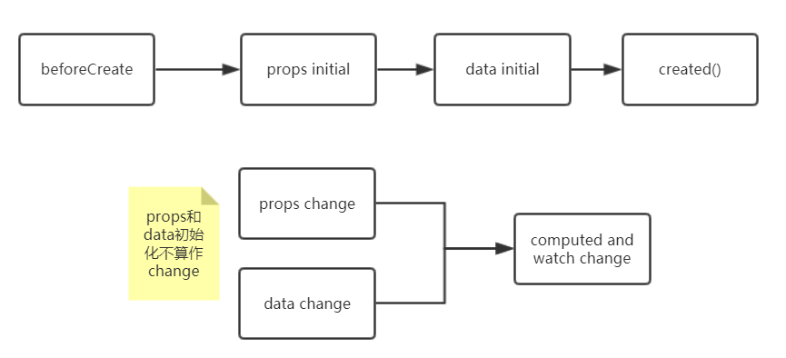

[TOC]

# 一 介绍
与JQuery相比，Vue可以方便的进行组件开发。Vue组件相当于扩展的html元素，使用十分方便。

* vue能够操作文本、属性和结果，也提供了在元素被vue插入、更新、删除时的过渡效果(transition effects)

* 在vue中，我们并不直接操纵DOM，而是修改vue实例数据，让vue来修改dom。

* 模板中的数据绑定，一般可以绑定vue实例的大部分属性，只要这个属性不太复杂，vue会使用`stringify()`将之转化为string

* vue中重要关键词：数据绑定、虚拟DOM、响应式系统、响应式对象、DOM template、String template

* 虚拟DOM在应用到DOM时，会使用patch/reuse的算法减少DOM的操作。这种行为在你的输出结果不考虑子组件或DOM状态（如input值）时最合适。使用`key`属性指定唯一值可以取消这种行为。

* template和对应的html都存在时，template优先级高。

* 组件必须只存在一个根元素

* `v-bind`不使用指令参数，且值为对象，会将对象属性绑定到元素（组件上）

* 单向数据流

  
  
* Vue在构建的过程中会将template编译成底层的render函数, 同时运行时不提供动态编译的功能, 以防xss攻击.


# 二 指令(directive)
vue指令以`v-`开始，用于渲染DOM或绑定数据，定义在元素或组件上。
* `{{message}}`：绑定vue实例数据`data`到文本上。（非指令，占位符）
* `v-bind`：将vue实例数据绑定到元素属性上。
* `v-if`：vue实例数据为`true`则显示该元素。
* `v-for`：遍历数组，产生多个该属性对应的html元素（及其子元素）。
* `v-on`：绑定vue实例方法到html元素事件上。
* `v-model`：实现input的value属性与vue实例数据的双向绑定，即value属性值改变也会影响vue实例数据。使用`v-bind`只能单向绑定inptu的value属性。

指令详细见第四章。注意，指令的值一般可以是表达式。
# 三 组件
* **组件本质上是一个vue实例，含有预定义好的选项**。但有些选项是特定于根组件的,如（`el`），根组件只能使用`new`创建。

## 组件实例
### 组件实例化

有三种方式：

* **html元素**：在html，则将组件名当作新的html标签，然后创建该元素。但这种实例方式不能作为根组件，需要放入额外一个Vue实例下。
  
    >注意，组件作为`<ul>`的子元素实例化会出现问题，因此需使用`is`，如：
    
    ```html
	 <ul>
	    <li
	      is="todo-item"
	      v-for="(todo, index) in todos"
	      v-bind:key="todo.id"
	      v-bind:title="todo.title"
	      v-on:remove="todos.splice(index, 1)"
      ></li>
	</ul>
	```
	>`is`指定组件，实例化后该组件会取代`li`元素。
	
* **Vue实例**：在javascript中，与`new Vue({...})`类似，`new`一个组件，并传入选项对象，绑定到一个html元素上(使用`el`选项)。此时被绑定的元素会被模板`template`替代。

* **Vue子类实例**：Vue实例只能用于根组件，而Vue子类实例可以用于其他组件。`Vue.extend()`中传入选项对象，返回一个Vue子类。然后实例化，并用`$mount`挂载到DOM上。如下所示：
	
	> 所谓的根组件, 指的是有`el`选项的组件.
	
	```html
	<div id="mount-point"></div>
	```
	```css
	// create constructor
	var Profile = Vue.extend({
	  template: '<p>{{firstName}} {{lastName}} aka {{alias}}</p>',
	  data: function () {
	    return {
	      firstName: 'Walter',
	      lastName: 'White',
	      alias: 'Heisenberg'
	    }
	  }
	})
	// create an instance of Profile and mount it on an element
	new Profile().$mount('#mount-point')
	```
	>注意data为函数。
	>如果想手动销毁实例，则使用`$destroy`生命周期方法，但DOM元素仍未去除。
	

### 动态生成组件

```javascript
var Child = Vue.extend({
	template: '<div>Hello!</div>',
});

new Vue({
  el: '#demo',
  ready: function() {
  	var child = new Child({
    	el: this.$el.querySelector('.child-host'),
    	parent: this,
    });
  },
});
```

> * `parent`用于建立父子组件关系, 父组件销毁时, 应该子组件就会销毁. 也可手动销毁, 则使用[vm.$destroy](https://vuejs.org/v2/api/#vm-destroy)函数.
>
> * 也可以使用全局组件, 即
>
>   ```javascript
>   var Child=Vue.component('com_name',{
>       template: '<div>Hello!</div>',
>   })
>   ```
>

### 定义组件

一个组件的选项对象可描述(定义)好组件, 然后再通过全局或局部的方式注册组件. 下面给出全局注册的例子: 

```javascript
//定义一个叫todo-item的组件，成为新的html元素。还传入了一个选项对象。
Vue.component('todo-item', {
    //该组件作为html元素可以接收的属性。
    props: ['todo'],
    //组件使用的html模板
    template: '<li>{{ todo.text }}</li>'
})
```
现在可以将组件名作为html元素使用：
```html
<ol>
  <!--组件实例话-->
  <todo-item></todo-item>
</ol>
```

> 组件之间数据作用域是隔开的，父子组件通过`props`通信

## 生命周期

### 组件生命周期


vue允许在vue实例生命周期的某个阶段（如红色方框所示）上挂载用户自定义的函数，称为hook，如：

```javascript
new Vue({
  data: {
    a: 1
  },
  created: function () {
    // `this` points to the vm instance
    console.log('a is: ' + this.a)
  }
})
// => "a is: 1"
```

> 注意, `mounted`后组件被挂载到了DOM中, 但此时并没有真正渲染元素, `updated`后元素才会出现, 并且初始化过程中必定会渲染一次(好像说错了, 是存在v-html时必定渲染一次)

### 初始化与变动



> 尽管初始化时不会造成`computed`计算, 但是第一次被使用时会被计算.

### 组件间生命周期

举个例子说明, 首先, 组件关系如下

```html
<CommonTools>
    <Search></Search>
</CommonTools>
```

则生命周期执行顺序

```plain
CommonTool before created
CommonTool created
CommonTool before mount
Search before create
Search created
Search before mount
Search before mounted
CommonTool mounted
```

# 四 模板语法
* 即html模板，允许你声明式的绑定渲染后的DOM到vue实例的数据上。
* vue会编译模板到虚拟DOM渲染函数中。结合响应式系统，当vue实例状态改变时，vue会智能地计算最少的组件去渲染和应用最少的DOM操作。

## 插值
即将vue实例的数据插入到模板中，也称为数据绑定。
### 文本插值
数据被双花括号围绕`{{data}}`。如
```html
<span>Message: {{ msg }}</span>
```
这里的数据msg，来自选项对象中的`data`和？？谁？每当msg改变，view会被更新。

当使用`v-once`指令时，该元素只会插值一次：
```html
<span>Message: {{ msg }}</span>
```

### Raw HTML
插入生的html，不被vue解析。如
```html
<span v-html="rawHtml"></span>
```
此时`span`的`innerHTML`使用属性rawHtml替换。

### 属性
使用指令`v-bind`,在需要插入数据的html属性上加上该指令。

### 表达式
前面都是绑定一些简单的属性值，也可以绑定表达式。表达式可以使用一些vue规定的全局变量如`Math`、`Date`，不能是自定义的全局变量。


## 指令
指定是特殊的属性，以`v-`开头。指令属性值期待一个js表达式（除了for）。指令的作用是当表达式值改变时，运用这些副作用（DOM的改变）到DOM中。

### 参数
指令是有参数的，指令与参数冒号分隔，如
```html
<a v-bind:href="url"> ... </a>
```
`v-bind`指令的参数是`href`，即将`url`绑定到`href`属性上。

### 动态参数
指定的参数可以是动态给出的，以`[]`为标识，js表达式给出参数值，如：
```html
<a v-bind:[attributeName]="url"> ... </a>
```
这里的`attributeName`是js表达式，表达式值必须为string，null表示删除绑定, 可基于响应式变量更新。

限制：`[]`内不能存在`spaces, quotes, <, >, / or =`

### Modifiers
modifiers是指令的特殊后缀，以`.`表示，指示指令绑定的一些行为。如：
```html
<form v-on:submit.prevent="onSubmit"> ... </form>
```
表示触发事件时也执行`event.preventDefault()`

貌似可以叠加多个Modifiers

## 缩写
有的指令有缩写，如
* `v-bind`的缩写：`:`
* `v-on`的缩写：`@`
* `v-slot`的缩写：`#`

此时不需要冒号分隔指令与参数。

# 五 选项参数

## Data,Methods

* vue实例被创建时，会将`data`对象的属性添加到vue实例上和响应式系统中，即这些属性改变，视图也会改变。而之后vue实例添加的属性不会存在于响应式系统中。
* 除了选项对象提供的`data`,`methods`，vue实例也有一些有用的属性和方法，以`$`为开头。部分如下：
  * `$data`：选项对象中的data
  * `$el`：挂载在DOM中的html元素
* Vue方法传给其他对象使用时, `this`也指向vue实例, 因为实际传递的是一个Wrapper方法.

## computed,watch

> 响应式属性指`data`,`computed`,`props`中的属性

* **computed**
  
    `computed`中的属性是响应式属性进过计算后得到的属性。
    
    * `computed`中属性是一个`get`方法，也可以额外设置`set`方法。
    * `computed`中属性会放入vue实例中。
    * 一个例子：
    ```javascript
    var vm = new Vue({
        el: '#demo',
        data: {
            firstName: 'Foo',
            lastName: 'Bar'
        },
        computed: {
            fullName: function () {
                return this.firstName + ' ' + this.lastName
            }
        }
    })
    ```
    * 含有set方法的computed中属性例子：
    ```javascript
    // ...
    computed: {
        fullName: {
            // getter
            get: function () {
                return this.firstName + ' ' + this.lastName
            },
            // setter
            set: function (newValue) {
                var names = newValue.split(' ')
                this.firstName = names[0]
                this.lastName = names[names.length - 1]
            }
        }
    }
    // ...
    ```
    
* **方法**

    模板中也可以执行方法，达到和computed属性同样的效果。但computed属性会根据它用到的依赖缓存起来，只有依赖改变时才重新计算。而方法在每一次re-render发生时会执行。

* `watch`
  
    监听vue实例属性，改变时调用回调函数。`data`中一些属性的改变是基于其他属性的，可在`watch`中配置，如：
    
    ```javascript
    var vm = new Vue({
      el: '#demo',
      data: {
        firstName: 'Foo',
        lastName: 'Bar',
        fullName: 'Foo Bar'
      },
      watch: {
        firstName: function (val) {
          this.fullName = val + ' ' + this.lastName
        },
        lastName: function (val) {
          this.fullName = this.firstName + ' ' + val
        }
      }
    })
    ```
    > 上面配置了firstName和lastName改变时如何影响fullName改变。
    
    初始化时也调用一次
    
    ```javascript
    // the callback will be called immediately after the start of the observation
    d: {
        handler: 'someMethod',
        immediate: true
    },
    ```
    
    深度监听, 对象内部属性改变时也触发函数调用
    
    ```javascript
    // the callback will be called whenever any of the watched object properties change regardless of their nested depth
    c: {
        handler: function (val, oldVal) { /* ... */ },
        deep: true
    },
    ```

## props

> props在挂载后才初始化

props选项属性定义组件作为html元素收到的属性。属性的命令规则同上。

属性可以为数组或对象。对象可以额外设置属性类型、默认值、是否必须、验证函数。

属性值常与`v-bind`一起使用。

如果在组件上使用props未定义的属性，那么属性会被添加到组件的根元素上。如果根元素已定义该属性，则被覆盖；`style`,`class`属性除外，它会被合并在一起。

`inheritAttrs: false`会阻止未定义属性作用在组件根元素上的行为，而`$attrs`接收未定义属性的赋值，因此此时可以将它手动绑定到组件中的一个元素上，如：

```javascript
Vue.component('base-input', {
  inheritAttrs: false,
  props: ['label', 'value'],
  template: `
    <label>
      {{ label }}
      <input
        v-bind="$attrs"
        v-bind:value="value"
        v-on:input="$emit('input', $event.target.value)"
      >
    </label>
  `
})
```
>注意，都不会影响`class`和`style`属性。

> 参考：[props](https://vuejs.org/v2/api/#props);

# 六 模板操作

## class和style数据绑定
html的class和style都是属性，因此可以使用`v-bind`来绑定vue属性，并且不仅string、还可以绑定object or array到html属性上。
### class数据绑定
* 文本绑定：
    ```html
    <div v-bind:class="activeClass"></div>
    ```
    这里的activeClass为vue实例属性。
* 对象绑定语法：  
    * 例子一
    ```html
    <div v-bind:class="{ active: isActive }"></div>
    ```
    对象的key为class名，对象的value为boolean值，true则class存在。这里的value值是vue对应的属性值。注意指令的值是表达式，可以计算的。
    * 例子二
    可以与HTML的class混合使用
    ```html
    <div
      class="static"
      v-bind:class="{ active: isActive, 'text-danger': hasError }"
    ></div>
    ```
    * 例子三
    可直接指定vue实例属性名：
    ```html
    <div v-bind:class="classObject"></div>
    ```
* 数组绑定语法：    
    ```html
    <div v-bind:class="[activeClass, errorClass]"></div>
    ```
    数组中元素都是vue实例属性，class为属性值；想要类不存在，修改属性值为`""`即可：
    ```html
    <div v-bind:class="[isActive ? activeClass : '', errorClass]"></div>
    <!--或者混合上面的对象绑定语法-->
    <div v-bind:class="[{ active: isActive }, errorClass]"></div>
    ```
* 涉及组件  
    组件内模板中绑定class，是绑定组件实例的属性。但下面的例子中：
    ```html
    <my-component v-bind:class="{ active: isActive }"></my-component>
    ```
    这里绑定的是父组件的实例属性。并且该class会被添加到组件模板的根元素上。

### styles数据绑定
* 对象绑定语法  
    ```html
    <div v-bind:style="{ color: activeColor, fontSize: fontSize + 'px' }"></div>
    ```
    对象的key是样式名，使用驼峰命令法；value是vue实例属性。
* 数组语法      
    数组允许绑定多个vue实例的style对象
    ```html
    <div v-bind:style="[baseStyles, overridingStyles]"></div>
    ```
* 自动添加前缀      
    有些样式在不同浏览器中有不同的前缀的，vue会自动添加。
* 一些样式的属性也有前缀，但需要自己手动添加，略。

## 条件性渲染
### v-if
* 含有`v-if`指令的元素，只有在属性值为true时才会被渲染。

* 如果需要一个`v-if`指令条件渲染多个html元素，可使用`template`包裹起来：
    ```html
    <template v-if="ok">
      <h1>Title</h1>
      <p>Paragraph 1</p>
      <p>Paragraph 2</p>
    </template>
    ```
    
* 可像其他语言一样，有`v-else`,`v-else-if`

* vue实例数据改变时，会导致虚拟DOM重新渲染。但为了提高效率，虚拟DOM应用到DOM时，会复用已有的元素。使用`key`属性阻止这里行为：
    ```html
    <template v-if="loginType === 'username'">
      <label>Username</label>
      <input placeholder="Enter your username" key="username-input">
    </template>
    <template v-else>
      <label>Email</label>
      <input placeholder="Enter your email address" key="email-input">
    </template>
    ```
    但label还是会被复用

### v-show
含`v-show`的元素还是会被渲染到dom中，但会条件性的选择是否显示它，使用了css的`display`属性。因此隐藏或显示后，事件监听器还是存在的。

## list渲染
### v-for与数组

使用方式如下
* `v-for`可以将数组映射为Elements，最基本形式如下：
	```html
	  <li v-for="item in items">
	    {{ item.message }}
	  </li>
	```
	items为vue实例的数组属性，也可以是一个表达式；item为数组中的一项。然后可以使用`{{data}}`进行文本插值。
* 含有索引
	```html
	  <li v-for="(item, index) in items">
		{{ index }} - {{ item.message }}
	  </li>
	```
* 除了关键字`in`, 还可使用`of`, 然并无本质区别
	```html
	<div v-for="item of items"></div>
	```
### v-for与对象
* 基本形式：
	```html
	  <li v-for="key in object">
	    {{ object[key] }}
	  </li>
	```
	会遍历`object`的所有可遍历属性，`key`表示对象的属性名。
* 取出属性名：
	```html
	<div v-for="(value, key) in object">
	  {{ key }}: {{ value }}
	</div>
	```
* 再添加索引：
	```html
	<div v-for="(value, key, index) in object">
	  {{ index }}. {{ key }}: {{ value }}
	</div>
	```
* 范围遍历
	```html
	<div>
	  <span v-for="n in 10">{{ n }} </span>
	</div>
	```
	
### key
这里再次强调一下，虚拟DOM应用到DOM时会patch/reuse元素，达到对DOM的最少操作。元素（如input）或组件的内部状态可能会被保存，使用`key`属性可以将防止这种优化，如：
```html
<div v-for="item in items" :key="item.id">
  <!-- content -->
</div>
```

> https://www.jianshu.com/p/0044532e4a93

### 数组中元素改变探测

>对下面的话，做个总结：简而言之，vue检测不到`data`中数组属性中元素的修改，需要其他手段。对于对象也是同样的道理

我们知道，选项对象的`data`中的属性会被添加到响应式系统，这些属性的改变会造成视图的重新渲染。但如果`data`中存在**数组属性**，对**数组元素**的修改(如, 增删)不会造成数据本身引用地址的改变（参考c++引用），因此vue不能通过数组属性检查数组元素是否改变。检测方法如下：
* 可变方法：数组操作通常是调用可变方法进行的，vue代理（wrap）了这些方法以检测数组元素的更改。这些方法有：push()、pop()、shift()、unshift()、splice()、sort()、reverse()
* 替换数组属性：有些方法不会改变原有数组，而是返回新数组，我们可以直接将新数组替换原有数组：
	```javascript
	example1.items = example1.items.filter(function (item) {
	  return item.message.match(/Foo/)
	})
	```
	替换数组属性不会造成视图全部更新，有优化的~
* 其他：由于javascript限制，直接使用索引修改数组值，和直接修改数组属性，vue是检测不到的。解决方法如下：
	* 使用`Vue.set()`来设置属性（索引）值
		```javascript
		Vue.set(vm.items, indexOfItem, newValue)
		```
		>vue实例也有该方法`vm.$set()`
	* 使用可变方法`splice()`
		```javascript
		vm.items.splice(indexOfItem, 1, newValue)
		```
		它在删除元素的同时也在对应位置添加了`newValue`

### 对象中属性更改检测

Vue实例创建过程中, 会通过`Object.defineProperty`在Ractive对象的属性上包裹一层逻辑, 因此可以检测到Reactive对象的属性修改(以及属性的属性). 但是若之后动态添加或删除对象属性, Vue将检测不到.

Vue提供了`App.set()`方法来添加Reactive对象, 即动态中通过`App.set()`方法为对象创建属性, 该属性也是Reactive的, 而不是直接新增/删除对象属性.

除此之外, 直接覆盖原对象也是可行的.

> 参考[For Objects](https://vuejs.org/v2/guide/reactivity.html#For-Objects)

### 其他
* `v-for`也可以使用`<template>`元素聚合html元素块。
* 当`v-for`与`v-if`一起作用到同一个元素中，`v-for`优先级高
* 当`v-for`与组件搭配使用时，`key`属性必须加上，保证组件的更改随视图更新而更新。组件之间的数据作用域是隔开的，如果父组件想将`v-for`的索引值传入子组件，需绑定子组件的属性，子组件的属性由选项对象的`props`设置。

# 七 事件处理
`v-on`绑定的事件在虚拟DOM删除（real-DOM中reuse），事件也会被清除。

## 事件处理器
`v-on`指令监听DOM事件，事件触发时执行js代码。
* 指令值为js代码：
	```html
	<button v-on:click="counter += 1">Add 1</button>
	```
	指令值的可用`$event`表示DOM原生事件，如：
	```html
	<!--这里调用了方法，传入$event-->
	<button v-on:click="methodName("arg", $event)">
	  Submit
	</button>
	```
	
* 指令值为方法名，方法原型可以直接接收event

> [所有事件](https://developer.mozilla.org/en-US/docs/Web/Events)

## 事件modifiers
之前说了，一些指令拥有modifier，`v-on`也有。

* `.native`监听组件根元素的原生事件

>参考：[Event modifiers](https://vuejs.org/v2/guide/events.html#Event-Modifiers)

## 键值modifiers
当只监听某个键值时，可以使用key modifiers。如：
```html
<!-- only call `vm.submit()` when the `key` is `Enter` -->
<input v-on:keyup.enter="submit">
```

* 键值来自[KeyboardEvent.key](https://developer.mozilla.org/en-US/docs/Web/API/KeyboardEvent/key/Key_Values)。并且使用**kebab-case**格式，如`PageDown`写成`page-down`。

* 由于兼容性问题，vue提供（覆盖）了一些键名，如`.enter`

* modifiers还可用`keyCode`，如监听回车事件：
	```html
	<input v-on:keyup.13="submit">
	```
	
	> `keyCode`可通过如下方式获取
	>
	> ```javascript
	> 'c'.charCodeAt(0)
	> ```
	
* 系统键值modifiers、鼠标按键modifers：[System Modifier Keys](https://vuejs.org/v2/guide/events.html#System-Modifier-Keys)

# 八 组件进阶
* 尽管组件本质上是一个Vue实例。但在html中仍不能单独使用，需要放入vue实例的html元素中；组件通过js代码实例化可以作为根组件。
* Vue实例有特定于自己的根选项：`el`
* 组件的`data`选项必须是一个函数，以致于每个组件实例都有自己的数据拷贝。
* 组件注册：全局和局部。全局组件通过`Vue.component()`注册。全局组件可以作为根组件
* `props`是组件的自定义属性，组件实例后会作为实例的属性而存在

## 自定义事件与监听
子组件中使用`vm.$emit( eventName, […args] )`自定义事件并发出，arg是伴随事件的额外数组参数。
```html
<!--位于组件blog-post中，点击发送事件，带着参数-->
<button v-on:click="$emit('enlarge-text', 0.1)">
  Enlarge text
</button>
```
父组件可以监听该事件
```html
  <!--父组件中-->
<blog-post
  v-on:enlarge-text="postFontSize += $event"
></blog-post>
```
这里的`$event`代表`$emit()`方法的参数数组中的第一个参数。

或者使用事件监听器：
```html
<blog-post
  v-on:enlarge-text="onEnlargeText"
></blog-post>
```
```javascript
methods: {
  onEnlargeText: function (enlargeAmount) {
    this.postFontSize += enlargeAmount
  }
}
```
事件处理器的参数可以有多个，与`$emit()`方法的参数一一对应。

> 注意, Vue事件没有递归传播的过程, 只会传给父组件. 在递归组件中使用事件时尤其要当心

## v-model与组件
上面谈到过
```html
<customer-input v-model="searchText"></customer-input>
```
等于
```html
<custom-input
  v-bind:value="searchText"
  v-on:input="searchText = $event"
></custom-input>
```
因此若子组件想要实现`v-model`的数据双向绑定，可进行如下设计：
```javascript
Vue.component('custom-input', {
  props: ['value'],
  template: `
    <input
      v-bind:value="value"
      v-on:input="$emit('input', $event.target.value)"
    >
  `
})
```
------------
如果想实现组件其他属性的双向绑定，需要`model`选项更改`v-model`绑定的属性和事件，如：
```javascript
Vue.component('base-checkbox', {
  model: {
    prop: 'checked',
    event: 'change'
  },
  props: {
    checked: Boolean
  },
  template: `
    <input
      type="checkbox"
      v-bind:checked="checked"
      v-on:change="$emit('change', $event.target.checked)"
    >
  `
})
```
现在可以使用`v-model`绑定到组件的checked属性上
```html
<base-checkbox v-model="lovingVue"></base-checkbox>
```

## slot

### 基本介绍

* 当组件中含有内容时，可通过`slot`元素获取。如：

  组件使用中, 传入内容

    ```html
  <alert-box>
      Something bad happened.
  </alert-box>
    ```
  
  组件的定义中, 以`slot`元素获取内容
  
    ```javascript
  Vue.component('alert-box', {
      template: `
          <div class="demo-alert-box">
          <strong>Error!</strong>
          <slot></slot>
          </div>
      `
  })
    ```

* 若组件定义中, 未声明`slot`元素, 将忽略使用中传递过来的内容; 组件定义中的`slot`元素可有默认内容, 使用过程中可覆盖.

* 组件使用中的文本插值的变量作用域仍位于父组件

### 多插槽

* 介绍

  组件定义中, 可存在多个`slot`元素, 以`name`属性区分.

  > 其中, 可存在一个无`name`属性的`slot`, 默认其`name`为`default`

  组件使用中, 传入的内容以`template`元素包裹, `v-slot`指定组件对应的`slot`元素

  > `v-slot`指令需给出`slot`名. 其中, 对应`default slot`时, 无需给出. 甚至内容可不用`template`元素包裹

* Demo

  组件定义(`base-layout`)中, 提供多个`slot`

    ```html
  <div class="container">
      <header>
          <slot name="header"></slot>
      </header>
      <main>
          <!--默认名default-->
          <slot></slot>
      </main>
      <footer>
          <slot name="footer"></slot>
      </footer>
  </div>
    ```
  > 其中, 有个默认`slot`, 无需`name`

  组件使用中, `v-slot`指定组件对应`slot`元素

    ```html
  <base-layout>
      <template v-slot:header>
          <h1>Here might be a page title</h1>
      </template>
  
      <!-- 相当于v-slot:default -->
      <template v-slot>
          <p>A paragraph for the main content.</p>
          <p>And another one.</p>
      </template>
  
      <template v-slot:footer>
          <p>Here's some contact info</p>
      </template>
  </base-layout>
    ```
  默认内容也可不用`template`元素包裹

  ```html
  <base-layout>
    <template v-slot:header>
      <h1>Here might be a page title</h1>
    </template>
  
    <p>A paragraph for the main content.</p>
    <p>And another one.</p>
  
    <template v-slot:footer>
      <p>Here's some contact info</p>
    </template>
  </base-layout>
  ```
  
### 数据传递

* 介绍

  上面例子都是, 使用者可将内容通过`template`元素传给组件, 组件也可以将数据通过`slot`元素传给使用者.

  组件可将数据绑定到`slot`元素的属性上, `slot`会将之收集成`slotProps`; 使用者可通过`v-slot`指令取出`slotProps`对象.

* Demo

  组件定义中, 绑定数据到`slot`的属性上.

  ```html
  <span>
    <slot v-bind:user="user">
      <!-- 默认内容的属性作用域应该是本组件 -->
      {{ user.lastName }}
    </slot>
  </span>
  ```
  
  > 这里绑定了`user`属性, 将被移入到`slotProps`中.

  组件使用中, 获取`slotProps`对象

  ```html
  <current-user>
    <template v-slot:default="slotProps">
      {{ slotProps.user.firstName }}
    </template>
  </current-user>
  ```

  当只有一个slot元素时，可缩写成：

  ```html
  <current-user v-slot:default="slotProps">
    {{ slotProps.user.firstName }}
  </current-user>
  ```

  省略掉default

  ```html
  <current-user v-slot="slotProps">
    {{ slotProps.user.firstName }}
  </current-user>
  ```

  通过E5的解构语法, 获取单个属性

  ```html
  <current-user v-slot="{ user }">
    {{ user.firstName }}
  </current-user>
  ```

### 其他

* `v-slot`的参数可以是动态的，如`v-slot:[dynamicSlotName]`
* `v-slot:`的缩写为`#`，使用时后面必须存在参数。

## 动态组件

动态切换组件，使用`is`属性，如：
```html
<div id="app">
   <component  v-bind:is="which"></component >
   <select name="" id="" v-model="which">
       <option>my-content1</option>
       <option>my-content2</option>
       <option>my-content3</option>
   </select>
</div>
```
```javascript
    let vm=new Vue({
        el:"#app",
        data:{
            which:"my-content1"
        },
        components:{
            "my-content1":{
                template:`<div>content1</div>`
            },
            "my-content2":{
                template:`<div>content2</div>`
            },
            "my-content3":{
                template:`<div>content3</div>`
            }
        }
    })
```
每次切换时，vue会重新生成组件实例，那么之前的状态不会被保存，需要使用`<keep-alive>`内置组件包裹它，使模板缓存起来：
```html
<keep-alive>
  <component v-bind:is="currentTabComponent"></component>
</keep-alive>
```

## 异步组件

全局注册

```javascript
Vue.component(
  'async-webpack-example',
  // The `import` function returns a Promise.
  () => import('./my-async-component')
)
```

局部注册

```javascript
new Vue({
  // ...
  components: {
    'my-component': () => import('./my-async-component')
  }
})
```

## DOM模板解析问题

在html元素中，`ul`,`ol`,`table`,`select`规定了什么元素能够存在，如`li`,`tr`,`option`。解决办法是使用`is`属性。

但在其他模板中无这种问题：
* 字符串模板，如`template:'....'`
* 单组件文件`.vue`
* `<script type="text/x-template">`


## 组件注册
### 全局注册
```javascript
Vue.component('my-component-name', { /* ... */ })
```
第一个参数为组件名，第二个参数为选项对象。全局注册的组件，可以直接在其他组件中使用。

### 局部注册
创建Vue实例时，可将组件传给选项对象的components数组，如：
```javascript
//选项对象
var ComponentA = { /* ... */ }
var ComponentB = { /* ... */ }
var ComponentC = { /* ... */ }

new Vue({
  el: '#app',
  components: {
    'component-a': ComponentA,
    'component-b': ComponentB
  }
})
```
并且该组件只能在注册的父组件中使用。
### 组件名
* kebab-case（推荐）：注册组件名如`my-component-name`，可以在html和模板中直接使用。
* PascalCase：注册组件名如`MyComponentName`，此时在html中只能使用对应的kebab-case命令，但在模板中两则都可使用。(即存在自动转换过程)

>注意，html中元素和属性名都大小写不敏感。


# 九 数据共享

> 又称*子父组件数据双向绑定*

## 方案

* `v-model` 父子组件仅可绑定一个属性
* `.sync` 可绑定多个
* 事件机制, 较为繁琐
* 直接获取组件实例对象的引用, 缺点: 耦合度高.
* 使用Vuex, 缺点: 小项目使用起来繁琐
* 使用provide/inject, 功能贼强

## v-model
`v-model`用于对表单元素进行双向绑定，略！但记住：
```html
<input v-model="searchText">
```
等于
```html
<input
  v-bind:value="searchText"
  v-on:input="searchText = $event.target.value"
>
```
如果是组件，则等于：
```html
<custom-input
  v-bind:value="searchText"
  v-on:input="searchText = $event"
></custom-input>
```
这里的`$event`是组件发出自定义事件时传的参数。与`v-on`的`$event`不同。

## .sync
用于双向绑定属性的，与`v-model`类似。

如, 父组件绑定到子组件的`title`属性上，当子组件发出`update:title`事件时：
```javascript
this.$emit('update:title', newTitle)
```
父组件更新`title`值：
```html
<text-document
  v-bind:title="doc.title"
  v-on:update:title="doc.title = $event"
></text-document>
```
可简写为：
```html
<text-document v-bind:title.sync="doc.title"></text-document>
```
>可以发现，`.sync`与`v-model`监督的事件不同，`.sync`监听的事件前有`update:`前缀，`v-model`默认监听`input`事件。

## provide/inject

* Basic

  * `provide`从父组件中提供一个**上下文**, 通过`inject`可以在子组件中共享上下文.
  * `provide`在`props`和`data`初始化**后**解析;  `inject`在`props`和`data`初始化**前**解析 (2.2.1+版本有效)
  * Vue不会主动让上下文可响应的, 仅自己提供的属性是可响应时, 才是可响应的属性.
  
* 使用

  * 基本使用

    父组件提供上下文, 子组件使用

    ```javascript
    // parent component providing 'foo'
    var Provider = {
      provide: {
        foo: 'bar'
      },
      // ...
    }
    
    // child component injecting 'foo'
    var Child = {
      inject: ['foo'],
      created () {
        console.log(this.foo) // => "bar"
      }
      // ...
    }
    ```

    若上下文是个对象, 则将`provide`声明为方法
    
    ```javascript
      provide () {
        return {
          foo: 'bar'
        }
      }
    ```
    
  * 使用Symbol做为Key
  
    ```javascript
    const s = Symbol()
    
    const Provider = {
      provide () {
        return {
          [s]: 'foo'
        }
      }
    }
    
    const Child = {
      inject: { s },
      // ...
    }
    ```
  
  * 注入的上下文属性可有默认值, 可修改名字
  
    ```javascript
    const Child = {
      inject: {
        foo: {
          from: 'bar',
          default: 'foo'//也可以是函数
        }
      }
    }
    ```
  
  * 提供可响应对象
  
    ```javascript
      data() {
        return {
          sharedState: {
            expanded: false
          }
        }
      },
    
      provide() {
        return {
          accordionItemState: this.sharedState
        }
      },
    ```
    
    > 如何可响应, 可参考[How to make provide/inject reactive](https://blog.logrocket.com/how-to-make-provide-inject-reactive/)

> 详细参考[provide/inject](https://vuejs.org/v2/api/#provide-inject)

# 十 扩展&复用

## 自定义指令

### 指令注册

有全局, 局部注册两种方式, 如

`Vue.directive`全局注册

```javascript
// Register a global custom directive called `v-focus`
Vue.directive('focus', {
  // When the bound element is inserted into the DOM...
  inserted: function (el) {
    // Focus the element
    el.focus()
  }
})
```

`directives`选项局部注册

```javascript
directives: {
  focus: {
    // directive definition
    inserted: function (el) {
      el.focus()
    }
  }
}
```

使用

```
<input v-focus>
```

### 钩子函数

即注册的指令何时触发

- `bind`: 仅触发一次, 仅当指定绑定到元素时触发.

- `inserted`: 指令绑定的元素插入到父节点时触发(不保证父节点一定在DOM中)

- `update`: 指令绑定的元素的containing元素更新时触发.

  > 因此会出现指令触发, 但指令值未改变的情况

- `componentUpdated`: 指令绑定的元素的containing元素及其所有子VNodes更新后触发
- `unbind`: 指令解绑元素时触发

### 钩子函数参数

- `el`: The element the directive is bound to. This can be used to directly manipulate the DOM.

- `binding`:

   An object containing the following properties.

  - `name`: The name of the directive, without the `v-` prefix.
  - `value`: The value passed to the directive. For example in `v-my-directive="1 + 1"`, the value would be `2`.
  - `oldValue`: The previous value, only available in `update` and `componentUpdated`. It is available whether or not the value has changed.
  - `expression`: The expression of the binding as a string. For example in `v-my-directive="1 + 1"`, the expression would be `"1 + 1"`.
  - `arg`: The argument passed to the directive, if any. For example in `v-my-directive:foo`, the arg would be `"foo"`.
  - `modifiers`: An object containing modifiers, if any. For example in `v-my-directive.foo.bar`, the modifiers object would be `{ foo: true, bar: true }`.

- `vnode`: The virtual node produced by Vue’s compiler. See the [VNode API](https://vuejs.org/v2/api/#VNode-Interface) for full details.

- `oldVnode`: The previous virtual node, only available in the `update` and `componentUpdated` hooks.

## mixins

混合选项到组件中, 包含钩子, 并且先于组件的钩子调用. 注意, mixin可以是一个完整的选项对象.

```javascript
var mixin = {
  created: function () { console.log(1) }
}
var vm = new Vue({
  created: function () { console.log(2) },
  mixins: [mixin]
})
// => 1
// => 2
```

> 参考[mixins](https://vuejs.org/v2/api/#mixins)

## 插件

* 介绍

  使用`Vue.use()`注册插件, 它必须在`new Vue()`调用前执行.

* `Vue.use`调用形式

  ```javascript
  Vue.use(MyPlugin, { someOption: true })
  ```

  * 第一个参数为插件, 可以是函数, 将被直接调用; 可以是对象, 该对象必须有`install()`方法
  * 第二个为可选的, 传给插件安装方法的参数.

* 插件安装方法

  方法第一个参数为`Vue`本身, 第二个为额外的参数.

  ```javascript
  MyPlugin.install = function (Vue, options) {
    // 1. add global method or property
    Vue.myGlobalMethod = function () {
      // some logic ...
    }
  
    // 2. add a global asset
    Vue.directive('my-directive', {
      bind (el, binding, vnode, oldVnode) {
        // some logic ...
      }
      ...
    })
  
    // 3. inject some component options
    Vue.mixin({
      created: function () {
        // some logic ...
      }
      ...
    })
  
    // 4. add an instance method
    Vue.prototype.$myMethod = function (methodOptions) {
      // some logic ...
    }
  }
  ```

## 函数组件

* 介绍

  函数组件是无状态的 (即无响应式数据) 和无实例化的 (即无`this`上下文), 因此也无生命周期和方法. 

  是一种随外部变化而变化的轻量级组件.

* 上下文

  函数组件没有实例化后的`this`上下文, 但有其他的上下文, 获取函数组件的信息.

  上下文常用的属性如下

  * `props` 函数组件的属性. (用到的属性无需注册, Vue会自我检测)
  * `parent` 函数组件的父组件

  不常用的如下

  * `children`: An array of the VNode children

  * `slots`: A function returning a slots object

  * `scopedSlots`: (2.6.0+) An object that exposes passed-in scoped slots. Also exposes normal slots as functions.
  * `data`: The entire [data object](https://vuejs.org/v2/guide/render-function.html#The-Data-Object-In-Depth), passed to the component as the 2nd argument of `createElement`
  * `listeners`: (2.3.0+) An object containing parent-registered event listeners. This is an alias to `data.on`

  * `injections`: (2.3.0+) if using the [`inject`](https://vuejs.org/v2/api/#provide-inject) option, this will contain resolved injections.

* Demo

  函数组件`List.vue`

  ```vue
  <template functional>
    <div class="list">
      <div>{{props.text}}</div>
      <div>{{JSON.stringify(data)}}</div>
      <button @click="parent.hello">sss</button>
    </div>
  </template>
  
  <style scoped>
    .list{
      color:red
    }
  </style>
  ```

  > `script`无需写了

  `App.vue`中使用

  ```vue
  <template>
    <div id="app">
      <list :text="text"></list>
    </div>
  </template>
  
  <script>
    import List from './components/List'
    export default {
      name: "App",
      components:{List},
      data(){
        return{
          text:'sss'
        }
      },
      methods:{
        hello(){
          console.log('hello world')
        }
      }
  };
  </script>
  ```

> 参考
>
> * [Functional Components Vue.js](https://vuejs.org/v2/guide/render-function.html#Functional-Components)
> * [10个Vue开发技巧](https://mp.weixin.qq.com/s?__biz=MzU2NTc4NjM5OQ==&mid=2247483973&idx=1&sn=a45bb930e3d566355199599fe1454fa4&chksm=fcb72035cbc0a92307097d3f5e3f06a396b18c2c64b3966a8680e71d29138beabad29d299ab0&mpshare=1&scene=23&srcid=&sharer_sharetime=1592144740303&sharer_shareid=e22f24a31ebc3c050a04c9a4e7f37053#rd)
> * [Vue.js functional components: What, Why, and When?](https://stegosource.com/vue-js-functional-components-what-why-and-when/)
> * [Functional Components in Vue Loader](https://vue-loader.vuejs.org/guide/functional.html)

# 过渡&动画

## 过度类

`transition`在元素不同时期会作用于不同的css类.

自定义过度类时, 需将下面的`v`前缀替换.

* 元素插入时
  * `v-enter` 元素插入前添加, 下一帧删除

  * `v-enter-active` 作用于整个过渡时期. 元素插入前添加, 过渡结束后删除.

  * `v-enter-to` 元素插入后添加, 过渡结束后删除

    > 与`v-enter`被删除为同一时期

  

* 元素删除时

  * `v-leave` 过渡效果触发时立即添加

  * `v-leave-active` 作用于整个过渡时期. 过渡效果触发时立即添加, 过渡结束时删除.

  * `v-leave-to` 过渡效果触发后的下一帧添加, 过渡结束后删除.

    > 添加时与`v-leave`被删除为同一时期.

  

> Vue自己每调用一次`nextTick`, 算一帧.

## 单元素/组件过渡

过渡/动画效果, 仅作用于单个元素或组件.

### transition组件

* 介绍

  提供对元素或组件**插入**或**删除**的**过渡**或**动画**效果.

  仅在如下环境下的元素或组件生效:

  * 条件渲染`v-if`

  * 条件显示`v-show`

  * 动态组件`is` ?

    > 应该不能用于`v-for`

  * Component root nodes ???

  该组件不会被渲染出HTML元素.

* 使用

  `transition`组件的`name`字段设置过度类的前缀, 上述的`v-`是默认前缀. 该组件会自动查找对应的类.

  如, `<transition name="my-transition">` 此时`v-enter`将为`my-transition-enter`

### 实战之过渡

```html
<div id="example-1">
  <button @click="show = !show">
    Toggle render
  </button>
  <transition name="slide-fade">
    <p v-if="show">hello</p>
  </transition>
</div>
```

```javascript
new Vue({
  el: '#example-1',
  data: {
    show: true
  }
})
```

```css
.slide-fade-enter-active {
  transition: all .3s ease;
}
.slide-fade-leave-active {
  transition: all .8s cubic-bezier(1.0, 0.5, 0.8, 1.0);
}
.slide-fade-enter, .slide-fade-leave-to
/* .slide-fade-leave-active below version 2.1.8 */ {
  transform: translateX(10px);
  opacity: 0;
}
```

### 实战之动画

```html
<div id="example-2">
  <button @click="show = !show">Toggle show</button>
  <transition name="bounce">
    <p v-if="show">Lorem ipsum dolor sit amet, consectetur adipiscing elit. Mauris facilisis enim libero, at lacinia diam fermentum id. Pellentesque habitant morbi tristique senectus et netus.</p>
  </transition>
</div>
```

```javascript
new Vue({
  el: '#example-2',
  data: {
    show: true
  }
})
```

```css
.bounce-enter-active {
  animation: bounce-in .5s;
}
.bounce-leave-active {
  animation: bounce-in .5s reverse;
}
@keyframes bounce-in {
  0% {
    transform: scale(0);
  }
  50% {
    transform: scale(1.5);
  }
  100% {
    transform: scale(1);
  }
}
```

## 列表过渡

### transition-group组件

* 介绍

  为一组元素或组件作用过渡或动画效果

* 注意点
  * 在`v-for`的环境下使用
  * 该组件会渲染出HTML元素, 默认`span`, 可由`tag`属性修改
  * 每个元素必须提供唯一的`key`属性
  * 过渡类作用于槽内的元素, 而非该组件本身.

### Entering/Leaving过渡

见[List Entering/Leaving Transitions](https://vuejs.org/v2/guide/transitions.html#List-Entering-Leaving-Transitions)

### Move过渡

`transition-group`还支持过度类`v-move`, 当元素位置改变时作用.

demo:

```html
<div id="flip-list-demo" class="demo">
  <button v-on:click="shuffle">Shuffle</button>
  <transition-group name="flip-list" tag="ul">
    <li v-for="item in items" v-bind:key="item">
      {{ item }}
    </li>
  </transition-group>
</div>
```

```javascript
new Vue({
  el: '#flip-list-demo',
  data: {
    items: [1,2,3,4,5,6,7,8,9]
  },
  methods: {
    shuffle: function () {
      this.items = _.shuffle(this.items)
    }
  }
})
```

```css
.flip-list-move {
  transition: transform 1s;
}
```

# 其他

## 获取元素
* `$root`：访问组件的根实例

* `$parent`：访问子组件的父组件

* `$refs`：子元素或子组件上添加`ref`属性，指定引用id，可通过`$refs`来获取该DOM元素或组件实例。

  > 有个坑, 动态绑定`ref`值时, `$refs`获取的是数组. 见https://segmentfault.com/q/1010000016268895

* 	`$el`：组件的根DOM元素

## 动态Vue实例与销毁

1. 通过`Vue.extend()`创建Vue子类

   > `Vue.component()`也会返回Vue子类, 因为内部也调用了`Vue.extend()`

2. 实例化该子类, 并装配实例 

3. 挂载到DOM中, [vm.$mount](https://vuejs.org/v2/api/#vm-mount)

4. 销毁[vm.$destroy()](https://vuejs.org/v2/api/#vm-destroy)

   > 仅销毁组件, DOM中已存在的元素需手动删除.

> 动态创建Element UI的组件? 它的每个组件可直接传入`Vue.extend()`中

## 国际化i18n

* 安装

  ```shell
  npm install vue-i18n
  ```

* 安装i18n插件

  ```js
  import Vue from 'vue'
  import VueI18n from 'vue-i18n'
  
  Vue.use(VueI18n)
  ```

* 声明国际化资源

  ```javascript
  
  // 准备国际化资源
  const messages = {
    en: {
      message: {
        hello: 'hello world'
      }
    },
    ja: {
      message: {
        hello: 'こんにちは、世界'
      }
    }
  }
  
  // 设置使用哪个语言的资源
  const i18n = new VueI18n({
    locale: 'ja', // set locale
    messages, // set locale messages
  })
  
  // 注入到Vue中
  new Vue({ i18n }).$mount('#app')
  ```
  
* 使用

  通过`vm.$t()`方法使用

  ```html
  <div id="app">
    <p>{{ $t("message.hello") }}</p>
  </div>
  ```

* 未完待续...

> 参考[vue-i18n](http://kazupon.github.io/vue-i18n/)

## Wrapper组件

若要增强组件功能, 但又不影响使用, 可以将Wrapper组件的属性和事件全部绑定到子组件中, 如

```html
<div class="my-cascader">
  <el-cascader
    v-bind="$attrs"
    v-on="$listeners"
    ...
  >
</div>
```

## Demo

* 指令与vue实例

    ```html
    <div id="app-5">
      <p>{{ message }}</p>
      <button v-on:click="reverseMessage">Reverse Message</button>
    </div>
    ```
    ```javascript
    //创建vue实例时，需要传入选项对象
    var app5 = new Vue({
      //绑定的element
      el: '#app-5',
      //data里的属性最终成为vue实例的属性
      data: {
        message: 'Hello Vue.js!'
      },
      //methods中的属性最终成为vue实例的方法，因此this指向vue实例
      methods: {
        reverseMessage: function () {
          this.message = this.message.split('').reverse().join('')
        }
      }
    })
    ```

## Vue.extend & Vue.component

* `Vue.extend(options)` 创建Vue的子类

* `Vue.component( id, [definition] )` 注册全局组件. 内部也会调用`Vue.extend()`并放回该Vue子类.

  > 即`Vue.component()`比`Vue.extend()`多了个注册功能.

## 模板编译与运行时

Vue模板可通过三种方式提供, 以优先级递减的顺序给出

1. `render` 选项(function)

   JavaScript编程式的渲染方式, 最终返回`VNode`

2. `template` 选项

   模板字符串.

3. 都不存在, 但有`el`选项

   使用DOM中的HTML模板

-----------

方式2,3需要编译 生成`render()`函数, 然后再经过运行时渲染到DOM中.

在使用`vue-loader` 或 `vueify`时, `*.vue`文件的模板字符串(方式2), 会在构建时预编译好, 运行时只需运行时.

但仍可以配置Webpack构建时将编译器加入到运行环境中, 如

```javascript
module.exports = {
  // ...
  resolve: {
    alias: {
      'vue$': 'vue/dist/vue.esm.js' // 'vue/dist/vue.common.js' for webpack 1
    }
  }
}
```

> 或者在`vue.config.js`中配置`runtimeCompiler`属性

> 参考
>
> * [render](https://vuejs.org/v2/api/#render)
> * [Runtime+Compiler vs. Runtime-only](https://vuejs.org/v2/guide/installation.html#Runtime-Compiler-vs-Runtime-only)

# Vue3

Vue3采用Composition API的方式组织代码, 以解决以下问题:

1. 组件的逻辑分离, 更好的组织代码
2. 逻辑复用
3. 更好的TS支持.

传送门: [Vue Composition API](https://vue-composition-api-rfc.netlify.com/)

> 该方式主要受React Hooks启发

> 除此之外, Vue3还有其他的改动, 见[Vue3中不止composition-api，其他的提案(RFC)也很精彩](https://www.lizenghai.com/archives/42675.html)

# 踩过的坑

## 组件名与原生Html元素冲突

我写了个组件, 叫`article`, 会报如下错误

> [Vue warn]: Do not use built-in or reserved HTML elements as component id:

因为就存在一个该元素, 换成大写就好了`Article`

## 组件变量失效

变量不能以`_`和`$`为前缀, 否则将不被代理

```
Property "_this" must be accessed with "$data._this" because properties starting with "$" or "_" are not proxied in the Vue instance to prevent conflicts with Vue internals.
```


# 参考

* 参考
  * [vue api](https://vuejs.org/v2/api/#Options-Data)

* 推荐阅读
  * [React.js与Vue.js：流行框架的比较](https://baijiahao.baidu.com/s?id=1608099200125495014&wfr=spider&for=pc)

  * [Vue中数据响应式原理---对象的变化侦测](https://blog.csdn.net/Riona_cheng/article/details/102882160)

* 待学
  * [10个Vue开发技巧](https://mp.weixin.qq.com/s?__biz=MzU2NTc4NjM5OQ==&mid=2247483973&idx=1&sn=a45bb930e3d566355199599fe1454fa4&chksm=fcb72035cbc0a92307097d3f5e3f06a396b18c2c64b3966a8680e71d29138beabad29d299ab0&mpshare=1&scene=23&srcid=&sharer_sharetime=1592144740303&sharer_shareid=e22f24a31ebc3c050a04c9a4e7f37053#rd)