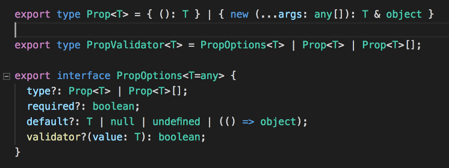

# Start

## 安装

```shell
npm install -g @vue/cli
```

## Intro

1.  应用实例 & 根组件

   ```js
   const RootComponent = { /* options */ } // 根组件实例
   Vue.createApp(RootComponent) // 创建应用实例
     .component('SearchInput', SearchInputComponent) // 注册应用实例下的全局组件
     .directive('focus', FocusDirective) // 注册指令
     .use(LocalePlugin) // 注册插件
     .mount('#app') // 挂载, 返回根组件实例
   ```

* 组件实例的属性

  * `data`, `methods`, `props`, `computed`, `inject`, `setup`的属性都会挂载到组件实例上

  * 组件模板可以访问到组件实例的属性
  * Vue还提供了内置属性, 以`$`为前缀, 如`$attrs`, `$emit`.
  * 以`_`为前缀的名字为保留名字, 用户不允许使用.

* 生命周期

  


## Template Syntax

* 用于绑定组件实例的属性到DOM上

# 组件

## 属性继承

* 绑定到组件上的属性和事件处理器, 若未在组件选项`props`,`emit`上声明, 且组件只有一个根节点时, 将会绑定到组件根节点上

* 可阻止该行为, 然后手动绑定到组件其他元素上

  ```javascript
  app.component('date-picker', {
    inheritAttrs: false,
    template: `
      <div class="date-picker">
        <input type="datetime" v-bind="$attrs" />
      </div>
    `
  })
  ```

* 多根节点组件中, 无该行为, 但绑定未声明属性或事件处理器到组件上时, 会警告, 除非显示绑定

  ```html
  <custom-layout id="custom-layout" @click="changeValue"></custom-layout>
  ```

  ```javascript
  // This will raise a warning
  app.component('custom-layout', {
    template: `
      <header>...</header>
      <main>...</main>
      <footer>...</footer>
    `
  })
  
  // No warnings, $attrs are passed to <main> element
  app.component('custom-layout', {
    template: `
      <header>...</header>
      <main v-bind="$attrs">...</main>
      <footer>...</footer>
    `
  })
  ```

> 踩坑点:
>
> 如, 点击组件, 除了原生click事件外, 还会出现组件自身提供的click事件(如果有的话), 也就是触发了两次不同的click事件. 因此组件自身事件最好还是在`emits`选项中声明

> 参考[Non-Prop Attributes](https://v3.vuejs.org/guide/component-attrs.html)

# Reactivity

## 原理

```javascript
const dinner = {
  meal: 'tacos'
}

const handler = {
  get(target, prop, receiver) {
    track(target, prop)
    const value = Reflect.get(...arguments)
    if (isObject(value)) {
      return reactive(value)
    } else {
      return value
    }
  }
  set(target, key, value, receiver) {
    trigger(target, key)
    return Reflect.set(...arguments)
  }
}

const proxy = new Proxy(dinner, handler)
console.log(proxy.meal)

// tacos
```

1. 响应式对象由代理实现
2. `get()`方法记录依赖, `set()`方法出发更新
3. 组件首次渲染时, 会访问涉及的所有响应式对象, 出发`get()`的记录依赖树.
4. `computed`对象无需指定依赖, 无副作用的`watch`需要指定监听的响应式对象, 原因见3.
5. 代理只对对象有用, 所以vue3提出了`ref`的概念, 用于基本类型变量.

## Ref Unwrapping

`ref`自动解包装的情况如下:

1. 在template中使用

   ```vue
   <template>
     <div>
       <span>{{ count }}</span>
       <button @click="count ++">Increment count</button>
       <button @click="nested.count.value ++">Nested Increment count</button>
     </div>
   </template>
   
   <script>
     import { ref } from 'vue'
     export default {
       setup() {
         const count = ref(0)
         return {
           count,
   
           nested: {
             count
           }
         }
       }
     }
   </script>
   ```

   > 嵌套在普通对象中的`ref`不能自动解包装

2. 赋值给`reactive`对象的属性

   ```js
   const count = ref(0)
   const state = reactive({
     count
   })
   ```

   对`reactive`数组, 或原生集合 (如`Map`) 赋值时, 不能自动解包装

   ```js
   const books = reactive([ref('Vue 3 Guide')])
   // need .value here
   console.log(books[0].value)
   
   const map = reactive(new Map([['count', ref(0)]]))
   // need .value here
   console.log(map.get('count').value)
   ```

> 参考[Ref Unwrapping](https://v3.vuejs.org/guide/reactivity-fundamentals.html#ref-unwrapping)

# 过渡 & 动画

* 原理

  `transition`或`transition-group`组件中指定`name`后, 元素插入或删除时, 会被作用不同的class. 

  我们只需要定义这些class的样式即可

* 组件

  * `transition`
    * 作用于单元素/组件, 或者多个元素/组件, 但同一时间内仅出现一个元素/组件(互斥)
    * 不产生新的wrapper元素

  * `transition-group`
    * 作用于多个元素/组件, 每个元素有唯一的`key`值
    * 可以产生新的wrapper元素.
    * 支持元素位置改变时的过度效果.

* 使用
  * [transition](https://v3.cn.vuejs.org/api/built-in-components.html#transition)
  * [transition-group](https://v3.cn.vuejs.org/api/built-in-components.html#transition-group)

# Vue Router

## Composition API

* 获取`route`, `router`

  ```javascript
  const router = useRouter()
  const route = useRoute()
  ```

* `route`是响应式对象, 可监听, 以获取变更后的动态参数值

  ```javascript
  import { useRoute } from 'vue-router'
  
  export default {
    setup() {
      const route = useRoute()
      const userData = ref()
  
      // fetch the user information when params change
      watch(
        () => route.params,
        async newParams => {
          userData.value = await fetchUser(newParams.id)
        }
      )
    },
  }
  ```

* 组件路由拦截器

  ```javascript
  import { onBeforeRouteLeave, onBeforeRouteUpdate } from 'vue-router'
  
  export default {
    setup() {
      // same as beforeRouteLeave option with no access to `this`
      onBeforeRouteLeave((to, from) => {
        const answer = window.confirm(
          'Do you really want to leave? you have unsaved changes!'
        )
        // cancel the navigation and stay on the same page
        if (!answer) return false
      })
  
      const userData = ref()
  
      // same as beforeRouteUpdate option with no access to `this`
      onBeforeRouteUpdate(async (to, from) => {
        // only fetch the user if the id changed as maybe only the query or the hash changed
        if (to.params.id !== from.params.id) {
          userData.value = await fetchUser(to.params.id)
        }
      })
    },
  }
  ```

## 路由拦截器(守卫)

有三种拦截方式

* 全局拦截

  ```js
  const router = createRouter({ ... })
  
  router.beforeEach((to, from) => {
    // ...
    // explicitly return false to cancel the navigation
    return false
  })
  ```

  * 参数

    * `to` 目标路由信息
    * `from` 源路由信息

  * 结果

    * 返回`false`, 抛出异常, 将取消路由
    * 返回`router.push()`的参数, 可重定向到其他页面.
    * 返回`true`, `undefined`, 将放行

  * vue2的使用方式支持

    vue2一般提供第三个参数`next()`支持路由, 如

    ```js
    router.beforeEach((to, from, next) => {
      if (to.name !== 'Login' && !isAuthenticated) next({ name: 'Login' })
      else next()
    })
    ```

    > 最好不要调用两次`next()`

* 每个路由拦截

* 组件中拦截

> 参考[Navigation Guards](https://next.router.vuejs.org/guide/advanced/navigation-guards.html)

# Typescript

## props类型

`props`类型声明如下, 需传入一个构造函数



方式一

```js
props: {
  testProp: Object as PropType<{ test: boolean }>
}
```

> 需要从`vue`中导入`PropType`

方式二

```js
props: {
  testProp: Object as () => { test: boolean }
} 
```

## ref 组件类型

声明组件类型

```js
import Vue from "vue";

export interface RefInterface extends Vue {
  pingMe(): void;
}
```

使用时给定类型

```js
mounted() {
    const child = this.$refs.child as RefInterface;
    child.pingMe();
}
```

# 其他

## idea文件模板

```vue
<template>
  #[[$END$]]#
</template>

<script lang="ts">
import {defineComponent} from "vue";
export default defineComponent ({
  name: "${NAME}"
})
</script>

<style lang="scss" scoped>

</style>
```

