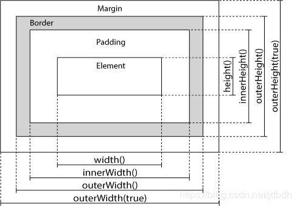

# 一、介绍
jQuery是javascript的一个库，主要用于简化的DOM树的操作，屏蔽各浏览器之间的差异。这里只介绍了jQuery的核心知识、DOM树的操作和ajax。还提了下事件，还有特效（effect）和ui控件的内容没有提及，但是可以参考最下方的链接教程。

# 二、核心知识
jQuery库的所有内容都被包含在`jQuery`名字空间中，而`$`默认为`jQuery`的匿名。通过方法`jQuery()`，即`$()`可以生产一个**jQuery对象**，几乎所有的DOM操作都是对jQuery对象进行操作的。但是有些方法并不是jQuery对象的方法，而是`$`的方法，都是一些有用的工具类方法。

可以这么理解：把`$`当做类，`$()`当做构造函数，生成的对象即为jQuery对象。。。实际上，jQuery对象的方法和属性源自于`$.fn`

通常[API文档][2]中`.each()`这种形式的方法表示为jQuery对象的方法，而`$.each()`表示`$`的方法（理解成类方法。。）

--------

一般jQuery的使用都是先从[$()][3]方法开始的，该方法可以通过css的**选择器**找到匹配的元素**集合**，存入新生成的jQuery对象中并返回jQuery对象；或者传入含html代码的字符串，通过该方法生成对应元素，但该元素还未放入DOM树中，同样的也是返回jQuery对象。

jQuery对象就像是元素集合的包装器一样，提供了更为方便的方法来操作DOM树的元素。可以像数组一样通过下标获取它的元素对象，使用元素对象的**原生态方法**，但是一般不会这样使用，因为jQuery对象提供的方法更方便。jQuery对象还拥有length属性，该属性表明匹配元素的个数。注意，jQuery即使像数组，**但却不是数组**。

jQuery的选择器包含了**大部分**css3选择器，用法和css一样。可以参考下面的链接，或我的博客：[css][4]。

参考：
[selecting elements](https://learn.jquery.com/using-jquery-core/selecting-elements/)
[selectors](http://api.jquery.com/category/selectors/)

[3]:https://api.jquery.com/jQuery/
[2]:https://api.jquery.com/
[4]:https://blog.csdn.net/jdbdh/article/details/84317656

## 引入jQuery
js在DOM树构建完成前执行是很不安全的，在我的[js入门][1]中介绍了一些解决方法。但在jquery中，也有它自己的办法。如：
```javascript
$( document ).ready(function() {
	//Your code here
});
//或者一种简写方式
$(function() {
    // Your code here.
});
```
它表示为当文档DOM已经准备好了时（ready事件发生），执行匿名函数的内容。但是此时可能图片或iframes还未加载完成，因此如果需要整个网页都准备好时才执行代码，可以监听window的load事件：
```javascript
$( window ).on( "load", function() {
	//Your code here
});
```

[1]:https://blog.csdn.net/jdbdh/article/details/84770324

-------------------
如果引入多个库，其他库也用到了`$`这个标识符，然后**之后**再引入jQuery则会造成**名字冲突**，覆盖了`$`的内容。解决方法如下：
1. 创建新匿名：`jQuery.noConflict()`方法可以放弃`$`变量的控制，并返回jQuery。赋值给其他变量可以重新匿名，或者直接`let jq2=jQuery`也行。
	```javascript
	<script src="prototype.js"></script>
	<script src="jquery.js"></script>
	<script>
	// Give $ back to prototype.js; create new alias to jQuery.
	var $jq = jQuery.noConflict();
	</script>
	```
2. 设置ready事件的处理器参数名为`$`：处理器会自动被传入jQuery作为参数，因此可以使用`$`作为参数。
	```javascript
	<script src="jquery.js"></script>
	<script src="prototype.js"></script>
	<script>
	 //因为jquery位于其他库之前，没有产生名字冲突，因此不必使用$.noConflict()
	jQuery(function($){
	    // Your jQuery code here, using the $
	});
	</script>
	```

## 操作DOM
jQuery对象提供了一些列操作DOM元素的方法。

参考：
[Manipulation](https://api.jquery.com/category/manipulation/)
[Manipulating Elements](https://learn.jquery.com/using-jquery-core/manipulating-elements/)

### getting和setting
下面的一些方法都可以获得元素对应的信息，也可以设置元素的内容。当获得信息时，一般是获得元素集中第一个元素的信息，除了例外`.text`（它将所有元素的文本拼接而成）；当设置信息时，会分别对元素集中所有元素设置。
* `.html()` – Get or set the HTML contents.
* `.text()` – Get or set the text contents; HTML will be stripped.
* `.attr()` – Get or set the value of the provided attribute.
* `.prop()` --得到或设置元素内部property
* `.width()` – Get or set the width in pixels of the first element in the selection as an integer.
* `.height()` – Get or set the height in pixels of the first element in the selection as an integer.
* `.position()` – Get an object with position information for the first element in the selection, relative to its first positioned ancestor. This is a getter only.
* `.val()` – Get or set the value of form elements.

>jquery 1.6+后，`.attr()`方法不能再设置property了，所谓property就是元素内部的属性（或字段）。一些boolean attribute，如`checked`可以初始化property，但之后不能改变它，因此使用`.attr()`方法设置checkbox类型的input的选中状态已经没用了，只能使用`.prop()`方法。参考：[.prop](https://api.jquery.com/prop/)
### adding
下面的方法可以添加或者移动元素。

`.append()`,`.appendTo()`,`.prepend()`,`.prependTo()`分别可以将元素添加到元素**内**的前端或后端。

`.after()`,`.insertAfter()`,`.before()`,`.insertBefore()`分别可以将元素添加到元素的前面或后面。

一般移动DOM元素时，原来的元素位置会改变。如果我只想克隆该元素到其他地方呢？则可以使用`.clone()`
```javascript
$( "#myList li:first" ).clone().appendTo( "#myList" );
```
通过`$()`可以方便的创建新的元素，然后通过上面的方法将元素放入DOM树中。

### removing
`.remove()`,`.detach()`都可以删除元素，然后返回对应jQuery对象。但是前者在删除元素后不会保存关联的数据和事件处理器，后者保存。`.detach()`可以方便的恢复被删除的元素。

`.empty()`可以删除元素内所有子元素（包括文字）。

### attributes
`.attr()`可以获得或者设置属性。

还有一些设置类属性的方法：[class attrubte](https://api.jquery.com/category/manipulation/class-attribute/)

### styles
`.css()`方法用于设置和获得样式。虽然支持样式名字含有“-”符号（js中不支持），最好使用驼峰命名法。

还有一些属性可以获得或者设置元素的尺寸，但提倡使用css获得它的长宽：


参考：[Style Properties](https://api.jquery.com/category/manipulation/style-properties/)

## Traversing DOM
遍历元素的方法大致分为两类：
1. 过滤以匹配的元素集合，如`.eq()`,`.first()`,`.last()`等等。
2. 遍历DOM树的方法，可以遍历父元素、子元素和兄弟元素。

还有一些工具方法。只要知道这些方法大致分类就行了，使用时查查文档即可。

参考：[Traversing](https://api.jquery.com/category/traversing/)

## 获得元素
通过`$(selector)`可以得到jQuery对象，并且它提供的方法不仅跨浏览器还很方便，但是在某些特殊情况下还是需要操作元素对象时，可以通过`.get()`方法或者下标`[]`来获得元素对象（`Element`）。

当想使用jQuery的方法时，可以将元素对象转化为jQuery对象：`$(element)`

# 三、事件
在官方文档中，有一章关于事件的内容，我没有怎么看，只是大致了解了下。jQuery只是提供更为方便的设置事件的方法，我怀疑event对象也被jQuery扩充了内容。但大致上来说，总的内容是不变的，可以参考我的另一篇博文。

任意事件处理器都可以通过`.on()`方法来设置，jQuery也提供了更为方便的方法，如`.click()`,`,focus()`,`.blur()`,`.change()`等等，这些方法可以绑定事件处理器，同时也可以手动**触发**该事件。

event对象中多了个data属性，因此设置处理器时传入的额外数据可以在处理函数中获得。

一些有用的方法：
* `.on()`：对所有元素集附加事件处理器
* `.off()`：去除事件处理器
* `.one()`：所有元素都附加一个事件处理器，对于每种事件，事件处理器只执行一种。

所有的事件：https://developer.mozilla.org/en-US/docs/Web/Events

>注意，事件处理函数（handler）中的this为被操作元素本身，而不是jquery对象

更多内容请参考官方文档。。。

# 四、Ajax
ajax可以让浏览器和服务器之间**异步**交换数据，而不是重新载入整个网页。
>所谓异步即一个操作启动执行后，不用等待该操作完成，而是直接执行后续操作，当操作结束时会通知（即调用回调函数）。

尽管ajax全名Asynchronous JavaScript and XML，但是数据不仅可以以xml方式传输，还可以以json、text、html等等方式传输。其中json最为常用。

通常，由于浏览器的同源政策（same origin policy），ajax是不能跨域名工作的。但是，JSONP利用`<script>`标签可以从其他域名的网站上获得json数据。

jQuery最底层的`$.ajax()`方法提供了执行异步http请求的功能。也提供了简化一点的ajax方法，如`$.get()`,`$.post()`,`$.getJSON()`,`$.load()`等方法，这只不过是对`$.ajax()`的简单封装罢了。因此，最主要的还是了解`$.ajax()`的使用。

## $.ajax()
一般使用该方法的[第二种形式][5]：`jQuery.ajax( [settings ] )`

settings是一个包含键值对的普通对象，这里列出一些有用的属性：

* **url**：要请求的网址，默认当前网址。
* **data**：要发往服务器的数据。
* **method**：使用的http方法，默认GET。POST和GET支持就好，可跨浏览器。method的匿名为**type**。
* **dataType**：期待接收数据的类型，如果没有指定，jQuery会通过响应的content-Type头字段来推断数据类型。指定json时，会解析响应返回javascript对象；指定xml时，会解析响应返回xml元素；指定script时，会执行该脚本；其他的都返回string。
* **contentType**：数据的MIME类型，默认`'application/x-www-form-urlencoded; charset=UTF-8'`
* **success**：指定请求成功时的回调函数。
* **error**：指定请求失败时的回调函数。
* **complete**：指定请求结束时的回调函数，无论请求是否成功，在success和error回调函数之后执行。
* **async**：异步请求还是同步请求，默认异步请求。
* **cache**：是否缓存，默认true，false for dataType 'script' and 'jsonp'
* **context**：指定回调函数中this指向的对象，默认ajax setting。

`$.ajax()`返回jqXHR对象，该对象有一些方法，如`jqXHR.done()`,`jqXHR.fail()`,`jqXHR.always()`等方法，分别对应上述success,error,complete属性。

[5]:http://api.jquery.com/jQuery.ajax/#jQuery-ajax-settings

## 其他
`$.ajax()`看着复杂了点，其实一点也不复杂，但是jQuery也提供了一些简便的方法，对`$.ajax()`进行封装。

如`$.get()`的一种调用形式：`jQuery.get( url [, data ] [, success ] [, dataType ] )`，看起来简单了很多，其实等于：
```javascript
$.ajax({
  url: url,
  data: data,
  success: success,
  dataType: dataType
});
```
又如`$.post()`，等于：
```javascript
$.ajax({
  type: "POST",
  url: url,
  data: data,
  success: success,
  dataType: dataType
});
```
还有`$.getJSON()`，请查看文档。`.load()`的可以从服务器加载html数据，插入到被选中的元素中。

ajax还有一些有用的方法，如`.serialize()`可以将form表单元素编码成url查询子串的形式。`.serializeArray()`则将form表单元素编码成含键值对对象的数组。

### 4.2.1 $.ajaxSetup
`$.ajaxSetup`用于`$.ajax`函数的默认选项，对于它的变种`$.get`,`$.post`同样生效。

CORS跨域开发需要配置前后端，现在通过`$.ajaxSetup`进行前端配置：
```javascript
 //开发环境配置--配置ajax
 let baseUrl="http://localhost:8080"
 $.ajaxSetup({
     //ajax请求发送前预处理
     beforeSend: function(xhr, options) {
         //如果是根相对地址，则加上服务端前缀
         if(options.url.startsWith("/")){
             options.url=baseUrl+options.url;
         }
         //允许发送credentials
         options.xhrFields=Object.assign(
             options.xhrFields==null? {} : options.xhrFields,
             { withCredentials:true }
         );
     }
 })
 //现在可以发起跨域请求了，前提是后端允许。
 $.get("/hello",function(data){
     console.log(data);
 })
```
## JSONP
jsonp用于跨域名**获取**json数据，需要server端配合，提供相应的api。

### 原理
由于cross-origin policy，浏览器不允许跨域名传输数据，但是服务端脚本却没有这种限制。同源网页通过**协议、域名和端口号**确定，但是即使通过jsonp，https的网页上由于安全政策也不能获得http协议传输的json数据，反之可以。

jsonp是通过`<script>`元素实现的，因此脚本元素可以跨域名传输。**需要服务器配合**，将json数据写入到**方法调用**中，通过ajax将脚本加载进入，然后执行该调用。因此需要保证该网页上存在此函数。如[json文件][6]（含有方法调用），然后通过ajax获取json数据：
```javascript
//此函数名在json文件中被指定了，加载json文件时会调用该函数
function jsonCallback(json){
  console.log(json);
}
//使用jsonp
$.ajax({
  url: "http://run.plnkr.co/plunks/v8xyYN64V4nqCshgjKms/data-2.json",
  dataType: "jsonp"
});
```

### 使用
现在看看`$.ajax()`具体如何使用，只有它的简便函数不谈，因为实现原理很简单。如果jsonp被指定，`$.ajax()`将自动在url后默认添加参数`callback=?`，然后加载脚本，并执行脚本中的方法调用。

callback有什么用？其他他就是个约定，约定将json数据传入哪个函数。如果服务端，没有提供这功能，那自然没有用；在[github api][7]中，它会根据callback参数自动生成对应方法调用。

`jsonp`,`jsonpCallback`属性分别设置url后添加的参数名（即将参数callback换成其他的）和回调函数的名字（接收json数据的函数，比如上面的jsonCallback）。jsonpCallback最好要设置，这样ajax才知道有没有成功接收到函数。
* 如果设置了jsonpCallback，并且函数存在，会继续执行success的回调函数，否则执行error的回调函数。
* 如果没有设置jsonpCallback，即使成功接收到了json数据（即jsonp的回调函数被调用），ajax还是会执行error的回调函数。

所以一般正确写法：
```javascript
function logResults(json){
  console.log(json);
}
$.ajax({
  url: "https://api.github.com/users/jeresig",
  dataType: "jsonp",
  //最好指定吧。。
  jsonpCallback: "logResults"
});
```
但是使用`$.getJSON()`时，url后自己给定参数`callback=?`会被当做jsonp来处理，下面的方法更为简便：
```javascript
//!!!!嗯？竟然还可以这样！为什么呢？我也不知道，，，，，
$.getJSON("https://api.github.com/users/jeresig?callback=?",function(json){
  console.log(json);
});
```

### 其他方法
使用jsonp还是有一定缺陷的，需要服务器提供这样的接口才行。当然还有其他的方法可以跨域获取json数据，不过也是有点小问题的。

* 代理：服务端是没有同源政策约束的，因此可以让服务器从其他网站上获取json数据再返回给客户端的json请求。
* CORS：网页的响应消息头字段设置了`Access-Control-Allow-Origin`，那就浏览器就允许跨域传输数据了。服务器和浏览器都可以设置该字段，服务器具体操作参考：[CORS Filter][8]；浏览器可以使用谷歌插件[~~Allow-Control-Allow-Origin（已失效）~~][9] [Moesif Orign & CORS Changer][10]

如果我需要**上传**数据到其他服务器呢？除了代理和CORS外，还有两种方法：
* 通过form表单上传
* 通过img，但数据不能太大。如：
	```javascript
	var img = new Image();
	img.src="http://www.otherserver.com/getxml?xml="+encodeURIComponent(yourXML);
	```

>注意，跨域后，貌似仍不能使用session

参考：https://www.sitepoint.com/jsonp-examples/
https://stackoverflow.com/a/5050047/10248407

[6]:http://run.plnkr.co/plunks/v8xyYN64V4nqCshgjKms/data-2.json
[7]:https://developer.github.com/v3/#json-p-callbacks
[8]:https://tomcat.apache.org/tomcat-8.5-doc/config/filter.html#CORS_Filter
[9]:https://chrome.google.com/webstore/detail/allow-control-allow-origi/nlfbmbojpeacfghkpbjhddihlkkiljbi?utm_source=chrome-ntp-icon
[10]:https://chrome.google.com/webstore/detail/moesif-orign-cors-changer/digfbfaphojjndkpccljibejjbppifbc/related

# 五 其他
## 5.1 上传含有文件的表单
关键在于使用`FormData`包裹表单数据
```javascript
     $("#register-form").submit(function (event) {
         event.preventDefault();
         $.ajax({
             url:"/user/register",
             type:"POST",
             data:new FormData(this),
             contentType:false,
             processData:false,
             success:function(status){
                 console.log(status);
             }
         })
     })
```
`contentType`不用设置成`multipart/form-data`，为啥？不知道，测试得出的
# 参考
[learn jquery](https://learn.jquery.com/about-jquery/)
[jquery api](https://api.jquery.com/)
[w3schools jquery tutorial](https://www.w3schools.com/jquery/default.asp)