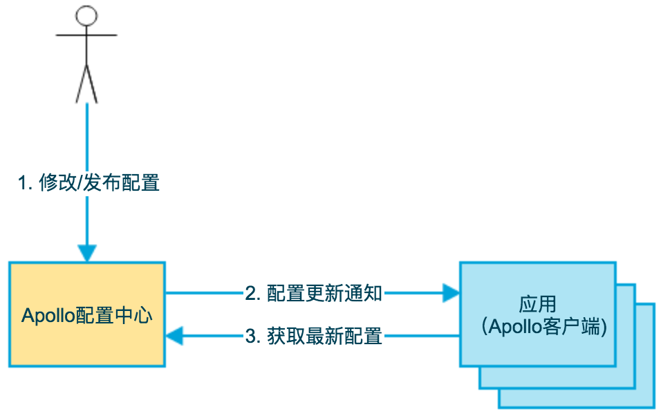

# 介绍

携程实现的一个分布式配置中心, 与Spring Cloud Config是同一类产品, 但Apollo功能更为完善.

# 工作流程



Apollo提供了配置中心, 管理员能通过门户 ( Portal ) 在配置中心中修改和发布配置.

发布配置后, Portal将配置的更新通知给Apollo客户端, 然后Apollo客户端再通知应用. 

> Apollo客户端一般集成在我们的应用中, 通过注册事件, 来获取来自Apollo客户端的通知.

应用启动时, 会通过Apollo客户端从Portal中获取配置.

# 架构剖析


- 配置中心

  - Config Service

    提供配置的**读取**、**推送**等功能，服务对象是Apollo客户端

  - Admin Service

    提供配置的**修改**、**发布**等功能，服务对象是Apollo Portal（管理界面）

- 服务注册&发现

  - Config Service, Admin Servic在Eureka上注册服务
  - Meta Server封装了Eureka, 提供Client服务发现功能

- 客户端

  - Client通过负载均衡器(客户端的), +域名, 向Meta Server查询Config Server的IP:Port, 继而获取配置

上述是其逻辑结构, 实际上, Config Service, Eureka和Meta Server处于同一个项目中 (Apollo Config Service) . 在部署Apollo时, 仅部署三个项目即可: Apollo Config Service, Apollo Admin Service和 Apollo-Portal.

# Portal

管理员配置项目配置的网站门户

##  项目

新建项目会得到一个appId, 表示项目id


## Namespace

项目中每一项都是一个Namespace, 也就是项目的配置, 默认存在一个`application`的Namespace, 类比于SpringBoot项目的`application.properties`


Namespace支持多种格式配置, 如`properties`, `yaml`等

Namespace分三种类型: **私有**, **公共**和**关联**

* 私有

  只有拥有该namespace的项目能访问它的配置

* 公共

  该namespace的配置可以被其他项目访问

* 关联

  自身是私有的, 但与公共namespace关联, 即继承了公共namespace的配置, 也可覆盖公共namespace的某些配置.

# Java客户端

## 配置

* AppId (必填)

  应用ID, Portal中新建项目时所得

  ```properties
  app.id=YOUR-APP-ID
  ```

* Meta Server地址 (必填)

  ```properties
  dev.meta=http://1.1.1.1:8080
  fat.meta=http://apollo.fat.xxx.com
  uat.meta=http://apollo.uat.xxx.com
  pro.meta=http://apollo.xxx.com
  ```

  > 如上为各种环境配置了Meta Server地址. 前缀代表环境类型, 依次为开发, 测试, 预生产, 生成环境.

* 环境选择

  即使用哪种环境, 使用哪个Meta Server, 如使用开发环境

  ```properties
  env=DEV
  ```

  `env`可选值: `DEV|FAT|UAT|PRO`


