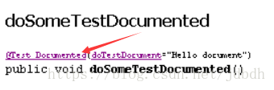

[TOC]

# 一 介绍

## 历史

Java语言最初由Sun MicroSystems公司开发, Sun于2010年由Oracle公司收购, Java最终归为Oracle所有. 随着Java的不断进化, Java不再仅仅是语言, 还包括保证大量标准的,开源的API和工具, 可称之为Java平台.

xxxx年, oracle宣布收费, 只是它自己的JVM实现收费罢了, 可以使用其他免费的JVM实现, 如OpenJDK的JVM实现.

## Java概念

Java如今不只是Java语言, 而是一个平台, 涉及很多parts, 这里一一介绍:

* Java语言

  Java语言, 存放在以`.java`为后缀的文件中.

  > 有Java语言, 必定存在对应的编译器.

* Java字节码

  Java文件被编译后将生成二进制字节码文件, 以`.class`为后缀.

  > Java字节码是低级语言, 类似与汇编. 现在出现了很多高级语言, 最终编译成Java字节码, 如kotlin, groovy等.

* Java虚拟机(JVM)

  解析并运行Java字节码的程序, 不同的JVM实现对Java程序的性能有极大的影响.

  > 正是因此而被人诟病Java运行速度慢. 实际上现在的JVM已经很强大了, 支持JIT(Just In Time), 即运行时智能的将高频运行的代码块编译成机器码并运行它, 极大的提高了程序的运行效率.

  > JVM在不同系统上都有实现, 因此Java程序可以跨平台运行. 
  >
  > JVM不仅要解析与执行字节码, 还要提供系统方面的native API供Java API使用. 但是涉及系统方面的API在不同系统的JVM实现中会表现出部分不一致, 但是总体行为是相似的. 例子如线程的优先级问题.

* Java APIs

  Java提供的类库, 简化开发难度. Java API根据不同的使用领域, 将API划分为三个:

  * Java Card: 运行在小内存设备上

  * Java ME(Micro Edition): 支持移动终端，Java API因此比较精简.

    > 移动端最流行的就是安卓, 不过安卓使用的是部分Java API和它自己提供的API

  * Java SE(Standard Edition): 支持桌面级应用，含有完整的java核心API

  * Java EE(Enterprise Edition): 对Java SE API做了大量扩充，扩展API一般以`javax.*`作为包名。主要用于服务端.

* JRE

  Java运行环境(Java Runtime Environment ), 包含了运行Java环境的必要组件, 如Java SE API, 但没有编译器等.

* JDK

  Java Software Development Kit等于JRE加上编译器和一套其他开发工具.

  > 开发Java程序都需要装JDK

* 应用领域:

  * Java Applets: 运行在浏览器上的Java程序, 目前Go die了, 该领域已被HTML5和JavaScript统治.
  * Java Application Servers: Java EE大部分只提供了规范, 没有具体实现. 实现了这些规范的服务器(Server)能够运行Java程序, 跑Web服务.
  * JavaFX: 用于制作桌面软件, 作为Swing的替代品.
  * 移动领域? 这里没Oracle啥事了, 除了那场与Goolge的官司.

  > Java目前在后端开发中很火热.

# 二 基础

## 安装

从官网上下载JDK, 如果是压缩包, 则解压并配置以下环境变量:

- `PATH`：让Java命令能够在CLI下运行.

- `JAVA_HOME`：约定俗成的一个环境变量，指向JDK安装目录。可选但最好存在, 理由有二:
  - 其一，有些Java程序（如tomcat）在运行时可以通过该变量获得运行时资源，比如Tomcat。
  - 其二（不确定对不对），当存在多个版本的jdk时，无论运行哪个JDK版本的JVM（即设置`PATH`），最终使用的运行环境还是`JAVA_HOME`指向的JDK。
  
- `CLASSPATH`：指向所依赖 Jar库所在地的路径(System ClassLoader会用到该路径)。一般不用给出，默认当前工作目录`.`。如果有，最好也将`.`加入到变量中。在命令行，通过选项`-cp`能够覆盖该`classpath`路径。

  > JDK提供的类由其他类加载器加载, 路径由其他方式给出, 见[类加载器](https://blog.csdn.net/jdbdh/article/details/82593573)

## 编译运行

通常在项目的根目录下, 存在一个源目录(假设`src/`), 存放所有Java源文件, 和一个目的目录(假设`classes/`), 存放所有编译后的class字节码文件.

这里假设Java源文件全在`myfirstapp`包下, 则编译如下:

```bash
javac src/myfirstapp/*.java -d classes
```

* 第一个参数指向Java源文件
* `-d`指向存放生成的字节码的路径. 

> 问题来了, 如果我不止一个包(package)呢? 并且还有子包呢? 我难道要全部列出来才编译? 

然后运行

```bash
java -cp classes myfirstapp.MyJavaApp
```

* `-cp`告诉JVM你所有的class文件在哪. 未给出时默认当前目录, 即`.`

* 最后一个指定含入口方法`main`的类的全限定名, 即包名+类名. 这样JVM才能从classpath路径下找到主类并运行.

  >`main`方法是执行Java程序的入口, 一般声明形式如下:
  >
  >```java
  >public static void main(String[] args) {
  >
  >}
  >```
  >> 并且入口可以有多个, 但是一次JVM只能运行一个.

> 问题来了, 项目依赖的第三方jar怎么指定? 可以用通配符`*`, 如下面即指定项目编译的class文件和所有三方jar
>
> ```bash
> java -cp classes:/path/to/third-library/* myfistapp.MyJavaApp
> ```

---------------

当项目复杂时, 编译和运行都很复杂, 尤其是编译, 需要列出所有package才能编译. 于是人们将构建过程交给了IDE或构建工具(如Maven)管理, 目前通常都是使用Idea集成Maven的方式来构建项目.

## Java源文件结构

必备要求:

* Java源文件必须以`.java`为后缀

* 如果有一个顶层类, 被`public`修饰时, 那么类名必须与文件名一致.

  > 其中枚举, 注解是特殊的类

Java源文件中一般含有以下元素:

- Package declaration
  - 必须位于第一行
  - 必须与实际的package位置一致
- Import statement**s**
- Type declaration**s**: 
  - Fields
  - Class initializers
  - Constructors
  - Methods

## 核心概念

* **变量**: 

  * 存储数据的地方. 
  * 每个变量都对应一个**数据类型**, 数据类型决定了变量可以存储何种类型的数据, 以及可对该数据进行何种**操作**.
  * 每种变量都有它自己的作用域.

  > 变量, 字段, 对象(实例), 这些概念大致相同, 本文可能会混淆的使用这些概念.
  >
  > 但是变量主要侧重于指栈中的变量和堆中对象的字段, 对象则侧重于堆中的对象.
  >
  > 或者说变量就是基本变量+引用变量(指向对象的变量).

* **操作**: 处理变量中数据的操作指令. 可分为两种:

  - Variable operations: 主要用于读写变量
    - Variable assignment of values.
    - Variable reading of values.
    - Variable arithmetic.
    - Object instantiation.
  - Program flow: 主要是通过读取变量数据, 而决定下一条流程执行分支.
    - [`for` loops](http://tutorials.jenkov.com/java/for.html).
    - [`while` loops](http://tutorials.jenkov.com/java/while.html).
    - [`if` statements (branches)](http://tutorials.jenkov.com/java/if.html).
    - [`switch` statements](http://tutorials.jenkov.com/java/switch.html).
    - Method calls: 方法调用本质就是跳转到方法代码块执行.

* **类和对象**: 

  * 类是抽象的模板, 泛指某一类事物, 而对象是具体的实例. 好比人类和具体的某个人. 
  * 类定义了一种数据类型, 它的**字段**声明定义了对象能够存储的数据, 它的**方法**声明定义了对象能够拥有的操作.
  * 对象的概念主要来源于世界
  
* **接口**: 接口与类相比, 接口普通方法不能有实现, 也即接口只是定义了行为, 需要实现类去实现.

* **Packages**: 是用于管理组织有关联的一组类和接口的名字空间, 在文件系统中的体现就是目录.

# 三 语法

## 语言基础

描述语言最基本的特性.

### 变量

#### 声明

变量声明格式如下:

```
VarType varName [=initialValue];
```

> 在基本变量中, 类型指的就是变量本身的类型; 在引用类型中, 类型指的是所引用对象的类型.

> 字段即使未初始化, 在对象被创建时也会为字段分配空间, 因此可以有默认值; 但是局部变量仅声明时, 则不会分配空间, 不会有默认值, 直接访问它会报错.
>
> > 但可以写入, 写入字面值时, 即在编译时就分配了空间; 写入对象, 则在运行时分配的空间. 不管哪种方式, 都是分配了空间.

#### 分类

变量按照它声明的位置可分为四种

- **Instance Variables(Non-static fields)**: 属于对象的字段, 每个对象都有一份, 只能被对象访问.
- **Class Variable(Static fields)**: 属于类的字段, 每个类只有一份, 可以通过类和对象访问到.
- **Local variables**: 方法内的局部变量, 方法会将它的临时数据存入局部变量. **局部变量必须被初始化后才能使用.**
- **Parameters**: 方法参数, 方法获取输入的途径.

> 实例变量和类变量未初始化时会有默认值, 其中引用变量的默认值为`null`.

从变量是否指向对象可分为

- **基本变量**(primitive variable): 如`int`,`long`
- **引用变量**(reference variable)或**对象引用**(Objecgt references): 如`Integer`,`Long`

#### 命令规则

- 大小写敏感

- 必须以字母,`$`或`_`开始, 之后变量名可含数字

  > 这条是几百年的规则了吧,,, 我用中文名也行

- 不能是保留字

- 变量建议使用名词; 方法使用动词; 常量全大写, `_`分隔; 建议驼峰命名法

#### 局部变量类型推断

局部变量类型推断(JDK10特性), 即当声明局部变量时, 编译器能够从初始值中推断出变量类型. 使用`var`推断类型, 如

```java
var myVar = "A string!";
```

`myVar`被推断为`String`

### 数据类型

#### 介绍

Java是静态类型语言, 意味着声明变量时必须给出数据类型. 数据类型决定了变量可以存储什么样的数据, 和对这些数据进行什么样的操作.

之前说了, 数据类型可分为**基本类型**和**对象引用**. 基本类型变量直接存储数据, 而对象引用存储的是对象的引用或地址.

#### 基本类型

Java语言定义了8中基本类型:

| **Data type** | **Description**                                              |          | 包装类      |
| ------------- | ------------------------------------------------------------ | -------- | ----------- |
| `boolean`     | A binary value of either `true` or `false`                   | 0        | `Boolean`   |
| `byte`        | 8 bit signed value, values from -128 to 127                  | 0        | `Byte`      |
| `short`       | 16 bit signed value, values from <br />-32.768 to 32.767     | 0        | `Short`     |
| `char`        | 16 bit Unicode character                                     | '\u0000' | `Character` |
| `int`         | 32 bit signed value, values from <br />-2.147.483.648 to 2.147.483.647 | 0        | `Integer`   |
| `long`        | 64 bit signed value, values from <br />-9.223.372.036.854.775.808 to 9.223.372.036.854.775.808 | 0L       | `Long`      |
| `float`       | 32 bit floating point value                                  | 0.0f     | `Float`     |
| `double`      | 64 bit floating point value                                  | 0.0d     | `Double`    |

> 默认值是针对字段的, 其中引用变量的默认值为`null`.

> 包装类就是基本类型对应的对象类型, 它们之间可以相互转换(Auto Boxing). 并且包装类是不可变的(immutable)

其他的都是引用类型的变量, 指向堆中的对象. 对象也是有类型的, 即它的类, 你也可以自己定义类, 即定义了新的数据类型.

JDK5后, 基本类型与包装类之间会**自动装箱**(Auto Boxing), 即有必要时, 基本类型会自动转化为包装类, 反之亦然.

> 基本类型自动包装时调用了包装类的`valueOf()`方法，自动拆箱时调用了包装类的`xxxValue()`方法, 如`intValue()`, `charValue()`等。

#### 字面值

基本类型和字符串是特殊的数据类型, 被内置到语言中, 可以直接使用字面值来创建出来, 如:

```java
boolean result = true;
char capitalC = 'C';
byte b = 100;
short s = 10000;
int i = 100000;
int[] myIntArray = {1, 2, 3};
String[] myStringArray = {"a", "b", "c"};
```

> `String[] myStringArray = new String[]{"a", "b", "c"};`应该不算字面值吧.
>
> **注意**!!! 数组字面值只能在声明时使用 因此
>
> ```java
> method({"aa","bb","cc"});//错误
> method(new String[]{"aa","bb","cc"});//正确
> ```

### 数组

#### 介绍

数组是一个容器对象, 储存固定数量的相同类型变量.

```java
//仅声明
int[] ints;
String[] strs;
String[][] strs2;
//声明时同时初始化
int[] ints2={1,2,3,4};//字面值
int[] ints3=new int[10];//默认初始化为0
String[] strs3={"aa","bb","cc"};
//分两步
int[] ints4=new int[]{1,2,3};//此时不能使用字面值.也不需要制定数量
```

#### 操作

`Arrays`提供了操作数据的方法

* Array与Collection之间的转化

  * `Arrays.asList`: 将数组转化为只读的`List`
  * `Collection.toArray`: 返回**新的**,安全的数组

* `equals` 判断两个函数是否相等, 即元素个数和对应元素是否相等.

* `fill`将一个数据填充到整个数组中.

* `sort`按照其元素的自然顺序排序.

  > 对象的自然顺序由它实现的`Comparable`接口给出.
  >
  > JDK8引入了`parallelSort`方法, 在多处理器系统中拥有更高的速度.

* `stream`提供了流的操作.

### 字符串

* 只需字符串加上引号, 字符串就会被自动创建, 如

  ```java
  String s="this is a string";
  ```

* 字符串是不可变的(immutable)

### Operations

#### 变量操作

##### 优先级规则

* 高优先级的操作符先运算
* 同等优先级的操作数先计算左边的. 其中`=`是例外, 从右边开始计算.
* 然而优先级是可以通过`()`改变的,`()`的优先级最高

| Operators            | Precedence                               |
| -------------------- | ---------------------------------------- |
| postfix              | `expr++ expr--`                          |
| unary                | `++expr --expr +expr -expr ~ !`          |
| multiplicative       | `* / %`                                  |
| additive             | `+ -`                                    |
| shift                | `<< >> >>>`                              |
| relational           | `< > <= >= instanceof`                   |
| equality             | `== !=`                                  |
| bitwise AND          | `&`                                      |
| bitwise exclusive OR | `^`                                      |
| bitwise inclusive OR | `|`                                      |
| logical AND          | `&&`                                     |
| logical OR           | `||`                                     |
| ternary              | `? :`                                    |
| assignment           | `= += -= *= /= %= &= ^= |= <<= >>= >>>=` |

##### 赋值操作符

略

##### 算数操作符

| Operator | Description                                            |
| -------- | ------------------------------------------------------ |
| `+`      | Additive operator (also used for String concatenation) |
| `-`      | Subtraction operator                                   |
| `*`      | Multiplication operator                                |
| `/`      | Division operator                                      |
| `%`      | Remainder operator                                     |

> 不同类型的整数运算时, 都会先转化为位数多的整数类型后再运算.

##### 一元操作符

| Operator | Description                                                  |
| -------- | ------------------------------------------------------------ |
| `+`      | Unary plus operator; indicates positive value (numbers are positive without this, however) |
| `-`      | Unary minus operator; negates an expression                  |
| `++`     | Increment operator; increments a value by 1                  |
| `--`     | Decrement operator; decrements a value by 1                  |
| `!`      | Logical complement operator; inverts the value of a boolean  |

其中, `i++`自增, 但返回自增前的值; `++i`自增, 返回自增后的值. `--`也类似.

##### 比较操作符

| `==` | equal to                 |
| ---- | ------------------------ |
| `!=` | not equal to             |
| `>`  | greater than             |
| `>=` | greater than or equal to |
| `<`  | less than                |
| `<=` | less than or equal to    |

##### 逻辑操作符

* `&&`逻辑与
* `||`逻辑或

##### 类型比较

```
object instanceof Class
```

左对象, 右类, 若类型符合, 则`true`, 否则`false`

##### 按位操作符

对整数类型的变量的每一位做逻辑运算

* `&`按位做AND运算
* `^`按位做OR运算
* `|`按位做XOR运算

##### 位移操作符

对整数类型变量做整体移动的运算

* `<<`逻辑左移, 最右补0
* `>>`逻辑右移, 最左位取决于本身符号. 如负数补1, 整数补0
* `<<<`算数左移, 最右补0
* `>>>`算数右移, 最左补0

#### 控制语句

> 下面一定要注意, `statement`加`s`表示允许存在多个语句.

##### 条件分支语句

###### if

```
if (<expression>)
	statement
[else
	statement]
```

注意

* `<expression>`要返回`boolean`类型值
* `statement`是一条语句, 多条时可用语句块.
* `else`语句可选
* `if`语句也是`statement`, 因此可以嵌套使用`if`语句

###### switch

```
switch (<expression>){
	case <label> : statements
	case <label> : statements
	...
	default : statements
}
```

* `<expression>`最终值可以为基本类型, 其包装类, 枚举类型, 和`String`
* `<lable>`为对应类型的一个常量, 用于匹配.
* `default`: 如果没有`case`语句匹配, 则执行`default`的语句
* `case`匹配后, 会执行之后的语句. 如果没有遇到`break`, **会一直执行下去**, 即可能会执行接下来的`case`语句. `default`语句也是一样.

##### 循环语句

###### while

有两种形式, 先判断后执行:

```java
while (expression)
	statement
```

先执行一次, 再判断:

```java
do
     statement
while (expression);
```

> 只有当`expression`为`false`时才退出循环

###### for

```java
for (initialization; termination; increment)
    statement
```

* `initialization`: 循环开始前执行, 仅执行一次.
* `termination`: 每次一轮循环前执行, 返回`true`时继续执行, 否则结束
* `increment`: 每次一轮循环结束后执行

----

还有一种增强型`for`循环, 用于遍历**集合**和**数组**

```java
public static void main(String[] args){
    int[] numbers = 
    {1,2,3,4,5,6,7,8,9,10};
    for (int item : numbers) {
        System.out.println("Count is: " + item);
    }
}
```

##### 跳转语句

###### break

用于结束`switch`, `for`, `while`或`do-while`语句, 有两种形式:

* unlabeled break: 只结束最内层上述语句

  ```java
  for (i = 0; i < arrayOfInts.length; i++) {
      if (arrayOfInts[i] == searchfor) {
          foundIt = true;
          break;
      }
  }
  ```

* labeled break: 结束label指定的上述语句

  ```java
  //执行break后, 结束最外层for循环
  search:
  for (i = 0; i < arrayOfInts.length; i++) {
      for (j = 0; j < arrayOfInts[i].length;
           j++) {
          if (arrayOfInts[i][j] == searchfor) {
              foundIt = true;
              break search;
          }
      }
  }
  ```

###### continue

跳过`for`, `while`或`do-while`本轮循环的**循环体**, 同样两种形式:

* unlabeled continue: 跳过最内层循环体
* labeled continue: 跳过lablel执行的循环体

###### return

结束当前函数, 执行函数后的语句. 有两种形式:

* 有返回值

  ```java
  return ++count;
  ```

* 无返回值

  ```java
  return;
  ```

### 表达式,语句,语句块

* **表达式**: 由变量,操作符和方法调用按照语法规则组成, **最终计算得到一个值**. 最终结果的类型也却决于这三个因素.

* **语句**: 语句是一个执行的完整单元. 以`;`为语句结束符. 语句有三种 类型:

  * **表达式语句**: 表达式仅加上`;`组成的语句.

    > 只有部分表达式才能做大

  * **声明语句**: 声明变量时的语句
  * **控制语句**: 能够改变执行顺序的语句, 如`return`,`for`等.

* **语句块**: 由0到多个语句组成,  用`{}`围绕起来. **可以被视作一个语句**

## 类与对象

### 类

#### 类声明

```java
<modifiers> class ClassName [extends ParentClass] [implements Interface[,...]]{
 	//field,constructor,initial block and method declaration 
}
```

* `<modifiers>`如`public`,`private`等修饰符, 可以有多个. 主要用于控制类的访问权限.
* 可以有且最多只有一个父类.
* 可以实现多个接口, 以`,`分割
* 构造函数`constructor`或初始化块`initial block`用于初始化新对象; 字段`field`声明**类和对象**拥有的状态; 方法`method`给出**类和对象**拥有的行为.

#### 字段声明

主要由四部分组成:

```java
<modifiers> <type> fieldName [= <initial value>];
```

* 修饰符`modifiers`: 有多种类型, 可搭配使用

  * 访问修饰符, 如`public`,`private`等等.

  * `static`
    * 无`static`则为实例变量, 每个对象都有一份
    * 有则为类变量, 一个类仅此一份, 可被类和对象访问.
    
  * `final`变量是否可修改
  
  > 即使引用变量的值(地址)不可修改的, 但仍可修改它指向的对象.
  
* 其他的分别是**类型**, **字段名**和**初始值**, 暂时略.

#### 方法声明

```java
<modifiers> <return type> methodName [throws <exceptions>](<param type> paramName[,...]){
    //statements to do the calculation here
    statements
}
```

由六部分组成:

* 修饰符: 其中, `final`修饰的方法不能被覆盖.
* 返回值
* 方法名
* 参数列表
* 方法体

其中**方法签名**由方法名和参数列表组成. 方法签名是编译器区分方法的方法, 因此可以有同名的函数, 但参数列表不一致, 这种机制叫**方法重载overload**

> 参数列表不一致指参数个数或参数类型不一致

#### 构造函数声明

```java
<access modifier> className [throws <exceptions>](<param type> paramName[,...]){
	statements
}
```

构造函数声明与方法声明类似, 但

* 只能使用访问修饰符
* 无返回值
* 名字必须与类名一致

构造函数用于在创建对象时初始化. 未给出构造函数时, 编译器会默认提供一个无参构造函数, **默认构造函数**中会调用父类的无参构造函数.

> 其实, 若未显示调用父类构造函数时, 会默认调用父类的无参构造函数.

#### 初始化块

声明字段时, 可以同时赋初始值, 如

```java
public class BedAndBreakfast {

    // initialize to 10
    public static int capacity = 10;

    // initialize to false
    private boolean full = false;
}
```

但是初始化语句不止一行时, 该如何? 这里用到了初始化块

##### 静态初始化块

类被加载时会用来初始化静态字段.

```java
static {
    // whatever code is needed for initialization goes here
}
```

如果有多条静态初始化块, 则会被依次执行.

> 还有种可选方案, 即调用静态方法初始化静态字段.

##### 实例初始化块

对象被创建时用来初始化对象

```java
{
    // whatever code is needed for initialization goes here
}
```

编译器会将代码拷贝到每个构造函数中去, 使得代码块被共享.

> 可选方案: 调用`final`方法初始化, 非`final`方法会报错.

### 对象

#### 创建

```java
<type> objectReference=new <constructorName>(...);
```

* 类型`<type>`是变量所指向的对象的类型
* `new`在堆中分配空间, 并调用类的构造函数来初始化这片空间

#### 使用

通过对象可以访问对象和类的字段,方法, 以`.`分隔. 如

```java
System.out.println(rectangle.height);//得到字段:高度
System.out.println(rectangle.area());//调用方法,得到面积
```

> 类的字段也可以通过类来访问.

> 访问字段方法时要注意访问权限.

> 在类的方法声明中, 可通过`this`来访问当前调用方法的对象的字段. 也可以不使用`this`, 只要字段的作用域未被隐藏.

#### 垃圾回收器

`new`既然分配了空间, 当对象不在使用时, 就要回收占用的内存.

当没有引用变量指向对象时, 该对象可以被回收. 垃圾回收器会周期性地挑选适当的时间点来清理这些对象.

对象失去引用变量指向的情况有:

* 超出变量作用域, 回收了栈中该变量的空间
* 手动设置引用变量为`null`

### 方法

#### 传值

方法定义时的变量叫**形参**`Parameter`, 方法调用时传入的变量叫**实参**`Argument`. 为啥这样区分? 忘了

* **传引用**, 即传入的是引用变量时, 则实参与该变量指向同一个对象, 方法内可修改该对象.
* **传值**, 即传入的是基本变量时, 则实参与该变量拥有不同的拷贝, 方法内的修改不会传递到方法外.

#### 作用域

变量存在作用域, 在此作用域内, 通过变量名可访问该变量.

 变量还可以**隐藏Shadow**其他同名变量的作用域. 如参数或局部变量可以隐藏字段的作用域. 子类字段可以隐藏父类的字段作用域.

方法也是, 如父类的静态不会被子类覆盖, 而是隐藏

#### this和super

作用域被隐藏时, 可用`this`和`super`显示指定要访问的字段和方法. 

`this`指向当前对象, `super`指向当前对象的父类对象.

> 对象中还有父类对象?? 可以这么理解, 把对象非父类的字段, 方法剔除, 就是一个完整的父类对象...
>
> 你说继承后, 子类覆盖了父类方法?...想多了, 在内部实现中, 对象仅含数据, 无代码, 仅仅在对象中标注下父类和子类方法在哪里而已. 覆盖只是**看似**覆盖而已.

----

`this`和`super`可以用来调用构造函数. 

默认子类构造函数中无显示调用构造函数时`super()`, 会默认调用父类的无参构造函数.

可以显示调用父类或子类构造函数, 但必须:

* 位于构造函数中第一行
* 不能同时出现`this()`和`super()`, 否则相当于初始化对象了两次.
* 不能通过`this()`造成循环调用构造函数的现象, 编译器会报错的.

-------

当父类方法, 接口默认方法之间, 方法名冲突时, 可以在`super`前加上类名前缀加以区分:

```java
FlyCar.super.startEngine(key);
OperateCar.super.startEngine(key);
```

#### 可变参数Varargs

可变参数可以接受0到多个参数，在方法体中被当做数组使用; 函数外传值时, 可传入多个参数, 或者一个数组. 但可变参数只能存在一个, 且必须位于最后一个参数.

例子：

```java
int nums(int a, float b, double … c){
	for(double t:c){
        System.out.println(t);
    }     
}
//...省略
nums(1,2,4.2,43,2,3,23);
//或者
nums(1,2,new double[]{1,23,23.23,2345,34.234});
//...省略
```

> 参考：[Variable Arguments (Varargs) in Java](<https://www.geeksforgeeks.org/variable-arguments-varargs-in-java/>)

### 继承

#### 介绍

- 仅可以继承一个类, 但可以实现多个接口. 如果没有显式继承类时, 会默认继承`Object`类.
- 所有对象都直接或间接的继承于`Object`对象.
- 子类可以继承父类所有的`public`和`protected`成员(无论是否同包), 和同包下的**包私有**成员.

#### 子类操作

子类可以对继承的成员进行四种操作:

* 直接使用

* 覆盖: 与继承的成员方法同方法原型

  > 其中访问权限可以微调
  >
  > 返回类型可以是被继承方法返回类型的子类

* 重载: 与继承的成员方法同方法名, 但参数列表不同

* 隐藏: 其他的同名情况都是隐藏

  > 注意, 不能声明与父类实例方法同名的静态方法, 反之亦然.

其中, 覆盖和重载都是对象多态的体现.

小结如下:


> 详细见**[语法/类与对象/其他/覆盖,重载,隐藏]**

#### 同名冲突

子类可以隐藏,重载,覆盖继承的同名成员. **但如果继承的类与实现的多个接口之间方法声明同名了呢?** 有些情况编译器可以解决, 有些只能用户自己解决

* 编译器出手: 定义了两条规则
* 父类的实例方法优先级高于接口的默认方法, 也可以覆盖父接口的抽象方法.
  * 类(接口)之间, 被覆盖过的方法会被忽略

* 用户出手: 其他情况只能交由用户解决, 通过覆盖父类(接口)的方法来决定具体的实现.

  > 注意, 可以使用`ClassName.super`的形式, 调用其他一个父类(接口)的实现.

> 注意的是, 接口的静态方法是不会被继承的.

> 可能有点抽象, 详细例子见[Overriding and Hiding Methods](https://docs.oracle.com/javase/tutorial/java/IandI/override.html)

### 嵌套类

#### 静态内部类

在字段的位置上声明, 含有`static`修饰的类, 属于类成员, 因此

* 可以被Member Level的访问修饰符修饰

* 静态内部类中只能访问外部类的静态成员

* 外部类外实例化时, 需要通过外部类来调用构造函数
	```java
	OuterClass.StaticNestedClass nestedObject =new OuterClass.StaticNestedClass();
	```

#### 内部类

在字段的位置上声明, 无`static`修饰的类, 属于实例成员, 因此

- 可以被Member Level的访问修饰符修饰

*  只能访问外部类的所有成员, 但不能定义静态成员

* 外部类外实例化时, 需要先存在外部类实例对象

  ```java
  OuterClass.InnerClass innerObject = outerObject.new InnerClass();
  ```

#### 局部类

在局部变量位置上声明的类, 因此

* 不能被访问修饰符修饰

* 可以访问外部内的所有成员, 和局部变量与参数(必须是`final`修饰或effectively final)

  >effectively final指的是没有被final修饰，但也不会被修改的局部变量和参数.

* 不能声明静态成员, 但可以有运行时常量

* 局部类位于静态初始块上时, 只能访问外部类的静态成员

  > 仍不能声明静态成员.

#### 匿名类

在局部变量位置上声明的类, **不给出类名**, 继承类或实现接口的同时创建子类对象并返回. 适合只用一次类的情景.

* 声明匿名类是一个表达式, 被创建的对象就是它的返回值
* 匿名类继承类时, 可以给父构造函数传入参数. 但是匿名类自己不能声明构造函数, 因为它没有名字...
* 其他的与局部类一样, 略...

来个例子吧:

```java
public class App {
    public static void main(String[] arg) {
        new Human("Hello") {
            void say() {
                System.out.println("World");
            }
        }.say();
}

class Human{
	public Human(String s) {
		// TODO Auto-generated constructor stub
		System.out.print(s);
	}
}
```

 ———————————————— 
版权声明：本文为CSDN博主「千霜」的原创文章，遵循CC 4.0 by-sa版权协议，转载请附上原文出处链接及本声明。
原文链接：https://blog.csdn.net/jdbdh/article/details/82930547

#### Lambda表达式

Lambda表达式就是匿名类的简化形式, **但仅适用于接口只有一个方法的情况下**. 如上一个例子的简化版如下所示

```java
public class App {
 
	public static void main(String[] arg) {
		method(()->System.out.println("hello human"));
	}
	static void method(Human human) {
		human.say();
	}
	interface Human{
		void say() ;
	}
}
```

表达式由参数, `->`, 函数体组成.

参数由`,`分割, 无需给出参数类型. 只有一个参数时, 可省略括号, 如

```java
p -> p.getGender() == Person.Sex.MALE 
    && p.getAge() >= 18
    && p.getAge() <= 25
```

函数体为单个**表达式**或者**语句块**. 

* 如果为表达式, 表达式的值就是函数体的返回值; 

  > 返回值为`void`的方法调用也算是表达式吧? 

* 为语句块时, 需要有`return`语句, 如

  ```java
  p -> {
      return p.getGender() == Person.Sex.MALE
          && p.getAge() >= 18
          && p.getAge() <= 25;
  }
  ```

最后, Lambda表达式不会引入新的作用域, 因此Lambda的参数和函数体处于外部作用域中.

其他的与局部类类似

Lambda表达式具体代表的类的类型? 由编译器推断出.

#### 方法引用

如果创建lambda表达式只是为了调用已存在的方法，那么lambda表达式也不够简洁。因此出现了方法引用, 将已有方法剥离成lambda表达式的形式:

```java
Arrays.sort(rosterAsArray, Person::compareByAge);
```

方法引用有四种形式:

Kind	|Example
---------|----
Reference to a static method	|`ContainingClass::staticMethodName`
Reference to an instance method of a particular object| `containingObject::instanceMethodName` 
Reference to an instance method of an arbitrary object of a particular type	|`ContainingType::methodName`
Reference to a constructor	|`ClassName::new`

### 其他

#### 类与实例

- 字段

  - 类字段(`static`): 属于类的字段, 一个类仅此一份, 可通过类或对象来调用
  - 实例字段(无`static`): 属于实例的字段, 每个实例都有一个数据, 只能通过对象来调用.

- 方法: 与上述类似, 略. 但要注意, 无论方法是何种类型, 一个类中仅存一份. 

  > 在实例方法中, `this`会指向不同的调用对象, 以此来区分对象.

#### 访问权限

访问权限分为两个级别:

* top level--`public`, 无修饰符

  用于限制顶层类的访问权限

* member level--`public`,`private`,`protected`,无修饰符

  用于限制成员`member`的访问权限. 当局部类作为成员`member`时, 也可以用member level来修饰.

修饰符的作用如下:

| 访问权限     | 本类 | 本包的类 | 子类 | 非子类的外包类 |
| :----------- | :--- | :------- | :--- | :------------- |
| public       | 是   | 是       | 是   | 是             |
| protected    | 是   | 是       | 是   | 否             |
| (无,default) | 是   | 是       | 否   | 否             |
| private      | 是   | 否       | 否   | 否             |

> 这里的**子类**可以与父类不同package, 但可访问父类的`protected`字段


#### 覆盖,重载,隐藏

- **override(覆盖)**：子类覆盖父类方法后, 无论是使用子类还是父类类型的引用变量, 调用的仍是子类方法.

- **overload(重载)**：类的所有方法（包括继承的方法）, 仅方法名相同, 但方法签名不同, 便是重载。通过改变参数列表, 便可使用同一个方法名调用不同的方法.

- **hide(隐藏)**：子类继承但没有覆盖方法，只是子类作用域中隐藏了该方法，称为隐藏。可以使用父类类型的引用变量来调用被隐藏的父类的方法.

  > 如父类字段、静态方法被子类隐藏了，可以通过父类的引用变量跳出子类作用域，便能调用这些隐藏的方法、字段。

-----

- **修饰符**：覆盖时, 一般修饰符要保持一致, 但也可扩大它, 如`protect`扩大成`public`. 否则父类方法会被隐藏, 

  > 注意, 父类的`private`方法不会被子类访问到, 更不用谈及隐藏了.

#### 常量

`static`结合`final`, 用于定义常量, 如

```java
static final double PI = 3.141592653589793;
```

常量一旦定义后, 便不能被修改. 如果常量指向一个对象, 该对象还是能够被修改的.

常量可分类为:

* 编译时常量

  如果常量是基本类型或`String`, 那么编译时, 该常量就会在编译时替换掉常量被使用的地方.

* 运行时常量

  就是初始化发生在运行时.

#### 类型转化

引用变量的类型可以隐式转化为父(祖先)类型

```java
Object obj = new MountainBike();
```

但转化为子类类型时, 必须强制转化

```java
MountainBike myBike = (MountainBike)obj;
```

但运行中转化失败时, 会抛出异常, 为了防止这种错误, 可以先判断下类型

```java
if (obj instanceof MountainBike) {
    MountainBike myBike = (MountainBike)obj;
}
```

#### 变量,对象的类型

对象可以有很多类型, 实例化对象的类的类型, 接口的类型.

变量也有类型, 符合对象类型或其父类类型的引用变量才能指向对象.

## 接口

### 介绍

仅规定不同模块交互的接口, 不必给出实现, 而是交给其他的人, 体现了高内聚, 低耦合的思想.

### 接口定义

接口定义大致与类定义差不多. 接口仅可以包含常量, 抽象方法, 默认方法, 静态方法和嵌套类.

* 常量隐式为`public static final`类型的, 可省略
* 抽象方法可省略`abstract`修饰符, 默认方法须有`default`修饰符, 静态须有`static`修饰符
* 所有方法都隐式为`public`, 可省略

接口也可以多继承`extends`其他接口, 多个接口以`,`分隔.

一个简单的接口定义如下

```java
Defining an interface is similar to creating a new class:

public interface OperateCar {

   // constant declarations, if any

   // method signatures
   
   // An enum with values RIGHT, LEFT
   
   //method signatures
   int turn(Direction direction,
            double radius,
            double startSpeed,
            double endSpeed);
   int changeLanes(Direction direction,
                   double startSpeed,
                   double endSpeed);
   int signalTurn(Direction direction,
                  boolean signalOn);
   int getRadarFront(double distanceToCar,
                     double speedOfCar);
   int getRadarRear(double distanceToCar,
                    double speedOfCar);
         ......
   // more method signatures
}
```

### 使用

接口不能被实例化, 仅仅被类实现`implements`或被其他接口继承`extends`. 接口实现类必须覆盖接口所有的方法.

接口类型的引用变量可以指向接口实现类的对象.

定义了接口后, 一般是不允许更改抽象方法的, 否则会造成不兼容. 可以提供默认和静态方法.

当继承或实现的接口有默认方法时, 可以重新声明它为抽象方法, 或者覆盖它; 如果是静态方法, 可以隐藏它.

## 枚举

### 简单形式

枚举是一堆**预定义常量**的集合，枚举类型隐式继承`java.lang.Enum`，因此枚举类型不能够继承其他的类.

最简单的枚举定义如下：

```java
public enum Day {
    SUNDAY, MONDAY, TUESDAY, WEDNESDAY,
    THURSDAY, FRIDAY, SATURDAY 
}
```

### 原理

实际上, 枚举最终会被编译成类, 每个枚举值, 就是一个该枚举类型的静态常量. 除此之外, 编译器还主动加上了一些方法, 构造函数. 如下所示:

```java
//以下是我猜测的，但大致思路便是如此
public class Day extends Enum<Day>{
    public static final Day SUNDAY=new Day();
    public static final Day MONDAY=new Day();
    ....
    static Day[] values(){...}//编译器自动添加的方法
    ....
    private Day(){...}//必须private或包私有访问权限
}
```

> * 因此使用枚举值时可以向使用静态变量一样使用：`Day day=Day.SUNDAY;`
> * 但是在`switch`的`<label>`中, 使用枚举值不必写出类型前缀`Day`。

从上面可以看出，编译器会自动给枚举类型添加一个函数`values()`，它返回所有的枚举值，用于遍历枚举值。

又因为继承自`Enum`，因为可以通过该类的`name`和`ordinary`方法获得枚举值的名字和定义顺序。

### 复杂例子

正是因为枚举就是一个特殊的类, 因此复杂的枚举定义可以有字段和方法，而**枚举值必须写在最前面，指定传给构造函数参数的值，最后通过分号结束枚举值定义**。编译器会自动根据参数调用构造函数构造枚举值常量的。如下面的例子：

```java
public enum Planet {
    //枚举常量，由后面的构造函数生成. 注意枚举常量必须在类最开始处定义
    MERCURY (3.303e+23, 2.4397e6),
    VENUS   (4.869e+24, 6.0518e6),
    EARTH   (5.976e+24, 6.37814e6),
    MARS    (6.421e+23, 3.3972e6),
    JUPITER (1.9e+27,   7.1492e7),
    SATURN  (5.688e+26, 6.0268e7),
    URANUS  (8.686e+25, 2.5559e7),
    NEPTUNE (1.024e+26, 2.4746e7);
 
    private final double mass;   // in kilograms
    private final double radius; // in meters
    //构造函数必须是包私有或私有访问，由编译器创建枚举值
    Planet(double mass, double radius) {
        this.mass = mass;
        this.radius = radius;
    }
    //枚举值对象也是可以调用方法的
    private double mass() { return mass; }
    private double radius() { return radius; }
 
    // universal gravitational constant  (m3 kg-1 s-2)
    public static final double G = 6.67300E-11;
 
    double surfaceGravity() {
        return G * mass / (radius * radius);
    }
    double surfaceWeight(double otherMass) {
        return otherMass * surfaceGravity();
    }
    public static void main(String[] args) {
        if (args.length != 1) {
            System.err.println("Usage: java Planet <earth_weight>");
            System.exit(-1);
        }
        double earthWeight = Double.parseDouble(args[0]);
        double mass = earthWeight/EARTH.surfaceGravity();
        for (Planet p : Planet.values())
           System.out.printf("Your weight on %s is %f%n",
                             p, p.surfaceWeight(mass));
    }
}
```


## 注解

### 介绍

**注解**（annotation），一种元数据，提供一些关于程序的数据，但不是程序的一部分，对程序的执行没有**直接**的影响。

注解有三种用处：

* 提供信息给编译器，指导编译器行为；
* 提供构建信息给构建工具，这些工具有ant、mavent等，构建工具会根据这些注解产生源码或其他文件；
* 运行时提供信息，可以通过反射来获得这些注解信息。

> 通过某些API, 程序本身可以参与构建时期的注解处理.

定义的注解隐式继承于`java.lang.annotation.Annotation`接口.

### 注解声明

```java
@Retention(RetentionPolicy.RUNTIME)
@interface ClassPreamble {
   String author();
   String date();
   int currentRevision() default 1;
   String lastModified() default "N/A";
   String lastModifiedBy() default "N/A";
   // Note use of array
   String[] reviewers();
}
```

* **注解声明**与接口类似，多了个`@`。
* 注解中的**元素声明**与接口方法类似. 其元素可以是任意类型; 可以赋予默认值，位于`default`后。

* 定义该注解时可以被其他**元注解**注释

  > 如上面的`@Retention`，该注解说明自定义的注解`ClassPreamble`可以保存到运行时。

### 注解使用

注解一般作用于**声明**上, 如类,字段,方法和其他类型的声明.

> 其实, 注解具体能够作用在哪些声明, 还需受`@Target`注解的影响.

```java
@Author(
   name = "Benjamin Franklin",
   date = "3/27/2003"
)
class MyClass() { ... }
```

如果只有一个元素，该元素名字为value的情况下，名字可以忽略：

```java
@SuppressWarnings(value = "unchecked")
void myMethod() { ... }
可以写成如下方式
@SuppressWarnings("unchecked")
void myMethod() { ... }
```


如果有多个元素，其他的有默认值，value元素没有，也可以忽略其他元素，和value名字：

```java
@MyAnnotation("aaa")
class A<T,Y>{
}
@Retention(RetentionPolicy.RUNTIME)
@interface MyAnnotation{
	public String value();
	public String name() default "";
}
```

如果没有元素或者都有默认值，连括号也可以忽略：

```java
@EBook
class MyClass { ... }
```

如果元素是数组，且赋予数组一个值，则不需要大括号：

```java
@MyAnnotation("aaa")
class A<T,Y>{
}
@MyAnnotation({"bbb","ccc"})
class B{
	
}
@MyAnnotation("aaa","bbb")
class C{

}
@interface MyAnnotation{
	String[] value();
	String[] name() default "bbb";
}
```

-----------

一些注解可以用于**类型的使用**上，被称为**类型注解**（type annotation），通常被用于类型检测。略...

### 预定义的注解类型

java se api中已经定义了一些注解，可以用于编译器和用于其他注解。

#### 被编译器使用的注解

##### @Deprecated

告诉编译器被注解的元素是被弃用的，使用会被编译器警告。

```java
@Documented
@Retention(RetentionPolicy.RUNTIME)
@Target(value={CONSTRUCTOR, FIELD, LOCAL_VARIABLE, METHOD, PACKAGE, PARAMETER, TYPE})
public @interface Deprecated {
}
```

可以看出，`@Deprecated`可以被使用到很多地方，不局限于方法、类、字段。可以配合javadoc的@deprecated标签使用，通过该标签解释下为何弃用。

```java
   // Javadoc comment follows
    /**
     * @deprecated
     * explanation of why it was deprecated
     */
    @Deprecated
    static void deprecatedMethod() { }
}
```

##### @Override

通知编译器被注释的方法必须覆盖父类方法。

```java
@Target(ElementType.METHOD)
@Retention(RetentionPolicy.SOURCE)
public @interface Override {
}
```

##### @SuppressWarnings

用于抑制警告

```java
@Target({TYPE, FIELD, METHOD, PARAMETER, CONSTRUCTOR, LOCAL_VARIABLE})
@Retention(RetentionPolicy.SOURCE)
public @interface SuppressWarnings {
    String[] value();
}
```

还有其他的如`@SafeVarargs`、`@FunctionalInterface`。

#### 用于其他注解的注解

用于注释其他注解的注解称为元注解。

##### @Retention

指定被标记的注解如何被存储，比如存在源码中、字节码中、运行时中。如果`@Retention`不存在，则默认使用`RetentionPolicy.CLASS`策略，就是存在字节码中。

* `RetentionPolicy.SOURCE` – The marked annotation is retained only in the source level and is ignored by the compiler.

* `RetentionPolicy.CLASS` – The marked annotation is retained by the compiler at compile time, but is ignored by the Java Virtual Machine (JVM).

* `RetentionPolicy.RUNTIME` – The marked annotation is retained by the JVM so it can be used by the runtime environment.

```java
@Documented
@Retention(RetentionPolicy.RUNTIME)
@Target(ElementType.ANNOTATION_TYPE)
public @interface Retention {
/**

- Returns the retention policy.
@return the retention policy
*/
RetentionPolicy value();
}
```

##### @Documented

被`@Document`注释的注解在其他地方被使用时，可以显示在javadoc导出的文档中。



```java
@Documented
@Retention(RetentionPolicy.RUNTIME)
@Target(ElementType.ANNOTATION_TYPE)
public @interface Documented {
}
```

##### @Target

指定注解可以使用在哪种java元素上：

* `ElementType.ANNOTATION_TYPE` can be applied to an annotation type.
* `ElementType.CONSTRUCTOR` can be applied to a constructor.
* `ElementType.FIELD` can be applied to a field or property.
* `ElementType.LOCAL_VARIABLE` can be applied to a local variable.
* `ElementType.METHOD` can be applied to a method-level annotation.
* `ElementType.PACKAGE` can be applied to a package declaration.
* `ElementType.PARAMETER` can be applied to the parameters of a method.
* `ElementType.TYPE` can be applied to any element of a class.

```java
@Documented
@Retention(RetentionPolicy.RUNTIME)
@Target(ElementType.ANNOTATION_TYPE)
public @interface Target {
    ElementType[] value();
}
```

##### @Inherited

指示注解可以被继承。假设被`@Inherited`注释的注解为`@A`，如果父类被`@A`注释，子类便可以继承这个注解。但是并不完全对，因为通过反射，子类不能找到`@A`。

```java
@Documented
@Retention(RetentionPolicy.RUNTIME)
@Target(ElementType.ANNOTATION_TYPE)
public @interface Inherited {
}
```

##### @Repeatable

被`@Repeatable`注解的注解可以在一个地方使用多次，比如下面的`@Schedule`可以使用多次：

```java
@Schedule(dayOfMonth="last")
@Schedule(dayOfWeek="Fri", hour="23")
public void doPeriodicCleanup() { ... }
```

但是由于兼容原因，`repeatable`注解（就是被`@Repeatable`注释过的注解）需要被存入容器注解（container annotation）。也就是说定义`repeatable`注解时还需要定义容器注解。下面声明`repeatable`注解：

```java
@Repeatable(Schedules.class)
public @interface Schedule {
  String dayOfMonth() default "first";
  String dayOfWeek() default "Mon";
  int hour() default 12;
}
```

`@Repeatable`中需要指定容器注解，容器注解的定义为：

```java
public @interface Schedules {
    Schedule[] value();
}
```

注意，容器注解的元素value数组中的类型一定要为repeatable注解类型。很拗口吧，但是既然要存入repeatable注解（也就是Schedule），当然要定义它的数组（Schedule[]）。

# 其他

## 流

## 其他

* `System.out.printf("%s: %d, %s%n", name, idnum, address);`

* 包名必须全小写? 

* `main`方法是运行Java程序的入口, 在启动时需指定含`main`方法的类文件.

  ```java
  package myjavacode;
  
  public class MyClass {
  
      public static void main(String[] args) {
  
      }
  }
  ```

  > 并且入口可以有多个, 但是一次JVM只能运行一个.


# 参考

* [Java Language Tutorial jenkov.com](http://tutorials.jenkov.com/java/index.html)
* [Java Tutorial Oracle.com](https://docs.oracle.com/javase/tutorial/index.html)


