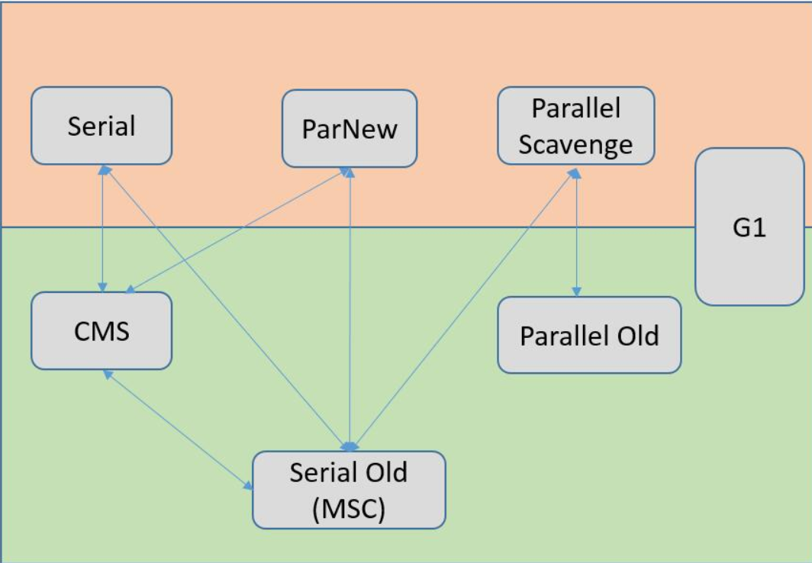
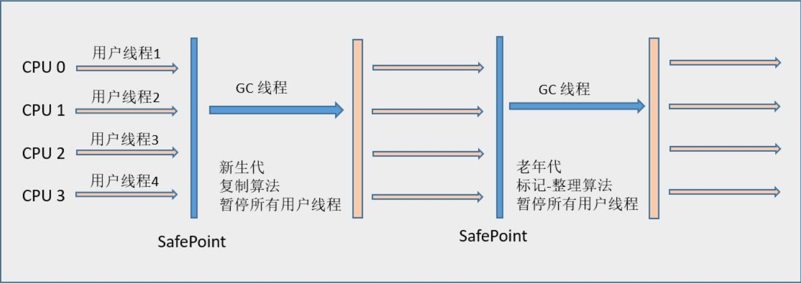
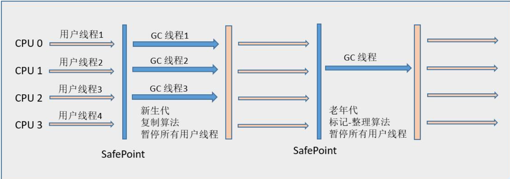
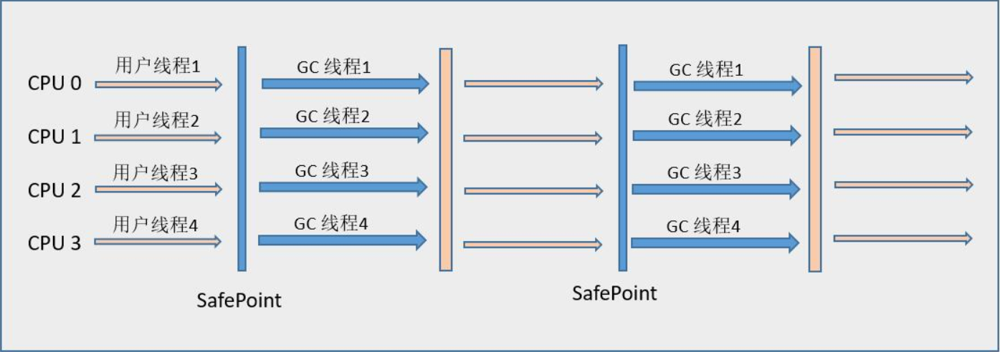
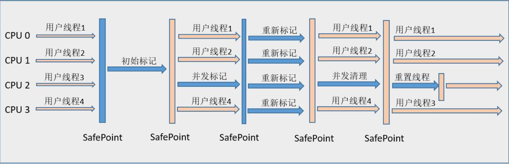

# Java技术体系

* Java技术体系组成

  Java语言、JVM、Class字节码、Java API、各种第三方框架。

* JDK（Java Development Kit）

  Java语言、Jvm、Java API。JDK是用于支持java程序开发的最小环境。

* JRE（Java Runtime Environment）

  Java SE API、JVM。JRE是支持java程序运行的标准环境。

* Java技术体系可分为4个平台，包含的java api内容有大有小：
  * Java Card，运行在小内存设备上；
  * Java ME（Micro Edition），支持移动终端，java api有所精简；
  * Java SE（Standard Edition），支持桌面级应用，含有完整的java核心api；
  * Java EE（Enterprise Edition），对java se api做了大量扩充，扩展api一般以javax.*作为包名。

# 内存模型

* 堆：所有线程共享，存放对象实例。
* 方法区：线程共享，存储被加载的类信息、静态变量、常量、即时编译器编译后的代码等数据。
* 运行时常量池：方法区的一部分，class文件的常量池(字面常量和符号引用)+运行时产生的常量，其中符号引用又包含三类：类、接口的全限定名，字段名称和描述，方法名称和描述。
* 程序计数器：  当前线程执行的字节码的行号指示器。
* 虚拟机栈：每一个方法对应一个栈帧，栈帧 = 局部变量表、操作数栈、动态链接、方法出口信息。栈帧的大小编译时已经确定了。
* 本地方法栈：为Native方法提供的栈。
* 直接内存：不属于jvm管理，但是在nio中，会使用native方法申请堆外内存，并在java堆中保存其引用。

其中，堆和方法区是所有的线程所共享的，而虚拟机栈、本地方法栈和程序计数器是各线程所独享的。

在HotSpot虚拟机实现中，直接将虚拟机栈和本地方法栈合二为一; 而方法区则放入堆中，被称为**永久代**。并且, 方法区和堆都会参与垃圾回收, 具体见下.

# 内存分配

内存分为新生代, 老年代和永久代.

* 一般对象会在新生代分配内存, 少数的大对象, 如长字符串和数组, 会直接分配到老年代.

* 新生代的对象具有存活时间短的特点, 所以Minor GC比较频繁. 每个新生代都有个年龄计数器, 每次Minor GC, 年龄加一, 一定程度后会被移入老年代

* 老年代代表着存活时间长的特点, Major GC频率低, 但至少会伴随依次Minor GC. 

  > Minor GC和Major GC仅仅指不同代的GC而已.

* 堆中的方法区被称为永久代, 但仍会被回收. 主要回收废弃常量和无用类, 其中判断类是否无用的条件如下:

  1. 该类所有实例都被回收
  2. 加载该类的ClassLoader被回收
  3. 对应的Class对象没有在任何地方被引用。

# 对象存活判断

* 引用计数算法

  给对象添加一个引用计数器，有地方引用它就加一，引用失效就减一，为0说明不在使用。缺点是不能解决对象间相互循环引用的问题。

* 可达性分析算法

  通过一些列称为“GC Roots”的对象为起点，向下搜索，搜索走过的路径称为引用链，当一个对象没有到达GC Roots的引用链时，则此对象不可以用。

  > 可作为GC Roots的对象：
  >
  > 1. 虚拟机栈（栈帧中的本地变量表）中引用的对象。
  > 2. 方法区中类静态属性引用的对象。
  > 3. 方法区中常量引用的对象。
  > 4. 本地方法栈中JNI（native方法）引用的对象。

# 垃圾收集算法

* 标记-清除（Mark-Sweep）算法

  先标记需要回收的对象，之后回收。不足：标记和清除效率不高；容易产生内存碎片。

* 复制算法

  将内存分为大小相等的两块，每次使用其中一块。当这一块使用完了，就将活着的对象复制到另一块中，而这一块内存全被回收。这样效率提高了，也不存在内存碎片的问题，但是代价是将内存缩小了一半。

  > 商业虚拟机在**新生代**中使用了该收集算法，但是略有点不同，比如将内存分为了较大的Eden空间和两块较小的Survivor空间，每次使用Eden和其中一块Survivor。回收时，将Eden和Survivor中活着的对象复制到另一块Survivor中。因为新生代中98%的对象是“朝生暮死”的.
  >
  > 因此，一般情况下，一个Survivor可以存放下活着的对象。极端情况下存放不了则进行**分配担保**，也就是借用下老年代的内存。

* 标记-整理（Mark-Compact）算法

  复制收集算法在对象存活率较高时效率低，但浪费一定空间，因而**老年代**一般使用标记-整理算法。该算法先标记对象，回收时将存活对象往一端移动，清理其他对象。该算法不需要额外空间。

* 分代收集算法

  java根据对象存活周期将堆分为新生代和老年代，因此对不同年代可取不同收集算法。

  新生代每次垃圾收集都会有大量对象死去，少量存活，适合使用复制算法; 老年代存活率高、没有额外空间进行分配担保，适合标记-清理或者标记-整理算法。

> 垃圾收集算法都会造成GC停顿，停顿java所有执行线程。停顿时，所有线程需要执行到安全点（SafePoint）或者安全区域（Safe Region）才可停顿。

# 垃圾收集器

下图中Seril、ParNew、Parallel Scavenge用于新生代垃圾收集，CMS、Serial Old、Parallel Old用于老年代垃圾收集，G1同时用于新生代和老年代。收集器之间的连线表示相互之间可以搭配使用。

## Serial收集器

单线程，进行垃圾收集时必须暂停其他所有的工作线程。client模式下的默认新生代收集器。在单cpu，没有线程交互的开销，效率更高。在桌面应用中，新生代的内存不大，停顿时间短，只要不太频繁进行垃圾收集，这点停顿还是可以接受的。

## ParNew收集器

ParNew收集器其实就是Serial收集器的多线程版本，共用了相当多的代码。是Server模式下的首选新生代收集器，与CMS配合工作最合适。该收集器在多cpu环境中效率比较高。

## Parallel Scavenge收集器

该收集器是一个新生代收集器，采用复制算法，也是多线程收集器，和ParNew类似，被称为吞吐量优先收集器。但是Parallel Scavenge的关注点和其他收集器不同，CMS等收集器的关注点是尽可能地缩短垃圾收集器时用户线程的停顿时间，而Parallel Scavenge的目的是达到一个可控制的吞吐量。

> 吞吐量就是CPU用于运行用户代码的时间与CPU总消耗时间的比值，即吞吐量 = 运行用户代码时间 /（运行用户代码时间 + 垃圾收集时间）。虚拟机总共运行了100分钟，其中垃圾收集花掉1分钟，那吞吐量就是99%。

停顿时间越短越适合需要与用户交互的程序，而高吞吐量可以高效率地利用cpu时间。

## Serial Old收集器

Serial Old是Serial收集器老年代的版本，同样是一个单线程收集器，使用标记-整理算法。主要用于Client模式。在Server模式下，可以和Parallel Scavenge搭配使用，还可以作为CMS收集器的后备预案。

## Parallel Old收集器

是Parallel Scavenge收集器的老年代版本，使用多线程和标记-整理算法。jdk1.6后出现的，为了和Parallel Scavenge搭配使用。

## CMS收集器

CMS（Concurrent Mark Sweep）收集器是一种以获取最短回收停顿时间为目标的收集器，基于标记-清楚算法。适合于服务器高响应速度、低系统停顿时间的场合。

cms收集器的运行过程更复杂，整个过程分为4个步骤：初始标记、并发标记、重新标记、并发清除。其中初始标记和重新标记需要短暂停顿，其他过程不需要，因此总的停顿时间比较短。

3个缺点：对cpu资源敏感，cpu数量少时会拖慢用户程序的执行时间；无法处理浮动垃圾，可能出现“Concurrent Mode Failure”失败而导致一次Full GC的产生（使用Serial Old收集垃圾），浮动垃圾是在并发标记过程中产生的；由于使用标记--清除算法实现，会导致大量空间碎片产生。分配大对象时可能会导致触发一次Full GC。

## G1收集器

G1（Garbage-First）是一款面向服务端应用的垃圾收集器。与前几个收集器相比，G1收集器有以下特点：

* 并行与并发（通过多个cpu来缩短停顿的时间）
* 分代收集（仍然保留了分代的概念，但不需要其他收集器配合就能独立管理整个GC堆）
* 空间整合（整体上属于“标记-整理”算法，从局部（两个Region之间）上基于“复制”算法实现的，不会导致空间碎片）
* 可预测的停顿（比CMS更先进的地方在于能让使用者明确指定一个长度为M毫秒的时间片段内，消耗在垃圾收集上的时间不得超过N毫秒）

此外，G1收集器将Java堆划分为多个大小相等的Region（独立区域），新生代与老年代都是一部分Region的集合，G1的收集范围则是这一个个Region（化整为零）。G1只所有能建立可预测的停顿时间模型，是因为它有计划地避免在整个java堆中进行全区域的垃圾收集，这是通过维护一个优先列表实现的（Remembered Set）。

G1的工作过程如下：

* 初始标记（Initial Marking）
* 并发标记（Concurrent Marking）
* 最终标记（Final Marking）
* 筛选回收（Live Data Counting and Evacuation）

# 其他

## 4种引用

* 强引用（Strong Reference）

  类似Object obj=new Object()这类的引用，只要引用存在就不会被GC收回。

* 软引用（Soft Reference）

  描述有用但非必须的对象。对于被关联的对象，在系统将要发生内存溢出异常之前，才会将这些对象回收。使用SoftReference实现软引用。

* 弱引用（Weak Reference）

  描述非必需对象。被关联的对象只能生存到下一次垃圾收集发生之前。使用WeakRefence类来实现。

* 虚引用（Phantom Reference）

  无法使用虚引用来获得对象实例。使用虚引用的唯一目的是在这个对象被收集器回收时收到一个系统通知。使用PhantomReference类实现。

## 对象剖析

* 对象的创建

  1. 当使用new创建普通java对象时，先检查常量池中该类的符号引用，看该类是否被加载、解析和初始化，如果没有则加载该类。

  2. 分配内存，全部初始化为零值。

  3. 执行<init>方法初始化对象。

* 对象的内存布局

  在内存中分为三块:

  * 对象头

    分为两部分。

    * 第一部分存储对象自身的运行时数据，如哈希码（HashCode）、GC分代年龄、锁状态标志、线程持有的锁、偏向线程ID、偏向时间戳等，长度为32bit或64bit，称为Mark Word。因为信息太多，Mark Word存不下，因此对象在不同状态下，Mark Word表示的信息不同。
    * 第二部分是该对象的类型指针，即对象指向它的类元数据（Class对象）的指针，并不是所有虚拟机都在对象数据中保留类型指针（比如如果有句柄的话，就放入句柄中）。

  * 实例数据

    父类继承下来和子类定义的字段信息。

  * 对齐填充

    HotSpot中对象起始地址必须是8字节的整数倍，因此不足的需要对齐填充。

* 对象的访问定位

  java程序需要通过对象引用来操作对象，而通过对象引用访问的方式有两种：使用句柄或直接指针。

  * 句柄

    在堆中分出句柄池，对象引用指向句柄池中的句柄，句柄含有实例数据的指针和类型数据的指针。

  * 直接指针

    对象引用直接存放对象在堆中的地址，这是HotSpot虚拟机使用的方式。

## 类加载器

* [类加载器](https://blog.csdn.net/jdbdh/article/details/82593573)
* [类加载过程](https://blog.csdn.net/jdbdh/article/details/82622473)

## Jvm参数

* `-Xms` 初始堆大小, 如`-Xms256m`
* `-Xmx` 最大堆大小, 如`-Xmx512m`

# 参考

*《深入理解java虚拟机》周志明*