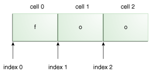

[TOC]

# 一 介绍

正规表达式是一种描述一组字符串的方式，被用于搜索、提取、操作字符串。正规表达式通过**字符**描述匹配的字符，**量词**指明匹配的数量，还可以通过**匹配边界**来定位要匹配的位置，也可**分组**（用于反向引用或者获取**组**所匹配的字符串）。当然，正则表达式不止这点内容。

正则表达式的字面值（String Literals）、字符类（Character Classes）和预定义字符类（Predefined Character Classes）可以用以匹配字符串。量词（Quantifiers）可以指定前面一个**单元**可以匹配多少次字符。边界匹配（Boundary Matchers）找到匹配的位置。

[java.util.regex](https://docs.oracle.com/javase/8/docs/api/java/util/regex/package-summary.html)包中提供了有关正则表达式的操作类Pattern和Matcher。Pattern代表编译后的正则表达式，通过compile函数创建Pattern对象，通过这个对象可以获得Matcher，Matcher是一个解析pattern和执行匹配操作的引擎。当然Pattern和Matcher都有匹配的功能，但是Matcher的功能比较多一点。

# 二 测试程序

来源于oracle官网，但进行了一定的修改，用于找出字符串中被匹配成功的子串，如果没有一个部分被匹配则输出相应结果。
```java
public class App 
{
	public static void main(String[] arg) throws IOException {

        BufferedReader console = new BufferedReader(new InputStreamReader(System.in, "utf-8"));
        while (true) {
        	System.out.print("%nEnter your regex: ");
            Pattern pattern = 
            Pattern.compile(console.readLine());
     
            System.out.print("Enter input string to search: ");
            Matcher matcher = 
            pattern.matcher(console.readLine());
     
            boolean found = false;
            while (matcher.find()) {
                System.out.format("I found the text" +
                    " \"%s\" starting at " +
                    "index %d and ending at index %d.%n",
                    matcher.group(),
                    matcher.start(),
                    matcher.end());
                found = true;
            }
            if(!found){
                System.out.format("No match found.%n");
            }
        }
    }
}
```
# 三 字面值（String Literals）

正则表达式最基础的使用就是使用字面值了，只要相同就匹配成功了。比如表达式foo，可以成功匹配字符串foo。运行程序测试如下：

```plain
Enter your regex: foo
Enter input string to search: foo
I found the text foo starting at index 0 and ending at index 3.
```

位置通过Matcher的start和end方法返回的，start返回0（包含该索引），end返回3（不包含该索引），可以通过下面的图示展示：



## 元字符

正则表达式有一些特殊的字符串有特殊的意义，不会匹配自己。比如`.`（小数点）会匹配任何字符串（默认不包含分解符），但是不会匹配只匹配`.`（小数点）。

其他的元字符有：`<([{\^-=$!|]})?*+.>`  

元字符是正则表达式组成的一部分，如果需要被当做普通字符匹配字符，需要转义：

* 通过反斜杠转义`\`
* 通过放入`\Q`(开始）和`\E`（结束）之间转义

但是转义时需要注意：在编译阶段，编译器会对字符串转义一次，因此字符串中也有特殊字符，然后正则表达式也需要转义一次，因此可能会出现转义两次的情况。

比如想要使用普通的`.`（小数点），需要正则表达式的引擎转义：`\.`，想要得到\.，需要编译器转义`\\.`，因此写代码时要写`\\.`才会匹配字符串中的`.`。

再举个例子，我要匹配普通的`\`，引擎需要转义`\\`，而编译器需要转义`\\\\`，注意到了吗？代码中要写4个`\`！！！下面测试下`.`（小数点）:

```plain
Enter your regex: \.
Enter input string to search: .
I found the text "." starting at index 0 and ending at index 1.
```

为啥不需要写`\\.`呢？因为我是在控制台输入的字符串啦，没有不需要编译器的转义，但是只关心引擎的转义就好了。。

# 四 字符类（Character Classes）

字符类就是一组包含于`[]`中的字符啦，字符类可以匹配一个字符，但是这个字符通常是`[]`中已经规定的。

| Construct       | Description                                              |
| --------------- | -------------------------------------------------------- |
| `[abc]`         | a, b, or c (simple class)                                |
| `[^abc]`        | Any character except a, b, or c (negation)               |
| `[a-zA-Z]`      | a through z, or A through Z, inclusive (range)           |
| `[a-d[m-p]]`    | a through d, or m through p: [a-dm-p] (union)            |
| `[a-z&&[def]]`  | d, e, or f (intersection)                                |
| `[a-z&&[^bc]]`  | a through z, except for b and c: [ad-z] (subtraction)    |
| `[a-z&&[^m-p]]` | a through z, and not m through p: [a-lq-z] (subtraction) |

说明几个特殊的字符类，`[a-d[m-p]]`，就是联合（并集）的意思，与`[a-dm-p]`没什么区别，就是可以取`a`到`d`或者`m`到`p`之前的字符。`[a-z&&[def]]`就是交集的意思，只能取`a`到`z`和`(d、e、f)`中两个集合都有的字符。

# 五 预定义字符类

预定义字符类就是字符类呀，只是用了其他的方式来表示常用的字符类，这样可读性高，且不容易出错~

| Construct | Description                                           |
| --------- | ----------------------------------------------------- |
| `.`       | Any character (may or may not match line terminators) |
| `\d`      | A digit: `[0-9]`                                      |
| `\D`      | A non-digit: `[^0-9]`                                 |
| `\s`      | A whitespace character: `[ \t\n\x0B\f\r]`             |
| `\S`      | A non-whitespace character: `[^\s]`                   |
| `\w`      | A word character: `[a-zA-Z_0-9]`                      |
| `\W`      | A non-word character: `[^\w]`                         |
比如`\w`就是大小写字母、下划线和数字的集合的字符类。可以自己使用测试程序试下，当然，可以进官网看例子。

# 六 量词（Quantifiers）

没有使用量词，上面的字面值、字符类只会匹配一个字符，但是通过量词便可以允许它匹配多次。注意，如果对**组**使用量词修饰，则意思是该组可以匹配多次，而不是前面的单个字符可以匹配多次。

| Greedy   | Reluctant | Possessive | Meaning                                 |
| -------- | --------- | ---------- | --------------------------------------- |
| `X?`     | `X??`     | `X?+`      | X, once or not at all                   |
| `X*`     | `X*?`     | `X*+`      | X, zero or more times                   |
| `X+`     | `X+?`     | `X++`      | X, one or more times                    |
| `X{n}`   | `X{n}?`   | `X{n}+`    | X, exactly n times                      |
| `X{n,}`  | `X{n,}?`  | `X{n,}+`   | X, at least n times                     |
| `X{n,m}` | `X{n,m}?` | `X{n,m}+`  | X, at least n but not more than m times |


你也许会注意到Meaning列中对贪婪、非贪婪、占有量词的解析是一样的，其实差不多但是有一点的区别，三种量词的详细介绍请看我的另一篇博客：[java正规表达式之贪婪、非贪婪、占有量词](https://blog.csdn.net/jdbdh/article/details/82695137)

如果使用对单个字符使用`？`和`*`极有可能会在输入字符串的开始、末尾、字符之间会出现0长度得匹配。请看下面的例子：

```
Enter your regex: a?
Enter input string to search: ababaaaab
I found the text "a" starting at index 0 and ending at index 1.
I found the text "" starting at index 1 and ending at index 1.
I found the text "a" starting at index 2 and ending at index 3.
I found the text "" starting at index 3 and ending at index 3.
I found the text "a" starting at index 4 and ending at index 5.
I found the text "a" starting at index 5 and ending at index 6.
I found the text "a" starting at index 6 and ending at index 7.
I found the text "a" starting at index 7 and ending at index 8.
I found the text "" starting at index 8 and ending at index 8.
I found the text "" starting at index 9 and ending at index 9.

Enter your regex: a*
Enter input string to search: ababaaaab
I found the text "a" starting at index 0 and ending at index 1.
I found the text "" starting at index 1 and ending at index 1.
I found the text "a" starting at index 2 and ending at index 3.
I found the text "" starting at index 3 and ending at index 3.
I found the text "aaaa" starting at index 4 and ending at index 8.
I found the text "" starting at index 8 and ending at index 8.
I found the text "" starting at index 9 and ending at index 9.

Enter your regex: a+
Enter input string to search: ababaaaab
I found the text "a" starting at index 0 and ending at index 1.
I found the text "a" starting at index 2 and ending at index 3.
I found the text "aaaa" starting at index 4 and ending at index 8.
```

能解释这是为什么吗？想要理解匹配过程，需要知道何为贪婪量词，请查阅的另一篇博客。

# 七 捕获组（Capturing Groups）

之前提到，量词可以修饰字面值和字符类，也提到过量词也可以修饰捕获组。捕获组是一种可以将多个字符当作一个单元的方法，这就是为什么量词可以修饰多个字符（也就是一个捕获组）的原因。捕获组使用`()`围住，比如`(dog)`，它可以匹配`dog`，和没有小括号差不多，但是捕获组还有其他独特的作用！！比如反向引用和提取被该组匹配到的字符串。比如表达式`(.)og`匹配`dog`，通过`Matcher`的方法可以提取到`d`。

## 编号

正则表达式可以有多个捕获组，每个捕获组有其自己的编号，而编号的规则是该组的左括号是从左往右数是第几个，那他的编号就是几。比如`((A)(B(C)))`有四个组：

1. `((A)(B(C)))`
2. `(A)`
3. `(B(C))`
4. `(C)`

通过调用`Matcher`的`groupCount`可以得到组的个数，在这个例子中为4。当然有一个特殊的组，编号为0，该组就是**整个**字符串，但是它却不算在组的总数之内。还有一些特殊的组，比如非捕获组、命名组等等复杂的内容，正则表达式内容太多了，最后会给出查找完整手册的链接。

编号有啥用？通过`Matcher`的`Group（int group）`和编号可以获得上一次匹配中被该组捕获的字符串啦。

## 反向引用

反向引用就是说可以通过反向引用复用之前的组的表达式。比如`(\d\d)\1`，等同于`(\d\d)(\d\d)`，但是还是有点区别，就是反向引用不会增加组。下面测试一下：

```plain
Enter your regex: (\d\d)\1
Enter input string to search: 1212
I found the text "1212" starting at index 0 and ending at index 4.
```

> VSCode中使用`$num`来引用.

#  八 边界匹配（Boundary Matchers）

不止要匹配字符，有时还需要匹配边界。比如表达式为`dog`,可以从字符串`my dog is  linda`匹配到`dog`，也可以从`aadogbb`中匹配到`dog`，但是我只想匹配`dog`这个单词呢？或者我想匹配一整行呢？下面给出边界匹配完成的表格：

| Boundary Construct | Description                                                  |
| ------------------ | ------------------------------------------------------------ |
| `^`                | The beginning of a line.比如：“ abc\r\ndef ”   ，“ ^ ”匹配 “\n”到“d”之间的位置 |
| `$`                | The end of a line 。比如：“ abc\r\ndef ”   ，“ $ ”匹配 “c”到“\r”之间的位置 |
| `\b`               | A word boundary                                              |
| `\B`               | A non-word boundary                                          |
| `\A`               | The beginning of the input                                   |
| `\G`               | The end of the previous match                                |
| `\Z`               | The end of the input but for the final terminator, if any    |
| `\z`               | The end of the input                                         |

`^`默认匹配输入字符串的开始（而不是行的开始），`$`默认匹配输入字符串的结束（而不是行的结束）。`\b`匹配单词的开始或结束。

**也许你会发现我的描述和表格中的不一致**，，是的，表格不可轻信，毕竟我是直接从官网拷贝的。上面的默认行为是可以通过设置匹配模式修改的，稍后介绍。

下面是一些测试结果：

```plain
Enter your regex: ^dog$
Enter input string to search: dog
I found the text "dog" starting at index 0 and ending at index 3.

Enter your regex: ^dog$
Enter input string to search:       dog
No match found.

Enter your regex: \s*dog$
Enter input string to search:             dog
I found the text "            dog" starting at index 0 and ending at index 15.

Enter your regex: ^dog\w*
Enter input string to search: dogblahblah
I found the text "dogblahblah" starting at index 0 and ending at index 11.
```

# 九 Pattern

`Pattern`代表编译过的正则表达式，可以通过`compile`方法产生实例，也可以直接使用静态方法`matches`对整个字符串匹配。创建`Pattern`可以设置一些标志，控制正则表达式的匹配行为。下面介绍两种方法：

## 创建Pattern时设置标志

在通过静态方法`compile`创建`Pattern`时传入`flag`标志。下面介绍一些标志，其他的可以自己查看文档。

* `Pattern.CASE_INSENSITIVE`使能大小写不敏感模式。默认大小写不敏感只对ascii码0到127的字符有效，unicode的其他部分需要配合`Pattern.UNICODE_CASE`使用
* `Pattern.DOTALL`使能`dotall`模型，在这个模式中，`.`（小数点）可以匹配任意字符，包括行结束符。默认下时不包含行结束符的。
* `Pattern.LITERAL`这个模式下，正则表达式被当作字面值，特殊符号啊，全失去了特殊意义。
* `Pattern.MULTILINE`使能多行模式，在这个模式中，`^`和`$`分别可以匹配行的开始和结束（不只是输入字符串的开始和结束）。
* Pattern.UNIX_LINES Enables UNIX lines mode. In this mode, only the '\n' line terminator is recognized in the behavior of ., ^, and $. UNIX lines mode can also be enabled via the embedded flag expression (?d).

还有一些自己翻阅资料。多个标志可以通过按位或组合在一起：

```java
pattern = Pattern.compile("[az]$", Pattern.MULTILINE | Pattern.UNIX_LINES);
```

## 嵌入到正则表达式中

也可以嵌入到正则表达式中，下面是一张对应表：

| Constant                 | Equivalent Embedded Flag Expression |
| ------------------------ | ----------------------------------- |
| Pattern.CANON_EQ         | None                                |
| Pattern.CASE_INSENSITIVE | (?i)                                |
| Pattern.COMMENTS         | (?x)                                |
| Pattern.MULTILINE        | (?m)                                |
| Pattern.DOTALL           | (?s)                                |
| Pattern.LITERAL          | None                                |
| Pattern.UNICODE_CASE     | (?u)                                |
|Pattern.UNIX_LINES|(?d)|下面是一个使用例子，以大小写无关的模式匹配：

```
Enter your regex: (?i)foo
Enter input string to search: FOOfooFoOfoO
I found the text "FOO" starting at index 0 and ending at index 3.
I found the text "foo" starting at index 3 and ending at index 6.
I found the text "FoO" starting at index 6 and ending at index 9.
I found the text "foO" starting at index 9 and ending at index 12.
```

## stackoverflow中的一个例子

了解到了就可以来看一下stackoverflow中的一个具体的例子：

原始数据：

```
auser1 home1b
auser2 home2b
auser3 home3b
```

怎么匹配其中一行？

使用`^.*&`只会匹配到整个字符串，因此`^`和`$`不会匹配到行开始或行结束。但是在多行模式下却可以，因此表达式改为：`(?m)^.*$`

## Pattern的一些函数

* `matches(String,CharSequence)`
  `Pattern`的静态方法，直接传入表达式和字符串进行匹配，如果表达式匹配**整个**字符串，则成功。

* `split(String)`
  将表达式匹配到的子字符串作为分隔符，将输入字符分割出来。

## String中类似的方法

```java
public boolean matches(String regex)

public String[] split(String regex, int limit)

public String[] split(String regex)

public String replace(CharSequence target,CharSequence replacement)
```

# 十 Matcher

之前说了，`Matcher`代表引擎，可以提供更多的方法，比如可以找到匹配到的子串的开始、结束位置和字符串`(group)`；通过`reset()`重置标志，重新开始匹配，也可以通过`reset(CharSequence)`直接更换输入字符串！内容太多，下面直接从官网抄写。。

## Index Methods

Index methods provide useful index values that show precisely where the match was found in the input string:

* `public int start()`: Returns the start index of the previous match.
* `public int start(int group)`: Returns the start index of the subsequence captured by the given group during the previous match operation.
* `public int end()`: Returns the offset after the last character matched.
* `public int end(int group)`: Returns the offset after the last character of the subsequence captured by the given group during the previous match operation.

## Study Methods

Study methods review the input string and return a boolean indicating whether or not the pattern is found.

* `public boolean lookingAt()`: Attempts to match the input sequence, starting at the beginning of the region, against the pattern.
* `public boolean find()`: Attempts to find the next subsequence of the input sequence that matches the pattern.
* `public boolean find(int start)`: Resets this matcher and then attempts to find the next subsequence of the input sequence that matches the pattern, starting at the specified index.
* `public boolean matches()`: Attempts to match the entire region against the pattern.

## Replacement Methods

Replacement methods are useful methods for replacing text in an input string.

* `public Matcher appendReplacement(StringBuffer sb, String replacement)`: Implements a non-terminal append-and-replace step.
* `public StringBuffer appendTail(StringBuffer sb)`: Implements a terminal append-and-replace step.
* `public String replaceAll(String replacement)`: Replaces every subsequence of the input sequence that matches the pattern with the given replacement string.
* `public String replaceFirst(String replacement)`: Replaces the first subsequence of the input sequence that matches the pattern with the given replacement string.
* `public static String quoteReplacement(String s)`: Returns a literal replacement String for the specified String. This method produces a String that will work as a literal replacement s in the appendReplacement method of the Matcher class. The String produced will match the sequence of characters in s treated as a literal sequence. Slashes ('\') and dollar signs ('$') will be given no special meaning.

## String中类似的方法

* `public String replaceFirst(String regex, String replacement)`: Replaces the first substring of this string that matches the given regular expression with the given replacement. An invocation of this method of the form str.replaceFirst(regex, repl) yields exactly the same result as the expression Pattern.compile(regex).matcher(str).replaceFirst(repl)
* `public String replaceAll(String regex, String replacement)`: Replaces each substring of this string that matches the given regular expression with the given replacement. An invocation of this method of the form str.replaceAll(regex, repl) yields exactly the same result as the expression Pattern.compile(regex).matcher(str).replaceAll(repl)

# 十一 示例

在以后的学习过程中，如果遇到有意思的正则表达式，我便会记录于此。

## 匹配空行

匹配空行，必须先理解行匹配的`^`和`$`，可以参考第八小节。现在需要匹配空行，比如如下图示中的圆圈的空行：


清楚上图空行是我们的目标，但是现在先研究一下`^`和`$`与字符串`abc\r\n\r\ndef`的关系，该字符串含有空行。


所以正则表达式为：`^[\r\n]+^` 。为什么不是`^\r\n^`  ?因为不同系统使用的换行符不一致~请参考零碎知识的第5点。

然后我在notepad++上使用该正则表达式，将空行全部替换。


成功~~

# 十二 量词之贪婪/非贪婪/占有量词

## 测试程序

文章中在测试时使用了自定义的程序来测试正规表达式，在此，我将它改写成可以运行与eclipse上：

```java
public class App 
{
	public static void main(String[] arg) throws IOException {

        BufferedReader console = new BufferedReader(new InputStreamReader(System.in, "utf-8"));
        while (true) {
        	System.out.print("%nEnter your regex: ");
            Pattern pattern = 
            Pattern.compile(console.readLine());
     
            System.out.print("Enter input string to search: ");
            Matcher matcher = 
            pattern.matcher(console.readLine());
     
            boolean found = false;
            while (matcher.find()) {
                System.out.format("I found the text" +
                    " \"%s\" starting at " +
                    "index %d and ending at index %d.%n",
                    matcher.group(),
                    matcher.start(),
                    matcher.end());
                found = true;
            }
            if(!found){
                System.out.format("No match found.%n");
            }
        }
    }
}
```

官方中的定义

> Greedy quantifiers are considered "greedy" because they force the matcher to read in, or eat, the entire input string prior to attempting the first match. If the first match attempt (the entire input string) fails, the matcher backs off the input string by one character and tries again, repeating the process until a match is found or there are no more characters left to back off from. Depending on the quantifier used in the expression, the last thing it will try matching against is 1 or 0 characters.
>
> The reluctant quantifiers, however, take the opposite approach: They start at the beginning of the input string, then reluctantly eat one character at a time looking for a match. The last thing they try is the entire input string.
>
> Finally, the possessive quantifiers always eat the entire input string, trying once (and only once) for a match. Unlike the greedy quantifiers, possessive quantifiers never back off, even if doing so would allow the overall match to succeed.

## 贪婪量词

简而言之就是，**贪婪量词会尽可能多的匹配字符**。如果正规表达式中有贪婪量词，在贪婪量词匹配字符串时，贪婪量词会匹配全部可以匹配的字符串，如果整个正规表达式匹配成功则结束，如果不成功则贪婪量词**回退**一个字符，再次看整个正则表达式是否匹配成功，如此反复。下面运行上述程序并输入如下字符串：

```plain
Enter your regex: .*foo  // greedy quantifier
Enter input string to search: xfooxxxxxxfoo
I found the text "xfooxxxxxxfoo" starting at index 0 and ending at index 13.
```

这里使用了贪婪量词，现在详细介绍过程：由于`.*`是贪婪的，因此会尝试尽可能多的匹配所有符合的字符，也就是匹配了`xfooxxxxxxfoo`。但是后面的`foo`不能匹配，因为没有了剩余的字符。因此`.*`需要回退一个字符，于是`.*`匹配了`xfooxxxxxxfo`，剩余一个`o`，`foo`不能匹配。再次回退，剩余`oo`，不能匹配，回退，剩余`foo`，匹配成功，整个正规表达式匹配成功。

下面的通过图示表达这个过程：


## 非贪婪量词

**非贪婪量词会尽可能少的匹配字符**。如果一个正规表达式中含有非贪婪量词，在非贪婪量词匹配时，会尽可能少的匹配字符，如果整个正则表达式匹配失败，则非贪婪量词会**多匹配一个**，再次看整个正则表达式是否匹配成功，如此反复。下面运行程序输入如下字符串：

```plain
Enter your regex: .*?foo  // reluctant quantifier
Enter input string to search: xfooxxxxxxfoo
I found the text "xfoo" starting at index 0 and ending at index 4.
I found the text "xxxxxxfoo" starting at index 4 and ending at index 13.
```

其过程是：由于`.*?`是非贪婪的，因此`.*?`会尽可能少的匹配，因此先匹配0个字符，但是整个正则表达式匹配失败。因此非贪婪量词多匹配一个，匹配了`x`，`foo`正好匹配了字符串`foo`，因此匹配成功。因为程序会持续匹配剩余的字符串，因此会开始第二次匹配。

下面是图示展示：

首先匹配到`xfoo`


开启第二次匹配，去掉已匹配的，匹配到`xxxxxxfoo`的过程：


## 占有量词

**占有量词就像贪婪量词一样，但是没有回退的过程，因此一旦匹配失败就结束了**。运行上述程序输入以下字符串：

```
Enter your regex: .*+foo // possessive quantifier
Enter input string to search: xfooxxxxxxfoo
No match found.
```

`*+`是占有量词，但是也会像贪婪量词一样先尽可能多的匹配字符串，因此`.*+`匹配了整个字符串`xfooxxxxxxfoo`，但是没有剩余字符串被`foo`匹配了，因此匹配失败，由于占有量词没有回退过程，因此匹配以失败直接结束。

太简单了，没有图示演示过程。。

## 参考

- https://docs.oracle.com/javase/tutorial/essential/regex/quant.html
- https://stackoverflow.com/questions/5319840/greedy-vs-reluctant-vs-possessive-quantifiers
- https://www.regular-expressions.info/refrepeat.html
- 在甲骨文官网上介绍了量词及贪婪、非贪婪、占有量词之间的区别：https://docs.oracle.com/javase/tutorial/essential/regex/quant.html

 # 其他(补充)

## 操作符优先级

`()` > Closure > Concatenation > Alternation

至于名词意思, 见`fundamental/Compile` 2.4小节

# 参考

* 通俗易懂，可以先读这个：http://tutorials.jenkov.com/java-regex/matcher.html#reset-method

* 结构清晰，完整：https://docs.oracle.com/javase/tutorial/essential/regex/index.html

* 万能手册，可以查询任何语法成分：https://www.regular-expressions.info/reference.html

* 关于贪婪、非贪婪、占有量词的区别：https://blog.csdn.net/jdbdh/article/details/82695137

* 文章用用到的一个例子：https://stackoverflow.com/questions/6143304/how-to-use-java-regex-to-match-a-line