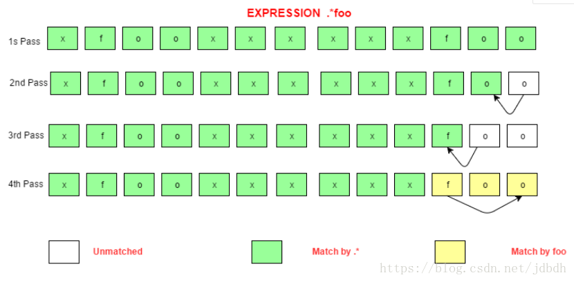
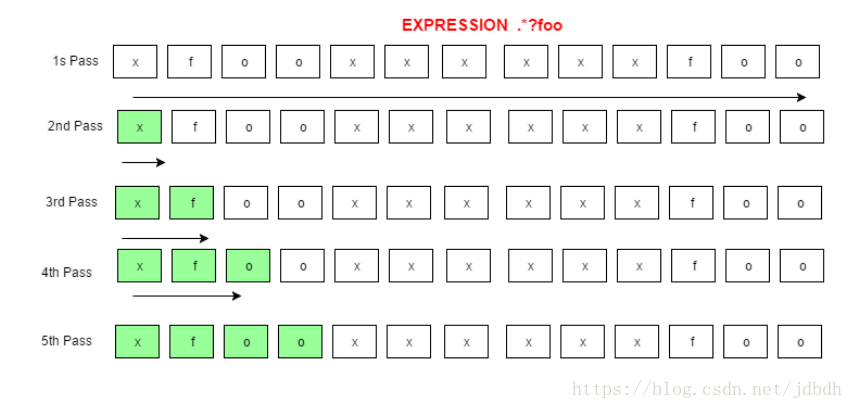
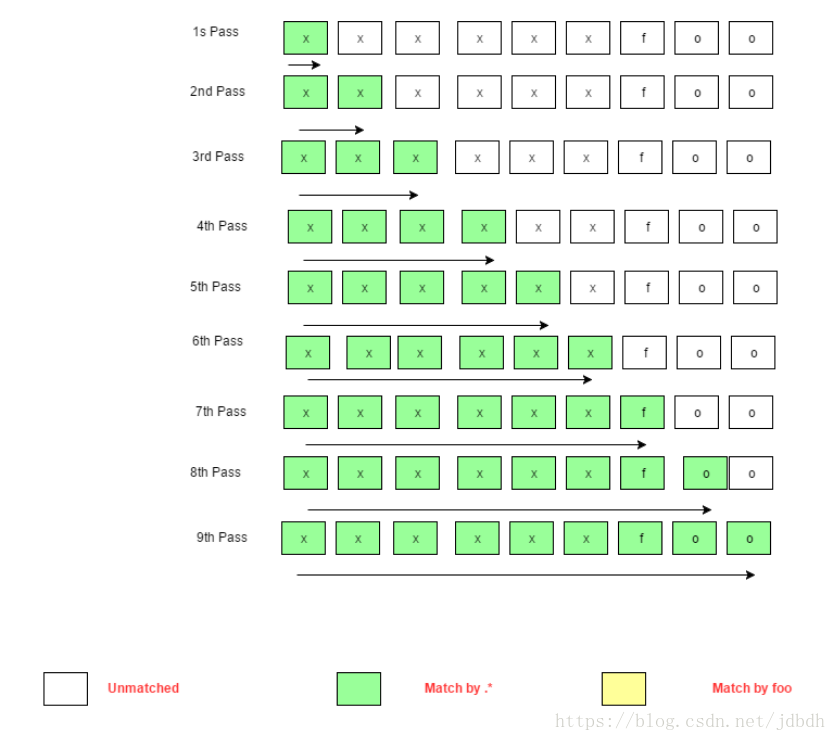

# 测试程序
文章中在测试时使用了自定义的程序来测试正规表达式，在此，我将它改写成可以运行与eclipse上：
```java
public class App 
{
	public static void main(String[] arg) throws IOException {

        BufferedReader console = new BufferedReader(new InputStreamReader(System.in, "utf-8"));
        while (true) {
        	System.out.print("%nEnter your regex: ");
            Pattern pattern = 
            Pattern.compile(console.readLine());
     
            System.out.print("Enter input string to search: ");
            Matcher matcher = 
            pattern.matcher(console.readLine());
     
            boolean found = false;
            while (matcher.find()) {
                System.out.format("I found the text" +
                    " \"%s\" starting at " +
                    "index %d and ending at index %d.%n",
                    matcher.group(),
                    matcher.start(),
                    matcher.end());
                found = true;
            }
            if(!found){
                System.out.format("No match found.%n");
            }
        }
    }
}
```
官方中的定义

> Greedy quantifiers are considered "greedy" because they force the matcher to read in, or eat, the entire input string prior to attempting the first match. If the first match attempt (the entire input string) fails, the matcher backs off the input string by one character and tries again, repeating the process until a match is found or there are no more characters left to back off from. Depending on the quantifier used in the expression, the last thing it will try matching against is 1 or 0 characters.
>
> The reluctant quantifiers, however, take the opposite approach: They start at the beginning of the input string, then reluctantly eat one character at a time looking for a match. The last thing they try is the entire input string.
>
> Finally, the possessive quantifiers always eat the entire input string, trying once (and only once) for a match. Unlike the greedy quantifiers, possessive quantifiers never back off, even if doing so would allow the overall match to succeed.

# 贪婪量词

简而言之就是，**贪婪量词会尽可能多的匹配字符**。如果正规表达式中有贪婪量词，在贪婪量词匹配字符串时，贪婪量词会匹配全部可以匹配的字符串，如果整个正规表达式匹配成功则结束，如果不成功则贪婪量词**回退**一个字符，再次看整个正则表达式是否匹配成功，如此反复。下面运行上述程序并输入如下字符串：

```plain
Enter your regex: .*foo  // greedy quantifier
Enter input string to search: xfooxxxxxxfoo
I found the text "xfooxxxxxxfoo" starting at index 0 and ending at index 13.
```


这里使用了贪婪量词，现在详细介绍过程：由于`.*`是贪婪的，因此会尝试尽可能多的匹配所有符合的字符，也就是匹配了`xfooxxxxxxfoo`。但是后面的`foo`不能匹配，因为没有了剩余的字符。因此`.*`需要回退一个字符，于是`.*`匹配了`xfooxxxxxxfo`，剩余一个`o`，`foo`不能匹配。再次回退，剩余`oo`，不能匹配，回退，剩余`foo`，匹配成功，整个正规表达式匹配成功。

下面的通过图示表达这个过程：



# 非贪婪量词

**非贪婪量词会尽可能少的匹配字符**。如果一个正规表达式中含有非贪婪量词，在非贪婪量词匹配时，会尽可能少的匹配字符，如果整个正则表达式匹配失败，则非贪婪量词会**多匹配一个**，再次看整个正则表达式是否匹配成功，如此反复。下面运行程序输入如下字符串：

```plain
Enter your regex: .*?foo  // reluctant quantifier
Enter input string to search: xfooxxxxxxfoo
I found the text "xfoo" starting at index 0 and ending at index 4.
I found the text "xxxxxxfoo" starting at index 4 and ending at index 13.
```


其过程是：由于`.*?`是非贪婪的，因此`.*?`会尽可能少的匹配，因此先匹配0个字符，但是整个正则表达式匹配失败。因此非贪婪量词多匹配一个，匹配了`x`，`foo`正好匹配了字符串`foo`，因此匹配成功。因为程序会持续匹配剩余的字符串，因此会开始第二次匹配。

下面是图示展示：

首先匹配到`xfoo`



开启第二次匹配，去掉已匹配的，匹配到`xxxxxxfoo`的过程：



# 占有量词

**占有量词就像贪婪量词一样，但是没有回退的过程，因此一旦匹配失败就结束了**。运行上述程序输入以下字符串：

```
Enter your regex: .*+foo // possessive quantifier
Enter input string to search: xfooxxxxxxfoo
No match found.
```

`*+`是占有量词，但是也会像贪婪量词一样先尽可能多的匹配字符串，因此`.*+`匹配了整个字符串`xfooxxxxxxfoo`，但是没有剩余字符串被`foo`匹配了，因此匹配失败，由于占有量词没有回退过程，因此匹配以失败直接结束。

太简单了，没有图示演示过程。。

 

# 参考

* https://docs.oracle.com/javase/tutorial/essential/regex/quant.html

* https://stackoverflow.com/questions/5319840/greedy-vs-reluctant-vs-possessive-quantifiers

* https://www.regular-expressions.info/refrepeat.html

* 在甲骨文官网上介绍了量词及贪婪、非贪婪、占有量词之间的区别：https://docs.oracle.com/javase/tutorial/essential/regex/quant.html

 
