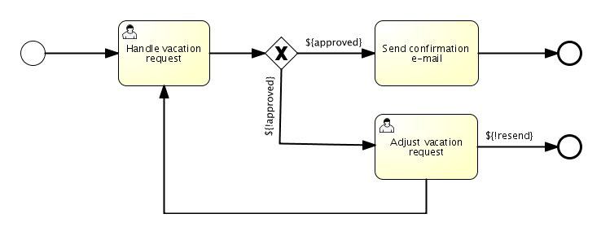

# 引言

* 版本

  * 这里侧重5.22.0版本的Activiti

* 文档

  * [Javadoc](https://www.activiti.org/javadocs/)
  * [详细使用手册](https://www.activiti.org/5.x/userguide/)

* BPMN 2.0规范

  流程的规范

  

  * 事件Event

    触发流程状态改变的事件, 如发起流程触发*开始事件*, 导致流程实例被创建

  * 活动Activity

    流程中的活动, 如流程中每个节点要做的事.

  * 网关Gateway

    流程走向, 下一节点的选取

  * 流向Flow

    两个流程节点的连线

# 基础

* API关系图


* API入口类(`ProcessEngine`)
  * `ProcessEngine`是使用Activiti的入口类
  * 线程安全
* 配置类(`ProcessEngineConfiguration`)
  * 构建`ProcessEngineConfiguration`对象, 初始化各种配置, 如数据源
  * 通过该`Configuration`对象可获取到`ProcessEngine`
  * 默认配置来自于classpath下的`activiti.cfg.xml`文件
* 服务类(`XXXService`)
  * activiti提供的各种服务
  * 通过`ProcessEngine`获取

* 例子

  ```java
  //获取入口类, 使用默认配置.
  //单例模式, 第一次获取初始化, 之后都获取同一个对象.
  ProcessEngine processEngine = ProcessEngines.getDefaultProcessEngine();
  //获取各种服务
  RuntimeService runtimeService = processEngine.getRuntimeService();
  RepositoryService repositoryService = processEngine.getRepositoryService();
  TaskService taskService = processEngine.getTaskService();
  ManagementService managementService = processEngine.getManagementService();
  IdentityService identityService = processEngine.getIdentityService();
  HistoryService historyService = processEngine.getHistoryService();
  FormService formService = processEngine.getFormService();
  ```

# 数据库

* 表命名解释

  The database names of Activiti all start with **ACT_**.  The second part is a two-character identification of the use case of the table. This use case will also roughly match the service API.

  * **ACT_RE_***: *RE* stands for `repository`. Tables with this prefix contain *static* information such as process definitions and process resources (images, rules, etc.).
  * **ACT_RU_***: *RU* stands for `runtime`. These are the runtime tables that contain the runtime data of process  instances, user tasks, variables, jobs, etc. Activiti only stores the  runtime data during process instance execution, and removes the records  when a process instance ends. This keeps the runtime tables small and  fast.
  * **ACT_ID_***: *ID* stands for `identity`. These tables contain identity information, such as users, groups, etc.
  * **ACT_HI_***: *HI* stands for `history`. These are the tables that contain historic data, such as past process instances, variables, tasks, etc.
  * **ACT_GE_***: `general` data, which is used in various use cases.

> 有些类型的表是可选的, 可不存在, 如`ACT_ID_*`, `ACT_HI_*`

# API

## 服务详解

* `RepositoryService`

  流程定义及部署包的管理

  * `process definitions`
  * `deployments` 表示要部署的内容, 如流程设计文件(xml)...

* `RuntimeService`

  流程实例的管理

* `TaskService`

  任务的管理, 如流程中每个节点要做的事都是一个任务. 通常, 任务是需要分配给人来处理的.

* `IdentityService`

  用于管理用户和组. 注意, activiti运行时不对用户做任何检查, 任务可被分配给任何人.

* `FormService`

  提供表单管理服务

* `HistoryService`

  流程运行期间, 产生了很多数据, 如流程开始时间, 谁处理任务, 任务处理用了多久, `HistoryService`提供查询这些数据的能力

  > `RuntimeService` vs. `HistoryService`
  >
  > 都和运行时的流程实例有关, 那两者有何区别呢? `HistoryService`查询流程实例运行后留下的数据, `RuntimeService`可操纵流程运行状态.

* `ManagementService`

  用于获取数据库, 表信息, 与提供管理jobs的功能.

## 异常类型

检查型异常

- `ActivitiWrongDbException`: Thrown when the Activiti engine discovers a mismatch between the database schema version and the engine version.
- `ActivitiOptimisticLockingException`: Thrown when an optimistic locking occurs in the data store caused by concurrent access of the same data entry.
- `ActivitiClassLoadingException`: Thrown when a class  requested to load was not found or when an error occurred while loading  it (e.g. JavaDelegates, TaskListeners, …).
- `ActivitiObjectNotFoundException`: Thrown when an object that is requested or action on does not exist.
- `ActivitiIllegalArgumentException`: An exception  indicating that an illegal argument has been supplied in an Activiti  API-call, an illegal value was configured in the engine’s configuration  or an illegal value has been supplied or an illegal value is used in a  process-definition.
- `ActivitiTaskAlreadyClaimedException`: Thrown when a task is already claimed, when the `taskService.claim(…)` is called.

运行时异常

* `ActivitiExceptions`

  除了上述情况, 都抛该异常.

## 流程操作

### 准备流程设计文件

流程图如下所示



为上述的流程图准备对应的BPMN 2.0描述文件.

```xml
<?xml version="1.0" encoding="UTF-8" ?>
<definitions id="definitions"
             targetNamespace="http://activiti.org/bpmn20"
             xmlns="http://www.omg.org/spec/BPMN/20100524/MODEL"
             xmlns:xsi="http://www.w3.org/2001/XMLSchema-instance"
             xmlns:activiti="http://activiti.org/bpmn">

  <process id="vacationRequest" name="Vacation request">

    <startEvent id="request" activiti:initiator="employeeName">
      <extensionElements>
        <activiti:formProperty id="numberOfDays" name="Number of days" type="long" value="1" required="true"/>
        <activiti:formProperty id="startDate" name="First day of holiday (dd-MM-yyy)" datePattern="dd-MM-yyyy hh:mm" type="date" required="true" />
        <activiti:formProperty id="vacationMotivation" name="Motivation" type="string" />
      </extensionElements>
    </startEvent>
    <sequenceFlow id="flow1" sourceRef="request" targetRef="handleRequest" />

    <userTask id="handleRequest" name="Handle vacation request" >
      <documentation>
        ${employeeName} would like to take ${numberOfDays} day(s) of vacation (Motivation: ${vacationMotivation}).
      </documentation>
      <extensionElements>
         <activiti:formProperty id="vacationApproved" name="Do you approve this vacation" type="enum" required="true">
          <activiti:value id="true" name="Approve" />
          <activiti:value id="false" name="Reject" />
        </activiti:formProperty>
        <activiti:formProperty id="managerMotivation" name="Motivation" type="string" />
      </extensionElements>
      <potentialOwner>
        <resourceAssignmentExpression>
          <formalExpression>management</formalExpression>
        </resourceAssignmentExpression>
      </potentialOwner>
    </userTask>
    <sequenceFlow id="flow2" sourceRef="handleRequest" targetRef="requestApprovedDecision" />

    <exclusiveGateway id="requestApprovedDecision" name="Request approved?" />
    <sequenceFlow id="flow3" sourceRef="requestApprovedDecision" targetRef="sendApprovalMail">
      <conditionExpression xsi:type="tFormalExpression">${vacationApproved == 'true'}</conditionExpression>
    </sequenceFlow>

    <task id="sendApprovalMail" name="Send confirmation e-mail" />
    <sequenceFlow id="flow4" sourceRef="sendApprovalMail" targetRef="theEnd1" />
    <endEvent id="theEnd1" />

    <sequenceFlow id="flow5" sourceRef="requestApprovedDecision" targetRef="adjustVacationRequestTask">
      <conditionExpression xsi:type="tFormalExpression">${vacationApproved == 'false'}</conditionExpression>
    </sequenceFlow>

    <userTask id="adjustVacationRequestTask" name="Adjust vacation request">
      <documentation>
        Your manager has disapproved your vacation request for ${numberOfDays} days.
        Reason: ${managerMotivation}
      </documentation>
      <extensionElements>
        <activiti:formProperty id="numberOfDays" name="Number of days" value="${numberOfDays}" type="long" required="true"/>
        <activiti:formProperty id="startDate" name="First day of holiday (dd-MM-yyy)" value="${startDate}" datePattern="dd-MM-yyyy hh:mm" type="date" required="true" />
        <activiti:formProperty id="vacationMotivation" name="Motivation" value="${vacationMotivation}" type="string" />
        <activiti:formProperty id="resendRequest" name="Resend vacation request to manager?" type="enum" required="true">
          <activiti:value id="true" name="Yes" />
          <activiti:value id="false" name="No" />
        </activiti:formProperty>
      </extensionElements>
      <humanPerformer>
        <resourceAssignmentExpression>
          <formalExpression>${employeeName}</formalExpression>
        </resourceAssignmentExpression>
      </humanPerformer>
    </userTask>
    <sequenceFlow id="flow6" sourceRef="adjustVacationRequestTask" targetRef="resendRequestDecision" />

    <exclusiveGateway id="resendRequestDecision" name="Resend request?" />
    <sequenceFlow id="flow7" sourceRef="resendRequestDecision" targetRef="handleRequest">
      <conditionExpression xsi:type="tFormalExpression">${resendRequest == 'true'}</conditionExpression>
    </sequenceFlow>

     <sequenceFlow id="flow8" sourceRef="resendRequestDecision" targetRef="theEnd2">
      <conditionExpression xsi:type="tFormalExpression">${resendRequest == 'false'}</conditionExpression>
    </sequenceFlow>
    <endEvent id="theEnd2" />

  </process>

</definitions>
```

内容很多,,, 但我们肯定不会手写XML, activiti提供了图形化编辑流程图的工具, 自动生成XML. 也可通过其他工具设计流程图, 只要生成的XML文件符合BMPN 2.0规范即可.

### 部署流程图

```java
ProcessEngine processEngine = ProcessEngines.getDefaultProcessEngine();
RepositoryService repositoryService = processEngine.getRepositoryService();
repositoryService.createDeployment()
  .addClasspathResource("org/activiti/test/VacationRequest.bpmn20.xml")//流程描述文件
  .deploy();//部署

Log.info("Number of process definitions: " + repositoryService.createProcessDefinitionQuery().count());//查询下当前流程定义个数
```

### 启动流程实例

启动流程实例时, 可以传入流程变量

```java
//准备流程变量
Map<String, Object> variables = new HashMap<String, Object>();
variables.put("employeeName", "Kermit");
variables.put("numberOfDays", new Integer(4));
variables.put("vacationMotivation", "I'm really tired!");
//启动流程实例
RuntimeService runtimeService = processEngine.getRuntimeService();
ProcessInstance processInstance = runtimeService.startProcessInstanceByKey("vacationRequest", variables);

// Verify that we started a new process instance
Log.info("Number of process instances: " + runtimeService.createProcessInstanceQuery().count());
```

### 查看流程任务

流程实例启动后, 流程会到达任务节点, 接下来查看下所有要处理的任务节点

```java
// Fetch all tasks for the management group
TaskService taskService = processEngine.getTaskService();
List<Task> tasks = taskService.createTaskQuery().taskCandidateGroup("management").list();
for (Task task : tasks) {
  Log.info("Task available: " + task.getName());
}
```

### 完成任务

```java
Task task = tasks.get(0);

Map<String, Object> taskVariables = new HashMap<String, Object>();
taskVariables.put("vacationApproved", "false");
taskVariables.put("managerMotivation", "We have a tight deadline!");
taskService.complete(task.getId(), taskVariables);
```

也可设置流程变量, 不知道会不会覆盖之前设置的变量.

### 终止和激活

可以终止和激活流程定义/流程实例.

* 终止流程定义, 新实例将不被创建(跑异常)
* 终止流程实例, 流程不能继续, jobs不必支持. 强制完成任务将抛出异常.

---

流程定义操作

* 终止

  `RuntimeService.suspendProcessDefinitionByKey`

* 激活

  `repositoryService.activateProcessDefinitionXXX`

流程实例操作

* 终止

  `runtimeService.suspendProcessInstance`

* 激活

  `runtimeService.activateProcessInstanceXXX`

## 未完待续

# 参考

* [Javadoc](https://www.activiti.org/javadocs/)
* [详细使用手册](https://www.activiti.org/5.x/userguide/)


