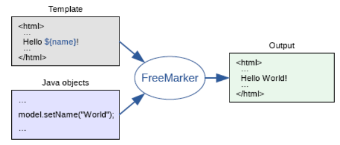

> 转载至: [FreeMarker](http://luyingjie.cn/blog?id=14) 作者: 是你啊小米

# 介绍

FreeMarker是一款模板引擎,即一种基于模板和要改变的数据， 并用来生成输出文本(HTML网页,源代码等)的通用工具,它是由Java语言编写的

> [FreeMarker的参考文档](http://freemarker.foofun.cn/index.html)

模板编写为FreeMarker Template Language (FTL)

主要的逻辑如图所示:



# 快速入门

> 以springboot项目为例:

在pom文件中引入依赖:

```xml
<dependency>
    <groupId>org.springframework.boot</groupId>
    <artifactId>spring-boot-starter-freemarker</artifactId>
</dependency>
```

在配置文件中配置相关的信息:

```properties
spring.freemarker.cache=true
spring.freemarker.charset=utf-8
spring.freemarker.content-type=text/html
spring.freemarker.suffix=.ftl
spring.freemarker.template-loader-path=classpath:templates
```

在springboot项目的template文件夹中,新建以`.ftl`为后缀的文件(test.ftl),文件的内容如下:

```html
<!doctype html>
<html lang="en">
<head></head>
<body>
	${str!}
</body>
</html>
```

在Controller中设置页面和参数:

```java
@RequestMapping("/test")
public ModelAndView test(){
    ModelAndView test = new ModelAndView("test");
    test.addObject("str","helloworld");
    return test;
}
```

在页面中访问请求`/test`即可在页面中显示`helloworld`字样

# 常用指令

## 取值

```
${str!}
```

> str是在controller的map中key,显示的值为map中的value
> 在后面添加`!`是为了防止str为null时渲染报错

### 防空指针

```
${str!}
```

### 设置默认值

```
${str!"我是默认值"}
```

> 当str为null时,就会使用设置的默认值,其中双引号中的内容为默认值,在模板渲染后,结果是没有双引号的,特别是在js中渲染,需要自己添加双引号

## if指令

用作条件判断

```
<#if login == true>
	已登入
</#if>
```

> login是map中的key,当map中对应的value为true时,则将`已登入`渲染到模板上

### 判断是否为null

```
<#if str??>
	${str!}
</#if>
```

> 经常先进行判断变量是否为null,防止报错

## elseif

```
<#if type == 1>
	类型1
<#elseif type == 2>
	类型2
</#if>
```

> 如果type的值为1,则将`类型1`渲染到模板上; 如果type的值为2,则将`类型2`渲染到模板上

## switch

```
    <#switch str>
        <#case "1">
            内容为1
            <#break/>
        </#case>
    </#switch>
```

## list

可以将数组进行遍历渲染

```
    <#if blogs??>
        <#list blogs as blog>
            ${blog.name!}
        </#list>
    </#if>
```

> 通过`list`指令进行数组的遍历,`blogs`就是map中的key,`blog`遍历数组中的每个值,`as`是关键字
> 通过`${blog.name!}`取出对应中的属性,最好加上`!`,防止属性为null
>
> 在遍历数组时,需要对数组对象进行判断是否为null,需要使用`<#if blogs??>`进行判断

## include

通过`include`指令,可以将以`.ftl`后缀的文件中的内容插入到模板中

------

### 插入模板

新建a.ftl,内容如下:

```
<button>testBtn</button>
```

在模板中使用:

```
    <html>
    <body>
        <#include "a.ftl">
    </body>
    </html>
```

> `<#include "a.ftl">`代表在此处插入指定的文件中的内容

最终渲染后的结果为:

```
    <html>
    <body>
        <button>testBtn</button>
    </body>
    </html>
```

------

### 模板组件

新建b.ftl,内容如下:

```
    <#macro link id="" href >
        <a href="${href!}" id="${id!}">
            <#nested>
        </a>
    </#macro>
```

> 定义了一个link组件,`link`为该组件名称, `id`为可传入的参数,默认值为””,`href`为必须传入的参数,没有默认值(有默认值则可不传入,但无默认值的参数必须要传入)
> `<#nested>`为自定义内容,当使用组件时,编写什么内容,该值就为什么内容

在模板中使用:

```
    <html>
    <body>
        <#include "b.ftl">
        <@link id="link1">我是a1链接</@link>
        <@link href="http://luyingjie.cn" id="link2">我是a2链接</@link>
    </body>
    </html>
```

> `<#include "b.ftl">`表示引入我们定义好的link组件,引入之后,我们就可以多次的去使用我们定义好的link组件
>
> 使用`<@link>`来调用组件,并可以在组件上传入指定的参数

最终的渲染结果:

```
    <html>
    <body>
        <a href="" id="link1">
            我是a1链接
        </a>
        <a href="http://luyingjie.cn" id="link2">
            我是a2链接
        </a>
    </body>
    </html>
```

### 高级功能

> 具体[参考文档](http://freemarker.foofun.cn/dgui_quickstart_template.html)

1. 混合使用
   可以和`if`,`list`等指令结合使用
2. 可以进行嵌套使用

# 表达式

> [文档链接](http://freemarker.foofun.cn/dgui_template_exp.html)

## 比较运算

```
    <#if user == "Big Joe">
      It is Big Joe
    </#if>
    <#if user != "Big Joe">
      It is not Big Joe
    </#if>
```

## 逻辑运算

```
    <#if x < 12 && color == "green">
      We have less than 12 things, and they are green.
    </#if>
    <#if !hot> <#-- 该hot需要是boolean类型 -->
      It's not hot.
    </#if>
```

## 赋值运算

```
${num+1}
```

# 其他

## $ 冲突解决

JavaScript中的`$`与Freemarker冲突, 可以给Freemarker换种语法, 如

Java API方式

```java
Configuration cfg;
// ...
cfg.setInterpolationSyntax(SQUARE_BRACKET_INTERPOLATION_SYNTAX);
```

Spring Boot方式

```properties
spring.freemarker.settings.interpolationSyntax = squareBracket
```

> 参考https://stackoverflow.com/a/6953137/12574399