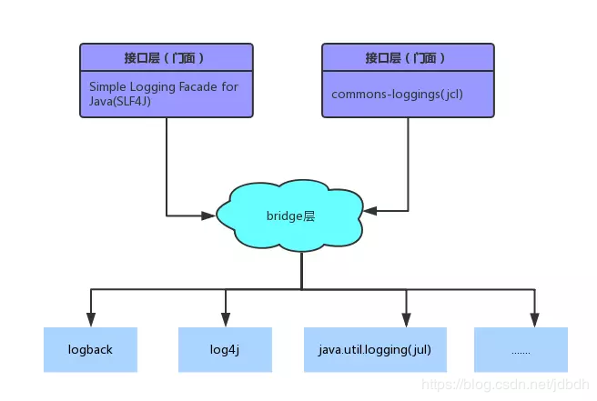
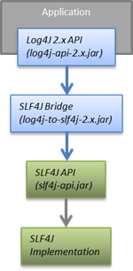
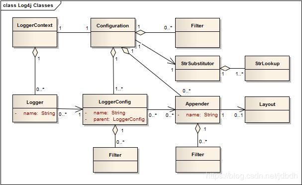

# 一 简介
历史上出现了很多的日志框架，如：
* **Log4j**：Apache Log4j是一个基于Java的日志记录工具。它是由Ceki Gülcü首创的，现在则是Apache软件基金会的一个项目。 Log4j是几种Java日志框架之一。
* **Log4j 2**：Apache Log4j 2是Apache开发的一款Log4j的升级产品。
* **Commons Logging**：Apache基金会所属的项目，是一套Java日志接口，之前叫Jakarta Commons Logging，后更名为Commons Logging。
* **Slf4j**：类似于Commons Logging，是一套简易Java日志门面，本身并无日志的实现。（Simple Logging Facade for Java，缩写Slf4j）。
* **Logback**：一套日志组件的实现(Slf4j阵营)。
* **Jul**(Java Util Logging)：自Java1.4以来的官方日志实现。

由于java官方日志框架Jul出现较晚，因此没能统一日志接口。slf4j和commons-loggings都只定义了接口，为了**桥接**其他日志框架，需要额外的jar包。使用日志接口，可以方便的在不同日志框架间切换（为了灵活性的同时也付出了一定代价），于是形成了两大阵容：

一般常见的使用组合为：Slf4j与Logback，Commons Logging与Log4j。但是我选择使用**Log4j2**，它重写了Log4j，具有Logback的全部特性，是Log4j的升级版，却不兼容log4j。Log4j2将接口（`log4j-api`）和实现（`log4j-core`）分开来，提供了桥接其他日志实现的可能（`log4j-core`被适配器替换）。Log4j2提供了与Jul、Slf4j、Commons Logging桥接的jar包，因此log4j2即使不兼容log4j，也能通过commons logging桥接包使用它。与slf4j的桥接如下：

除此之外，log4j2还有很多特性，如异步输出（降低io负担），自动加载配置（避免重启应用），自定义日志级别（感觉不常用）等等。

# 二 架构
## 主要组件
log4j中使用的类大致如下：

>如果看不懂UML，请参考[UML类图](https://blog.csdn.net/jdbdh/article/details/82493183)

**Logger**是最常使用的类，用于打印日志的接口，通过**LogManager**类指定名字获得。LogManager定位**LoggerContext**并从它那获得Logger。如果Logger被创建，Logger会被关联一个LoggerConfig，该LoggerConfig可能与Logger同名，或同父package名或为root LoggerConfig（涉及**Level Inheritance**）。

使用Logger可以打印不同级别的日志，这些日志会被包装为**LogEvent**。LogEvent会被派送到LoggerConfig上。LoggerConfig在xml配置文件中由**Logger元素**配置的，LoggerConfig含有日志级别（Log Level）信息，对应0到多个**Appender**。LoggerConfig根据自己的日志级别配置与LogEvent的级别，决定是否允许进一步的处理。如果NO则丢弃，如果Yes则传给Appender。

LoggerConfig中的日志级别只是一个种定义好了的**过滤器**（Filter），还可以在Logger元素中为LoggerConfig配置过滤器，进行更细致的控制。

**Appender**负责将LogEvent派送到目的地，可以有很多目的地，如console，文件、远程服务器或数据库等等。一个loggerConfig可以对应很多Appender，loggerConfig含有父（或祖先）loggerConfig的引用。因此loggerConfig不仅将LogEvent发送给自己的所有Appender，还发给它的父（或祖先）LoggerConfig的appender，然后递归向上，这种行为被称为**Additivity**。

>举个例子，名为"com.foo"的loggerConfig是名为"com.foo.Bar"的父亲。com.foo配置输出到文件中，com.foo.Bar配置输出到console，那么对应com.foor.Bar的loggerConfig的Logger打印日志时，会同时打印到文件和控制台中。

> 从图中可看出, Appender也可存在过滤器, 用于过滤不同级别的日志.

appender只关心如何将LogEvent送到目的地，而**Layout**负责格式化LogEvent。log4j中含有不同种Layout，用于不同的用途，如JSON，XML，HTML等等。
>比如默认使用PatternLayout，使用类似c语言printf的转化模式（conversion pattern）。例如，一个模式`%r [%t] %-5p %c - %m%n`会输入如下信息：
>`176 [main] INFO  org.foo.Bar - Located nearest gas station.`
>分别对应：项目开始到现在的毫秒；打印日志的线程；日志级别；日志对应的Logger名；日志信息

至于LoggerContext和Configuration。LoggerContext是真正产生Logger的地方，在日志系统中扮演很重要的角色。Configuration是一个配置类，如果没有给出配置，则会使用默认Configuration。如果有配置文件，并且在运行时改变该配置文件，log4j会检测到，并生成新的Configuration，所有的Logger都被重定向到新Configuration中的内容，老的Configuration被丢弃。

## 层次结构
每个Logger都有自己的名字，通常使用Logger所处类的全限定名作为Logger的名字。LoggerConfig也是一个命名的实体，通常名字与Logger对应。因此log4j中有两个名字层级结构。

如果两者完全匹配，则Logger关联到匹配的LoggerConfig上，使用它的配置。如果没有完全匹配的，Logger会在名字空间上寻找最近匹配的LoggerConfig，并关联它。

在log4j中必定存在root LoggerConfig，即使没有手动配置，也会使用默认的，保证Logger能够关联到LoggerConfig。

## 日志级别
LoggerConfig需要配置日志级别，用于筛选某个范围的所有日志。下面给出每种级别的日志是否能够通过不同LoggerConfig的表格：


不同日志级别的使用情景

* `ALL` 最低等级的，用于打开所有日志记录。
* `TRACE` 很低的日志级别，一般不会使用。
* `DEBUG` 指出细粒度信息事件对调试应用程序是非常有帮助的，主要用于开发过程中打印一些运行信息。
* `INFO` 消息在粗粒度级别上突出强调应用程序的运行过程。这个可以用于生产环境中输出程序运行的一些重要信息。
* `WARN` 表明会出现潜在错误的情形，有些信息不是错误信息，但是也要给开发者的一些提示。
* `ERROR` 指出发生错误的信息，可能会导致系统出错或是宕机等，必须要避免
* `FATAL` 指出每个严重的错误事件将会导致应用程序的退出。这个级别比较高了。重大错误，这种级别你可以直接停止程序了。
* `OFF` 最高等级，用于关闭所有日志记录。

# 三 配置
## 查找配置
log4j在初始化时会自动查找配置，然后配置自己。支持各种方式、各种类型的配置，[检查过程][1]如下：
>1. 系统属性`log4j.configurationFile`指定的文件 
>2. classpath下`log4j2-test.properties` 
>3. classpath下`log4j2-test.yaml`或`log4j2-test.json`或`log4j2-test.xml` 
>4. classpath下`log4j2.properties` 
>5. classpath下`log4j2.yaml`或`log4j2.json`或`log4j2.xml` 
>6. 默认配置被使用

[1]:https://logging.apache.org/log4j/2.x/manual/configuration.html#AutomaticConfiguration

## 简单配置
如果不配置时，log4j会使用默认配置，**默认配置**对应的xml配置如下：
```xml
<?xml version="1.0" encoding="UTF-8"?>
<Configuration status="WARN">
  <Appenders>
    <Console name="Console" target="SYSTEM_OUT">
      <PatternLayout pattern="%d{HH:mm:ss.SSS} [%t] %-5level %logger{36} - %msg%n"/>
    </Console>
  </Appenders>
  <Loggers>
    <Root level="error">
      <AppenderRef ref="Console"/>
    </Root>
  </Loggers>
</Configuration>
```
>* 其中Loggers元素中的子元素Root、Logger都是在配置LoggerConfig，因此会配置有0个或多个appender。
>* log4j 的xml语法格式不太严格，参考：[XML Syntax][2]


上面配置了Root LoggerConfig，和输出到console的appender。可以为具体的Logger配置一个LoggerConfig，有不同的日志级别：
```xml
<?xml version="1.0" encoding="UTF-8"?>
<Configuration status="WARN">
  <Appenders>
    <Console name="Console" target="SYSTEM_OUT">
      <PatternLayout pattern="%d{HH:mm:ss.SSS} [%t] %-5level %logger{36} - %msg%n"/>
    </Console>
  </Appenders>
  <Loggers>
    <Logger name="com.foo.Bar" level="trace">
    </Logger>
    <Root level="error">
      <AppenderRef ref="Console"/>
    </Root>
  </Loggers>
</Configuration>
```
由于additivity，`com.foo.Bar`的LoggerConfig会使用祖先root LoggerConfig的appender，即输出到console中。

[2]:https://logging.apache.org/log4j/2.x/manual/configuration.html#XML

## Configuration
Configuration元素一些重要的属性如下：
* `status`：log4j框架内部要输出到console的LogEvent的级别。可选值：trace", "debug", "info", "warn", "error" and "fatal"。貌似默认warn。
* `dest`：输出到console具体的流。可选值："err","out",文件或url。默认out。
* `monitorInterval`：多少秒扫描一下配置文件

参考：[Configuration](https://logging.apache.org/log4j/2.x/manual/configuration.html#ConfigurationSyntax)

## 属性

* 获取属性`${prefix:name}` 

  不同前缀代表不同的环境; 无前缀时, 属性来自于当前XML的属性声明中. 其中
  * 前缀`sys`标识属性来自系统属性
  * 前缀`env`标识属性来自环境变量

* 声明属性

  ```xml
  <Properties>    
        <Property name="filename">target/rolling1/rollingtest-$${sd:type}.log</Property
  </Properties>
  ```
  > 取出时无需前缀, 如`${filename}`

## 其他配置
配置方式官方文档说的很详细，这里直接贴出链接。。。阅读时记住，xml配置的语法很松懈。

* Appender
  * [ConsoleAppender][3]常用于输出到控制台
  * `RollingFile`常用于输出到文件
* Layout
  * [PatternLayout][4]通过模式, 将日志输出为字符串. 注意, 请设置`charset`属性, 防止日志乱码，`PatternLayout`默认使用系统编码。

[3]:https://logging.apache.org/log4j/2.x/manual/appenders.html#ConsoleAppender
[4]:https://logging.apache.org/log4j/2.x/manual/layouts.html#PatternLayout

## 异步日志

> 暂时未用到, 略讲

首先引入异步日志的依赖

```xml
<dependency>
    <groupId>com.lmax</groupId>
    <artifactId>disruptor</artifactId>
    <version>3.3.6</version>
</dependency>
```


有两种方式实现异步日志:

1. 异步Appender

   日志如何写入磁盘由Appender决定, 因此可使用`RandomAccessFile `类型的Appender.

2. 同步日志基础上转化为异步 (推荐)

   灵活, 且可利用已有配置, 只需使用`AsyncLogger`代替原有的`Logger`即可.

   ```xml
   <Loggers>
       <AsyncLogger name="com.example.log4j2demo" level="debug" additivity="false">
           <AppenderRef ref="ConsoleAppender" />
           <AppenderRef ref="FileAppender" />
       </AsyncLogger>
   
       <Root level="info">
           <AppenderRef ref="ConsoleAppender" />
           <AppenderRef ref="FileAppender" />
       </Root>
   </Loggers>
   
   ```


待学习:

1. [How to use Log4j 2 with Spring Boot](https://www.callicoder.com/spring-boot-log4j-2-example/)
2. [Asynchronous Loggers for Low-Latency Logging logging.apache.org](https://logging.apache.org/log4j/2.x/manual/async.html)

## 复杂Demo

> 摘录至文章Spring Boot中, 这个不是最新版, 请移步查看

```xml
<?xml version="1.0" encoding="UTF-8"?>
<!--日志级别与优先级: OFF > FATAL > ERROR > WARN > INFO > DEBUG > TRACE > ALL -->
<!--Configuration中status属性用于设置log4j2自身内部日志输出的等级, 默认warn; monitorInterval配置重新扫描配置的时间间隔-->
<Configuration status="WARN" monitorInterval="30">
    <Properties>
        <Property name="LOG_EXCEPTION_CONVERSION_WORD">%xwEx</Property>
        <Property name="LOG_LEVEL_PATTERN">%5p</Property>
        <Property name="LOG_DATEFORMAT_PATTERN">yyyy-MM-dd HH:mm:ss.SSS</Property>
        <Property name="CONSOLE_LOG_PATTERN">%clr{%d{${LOG_DATEFORMAT_PATTERN}}}{faint} %clr{${LOG_LEVEL_PATTERN}} %clr{%pid}{magenta} %clr{---}{faint} %clr{[%15.15t]}{faint} %clr{%-40.40c{1.}}{cyan} %clr{:}{faint} %m%n${sys:LOG_EXCEPTION_CONVERSION_WORD}</Property>
        <Property name="FILE_LOG_PATTERN">%d{${LOG_DATEFORMAT_PATTERN}} ${LOG_LEVEL_PATTERN} %pid --- [%t] %-40.40c{1.} : %m%n${sys:LOG_EXCEPTION_CONVERSION_WORD}</Property>
    </Properties>

    <!--所有的appender-->
    <appenders>
        <!--这个输出控制台的配置-->
        <Console name="Console" target="SYSTEM_OUT" follow="true">
            <PatternLayout pattern="${CONSOLE_LOG_PATTERN}"/>
        </Console>

        <!--文件会打印出所有信息，这个log每次运行程序会自动清空，由append属性决定，用于临时测试-->
        <!--<File name="log" fileName="log/test.log" append="false">-->
        <!--<PatternLayout pattern="${FILE_LOG_PATTERN}"/>-->
        <!--</File>-->

        <!-- 将打印所有的info及以下级别的日志. 每天日志都会按照filePattern归档, 且当info.log文件大小超过size时，该日志也会被归档-->
        <RollingFile name="RollingFileInfo" fileName="./logs/info.log"
                     filePattern="./logs/$${date:yyyy-MM}/info-%d{yyyy-MM-dd}-%i.log">
            <!--控制台只输出level及以上级别的信息（onMatch），其他的直接拒绝（onMismatch）-->
            <ThresholdFilter level="info" onMatch="ACCEPT" onMismatch="DENY"/>
            <PatternLayout pattern="[%d{HH:mm:ss:SSS}] [%p] - %l - %m%n"/>
            <!-- 归档策略 -->
            <Policies>
                <!-- 根据上述filePattern归档, 即每天归档一次 -->
                <TimeBasedTriggeringPolicy/>
                <!-- 日志超过size归档 -->
                <SizeBasedTriggeringPolicy size="100 MB"/>
            </Policies>
        </RollingFile>

        <RollingFile name="RollingFileWarn" fileName="./logs/warn.log"
                     filePattern="./logs/$${date:yyyy-MM}/warn-%d{yyyy-MM-dd}-%i.log">
            <ThresholdFilter level="warn" onMatch="ACCEPT" onMismatch="DENY"/>
            <PatternLayout pattern="[%d{HH:mm:ss:SSS}] [%p] - %l - %m%n"/>
            <Policies>
                <TimeBasedTriggeringPolicy/>
                <SizeBasedTriggeringPolicy size="100 MB"/>
            </Policies>
            <!-- DefaultRolloverStrategy的max属性设置该Appender最多存在多少个归档, 默认7个.注意,该元素即使未声明,也默认被使用. -->
            <DefaultRolloverStrategy max="20"/>
        </RollingFile>

        <RollingFile name="RollingFileError" fileName="./logs/error.log"
                     filePattern="./logs/$${date:yyyy-MM}/error-%d{yyyy-MM-dd}-%i.log">
            <ThresholdFilter level="error" onMatch="ACCEPT" onMismatch="DENY"/>
            <PatternLayout pattern="[%d{HH:mm:ss:SSS}] [%p] - %l - %m%n"/>
            <Policies>
                <TimeBasedTriggeringPolicy/>
                <SizeBasedTriggeringPolicy size="100 MB"/>
            </Policies>
        </RollingFile>

        <!-- sql输出文件 -->
        <RollingFile name="SQL" fileName="./logs/sql.log"
                     filePattern="./logs/$${date:yyyy-MM}/sql-%d{yyyy-MM-dd}-%i.log">
            <ThresholdFilter level="debug" onMatch="ACCEPT" onMismatch="DENY"/>
            <PatternLayout pattern="[%d{HH:mm:ss:SSS}] [%p] - %l - %m%n"/>
            <Policies>
                <TimeBasedTriggeringPolicy/>
                <SizeBasedTriggeringPolicy size="100 MB"/>
            </Policies>
        </RollingFile>
    </appenders>

    <!--然后定义logger，只有定义了logger并引入的appender，appender才会生效-->
    <loggers>
        <!-- Spring Boot默认Logger配置 -->
        <Logger name="org.apache.catalina.startup.DigesterFactory" level="error"/>
        <Logger name="org.apache.catalina.util.LifecycleBase" level="error"/>
        <Logger name="org.apache.coyote.http11.Http11NioProtocol" level="warn"/>
        <logger name="org.apache.sshd.common.util.SecurityUtils" level="warn"/>
        <Logger name="org.apache.tomcat.util.net.NioSelectorPool" level="warn"/>
        <Logger name="org.eclipse.jetty.util.component.AbstractLifeCycle" level="error"/>
        <Logger name="org.hibernate.validator.internal.util.Version" level="warn"/>
        <logger name="org.springframework.boot.actuate.endpoint.jmx" level="warn"/>

        <!--sql日志-->
        <logger name="com.qthl.wf.dao" level="debug" additivity="false">
            <appender-ref ref="Console"/>
            <appender-ref ref="SQL"/>
        </logger>
        <!-- 其他日志 -->
        <root level="info">
            <appender-ref ref="Console"/>
            <appender-ref ref="RollingFileInfo"/>
            <appender-ref ref="RollingFileWarn"/>
            <appender-ref ref="RollingFileError"/>
        </root>
    </loggers>

</Configuration>
```

# 四 使用
使用例子如下：
```java
public class WXTest {
    //声明为静态字段，避免浪费计算资源
    private static final Logger logger=LogManager.getLogger();//无参数构造函数，默认类的全限定名作为Logger名
    @Test
    public void test()  {
        try {
            log(1);
        } catch (Exception e) {
            logger.catching(e);
        }
    }
    public void log(int p) throws Exception {
        logger.info("进入log方法");
        if(p==1){
            throw new Exception("出现异常");
        }
        logger.info("正常退出log方法");
    }
}
```
输出：
```output
16:32:45.976 [main] INFO  com.luo.WXShop.test.WXTest - 进入log方法
16:32:46.006 [main] ERROR com.luo.WXShop.test.WXTest - Catching
java.lang.Exception: 出现异常
	at com.luo.WXShop.test.WXTest.log(WXTest.java:35) ~[test-classes/:?]
	at com.luo.WXShop.test.WXTest.test(WXTest.java:27) [test-classes/:?]
```
# 五 其他
## Logback配置Demo

记录Logback的配置, 仅仅是因为工作用到了, 且用的人不少, 记下来是不会错的

```xml
<?xml version="1.0" encoding="UTF-8"?>
<!-- 日志级别从低到高分为TRACE < DEBUG < INFO < WARN < ERROR < FATAL，如果设置为WARN，则低于WARN的信息都不会输出 -->
<!-- scan:当此属性设置为true时，配置文件如果发生改变，将会被重新加载，默认值为true -->
<!-- scanPeriod:设置监测配置文件是否有修改的时间间隔，如果没有给出时间单位，默认单位是毫秒。当scan为true时，此属性生效。默认的时间间隔为1分钟。 -->
<!-- debug:当此属性设置为true时，将打印出logback内部日志信息，实时查看logback运行状态。默认值为false。 -->
<configuration scan="true" scanPeriod="10 seconds">

    <!--<include resource="org/springframework/boot/logging/logback/base.xml" />-->

    <contextName>logback</contextName>
    <!-- name的值是变量的名称，value的值时变量定义的值。通过定义的值会被插入到logger上下文中。定义变量后，可以使“${}”来使用变量。 -->
    <property name="log.path" value="./logs"/>

    <!-- 控制台日志, 有彩色 -->
    <property name="CONSOLE_LOG_PATTERN"
              value="%yellow(%date{yyyy-MM-dd HH:mm:ss})|%highlight(%-5level)|%blue(%thread)|%cyan(%-50logger{50})|%msg%n"/>
    <!-- 文件日志, 无彩色 -->
    <property name="FILE_LOG_PATTERN" value="%d{yyyy-MM-dd HH:mm:ss.SSS} [%thread] %-5level %logger{50} - %msg%n"/>

    <!--输出到控制台-->
    <appender name="CONSOLE" class="ch.qos.logback.core.ConsoleAppender">
        <!--此日志appender是为开发使用，只配置最底级别，控制台输出的日志级别是大于或等于此级别的日志信息-->
        <filter class="ch.qos.logback.classic.filter.ThresholdFilter">
            <level>debug</level>
        </filter>
        <encoder>
            <Pattern>${CONSOLE_LOG_PATTERN}</Pattern>
            <!-- 设置字符集 -->
            <charset>UTF-8</charset>
        </encoder>
    </appender>


    <!--输出到文件-->

    <!-- 时间滚动输出 level为 DEBUG 日志 -->
    <appender name="DEBUG_FILE" class="ch.qos.logback.core.rolling.RollingFileAppender">
        <!-- 正在记录的日志文件的路径及文件名 -->
        <file>${log.path}/log_debug.log</file>
        <!--日志文件输出格式-->
        <encoder>
            <pattern>${FILE_LOG_PATTERN}</pattern>
            <charset>UTF-8</charset> <!-- 设置字符集 -->
        </encoder>
        <!-- 日志记录器的滚动策略，按日期，按大小记录 -->
        <rollingPolicy class="ch.qos.logback.core.rolling.TimeBasedRollingPolicy">
            <!-- 日志归档 -->
            <fileNamePattern>${log.path}/debug/log-debug-%d{yyyy-MM-dd}.%i.log</fileNamePattern>
            <timeBasedFileNamingAndTriggeringPolicy class="ch.qos.logback.core.rolling.SizeAndTimeBasedFNATP">
                <maxFileSize>100MB</maxFileSize>
            </timeBasedFileNamingAndTriggeringPolicy>
            <!--日志文件保留天数-->
            <maxHistory>15</maxHistory>
        </rollingPolicy>
        <!-- 此日志文件只记录debug级别的 -->
        <filter class="ch.qos.logback.classic.filter.LevelFilter">
            <level>debug</level>
            <onMatch>ACCEPT</onMatch>
            <onMismatch>DENY</onMismatch>
        </filter>
    </appender>

    <!-- 时间滚动输出 level为 INFO 日志 -->
    <appender name="INFO_FILE" class="ch.qos.logback.core.rolling.RollingFileAppender">
        <!-- 正在记录的日志文件的路径及文件名 -->
        <file>${log.path}/log_info.log</file>
        <!--日志文件输出格式-->
        <encoder>
            <pattern>${FILE_LOG_PATTERN}</pattern>
            <charset>UTF-8</charset>
        </encoder>
        <!-- 日志记录器的滚动策略，按日期，按大小记录 -->
        <rollingPolicy class="ch.qos.logback.core.rolling.TimeBasedRollingPolicy">
            <!-- 每天日志归档路径以及格式 -->
            <fileNamePattern>${log.path}/info/log-info-%d{yyyy-MM-dd}.%i.log</fileNamePattern>
            <timeBasedFileNamingAndTriggeringPolicy class="ch.qos.logback.core.rolling.SizeAndTimeBasedFNATP">
                <maxFileSize>100MB</maxFileSize>
            </timeBasedFileNamingAndTriggeringPolicy>
            <!--日志文件保留天数-->
            <maxHistory>15</maxHistory>
        </rollingPolicy>
        <!-- 此日志文件只记录info级别的 -->
        <filter class="ch.qos.logback.classic.filter.LevelFilter">
            <level>info</level>
            <onMatch>ACCEPT</onMatch>
            <onMismatch>DENY</onMismatch>
        </filter>
    </appender>

    <!-- 时间滚动输出 level为 WARN 日志 -->
    <appender name="WARN_FILE" class="ch.qos.logback.core.rolling.RollingFileAppender">
        <!-- 正在记录的日志文件的路径及文件名 -->
        <file>${log.path}/log_warn.log</file>
        <!--日志文件输出格式-->
        <encoder>
            <pattern>${FILE_LOG_PATTERN}</pattern>
            <charset>UTF-8</charset> <!-- 此处设置字符集 -->
        </encoder>
        <!-- 日志记录器的滚动策略，按日期，按大小记录 -->
        <rollingPolicy class="ch.qos.logback.core.rolling.TimeBasedRollingPolicy">
            <fileNamePattern>${log.path}/warn/log-warn-%d{yyyy-MM-dd}.%i.log</fileNamePattern>
            <timeBasedFileNamingAndTriggeringPolicy class="ch.qos.logback.core.rolling.SizeAndTimeBasedFNATP">
                <maxFileSize>100MB</maxFileSize>
            </timeBasedFileNamingAndTriggeringPolicy>
            <!--日志文件保留天数-->
            <maxHistory>15</maxHistory>
        </rollingPolicy>
        <!-- 此日志文件只记录warn级别的 -->
        <filter class="ch.qos.logback.classic.filter.LevelFilter">
            <level>warn</level>
            <onMatch>ACCEPT</onMatch>
            <onMismatch>DENY</onMismatch>
        </filter>
    </appender>


    <!-- 时间滚动输出 level为 ERROR 日志 -->
    <appender name="ERROR_FILE" class="ch.qos.logback.core.rolling.RollingFileAppender">
        <!-- 正在记录的日志文件的路径及文件名 -->
        <file>${log.path}/log_error.log</file>
        <!--日志文件输出格式-->
        <encoder>
            <pattern>${FILE_LOG_PATTERN}</pattern>
            <charset>UTF-8</charset> <!-- 此处设置字符集 -->
        </encoder>
        <!-- 日志记录器的滚动策略，按日期，按大小记录 -->
        <rollingPolicy class="ch.qos.logback.core.rolling.TimeBasedRollingPolicy">
            <fileNamePattern>${log.path}/error/log-error-%d{yyyy-MM-dd}.%i.log</fileNamePattern>
            <timeBasedFileNamingAndTriggeringPolicy class="ch.qos.logback.core.rolling.SizeAndTimeBasedFNATP">
                <maxFileSize>100MB</maxFileSize>
            </timeBasedFileNamingAndTriggeringPolicy>
            <!--日志文件保留天数-->
            <maxHistory>15</maxHistory>
        </rollingPolicy>
        <!-- 此日志文件只记录ERROR级别的 -->
        <filter class="ch.qos.logback.classic.filter.LevelFilter">
            <level>ERROR</level>
            <onMatch>ACCEPT</onMatch>
            <onMismatch>DENY</onMismatch>
        </filter>
    </appender>

    <!--
        <logger>用来设置某一个包或者具体的某一个类的日志打印级别、
        以及指定<appender>。<logger>仅有一个name属性，一个可选的level和一个可选的addtivity属性。
          name:用来指定受此logger约束的某一个包或者具体的某一个类。
          level:用来设置打印级别，大小写无关：TRACE, DEBUG, INFO, WARN, ERROR, ALL 和 OFF，
              还有一个特俗值INHERITED或者同义词NULL，代表强制执行上级的级别。
              如果未设置此属性，那么当前logger将会继承上级的级别。
          addtivity:是否向上级logger传递打印信息。默认是true。
    -->
    <!--<logger name="org.springframework.web" level="info"/>-->
    <!--<logger name="org.springframework.scheduling.annotation.ScheduledAnnotationBeanPostProcessor" level="INFO"/>-->
    <!--
        使用mybatis的时候，sql语句是debug下才会打印，而这里我们只配置了info，所以想要查看sql语句的话，有以下两种操作：
        第一种把<root level="info">改成<root level="DEBUG">这样就会打印sql，不过这样日志那边会出现很多其他消息
        第二种就是单独给dao下目录配置debug模式，代码如下，这样配置sql语句会打印，其他还是正常info级别：
     -->


    <!--
        root节点是必选节点，用来指定最基础的日志输出级别，只有一个level属性
        level:用来设置打印级别，大小写无关：TRACE, DEBUG, INFO, WARN, ERROR, ALL 和 OFF，
        不能设置为INHERITED或者同义词NULL。默认是DEBUG
        可以包含零个或多个元素，标识这个appender将会添加到这个logger。
    -->

    <!-- 无profile时, 打印控制台 -->
    <springProfile name="! (dev | test | sandbox | production)">
        <root level="debug">
            <appender-ref ref="CONSOLE"/>
        </root>
    </springProfile>

    <!--开发环境:打印控制台-->
    <springProfile name="dev">
        <root level="debug">
            <appender-ref ref="CONSOLE"/>
        </root>
    </springProfile>

    <!-- 测试环境: 打印到控制台和文件 -->
    <springProfile name="test">
        <root level="debug">
            <appender-ref ref="CONSOLE"/>
            <appender-ref ref="DEBUG_FILE"/>
            <appender-ref ref="INFO_FILE"/>
            <appender-ref ref="WARN_FILE"/>
            <appender-ref ref="ERROR_FILE"/>
        </root>
    </springProfile>

    <!--沙盘或生产环境:打印到文件-->
    <springProfile name="sandbox | production">
        <root level="info">
            <appender-ref ref="DEBUG_FILE"/>
            <appender-ref ref="INFO_FILE"/>
            <appender-ref ref="WARN_FILE"/>
            <appender-ref ref="ERROR_FILE"/>
        </root>
    </springProfile>

</configuration>
```

# 参考
* [Apache Log4j 2](https://logging.apache.org/log4j/2.x/index.html)
* [Java常用的日志框架对比](https://www.jianshu.com/p/bbbdcb30bba8)
* [看log4j2如何秒杀一切日志组件](https://www.jianshu.com/p/570b406bddcd)
* [Java之常用日志框架](https://www.jianshu.com/p/190c56429ec4)
* [Java常用日志框架介绍](https://www.cnblogs.com/chenhongliang/p/5312517.html)
* [Is it worth to use slf4j with log4j2](https://stackoverflow.com/questions/41498021/is-it-worth-to-use-slf4j-with-log4j2)
* [Log4j2: Exceptions logging](https://self-learning-java-tutorial.blogspot.com/2015/10/log4j2-exceptions-logging.html)
* [Log4j2配置文件详解](https://www.cnblogs.com/yudar/p/5113655.html)