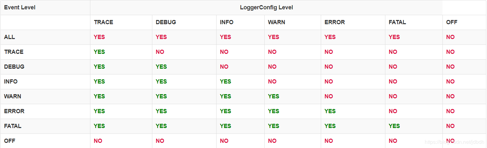

# 一 简介
历史上出现了很多的日志框架，如：
* **Log4j**：Apache Log4j是一个基于Java的日志记录工具。它是由Ceki Gülcü首创的，现在则是Apache软件基金会的一个项目。 Log4j是几种Java日志框架之一。
* **Log4j 2**：Apache Log4j 2是apache开发的一款Log4j的升级产品。
* **Commons Logging**：Apache基金会所属的项目，是一套Java日志接口，之前叫Jakarta Commons Logging，后更名为Commons Logging。
* **Slf4j**：类似于Commons Logging，是一套简易Java日志门面，本身并无日志的实现。（Simple Logging Facade for Java，缩写Slf4j）。
* **Logback**：一套日志组件的实现(Slf4j阵营)。
* **Jul**(Java Util Logging)：自Java1.4以来的官方日志实现。

由于java官方日志框架Jul出现较晚，因此没能统一日志接口。slf4j和commons-loggings都只定义了接口，为了**桥接**其他日志框架，需要额外的jar包。使用日志接口，可以方便的在不同日志框架间切换（为了灵活性的同时也付出了一定代价），于是形成了两大阵容：

一般常见的使用组合为：slf4j与logback，commons logging与log4j。但是我选择使用**Log4j2**，它重写了log4j，具有Logback的全部特性，是log4j的升级版，却不兼容log4j。log4j2将接口（log4j-api）和实现（log4j-core）分开来，提供了桥接其他日志实现的可能（log4j-core被适配器替换）。log4j2提供了与Jul、Slf4j、commons logging桥接的jar包，因此log4j2即使不兼容log4j，也能通过commons logging桥接包使用它。与slf4j的桥接如下：

除此之外，log4j2还有很多特性，如异步输出（降低io负担），自动加载配置（避免重启应用），自定义日志级别（感觉不常用）等等。

# 二 架构
## 主要组件
log4j中使用的类大致如下：

>如果看不懂UML，请参考[UML类图](https://blog.csdn.net/jdbdh/article/details/82493183)

**Logger**是最常使用的类，用于打印日志的接口，通过**LogManager**类指定名字获得。LogManager定位**LoggerContext**并从它那获得Logger。如果Logger被创建，Logger会被关联一个LoggerConfig，该LoggerConfig可能与Logger同名，或同父package名或为root LoggerConfig（涉及**Level Inheritance**）。

使用Logger可以打印不同级别的日志，这些日志会被包装为**LogEvent**。LogEvent会被派送到LoggerConfig上。LoggerConfig在xml配置文件中由**Logger元素**配置的，LoggerConfig含有日志级别（Log Level）信息，对应0到多个**Appender**。LoggerConfig根据自己的日志级别配置与LogEvent的级别，决定是否允许进一步的处理。如果NO则丢弃，如果Yes则传给Appender。

LoggerConfig中的日志级别只是一个种定义好了的**过滤器**（Filter），还可以在Logger元素中为LoggerConfig配置过滤器，进行更细致的控制。

**Appender**负责将LogEvent派送到目的地，可以有很多目的地，如console，文件、远程服务器或数据库等等。一个loggerConfig可以对应很多Appender，loggerConfig含有父（或祖先）loggerConfig的引用。因此loggerConfig不仅将LogEvent发送给自己的所有Appender，还发给它的父（或祖先）LoggerConfig的appender，然后递归向上，这种行为被称为**Additivity**。

>举个例子，名为"com.foo"的loggerConfig是名为"com.foo.Bar"的父亲。com.foo配置输出到文件中，com.foo.Bar配置输出到console，那么对应com.foor.Bar的loggerConfig的Logger打印日志时，会同时打印到文件和控制台中。

> 从图中可看出, Appender也可存在过滤器, 用于过滤不同级别的日志.

appender只关心如何将LogEvent送到目的地，而**Layout**负责格式化LogEvent。log4j中含有不同种Layout，用于不同的用途，如JSON，XML，HTML等等。
>比如默认使用PatternLayout，使用类似c语言printf的转化模式（conversion pattern）。例如，一个模式`%r [%t] %-5p %c - %m%n`会输入如下信息：
>`176 [main] INFO  org.foo.Bar - Located nearest gas station.`
>分别对应：项目开始到现在的毫秒；打印日志的线程；日志级别；日志对应的Logger名；日志信息

至于LoggerContext和Configuration。LoggerContext是真正产生Logger的地方，在日志系统中扮演很重要的角色。Configuration是一个配置类，如果没有给出配置，则会使用默认Configuration。如果有配置文件，并且在运行时改变该配置文件，log4j会检测到，并生成新的Configuration，所有的Logger都被重定向到新Configuration中的内容，老的Configuration被丢弃。

## 层次结构
每个Logger都有自己的名字，通常使用Logger所处类的全限定名作为Logger的名字。LoggerConfig也是一个命名的实体，通常名字与Logger对应。因此log4j中有两个名字层级结构。

如果两者完全匹配，则Logger关联到匹配的LoggerConfig上，使用它的配置。如果没有完全匹配的，Logger会在名字空间上寻找最近匹配的LoggerConfig，并关联它。

在log4j中必定存在root LoggerConfig，即使没有手动配置，也会使用默认的，保证Logger能够关联到LoggerConfig。

## 日志级别
LoggerConfig需要配置日志级别，用于筛选某个范围的所有日志。下面给出每种级别的日志是否能够通过不同LoggerConfig的表格：

# 三 配置
## 查找配置
log4j在初始化时会自动查找配置，然后配置自己。支持各种方式、各种类型的配置，[检查过程][1]如下：
>1. 系统属性`log4j.configurationFile`指定的文件 
>2. classpath下`log4j2-test.properties` 
>3. classpath下`log4j2-test.yaml`或`log4j2-test.json`或`log4j2-test.xml` 
>4. classpath下`log4j2.properties` 
>5. classpath下`log4j2.yaml`或`log4j2.json`或`log4j2.xml` 
>6. 默认配置被使用

[1]:https://logging.apache.org/log4j/2.x/manual/configuration.html#AutomaticConfiguration

## 简单配置
如果不配置时，log4j会使用默认配置，**默认配置**对应的xml配置如下：
```xml
<?xml version="1.0" encoding="UTF-8"?>
<Configuration status="WARN">
  <Appenders>
    <Console name="Console" target="SYSTEM_OUT">
      <PatternLayout pattern="%d{HH:mm:ss.SSS} [%t] %-5level %logger{36} - %msg%n"/>
    </Console>
  </Appenders>
  <Loggers>
    <Root level="error">
      <AppenderRef ref="Console"/>
    </Root>
  </Loggers>
</Configuration>
```
>* 其中Loggers元素中的子元素Root、Logger都是在配置LoggerConfig，因此会配置有0个或多个appender。
>* log4j 的xml语法格式不太严格，参考：[XML Syntax][2]

上面配置了Root LoggerConfig，和输出到console的appender。可以为具体的Logger配置一个LoggerConfig，有不同的日志级别：
```xml
<?xml version="1.0" encoding="UTF-8"?>
<Configuration status="WARN">
  <Appenders>
    <Console name="Console" target="SYSTEM_OUT">
      <PatternLayout pattern="%d{HH:mm:ss.SSS} [%t] %-5level %logger{36} - %msg%n"/>
    </Console>
  </Appenders>
  <Loggers>
    <Logger name="com.foo.Bar" level="trace">
    </Logger>
    <Root level="error">
      <AppenderRef ref="Console"/>
    </Root>
  </Loggers>
</Configuration>
```
由于additivity，`com.foo.Bar`的LoggerConfig会使用祖先root LoggerConfig的appender，即输出到console中。

[2]:https://logging.apache.org/log4j/2.x/manual/configuration.html#XML

## Configuration
Configuration元素一些重要的属性如下：
* `status`：log4j框架内部要输出到console的LogEvent的级别。可选值：trace", "debug", "info", "warn", "error" and "fatal"。貌似默认warn。
* `dest`：输出到console具体的流。可选值："err","out",文件或url。默认out。
* `monitorInterval`：多少秒扫描一下配置文件

参考：[Configuration](https://logging.apache.org/log4j/2.x/manual/configuration.html#ConfigurationSyntax)

## 属性替换

* 获取属性`${prefix:name}` 

  不同前缀代表不同的环境; 无前缀时, 属性来自于当前XML的属性声明中. 其中
  * 前缀`sys`标识属性来自系统属性
  * 前缀`env`标识属性来自环境变量

* 声明属性

  ```xml
  <Properties>    
        <Property name="filename">target/rolling1/rollingtest-$${sd:type}.log</Property> </Properties>
  ```

  > 取出时无需前缀, 如`${filename}`

## 其他配置链接
配置方式官方文档说的很详细，这里直接贴出链接。。。阅读时记住，xml配置的语法很松懈。

[ConsoleAppender][3]是比较常用的appender

[PatternLayout][4]是一个比较常用的layout。这里要注意使用`charset`属性日志乱码，PatternLayout默认使用系统编码。

[3]:https://logging.apache.org/log4j/2.x/manual/appenders.html#ConsoleAppender
[4]:https://logging.apache.org/log4j/2.x/manual/layouts.html#PatternLayout

# 四 使用
使用例子如下：
```java
public class WXTest {
    //声明为静态字段，避免浪费计算资源
    private static final Logger logger=LogManager.getLogger();//无参数构造函数，默认类的全限定名作为Logger名
    @Test
    public void test()  {
        try {
            log(1);
        } catch (Exception e) {
            logger.catching(e);
        }
    }
    public void log(int p) throws Exception {
        logger.info("进入log方法");
        if(p==1){
            throw new Exception("出现异常");
        }
        logger.info("正常退出log方法");
    }
}
```
输出：
```output
16:32:45.976 [main] INFO  com.luo.WXShop.test.WXTest - 进入log方法
16:32:46.006 [main] ERROR com.luo.WXShop.test.WXTest - Catching
java.lang.Exception: 出现异常
	at com.luo.WXShop.test.WXTest.log(WXTest.java:35) ~[test-classes/:?]
	at com.luo.WXShop.test.WXTest.test(WXTest.java:27) [test-classes/:?]
```
# 五 其他
## 日志级别使用情景
* `ALL` 最低等级的，用于打开所有日志记录。
* `TRACE` 很低的日志级别，一般不会使用。
* `DEBUG` 指出细粒度信息事件对调试应用程序是非常有帮助的，主要用于开发过程中打印一些运行信息。
* `INFO` 消息在粗粒度级别上突出强调应用程序的运行过程。这个可以用于生产环境中输出程序运行的一些重要信息。
* `WARN` 表明会出现潜在错误的情形，有些信息不是错误信息，但是也要给开发者的一些提示。
* `ERROR` 指出发生错误的信息，可能会导致系统出错或是宕机等，必须要避免
* `FATAL` 指出每个严重的错误事件将会导致应用程序的退出。这个级别比较高了。重大错误，这种级别你可以直接停止程序了。
* `OFF` 最高等级，用于关闭所有日志记录。

# 参考
* [Apache Log4j 2](https://logging.apache.org/log4j/2.x/index.html)
* [Java常用的日志框架对比](https://www.jianshu.com/p/bbbdcb30bba8)
* [看log4j2如何秒杀一切日志组件](https://www.jianshu.com/p/570b406bddcd)
* [Java之常用日志框架](https://www.jianshu.com/p/190c56429ec4)
* [Java常用日志框架介绍](https://www.cnblogs.com/chenhongliang/p/5312517.html)
* [Is it worth to use slf4j with log4j2](https://stackoverflow.com/questions/41498021/is-it-worth-to-use-slf4j-with-log4j2)
* [Log4j2: Exceptions logging](https://self-learning-java-tutorial.blogspot.com/2015/10/log4j2-exceptions-logging.html)
* [Log4j2配置文件详解](https://www.cnblogs.com/yudar/p/5113655.html)