尝试过CentOS,Ubuntu, CentOS本身就不适合左桌面程序, 软件太匮乏了, Ubuntu还好, 但是一些软件还是需要自己去找教程才能安装, 并且我的wifi网卡不支持, 还要自己找驱动, 开机启动项设置也比较麻烦. 但是! 这些问题在Deepin手中都被解决了!! 使用起来更方便, 让人能够更专注的使用系统来完成自己的任务, 而不是半天都在捣鼓操作系统...对于我这样的懒人再合适不过了.
# 一 安装

安装十分方便, 这里只简述下大致过程:

1. 下载[最新版本](<https://www.deepin.org/download/>)系统镜像
2. 制作启动U盘, 使用[深度启动盘制作工具](<https://www.deepin.org/original/deepin-boot-maker/>)将镜像烧录进去
3. 在win10上至少保留一个分区, 可从其他分区压缩得到.
4. 在win10中关闭**快速启动**, 在bios中关闭**secure boot**
5. 重启, 插入U盘, 进入BIOS, 设置U盘优先启动, 从而进去镜像系统中
6. 一直下一步, 使用简单分区方案, 将系统安装在一个空闲分区中.

安装完后, 会自动为你配置了win10的引导项, 方便启动时进入win10系统.
>关于快速启动和secure boot
>* 快速启动: 与休眠类型类似, windows关机时将内核相关进程保存在磁盘中, 以达到快速启动的目的.
>* secure boot: 防止引导程序被恶意修改
>
>这些功能都有可能造成双系统安装失败, 因此安装时最好关闭.
# 二 配置

## 2.1 登录配置

这些配置开发环境变量, 打开`~/.bashrc`

```shell
# ------------sidian设置的-------------
# 设置匿名
alias ll='ls --color=auto -l'

# 设置环境变量
export JAVA_HOME=/home/sidian/Software/jdk-11.0.3
export PATH=$PATH:/home/sidian/.bin:$JAVA_HOME/bin:/home/sidian/Software/apache-maven-3.6.1/bin
```

配置了Java,Maven的环境变量, 至于安装很简单, 在浏览器上下载后, 放入`~/Software`目录下解压就行了.

这里也讲`~/.bin`目录放入`PATH`下, 便于后续操作.

## 2.2 个性化

根据以下官方文档来配置窗口主题, 发现安装成功, 但是不起作用.

> 参考
>
> * [窗口主题]([https://wiki.deepin.org/wiki/%E7%AA%97%E5%8F%A3%E4%B8%BB%E9%A2%98](https://wiki.deepin.org/wiki/窗口主题))
> * [个性化-如何添加自定义主题](<https://wiki.deepin.org/wiki/个性化-如何添加自定义主题>)

## 2.3 字体
将windows的`Windows/Fonts`文件夹拷贝到deepin的`/usr/share/fonts/`目录下, 并更名为`winFonts`

## 2.4 输入法
本人经常写笔记, 使用markdown. 输入法配置为中文输入, 英文标点, 半角字符. 但是经常不小心触发快捷键变成全角字符, 换了输入法也没有用.

这里通过关闭全角功能来解决它, 首先在启动器上打开**输入法配置**, 然后如图所示:
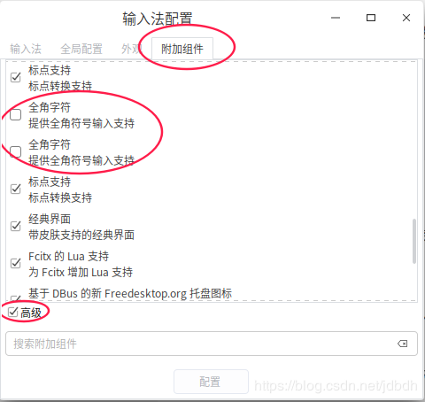
发现去掉全角后, 一些快捷键都不显示了, 这里列举一些:
* 中英文标题切换: `ctrl+.`
* 全半角切换(弃): `shift+space`

## 2.5 壁纸
deepin默认壁纸存放于`/usr/share/wallpapers/deepin`目录下, 可自行修改或添加. 

也可以在其他目录, 对图片右键设为壁纸. 这种方式设置的壁纸, 可以通过如下方式删除


## 2.6 Desktop Entry
在启动上显示程序应用需要配置`.desktop`文件, 存放位置如下:
* `/usr/share/applications` 系统应用配置
* `~/.local/share/applications` 用户应用配置
>貌似该文件可以直接运行?

一个简单的配置如下:
```desktop
[Desktop Entry] #每个desktop文件都以这个标签开始，说明这是一个Desktop Entry文件
Version = 1.0 #标明Desktop Entry的版本（可选）
Name = Firefox #程序名称（必须），这里以创建一个Firefox的快捷方式为例
GenericName = Web Browser #程序通用名称（可选）
Comment = A Web Browser #程序描述（可选）
Exec = firefox %u #程序的启动命令（必选），可以带参数运行,当下面的Type为Application，此项有效
Icon = firefox #设置快捷方式的图标（可选）
Terminal = false #是否在终端中运行（可选），当Type为Application，此项有效
Type = Application #desktop的类型（必选），常见值有“Application”和“Link”
Categories = GNOME;Application;Network; #注明在菜单栏中显示的类别（可选）
MimeType=*/* #能够读取的文件的类型 (可选) , 对于文本相关应用最好有
```
更简单的配置见3.5小节
>参考[Desktop Entry 文件](https://wiki.deepin.org/wiki/Desktop_Entry_%E6%96%87%E4%BB%B6)

## 2.7 触控板
触控板默认太过灵敏了，一不小心就触发点击，造成光标跑掉。其二，双指滚定方向与习惯相反。

通过如下配置来解决
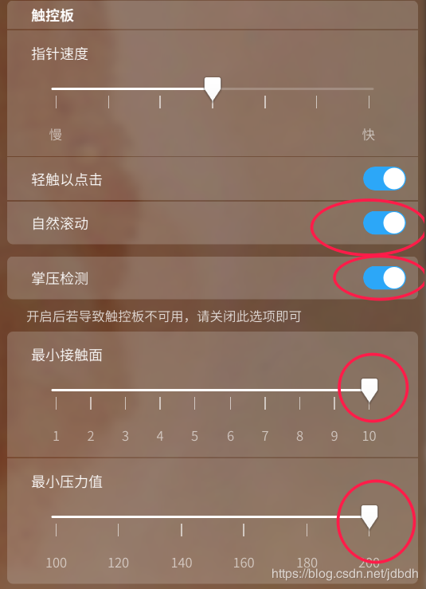

## 2.8 显卡驱动
笔记本一般都有双显卡(集显+独显), 在windows下驱动完善, 通过NVIDIA的Optimus技术, 可以实现两者的无缝切换. 非GPU密集程序会使用集显, GPU密集程序会使用独显. 它同是保证了续航与高性能.

在linux系统中, 并没有完美支持Optimus技术的显卡驱动, 都是模仿并有一定缺点的. 下面看看deepin提供的显卡驱动方案:
1. 开源驱动(默认): 仅使用集显, 兼容性好, 但性能不高. 这也保证了系统的正常安装与使用.
2. Intel默认驱动: 仅使用集显, 兼容性差, 但性能好
3. 大黄蜂方案: 模拟Optimus技术, 提供双显卡解决方案. 默认情况下使用集显, 当要以独显运行程序时, 需加上特定命令前缀.
4. NV-PRIME方案: 也是双显卡解决方案, 与大黄蜂类型, 性能要好. 不太了解
5. 仅使用独显的方案呢? 尚不了解...

## 2.9 locale
在终端输入命令时, 时不时会出现中文, 对于习惯了英文的我, 不可忍受, 这里在`~/.bashrc`中添加一行:
```shell
export LANGUAGE=en_US
```
>参考: [Configure Locales in Ubuntu](https://www.thomas-krenn.com/en/wiki/Configure_Locales_in_Ubuntu)
# 三 应用程序

## 3.1 Shadowsocks

程序开发, 少不了访问国外网站, 这里假设你已有ss账号, 或自己搭建了服务器

1. 在商店中下载`shadowsocks-qt`

	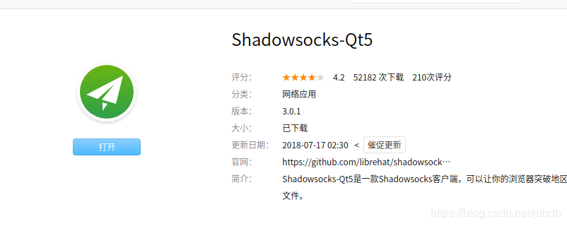

2. 配置连接,

   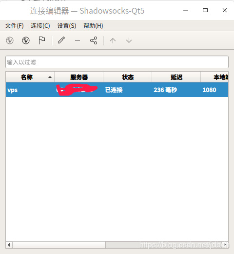
   
   > 注意设置启动时自动连接

3. 设置登录时自动启动
	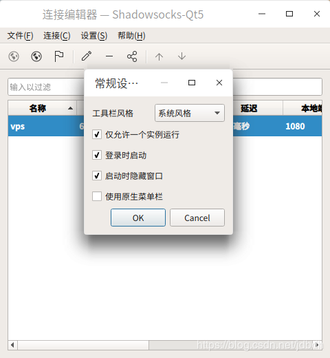
此时, 系统中已经存在了一个socks5代理, 接下来让chrome浏览器使用该代理. 有人说chrome不支持deepin系统代理, 如下所示:

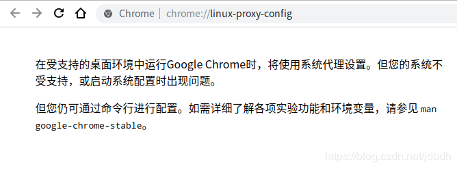

其实还是支持系统代理的, 在系统中设置好后就可以使用了.

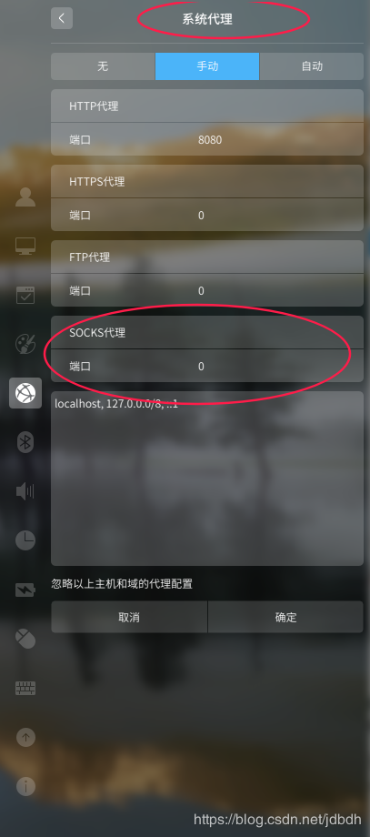

但是该客户端还是不是十分强大, 不像win的ss客户端一样可以进行pac代理模式, 这里没有. 为了能够有选择性的代理流量, 我们使用chrome插件`SwitchyOmega`, 使用见下节.

## 3.2 SwitchyOmega

最新版下载见[releases](<https://github.com/FelisCatus/SwitchyOmega/releases>), 接下来安装

1. 下载后, 重命名后缀为`.zip`, 然后解压它
2. 打开chrome扩展程序, 打开开发者模式, 点击`加载已解压的扩展程序`来安装插件.

然后是配置它

1. 进入插件后台配置页面, 配置socks5代理
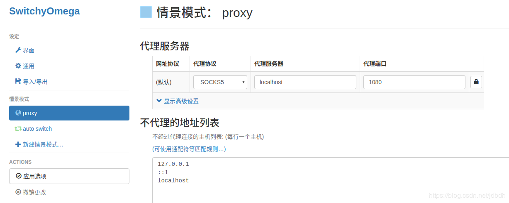

2. 配置自动代理, 也就是URL满足什么条件时, 使用什么代理. 这里清空默认配置, 仅留下默认直连规则

   

岂不是所有流量都直连, 不走代理了? 不是的, 当访问受堵时, 它会自动提示你为该网站添加一条代理规则的.

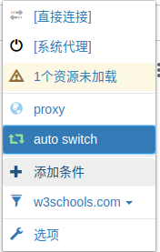

如上所示, 此时是自动代理模式, 只有一条默认的直连规则, 因此有的网站访问不了, 出现了提示, 根据他的提示将加入一条url规则走代理即可. 逐渐的... 你的代理规则就会慢慢地被你建立好了...

## 3.3 词典

在商店中没有找到有道词典, 可以在官网下载. 但是这里使用一个很好的替代品--chrome插件沙拉查词.

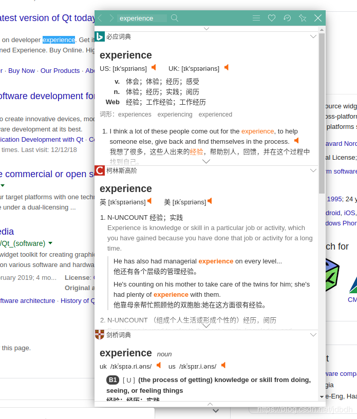

如果在浏览器外想要查词呢? 我们可以在扩展程序的[快捷键](<chrome://extensions/shortcuts>)中设置, 如下图所示

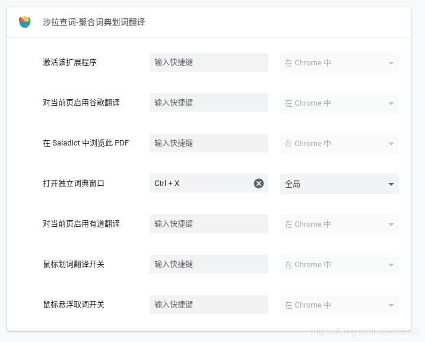

设置为全局快捷键, 即使在chrome外也能使用 

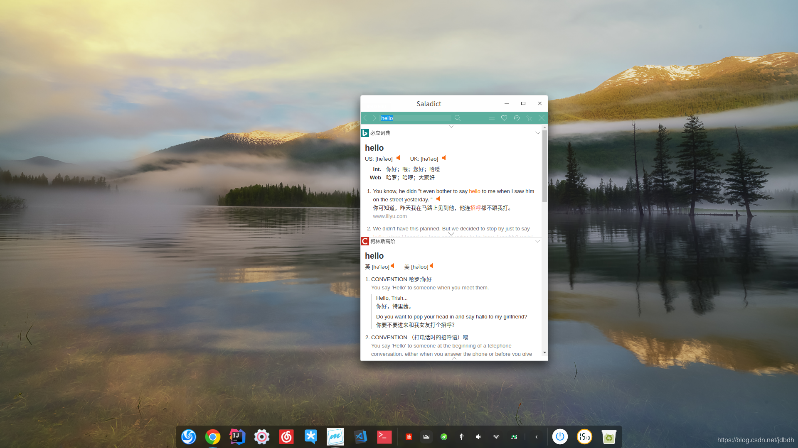
打开查词窗口使用`Ctrl+X` , 关闭使用`Ctrl+w`, 因为它本质上是浏览器的一个标签页.


## 3.4 typora

deepin商店中提供了为知笔记, 但是我还是喜欢typora这个markdown编辑器. 商店中没有提供, 需要自己去官方下载, 然后解压到`~/Software`目录下.

为了能够让typora像商店中程序那样, 出现在启动器中, 我们需要配置[Desktop Entry 文件](https://wiki.deepin.org/wiki/Desktop_Entry_文件), 在`.local/share/applications/`目录下创建`typora.desktop`文件

```plain
[Desktop Entry]
Name=typora
Exec=/home/sidian/Software/Typora-linux-x64/Typora
Icon=/home/sidian/Software/Typora-linux-x64/typora.png
Terminal = false
Type = Application
```

> 这里的icon是我自己找的...

为了方便能够在命令行中运行该程序, 需要在`.bin/`下添加脚本文件`typora`

```shell
#!/bin/sh
nohup /home/sidian/Software/Typora-linux-x64/Typora >/dev/null  2>&1 &
```

然后赋予权限

```bash
chmod a+x typora
```

## 3.5 idea

该软件安装方法与typora一致, 都是解压安装, 这里直接给出配置文件

* `idea.desktop`

  ```plain
  [Desktop Entry]
  Name=idea
  Exec=/home/sidian/Software/idea-IU-191.7479.19/bin/idea.sh
  Icon=/home/sidian/Software/idea-IU-191.7479.19/bin/idea.png
  Terminal = false
  Type = Application
  ```

* 脚本`idea`

  ```bash
  #!/bin/sh
  nohup /home/sidian/Software/idea-IU-191.7479.19/bin/idea.sh >/dev/null 2>&1 &
  ```

-----------------

最新安装方法, 直接在商店里下载..

## 3.6 google拼音

自带的搜狗拼音对我来说，用户体验感很差, 一不小心就切换到了全角字符 ,因为它的快捷键很容易触发, 而google拼音没有快捷键, 配置好后就不用管了.

下载如下

```bash
sudo apt install  fcitx-googlepinyin
```

重启, 就能看到了

> 发现没屁用, 转回搜狗去...
>
> 卸载命令:`sudo apt remove fcitx-googlepinyin`
--------------
19.6.21更新
该问题已解决, 见2.4小节

## 3.7 wine
wine是linux上一个对windows api的兼容层, 将对windows api的调用转化为linux内核api的调用, 与windows上的wsl类似.
>因有事, 被打断了思路, 以后有需求了再补充. 暂时参考[deepin 安装 wine](https://ywnz.com/linuxjc/4131.html)

安装后, `.wine/driver_c`目录下会模拟windows系统盘. 通过右键可以让wine运行`.exe`程序, 如果需要安装, 则会安装到该目录下. 并且wine会配置`.desktop`入口文件, 卸载时可以方便的在启动器上右键卸载.
# 四 快捷使用
## 4.1 快捷键
常用

* 终端: `Ctrl+Alt+T`
* 启动器: `Win`
* 显示桌面: `Win+D`
* 截图: `Ctrl+Alt+A`
* 录屏 : `Ctrl+Alt+R`
* 锁屏: `Win+L`

窗口相关

* 最大化窗口: `Win+上`
* 恢复窗口: `Win+下`
* 切换窗口: `Alt+Tab`
* 显示所有窗口: `Win+S`
* 切换到左工作区: `Win+左`
* 切换到右工作区: `win+右`

其他

* `Ctrl+Alt+Esc`: 打开系统监控器, 查看CPU,网络,磁盘,进程信息

* 在文件管理器中，`ctrl+H`显示或隐藏`.`文件。

详细见控制中心-->键盘与语言-->快捷键

## 4.2 触控板操作
deepin自带的驱动的手指操作与windows不太一样, 也让人不太习惯.
* 一指: 滑动鼠标; 轻触点击
* 二指: 滚动; 缩放
* 三指: 应用左右分屏, 与最大化和还原
* 四指: 显示所有屏幕; 切换桌面

# 吐槽
我是看出来了不按照deepin的套路来玩，什么bug你都可以会遇到。比如我系统语言设置为英文，然后QQ字体显示就出问题了，还有一些从windows上移过来的字体也不能使用；我关闭输入配置中的全角功能，问题也大着呢，搜狗就不正常显示了，还有个叫fcitx input method的进程不时运行，占12%左右的cpu，我说为啥笔记本无故发热呢。。。

总之，按照deepin给你预配置好的方式使用，bug就会少很多。。。