[TOC]

# 一 介绍

历史如下。。。
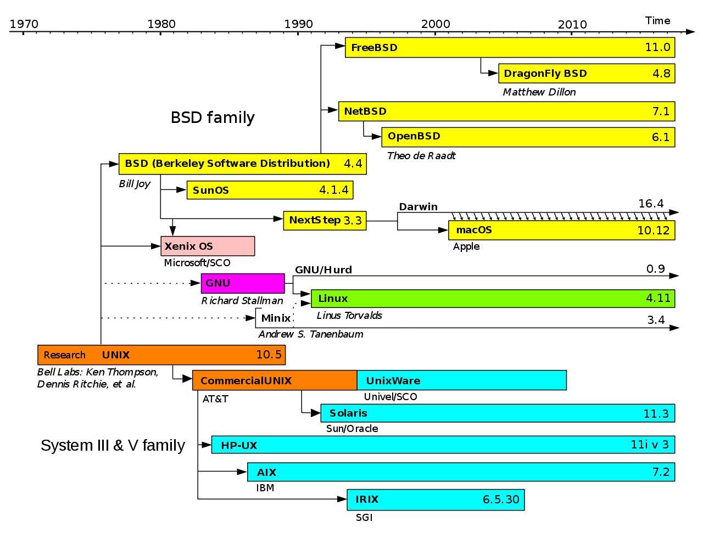
Simplified history of Unix-like operating systems

>博客在持续完善中，后续会补充完整，用时大致无上限
# 二 基础
这里介绍和Unix相关的命令和工具，因此所有unix-like的操作系统都可以使用这些命令，如linux、BSD和Solaris等等。

## Shell
shell是一个用于访问操作系统服务的用户接口，分为两类：CLI shell（command-line interface）和GUI shell（graphical user interface）。由于CLI shell功能的强大，即使在基于GUI的操作系统中也会提供CLI shell。

不过shell只是特殊的应用程序而已，容易被替代。最初的shell为Bourne shell，之后出现了很多基于Bourne shell的shell。而linux默认使用Bourne shell的增强版本：**bash shell**。

在登录后，会打开一个shell window，如在Gnome的GUI中，打开一个terminal应用，它会在新窗口中启动一个shell。shell启动后会弹出类似`name@host:path$`的命令行提示符。其中`#`表示特权用户，`$`表示普通用户。

bash有很多特性，比如自动补全、别名、通配符、流的重定向、脚本语言等等。

### 通配符
shell在执行命令时，会有一个globbing-->expansion的过程：
1. **globbing**：含有通配符的参数匹配文件或目录名。如果没有匹配，则通配符视作字面值，转3。
2. **expansion**：匹配的多个名字以空格分隔的方式替换原有的参数（含有通配符）
3. 执行该命名。

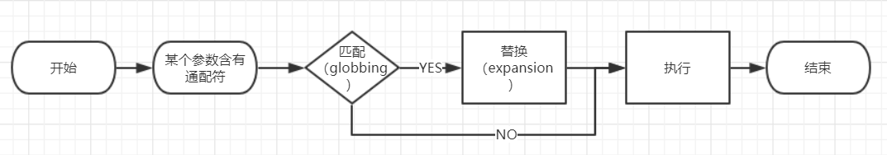

通过单引号将参数括起来，将通配符当作普通字符。

通配符：
* `*`：匹配0至多个的任意字符
* `?`：匹配一个任意字符
* 等等。。。

例子（下面说的文件名包含目录名，**并且文件名也即路径**）：
>* `at*`匹配当前目录中以at开始的文件名
>* `*at`匹配当前目录中以at结尾的文件名
>* `*at*`匹配当前目录中含有at的文件名
>* `*/a`中的`*`匹配当前目录的所有目录（**不会匹配多个目录**），`a`匹配次级目录的`a`。所以匹配次级目录中含有a的文件名
>* `*/*/a`匹配次次级目录中含有a的文件名。

注意，globbing过程中`*`不会匹配多个目录。但是其他匹配过程不一定，比如匹配字符串（如locate pattern）。

注意，**只对参数有效**，对option无效，比如-name fil	ename，这个option没有globbing的过程。

### Dot Files
点文件或点目录的名字以`.`开始，一般用作配置文件。点文件和普通文件没有什么区别，只是一些程序默认不显示它们罢了。globbing过程也不匹配点文件，除非显示指定，如`.*`

### 环境和shell变量

#### 介绍

shell变量是shell存储的临时变量，存储字符串值。
```bash
# 赋值或创建shell变量：
$ STUFF=blah
# 访问变量时需加上前缀$
$ echo $STUFF
```

环境变量类似于shell变量，但不特定于任何一个shell。**所有进程都有一个环境变量存储区**。通过export可声明一个环境变量：

```bash
STUFF=blah
export STUFF
```

#### 区别

环境变量和shell变量的**主要区别**在于：操作系统会将shell的所有环境变量**拷贝**给shell运行的程序，因此shell运行的程序不能访问shell变量，除了环境变量。

#### 相关命令

* `printenv`打印所有环境变量

### PATH
`PATH`是一个特殊的环境变量，含有一些命名路径，通过分号`:`分隔。shell在执行命令时会根据PATH指定的目录查找命令所在位置，如果程序在多个地方存在，则运行第一个匹配的程序。

命令在多个路径下存在时，先找到的优先使用。

```bash
> $ echo $PATH
> /usr/local/bin:/usr/bin:/usr/local/sbin:/usr/sbin
```

> 添加新路径时, 经常会将`PATH`置于最后, 这是为了让自己的命令优先级更高.

### input、output和redirect
所有进程都是通过**io流**对数据读入和写入的。io流分为两种：输入流和输出流。内核为进程提供了**标准输入流**、**标准输出流**和**标准错误流**，标准输出流和标准错误流都属于输出流。一般情况下，三者都被连接在terminal上。

还可以重定向标准流，而不是连接在terminal上：
1. 标准输出流
	1. 重定向到文件
		`>`以覆盖的方式写入文件中，`>>`以追加的方式写入到文件。如果文件不存在，则创建。如：
		>$ command > file
		>$ command >> file
	2. 重定向到输入流
		管道`|`将标准输出流定向到标准输入流。需要命令支持标准输入流，大部分命令都支持，可以通过man查看，如文法中出现类似`[FILE]`的情况，表示该文件可选，即从标准输入流中读入。
		
		>$ head /proc/cpuinfo | tr a-z A-Z
2. 标准错误流
	重定向标准输出流并不会重定向标准错误流。
	1. 重定向到文件
		`2>`用于重定向标准错误流，2是标准错误流的流ID（stream ID），默认1（标准输出流）
		> ls /ffffffff >f 2>e
		> 重定向标准输出流到文件f，重定向标准错误流到文件e
	2. 重定向到标准输出流
		`>&`可以重定向到其他流
		
		>$ ls /fffffffffff  >f 2>&1
4. 标准输入流
	`<`可以重定向文件到标准输入流，不常用，因为很多命令本身支持文件作文输入流。
	
	>$ head < /proc/cpuinfo

## 基本命令
### ls
`ls`命令列出目录中的全部内容（不包括以前缀`.`开始的文件）。默认显示当前目录。

>```bash
>ls [OPTION]... [FILE]...
>```
>* `-l`	显示文件的详细信息，不同类型的文件显示不同的颜色
>* `-a` 列出所有的文件，包括隐藏文件（“.”开头）
>* `-d` 查看目录，而不是目录中的内容
>* `-S` 通过文件大小排序
>* `ll` 为`ls -l` 的别名
>* `-h` 文件大小显示为人类可读的方式
>
>------------
>
>* 样式类选项
>  * `--color[=WHEN]`: 文件类型是否以颜色区分
>
>    * `always`(默认): 一直是.
>    * `auto`: 在终端中有颜色
>    * `never`: 一直不
>
>  * `-F,--classify`: 是否添加后缀以区分文件类型
>
>    > 如`*`表示普通文件, `/`表示目录, 等等
>
>  * `--file-type`(推荐使用): 同样添加后缀, 但普通文件不加`*`

`ls -l`的各项内容为：
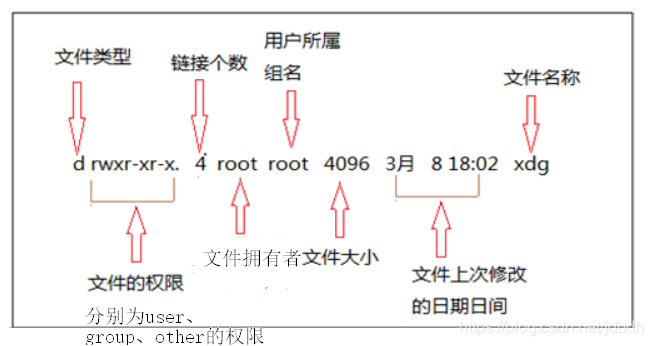

第一个字符表示文件类型，有：
* d：目录文件	
* l：链接文件	
* b：块设备文件	
* c：字符设备文件	
* p：管道文件	
* -：表示普通文件

链接个数：指向文件的引用，包括`.` , `..` 和hard link，不包括symbolic link

### cp
拷贝文件，主要有两种形式：
>cp SOURCE DEST    如cp file1 file2
>cp SOURCE... DIRECTORY  如 cp file1 ... fileN dir
>* `i`表示覆盖文件前提示
>* `-n`不覆盖，因此不用提示
>* `-f`强制写入，目的文件不能打开则删除重试
>* `-r`递归拷贝目录

source也可以为目录，但是需要`-r`;cp被别名为`cp -i`，由于别名缘故，覆盖必提示，即使使用`-f`，[解决办法][1]：
>/bin/cp -rf /zzz/zzz/* /xxx/xxx
>或
>yes | cp -rf /zzz/zzz/* /xxx/xxx

[1]:https://stackoverflow.com/a/8488293/10248407

### type
从上面看到了，bash shell提供了别名功能，比如`ls`，`ll`，`cp`都被别名。type用来查看输入的命令是如何解析的，比如是内部命令、外部命令，还是别名，`-a`可以打印更多信息，比如命令位置。
>type [-a] name

>[root@localhost Desktop]# type ls
>ls is aliased to 'ls --color=auto'
>[root@localhost Desktop]# type -a ls
>ls is aliased to `ls --color=auto'
>ls is /usr/bin/ls

### cat
cat用来合并多个文件，然后输出。
>cat [OPTION]... [FILE]...
>* `-n`：编号所有行
>* `-A`：显示所有特殊字符，相当于`-vET`，其中`E`显示`\n`为`$`，`T`显示`\t`为`^I`，`v`用`^`和`M`显示其他特殊字符（貌似非ascii都被当做特殊字符了）

### mv
移动（或重命名）文件。
>mv [OPTION]... [-T] SOURCE DEST
>mv [OPTION]... SOURCE... DIRECTORY
>* `-i`：覆盖前提示
>* `-n`：不覆盖
>* `-f`：覆盖前不提示

source可以为目录，无需`-r`；同样mv别名为`mv -i`；注意与cp的不同。

### touch
创建文件，如果已存在，则仅更新文件的`修改时间`（可通过`ls -l`查看）。
>$ touch file

### rm
删除文件或目录。默认不删除目录，需要加`-rf`，慎用。
>rm [OPTION]... FILE...

### echo
显示字符串参数到标准输出。常用于流的重定向、输出shell变量等。
>echo "a string" >> filename
>echo $HOME

## 目录相关
unix的目录体系结构从`/`开始，即根目录。
* 绝对路径：以`/`开始的路径，如`/usr/lib`
* 相对路径：不以`/`开始的路径，如`dir/file`
* `..`：指向父目录
* `.`：指向当前目录

### cd
更改**当前工作目录**，即当前进程运行的目录。默认`HOME`变量，即无参数时跳到家目录。

```bash
#跳转到目录
$ cd dir
#无参数，默认家目录：
$ cd  
# ~ 也表示家目录
$ cd ~ 
# - 等于$OLDPWD，即上一个目录
$ cd -
```

### mkdir
创建新目录
>`mkdir dir`
>
>* `-p`：如果父目录不存在则创建

### rmdir
删除**空**目录，`-p`删除目录即祖先，如`rmdir -p a/b/c` 等于 `rmdir a/b/c a/b a`

*有必要可以尝试`rm -rf dir`*

### pwd
pwd（print working directory）打印当前工作目录。
>`-P`：避免所有的符号链接，即打印文件真正位置所在。

## Intermediate Commands
### grep
打印在文件或者输入流中**含有**被正则表达式匹配内容的**行**。
>grep [OPTIONS] PATTERN [FILE...]
>* `-i`：忽略大小写
>* `-v`：Invert the sense of matching, to select non-matching lines.
>* `-E`(`egrep`)：使用扩展正规表达式

看了`man grep`后，发现**基本正则**（grep）和**扩展正则**（egrep）基本没什么区别，但grep更符合我的预期。所有语言的正则语法都差不多，可参考：[正则表达式--java][2]

[2]:https://blog.csdn.net/jdbdh/article/details/82702285

### less
查看文件内容，一次一屏幕，more的增强版。less开始时不会读取全部文件内容，因此比vim、cat更快。

阅读文件时一些方便的命令：
>f：下一页 b：上一页
>j：下一行 k：上一行
>g：跳到第一行 G：跳到最后一行
>/pattern：前向搜索，正则匹配
>?pattern：后向搜索，正则匹配
>n：搜索下一个
>N：搜索上一个
>**h：显示命令的总结（重要，必记）**
>v：使用默认编辑器编辑该文件

### head and tail
快速浏览文件或数据流的部分内容。
>head file 默认显示前10行
>`-n k`：显示前k行

>tail file 默认显示后10行
>`-n k`：显示后k行

小技巧!

* 显示第16到第20行：

    ```bash
    $ cat -n filename | head -n 20 | tail -n 5
    ```

* 实时输出

  ```bash
  tail -f filename
  ```

### file
**猜测**文件类型，通常很准确。
>$ file file

### diff
一行一行的比较两个文件
>$ diff file1 file2

### sort
Write sorted concatenation of all FILE(s) to standard output.

和cat类似。

## 文件查找
### find
在以给定目录为根的目录树中，搜索文件。该命令比较复杂，先给出最简形式，以后补充：
```bash
$ find dir -name fileBaseName -print
$ #或
$ find dir -regex fullPath -print
```

* `dir`可以含有通配符；
* `-name` 匹配文件的base name（即没有leading directories）, 可以使用通配符；
* `-regex` 匹配文件的全路径名, 可以使用正则表达式
* `-print`打印找到的文件的全名（full file name）。

### locate
在系统内建的数据库中查找文件，因此速度更快。该数据库会周期性的更新，如果一个文件在更新前添加进来，locate则不能找到该文件。
>locate pattern
>pattern含有通配符，匹配整个字符串；如果没有，相当于\*pattern\*
>例子（匹配/usr/bin/cp）：
>$ locate */cp

>locate -r regexp
>使用正则表达式；一直是匹配字符串部分内容。
>例子（匹配/usr/bin/cp）：
>$ locate -r .*/cp$

### whereis
查找$PATH目录下的文件，定位含有name的文件名
>$ whereis name

### which
在$PATH目录下查找命令的全路径名
>$ which programname

除此之外，`type -a`能够查找一些命令所在位置。

## Miscellaneous
### passwd
passwd用来改变密码。需要输入旧密码和新密码两次。通过调用Linux-PAM和Libuser API接口实现该命令。

### chsh
改变你的登录shell，默认使用bash。
>* chsh -s shell ：设置新的shell，必须存在于/etc/shells。shell可以为全路径名，或者可执行文件名。
>* chsh -l ：打印/etc/shells中的所有shell。

### sleep
延迟一定时间
>sleep NUMBER[SUFFIX]...
>suffix默认s，可选m、h、d

### cal
显示日历（calendar），默认显示当月
>cal [options] [[[day] month] year]

### date
打印或设置日期。这里不展开
>$ date
>Wed Dec 19 18:19:46 CST 2018

### groups
显示当前用户所属组

### dmesg
显示系统缓存（日记）。

### lsb_release
打印特定于发行版的信息，如`lsb_release -a`

### alias

给命令起别名, 如

```bash
#简化git操作
alias push="git add . && git commit -m '补充' && git push"
#取消ls匿名
alias ls=ls
```

> 通过覆盖, `ls`可以取消高亮

## Vim

vim是一个非常强大的编辑器，也是linux默认的命令行编辑器。源于vi，而如今linux上的vi命令成了vim的别名。vim功能即使强大，但太繁杂了，这里只给出必要内容。

参考：https://www.tutorialspoint.com/vim/index.htm

### vim模式
* **Command mode**：进入vim后的默认模式。该模式下，可以使用很多命令，如拷贝、粘贴、删除、查找等等。
* **Insert mode**：Command模式下，很多方法可以进入该模式，如`i`（insert插入），`a`（append添加）等。该模式下可以进行内容编辑。按`ESC`退回Command模式。
* **Command line mode**：Command模式下，键入`:`进入该模式。该模式下可以执行一些命令，如保存、退出等等。按`ESC`退回Command模式。
* **Visual mode**：Command模式下，键入`v`进入该模式。该模式下可以可视化选择文本，并在之上执行命令。执行完命令后（如拷贝），会自动回到Command模式。

有时候这些模式不用特意区分，因为界限有点模糊。

### navigating
在Command和Command line模式下，都可以通过命令移动光标：
* `h`：向左移一位
* `l`：向右移一位
* `j`：向下移一位
* `k`：向上移一位

注意，可以移多位，只需在前面加数字，如下移10位：10j

* `0`：移到行开始
* `$`：移到行尾
* `:0`：移到第一个行
* `:$`：移到最后一行
* `ctrl+f`：下滚一屏
* `ctr+b`：上滚一屏
* `:n`：跳到第n行

### editing
从Command进入insert模式有很多中方法，下面给出有用的：
* `i`：插入文本在光标前
* `I`：插入文本在行首
* `a`：添加文本在光标后
* `A`：添加文本在行尾
* `o`：光标之下添加新行
* `O`：光标之上添加新行

未进入insert模式前可以进行拷贝、粘贴、删除等操作：
* `x`：从光标后删除一个字符
* `X`：从光标前删除一个字符
* `dd`或`D`：删除整行
* `y`：拷贝整行，但是在visual模式下是拷贝被选中的内容。
* `p`：在光标后粘贴

注意，在visual模式下被选中的内容可以看做一个字符。

撤销、重做：
* `u`：撤销
* `ctrl+r`：重做

### 搜索
* `/expression`：向下搜索，不存在正则。
* `?expression`：向上搜索。
* `n`：查找下一个
* `N`：查找上一个

### Buffer和Swap
打开文件时，文件内容会被读入**Buffer**中，如果文件不存在，则Buffer为空。buffer位于RAM。在写入时，才将buffer中的内容写入到真正的文件中，如果文件不存在则创建。

为了防止意外发生，导致buffer未及时写入文件中（即编辑过程中断电）。vim会周期性地将buffer写入到对应的**swap**文件中。通过比对文件和swap文件时间可以查出是否发生异常，然后利用swap文件恢复。

### 其他
* `:w`：保存文件
* `:q`：离开

如果操作失败，则使用`!`强制保存或退出。通常`wq`一起使用，必要时`wq!`

------------
可以为单个用户配置vim，如每次开始vim时默认显示行号：
>$ cd  //进入家目录
>$ vim .vimrc //打开该文件，没有将被创建
>set nu //设置文本内容
>:wq //保存

## 获得帮助
### man
通过man可以查阅相关命令指南（manual pages），但是内容很多，不会告诉你重点，也不适合作为教程。man手册是通过`less`命令显示的，因此less的快捷键能够使用。

manual pages被分为了很多部分，如：
| section | description                                                  |
| ------- | :----------------------------------------------------------- |
| 1       | Executable programs or shell commands                        |
| 2       | System calls (functions provided by the kernel)              |
| 3       | Library calls (functions within program libraries)           |
| 4       | Special files (usually found in /dev)                        |
| 5       | File formats and conventions eg /etc/passwd                  |
| 6       | Games                                                        |
| 7       | Miscellaneous (including macro packages and conventions), e.g. man(7), groff(7) |
| 8       | System administration commands (usually only for root)       |
| 9       | Kernel routines [Non standard]                               |

man在查找手册时，默认只会显示最近的一页。`
* `-a`会查找全部
	
	>$ man -a passwd
	
* 如果知道关键字，不知道具体名字
	
	>$ man -k keyword
	
* 如果知道具体section，如passwd(5)
	
	>$ man 5 passwd

----------
man手册的语法：
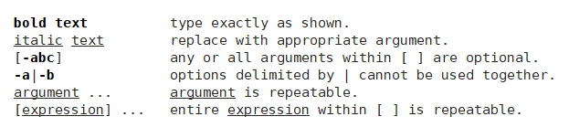

------------
命令的选项（options）表示的形式**至多**三种，如下：
1.   **UNIX options**, which may be grouped and must be preceded by a dash.
2.   **BSD options**, which may be grouped and must not be used with a dash.
3.   **GNU long options**, which are preceded by two dashes.

一般使用第一种。

### 其他帮助
* info：内容比man更多，更复杂
* `--help`或`-h`：一些命令自带简单帮助，通过该option可打印。
* /usr/share/doc：一些帮助文档会被放入此处
* Internert：网络上要啥有啥

### man页面安装
在`/usr/share/man/`和`/usr/local/shar/man/`下有很多子文件夹，每一个子文件夹存放一类的man页面。如果有额外的man页面，则应该放入`/usr/local/share/man/`下对应的子文件夹中，然后执行`mandb`以更新man的内部数据库，便能使用`man command`查看命令手册了。
>实际上，man page就是个文本，可直接用less查看。

## 进程管理

### ps
显示当前进程信息。常用BSD风格的选项（option）：
| 命令     | 描述                                                      |
| -------- | :-------------------------------------------------------- |
| ps       | 显示**当前用户**和**同一终端**下的所有进程                |
| ps x     | 显示**当前用户**的所有进程                                |
| ps ax    | 显示系统内的所有进程                                      |
| ps u     | 显示更详细的信息                                          |
| ps u pid | 打印进程号为pid的进程的详细信息，其中$$含有当前shell的pid |

显示时一些列的含义：
| USER         | PID    | %CPU      | %MEM         | VSZ                | RSS                | TTY    | STAT     | START    | TIME            | COMMAND |
| ------------ | ------ | --------- | ------------ | ------------------ | ------------------ | ------ | -------- | -------- | --------------- | ------- |
| 进程所属用户 | 进程id | cpu利用率 | 驻留内存比例 | 虚拟内存大小（KB） | 驻留内存大小（KB） | 终端？ | 进程状态 | 启动时间 | cpu累积使用时间 | 命令    |

stat第一个字符表示总的状态，其他字符表示额外的信息：
| 第一个字符 | 含义                                                         |
| ---------- | :----------------------------------------------------------- |
| D          | uninterruptible sleep (usually IO)                           |
| R          | running or runnable (on run queue)                           |
| S          | interruptible sleep (waiting for an event to complete)       |
| T          | stopped by job control signal                                |
| t          | stopped by debugger during the tracing                       |
| W          | paging (not valid since the 2.6.xx kernel)                   |
| X          | dead (should never be seen)                                  |
| Z          | defunct ("zombie") process, terminated but not reaped by its parent |

| 其他字符 | 含义                                                         |
| -------- | :----------------------------------------------------------- |
| <        | high-priority (not nice to other users)                      |
| N        | low-priority (nice to other users)                           |
| L        | has pages locked into memory (for real-time and custom IO)   |
| s        | is a session leader                                          |
| l        | is multi-threaded (using CLONE_THREAD, like NPTL pthreads do) |
| +        | is in the foreground process group                           |

### kill
让内核发送一个**信号**给进程，常用于结束进程。
>* 命令形式
>  * `kill [-s signal] pid...`  
>  * `kill [-signal] pid...`
>  * `kill -l`
>* 选项
>
>* `-s`指定要发送的信号，默认`term`。`signal`可以是信号名或对应的数值。完整信号名前3个字符“SIG”可以省略。
>* `-l`打印所有信号及对应数值。

信号按照功能（Action）可以分为5类，每一类都有默认处理方式，如：
| Action | 默认处理                                                     |
| ------ | :----------------------------------------------------------- |
| Term   | Default action is to terminate the process.                  |
| Ign    | Default action is to ignore the signal.                      |
| Core   | Default action is to terminate the process and dump core     |
| Stop   | Default action is to stop the process.                       |
| Cont   | Default action is to continue the process if it is currently stopped. |

进程可以捕获（catch）信号，然后执行自己的处理，如果没有捕获则会执行默认处理。如ping捕获`INT`信号（`ctrl+c`），打印最终结果并结束程序。但是`kill`和`stop`信号不能够被捕获，因此必定执行默认行为。

完整信号参考：`man 7 signal`，部分信号如下：
| signal  | value    | action | comment                      |
| ------- | -------- | ------ | :--------------------------- |
| SIGINT  | 2        | Term   | `ctrl+c`发出                 |
| SIGQUIT | 3        | Core   | `ctrl+\`发出                 |
| SIGKILL | 9        | Term   | 不会被捕获，用于强制结束进程 |
| SIGTERM | 15       | Term   | kill默认发送信号             |
| SIGCONT | 19,18,25 | Cont   |                              |
| SIGSTOP | 17,19,23 | Stop   | 不会被捕获，用于强制停止进程 |
| SIGTSTP | 18,20,24 | Stop   | `ctr+z`发出                  |

*为什么有的信号对应多个数值？因为一些信号在不同处理器架构上不兼容，所以最好使用信号名*

*那`ctrl+D`会发出信号吗？不会，它只是在terminal的标准输入中表示文件结束（EOF）。*

### Job Control
job control是shell提供的一个功能。job就是一行命令的抽象概念，这个命令可以是管道，因此一个job可以是多个命令的组合。在操作系统中job被表示成**进程组**（process group），每个job都有个**job ID**。

**job控制**就是暂停、恢复或结束job（进程组）中的所有进程。更复杂的操作可以通过发送信号（kill命令）实现。

进程可以在后台（background）或前台运行。一般进程运行在前台，如果运行在后台，为了确保后台进程的不会输入输出到terminal上，可以使用重定向防止此事发生。

主要使用的命令：
* `jobs`：列出**当前shell**中所有**暂停**或**后台运行**状态的job。同时显示它的job id。
* `fg [%jobID]`：指定job id，将该job带入前台。如果没有job id，默认最近进入jobs列表的job。
* `bg [%jobID]`：指定job id，带入后台。若有没有，默认最近的job。
* 暂停：如果是前进进程，使用`ctrl+z`；其他的使用`kill -stop %jobID`
* 结束：`ctrl+c`，如果不行，则`kill -kill %jobID`强制结束。

参考：
https://en.wikipedia.org/wiki/Job_control_(Unix) 
http://www.aboutlinux.info/2005/05/job-control-in-linux.html

### top
top类似ps，用来显示进程，但能够动态显示进程，并且默认按cpu利用率排序。

一些单词描述：
* PID – the process ID of the task.
* USER – task’s owner.
* PR – the priority of the task.
* NI – the nice value of the task.
* VIRT – the total amount of virtual memory used by the task.
* RES – the non-swapped physical memory the task has used.
* %CPU – the task’s share of the CPU time.
* %MEM – the task’s share of the physical memory.
* COMMAND – the command used to start the task.

排序：
* P：按cpu利用率排序
* M：按内存使用率排序
* R：反转排序
* h：帮助
* q：离开

杀死进程：
键入k和进程的pid

## 文件
### 文件权限
`ls -l`输出的第一列为**file mode**，由四部分组成：文件类型、user权限、group权限和other权限。如：
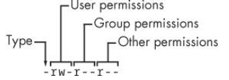
这些权限都有三位权限位组成，分别是`r`、`w`、`x`。

实际上还有一组特殊权限SUID（`s`）、SGID（`s`）、SBIT（`t`），如果有的话会分别显示在user、group、other权限的**第三位**。如果原先该位置上的`x`权限不存在的话，特殊权限位会显示为**大写**。

每位的含义：
* `r`：文件或目录内容可读。
* `w`：文件或目录内容可写。
* `x`：文件可执行或目录可搜索（即访问目录中文件内容的“开关”）。
* `-`：表示此位无权限。
* SUID（`s`）：仅对二进制程序有效，该程序设置user ID，即以user的身份运行。例如，`passwd`的权限和拥有者为`-rwsr-xr-x. 1 root root`，作为普通用户有`r-x`权限，可执行它；由于suid权限的存在，程序以root身份运行程序，并读取只有root权限才可访问的/etc/passwd文件。
* SGID（`s`）：仅对二进制程序有效，该程序设置group ID，即拥有group的身份。
* SBIT（`t`）：仅对目录有效，该目录下的文件或目录只能它的拥有者（user）删除或重命名。

---------------
**提示**
* 目录存有文件的文件名和指向I-Node的引用，因此rw针对的也是这些内容；如果要访问I-Node，则需要x权限。
因此如果用户对目录只有`rw-`权限，可读取文件名（如ls），但不能读取更多内容（如`ls -l`出现很多问号），但可以删除新建文件（w权限）；如果用户对目录只有`--x`权限，那么不能访问目录的内容，但是能访问I-Node。*如果I-Node代表可执行文件，可以执行吗？仅限二进制文件（见下一点）*
* 脚本文件必须有read权限，因为解析器需要读取脚本内容；二进制文件不必，因为是内核读取文件内容的。
* I-Node节点含有文件属性和所有数据块的引用。
* 文件设置不可写，为何vim还能强制写入？因为vim写入时，是通过新文件（swap）替换旧文件实现的，是对目录操作，和目录权限有关！！！同理，文件不可读时，vim是真的没有读取文件，创建了个空Buffer。
* 文件所属者（user），可以使用组身份（group）或者其他人身份（other）吗？不能！！即使other权限比user权限大。同理组成员不能使用other身份。

### umask
umask和文件、目录建立时的权限默认值有关。也就是文件或目录初始值减去umask。先看umask默认值
>$ umask
>0002
>$ umask -S
>u=rwx,g=rwx,o=rx
>第一个表示特殊权限，其他三个数值分别表示user、group、other权限

* 文件：普通文件没有可执行权限，因此初始`-rw-rw-rw-`，即666，减去umask（002），为664（`-rw-rw-r--`）
* 目录：进入目录需要x权限，因此初始`drwxrwxrwx`，即777，减去umask（002），为775（`drwxrwxr-x`）

umask命令也可以设置默认值
>umask octal-mode
>4位八进制，可以省略最高位特殊权限

### chmod
改变文件权限。
```bash
chmod [OPTION]... MODE[,MODE]... FILE...
chmod [OPTION]... OCTAL-MODE FILE...
```

可以通过符号表示或八进制数修改权限：
* **symbolic mode**(符号模式)
	
	语法形式：`[ugoa...][[+-=][perms...]...]`
	
	* 其中`perms`为`rwxXst`中的零个或多个。
	
	* `u`为user用户, `g`为group组, `o`为other其他人, `a`为all所有人；
	
	* `+`表示添加权限位；`-`表示删除权限位；`=`表示设置该三位权限，没有设置的默认无。其他三位是特殊权限位.
	
	* 例子：
	
	  ```bash
	  $ chmod g+r file
	  $ chmod o-r file
	  $ chmod go+r file
	  $ chmod u+s file
	  $ chmod o+t file
	  ```
	
* **octal-mode**(八进制模式)

  * 使用四个八进制数表示，第一个设置特殊权限，可以省略不写。其他三个分别对应用户,组,其他人的权限. 每一位都是由`rwx`组成的三位二进制数的数值, 因此`rwx`的权重分别为4,2,1. 相应的, 特殊权限位的权重分别为`suid`(4),`sgid`(2),`sbit`(1)。

  * 例子：

    ```bash
    chmod 664 file
    chmod 775 directory
    chmod 1775 directory  //设置了sbit位
    ```

  > **注意**，特殊权限位除非明确设置，否则不会被清楚或改变；貌似只有文件拥有者或root可以修改文件的权限位。

### chown
改变文件所属用户或组
>```bash
>chown [OPTION]... [OWNER][:[GROUP]] FILE...
>```
>
>* `-R`：递归更改


### 链接文件
创建链接文件后，对链接文件操作相当于对源文件操作。链接文件分为：硬链接文件（hard link）和符号链接文件（symbolic link）。

hard link是一个直接指向源文件的文件，即I-Node与源文件一致；symbolic link是一个间接指向源文件的文件，即该文件含有源文件路径的文本。
>`ln [-s] target linkname`
>**target必须是全地址名**！！可借助环境变量`$PWD`
>
>* `-s`表示创建符号链接，目标文件可以不存在；否则创建硬链接，目标文件必须存在

## 归档及压缩
### 压缩
`gzip`是最常用的一个压缩命令，将文件压缩，并自动为名字添加后缀：`.gz`。`gunzip`是对应解压命令，将文件解压，去掉后缀。压缩和解压后源文件都会消失。除此之外，还有其他同类工具，如下表格：

| 压缩命令 | 解压命令 | 默认后缀 | 压缩率 | 速度 | 备注                         |
| -------- | :------- | :------- | :----- | :--- | :--------------------------- |
| gzip     | gunzip   | `.gz`    | 低     | 最快 | gunzip也可以解压 `.Z`        |
| bzip     | bunzip2  | `.bz2`   | 高     | 较快 |                              |
| xz       | unxz     | `.xz`    | 最高   | 最慢 |                              |
| zip      | unzip    | `zip`    | ？     | ？   | 主要为了兼容windows的zip档案 |

### tar--归档
tar主要是让多个文件或压缩包归为一个档案。除此之外它还可以使用上面的压缩工具对档案压缩或解压。
>tar [OPTION...] [FILE]...
>file可以是文件或者目录
>主要操作：
>* `-c`：创建档案
>* `-x`：提取档案内容
>* `-t`：列出档案所有文件
>* `-r`：添加文件到档案后
>常用选项：
>* `-v`：详细列出所有操作步骤
>* `-f`：档案名，后面必须接档案名
>* `-z`：使用压缩工具gzip
>* `-j`：使用压缩工具bzip2
>* `-J`：使用压缩工具xz
>其他选项：
>* `--skip-old-files`：提取文件时不覆盖以存在文件。**默认覆盖**。
>* `-p`：提取文件时，保留它的文件权限。root用户默认此选项。

一些例子：
```bash
$ tar -cvzf archive.tar.gz file1 file2 directory
$ tar -xvzf archive.tar.gz
```

创建档案时，对档案后缀没有强制规定，但是最好使用常用后缀名。比如：归档不压缩，`file.tar`；归档并用gzip压缩，`file.tar.gz`等等之类。注意到一些后缀，如`.tgz`与`.gz`相同，`.taz`与`.tar.Z`相同。

## 目录结构
linux的发行版都准守Filesystem Hierarchy Standard（FHS），每个目录都有自己的含义。但会FHS也有一些模糊的地方，因此不同的发行版的目录结构会有一定的不同。
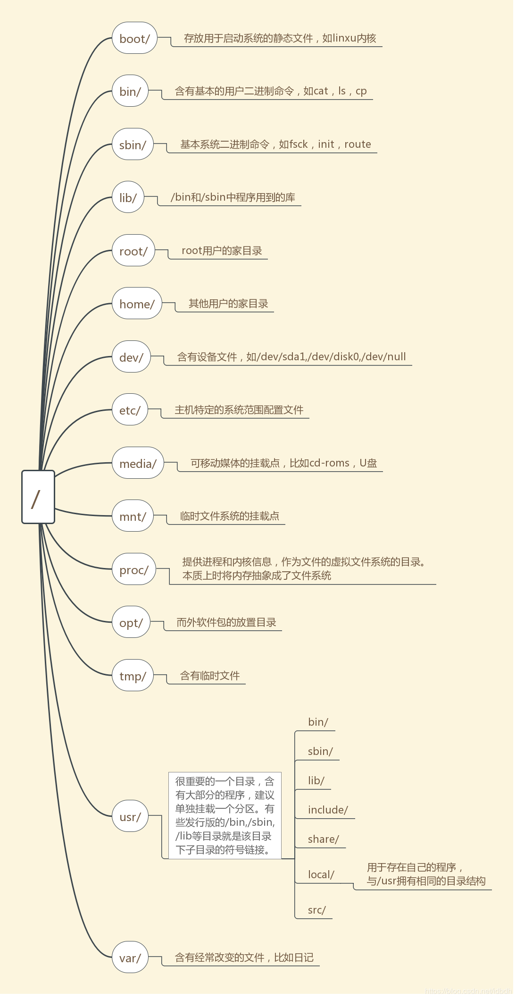
注意：

* linux中，一切皆为文件。
* `/sbin`下的命令通常需要root权限才能执行。
* `/tmp`目录下的内容一般会在主机自启时清空

极力推荐，里面的目录结构概括的比我好：[An introduction to Linux filesystems](https://opensource.com/life/16/10/introduction-linux-filesystems)

参考：
[redhat filesystem-fhs](https://access.redhat.com/documentation/en-US/Red_Hat_Enterprise_Linux/4/html/Reference_Guide/s1-filesystem-fhs.html)
[wiki fhs](https://en.wikipedia.org/wiki/Filesystem_Hierarchy_Standard#cite_ref-/opt_6-0)
[fhs geeksforgeeks](https://www.geeksforgeeks.org/linux-file-hierarchy-structure/)

## root权限运行命令
### sudo
运行命令时以其他用户身份运行。默认以root身份运行。它会同时设置`euid`和`ruid`, 见6.1小节
>$ sudo groups
>root

首次运行sudo时，需要输入当前用户密码，然后默认持续5分钟不用再次输入密码。你没看错，不是输入root用户密码，如果需要，可以使用`visudo`命令修改`/etc/sudoers`文件，参考：https://superuser.com/a/1134306

使用时, 可能会碰到命令不存在的问题, 这是因为sudo只会在特定目录下寻找命令, 与用户或root的`PATH`变量无关. 由`/etc/sudoers`的`secure_path`决定, 可自行修改它.

### su
开启**新shell**，以其他用户身份登录。默认root登录。
>su [options...] [-] [user [args...]]
>* `su`：root身份登录，不改变当前目录，仅改变环境变量：HOME、SHELL、USER、LOGNAME
>* `su -`：root身份登录，启动shell为login shell，和真实登录的环境一致。即环境差不多都改变了。
>* `su - user`：以其他用户身份登录了。

如果要退出，可以使用`exit`命令。

## 待补充
* top命令
* 链接文件
* find命令
* ...

# 三 设备
在linux中，一切皆为文件，比如设备、网络、硬盘或其分区等等，都在表示	为文件。设备被表示为**设备文件（Device Files）**（也被称为**device node**），是一个与**设备驱动（device driver）** 交互的接口。在设备驱动被加载进内存后，如果有对应设备的插入或拔出，linux内核会发送事件**uevent**信息给用户空间中的守护进程（**daemon**）**udev**，udev收到事件后还会将它发送给其他进程。udev为了维护`/dev`目录，会动态创建或删除device node。udev的功能依赖于`sysfs`文件系统，使得udev能够在用户空间中获得更多关于设备的信息。

设备文件分为块设备和字符设备，他们的区别在于读写方式的不同。设备文件也可以对应虚拟设备，只要有对应的驱动程序。*貌似管道文件也是设备文件？*

## /dev与/sys
设备文件都被存于`/dev`下，为了通过对设备文件操作直接作用到设备中，`/dev`会被挂载到专门的文件系统`devtmpfs`中（不要与`tmpfs`混淆）。

`ll /dev`会显示所有的设备文件，权限前的第一个字符表示文件类型，`b`表示块设备，`c`表示字符设备等等。日期前的两个数字分别表示**主和次设备号**，相似的设备通常拥有相同的主设备号，如sda3和sdb1。通过主次设备号用于标识设备。

`/dev`下的设备文件是用于操作设备的接口，但它不提供更多的信息，如设备的属性等。这些信息由`/sys`目录下对应的文件提供，如`/dev/vda`对应`/sys/devices/pci0000:00/0000:00:05.0/virtio2/block/vda`，这是一个**目录**，目录下的各种文件包含设备的详细信息，如dev文件含有主次设备号。

那么如何从`/dev`中找到`/sys`下对应的目录呢？
* 因为设备文件是通过udev创建的，因此可以通过它的管理工具`udevadm`来获得设备文件详细的信息。
	```bash
	udevadm info --query=all --name=/dev/vda
	```
* `/sys/block`目录下会含有系统中可用的块设备目录的符号链接。同样，`/sys/dev`含有主次设备号与对应目录的关系。

`/sys`目录下含有一些关于内核子系统、硬件设备等信息，这些信息由[虚拟文件][3]（即访问时临时计算出数据的文件）提供，需要挂载到专门的文件系统`sysfs`中。

[3]:https://en.wikipedia.org/wiki/Virtual_file

## 命名约定
系统加入设备后，udev给设备命名的规范：
* `SCSI driver`, also used by libATA (modern PATA/SATA driver), USB, IEEE 1394, etc.即使底层使用的设备和驱动不一样，但是这些设备最顶层的驱动还是scsi。然而真正的SCSI设备已经被淘汰了，但SCSI协议由于它的适用性被保留了下来。
	* `sd`: mass-storage driver
		* `sda`: first registered device
			* `sda4`: last partition on this disk (example)
			* `sda6`: second logical drive in the extended partition (example)
		* `sdb`, `sdc`, etc.: second, third, etc. registered devices
	* `ses`: Enclosure driver
	* `sg`: generic SCSI layer
	* `sr`: “ROM” driver (data-oriented optical disc drives; scd is just a secondary alias)
	* `st`: magnetic tape driver
* `hd`: (“classic”) **IDE driver** (previously used for ATA hard disk drive, ATAPI optical disc drives, etc.)老式PATA硬盘使用的文件名，已经很少见了，因此不展开讲解。
* `fd`: (platform) floppy disks（软盘）
* 终端`tty*`,`pts/*`：都代表终端（**terminals**），不过tty表示本地终端，或是真实硬件或是内核模拟出来的；pts表示伪终端，通过用户空间程序模拟出来的。
* 串行端口终端`ttyS*`：相当于windows上的串口。
* 并行端口`lp*`
* 等等

## terminal、console、shell
**terminal**（终端）和**console**（控制台）都是字符设备，功能上并没有什么区别，都是与你的显示器和键盘交互的。启动linux但没有启动xwindow的屏幕就是console，而进入xwindow后打开的terminal就是terminal，通过ssh连接打开的终端也是terminal。

[shell][4]不是一种设备，而是程序，一个与操作系统服务交互的用户接口。因此shell分两种：使用命令行接口（**command-line interface**）的Text(CLI) shell，和图形用户接口（**graphical user interface**）的Graphical shell。CLI shell提供命令解析的功能，通过命令与系统交互，gui shell提供图形化的操作与系统交互。
>不要以为gui程序只能在gui shell中运行，几乎只要有diplay server和它的客户端client就能运行，即使在CLI shell下。参考：[ssh 第四章][5]或尝试运行该命令：`xinit /usr/bin/firefox`

### 与设备文件的关系
console在很多linux发行版中被实现为7个virtual console，分别用设备文件`tty1`、`tty2`...`tty7`表示。一般桌面环境运行在第7个virtual console，用`tty7`表示。通过`ctrl+alt+F*`切换。

terminal则被表示为除了`tty1`...`tty7`之外的`tty*`或`pts/*`，`pts/*`是伪终端的设备文件，GUI shell打开的终端和ssh连接打开的终端都是伪终端。剩下的`tty*`是干什么用的呢？连接什么终端呢？我不知道。。

特殊的终端设备文件：
* `tty`：是当前程序的控制终端的引用，可以是`tty*`，`ttyS*`，`pts/*`等等。通过`ps`可以看到程序对应的具体终端。对于控制终端，参考[零碎知识3.8小节][6]
* `tty0`：是当前（或前台）virtual console的引用，可以是`tty1...`或`tty7`
* `console`：系统控制台（system console），默认指向`tty0`。这也是为什么开机后会输出很多系统信息的原因。

## 特殊设备文件
除了3.3.1中的特殊终端文件外，还有一些特殊的伪终端文件：
* `/dev/null` – accepts and discards all input; produces no output (always returns an end-of-file indication on a read)
* `/dev/zero` – accepts and discards all input; produces a continuous stream of NUL (zero value) bytes
* `/dev/full` – produces a continuous stream of NUL (zero value) bytes when read, and returns a "disk full" message when written to
* `/dev/random` and `/dev/urandom` – they produce a variable-length stream of pseudo-random numbers.

## 例子
命令`/etc/resolv.conf`的一个可能的数据流程如下：
>hard disk-->SATA driver-->SCSI driver-->`/dev/sda1`(分区设备文件)-->`cat /etc/resolv.conf`(命令或进程)-->`/dev/pts/1`(终端设备文件)-->终端设备驱动-->终端
----------

命令`cat /etc/resolv.conf > /etc/resolv.bak`的一个可能的数据流程如下：
>hard disk-->SATA driver-->SCSI driver-->`/dev/sda1`(分区设备文件)-->`cat /etc/resolv.conf`(命令或进程)-->`/dev/sda1`（分区设备文件）-->SCSI driver-->SATA driver-->hard disk

可以看出，重定向的原理就是重定向到了不同的设备文件。

-----------
打开virtual console1和virtual console2（ctrl+alt+F2），在console2上输入`echo "hello world" > /dev/tty1`，然后会发现console1出现了`hello world`。

## 相关命令
### dd
dd从文件或stdin读取数据，并写入数据到文件或stdout，这个过程中可能会做一些编码转换。
>* `if=file`：输入文件，默认stdin
>* `of=file`：输出文件，默认stdout
>* `bs=size`：一次读入和写入的字节数，默认512。可带有单位，如`b`(512),`K`(1024),`M`(1024^2^),`G`(1024^3^)
>* `ibs=size,obs=size`：分别是一次性读入或写入的字节数。如果相同，则使用`bs`
>* `count=num`：拷贝输入块的次数，默认一致拷贝直到文件尾。
>* `skip=num`：跳过输入的num个块，才开始读。
>* `conv=CONV`：按照CONV对数据进行转换

例子:
* 备份MBR
	```bash
	dd if=/dev/sda of=/tmp/myMBR.bak bs=512 count=1
	```
* 制作光盘镜像
	```bash
	dd if=/dev/sda of=~/disk1.img conv=noerror,sync
	```
其中，noerror表示读取出错后继续；sync表示，如果读取字节不够，填充NULL（即数值0）。一般情况下sync无用，只有配合noerror在读取失败时才会填充。这样保证及时镜像文件部分损坏，但可用。

### mknod
当设备文件意外丢失或想要创建命名的管道文件时，可以使用mknod创建。但需要事先知道主次设备号。如：
```bash
 mknod /dev/sda1 b 8 2
```
b为块状设备，主次设备号分别为8，2。

### udevadm
udevadm用于管理守护进程udev，因此可以查出设备文件的全部信息：
```bash
udevadm info --query=all –-name=/dev/sda
```

### lsscsi
列出所有的scsi设备

### lsblk
列出所有的块设备（除了RAM disk）。实现：从sysfs文件系统中得到数据。

### lspci

列出所有pci设备的信息, 显卡就是该类设备.

* 查看集显

  ```bash
  lspci|grep -i vga
  ```

* 查看独显

  ```bash
  lspci| grep -i nvidia
  ```

  

## 实战

### 找出当前使用显卡

* 方法一: 使用`glxinfo`命令

  1. 一般不存在, 先安装该命令

     ```bash
     sudo apt install mesa-utils
     ```

  2. 输入

     ```bash
     $ glxinfo|egrep "OpenGL vendor|OpenGL renderer"
     OpenGL vendor string: Intel Open Source Technology Center
     OpenGL renderer string: Mesa DRI Intel(R) Sandybridge Mobile
     ```

     表明正在使用Intel集显

  3. 如果使用的是bumblebee方案, 你可强制它使用独显

     ```bash
     $ optirun glxinfo|egrep "OpenGL vendor|OpenGL renderer"
     OpenGL vendor string: NVIDIA Corporation
     OpenGL renderer string: GeForce GT 555M/PCIe/SSE2
     ```

* 方法二: 使用`lspci`命令, 活动的显卡会显示`[VGA controller]`信息

  ```bash
  $ lspci -v|grep '\[VGA controller\]'
  00:02.0 VGA compatible controller: Intel Corporation Device 3ea0 (rev 02) (prog-if 00 [VGA controller])
  ```

> 参考:[How to check which GPU is active in Linux?](https://unix.stackexchange.com/questions/16407/how-to-check-which-gpu-is-active-in-linux)

##  参考
[Managing devices in Linux](https://opensource.com/article/16/11/managing-devices-linux)
[Device file wiki](https://en.wikipedia.org/wiki/Device_file)
[Udev wiki](https://en.wikipedia.org/wiki/Udev#Overview)
[终端，Shell，“tty”和控制台（console）有什么区别？](https://www.zhihu.com/question/21711307/answer/124100057)
[Why are there so many /dev/tty in Linux?](https://superuser.com/questions/449781/why-are-there-so-many-dev-tty-in-linux)
[Linux系统dev/目录下的tty](https://blog.csdn.net/a746742897/article/details/52302394)
[What is the difference between Terminal, Console, Shell, and Command Line?](https://askubuntu.com/questions/506510/what-is-the-difference-between-terminal-console-shell-and-command-line)
[What is the exact difference between a 'terminal', a 'shell', a 'tty' and a 'console'?](https://unix.stackexchange.com/questions/4126/what-is-the-exact-difference-between-a-terminal-a-shell-a-tty-and-a-con)
[shell wiki](https://en.wikipedia.org/wiki/Shell_(computing))
[virtual console wiki](https://en.wikipedia.org/wiki/Virtual_console)

[4]:https://en.wikipedia.org/wiki/Shell_(computing)
[5]:https://blog.csdn.net/jdbdh/article/details/87383172#_GUIx11_137
[6]:https://blog.csdn.net/jdbdh/article/details/87189717#38_Linux__207

# 四 文件系统
尽管我们可以直接在设备文件上对整个磁盘或分区进行读写操作，但是极其不方便，只有在特定范围内使用该方式，如备份MBR、分区等。而文件系统抽象出了文件的概念，以文件夹分层构建文件的树状命名空间，可以访问的读写数据。文件系统定义了文件和目录的存储结构，致力于高的读写性能、可靠的数据完整性和安全性等。因此会出现很多的文件系统，文件系统一般属于内核实现，但是也存在用户空间内的文件系统。linux使用[VFS][41]（Virtual File System）接口层来同一不同文件系统的调用，屏蔽文件系统的细节，开发者只需要调用VFS的系统调用即可操作数据。磁盘数据访问的模式如下：
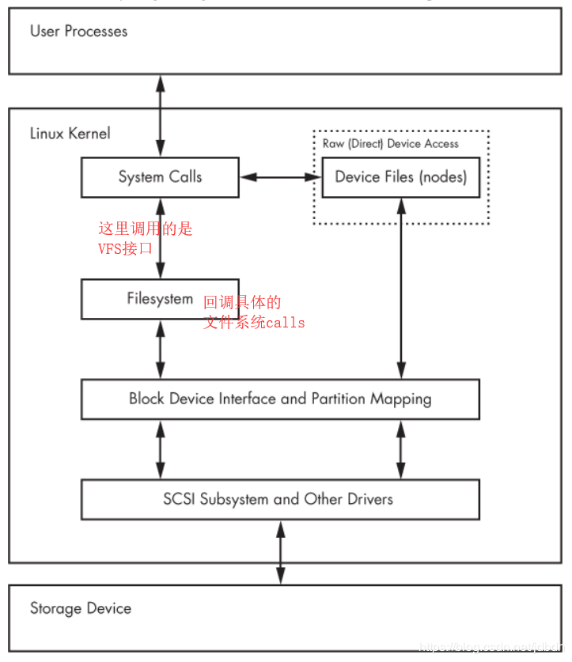
## disk
disk有很多中，计算机中光盘、磁带已被弃用，常用硬盘（hard disk）和固态硬盘（SSD）作为存储设备。这里给出硬盘的通用结构图：

可以看出，硬盘拥有多个盘片（platter），每个盘片有两个面，对应两个读写头（head）。读写头固定在arm assembly上，可以伸长或缩短，当盘片围绕轴心（spindle）旋转时即可扫描全部数据。一个head扫面过的圆称为磁道（track），磁道可划分为多个扇区（sector），**扇区是磁盘驱动读取数据的最小单位**（以前一个扇区512KB，现在4K）。所有head
同时扫描过的track组成一个柱面（cylinder）。

磁盘驱动通过[CHS][42]寻址模式，即通过Cylinder-Head-Sector三元组来确定具体的一个扇区位置。但是在操作系统中并不使用CHS寻址模式，而是[LBA][43]（Logical block addressing）寻址模式。LBA简单的认为所有的存储设备都是线性化的，很好的屏蔽了具体存储设备寻址的细节，使得其他结构的存储设备更好的被操作系统使用（如SSD）。在硬盘中，[LBA与CHS的转化][44]由磁盘驱动完成。

>**块（block）是操作系统读取disk数据的最小单位**。为了分离对底层的依赖，操作系统不使用扇区作为读写单位，而是抽象了**块**的概念。一般块大小是扇区的整数倍，可以自己设置，如格式化时可以设置。参考：[电脑中常用的“扇区”、“簇”、“块”、“页”等概念](https://blog.csdn.net/jdbdh/article/details/88350421)

## 文件系统实现
每个文件系统的实现都不同，这里介绍linux中常用的实现。

### 文件系统布局
在LBA寻址模式中，disk被视作线性空间，一个**可能的**文件系统布局如下：
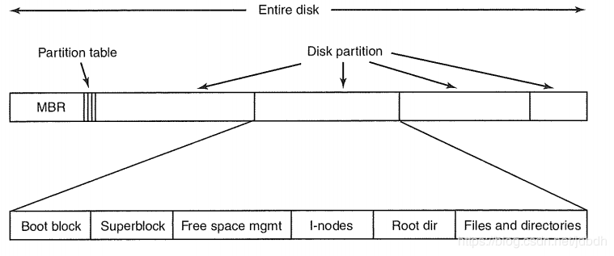
MBR占512KB，储存开机引导程序（446字节），目前基本淘汰，使用[GPT][45]。MBR后66个字节（**分区表**）最多只能存4个**主分区**，想要更多的分区，只能新建一个**扩展分区**，扩展分区中可以建立多个**逻辑分区**。分区仅仅只记录分区在disk中的边界，其中一个分区会被标记为**活动分区**，引导程序会执行活动分区中的Boot block。

MBR之后是分区，或者没有建立分区的空余储存空间。每个基本分区前会有一个**Boot block**，活动分区中的Boot block里有能够加载操作系统的程序，而其他分区可能也有（双系统的情况下）。**Superblock**保存了关于文件系统的关键信息，如标识分区文件系统类型的[模数][46]（分区表也有）、块总数等等。**Free space mgmt**记录空闲块位置信息，常用位图（bitmap）或指针来记录。**I-nodes**，文件和目录都被表示为i-node，这里记录所有的i-node。**Root dir**，所有的文件i-node都会被记录在对应目录i-node指向的数据块中，几乎所有的目录也会被父目录记录，除了根目录，因此这里记录根目录的i-node number。*我猜，文件系统挂载后该文件系统的根目录也会有父目录*。最后的**Files and directories**也就是储存i-nodes表中指向的文件或目录数据了，真正数据存放的地方。

[41]:https://en.wikipedia.org/wiki/Virtual_file_system
[42]:https://en.wikipedia.org/wiki/Cylinder-head-sector
[43]:https://en.wikipedia.org/wiki/Logical_block_addressing
[44]:https://en.wikipedia.org/wiki/Logical_block_addressing#CHS_conversion
[45]:https://blog.csdn.net/jdbdh/article/details/87189717#39_MBRGPT_238
[46]:https://en.wikipedia.org/wiki/Partition_type

### 文件实现
文件是操作系统中一个抽象的概念，就像进程、地址空间一样。文件的实现就是记录哪个块地址属于哪个文件。一般有三种实现方式：Contiguous Allocation、Linked List Allocation和I-nodes，linux中常用的是I-nodes，因此这里介绍I-nodes。一个i-node例子如下：
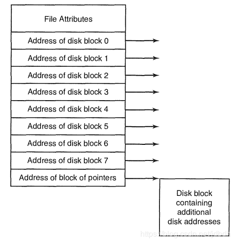
over。。。

>注意
>* i-node存在于i-nodes表中，i-node通过指针指向Files and directories中的块数据。
>* 文件的属性存在于i-node的头部

### 目录实现
目录本身也是被表示为I-node，i-node指向的数据块，仅仅存储着目录下文件或子目录的名字和i-node number，被称为entry。一般目录都会存在指向自己或父目录的entry，如`.`和`..`，除了根目录外（只有`.`）。因为文件名是可变的，因此有两种存储文件名的方法：固定最大长度或可变长度：
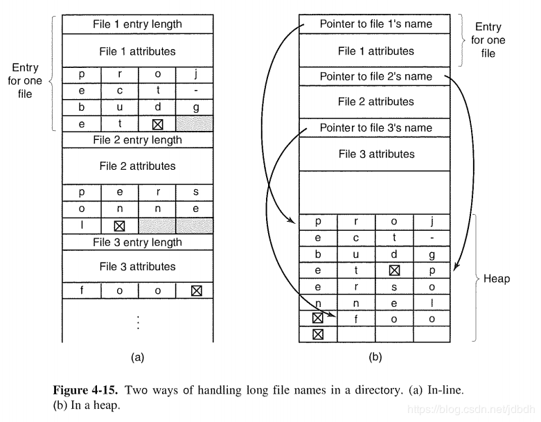
>注意，我认为上图不太对，因为entry不会存储文件属性的，文件属性只会存在于它自己的i-node上，避免增加冗余。其他的上同。

## 文件系统类型
列举常用文件系统：
* `ext*`：linux本土文件系统，目前使用ext4。ext2改自unix的传统文件系统，ext3增加了日记，ext4支持更大的文件、更多的目录。
* `iso9660`：CD-ROM使用的文件系统，只可读。
* `FAT filesystems`（msdos,vfat,umsdos）:属于windows的文件系统。vfat更好的被linux支持。
* `HFS+`(hfsplus)：属于苹果Macintosh使用的系统
* `NTFS`：windows目前使用的文件系统

然后，还有一些特殊的文件系统，它并不表示实际的物理存储设备，而是用作系统接口，获取系统信息的：
* `proc`： Mounted on `/proc`. The name proc is actually an abbreviation for process. Each numbered directory inside /proc is actually the process ID of a current process on the system; the files in those directories represent various aspects of the processes. The file /proc/self represents the current process. The Linux proc filesystem includes a great deal of additional kernel and hardware information in files like /proc/cpuinfo. (There has been a push to move information unrelated to processes out of /proc and into /sys.)就是和进程相关的数据
* `sysfs`：Mounted on `/sys`. 和设备相关的数据，见3.1小节
* `tmpfs`： Mounted on `/run` and other locations. With tmpfs, you can use your physical memory and swap space as temporary storage. For example, you can mount tmpfs where you like, using the size and nr_blocks long options to control the maximum size. However, be careful not to constantly pour things into a tmpfs because your system will eventually run out of memory and programs will start to crash. (For years, Sun Microsystems used a version of tmpfs for /tmp that caused problems on long-running systems.)就是将内存（包括虚拟内存）当做文件系统。

## 常见操作
### 操作分区
有四种常用的分区操作工具：
* **parted** ：A text-based tool that supports both MBR and GPT.
* **gparted** ：A graphical version of parted.
* **fdisk** ：The traditional text-based Linux disk partitioning tool. fdisk does not support GPT.
* **gdisk** ：A version of fdisk that supports GPT but not MBR.

因为parted同时支持MBR和GPT格式的分区表创建，因此建议使用parted。鉴于`man parted`中介绍很详细并且我基本使用不到该命令，因此不深究。。

需要稍微知道的一些知识点：
* `parted -l`：打印所有块设备的分区表
* MBR格式的分区只能建立四个主分区（包括扩张分区），扩张分区上可以建立多个逻辑分区。GPT无限制。

### 创建文件系统
分区创建后，还需在分区上创建文件系统，类似于windows上的格式化：
>方式一
>mkfs [-t  type] device
>在设备文件device上创建type类型的文件系统，如果type没有给出则创建ext2

>方式二
>mkfs.type device 
>解释同上

通过`ll /sbin/mkfs.*`可以列出所有可用文件系统。

### 挂载文件系统
文件系统只有被挂载后才能使用。将文件系统挂载到linux目录下的一个文件夹后，可以通过该文件夹访问被挂载的文件系统。
>mount [-t type] device dir
>将设备文件（含文件系统）挂载到目录dir上

取消挂载：
>umount {dir|device}

mount无参数时列出所有挂载的文件系统：
>mount
>sysfs on /sys type sysfs (rw,nosuid,nodev,noexec,relatime)
>/dev/vda1 on / type ext4 (rw,relatime,data=ordered)
>....
>第一项为特殊文件系统名或设备文件（含文件系统），on后为挂载点，type后文件系统类型，最后为挂载选项。

#### 使用UUID
使用设备名挂载有一定缺陷，因为设备命名取决于内核找到设备的顺序，因此设备名可能会改变。但是创建文件系统时，mkfs会同时为文件系统创建一个唯一的**UUID**，可以通过uuid来替代设备文件挂载。

使用`blkid`获得块设备（含文件系统）的UUID，然后挂载：
>blkid
>/dev/sdf2: UUID="a9011c2b-1c03-4288-b3fe-8ba961ab0898" TYPE="ext4"
>...

> mount UUID=a9011c2b-1c03-4288-b3fe-8ba961ab0898 /home/extra

#### 自动挂载
在自启期间内，linux会读取`/etc/fstab`的配置，然后自动挂载（貌似是执行了`mount -a`）。只要按照它的格式写就配置自动挂载自己的文件系统。`/etc/fstab`中的内容如下：
```unknow
proc /proc proc nodev,noexec,nosuid 0 0
UUID=70ccd6e7-6ae6-44f6-812c-51aab8036d29 / ext4 errors=remount-ro 0 1
UUID=592dcfd1-58da-4769-9ea8-5f412a896980 none swap sw 0 0
/dev/sr0 /cdrom iso9660 ro,user,nosuid,noauto 0 0
```
第一项为设备文件（含文件系统）或其UUID或特殊文件名；第二项为挂载点（对于swap填none）；第三项为文件系统类型；第四项为逗号分隔的挂载选项；第五项和备份信息有关，填0禁止就对了；第六项为是否自启时用fsck检查文件系统完整性，一般自己挂载的都填0。

使用`mount -a`几乎可以挂载`/etc/fstab`中所有的文件系统；或者使用`mount /dir`，会挂载`fstab`文件中对应的挂载点的文件系统。
#### mount选项
无论手动挂载和自动挂载，都会用到`mount`命令的选项。mount选项（也即参数）分为两类，短选项，如`-r`；长选项，放在`-o`后面，逗号分隔，如`-o ro,conv=auto`。而长选项又分为独立与文件系统的选项，和特定于某一具体文件系统的选项。自动挂载只能使用长选线吧。

这里只介绍文件系统独立的选项，其中一些只适用于自动挂载：
* `ro`：Mount the filesystem read-only，同`-r`
* `rw`：Mount the filesystem read-write，同`-w`
* `exec`,`noexec`：Enables or disables execution of programs on the filesystem
* `suid`,`nosuid`：Enables or disables setuid programs
* `dev`,`nodev`：是否解析设备文件
* `sync`,`async`：对文件系统的读写为同步还是异步的，一般为异步的，效率会高些
* `user`,`users`,`nouser`：user允许普通用户挂载，同时只有该用户可以卸载；users允许任意挂载和卸载；nouser只允许普通用户挂载。`user`,`users`都隐含着`noexec`,`nosuid`和`nodev`，可以被后面的选项覆盖（仅适用自动挂载）
* `noauto`：只能显示挂载，即`mount -a`不起作用。（仅适用自动挂载）
* `defualts`：默认使用`rw`, `suid`,`dev`, `exec`, `auto`, `nouser`, 和 `async`，其他特定于文件系统的选项默认值取决于该文件系统。最常用！（仅适用自动挂载）

### swap space
并不是所有的分区都含有一个文件系统，swap space（置换空间，又称虚拟内存）不需要。置换空间将磁盘空间当做RAM，用于将不活动的程序或活动程序的部分内存放入置换空间内，从而允许它运行更多的活动程序。通过`free`可以查看物理和置换空间的使用情况。

#### 分区作为swap space
1. 存在一个分区，最好空的
2. 将置换标志写入到分区：`mkswap device`
3. 手动注册到内核中：`swapon device`

或者自启时自动注册，在`/etc/fstab`中添加一行：
```unknow
/dev/sda5 none swap sw 0 0
```
#### 文件作为swap space
与上面同理：
1. 创建文件：`dd if=/dev/zero of=swap_file bs=1024k count=num_mb`
2. 写入置换标志：`mkswap swap_file`
3. 注册：`swapon swap_file`

为了禁止使用置换空间，使用`swapoff`，具体方法请查询man手册。

### 其他命令
#### sync
对disk的读写是异步的，写文件时不会立刻刷新到disk中，但可以使用sync手动刷新缓存。

#### df
默认输出已挂载文件系统的磁盘使用情况。其中文件系统已使用量不包含大约5%的保留空间。

#### du
默认打印当前目录及其所有子目录总大小, 单位KB
>du [FILE]...
>FILE默认指向当前目录，如果指定文件，则仅打印该文件大小
>* `-a`:同时也打印目录内的文件的大小
>* `-s`:仅打印FILE的总大小，使用`du -s *`打印当前目录中所有文件和文件夹大小（不打印文件夹中的内容）

#### fsck
检查文件系统是否有不正确的地方，并给出解决方案。不怎么会用。

#### free
打印物理和置换内存的使用情况。

#### ls -i 和 stat
`ls -i`同时打印inode number；stat打印文件的相关属性。
## 参考
[File Systems](https://download.csdn.net/download/jdbdh/11006201)
[电脑中常用的“扇区”、“簇”、“块”、“页”等概念](https://blog.csdn.net/jdbdh/article/details/88350421)

# 五 内核启动过程
## 介绍
linux启动过程涉及很多阶段，如固件初始化，引导程序执行，内核镜像加载和启动，各种守护进程和脚本的运行。每一步都有不同的不同的方法。

开机后，会执行主板上固件（firmware）里的程序，它会枚举硬件并正确的初始化，然后从配置的启动设备中加载引导程序。
>固件分为两种：BIOS和UEFI。BIOS会从MBR中读取程序（引导程序）并运行在实地址模式。
>而UEFI更为强大，几乎可以完成内核的工作。使用特定的EFI分区(或ESP)，避免了MBR512KB的限制。可以直接装入内核并运行，但一般EFi中储存引导程序。但UEFI也会兼容BIOS。UEFI与GPT分区表的组合很常见。

引导程序很多种，如LILO、GRUB2、SYSLINUX、Loadlin等等，但在linux中GRUB2最为常用。GRUB2能够识别一些文件系统，因此能够找到内核并加载。它会先加载自己的配置文件，然后列出启动菜单项供用户选择系统启动。之后加载内核。GRUB2功能很强大，可以链式加载（chain-loading）其他引导程序。
>GRUB2功能多，MBR并不能装下，GRUB2会想尽办法在其他地方存入GRUB2代码（如MBR与第一个分区之间），而MBR中只加载这些代码。非MBR的情况下，策略也不同。

>在启动菜单项中，我们可以进入GRUB2中修改内核启动参数，如果内核不能识别参数，就将参数传给第一个用户进程：init进程。

>注意, UEFI可提供选择引导程序的能力, 并且引导程序也存在于EFI/ESP分区中的, 同时引导程序也提供了选择其他引导程序的能力. 但在BIOS中, 只能从磁盘第一个扇区读取引导程序. 详细见[零碎知识之开机引导过程](https://blog.csdn.net/jdbdh/article/details/87189717#32__204)

内核被加载进来后先解压，然后内核会处理所有的操作系统任务，如内存管理、任务调度、I/O、进程通信和其他系统控制任务，之后挂载根目录。一旦内核全面运转，就会执行第一用户进程init。
>一般内核会挂载**内存**中的initrd，作为临时根目录，引导程序在加载内核的同时也会加载initrd。initrd中存有一些驱动模块，如访问文件系统的驱动，然后通过这些驱动挂载真正的根目录（只读）。通过将内核部分模块分离到initrd中，能够有效减小内核的大小。

init是所有进程的父进程，由内核执行，负责所有进程的启动和关闭。init在linux有很多种实现，如SysV、systemd、upstart。sysv是很老的方法，目前systemd已成为主流，同时也兼容sysv。尽管有了内核后，但没有用户进程，不能进行太多的操作，因此init进程需要启动大量的程序，让系统达到可能的地步。所有的linux发行版的区别就在于此。可以将系统启动到援救模式、单人默认、多用户模式、图形模式，因此出现了运行级别（sysv中）、target（systemd中）的概念，这些模式的区别在于运行着不同的程序。

## systemd
### 介绍
内核启动后，systemd主要用于启动各种服务、守护进程、挂载其他目录等任务，达到用户可用的状态。systemd对所有的任务提供了一个抽象的概念：**unit**。一共有12中类型的unit，unit之间有**依赖关系**，也即启动一个unit的同时会造成其他unit**同时**启动，这些通过依赖联系的unit位于同一个**事务**中。systemd会维护事务，通过去掉不必要的jobs（也即进程）解决它们的依赖冲突，然后启动事务中全部进程，事务结束。

所有的unit类型如下：
1. **Service units**, which start and control daemons and the processes they consist of.
2. **Socket units**, which encapsulate local IPC or network sockets in the system, useful for socket-based activation. 
3. **Target units** are useful to group units, or provide well-known **synchronization points**
4. **Device units** expose kernel devices in systemd and may be used to implement device-based activation.
5. **Mount units** control mount points in the file system
6. **Automount units** provide automount capabilities, for on-demand mounting of file systems as well as parallelized boot-up. 
7. **Snapshot units** can be used to temporarily save the state of the set of systemd units,which later may be restored by activating the saved snapshot unit. 
8. **Timer units** are useful for triggering activation of other units based on timers. 
9. **Swap units** are very similar to mount units and encapsulate memory swap partitions or files of the operating system. 
10. **Path units** may be used to activate other services when file system objects change or are
modified.
11. **Slice units** may be used to group units which manage system processes (such as service and scope units) in a hierarchical tree for resource management purposes. 
12. **Scope units** are similar to service units, but manage foreign processes instead of
starting them as well. 

>其中，我们经常配置或使用的是service unit和target unit。内核启动后，systemd会启动default.target，它一般是一个指向multi-user.target或graphical.targer的符号链接，即启动程序到出现命令行或图形界面的地步。

### 配置
unit一般的状态：active、inactive、中间态(activing,deactivating)，fail。unit通过配置文件来配置，配置文件放置的目录如下（同名文件，前面的优先级高）：
* `/etc/systemd/system`
* `/run/systemd/system`
* `/usr/lib/systemd/system`

配置文件语法很简单，所有的unit都通用的选项被配置在`[Unit]`或`[Install]` section中，其他的选项特定于对应类型unit的section中。还有一些选项适用于service、socket、mount、swap，请查看`systemd.exec`、`systemd.swap`的手册。

空行，以`#`和`;`开始的行会被忽略。
#### [Unit]
`[Unit]` section中含有所有unit都通用的选项，下面列出常用的：
* `Description`：一段描述unit的字符串。
* `Requires`：配置该unit的依赖，多个依赖空格分隔。该unit被启动时，依赖也会被**同时**启动，加入到事务中；如果依赖结束或启动失败，该unit也会结束，事务失败。
* `Wants`：配置该unit的依赖，多个依赖空格分隔。是Requires的弱化版，如果依赖启动失败，则依赖不会被加入事务。
* `Conflicts`：配置与该unit冲突的依赖，空格分隔。假设运行着的A unit有对B unit的冲突依赖，则B被阻止运行。如果A与B在一个事务中同时运行，则systemd会考虑是否可以修复它。
* `Before`，`After`：配置该unit的顺序依赖。一般unit会与它的Requires依赖同时运行，与`Before`，`After`一起使用后，会造成该unit先或后于依赖执行。如果顺序依赖于该unit不处于同一事务，则无任何影响。
	
	>关机时，unit之间结束的顺序相反
>After常被设置为：`After=network.target local-fs.target remote-fs.target`
#### [Install]
[Install] section的选项并不会被systemd解析，而是被systemctl的enable或disable命令使用的：
* `WantedBy`，`RequiredBy`：空格分隔的unit列表。使用了systemctl enable命令后，会在列表依赖的`unit_name.wants/`或`unit_name.requireds/`目录下建立该unit的符号链接。使用disable命令则删除符号链接。
	
	>unit对应的wants、requires目录隐式称为该unit的Wants或Requires依赖。这样的好处是不用修改其他的配置文件，就能成为其他unit的依赖。

#### [Service]
[Service] section的选项仅适用于service类型的unit配置文件，注意文件以`.service`结尾。默认隐含有对于basic.target的Requires和After依赖，和对shutdown.target的Conflicts和Before依赖。保证service在基本系统初始化后运行，系统关闭之前结束。
* `Type`：服务进程启动类型，可选值simple、forking、oneshot、dbus、notify、idle。
	* `simple`：无Type和BusName，仅有ExecStart情况下的默认类型。systemd认为ExecStart上运行的进程为主进程，一旦启动就会执行接下来的units。
	* `forking`：如果ExecStart配置的进程可以自己成为守护进程（即后台运行且脱离控制终端，则通过fork子进程实现，父进程结束），则适合forking。一旦父进程结束，systemd会启动其他的units。但是如果子进程多于1个，systemd并不知道哪个子进程是主进程，因此需要PIDFile选项指定进程自己提供pid文件（含有进程号）位置。
	* `oneshot`：与simple类似，但systemd期待在开启其他unit前结束，Type和ExceStart都不存在的默认类型。适合于RemainAfterExit一起使用。
	*  ...：请看man手册
	
	>总之，进程在shell中运行不返回提示符的使用simple；进程在shell中运行，会自动后台运行且返回提示符的（能自己守护进程话），用forking；进程在shell中运行并返回提示符，此时进程也结束了，使用oneshot。
* `PIDFile`：指定守护进程的pid文件的绝对路径，适合与forking搭配使用。服务结束后，systemd会删除该文件。
* `ExecStart`：服务启动时执行的命令。
	
	>注意，命令不是通过shell执行的，而是systemd执行的，注意语法。下同
* `ExecStop`：停止服务所执行的命令。如果没有设置，systemd会发送对应的信号结束服务。
* `ExecReload`：服务需要重新加载时所执行的命令。如果没有设置，systemd会发送HUP信号重启服务。
* `User`，`Group`：设置进程用户或组，默认root。systemd.exec中的内容

#### 其他
**target**类型的配置文件没有多余的选项，因为它仅仅只是作为一个同步点而存在的。比如假设systemd默认启动`graphical.target`，则最终系统会将所有图形界面环境运行起来，相关的依赖大多会在其他unit文件中的[Install]中配置。
```configuration
#  This file is part of systemd.
#
#  systemd is free software; you can redistribute it and/or modify it
#  under the terms of the GNU Lesser General Public License as published by
#  the Free Software Foundation; either version 2.1 of the License, or
#  (at your option) any later version.

[Unit]
Description=Graphical Interface
Documentation=man:systemd.special(7)
Requires=multi-user.target
Wants=display-manager.service
Conflicts=rescue.service rescue.target
After=multi-user.target rescue.service rescue.target display-manager.service
AllowIsolate=yes
```
配置其他类型unit，如**socket**、**timer**，会在一定条件下，触发对应名字的service unit的执行。等等之类，请查看man手册。具体例子请看`man systemd.service`下最后一节内容。

#### systemd参数
systemd也是有参数的，不过systemd是内核执行的，因此可以在GRUB2的开始菜单中修改内核参数达到设置systemd启动参数的目的，因此内核不认识的参数会传给init进程。部分参数如下：
* `systemd.unit=`：设置启动的unit，默认default.target。
* ...：没了？？。。是的，你没看错。

### systemctl
用于控制systemd系统和服务的管理器。命令如下：
* `list-units`：列出所有已知的units。
* `start`：启动unit
* `stop`：停止unit
* `restart`:重启unit。
* `status`：查看unit状态
* `enable`：根据`[Install]`创建对应的符号链接；如果手动创建符号链接，请使用`daemon-reload`重新加载配置文件
* `disable`:将符号链接删除。
* `isolate`：停止所有进程，启动指定的unit。如果unit名字没有后缀，默认target。类似于sysv的切换运行级别。
* `get-default`：获得自启时默认的default target，即返回default.target指向的unit名。
* `set-default`：设置自启时默认的default target，即修改符号链接default.target。

### 关机
关机命令很多，但实现原理一致，通过init进程关机，init进程阻止其他非root用户登陆，然后在systemd中会启动shutdown unit，它会关闭所有程序，最后通知内核结束自己。
>`shutdown`用于停止、关机、重启主机，还可定时、发送警告给所有用户。
>`shutdown [OPTIONS...] [TIME] [WALL...]`
>时间形式可以`hh:mm`，指定小时分钟；可为`+m`，指定m分钟后关机；`now`，立即关机，相当于+0；`无`，则使用+1。
>* `-H`:停止cpu。类似命令`halt`
>* `-P`:关闭主机。类似命令`poweroff`
>* `-r`:重启主机。类似命令`reboot`
>* `-c`:取消定时的关机。
## 参考
* man手册
* [Linux startup process wiki](https://en.wikipedia.org/wiki/Linux_startup_process)
* [In systemd, what's the difference between After= and Requires=?](https://serverfault.com/questions/812584/in-systemd-whats-the-difference-between-after-and-requires)
* [systemd forking vs simple?](https://superuser.com/questions/1274901/systemd-forking-vs-simple/1274913)

# 六 进阶命令
## 用户
### 介绍
linux是一个多用户的系统，有用户、组的概念。不同的用户、组对于不同的文件（夹）有着不同的访问权限（在文件inode中定义），见[linux入门 2.10小结][61]。一个用户有一个primary group，用户也可以加入其它组。每个用户、组都有对应的ID，内核中只使用ID，用户名只在用户空间中使用。

运行的进程会记录用户ID，但有很多中ID，常见的如下：
* **有效用户ID（euid）**：它给与了进程对应的访问权限；如`passwd`运行时将euid换成root，因此可以访问`/etc/shadow`，修改密码。
* **真实用户ID（ruid）**：指定了可以操作进程的用户；`passwd`即使修改了euid，用户也可以`kill`它，如果`sudo`运行命令，非root用户不能`kill`它，因为sudo同时修改了euid和ruid。

### 登录过程
注意，这块内容并不一定对，纯属个人猜想
* 在主机前登录，getty会连接终端，启动login程序进行用户验证，成功后为你打开shell。
* 远程ssh登录，终端连接、用户验证都由ssh server完成，然后打开shell。
* 桌面环境登录，由其他软件（不知道啥子）进行用户验证，然后就如桌面系统（可看做为GUI shell）。

[61]:https://blog.csdn.net/jdbdh/article/details/85038340#210__545
### 配置文件
`/etc/passwd`中每一行存储了一个用户的账号，每个字段如下：
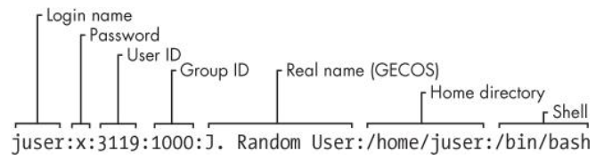
其中
* Password：现在密码存在`/etc/shadow`中，因此填入`x`表示加密过的密码在shadow文件中；`*`则阻止用户认证（即不能登录）
* Group ID：primary group的id，必须在`/etc/group`中存在
* GECOS：就是注释，额外的信息
* Shell：登录成功后运行的程序。通常是shell，默认使用`/bin/sh`，nologin表示不能登录，见`/etc/shells`
>在`/etc/shadow`的第二个字段是真正存储加密密码的地方，`!`，`*`表示不用密码登录，空表示登录不需要密码。详细见`man 5 shadow`

**注意**！！不能登录并不意味着进程的uid不能为该用户，反而使用不能登录的用户运行程序更安全。一般在使用服务进程，systemd unit中可以配置运行用户。

-------------
`/etc/group`中每一条每一个组，组的用户除了passwd对应的用户，还有最后一个字段指定的所有用户。
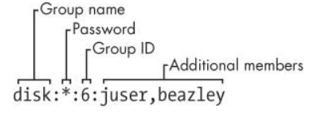

### 命令
#### useradd
用户添加用户（通过修改和用户相关的配置文件实现）。默认行为：创建用户的同时创建对应的组，默认bash shell，没有过期时间，无密码且不能登录，需要使用`passwd`修改密码。
>useradd [options] LOGIN
>因为默认行为很好的满足了需求，因此没有给出完整选项
>* `-c`：passwd中的注释
>* `-s`：登录的shell，默认bash
>* `-p`：设置密码，不建议使用，因为没有加密。建议使用`passwd`命令。
>* `-r,--system`：创建系统账户，默认不创建家目录

>默认行为在`/etc/default/useradd`和`/etc/login.defs`中配置。

#### userdel
删除用户（实现同上）
>userdel [options] LOGIN
>默认仅删除账户和用户组
>* `-r`：同时删除家目录的文件和邮件。其他地方的文件需要手动删除
>* `-f`：同上，但强制删除，即使该用户在登录状态。

#### passwd
修改密码

#### chsh
修改shell
## top
top能够动态显示系统总的cpu、内存使用状态和各个进程的资源使用情况。

### 字段含义
第一行分别表示目前的时钟、系统已运行时间、用户个数和分别为1、5、15分钟的平均负载。
>平均负载是对运行队列的长度的一种度量。单核下，0.5表示cpu一半时间是空闲的，1表示cpu是时刻负载的，1.5表示1/3进程在等待cpu；假设4核，则4表示所有的核刚好负载。当负载很高时，很有可能内存不足，导致时刻发生对内存的置换（swap）。[load average](https://unix.stackexchange.com/a/303703)

-----

第二行表示当前进程总个数、运行进程个数、睡眠进程个数、停止进程个数等等。按`H`可以看到线程的个数。

---
第三行表示cpu使用情况，各个单位如下：
* `us`（userspace）：程序在用户空间执行所需时间
* `sy`（system call）：系统调用所需时间，不包含内核自己花掉的时间
* `ni`（nice）：不知道
* `id`（idle）：cpu空闲时间，没有进程运行
* `wa`（wait）：cpu花在等待io上的时间
* ...
>这里显示的是CPU总的使用情况，按`1`可以看到各个CPU的使用情况。

----
第四、五行分别表示内存、置换内存的使用情况。按`m`可以看到图形表示。

-----
下面一部分是进程的一些信息和对资源的使用情况。每个字段如下：
* `PID`：进程id
* `USER`：有效用户（euid）。
* `PR`：进程的优先级。值从-20到20，越低优先级越低。会随时间而改变。
* `NI`：进程的nice值，是给与内核调度器该进程优先级的暗示，进程优先级下次改变时会考虑到该值。
* `VIRT`：虚拟内存大小（KB）。包含内存与置换内存中进程的所有页。
* `RES`：驻留内存大小（KB），被使用的物理内存大小。
* `SHR`：共享内存大小（KB）。
* `S`：进程状态。
  * `R`：运行；
  * `S`：睡眠；
  * `T`：被job控制信号中断；
  * `t`：被调试器中断；
  * `D`：不可中断睡眠；
  * `Z`：僵死。
* `%CPU`：cpu使用率。是进程的所有线程的cpu使用率综合，且每个核心最大100%，因此此项可能会超过100%。~~使用`H`显示线程使用率而不是进程，或者按`I`关闭`Irix`模式（默认模式），此时cpu总使用率为100%。~~
  * `Irix`模式(默认): 每条记录显示的是线程使用单个CPU的使用率
  * 非`Irix`模式: 显示进程占所有CPU的使用率. 
  * 通过`I`进行切换.
* `%MEM`：物理内存使用率
* `TIME+`：进程已运行时间
* `COMMAND`：运行该进程使用的命令

### 快捷键
* `h`：**最常用！！！内容必看**
* `L`，`&`：L查找进程，&搜索下一个
* `<`，`>`：切换排序字段
* **导航**：方向键都可以用，如up,down,left,right,home,end
* `k`：与kill命令一致，给出PID和信号（可数字或信号名）。停止进程建议term，后kill。
* `d`或`s`：设置刷新间隔，默认3秒
* `x`，`y`：x排序列高亮，y运行进程行高亮
* 颜色：z设置颜色，b设置粗体。Z全局设置颜色
* `f`：重新设置显示的字段、排序字段等
* `W`：设置好后，按W保存设置到配置文件中。**有用！！！**
* `q`：离开。

## 时间
在Linux中有**硬件时钟**与**系统时钟**等两种时钟。硬件时钟是指主机板上的时钟设备，也就是通常可在BIOS画面设定的时钟；系统时钟则是指kernel中 的时钟；所有Linux相关指令与函数都是读取系统时钟的设定。当Linux启动时，系统时钟会去读取硬件时钟的设定，之后系统时钟即独立运作。

>至于网络时间，以后补充
### date
查看或设置系统时钟
>`date` 查看本时区当前时钟
>`date -s "2018-11-2 22:30"` 设置系统时钟，但重启后失效
>`date -u` 显示UTC时区的时钟

### hwclock
查询或者设置硬件时钟

>`hwclock`   查询硬件时钟
>`hwclock -w` 将系统时间写入硬件时间

### 时区
默认时区由`/etc/localtime`给出，它是一个指向`/usr/share/zoneinfo`中文件的一个符号链接。可以通过拷贝其他文件，来永久修改时区。或者修改环境变量`TZ`为当前shell会话设置临时时区，如：
```bash
[root@localhost Desktop]# date
Sat Mar 16 11:00:47 CST 2019
[root@localhost Desktop]# export TZ=US/Central
[root@localhost Desktop]# date
Fri Mar 15 22:00:54 CDT 2019
```
>如果不知道时区名字，可以参考`/usr/share/zoneinfo`目录或执行`tzselect`命令

## 计划任务
>计划任务有望被init进程（如systemd）取代，但目前远没有那么强大。
### cron
cron是一个守护进程，用于在规定时间点上执行任务（job）。任务在配置文件中配置，一行为一条任务。cron每分钟都会被唤醒，检查配置文件是否被更新。任务的标准输出会以邮件的形式记录，可以被修改。cron任务分为两类：
* 系统cron任务
	
	以root用户执行，常用于执行系统维护。需在`/etc/crontab`中配置。
	
	>`/etc/cron.d/`呢？不太懂
	
* 用户cron任务
	
	普通用户创建的任务，配置位于`/var/spool/cron`目录下。建议使用命令`crontab`创建任务，而不是直接操作配置文件。
	
	>为什么系统cron任务不用crontab命令创建？因为格式稍有不同，且anacron更适合系统cron任务，见下。

#### 系统cron任务
直接在`/etc/crontab`中添加一行，格式如下：
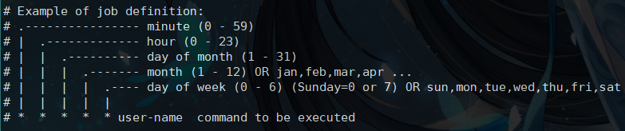
每个字段空格分隔。`*`表示匹配所有可能的值；`,`分隔的项表示匹配已列的值；`-`匹配范围内的值

>如 
>00 21 * * * root rm /home/bob/trash/*
>表示每天21点清空bob用户的垃圾。

参考：[Schedule jobs with cron](https://geek-university.com/linux/schedule-jobs-with-cron/)

#### 用户cron任务
`crontab`命令用户安装、展示、删除对应用户的cron任务。使用命令安装而不是直接修改对应配置文件的好处在于，在任意地点建立自己配置文件后，使用crontab安装的同时会检测语法是否正确，然后提示修改或安装到`/var/spool/cron`中。
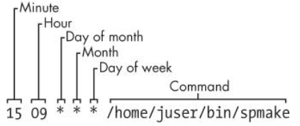
>可以看出，用户配置少了user-name

>* `crontab [-u user] file`：安装自己的配置文件，默认当前用户
>* `crontab -e`：拷贝配置文件到临时文件中，用户编辑后，直接安装（覆盖）。如果配置文件不存在，则新建。**推荐**
>* `crontab -l`：显示所有该用户的cron任务
>* `crontab -r`：删除用户cron配置文件

参考：[User cron jobs](https://geek-university.com/linux/user-cron-jobs/)

### anacron
与cron不同，如果任务自从上次更新时间超过了某个时间间隔，则执行任务。任务只在`/etc/anacrontab`中配置，每个字段如下：
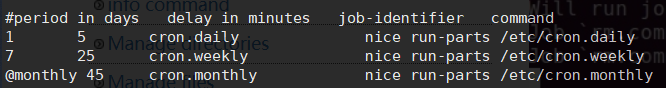
* `period`：命令执行的频率，单位：天。
* `delay`：执行命令前的延时
* `job-identifier`：任务标识，必须有
* `command`：任务执行的命令。

anacron运行过程
>anacron通过启动脚本或cron任务启动，anacron检查每个任务，判断距离上次执行是否已经超过（或等于）周期（period），如果是则执行命令，然后记录更新日期（不记录小时），当今天没有任务执行时，anacron结束。

参考：[Schedule jobs with anacron](https://geek-university.com/linux/schedule-jobs-with-anacron/)

### at
在某个时间点只执行一次。
>* `at time`：从标准输入中获得要执行的命令，按`ctrl+d`退出。表示在time时执行命令。
>* `at -f file time`：同上，不过此时命令通过文件给出
>* `atq`：列出所有的用户悬停的任务
>* `atrm job_num`：删除对应job num的任务

注意，时间可以为两种形式：
* `HH:MM [YY-MM-DD]`：如果只给出HH:MM并且过期，则认作明天
* `now + count time-units`：time-units可以是minutes，hours，days 或weeks。例子：`at now +2 hours`

## 其他
### nohup
运行指定的命令，并让该命令忽略掉停止信号，以至于**后台**应用能够在用户登出时继续运行
>* `nohup COMMAND`：标准输入流重定向到`/dev/null`，标准输出流重定向到nohup.out，标准错误流重定向到标准输出。
>* `nohup COMMAND > FILE`：标准输出流重定向到文件。

一些进程能够自我守护进程化，即自动后台运行并与控制终端脱离，因此当前会话结束不会关闭守护进程。如果进程不能自我守护进程化，则需要nohup的帮助，如：`nohup COMMAND &`

### time
测试命令所花掉的时间
>`time command`
>其中
>* `user`为进程在用户空间执行的时间
>* `sys`为系统调用在内核空间执行的时间（不包括上下文切换的时间）
>* `real`为总共花掉的时间。
>* `real-sys-user`为进程等待内核的时间。

如
```bash
[root@localhost Desktop]# time ls
nohup.out  RunLongSecond.class  RunLongSecond.java  test

real	0m0.004s
user	0m0.000s
sys	    0m0.004s
```

# 七 网络基础
## 介绍

关于防火墙，这里在做补充。先看一幅图
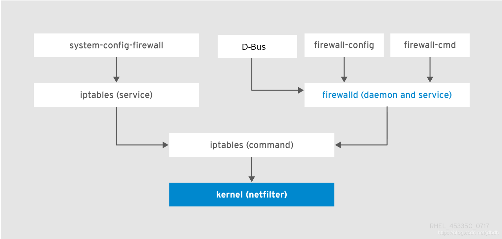
防火墙是内核提供的功能，可以通过`iptables`命令直接设置防火墙规则，也可以通过图中的两个守护进程提供的工具来设置，它们底层使用的命令都是`iptables`。目前发行版大都使用firewalld作为守护进程，使用`firewall-cmd`来配置规则，这里就介绍firewalld。

firewalld中，**zone**是一系列规则的集合（类似iptables命令中的chain），zone的target字段定义默认行为，如果**到来**（incoming）数据包没有匹配zone的规则，就使用默认行为。firewalld预定义了多种zone，默认网卡设备使用public。public zone中target为default，表示没有成功匹配的（incoming）数据包会被拒绝进入。

规则可以被定义为多种形式，如直接指定服务，如http，ftp，ssh；或者使用端口+协议，如80/tcp，123/udp。但是你可能会发现这些功能很有限，远没有`iptables`命令灵活，因此`firewall-cmd`提供`--direct`直接使用`iptables`命令的规则来配置防火墙。当不用直接使用iptables，这会造成firewalld服务内核数据不一致。

规则分为运行时规则和永久规则，其实就是保存为内存中副本的规则为运行时规则，保存文件中的规则为永久规则。只不过`firewall-cmd`一次只能保存一个地方，内存或文件。

网卡具体使用什么zone由NetworkManager确定，如果没有明确指定，会使用firewalld的默认zone，一般为public，但可以通过`public-cmd`修改。
## 命令
### ip
ip命令功能很强大，常用于查看、修改、设置网卡ip、路由表、设备等功能。配置不会被保存。
>代替了ifconfig、route、arp等老工具的使用

>ip [ OPTIONS ] OBJECT { COMMAND | help }
>* `OBJECT`：表示ip具体的某个子功能，常用的为`addr`（设置ip）、`route`（路由表）、`neighbour`（arp缓存）. 
>
>  > 可使用简写.
>
>* `COMMAND`：每个object的动作都不一样，可以查询、修改、添加对应实体，但如果没有给出则默认查询
>
>* `help`：通过help可查询对应object具体用法

用法参考：[Linux命令之ip](http://www.cnblogs.com/diantong/p/9511072.html)


### ss
用于查看sockets信息。
>代替了老工具netstat的使用

>ss [options]
>默认显示所有已建立连接（non-listening）的sockets，包括TCP/UNIX/UDP类型的socket。
>
>* `-l`:仅显示正在监听（listening）的sockets
>* `无`：仅显示已建立连接（non-listening）的sockets
>* `-a`：同时显示正在监听（listening）和已建立连接（non-listening）的sockets
>
>> 注意, 已建立连接和监听是两种状态, 一种是还未连接, 所以要监听; 一种是已经连接上了, 不用监听了
>
>----------------
>* `-t`：仅显示tcp类型的sockets
>* `-u`：仅显示udp类型的sockets
>* `-x`：仅实现unix类型的sockets
>* `无`：同时显示tcp、udp、unix类型的sockets
>----------------
>* `-n`：显示端口而不是服务名
>* `-p`：显示使用socket的进程

### nmtui
NetworkManager提供的，用于配置网络的字符界面工具。如配置网卡ip、掩码、网关、DNS服务器，并且配置会被保存下来。

### firewall-cmd
* 检测防火墙状态
	```bash
	sudo firewall-cmd --state
	```
* 重新加载防火墙规则，运行时添加但没有保存的规则会消失
	```bash
	sudo firewall-cmd --reload
	```
* 一般添加规则不会被永久保存，添加`--permanent``永久保存却不会立刻生效。有两种方法解决：
	```bash
	# 设置运行时规则后再保存
	firewall-cmd <other options>
	firewall-cmd --runtime-to-permanent
	保存到文件中，然后重新加载所有规则
	firewall-cmd --permanent <other options>
	firewall-cmd --reload
	```
* zone操作
	```bash
	# 查看当前默认zone
	sudo firewall-cmd --get-default-zone
	# 改变默认zone
	sudo firewall-cmd --set-default-zone=internal
	# 查看网卡设备使用的zone。网卡只会在没有明确设置zone时才使用默认zone
	sudo firewall-cmd --get-active-zones
	# 得到一个zone的全部配置
	sudo firewall-cmd --zone=public --list-all
	# 得到全部zone的配置
	sudo firewall-cmd --list-all-zones
	```
* 添加、删除服务或端口，并且端口还可以添加一个范围的端口，如`8000-8999/tcp`
	```bash
	# 通过服务名添加、删除服务
	sudo firewall-cmd --zone=public --add-service=http --permanent
	sudo firewall-cmd --zone=public --remove-service=http --permanent
	# 通过端口+协议添加、删除服务
	sudo firewall-cmd --zone=public --add-port=12345/tcp --permanent
	sudo firewall-cmd --zone=public --remove-port=12345/tcp --permanent
	```
* 等等等等

参考：[Introduction to FirewallD on CentOS](https://www.linode.com/docs/security/firewalls/introduction-to-firewalld-on-centos/)

## 网络进阶
### curl
>已重新学习curl，详细见[curl](https://blog.csdn.net/jdbdh/article/details/90911383)

curl用于与服务间传输数据，支持各种协议。但我只用http协议
>curl [options] [URL...]
>默认从URL下载数据到终端
* `-i`:输出包括http头字段
* `-I`：仅获得头部
* `-v`：输出更多的信息。`>`表示请求头字段，`<`表示响应头字段，`*`表示额外信息
* `-H`:添加请求头字段
* `-b`：添加cookie
* `-L`：如果响应要求重定向，则向新地址发起请求。
* `-o` <file>：指定文件保存
* `-O`：于当前目录保存文件，文件名为远程文件名。
* `-F, --form <name=content>`：对于http协议族，curl以`multipart/form-data`类型的`Content-Type`发送post数据。如果要发送文件，`content`需要以`@`开始，后接文件名。

例子：
```bash
//下载jdk，允许重定向，以网络文件名保存在本地
curl -L -b "oraclelicense=a" -O http://download.oracle.com/otn-pub/java/jdk/10.0.2+13/19aef61b38124481863b1413dce1855f/jdk-10.0.2_linux-x64_bin.tar.gz
//向微信接口发送图片
curl -F media=@test.jpg "https://api.weixin.qq.com/cgi-bin/media/upload?access_token=ACCESS_TOKEN&type=TYPE"
```
>同类工具还有wget，但curl更强大
>最全教程：[Using curl to automate HTTP jobs](https://curl.haxx.se/docs/httpscripting.html)
### Unix Domain Sockets
socket有很多中，我们常用的是network socket，linux也提供了unix socket，它表现起来像TCP或UDP，但它只用作内部进程交流的途径，因此更高校。

## 参考
[Introduction to FirewallD on CentOS](https://www.linode.com/docs/security/firewalls/introduction-to-firewalld-on-centos/)
[CHAPTER 5. USING FIREWALLS](https://access.redhat.com/documentation/en-us/red_hat_enterprise_linux/7/html/security_guide/sec-using_firewalls#sec-Introduction_to_firewalld)
[Firewalld](https://fedoraproject.org/wiki/Firewalld?rd=FirewallD)
[CentOS 7 中firewall-cmd命令](https://www.jianshu.com/p/411274f96492)
[Computer network](https://en.wikipedia.org/wiki/Computer_network)
[OSI model](https://en.wikipedia.org/wiki/OSI_model)
[A Deep Dive into Iptables and Netfilter Architecture](https://www.digitalocean.com/community/tutorials/a-deep-dive-into-iptables-and-netfilter-architecture)
[iptables查看、开放、删除端口、保存设置](https://www.centos.bz/2018/01/iptables%E6%9F%A5%E7%9C%8B%E3%80%81%E5%BC%80%E6%94%BE%E3%80%81%E5%88%A0%E9%99%A4%E7%AB%AF%E5%8F%A3%E3%80%81%E4%BF%9D%E5%AD%98%E8%AE%BE%E7%BD%AE/)
[NetworkManager](https://en.wikipedia.org/wiki/NetworkManager)
[What's the difference between Network Initscript and NetworkManager in RHEL 7?](https://access.redhat.com/solutions/783533)
[Linux命令之ip](http://www.cnblogs.com/diantong/p/9511072.html)

# 八 bash
## 介绍
bash shell是一个与sh兼容的命令行解析器，是用户与系统内核交互的接口。通过bash，可以执行命令（程序），bash本身就内置了很多常用的命令。可以将一些常用的命令写入脚本中，让bash运行，用以实现简化和自动化日常的任务。对于其他比较复杂的任务，如字符串操作、算术、数据访问、更强的函数等功能，尽管bash也提供了对应的语法（也有函数！！），但还是应该选择使用其他脚本（python）或编译语言（c）。因此，这里只记录比较常用的bash语法。

## 启动
shel按照启动方式的不同，可分为`login`、`non-login`、`interactive`、`non-interactive` shell。`login shell`表示该shell用来登录；`interactive shell`的标准输入输出都连接到终端上，即可与用户交互。

shell在启动时会读取配置文件，不同的shell读取的文件都不同。下面是bash shell在不同启动方式下，与执行的配置文件的关系：
* **login、interactive bash**：即命令行登录时用的shell，先读取和执行`/etc/profile`，然后查找`~/.bash_profile`，`~/.bash_login`和`~/.pro‐file`，读取和执行**第一个**找到的文件。当shell结束时，会读取和执行`~/.bash_logout`和`/etc/bash.bash_logout`。
* **non-login、interactive bash**：即桌面环境下打开的虚拟终端使用的shell，会读取和执行`~/.bashrc`
* **non-login、non-interactive bash**：即执行脚本用的bash，一般情况下不会读取文件。

>图形界面登录使用就不是bash了，而是不知道哪款GUI shell了

建议自己的配置一般放入`~/.bashrc`中

配置文件中会定义一些和用户使用相关的环境变量和shell变量，如PATH、命令提示符（prompt）、命令别名（alias）、权限掩码、默认编辑器等配置。

## 语法

## 简单命令
一条简单的bash命令，以要执行的**命令**开始，接着给出空格分隔的**参数**，最后以**控制操作符**结束，执行结束后，会返回一个**状态码**。执行一条命令类似于其他语言中调用一个函数。
>不要将状态码和命令的标准输出混淆，状态码可以通过`$?`获得，bash中很多复合命令可以检查到命令放回的状态码而执行响应的动作。

>一般状态码为0表示命令正常，其余非正常，但命令状态码的解释权归该命令所有。

其中控制操作符可以是`&`，`;`，`换行`。以`&`结束的命令语句，会在后台运行，bash不会等待命令的完成，而是直接执行下一条语句；以`;`或`换行`结束的命令语句，bash会顺序执行，等待其完成。

多条由管道、控制操作数、&&、|| 等符号隔开的命令序列称为**list**。执行list后，会返回list中最后一条被执行的命令的状态码。
### 复合命令
复合命令是bash提供的更为复杂的命令。<span style="color:red">书写命令时要注意符号间的空格</span>
* `(list)`  :list会在子shell环境中运行，因此list中的命令就算修改了环境变量，也不会影响当前shell的环境变量。
	
	>为将要运行的程序添加环境变量而不影响当前shell的方式还有：`PATH=/usr/confusing:$PATH  yourprogram` 即命令前直接设置变量，此时也不会产生子shell。
* `((expression))` ：根据**算法表达式**expression计算的值返回对应的状态码。如果结果值不为零，状态码为0，否则返回1。
* `[[ expression ]]` ：根据**条件表达式**expression计算的值返回对应的状态码。如果表达式true，返回0，否则1。与`[ expression ]`功能基本一致

关于表达式，可以使用逻辑运算符进行组合：
* `( expression )` :提升表达式执行的优先级
* `! expression` :取反表达式的状态码
* `expression1 && expression2` ：两个表达式为true（状态码为0），才true。expression2不被执行，当且仅当expression1返回0（true）。
* `expression1 || expression2`：任意一个表达式为true，则true。expression2被执行，当且仅当expression1返回1（false）

bash还提供了关于流程控制相关的命令：
* `for name  in  word ... ;  do list ; done`
	name变量每次从in后取得一个值，然后运行一次list。word可使用通配符，自动被expansion（扩展）。
* `for (( expr1 ; expr2 ; expr3 )) ; do list ; done`
	首先执行expr1，之后每次都检测expr2是否为0，如果为0则结束；否则执行list和expr3被执行，然后再重复检测。
* `if list; then list; [ elif list; then list; ] ... [ else list; ] fi`
	如果list（不是表达式了）返回0，则执行then后的list，否则检查elif后的list，如果状态码都不为0，则执行else后的list。

其他的请查看`man bash`手册。

### 字面值
shell只有一种类型，字符串。shell在执行命令之前，会查找变量、通配符、其他替换符号，然后替换，最终执行命令并传入处理过的参数。通过引号可以阻止这种行为：
* **无引号**：shell会执行替换过程。多个参数空格分隔，不能出现单、双引号，可以用`\'`  `\"`替代。
* **单引号**：引号内的所有字符不被替换且视为一个参数。但 `'` 不能出现在里面
* **双引号**：与单引号类似，但里面的变量可被替换。 `"` 不能出现在里面

### 特殊变量
shell变量用于存储字面值、参与计算。bash为我们提供了一些特殊变量，用以获取相关的值，如当前shell的参数、进程号等等，但这些特殊变量不能被改变：
* 脚本参数:`$1,$2,...`
	运行脚本时传入的参数，$1对应第一个参数，$2对应第二个，等等。`shift`可以删除第一个参数，其他参数前进补齐，即$2移入$1，$3移入$2，等等
* 参数个数：`$#`
	参数的个数，如果无则0
* 所有参数：`$@`
	一个包含所有参数的字符串
* 脚本名：`$0`
* 进程ID：`$$`
	当前shell的进程号
* exit code：`$?`
	上一条命令的exit code。在脚本中，exit code一般为最后一条命令的exit code。也可以通过命令`exit num`，手动返回exit code，并结束当前shell。如果num不给出，默认上一条命令的exit code

### 算术表达式
3.2小节提到了`((expression))`可以计算算术表达式，下面给出所有的操作符：
* `id++` `id--` 
	variable post-increment and post-decrement
* `++id` `--id`
              variable pre-increment and pre-decrement
* `-` `+`    unary minus and plus
* `!` `~`    logical and bitwise negation
* `**`     exponentiation
* `*` `/` `%`  multiplication, division, remainder
* `+` `-`    addition, subtraction
* `<<` `>>`  left and right bitwise shifts
* `<=` `>=` comparison
* `==` `!=`  equality and inequality
* `&`      bitwise AND
* `^`      bitwise exclusive OR
* `|`      bitwise OR
* `&&`     logical AND
* `||`     logical OR
* `expr?expr:expr`
              conditional operator
* `=` `*=` `/=` `%=` `+=` `-=` `<<=` `>>=` `&=` `^=` `|=`
              assignment
* `expr1 , expr2`
              comma

### 条件表达式
复合命令 `[[ ]]` 与bash内置`[ ]`命令作用基本一致，可以进行文件测试、字符串测试、算术测试。部分功能与8.3.5小节重叠，具体参数参考`man test`

### 命令替换
`${COMMAND}`允许命令的标准输出替换为命令行参数。如下面例子所示，`echo 23`的输出`23`替换了`${echo 23}`
```bash
[root@sidian Desktop]# echo 23
23
[root@sidian Desktop]# a=$(echo 23)
[root@sidian Desktop]# echo $a
23
```
### 算术替换
在使用`((expression))`时，该复合命令只会返回状态码，没有标准输出输出结果，可以使用`$((expression))`获得它的值。
```bash
[root@sidian Desktop]# a=$((23+3))
[root@sidian Desktop]# echo $a
26
```
当然可以不用算术替换，只用算术表达式
```bash
[root@sidian Desktop]# ((b=23+33))
[root@sidian Desktop]# echo $b
56
```
## 脚本
* 脚本就是bash命令的集合，并且脚本执行时开启了新的bash shell。

* 运行脚本前需要赋予它可执行权限。

  > 未有可执行权限时, 可以如下方式运行
  >
  > ```bash
  > bash script.sh
  > ```

* 运行脚本时，不明确给出脚本路径，则从PATH路径下查找

* `. script`或`source script`会在当前shell中导入并执行脚本中的命令

* bash脚本必须以`#!/bin/sh`作为首行。

# 参考
[《How-Linux-Works-2nd-Edition》](https://github.com/KnowNo/How-Linux-Works-2nd-Edition)
[linux course](https://geek-university.com/linux/what-is-linux/)
[The Linux Command Line](http://linuxcommand.org/index.php)
[vim tutorial](https://www.tutorialspoint.com/vim/index.htm)