[TOC]

# 一 介绍

**Shadowsocks**（简称**ss**）是一个开源免费的、基于socks5协议的加密代理项目。简而言之，ss能够创建sock5代理，有选择性（使用pac规则）的为你代理流量。往代理服务器转发流量时，会加密数据，但是由于ss加密的主要目的是为了混淆数据达到绕行**GFW**（great firewall）的目的，因此数据安全性不高。

Shadowsocks被国内程序员clowwindy使用python语言开发，由于政策原因，仓库已被清除，但wiki还在，项目也被其他合作者备份下来了。ss还有很多语言的移植版本，如GO、C、perl等等。ShadowsocksR（简称ssr）是原项目的fork，声称会提高代理的安全和稳定性。

关于socks、shadowsocks和vpn的关系，参考：[零碎知识4.9小节][1]。

下面开始介绍如果一步一步搭建ss。

[1]:https://blog.csdn.net/jdbdh/article/details/87189717#49_socks5shadowsocks_283

# 二 租用vps
为了绕行GWF，达到科学上网的目的，首先需要在国外租一台vps（服务器）。我选择vultr，原因如下：
1. vultr按小时收费，不用的时候可以摧毁服务器；
2. 可以任意更换不同的地区的vps，同时也更换了ip地址，如果一个ip端口被gfw封了，可以摧毁它并更换新的，由于是按小时收费的，短时间内可以任意测试。
3. vultr支持支付宝付款。
4. 速度可以，搭建好后可以流畅访问youtube1080p。

进入[vultr官网][2]，建立账号，然后需要向账户中充值一定数额。在部署服务器，我选择了美国迈阿密的vps，系统为centos7。实际上东京的vps延迟最低，但是目前东京ip的端口大面积被封，因此不建议。我的选择：
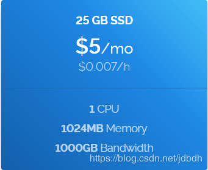

>带宽1T，与服务器上测试结果符合，但是在国内从服务器上下载文件测试速度峰值只达到5MB/s，这是距离远、自己办的宽带和国内环境复杂造成的。但上传速度很快。

vps实例创建好后可以看到它的ip地址和root账号密码：
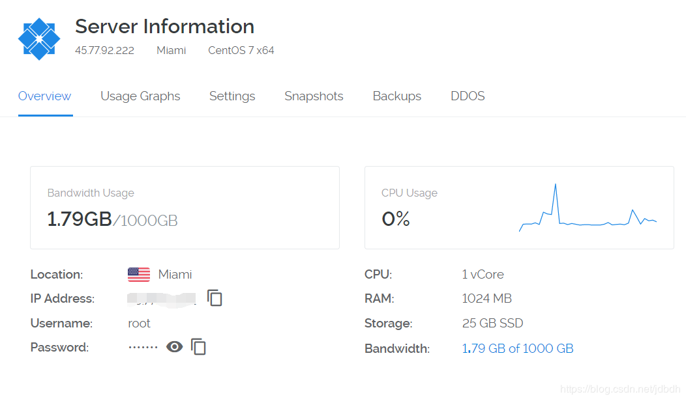
使用ssh客户端登录，如XShell、PuTTY或者win10自带的OpenSSH。如果发现登录超时，很有可能此端口被GFW封锁了。可以尝试多创建几个vps实例，一一尝试，知道可用为止。

[2]:https://www.vultr.com/

# 三 搭建Shadowsocks
使用与centos7，其他发行版参考[github][3]

[3]:https://github.com/shadowsocksr-backup/shadowsocksr
## 3.1 安装pip
python仓库中含有shadowsocks，因此可以使用pip安装，如果pip不存在，则安装pip：
```bash
yum install python-setuptools && easy_install pip
```
## 3.2 安装shadowsocks
```bash
pip install shadowsocks
```
## 3.3 配置防火墙
在vps服务商提供的vps中，一般含有两层防火墙：系统自带的防火墙和系统外vps提供的防火墙。对于我来说，我不太熟悉系统防火墙命令，也认为只要使用一层防火墙就够了，于是我选择关闭和禁用系统防火墙。（实践中，我发现阿里云主机的系统防火墙已经默认被关闭了）

先**关闭**和**禁用**系统防火墙：
```bash
systemctl stop firewalld.service
systemctl disable firewalld.service
```

在[vultr后台][4]建立一层防火墙，设置入方向规则，并将vps实例添加到该防火墙中：
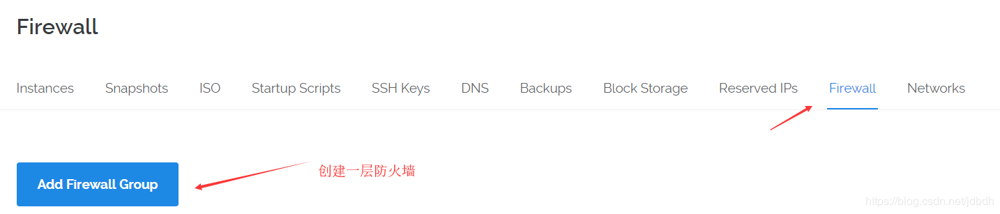
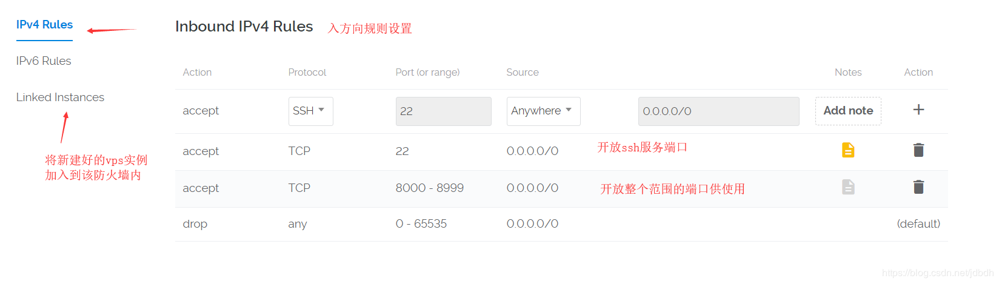

[4]:https://my.vultr.com/firewall/

## 3.4 运行ssserver
ssserver是ss服务的进程，ss服务的配置有两种方式：json配置和命令行上提供选项。注意命令行上的配置可以覆盖json配置。
### 3.4.1 命令配置
输入`ssserver -h`可以查看选项介绍：
```bash
[root@I ~]# server -h
-bash: server: command not found
[root@I ~]# ssserver -h
usage: ssserver [OPTION]...
A fast tunnel proxy that helps you bypass firewalls.

You can supply configurations via either config file or command line arguments.

Proxy options:
  -c CONFIG              path to config file
  -s SERVER_ADDR         server address, default: 0.0.0.0
  -p SERVER_PORT         server port, default: 8388
  -k PASSWORD            password
  -m METHOD              encryption method, default: aes-256-cfb
  -t TIMEOUT             timeout in seconds, default: 300
  --fast-open            use TCP_FASTOPEN, requires Linux 3.7+
  --workers WORKERS      number of workers, available on Unix/Linux
  --forbidden-ip IPLIST  comma seperated IP list forbidden to connect
  --manager-address ADDR optional server manager UDP address, see wiki

General options:
  -h, --help             show this help message and exit
  -d start/stop/restart  daemon mode
  --pid-file PID_FILE    pid file for daemon mode
  --log-file LOG_FILE    log file for daemon mode
  --user USER            username to run as
  -v, -vv                verbose mode
  -q, -qq                quiet mode, only show warnings/errors
  --version              show version information

Online help: <https://github.com/shadowsocks/shadowsocks>
```
命令使用：
```bash
#前台运行
ssserver -p 8111 -k 123456 -m aes-256-cfb
#运行为服务进程，ssh连接关闭时ss服务不会被关闭
ssserver -p 8111 -k 123456 -m aes-256-cfb -d start
#关闭ss服务进程
ssserver -d stop
```
### 3.4.2 json配置
json对象每个字段含义如下：
| Name          | Explanation                                |
| :------------ | :----------------------------------------- |
| server        | the address your server listens            |
| server_port   | server port                                |
| local_address | the address your local listens             |
| local_port    | local port                                 |
| password      | password used for encryption               |
| timeout       | in seconds                                 |
| method        | default: "aes-256-cfb", see Encryption     |
| fast_open     | use TCP_FASTOPEN, true / false             |
| workers       | number of workers, available on Unix/Linux |

一个例子`/etc/shadowsocks.json`如下：
```json
{
    "server":"0.0.0.0",
    "server_port":8111,
    "local_address": "127.0.0.1",
    "local_port":1080,
    "password":"123456",
    "timeout":300,
    "method":"aes-256-cfb",
    "fast_open":true
}
```
>* server地址为0.0.0.0表示监听vps的所有网卡，如果地址为127.0.0.1会怎么样？不知道！
>* 本地代理可使用ss客户端设置，为何还要设置？不知道！！

然后运行ssserver：
```bash
#运行成服务进程
ssserver -c /etc/shadowsocks.json -d start
#关闭ss服务
ssserver -d stop
```
## 3.4.3 配置多个用户
配置多个用户实际上就是一个用户一个端口配置。github上提供了配置方式：[Configure Multiple Users][5]，一个ss服务配置多个端口，而我测试失败了。因此使用第二种方案，一个ss服务对应一个端口配置。进程之间pid唯一，为了不让多个ss进程冲突，需要指定它的pid文件：
```bash
#第一个ss服务
ssserver -c /etc/shadowsocks.json -p 8111 -k 123456 --pid-file=ss-8111.pid -d start
#第二个ss服务
ssserver -c /etc/shadowsocks.json -p 8112 -k 654321 --pid-file=ss-8112.pid -d start
#关闭第一个ss服务
ssserver --pid-file=ss-8111.pid -d stop
```
>这里也说明了，命令行上的配置可以覆盖json配置。

[5]:https://github.com/shadowsocks/shadowsocks/wiki/Configure-Multiple-Users

# 四 使用ss
所有客户端：[Ports and Clients][6]，主要介绍windows客户端：[Shadowsocks for Windows][7]。

主要原理：很多应用自动使用系统代理，而系统代理就是IE代理，ss客户端只要配置好IE代理，大部分应用的流量就可以通过ss来代理了。参考：[零碎知识4.9小节][1]。

全局代理模式和pac代理模式：全局代理就是交个ss代理的流量统统走ss代理服务器；而pac代理则是有选择的代理流量，符合pac规则的走代理，否则直连。pac定义代理规则，我们不必自己设置，ss客户端会自带。还可以从github上的GFW列表更新pac。

配置如下：

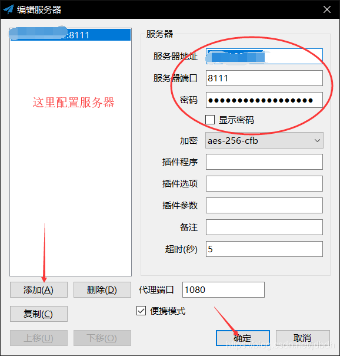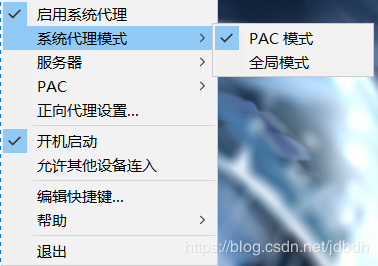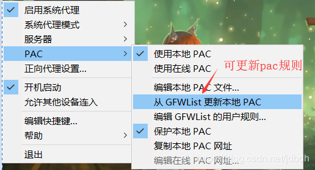

配置后，就可以打开youtub测试了。或者在全局代理模式下，通过如下方式测试：
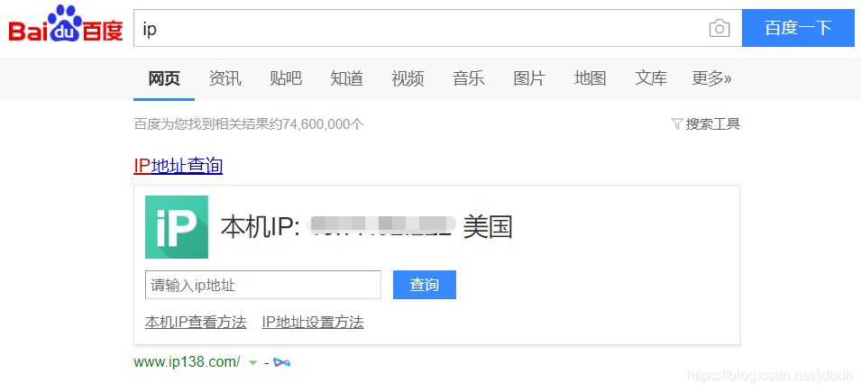

--------------------
安卓客户端配置，先安装客户端：[shadowsocks-android][8]。一个配置的例子：

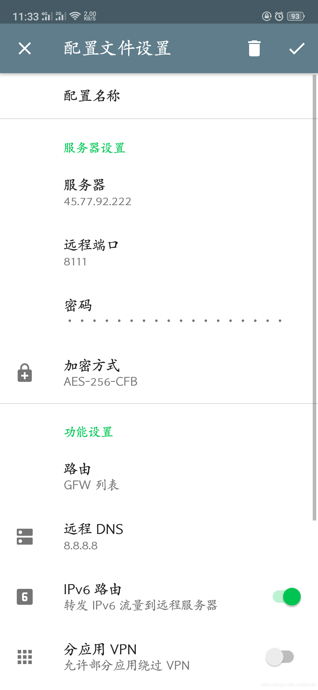
路由使用GFW列表就好，其他默认。

[6]:https://github.com/shadowsocks/shadowsocks/wiki/Ports-and-Clients
[7]:https://github.com/shadowsocks/shadowsocks-windows/releases
[8]:https://github.com/shadowsocks/shadowsocks-android

# 五 加速ss
打开youtube后，发现速度最大也就100KB/s。这是很正常的现象，这是GFW对入境流量随机丢包造成的，导致对国外服务器的访问速度降低。有很多加速方案可以使用，如锐速、BBR、魔改BBR和KCPTUN等等。经过[测试对比][9]，魔改BBR加速效果甚好。BBR改进了拥塞控制算法，大大提高了发包速度，加速tcp，进而加速ss；但它也间接的加大了整个网络的丢包率，造成整个网络的抖动性加剧。

魔改BBR通过对BBR参数调节，让BBR更为激进，加速效果更好。BBR需要内核至少4.9.0以上的支持，因此需要更换系统内核。可以通过南琴浪的魔改版BBR一键脚本升级内核和安全BBR。

下载脚本`tcp_nanqinlang-1.3.2.sh`：
```bash
wget --no-check-certificate https://raw.githubusercontent.com/tcp-nanqinlang/general/master/General/CentOS/bash/tcp_nanqinlang-1.3.2.sh
```
运行脚本：
```bash
bash tcp_nanqinlang-1.3.2.sh
```

选择1安装内核。如果提示是否要删除原来的内核，则删除它。如果安装成功则重启
```bash
reboot
```
重启后，输入`uname -r`确认是否成功更新了内核：
```bash
uname -r
```
继续执行之前的脚本：
```bash
bash tcp_nanqinlang-1.3.2.sh
```
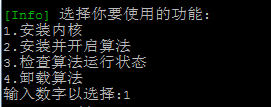
输入数字2安装BBR算法。如果成功会提示：
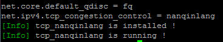
接下来重新运行ssserver为守护进程。

[9]:https://ssr.tools/674

# 六 其他
## 6.1 加密算法
简单算法容易被墙，据[介绍](https://github.com/shadowsocks/shadowsocks/wiki/Encryption)，`salsa20`和`chacha20`很不错，但需要依赖软件，有简单的[安装方法](https://github.com/shadowsocksrr/shadowsocks-rss/wiki/libsodium)：
```bash
yum install epel-release
yum install libsodium
```

# 参考
[shadowsocks github](https://github.com/shadowsocksr-backup/shadowsocksr)
[Configuration via Config File](https://github.com/shadowsocks/shadowsocks/wiki/Configuration-via-Config-File)
[Ports and Clients](https://github.com/shadowsocks/shadowsocks/wiki/Ports-and-Clients)
[vultr](https://www.vultr.com/)
[锐速/BBR/魔改BBR/KCPTUN加速效果对比测试](https://ssr.tools/674)
[南琴浪版魔改BBR一键安装脚本](https://ssr.tools/550)
[Shadowsocks PAC模式和全局模式的区别](https://www.zybuluo.com/gongzhen/note/472805)
[Shadowsocks wiki](https://en.wikipedia.org/wiki/Shadowsocks)
[Google BBR是什么？以及在 CentOS 7 上如何部署](https://juejin.im/entry/5b8e5308e51d45589b26be26)

# 推荐阅读
* [漫谈 Shadowsocks 代理和 DNS 解析](https://blog.terrychan.me/2017/thoughts-on-shadowsocks-dns)
* [ShadowSocks（影梭）不完全指南](http://www.auooo.com/2015/06/26/shadowsocks%EF%BC%88%E5%BD%B1%E6%A2%AD%EF%BC%89%E4%B8%8D%E5%AE%8C%E5%85%A8%E6%8C%87%E5%8D%97/)