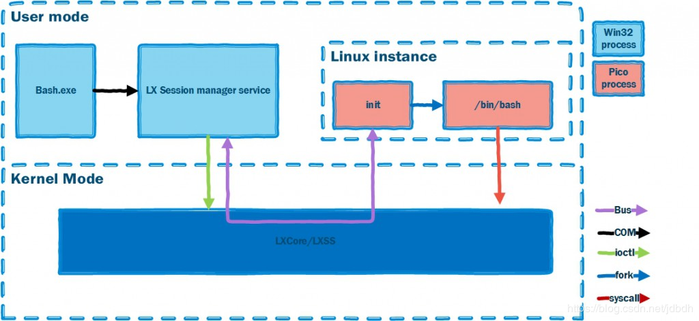
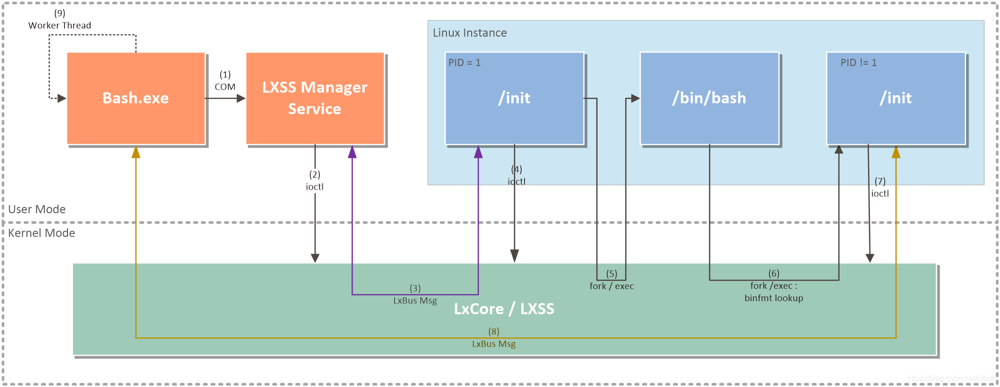
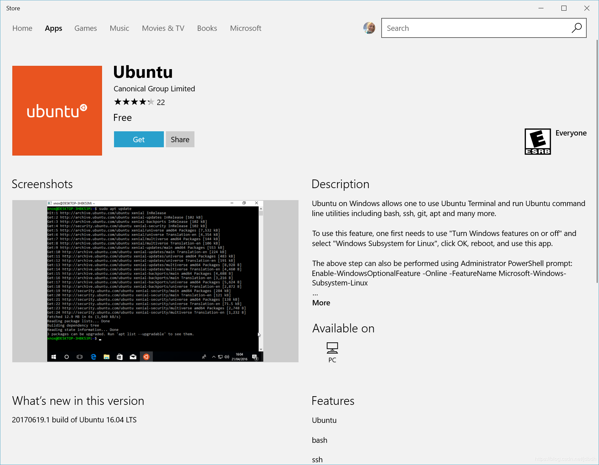
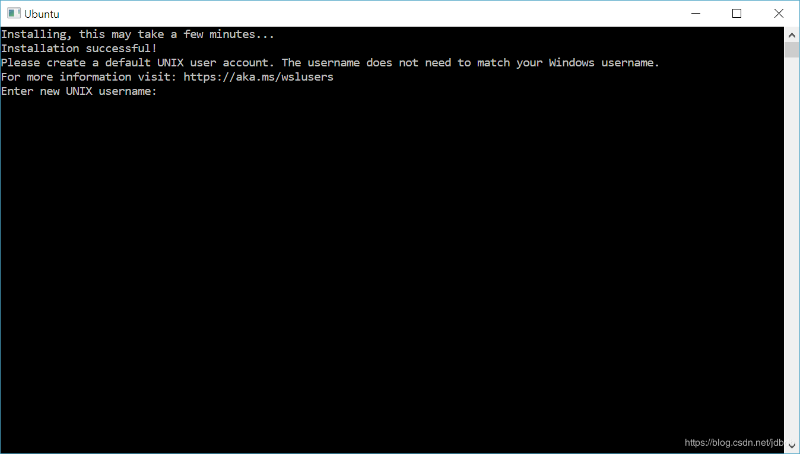

[TOC]

# 一 介绍
Windows Subsystem for Linux（WSL）是一个用于在本地运行linux二进制可执行文件（ELF格式）的兼容层。与虚拟机相比，wsl没有虚拟硬件的过程，而是直接在windows上虚拟一个linux内核，模拟linux系统调用，以运行linux执行文件。因此效率要比虚拟机高，但是它使用的是自己实现的init进程而不是发行版的init进程，并且几乎没有实现任何系统服务，因此只适用于软件的开发，而不是作为桌面环境或生产性的服务器。
>* 并且wsl的目的也是如此，可以简单的将它理解为可以运行linux可执行文件的、类似于powershell的shell，具有**互操作性**（在linux中执行windows命令，在windows中执行linux命令）。
>* 在我看来，失去了发行版的init后，我们主要用到的是发行版的包管理器。

# 二 原理
## wsl组件

wsl实现的组件涉及到了用户和内核模式。在Windows NT内核模式中，LXCore，LXSS这两个驱动提供了linux内核调用的实现，即将linux调用转化为对应的windows NT内核调用；还提供了两种文件系统：VolFs（挂载在`/`目录上，支持linux文件系统所有特性）和DriverFs（挂载在`/mnt/c`，`/mnt/d`等等windows分区，主要为了支持系统间的**互操作性**）；驱动还会模拟内核的行为，对linux进程进行调度。

在用户模式下，windows提供了一种特殊的进程类型：Pico进程，来支持linux进程的运行。windows会 “放松” 对该类型进程的控制，主要交由linux虚拟内核调用和管理，即**隔离性**（因此需要系统的支持，低版本的系统不能使用wls的功能）。pico会将ELF二进制可执行文件装入到自己的地址空间，然后执行在linux虚拟内核提供的兼容层上。一个pico对应一个linux进程，并且pico进程也是windows的一种特殊进程，因此你可以在任务管理器上看到linux进程。
>无论exe还是elf格式的二进制文件，原理上都可以在同架构的cpu上执行，只是结构不同操作系统不能解析罢了。而Pico能够解析ELF格式的二进制文件，只需要linux虚拟内核能够提供正确的系统调用，就能够运行大部分linux命令。

LXSS管理服务主要用于协调windows和linux进程之间的关系，和给于Bash.exe（并不是shell，只是我们访问wsl的入口）调用linux命令的接口。所有的运行的linux进程都会被加入到叫**Linux实例**（应该有LXSS记录的）中，**只有第一次请求访问linux进程时才会创建Linux实例，才会创建init进程**；当window关机时，会自动关闭linux实例，即关闭linux所有进程。
>也就是wsl不会随windows系统自启而自启，同时没有使用发行版的init进程，导致wsl中没有服务的存在。

## wsl运行过程

linux中正常的启动过程是引导程序载入内核，内核初始化后载入init进程，init进程开启各项服务，将系统配置到用户可用的状态，如多用户登录、图形界面登录等。此时linux自启完成，接着等待用户的登录，并且登录方式多种，如控制台登录、ssh登录、虚拟终端登录等等。

而wsl并不是一个真正的系统，而只是windows的一部分，可以执行linux二进制可执行文件。内核也是虚拟出来的，但是具有一定隔离性，如linux进程由虚拟内核调度，也具有互操作性。

因此当windows自启结束并加载了上述LxCore、LXSS两个驱动后，已经能够提供linux进程系统调用了。此时wsl的init进程（windows自己实现的）并不会立刻运行，即暂时没有一个linux实例。只有当第一次访问wsl时（执行Bash.exe），才会创建linux实例，执行init**服务进程**（图中左边）。这个init进程会伴随linux实例，直到实例结束。然后再创建bash shell 和 另一个init 进程（图中右边），在本次会话结束时（关闭Bash.exe窗口）这两个进程结束。之后再通过Bash.exe连接wsl，都只会创建bash和右边的init进程。
>目前官网声称，后台进程能够在会话结束后仍然运行（一般linux中会关闭），经测试，没有标准输出的后台进程才能够存活。还是建议使用nohup。

至于详细过程，请看上图。

## 文件系统
上述讲到了，wsl只有两种windows设计的文件系统：VolFs和DriverFs。其中VolFs文件系统主要是为了支持linux文件系统的全部特性，如linux的文件权限、符号链接、不同于windows的文件名、文件名大小写敏感等等。

而DriveFs主要是为了挂载windows的分区，并且实现互操作性而存在。实际上就是NTFS文件系统的包装，能够让NTFS在linux中使用，即使也提供了大部分linux文件系统特性，但是限制很多，如：
>* 文件目录权限全为777，实际上就算是root用户，在windows分区中也只有打开Base.exe命令拥有者的权限。说明普通用户使用root权限也不能修改c盘中大部分文件。
>* 最好不要在windows下创建文件名只有大小写不同的文件，尽管NTFS支持了。
>* 支持linux符号链接，为windows可执行文件创建符号链接时，注意添加后缀`.exe`。不要与windows的快捷方式混淆，它们目的一致，但结构不一致，不能在linux中使用。

## 禁忌
不要在任何情况下，使用windows工具访问、创建、修改linux发行版的文件。在安装了WSL后，可以在C盘中找到它的根目录，含有linux标准目录结构，但千万不要修改它。

linux和windows文件系统的数据存放形式是不同的，为了支持linux文件系统，wsl实现了VolFs。VolFs本质上还是使用了windows的NTFS的文件格式（因此你能够找到它），只是将Linux文件的元数据放入[NTFS文件的扩展属性][24]中。因此linux文件系统可以正常执行，而在windows看来，它的文件不存在或者空；而使用windows修改它的文件时，不会保留它的扩展属性，导致在linux中看起来不正常。

因此，如果想要实现两个系统的互操作，应该将工作目录置于windows分区内，linux文件夹外，在windows的文件夹中操作。

参考：[Do not change Linux files using Windows apps and tools](https://devblogs.microsoft.com/commandline/do-not-change-linux-files-using-windows-apps-and-tools/)

[24]:https://en.wikipedia.org/wiki/Extended_file_attributes#Windows_NT

# 三 使用
## 安装
wsl需要系统支持，安装之前最好将系统更新到最新版。
1. 开启linux子系统（WSL），使用管理员权限打开PowerShell，运行：
	```powershell
	Enable-WindowsOptionalFeature -Online -FeatureName Microsoft-Windows-Subsystem-Linux
	```
2. 重启
3. 安装发行版，这里使用Ubuntu。打开应用商店，然后下载
	
4. 按win键，找到ubuntu，点击运行，它会进行初始化。然后提示输入普通用户名和密码，这是默认登录用户。ubuntu中默认root用户不能登录。

5. 进入Ubuntu后，更新发行版
	```bash
	sudo apt update && sudo apt upgrade
	```
	
	> 建议更新发行版之前, 先换源. 我下的Ubuntu18.04LTS版, 因此对应的阿里源如下:
	>
	> ```
	> deb http://mirrors.aliyun.com/ubuntu/ bionic main restricted universe multiverse
	> deb http://mirrors.aliyun.com/ubuntu/ bionic-security main restricted universe multiverse
	> deb http://mirrors.aliyun.com/ubuntu/ bionic-updates main restricted universe multiverse
	> deb http://mirrors.aliyun.com/ubuntu/ bionic-proposed main restricted universe multiverse
	> deb http://mirrors.aliyun.com/ubuntu/ bionic-backports main restricted universe multiverse
	> deb-src http://mirrors.aliyun.com/ubuntu/ bionic main restricted universe multiverse
	> deb-src http://mirrors.aliyun.com/ubuntu/ bionic-security main restricted universe multiverse
	> deb-src http://mirrors.aliyun.com/ubuntu/ bionic-updates main restricted universe multiverse
	> deb-src http://mirrors.aliyun.com/ubuntu/ bionic-proposed main restricted universe multiverse
	> deb-src http://mirrors.aliyun.com/ubuntu/ bionic-backports main restricted universe multiverse
	> ```

## 用户账户和权限
WSL与Windows有一定隔离性，WSL的用户对Linux文件、进程的权限与Linux一致。但对于`/mnt/c`下Windows的最高访问权限取决于运行`Base.exe`（或`Ubuntu.exe`）的拥有者的权限。

> 即, 即使普通Windows用户以root身份运行WSL, 也不能随意删除、访问、修改c盘文件。


## wsl管理
有三种运行wsl的方法：
* 发行版提供的app，如`ubuntu`：进入到linux家目录
* `wsl.exe`或`bash.exe`：linux置当前目录为工作目录
* `wsl [command]` 或 `bash -c [command]`：运行linux命令，当前目录作为工作目录

wsl中可以存在多个发行版，通过**wslconfig**管理，`wslconfig /?`可以查看具体功能：
>* `wslconfig /list [/all]`：列出已注册的发行版，`/all`额外列出正在安装和卸载的发行版。
>* `wslconfig /setdefault`：设置运行wsl时的默认发行版
>* `wslconfig /unregister`：卸载发行版

具体的发行版提供的入口，如ubuntu，可以设置默认用户，详细参考`ubuntu /?`

## 互操作
上面多次提到互操作性，也就是可以在windows中运行linux进程，在linux中运行windows进程，并且支持两个不同进程间的输入输出重定向。

在windows中使用`wsl [command]`运行linux命令，需要注意：
* linux命令使用当前目录作为工作目录
* 对于windows文件，拥有运行WSL的windows用户权限；对于linux文件拥有登录用户权限
* 文件路径使用linux格式

例子：
```bash
C:\temp> wsl ls -la
<- contents of C:\temp ->

C:\temp> wsl sudo apt-get update
[sudo] password for username:
Hit:1 https://archive.ubuntu.com/ubuntu xenial InRelease
Get:2 https://security.ubuntu.com/ubuntu xenial-security InRelease [94.5 kB]

C:\temp> wsl ls -la | findstr "foo"
-rwxrwxrwx 1 root root     14 Sep 27 14:26 foo.bat

C:\temp> dir | wsl grep foo
09/27/2016  02:26 PM                14 foo.bat

C:\temp> wsl ls -la > out.txt

C:\temp> wsl ls -la /proc/cpuinfo
-r--r--r-- 1 root root 0 Sep 28 11:28 /proc/cpuinfo

C:\temp> wsl ls -la "/mnt/c/Program Files"
<- contents of C:\Program Files ->
```
-----------
在linux中运行windows命令，使用`[binary name].exe`（后缀不要省略），linux可以直接访问windows命令的原因在于linux共享了windows的`PATH`环境变量（我猜是linux中唯一的守护进程init做的）。需要注意：
* 一般windows命令的工作目录为当前linux的工作目录。如果linux工作目录位于linux文件系统内，则windows的工作目录会改为Base.exe的工作目录（原因见2.4小节）。
* 拥有与运行WSL拥有者一致的权限
* 需要注意路径，看下面的例子

例子：
```bash
$ notepad.exe

$ ipconfig.exe | grep IPv4 | cut -d: -f2
172.21.240.1
10.159.21.24

$ ls -la | findstr.exe foo.txt

$ cmd.exe /c dir
<- contents of C:\ ->

$#cmd 原生命名需要通过cmd.exe运行
$ cmd.exe /C dir
<- contents of C:\ ->

$ PING.EXE www.microsoft.com
Pinging e1863.dspb.akamaiedge.net [2600:1409:a:5a2::747] with 32 bytes of data:
Reply from 2600:1409:a:5a2::747: time=2ms

$ notepad.exe "C:\temp\foo.txt"
$ notepad.exe C:\\temp\\foo.txt
```
# 四 其他

## 配置

为了实现一下目的:

* 方便访问Windows家目录

* 打开终端时, 智能cd到Windows家目录

  > 当打开wsl时被设置了初始路径, 则不做任何动作

* 取消`ls`高亮

在`.bashrc`中配置

```shell
# 环境变量
export sidian=/mnt/c/Users/sidian #设置Windows家目录的环境变量
export hosts_home=/mnt/c/Windows/System32/drivers/etc #配置hosts环境变量
export notes=$sidian/Documents/notes-all/notes

## 当打开终端并且位于Linux家目录时,则切换到Windows的家目录中.这里考虑到了作为VSCode默认终端的情况.
[[ $PWD == $HOME ]] && cd $sidian

## 取消ls高亮
alias ls=ls
```

## 环境变量

WSL仅共享了Windows的`PATH`变量, 因此可以访问Windows的命令. 而其他的环境变量并没有被共享.

# 参考

* [微软官方文档](https://docs.microsoft.com/zh-cn/windows/wsl/about)：介绍了安装、使用
* [Learn About Windows Console & Windows Subsystem For Linux (WSL)](https://devblogs.microsoft.com/commandline/learn-about-windows-console-and-windows-subsystem-for-linux-wsl/)：介绍了wsl原理
* [wsl wiki](https://en.wikipedia.org/wiki/Windows_Subsystem_for_Linux)
* [Do not change Linux files using Windows apps and tools](https://devblogs.microsoft.com/commandline/do-not-change-linux-files-using-windows-apps-and-tools/):来自Rich的警告
* [wsl官方博客集合](https://blogs.msdn.microsoft.com/wsl/)

# 推荐阅读
[Setting Up WSL with Graphics and Audio](https://research.wmz.ninja/articles/2017/11/setting-up-wsl-with-graphics-and-audio.html)：对WSL理解的很好