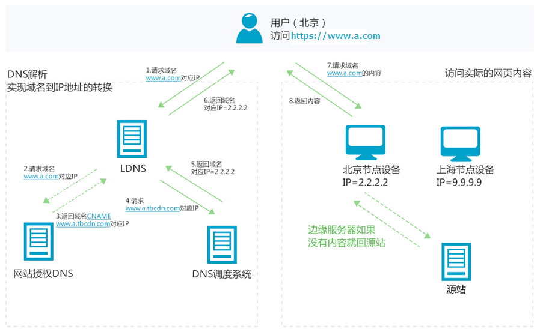

# 介绍

内容分发网络（Content Delivery Network，简称CDN）是建立并覆盖在承载网之上，由分布在不同区域的边缘节点服务器群组成的分布式网络。

> 简而言之，就是在你的web服务于客户之间建立了一层缓存，通过DNS解析实现。

# 工作原理

简单来说，就是通过`cname`（域名）返回用户边缘缓存节点IP，该节点返回缓存内容给用户。

> 我的疑问：非缓存内容也要通过该节点返回给用户？

# 使用(aliyun)

## 开通CDN

1. 登录控制台，单击[立即开通](https://cdn.console.aliyun.com/?spm=a2c4g.11186623.2.12.207b79c69k4hP1)。开通前需[实名认证](https://account.console.aliyun.com/?spm=a2c4g.11186623.2.13.207b79c69k4hP1#/auth/home)
2. 选择[计费模式](https://www.aliyun.com/price/product?spm=a2c4g.11186623.2.14.207b79c69k4hP1#/cdn/detail)

# 暂停学习

因为CDN使用有一定限制，会审核域名和内容，我目前的毕设使用不了CDN

# 参考

- [CDN](<https://help.aliyun.com/product/27099.html>)