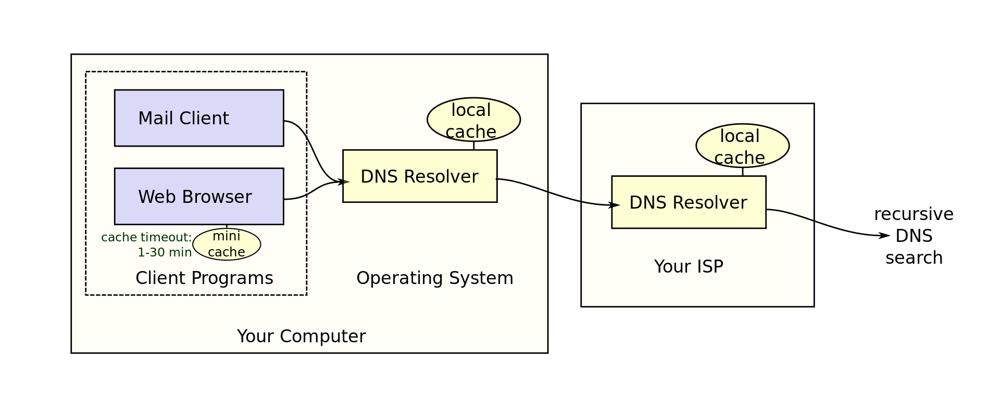

# 一 介绍
**DNS**（Domain Name System）是一个层次化、分布式域名系统，为接入互联网的设备提供服务。它关联域名到ip上，提供将域名转化为ip的服务。

**域名**（domain）由ascii码的子集组成，可含字符`a`-`z`,`A`-`Z`,`0`-`9`或`-`。域名具有层次结构，最右边为顶级域名，然后为子域名...所有域名组成的**域名空间**可以被表示成树形结构，每个节点含有**该域名**对应的**资源记录**（resource record）信息。比如一种A记录，记录着域名和ip地址的映射关系。一个或多个域名被划分为一个**zone**（区域），每个zone都会委派一个**域名服务器**（name server）管理这些域名。域名空间如下：
*The hierarchical Domain Name System for class Internet, organized into zones, each served by a name server*

>术语domain具有商业功能，而zone用于DNS服务的配置，即一个服务器用于配置该zone内的域名信息。

每个zone对应一个**域名服务器**（name server），该域名服务器保存着**该zone的所有域名**对应的**资源记录**（resource record）信息。管理员可以将子域名委派给给其他name server管理（即子域名划分为新zone）。域名服务器被划分为三类：**根域名服务器**（root name server）、**顶级域名服务器**（TLD name server）和**权威域名服务器**（Authoritative name server）。root zone对应根域名服务器，顶级域名对应顶级域名服务器，而其他的zone对应权威域名服务器。

域名服务器中存储该zone对应的所有resource records，都存在一个zone文件中。记录分为很多种，比如A记录（映射domain到ip）、NS记录（委派zone到权威域名服务器）、CNAME记录（为域名添加别名）等等。

根和顶级域名服务器一般存储NS记录，即下一级域名服务器的地址，而权威域名服务器一般存储A记录，也存NS记录（即委派了一个新的zone）。因此向权威域名服务器发出请求时，会解析到对应的IP地址或下一级权威域名服务器的地址；而向根或顶级域名服务器请求时，一般会解析到下一级服务器的地址。

域名服务器的客户端是**DNS解析器**（DNS resolver），它负责向域名服务器发起一系列请求，然后成功解析域名。DNS解析器的查询方式分为三种：**recursive**，**non-recursive**和**iterative**。
* **iterative**：从根域名服务器开始往下查询，直到解析成功或失败。如解析`www.example.com`，先查询根域名服务器，找到“com”顶级域名服务器的ip地址；查询该顶级域名服务器，找到“example.com”权威域名服务器的ip地址；查询该服务器，找到子域名www.example.com 是一条A记录，返回ip，查询成功。
* **recursive**：一个DNS解析器查询一个实现了解析器功能的DNS服务器，要求该服务器返回结果。
* **non-recursive**：类似iterative，但是查询的时候利用DNS解析器的缓存。

DNS解析器可以被自己的电脑或DNS服务器实现，并且也会实现缓存，如图所示：

>* 电脑向DNS解析器发送后，第一个DNS解析器会想ISP的DNS解析器发起recursive查询，ISP的DNS解析器可能会发起iterate或recursive查询。
>* 没有细分查询方法时，统称为recursive query了（猜想）。
>* ISP的DNS解析服务器就是拨号后DHCP分配的DNS地址。

# 二 DNS查询
在没有缓存的情况下，DNS解析器执行iterative查询，一般需要8步：
1. A user types ‘example.com’ into a web browser and the query travels into the Internet and is received by a DNS recursive resolver.
2. The resolver then queries a DNS root nameserver (.).
3. The root server then responds to the resolver with the address of a Top Level Domain (TLD) DNS server (such as .com or .net), which stores the information for its domains. When searching for example.com, our request is pointed toward the .com TLD.
4. The resolver then makes a request to the .com TLD.
5. The TLD server then responds with the IP address of the domain’s nameserver, example.com.
6. Lastly, the recursive resolver sends a query to the domain’s nameserver.
7. The IP address for example.com is then returned to the resolver from the nameserver.
8. The DNS resolver then responds to the web browser with the IP address of the domain requested initially.

解析器返回ip地址后，浏览器可以访问网页了：

9. The browser makes a HTTP request to the IP address.
10. The server at that IP returns the webpage to be rendered in the browser (step 10).

# 三 其他
## 域名服务器与域名
被委派的域名服务器是被域名标识的，因此想要找到域名服务器的ip，还需要发起另一个DNS请求。如查找com域名服务器的IP地址需要查询根域名服务器，而根域名服务器的ip地址会被DNS解析器记录在本地。

## 根域名服务器
根域名服务器有13个ip地址，但实际上一个ip地址对应着很多冗余的根域名服务器，因此多达600个根域名服务器。通过[任播][2]，实现了one-to-one-of-many的联系，数据包会被发往最近的服务器。当DDoS攻击来临时，一个服务器拒绝服务了，任播会将流量发给可服务的服务器。如果**任播网络**的容量大于DDoS的流量时，攻击能够有效被缓解。

>ipv4中没有任播，ipv6才有定义。因此在ipv4中，任播被网络协议BGP实现的，于是这种协议构成的网络也叫任播网络？不晓滴

[2]:https://www.cloudflare.com/learning/cdn/glossary/anycast-network/

## 负载均衡
负载均衡可以通过权威域名服务器实现，解析域名时返回根据服务器状态返回不同的ip地址。比如baidu.com的权威域名服务器，就实现了负载均衡（猜的），解析www.baidu.com（server中的一条记录）会返回离你最近的服务器地址（实际情况复杂点，多了个NS记录）。

## DNS传播
当你注册或更改域名记录时，要过一段时间才能够使用更改后的域名，因为DNS解析器都有缓存的，域名解析的结果会被缓存起来并保存一定时间（resource record中规定的）。只有当缓存的记录过期了，才会重新解析更改过的域名，传播完成。

## 域名注册
我们（**注册人registrant**）租用域名时，可以向阿里、腾讯上租用域名，而阿里、腾讯只是获得了域名销售权的**注册商（registrar）**，拥有注册权利。而域名由**注册局（registry）** 管理。

参考：
https://www.cloudflare.com/learning/dns/glossary/what-is-a-domain-name-registrar/
https://sg.godaddy.com/zh/help/what-is-the-difference-between-a-registry-registrar-and-registrant-8039

## 常用记录
资源记录（resourse record）就是域名服务器保存的记录，也是解析器请求的内容。资源记录会被存在zone文件中。常用的记录类型如下：
* **A** record - The record that holds the IP address of a domain. Learn more about the A record.
* **CNAME** record - Forwards one domain or subdomain to another domain, does NOT provide an IP address. Learn more about the CNAME record.
* **MX** record - Directs mail to an email server. Learn more about the MX record.
* **TXT** record - Lets an admin store text notes in the record. Learn more about the TXT record.
* **NS** record - Stores the name server for a DNS entry. Learn more about the NS record.
* **SOA** record - Stores admin information about a domain. Learn more about the SOA record.
* **SRV** record - Specifies a port for specific services. Learn more about the SRV record.
* **PTR** record - Provides a domain name in reverse-lookups. Learn more about the PTR record.

# 四、其他2
## ip地址和物理地址
ip地址和物理地址没有必然的关系，只是一些数据库会以某种手段将ip地址和物理地址的映射关系记录下来，供商业使用或提供在线免费搜索。
https://www.lifewire.com/does-ip-address-geolocation-really-work-818154

## 内网穿透原理
大致有两种，其一为DDNS，即动态域名解析。办理宽带后，运营商只会动态分配我们公网地址，随时会变。在本地安装客户端，当公网地址改变时，则通过域名服务器动态改变DNS记录，刷新新的ip。因此，无论公网ip如何变动，通过域名总能找到对应的主机。

提供DDNS的组织一般会分配它的域名的子域名，这样他们的权威域名服务器自动修改ip更为方便。如果宽带连接到路由器上，还需要对路由器设置端口映射。

https://hsk.oray.com/news/4610.html

----------
其二为数据转发，内网安装一个客户端，它与它的云服务器建立长连接。用户通过子域名访问云服务器，同样从云服务器上获得结果。而云服务器将请求交给客户端，客户端返回结果给云服务器。客户端向内网的一个本地服务器发起请求和接收结果。因此客户端和云服务器起着代理和转发的作用。

这种例子如ngrok，工作原理：https://www.quora.com/How-does-ngrok-work
## CDN原理
即在服务器和客户端之间添加一层缓存服务器。将原来域名指向服务器的A记录换成指向缓存服务器的CNAME记录，然后通过你访问的域名，解析到你的服务器中。如果缓存服务器中有缓存，则直接发送给客户端，无则从服务器上获取。
>参考：[CDN工作原理（CNAME）](https://blog.csdn.net/heluan123132/article/details/73331511)

# 参考
https://www.cloudflare.com/learning/dns/what-is-dns/
https://en.wikipedia.org/wiki/Domain_Name_System
https://en.wikipedia.org/wiki/List_of_DNS_record_types
https://en.wikipedia.org/wiki/DNS_zone
https://www.siteground.com/kb/what_is_dns_propagation_and_why_it_takes_so_long/