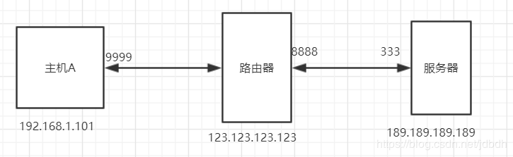
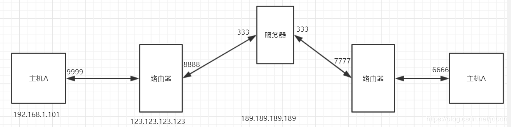

# 一 介绍
局域网内主机获得的是私有ip地址，是不能访问公网的。之所以现在我们能够使用私有ip上网，是因为路由器使用NAT转换（实际上是NATP），但缺点是不能将内网主机暴露在公网上。考虑到成本，NAT一般在路由器中实现。不同Nat的实现如下：

* 静态转换（static nat）：私有ip和路由器上的公有ip一对一全映射，适用于公网ip较多的情况下。
* 动态转化（dynamic nat）：公有ip与哪个私有ip映射是不确定的，需要时动态确定，适用于公网ip略少于私有主机数目的情况。
* 端口复用（NATP）：一个ip对应多台主机，通过端口达到复用的目的，目前我们路由器使用的方式。
* ALG（Application Level Gateway）：传统nat只对ip层或传输层数据头部进行处理，一些应用层中也包含了地址信息，ALG就是能同时转换这些新信息的技术。

# 二 具体过程
## 2.1 NAT穿透
下面详细介绍NATP，举个例子：

局域网主机A(192.168.1.101)访问公网服务器B(189.189.189.189)，主机A的请求头部为：
>源192.168.1.101:9999
>目189.189.189.189:333

私有ip不能在公网上传播，因此路由器(123.123.123.123)对A的请求头进行NAPT转换，转换后的头部如下：
>源123.123.123.123:8888
>目189.189.189.189:333

并且**路由器会记下映射信息，共三方面：源请求主机ip和端口、目的主机ip和端口、路由器ip和端口**。映射信息会保存一定时间。即使其他主机发往路由器对应的端口上，也不能访问到内网主机，因为不符合记录中的目的主机信息，数据会被丢弃，而不是转发。

下面公网服务器B发送响应，头部如下：
>源189.189.189.189:333
>目123.123.123.123:8888

然后路由器发现符合转换条件，于是转换头部信息：
>源189.189.189.189:333
>目192.168.1.101:9999

可以看出，在整个过程中可以把NAT看做不存在，于是进行了一个191.168.1.101:9999与189.189.189.189:333的请求响应过程。

## 2.2 P2P
如果两个不同局域网内的主机想实现点对点通信呢？

局域网内主机在访问外网时，路由器中会存在一个临时的ip、端口转换映射。我们需要一个服务器记录这种临时端口和ip，然后客户端每隔一段时间发送心跳包，保证端口不被改变。

当用户B想与A通信时，
1. 服务器通知用户A向B的路由器地址和映射端口发送数据，此时B的路由器会抛弃，因为没有对应映射（需要同时对应记录的三个信息）；
2. 然后B正式开始向A发起请求，此时A的路由器中有了映射且符合，允许通过并进行NAPT转化。B与A的连接正式完成。

实现多种多样，这里只是给出一种思路而已。

# 参考
* [nat （网络地址转换方法）](https://baike.baidu.com/item/nat/320024)
* [p2p之NAT穿透](https://www.jianshu.com/p/3d64be31857e)