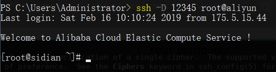
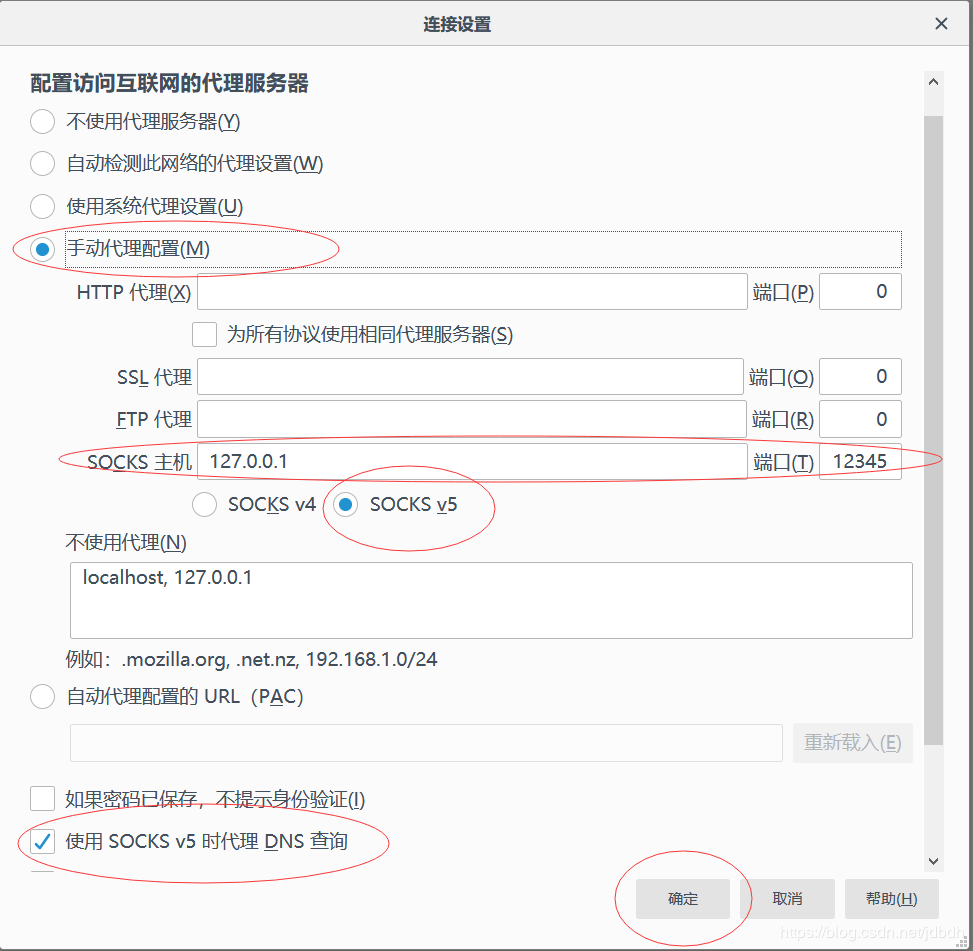
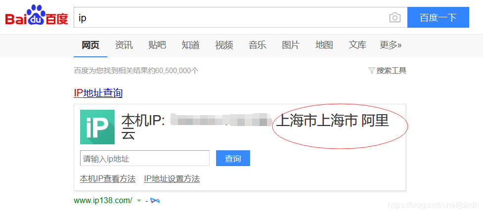
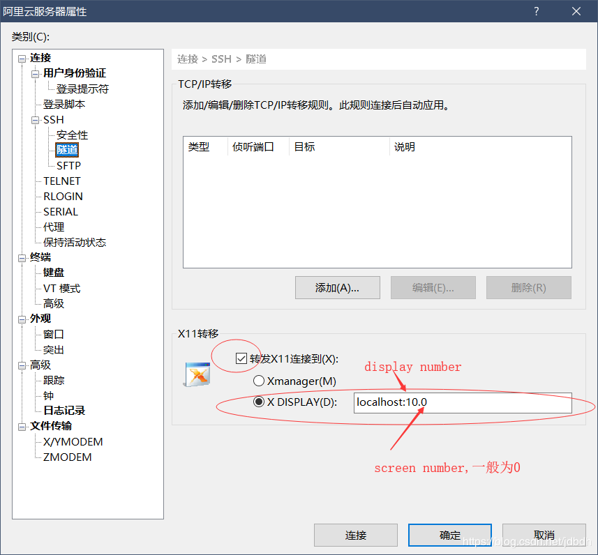
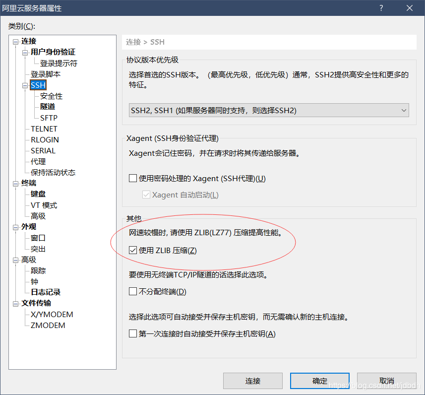

[TOC]

# 一 介绍
**Secure Shell (SSH)** 是一种加密网络协议，用于在不安全的网络上安全地操作网络服务。典型的应用包括远程命令行登录和远程命令执行，但不局限于次，任何网络服务都给可以被SSH的转发功能保护起来。

ssh分为ssh服务端和ssh客户端，ssh的实现有很多种，最常用的是**OpenSSH**（含server和client）。几乎所有系统都预装OpenSSH，包括win10（预装OpenSSH client）。win10除了预装的OpenSSH客户端外，还有PuTTy，XShell（推荐）等客户端可用。这里介绍的命令、原理，都和OpenSSH有关。

>预备知识：[秘钥与数字证书][1]
# 二 认证
在连接ssh服务器前需要认证，shh服务端和ssh客户端之间有两种认证方式：密码认证和秘钥认证。

## 密码认证
每个ssh服务器在第一次安装**sshd**（服务进程）时，会自动产生**host keys**。host keys仅仅只是普通的秘钥对，可由`ssh-keygen`手动生成（不建议）。一个服务器每种加密算法仅有一对host keys，位于`/etc/ssh/`目录下：
```bash
[root@sidian ~]# ll /etc/ssh/
total 612
-rw-r--r-- 1 root root     581843 Sep  7  2017 moduli
-rw-r--r-- 1 root root       2276 Sep  7  2017 ssh_config
-rw------- 1 root root       3671 Feb 15 15:23 sshd_config
-rw------- 1 root root        668 Nov  7 10:09 ssh_host_dsa_key
-rw-r--r-- 1 root root        618 Nov  7 10:09 ssh_host_dsa_key.pub
-rw------- 1 root root        227 Nov  7 10:09 ssh_host_ecdsa_key
-rw-r--r-- 1 root root        190 Nov  7 10:09 ssh_host_ecdsa_key.pub
-rw-r----- 1 root ssh_keys    387 Nov  7 10:09 ssh_host_ed25519_key
-rw-r--r-- 1 root root         82 Nov  7 10:09 ssh_host_ed25519_key.pub
-rw------- 1 root root       1679 Nov  7 10:09 ssh_host_rsa_key
-rw-r--r-- 1 root root        410 Nov  7 10:09 ssh_host_rsa_key.pub
```
ssh客户端第一次登录到ssh服务器上时，服务器会发送host key中的公钥给客户端。每种加密算法都有一种，那发送哪种呢？这个由ssh客户端配置`ssh_config`中的`HostKeyAlgorithms`选项决定。

客户端收到公钥后，会提示警告：
```bash
　　$ ssh user@host
　　The authenticity of host 'host (12.18.429.21)' can't be established.
　　RSA key fingerprint is 98:2e:d7:e0:de:9f:ac:67:28:c2:42:2d:37:16:58:4d.
　　Are you sure you want to continue connecting (yes/no)?
```
这是因为客户端发出的请求极有可能会被hacker（黑客）拦截，并发送客户端黑客自己的公钥，那么接下来hacker就能获取客户端发送的密码。这就是所谓的[中间人攻击][2]。

因此客户端会发出警告，其中的fingerprint就是公钥进行[md5][3]运算后产生的摘要，因为公钥太长了。如果你确认该公钥来自要连接的服务器，那么直接输入yes确认连接。接下来就是验证密码了，并且之后的连接都是在秘钥加密下进行的，安全得到保障。

服务器的公钥被客户端接收后，它会被保存在`$HOME/.ssh/known_hosts`文件之中，下次再次连接到ssh服务器时，会认出公钥已经保存在本地，从而逃过警告，直接提示输入密码。

## 秘钥认证
开局一句疑问：密码认证不是用到了秘钥了吗？接下来详细分析。

使用了秘钥认证后，则可以直接登录服务器而不必给出密码。原理很简单，用户自己生成一对秘钥，将公钥放入存入服务器的`$HOME/.ssh/authorized_keys`文件中。登录服务器时，服务器会生成一条随机生成的数据，并使用公钥加密，然后发送给客户端。客户端解密后将原始数据与当前会话号做`md5`运算，然后发送给服务器。服务器也将原始数据与会话号做`md5`运算，并与客户端发回的信息比较，如果匹配，则用户可信，登录成功。

-------------------
配置方式如下，首先生成一对秘钥：
```bash
$ ssh-keygen
Generating public/private rsa key pair.
Enter file in which to save the key (/home/ylo/.ssh/id_rsa): 
Enter passphrase (empty for no passphrase): 
Enter same passphrase again: 
Your identification has been saved in /home/ylo/.ssh/id_rsa.
Your public key has been saved in /home/ylo/.ssh/id_rsa.pub.
The key fingerprint is:
SHA256:Up6KjbnEV4Hgfo75YM393QdQsK3Z0aTNBz0DoirrW+c ylo@klar
The key's randomart image is:
+---[RSA 2048]----+
|    .      ..oo..|
|   . . .  . .o.X.|
|    . . o.  ..+ B|
|   .   o.o  .+ ..|
|    ..o.S   o..  |
|   . %o=      .  |
|    @.B...     . |
|   o.=. o. . .  .|
|    .oo  E. . .. |
+----[SHA256]-----+
```
建立秘钥对时，可以对私钥进行加密，通过设置`passphrase`（密码）实现。还可以修改秘钥对的放置位置，其中，公钥和秘钥放于同一位置，以`.pub`结尾。当然，直接默认就好了，可能会导致覆盖之前的。

将公钥传入服务器的`$HOME/.ssh/authorized_keys`文件中：
```bash
$ ssh-copy-id user@host
```
这个命令只是一个脚本，如果本机中不存在，那么可以输入以下命令替代：
```bash
ssh root@aliyun "umask 077; test -d .ssh || mkdir .ssh ; cat >> .ssh/authorized_keys || exit 1" < .ssh\id_rsa.pub
```
需要自己将用户名、域名和公钥位置替换掉。

接下来就是直接登录了，无需密码。

# 三 转发
除了远程登录和执行命令外，ssh的端口转发也特别强大，能够将网络服务安全的运行在不安全的网络上。

>最重要的是，它能打穿内网，还能翻墙哦~~

## 本地转发（local forwarding）
最基本的形式：
```bash
ssh -L [bind_address:]port:host:hostport 	[user@]hostname [command]
```
指定一个连接到ssh客户端`port`端口的连接被转发到`host`主机的`hostport`端口上。`bind_address`指定哪个主机被允许连接到本地端口上，空和`*`表示允许任何主机连接。

基本原理是，连接到ssh客户端`port`的连接被转发到ssh服务器上，ssh服务器再将连接转发到`host`主机的`hostport`端口上。这里ssh服务器是中转服务器。
>端口转发也可以通过配置文件配置。

## 远程转发（remote forwarding）
最基本的形式：
```bash
ssh -R [bind_address:]port:host:hostport [user@]hostname [command]
```
指定一个连接到ssh服务器`port`端口的连接被转发到`host`主机的`hostport`端口上。`bind_address`指定什么主机可以连接到ssh服务器的`port`端口上，空和`*`表示任何主机都可以连接。
>远程主机默认只允许本地连接，想要bind_address生效，需要启用ssh服务端配置的GatewayPorts选项。

基本原理是，连接到ssh服务器`port`端口的连接被转发到ssh客户端，ssh客户端将请求转发到`host`的`port`端口上。这里ssh客户端是中转服务器。

## 动态端口转发
```bash
ssh -D [bind_address:]port [user@]hostname [command]
```
产生一个绑定在ssh客户端`port`上的socks5代理，一切发给该端口的数据都被发送给ssh服务器，交由ssh服务器代为请求。`bind_address`指定哪个主机可以连接本地主机的代理端口。

基本原理是，ssh客户端生成socks5代理端口`port`，ssh客户端的请求可以通过该端口交由ssh服务器代为请求。这里ssh服务器是socks5代理服务器。被socks5代理的应用需要支持socks5协议。

## 例子：socks5代理
为浏览器设置socks5代理，让浏览器的请求被socks5服务器代理（即ssh服务器）。

首先在ssh client上的`12345`端口建立socks代理。我这里使用的是win10自带的OpenSSH客户端，连接到上海的阿里云主机：

此时ssh服务器变成了socks5代理服务器，可以通过本地端口`12345`连接到代理服务器上。现在为浏览器配置socks5代理，由于chrome使用IE浏览器代理配置（即系统代理）不方便，因此这里使用火狐浏览器演示。打开火狐的网络设置，然后配置如下：

然后在浏览器中打开百度，搜索：`ip`：

表明使用ssh成功实现了socks5代理。

>shadowsocks也是基于socks5代理的。如果服务器位于国外，岂不是能翻墙了？是的。

## 如何安全
上面只是讲了ssh转发的原理和过程，那安全如何保证？其实只有ssh客户端到ssh服务器之间的连接时安全的、加密过的，其他的不一定了。。

举个例子，在本地转发中，ssh服务器作为中转服务器转发数据，ssh客户端（如手机）可以安全的在公共wifi的环境下发送数据，避免被人窃取。那ssh服务器到目标服务器（如web服务器，这里没有使用https协议的情况下）的数据传送就不一定安全了。。可以考虑将ssh服务放入目标服务器中，此时ssh服务器只需转发给本机即可。

# 四 远程GUI之x11转发
在**X Window System**，GUI应用（如firefox，gedit）只是一个**client**，client发送绘图命令给**display server**，从display server那获得用户事件；display server负责执行client的绘图命令，显示在显示器上，用用户设备（如鼠标、键盘）上获得事件发送给client。它们之间通过**sock**联系（即网络），因此远程主机上的GUI应用在本地上显示成为了可能。而ssh提供了这个功能，ssh在ssh服务端和客户端之间建立安全隧道，将client和display server之间的数据通过隧道在网络上安全传输。
>本小白还未深入了解linux GUi原理，但大致如此，也可参考：[零碎知识3.4小节][4]

还有，client是通过环境变量**DISPLAY**找到display server的，在使用ssh进行x11转发时，会自动设置该变量指向本地主机的display server。

## 使用OpenSSH
因此远程主机不需要安装什么桌面环境，如**GNOME**什么的，只需要client（如**gedit**）和ssh服务端。本地主机则需要ssh客户端和display server（在windows中使用**Xming**）。下面给出具体操作步骤（基于OpenSSH）：
1. 服务器安装`xauth`：client连接到display server时需要用到，貌似用来授权的，具体干什么不知，但是ssh会自动配置好它。
	```bash
	先判断xauth是否已经安装
	yum list install | grep xauth
	仓库中查找xauth
	yum search xauth
	输入完整软件名安装
	yum install xorg-x11-xauth
	```
2. 在ssh服务器上的配置文件`/etc/ssh/sshd_config`中允许`x11`转发（`X11Forwarding`）和允许x11转发到远程的display server上（`X11UseLocalhost`）。
	```a
	#只需要配置X11Forwarding（默认no），实际上发现，貌似distributor已经配置好了。
	#而X11UserLocalhost默认yes，无需配置。
	#还有一个X11DisplayOffset，无需配置，默认为10
	X11Forwarding yes
	```
3. 修改ssh服务配置后需要重启服务：
	```bash
	systemctl restart sshd.service
	```
4. 本地主机安装**Xming**（display server），打开它的附带程序**XLaunch**配置它的[display number][5]为10，因为`X11DisplayOffset`默认为10。
5. 使用ssh客户端登录，同时允许x11转发：
	`ssh -X user@host`
	或者直接在客户端配置文件中配置允许，然后就不用使用选项`-X`了：
	```property
	Host *
	  ForwardX11 yes
	```
然后。。。我失败了。。不知道为什么`DISPLAY`变量没有被设置，手动配置后x11数据也没有被转发到本地主机。给我感觉win10的OpenSSH对windows支持不是很好。。

于是接下来其他ssh客户端来进行x11转发！！这里介绍**XShell**

## 使用XShell
同样，服务器安装`xauth`，配置文件中允许x11转发；本地主机安装Xming，或者使用XShell自带的Xmanager，我使用Xming，然后设置它的[display number][5]为10（实践发现，只需Xming与XShell的display number对应就行了，不用管ssh服务器配置）。接着来配置XShell：

默认你已经配置好了账号密码，然后点击连接。

通过yum下载GUI文本编辑器`gedit`：
```bash
yum install gedit
```
然后运行该GUI程序：
```bash
gedit
```
结果windows上成功显示了远程主机上运行的GUI程序：

由于网络带宽，速度等原因，程序会有点卡，因此可以压缩client与display server的数据：

## 吐槽
即使压缩了数据传输，远程主机的GUI程序在本地显示也超慢。。特别是在我的阿里云服务器下行速度只有200KB左右下，，，我再也不想使用ssh x11这个功能了。。。

# 五 命令
OpenSSH常用命令大致如下：
* **ssh** - OpenSSH client
* **sshd** - OpenSSH server
------------
* **ssh-keygen** - creates a key pair for public key authentication
* **ssh-copy-id** - configures a public key as authorized on a server
--------------
* **scp** - file transfer client with RCP-like command interface
* **sftp** - file transfer client with FTP-like command interface
--------------
* **ssh-agent** - agent to hold private key for single sign-on（单点登录）
* **ssh-add** - tool to add a key to the agent

不会的命令查看帮助手册就行了，这里稍微介绍下。
## ssh
OpenSSH最常用的命令，登录、转发都通过该命令进行。

功能:

* 登录

  * `-C` 设置压缩数据
  * `-o` 覆盖配置文件的设置
  * ...

* 转发

  > 其中，在使用ssh进行x11转发时，设置了选项`-X`，其实也可以设置`-Y`，那两者有何不同？简单的来说，使用`-X`，你会被当做不被信任的客户，一些设计安全的命令将被拒绝执行。而`-Y`作为受信任的客户，权限更大。但是由于远程主机中的其他client GUI程序可以嗅探到你的x11数据，导致你的信息可能被主机内其他用户窃取。

* 远程运行命令

* 调试

  `-v` 进入详细模式, 将打印调试信息. 可以使用多个`-v`选项, 调试信息将更详细, 最多3个, 如

  ```shell
  ssh -vvv root@sidian.live
  ```

>参考：
>
>* [SSH COMMAND](https://www.ssh.com/ssh/command/#sec-Configuring-port-forwarding)
>* [-Y与-X](https://askubuntu.com/questions/35512/what-is-the-difference-between-ssh-y-trusted-x11-forwarding-and-ssh-x-u)

## ssh-keygen
用于产生秘钥对.

例子:

* 产生默认的RSA密钥

  ```shell
  ssh-keygen
  ```

* 产生ECDSA密钥

  ```shell
  ssh-keygen -t ecdsa
  ```

* 对于所有类型**host key**(RSA, DSA, ECDSA和ED25519), 如果丢失, 则补上

  ```shell
  ssh-keygen -A
  ```

>参考:[SSH-KEYGEN - GENERATE A NEW SSH KEY](https://www.ssh.com/ssh/keygen/)

## ssh-copy-id
生成好秘钥对后，需要将公钥放入ssh服务端的`$HOME/.ssh/authorized_keys`文件后才能使用秘钥认证，`ssh-copy-id`命令会自动帮你完成，它会在ssh客户端的`$HOME/.ssh/`下寻找最新修改的秘钥，也可以通过`-i`指定秘钥位置或使用`touch`修改文件的时间属性。

`ssh-copy-id`只是一个脚本而已，如果系统内没有该命令（比如win10就没有），可以使用以下命令代替：
```bash
ssh user@host "umask 077; test -d .ssh || mkdir .ssh ; cat >> .ssh/authorized_keys || exit 1" < public_key
```
然后将`user`,`host`,`public_key`替换。

## ssh-agent,ssh-add
不太懂，只说个大概。在生成秘钥对时，可以为私钥设置`passphrase`（即秘钥的密码）。然后每次秘钥认证时（即登录），用到秘钥需要输入密码，如果我使用相同秘钥登录多个服务器，那么每次都要输入相同的密码，真是令人烦躁。于是出现了ssh-agent，将密码保存在内存中，持续一个会话范围，在会话范围内的秘钥认证都无需使用密码，实现了**单点登录**。ssh-agent保存第一次认证passphrase，并自动为后面的认证输入；而ssh-add可以添加密码到agent中。

ssh-agent默认开启的，并且很少使用，所以不详细查看它的使用了。
>参考：
>[ssh-agent](https://en.m.wikipedia.org/wiki/Ssh-agent)
>[SSH-AGENT - SINGLE SIGN-ON USING SSH](https://www.ssh.com/ssh/agent)

## 文件传输

### scp

```bash
scp [[user@]host1:]file1 ... [[user@]host2:]file2
```
`scp`类似`cp`，能够两台主机之间使用ssh协议拷贝文件。`file2`可以是目录或保存的文件名, 可以是绝对地址或相对地址(相对于家目录)

```bash
#文件目的不填,则放入root用户的家目录下
scp file root@wx.sidian123.top:
```

### sftp

SSH File Transfer Protocol ( SFTP ) , 一个基于SSH隧道, 提供文件访问, 传输和管理的网络协议, 作为SSH2.0协议的扩展而存在.

`sftp`命令，暂且不会, 略。

### rz&sz

需在支持某个协议 (忘了) 的工具中使用, 如XShell, 然后服务器中安装`lrzsz`

```shell
yum install  lrzsz -y
```

> 一般发行版都有

使用:

* 上传`rz`
* 下载`sz <file>`

### 其他

还可以使用流的重定向来在两台主机上传输文件，并且Windows也支持流的重定向。

XShell传输文件的一种方法如下：[xshell如何传输文件](https://jingyan.baidu.com/article/3a2f7c2e27e01b26afd611cc.html)

# 六 配置

## 介绍

* SSH服务端

  `/etc/ssh/`中存放`sshd`服务的配置文件, 如

  * 配置文件`sshd_config`
  * 一些*host key* ( 见2.1小节 )

  > Linux服务器一般既有服务端, 也有客户端, 因此该目录下也会存在`ssh`客户端的配置文件

* SSH客户端

  `/etc/ssh/` 和 `$HOME/.ssh/`目录下, 存放`ssh`客户端的配置文件, 如含

  * 用户已认可的服务器的公钥信息的`authorized_keys`文件, 见2.2小节.
  * 用户的密钥对
  * 配置文件, 如`/etc/ssh/ssh_config`, `$HOME/.ssh/config`

* `ssh`客户端配置优先级, 以递减的顺序给出:

    1.   command-line options，通过`-o`指定
    2.   user's configuration file ( `~/.ssh/config` )
    3.   system-wide configuration file ( `/etc/ssh/ssh_config` )

## 查看配置

* 查看默认值

  `man ssh_config`, `man sshd_config`

* 查看系统配置

  `/etc/ssh/ssh_config`, `/etc/ssh/sshd_config` 

## 配置

* 客户端配置可进行`Host`分组, `Host`成功匹配且最先找到的属性将被使用

  >  `*`匹配所有host
  
  > 貌似不加入`Host`分组也行?

### 防止连接被重置

当ssh客户端长时间未发送消息时, ssh服务端会自动断开连接. 可让客户端或服务端在一定时间间隔内发送消息, 保持活性.

这里先介绍相关配置和默认值

* 客户端

  * `ServerAliveInterval` 未收到Server数据后多少秒发送*活性消息*. 默认0, 即不发送

  * `ServerAliveCountMax` 发送*活性消息*时, 最多重试几次, 默认3次. 若都失败时, 将主动断开连接

* 服务端

	* `ClientAliveInterval` 未收到Server数据后多少秒发送*活性消息*. 默认0, 即不发送
	* `ClientAliveCountMax` 发送*活性消息*时, 最多重试几次, 默认3次. 若都失败时, 将主动断开连接

只需任何一方发送活性消息即可

* 客户端配置, 修改`$HOME/.ssh.config`

    ```properties
    Host *
            ServerAliveInterval 20
            ServerAliveCountMax 10
    ```

    > 数值20比较好, 太小了当连接数目多时耗服务端带宽大, 太大了可能会被服务端关闭连接.
    
* 服务端配置, 修改`/etc/ssh/sshd_config`

    ```shell
    ClientAliveInterval 60
    ClientAliveCountMax 10
    ```

    > 里面有现成的注释, 去掉并修改值即可

    然后重启服务

    ```shell
    systemctl restart sshd
    ```

按理说仅修改客户端就行了, 但我这里总是自动断开, 只能两端都设置了.

# 其他

## 问题查找

手段如下:

* `/var/log/auth.log`中记录着用户登录的日志
* `systemctl status sshd` 查看部分sshd运行日志
* `ssh -vvv  user@host` 链接时查看Debug信息

## SSHFS

SSHFS ( SSH Filesystem) 是一个文件系统客户端, 只需服务器存在SSH Server, 即可挂载远程服务器的目录到本地主机上, 由SFTP实现.

> 使用方案百度即可, 很简单.

## 坑

### 连接断开

莫名奇妙连接断开的原因有

1. 网络不稳定

   大概SSH连接经常断开的原因就在这里吧, 如果我使用XShell, 基本不会出现这种问题, 所以不同SSH客户端的稳定性都不一样. OpenSSH不咋行...

2. 连接被重置了

   解决方案见6.3.1小节

3. host key损坏

   利用如下方式重置

   ```shell
   rm /etc/ssh/ssh_host_*
   dpkg-reconfigure openssh-server
   ```

### Bad Owner Or Permissions

配置文件的权限和使用有规定, 可修改如下

```bash
chown $USER ~/.ssh/config
chmod 644 ~/.ssh/config
```

### 密钥不生效

公钥中含有生成该密钥的PC的host信息, 只能该PC使用

### 服务端不能加载host key

```log
Could not load host key: /etc/ssh/ssh_host_ed25519_key in /var/log/auth.log
```

用的云服务器, 可能镜像中本就没有密钥, SSHD不是首次安装, 也不会自己补上, 因此需手动补上:

```shell
ssh-keygen -A
```

# 参考

* [SSH COMMAND](https://www.ssh.com/ssh/command/#sec-Configuring-port-forwarding)

* [秘钥与数字证书][1]

* [SSH原理与运用（一）：远程登录](http://www.ruanyifeng.com/blog/2011/12/ssh_remote_login.html)

* [SSH原理与运用（二）：远程操作与端口转发](http://www.ruanyifeng.com/blog/2011/12/ssh_port_forwarding.html)

* [SSH PORT FORWARDING EXAMPLE](https://www.ssh.com/ssh/tunneling/example)

* [Create a SOCKS proxy on a Linux server with SSH to bypass content filters](https://ma.ttias.be/socks-proxy-linux-ssh-bypass-content-filters/)

* [Secure Shell](https://en.wikipedia.org/wiki/Secure_Shell)[HOST KEY](https://www.ssh.com/ssh/host-key)

* [How do I work with GUI tools over a remote server?](https://unix.stackexchange.com/questions/9870/how-do-i-work-with-gui-tools-over-a-remote-server)

* [How to forward X over SSH to run graphics applications remotely?](https://unix.stackexchange.com/questions/12755/how-to-forward-x-over-ssh-to-run-graphics-applications-remotely)

* [How can I specify a display?][5]

* [OpenSSH](https://www.openssh.com/)

* [所有SSH协议实现的对比](https://ssh-comparison.quendi.de/comparison/cipher.html)

[1]:https://blog.csdn.net/jdbdh/article/details/87376221
[2]:http://en.wikipedia.org/wiki/Man-in-the-middle_attack
[3]:https://blog.csdn.net/jdbdh/article/details/87189717#46_md5_258
[4]:https://blog.csdn.net/jdbdh/article/details/87189717#34_Desktop_Environment_153
[5]:https://stackoverflow.com/a/1210332/10248407