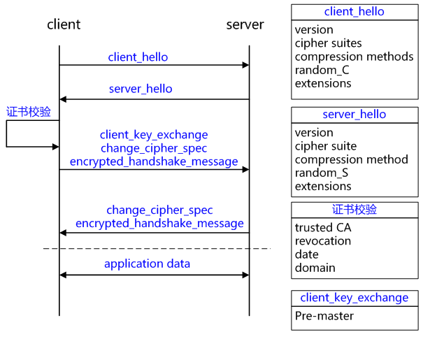
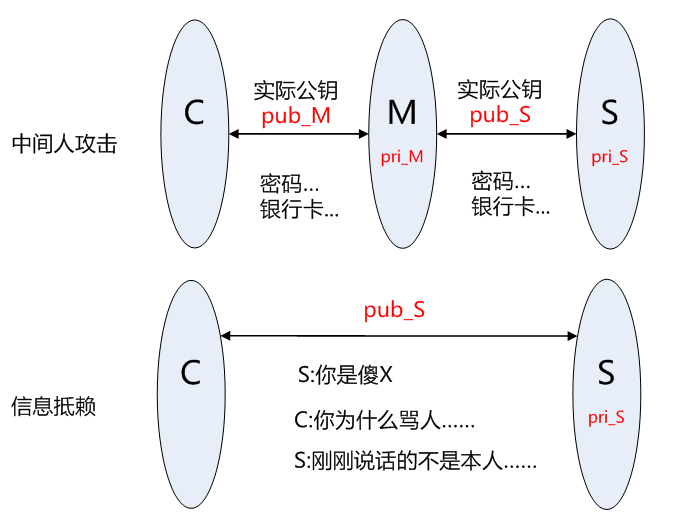
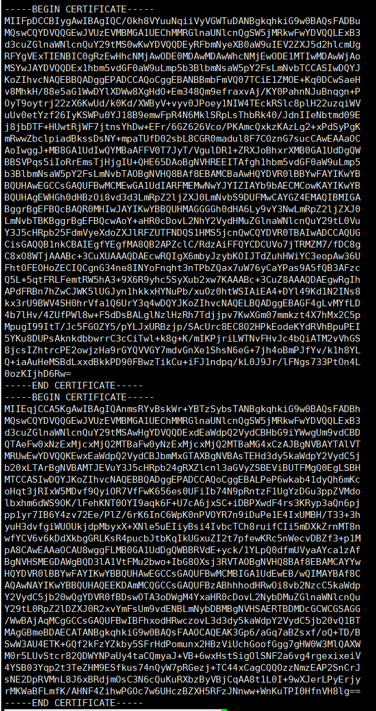

# 基础

## 介绍

SSL*(Secure Socket Layer 安全套接层)* 是HTTPS下的协议加密层, 之后SSL3.1更名为TLS*(Transport Layer Security 安全传输协议)* .

用于在两个通信应用间建立安全传输的通道.

## TLS/SSL握手过程

TLS/SSL握手的简化流程如下



* client_hello 协商握手方式 

  客户端发起请求，以明文传输请求信息，包含版本信息，加密套件候选列表，压缩算法候选列表，随机数，扩展字段等信息，相关信息如下：

  * 支持的最高TSL协议版本version，从低到高依次 SSLv2 SSLv3 TLSv1 TLSv1.1 TLSv1.2，当前基本不再使用低于 TLSv1 的版本;
  * 客户端支持的加密套件 cipher suites 列表， 每个加密套件对应前面 TLS 原理中的四个功能的组合：
    * 认证算法 Au  (身份验证)
    * 密钥交换算法 KeyExchange(密钥协商)
    * 对称加密算法 Enc (信息加密)
    * 信息摘要 Mac(完整性校验);

    如`ECDHE-ECDSA-AES128-GCM-SHA256` (好像多了个)
    
  * 支持的压缩算法 compression methods 列表，用于后续的信息压缩传输;
  * 随机数 random_C，用于后续的密钥的生成;

  * 扩展字段 extensions，支持协议与算法的相关参数以及其它辅助信息等，常见的 SNI 就属于扩展字段.

* server_hello 

  * 服务端返回协商的信息结果，包括选择使用的协议版本version，选择的加密套件 cipher  suite，选择的压缩算法 compression method、随机数 random_S 等，其中随机数用于后续的密钥协商;

  * server_certificates, 服务器端配置对应的证书链，用于身份验证与密钥交换;

* 证书校验

    • [[证书链\]](http://blog.csdn.net/hherima/article/details/52469488)的可信性 trusted certificate path，方法如前文所述;
     • 证书是否吊销 revocation，有两类方式离线 CRL 与在线 OCSP，不同的客户端行为会不同;
     • 有效期 expiry date，证书是否在有效时间范围;
     • 域名 domain，核查证书域名是否与当前的访问域名匹配，匹配规则后续分析;

* client_key_exchange+change_cipher_spec+encrypted_handshake_message

  1. client_key_exchange，合法性验证通过之后，客户端计算产生随机数字 Pre-master，并用证书公钥加密，发送给服务器;

  2. 此时客户端已经获取全部的计算协商密钥需要的信息：两个明文随机数 random_C 和 random_S 与自己计算产生的 Pre-master，计算得到协商密钥;

     ```
      enc_key=Fuc(random_C, random_S, Pre-Master)
     ```

  3. change_cipher_spec，客户端通知服务器后续的通信都采用协商的通信密钥和加密算法进行加密通信;

  4. encrypted_handshake_message，结合之前所有通信参数的 hash 值与其它相关信息生成一段数据，采用协商密钥 session secret 与算法进行加密，然后发送给服务器用于数据与握手验证;

* change_cipher_spec+encrypted_handshake_message

  1. 服务器用私钥解密加密的 Pre-master 数据，基于之前交换的两个明文随机数 random_C 和 random_S，计算得到协商密钥:enc_key=Fuc(random_C, random_S, Pre-Master);
  2. 计算之前所有接收信息的 hash 值，然后解密客户端发送的 encrypted_handshake_message，验证数据和密钥正确性;
  3. change_cipher_spec, 验证通过之后，服务器同样发送 change_cipher_spec 以告知客户端后续的通信都采用协商的密钥与算法进行加密通信;
  4. encrypted_handshake_message, 服务器也结合所有当前的通信参数信息生成一段数据并采用协商密钥 session secret 与算法加密并发送到客户端;

总结一些过程:

* 首先客户端与服务器端握手，其中包含有协商的**加密套件**、随机数等信息；
* 服务器向终端下发证书，终端进行**证书**校验，判断其是否可信；
* 如果要求双向认证，则客户端也需要向服务器提供证书，服务器根据证书进行校验，从而确认终端身份
* 客户端与服务器端分别利用证书中的**公钥**以及服务器端保存的**私钥**进行**会话密钥**协商
* 完成之后即可根据协商好的加密算法、摘要算法以及密钥进行数据加密传输并保证其完整性。

> 参考
>
> * https://crypto.stackexchange.com/a/27133
> * [HTTPS协议详解(四)：TLS/SSL握手过程](https://blog.csdn.net/hherima/article/details/52469674)

# 密钥&加密

## 密钥

密钥（**key**）由加密算法（**key algorithms**）生成。

加密算法分为两类：

* 对称密钥加密算法（**symmetric key algorithms**）
* 非对称密钥加密算法（**asymmetric key algorithms**）。

前者属于单钥加密（**private key cryptography**），只产生一把密钥，由该密钥加密和解密，拥有密钥的双方都需要保管好密钥，因此密钥容易被泄漏出去；而后者属于双钥加密（**public key cryptography**），产生两把密钥，一把公开的公钥（**public key**），一把不公开的私钥（**private key**），只需要保管好私钥，安全性大大提高了 。

在双钥加密的情况下

* 公钥和私钥一一对应，有一把公钥就必然有一把与之对应的、独一无二的私钥，反之亦成立。
* 所有的（公钥, 私钥）对都是不同的。
* 公钥可以解开私钥加密的信息，反之亦然；但不能解开自己加密的信息。公钥一般用于加密，私钥一般用于解密。
* 密钥对生成后，不能从公钥推出私钥，在原理上也不能从私钥推出公钥，但是由于一般私钥中也会保存公钥的信息，因此可行，如`ssh-keygen -y`

## 加密算法

* 对称加密算法

  * **DES**（Data Encryption Standard）：数据加密标准，速度较快，适用于加密大量数据的场合。

  * **3DES**（Triple DES）：是基于DES，对一块数据用三个不同的密钥进行三次加密，强度更高。

  * **AES**（Advanced Encryption  Standard）：高级加密标准，是下一代的加密算法标准，速度快，安全级别高；AES是一个使用128为分组块的分组加密算法，分组块和128、192或256位的密钥一起作为输入，对4×4的字节数组上进行操作。众所周之AES是种十分高效的算法，尤其在8位架构中，这源于它面向字节的设计。AES  适用于8位的小型单片机或者普通的32位微处理器,并且适合用专门的硬件实现，硬件实现能够使其吞吐量（每秒可以到达的加密/解密bit数）达到十亿量级。同样，其也适用于RFID系统。

    > 微信公众号用的该算法认证.

* 非对称加密算法

  * **RSA**：由 RSA 公司发明，是一个支持变长密钥的公共密钥算法，需要加密的文件块的长度也是可变的。RSA在国外早已进入实用阶段，已研制出多种高速的RSA的专用芯片。

  * **DSA**（Digital Signature Algorithm）：数字签名算法，是一种标准的 DSS（数字签名标准），严格来说不算加密算法。

  * **ECC**（Elliptic Curves  Cryptography）：椭圆曲线密码编码学。ECC和RSA相比，具有多方面的绝对优势，主要有：抗攻击性强。相同的密钥长度，其抗攻击性要强很多倍。计算量小，处理速度快。ECC总的速度比RSA、DSA要快得多。存储空间占用小。ECC的密钥尺寸和系统参数与RSA、DSA相比要小得多，意味着它所占的存贮空间要小得多。这对于加密算法在IC卡上的应用具有特别重要的意义。带宽要求低。当对长消息进行加解密时，三类密码系统有相同的带宽要求，但应用于短消息时ECC带宽要求却低得多。带宽要求低使ECC在无线网络领域具有广泛的应用前景。

  还有`ECDSA,ED25519`,`ECDSA`等.

> 对称加密速度快, 适合大量数据加密; 非对称加密算法安全性高, 但速度较慢.

## 其他算法

* 散列算法

  又称哈希算法, 是一种单向加密, 不可逆的算法. 散列算法对不同长度的数据输入, 产生固定长度的输出, 即**摘要**. 摘要通常用作验证数据完整性, 验证数据是否被修改等. 具体用图如: 文件校验, 数据签名, 鉴权协议.

  常见算法有:

  * **MD5**: 不可逆的加密算法, 任何输入都产生一段固定128位二进制的散列值.
  * **SHA1**: 是由NISTNSA设计为同DSA一起使用的，它对长度小于264的输入，产生长度为**160bit**的散列值，因此抗穷举(brute-force)性更好。SHA-1设计时基于和MD4相同原理,并且模仿了该算法。SHA-1是由美国标准技术局（NIST）颁布的国家标准，是一种应用最为广泛的Hash函数算法，也是目前最先进的加密技术，被政府部门和私营业主用来处理敏感的信息。而SHA-1基于MD5，MD5又基于MD4。
  * **HMAC**: 是密钥相关的哈希运算消息认证码（Hash-based Message Authentication  Code）,HMAC运算利用哈希算法，以一个密钥和一个消息为输入，生成一个消息摘要作为输出。也就是说HMAC是需要一个密钥的。所以，HMAC_SHA1也是需要一个密钥的，而SHA1不需要。

* 其他相关算法

   * **Base64**

     Base64是一种**编码**算法, 并非加密解密算法. 可以将二进制数据编码为64个可打印字符. 常用于HTTP, MIME协议下少量数据的快速传输. 

     标准的Base64并不适合直接在URL中传输, 因为Base64的`/`,`+`字符在URL中需要再次编码, 因此出现了Base64的一些变体, 如Base62.

## 应用

### 加密通道

A和B拥有配对的密钥, 那么他们间的交流是加密过的, 是可以信任的.

### 签名(防止串改)

对方发送的信息是否可靠? 信息是否被篡改过? 

上述问题可靠签名解决, 对方需要发送信息原文+签名. 签名由信息的摘要通过密钥加密后得到. 接收方则以接收信息原文生成摘要, 解析接收的签名得到对方的摘要, 两者一对比, 可判断文本内容是否已经被篡改过.

# 证书

## 密钥传输问题

客户端C与服务器S间通信, 由于C无密钥, 所以S需要将自己的公钥发给C. 这时, 中间节点M在C请求S时, 截胡, 发送自己的公钥, 与C建立"信任"通道, 同时M与S建立信任通道, 并代理C的请求.

此时M可进行两种操作: 中间人攻击和信息抵赖



为解决上述问题, 需引入CA和证书.

## 证书&CA

* 证书

  是 证书签发方信息, 拥有者信息, **公钥**, 签名（由签发方私钥签名）以及其他额外信息的集合.

* 签名

  证书必须签名后, 才能使用, 防止使用被篡改的证书. 

  证书使用方式不用, 签发方也会不同, 如HTTPS中签发方是CA; Android应用证书可以自签.

* CA

  数字证书权威认证机构CA (Certificate Authority) 提供证书审核和签名服务.

  首先CA是公认可信任的机构. 只要CA的私钥不被泄露, 那么CA签发的证书都是可信的.

## 校验&证书链

服务端发送证书给客户端, 客户端需要校验证书. 

* 校验原理

  当前证书是否可信, 可通过证书的上层签发方的证书校验, 上层证书又需上上层证书判断是否可信, 直到遇到根证书, 根证书是绝对可信的, 于是形成了一条**证书链**.  

  最顶层的证书, 就是**根证书**, **根证书绝对可信**; 其他的为**中间证书**, 需要校验是否可信. 

  一般电脑中已内置了一些根证书和中间证书. 也可以自己添加证书. 并且这些证书是绝对可信的.

  > 如Windows运行certmgr.msc可看到系统内已信任的证书.

  > 能够进入系统的证书, 说明该机构被审核过, 安全可信任程度很高.

  即便有人截取服务器A证书，再发给客户端，想冒充服务器A，也无法实现。因为证书和url的域名是绑定的。

* 一般CA自己都是使用中间证书签发我们的证书, 并且这些中间证书也随着系统默认内容到了系统中. 如果CA的证书在系统不存在, 那么签发证书时, 会在证书中补齐证书链. 

  如我司的一个证书, 除了自己的证书外, 还有CA的证书.

  

## 证书吊销

证书有一个过期时间, 除此之外, CA机构也可以吊销证书. 有两种方式:

* CRL (离线方案)

  Certificate Revocation List, 证书吊销列表, 是一个文件. 该文件包含已吊销的证书列表, 吊销日期, 以及刷新该CRL文件的时间等信息.

  CRL地址将包含在证书中, 证书校验时, 首次访问CRL文件, 会缓存起来, 直到下载CRL更新.

* OCSP (在线方案)

  Online Certificate Status Protocol, 证书状态在线查询协议，一个实时查询证书是否吊销的方式.

  请求者发送证书的信息并请求查询，服务器返回正常、吊销或未知中的任何一个状态。证书中一般也会包含一个 OCSP 的 URL  地址，要求查询服务器具有良好的性能。

部分 CA 或大部分的自签 CA (根证书)都是未提供 CRL 或 OCSP  地址的，对于吊销证书会是一件非常麻烦的事情。

## 相关文件

> 仅做参考, 不保证正确

证书相关的文件很多, 存储的信息也不同, 文件以不同扩展名区分:

* crt

  常见于*nix系统，大多是PEM编码，也可能是DER编码

* cer

  常见于Windows系统，大多是DER编码，也可能是PEM编码

* key

  用户存放密钥信息，和证书一样，可能是DER编码，也可能是PEM编码；可参照PKCS#1（RFC8017）查看其具体字段和定义；但密钥明文存储方式有所危险，一般可以使用PKCS#8格式（RFC5958）进行密钥的加密，即设置一个提取密钥

* csr

  证书签发请求，其实与证书内容相似，但不包含签发方信息，签发方根据CSR并添加自身的签发信息，从而生成证书文件，详情可参照（PKCS#10 RFC2314）

* pfx/p12

  实际上就是将证书和私钥&公钥一并打包成一个文件，并且设置“提取密码”

* jks/keystore/truststore

  一般常见于JAVA相关应用，实际上也是和p12类似，将证书和私钥一并打包并设置“提取密码”. 至于keystore和truststore只是概念上的区别，, 一般的, keystore用于表示用户或服务器证书，而truststore表示CA证书

## 证书类别

### 安全等级

* 域名型**DV** SSL证书
  * 适用于中小型企业官网、中小型商务网站、电子邮局服务器、个人网站等
  * 10分钟左右就可完成域名验证和快速颁发证书，无需递交纸质文件
  * **仅验证域名所有权**，无需人工验证申请单位真实身份，快速签发、价格低廉。

* 企业型**OV** SSL证书
  * SSL证书详情**有企业信息，无法仿造**;
  * 适用于企业官网、商务网站、证券、金融机构等，通过证书颁发机构审查网站企业身份和域名所有权以证明申请单位是一个合法存在的真实实体，用户可以在证书里面看到申请SSL证书的公司名称。
  * 一般OV证书在 1 至 5 个工作日内签发。

* 增强型**EV** SSL证书

  这个被认为是现有最安全的证书之一

  适用于金融证券、银行、第三方支付、网上商城等，重点强调网站安全和品牌可信形象的网站，涉及交易支付、客户隐私信息和账号密码的传输

### 域名数量

* 单域名SSL证书

  如果您只有一个域名，您可以获得单域名SSL证书。如果您有一个主要基于内容的相对简单和直接的网站，则单个域SSL证书是最佳选择。大多数个人网站属于该类别。

* 多域名SSL证书

  多域名数字证书是指一张证书可以保护多个域名，这样在证书的管理和续费上都能带来很大的便利。如果您拥有多个域名的网站，则可以选择多域名SSL证书，只需安装一个证书，就能轻松保护多个域名。

* 通配符SSL证书

  通配符域名证书，适用于同一主域名下同一级所有的子域名，不限个数，申请证书时。通配符证书可以保护通用域名和您在提交申请时指定的级别下的所有子域。

## 免费证书

https://freessl.cn/

免费的Dv SSL证书, 仅验证域名管理权, 需要为域名设置Txt记录, 记录认证信息, 从而达到域名所有权校验的目的.

# 实战案例

## HTTPS安全剖析

浏览器与服务器使用`https`通信时，通信过程如下（这里的步骤2是错误的）：

1. 浏览器向服务器发出请求。 

2. 服务器发送公钥给浏览器，之后双方都通过密钥对数据加密和解密。

3. 服务器将浏览器请求的数据通过**哈希函数**，产生**摘要**（digest），然后用私钥对摘要进行加密，产生**数字签名**（signature），并将数据连同数字签名发给浏览器。

   > 常用于生成摘要的哈希算法有`md5`，参考：[零碎知识4.6小节][1]

4. 浏览器使用公钥解密数字签名，得到摘要，然后也对数据进行哈希运行产生摘要，将两者对比，判断是否来自于要访问的服务器，然后执行自己的操作。

5. 两者继续通过密钥协商, 得到一个对称密钥, 用于后续数据加密传输.

   > 因为对称密钥加密解密速度快.

但是问题来了，步骤1、2中，浏览器请求服务器时，请求被hacker拦截，并模拟服务器发送自己的公钥给浏览器，于是hacker可以通过自己的私钥来骗取浏览器的信任，容易窃取到浏览器用户的信息。这就是著名的[中间人攻击][2]。

也就是说，浏览器获得的公钥不可信。为了解决此问题，引入了大家都信任的**数字证书认证机构（CA）** ，CA用自己的私钥将服务器一些相关信息和公钥加密起来形成**数字证书**。于是步骤2中，服务器不再发送公钥给浏览器，而是发送数字证书。浏览器一般会保存被信任的所有认证机构（CA）的公钥，用于解密收到的数字证书，得到服务器的公钥，再进行步骤4进行验证。

只要CA的私钥不被泄漏，hacker就不能伪造数字证书，从而不能将自己的公钥传给浏览器。即使hacker获取了其他服务器的私钥和数字证书，拦截浏览器请求交给它该数字证书，浏览器也判断该证书代表的服务器不是自己访问的，因为数字证书中还含有与服务器相关的信息。

> 若hacker充当代理的角色, 那么链接仍不是正常的. 因为代理中传输数据, hacker相当于是透明的, hacker可以随时获取和串改数据. 这就是为啥使用别人的VPN, SS科学上网不安全的原因.

这就是https能够保证数据安全的原因。

[1]:https://blog.csdn.net/jdbdh/article/details/87189717#46_md5_258
[2]:http://en.wikipedia.org/wiki/Man-in-the-middle_attack

## Android证书

* 介绍

  Android使用的jks证书, 包含证书和私钥&公钥. 并且Android证书的签发方和拥有发都是自己设置的, 即自签的证书.

* 证书用途

  保证更新后的APK与手机内安装的APK的拥有者是同一个. 

* 如何保证

  * 当用户安装了已签名的APK后, **即表示用户信任了该证书**. 也无需其他证书保证该证书.

  * 当用户更新APK时, 用之前信任的证书中的公钥, 来判断要更新的应用的证书是否可信. 

    > 具体判断算法我不知道

  > 主要思想是, 用户安装了APK, 代表信任了它的证书, 并且能够获取到公钥, 接着通过该证书的公钥可判断其他证书是否可信. 因为其他人不知道私钥, 当数据改变后, 无法生成正确的签名.

* 证书指纹

  就是数字签名. 在Android中, 数字签名(证书指纹) + 包名, 唯一确定一个APK应用.

* 证书生成

  使用JDK的`keytool`生成, 但使用Android Studio的界面使用更为方便

  在`build > generate signed Bundle / APK`中添加证书信息

  
  
  > jks文件应该是用于自签证书的密钥吧

> [证书番外篇之Android证书](https://blog.csdn.net/jjxojm/article/details/81395573)
>
> [Android开发者证书的创建](https://blog.csdn.net/nahancy/article/details/89485962)

# 参考

* 入门阅读
  * [密码学笔记](http://www.ruanyifeng.com/blog/2006/12/notes_on_cryptography.html)
  * [数字签名是什么？](http://www.ruanyifeng.com/blog/2011/08/what_is_a_digital_signature.html)
  * [Key (cryptography)](https://en.wikipedia.org/wiki/Key_(cryptography))
  * [ssh-keygen](https://www.ssh.com/ssh/keygen/)
* 证书进阶
  * [HTTPS、SSL、TLS三者之间的联系和区别](https://blog.csdn.net/enweitech/article/details/81781405)
  * [关于证书链的一点认知](https://www.jianshu.com/p/fcd0572c4765)
  * [根证书与中间证书的区别](https://www.sohu.com/a/250886697_708801)
  * [TLS初探（1）概述](https://blog.csdn.net/jjxojm/article/details/81266181)
  * [TLS初探（2）证书简介](https://blog.csdn.net/jjxojm/article/details/81266601)
  * [TLS 百科](https://baike.baidu.com/item/TLS/2979545?fr=aladdin)
  * [证书番外篇之Android证书](https://blog.csdn.net/jjxojm/article/details/81395573)
* HTTP交互过程
  * [深入浅出HTTPS的交互过程](https://www.jianshu.com/p/42e1c073c142)
  * [https交互过程](https://www.jianshu.com/p/d45b1d9e9d13)
* 加密进阶阅读
  * [加密算法(DES,AES,RSA,MD5,SHA1,Base64)比较和项目应用](https://www.cnblogs.com/sochishun/p/7028056.html)
* TLS握手好文
  * [HTTPS协议详解(一)：HTTPS基础知识](http://blog.csdn.net/hherima/article/details/52469267) 
  * [HTTPS协议详解(二)：TLS/SSL工作原理](http://blog.csdn.net/hherima/article/details/52469360)
  * [HTTPS协议详解(三)：PKI 体系](http://blog.csdn.net/hherima/article/details/52469488)
  * [HTTPS协议详解(四)：TLS/SSL握手过程](http://blog.csdn.net/hherima/article/details/52469674)
  * [HTTPS协议详解(五)：HTTPS性能与优化](http://blog.csdn.net/hherima/article/details/52469787)
