* 筛选 ( 含多列 )

  [EXCEL多列进行筛选](https://jingyan.baidu.com/article/b907e6270f640906e6891c31.html)

* 占比

  [excel怎样计算单项所占合计的百分比？](https://jingyan.baidu.com/article/b2c186c8f01f04c46ef6ffca.html)
  
* 格式清除

  [如何快速清除excel表格中的格式？](

* 系统学习教程: [Excel Easy](https://www.excel-easy.com/)

# Intro

## Range

多个Cell的集合.

### 选中

可选中单个Cell

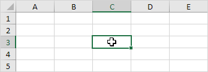

选中整列

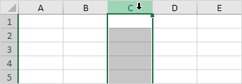

选中整行

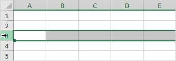

选中某一区域

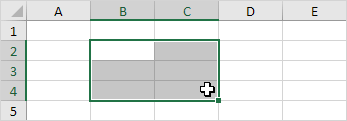

> 选中一个Cell并拖动

选中零散的Cell

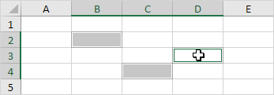

> 长按`Ctrl`并点击Cell

### 自动填充

内容重复填充

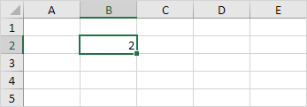

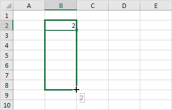

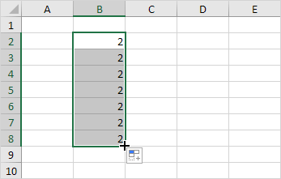

> 在Cell右下角拖动

按照一定规律自动填充

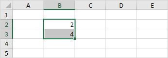

> 还有其他例子, 如日期自增填充等.

### 移动

在边框处, 可移动Range

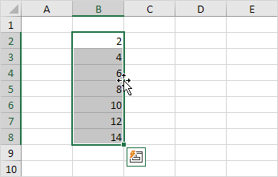

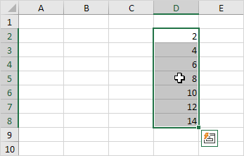

### 复制粘贴

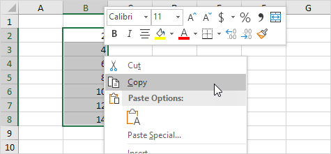

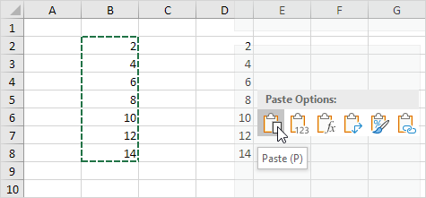

> 或Ctrl+v , Ctrl+c

### 插入行列

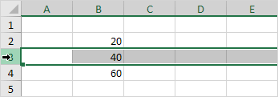

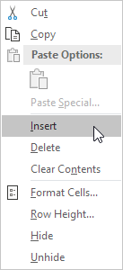

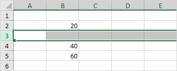

## 公式&函数

* 介绍

  公式是一个计算Cell值的表达式, 函数是已预定义的一组公式.

* 编辑公式

  公式以`=`开始, Cell的值通过坐标引用

  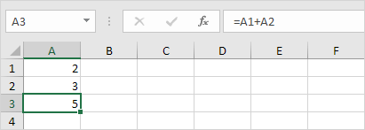

* 优先级

  公式拥有优先级, 其中`()`优先级最高

  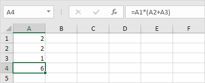

* 拷贝/粘贴公式

  张贴后的公式中, 变量的引用会依据公式的相对位置而改变.

  未粘贴前

  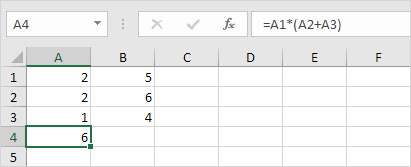

  粘贴公式后

  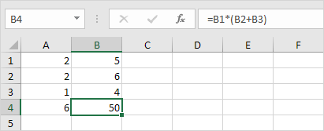

* 使用函数

  和编程语言中的函数差不多, 使用方式也差不多

  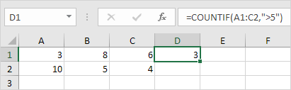

  > `COUNTIF`函数计算值大于5的Cell个数.

  参数以`,`隔离, 上面的`A1:C2`是范围Range的表示方法.

  若不记得函数明, Excel提供了面板, 可自行查找
  
  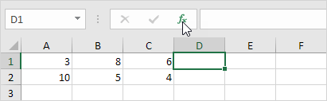