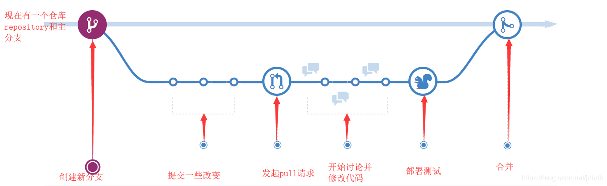
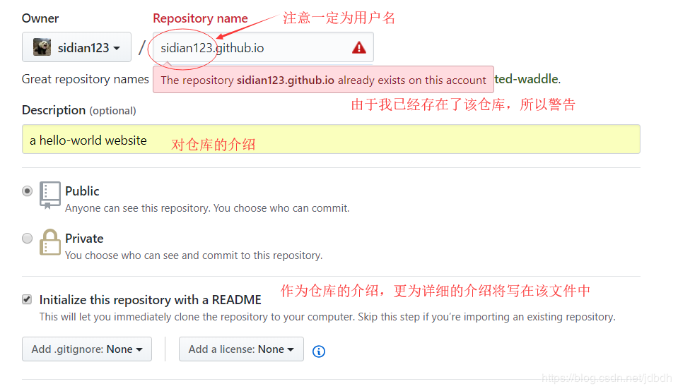
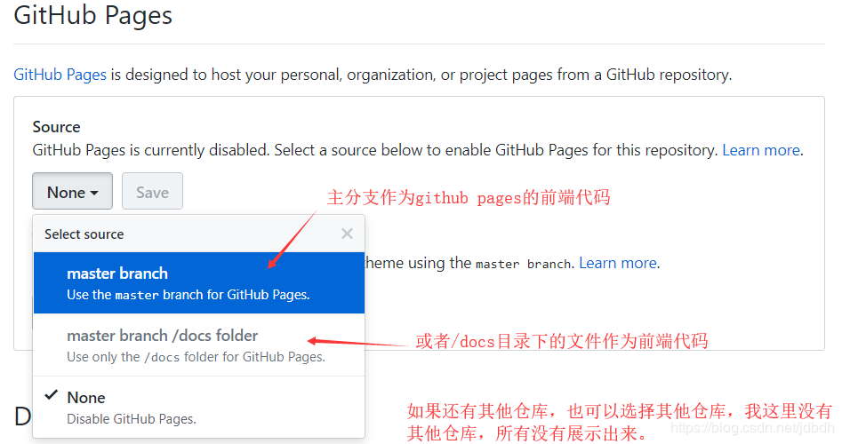

# 一 介绍
GitHub是一个用于版本控制和协作的代码托管平台。能够让你和其他人在任何地方共同工作在同一个项目上。

# 二 基础
github有很多关键的概念，比如仓库（repositories）、分支（branches）、提交（commits）和pull requests等等。仓库就是存放项目的地方，其他的操作都在仓库中进行；仓库中会存在个主分支，含有可部署的项目，如果想开发新功能，需要创建其他分支，在其他分支中添加、提交代码。如果测试通过了，可以发起pull请求，请求主分支融合其他分支。这样，新功能就被开发出来了。

仓库分公有仓库和私有仓库，私有仓库可以限制别人访问，但要收费。

下面是详细介绍。 

## Github工作流
假设已经创建了一个仓库（**repository**），存有一个叫做master的主分支（**master branch**）。首先，一条规则我们要准守：主分支的内容是可以部署的。即大致没有问题，可以直接使用。而当有了新想法，想像主分支添加新功能时，为了不违背准则，我们可以创建其他分支（**create a branch**）。这相当于创建了一个环境，你可以在里面修改实现你的任何想法，也不会对主分支造成影响。在其他分支中添加了新内容时，可以提交这些改变（**add cmmits**）。提交的时候可以添加描述信息，这相当于一个历史记录，当分支开发过程中发生错误时，可以回滚到某个历史时刻。在其他分支开发过程中，如果主分支发生了改变，其他分支还可以将改变引入到该分支中。其他分支开发结束后，可以发起**pull request**，请求合并到主分支。但是在合并之前，其他的开发人员都会看到你做出的改变，并开始与你讨论，然你再修改代码（**discuss and review your code**），又会出现提交（commits）的过程。一旦确定没有什么问题，就该最终部署项目进行最终测试（**Deploy**）了。如果确实是可部署的，那么此时可以合并（**Merge**）到主分支了。一旦合成，会将改变记录在历史中，别人可以看到该分支做出的改变。并且该分支可以被关闭了，因为此分支的开发已经结束了。

其工作流程可以用如下图示表示：


## Git
Git是一种分布式版本控制系统（DVCS），用来记录团队合作中记录项目的改变的历史，协同团队高效的开发项目。而github就是基于git的，很多概念都源自于git。但git是命令行执行的，而github虽源于git，但却易于git，抽象了开发过程，通过图形界面展示了项目开发的过程。甚至在学习github时都不会学习git命令行的使用，我认为这是github最大的优点之一。

很多人在开发过程中，会使用git命令从远端仓库中将项目克隆（**clone**）到本地中，开发好一些功能后再push到远端仓库中。

这虽然需要使用命令行执行git命令，但是github提供了桌面版的应用简化了git的使用。

在这里我就不多介绍了，作为入门，我暂且止步于此。

## 其他
这里简略介绍下github其他功能，在github网站会碰到这些概念：
* **fork**：如果想基于别人的项目开发属于自己的项目时，可以使用fork克隆整个**仓库**。与创建分支类似，但不同分支仍处于同一个仓库，没有重复的副本，只是通过一定手段表现得像是不同分支有差不多的同一副本；而fork是实实在在的克隆了整仓库。当然，当功能开发差不多时，也可以发起pull请求，两个仓库合并。
* **follow**：跟随别人，就是关注别人的意思，它的一些活动会通知你。你关注的人会显示在**following**一栏中，关注你的人会显示在**followers**一栏中。
* **watch**：关注仓库。一般作为仓库的开发者，会被仓库事件通知，其他人想同一时刻获知仓库发生的事情，可以通过watch按钮关注仓库。
* **star**：收藏仓库。主要为了便于再次寻找该仓库，可以在star网页上找到收藏的仓库。
* **Explore**：在这个页面中，可以寻找有趣的项目，github也会根据你的喜好（watch、star、follow等）推荐一些项目。
* 等等等等。。

# 三 Github Pages

这是Github提供的一个托管静态网站的配置. 

内嵌Jekyll作为网站的编译引擎. 即, Github仓库仅提供数据源, 然后通过Jekyll编译到Github真正托管网站的地方. 让用户感觉就像网站好像直接运行在仓库似的.

该服务有一定的[限制][1]，因此把Github Pages当做网盘来使用的想法就泡汤了.

Github Pages分为两种：
* **Project Pages sites**：与特定项目有关，存在于仓库中的某个分支上，每个仓库仅此一份。常用于解释该项目的，或者整个项目就是为了开发这个静态网站。
* **User and Organization Pages sites**：该网站和账户有关，每个账户仅此一个此类网站。个人账户可以用此作个人博客，组织可以用此作组织介绍等等。

[1]:https://help.github.com/articles/what-is-github-pages/#usage-limits

## 创建
创建一个github pages很简单，如教程：<https://pages.github.com/> 这里简易说一下。

github pages是以仓库为基础的，前端代码啥的都来自于仓库，修改网站也是在仓库中进行的。

**User and Organization Pages sites**：
1. 创建一个仓库，仓库名一定为`username.github.io`，用户名一定要写对！！否则不会被认作github pages。如下所示：
	
2. 仓库建立好了，然后在仓库中建立index.html网页。完成！！。。通过https://username.github.io就可以访问网站了。

-------------
**Project Pages sites**
1. 首先有个仓库，仓库名不能project pages sites的网址一致，以防被当做该种类型网站。
2. 打开仓库，找到setting->GitHub pages，此时处于未开启状态。
3. 然后选择一个仓库作为前端代码来源：
	
4. 在对应位置，创建一个index.html文件，打开https://username.github.io/repositoryName就能访问该网站。

--------------
你也许会发现，与其手动写前端代码，使用Jekyll theme+Markdown可以轻松制作网页。是的，，但是在github中没有找到好的教程，因此没有深入了解。

> 如果想展示markdown，可以在<https://dillinger.io/>网站中将markdown转化为html文件，通过简单的修改就可以放到仓库中啦~~

## 自定义域名

1. 让域名能够解析到Github Pages上: 创建`CNAME`记录, 让自己的域名解析到Github Pages上, 如`sidian.live`解析到`sidian123.github.io`

2. 让Github知晓映射关系: 在Github仓库的`Settings`中, 找到`Custom domain`, 添加自己的域名, 并保存

   > 这一步本质上是在你的仓库根目录下创建了`CNAME`文件, 记录自定义的域名

> 参考[Managing a custom domain for your GitHub Pages site](https://help.github.com/en/github/working-with-github-pages/managing-a-custom-domain-for-your-github-pages-site)

## Jekyll

不深入探究, 只说一点:

Jekyll只编译和拷贝部分网页, 非html, 以`_`为前缀的文件/目录, 将不被访问到, 需要在仓库根目录下添加配置`_config.yml`修改它

```property
include:
  - "_*"
  - "*.*"
```

> 上述允许任何文件和以`_`为前缀的文件夹被拷贝与编译, 即能够被访问到.

然后, 还不够!!! 否则会编译失败

还需要在根目录下添加空的` .nojekyll `文件, 来忽略Jekyll对特殊文件的处理

> 为何? 鬼晓得

> 参考
>
> * [Include files and also copy them to output](https://stackoverflow.com/questions/26128513/include-files-and-also-copy-them-to-output)
> * [Bypassing Jekyll on GitHub Pages](https://github.blog/2009-12-29-bypassing-jekyll-on-github-pages/)

# 开发

## Webhooks

* 当仓库中发送事件时, Github将发送Post请求, 携带payload 负载到配置的URL中. 

* 每种事件携带的负载格式都不同

* 请求头字段中包含额外信息, 如`X-GitHub-Event`, 表明事件类型

* 关于URL调用失败的问题

  查看Github日志, 大致报无法传输负载, 服务超时的问题.

  面对超时问题, 我在代码中对请求进行了异步处理, 减少了URL调用失败率, 但是仍还是出现调用失败的问题. 

  这不可避免... 因为Github服务器在国外, 延迟较高, 极有可能超时.

  解决方案? 忍一忍!

> 参考[Webhooks](https://developer.github.com/webhooks/)

## OAuth

* 用于三方登陆, 即通过Github账号登陆自己的应用

* 认证流程

  1. 用户被第三方客户端(也就是我们的应用)重定向至Github官网上, 请求用户授权。

  2. 用户被Github带上短暂有效的code重定向回第三方客户端（ 根据Authorization callback URL 指定的地址。

  3. 第三方客户端 可以带着通过code向Github换取的用户token访问Github API 得到用户的资源。

> 参考
>
> * [Java 实现 Github 第三方登陆](https://www.jianshu.com/p/5f1b268216d0)
> * [Authorizing OAuth Apps](https://developer.github.com/apps/building-oauth-apps/authorizing-oauth-apps/)
> * [Building OAuth Apps](https://developer.github.com/apps/building-oauth-apps/)

# 参考
[github guide](https://guides.github.com/)：最基本的指导
[github help](https://help.github.com/)：最详细的文档
[GitHub Learning Lab](https://lab.github.com/)：貌似用来训练你的技能
[github page](https://pages.github.com/)：关于静态网站的

-------
[Categories / GitHub Pages Basics](https://help.github.com/categories/github-pages-basics/)
[Categories / Customizing GitHub Pages](https://help.github.com/categories/customizing-github-pages/)