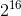
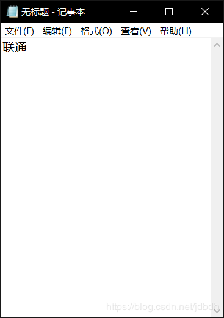
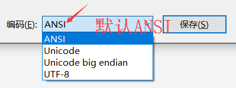
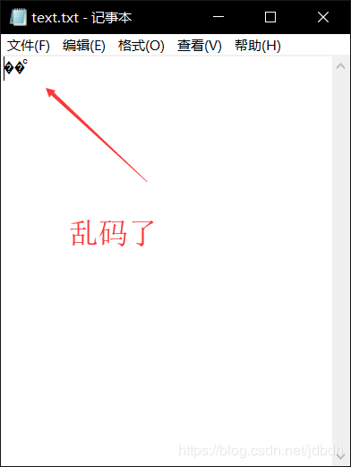
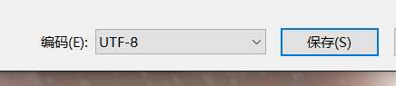
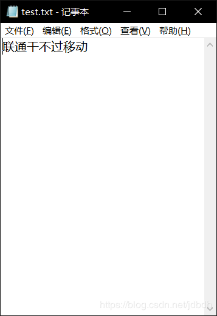
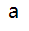
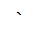
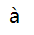

# 一 介绍

计算机中信息的传递、显示都需要字符的存在，字符需要被编码才能存入计算机。因此出现了**字符编码**，在unicode出现之前，都可以用**字符集**和**编码方式**来描述**字符编码**。所谓字符集就是字符的集合；编码方式就是如何将字符存入计算机的方式。但是unicode出现之后，字符集和编码方式不能很好的概括字符编码了，于是出现了更具抽象的术语来描述，如code point、code unit、character repertoire、coded character set、character encoding scheme等等等等。当然，这些概念也是能够描述所有的编码方式的。

下面会粗略（你没看错），，介绍，不过先了解下字符的大致发展。

# 二 简略历程

最先出现的[ASCII](https://en.wikipedia.org/wiki/ASCII)码，一共128个字符，只用到了7bit来存储一个字符。但是适合英文字符的国家使用（美国、英国等），其他国家必须扩展ascii码。一般计算机都是以8bit作为一个字节，因此可以将最高位利用起来，那么还能加入128个字符。于是出现了ASCII的各种扩展集，如iso-8859-1（Latin 1）、[Windows-1252](https://en.wikipedia.org/wiki/Windows-1252) （经常被误作iso-8859-1）等等。

然而在我们东方国家，一个字节不足以编码所有的字符，更何况仅剩的一位bit最多只能编码128个字符。因此国人就想出了多位字节编码一个字符的办法。于是出现了很多中国标码，国内常使用的是[GB18030](https://en.wikipedia.org/wiki/GB_18030)吧？它兼容遗留的编码：GB2312、CP936和GBK1.0。GB18030定义了一个字节（ASCII）、两个字节（扩展GBK）、四个字节（UTF）的编码方式，也就是说一个字符可能是由一个、两个、或四个字节编码的。因此GB18030兼容ASCII码，而且比较容易映射到Unicode上。具体编码方式可参考：[Mapping](https://en.wikipedia.org/wiki/GB_18030#Mapping)。

上面的编码都是从ASCII扩展而来的，都兼容ASCII码，于是这些编码都被编入了ANSI标准中。然后windows将这些编码收录到了[code page](https://en.wikipedia.org/wiki/Windows_code_page)（这是编码集吧？。。）中，不同国家通过指定不同[代码页](https://blog.csdn.net/jianggujin/article/details/80325461)来使用不同的字符编码，比如指定代码页54936使用GB18030字符编码、指定代码页936使用GB2312编码等等。不过这些复杂的内容了解一些就行了，毕竟现在windows都不用code page了，已经开始使用utf-16了，具体参考：[History](https://en.wikipedia.org/wiki/Windows_code_page#History) 。

大家都听过ANSI吧？还经常混淆概念！！准确的说ANSI字符集是一个没有模糊的、没有准确定义的概念。有时候指的是code pages，有时候指的是windows-1252、ASCII、iso-8859，总之乱七八糟的！！具体参考：[ANSI character set](https://en.wikipedia.org/wiki/ANSI_character_set)。因此看到有人说什么ANSI编码时，别理他！！或者根据语义猜测他的意思。

随着网络发达和万维网的普及，这么多字符编码，每个国家使用的都不相同，那么在信息交流上会出现极大的不方便。于是出现了[Unicode](https://en.wikipedia.org/wiki/Unicode)（粗略来说，目前指的是字符集，对应多种编码方式）啦，这里只粗略介绍下历史过程，Unicode抽象的一些概念下一节提及。说到Unicode，那么也必须提及[UCS](https://en.wikipedia.org/wiki/Universal_Coded_Character_Set)（Universal Coded Character Set）。

在致力将全球编码融入一个编码系统时，两个组织做着相同的工作：IEEE和Unicode Consortium。于是他们沟通，同步了他们对字符的赋值，以至于两者的字符集可以兼容。两个组织最初的想法是通过一个字符两个字节（最多65536个）来取代一个字符一个字节（最多256个）的编码方式。因此最初这种两个字节的编码方式被称为Unicode（**这时**，Unicode指的是字符集加编码方式）。当初这种叫法到现在已经不合适了，因为随着字符集的增加，已经超过了个了，IEEE介绍了另一种编码方案UCS-4，一个字符用4个字节来表示。因此之前字符编码被称作UCS-2。而Unicode Consortium则是修改它，使用code unit的概念，也就是一个字符可以使用一个或两个16bit的code unit来表示，即2个或4个字节来表示字符，于是能够编码所有的Unicode字符集。现在被叫作UTF-16，与之前的UCS-2区分开来，目前UCS-2的字符集只是Unicode字符集的一个面（plane），貌似unicode共17个面吧。

但是呢~在西方国家中，它们本来是单字节编码的国家，现在使用utf-16导致使用多一倍的存储空间来存储字符，导致它们接收不了。于是出现了UTF-8来编码Unicode字符集，兼容ascii。

至于UTF-32，貌似没啥大事件，它的历史就不去了解了。

这里就已经大致介绍了字符编码史，，我也不知道说的与实际是否有不一致的地方，所以仅供参考。。。

# 三 Unicode

很多字符编码都是从ASCII发展过来的，都兼容ASCII，因此对这些编码的概念描述都很简单。即都是由字符集和编码方式，而且字符集的编码方式很简单。但是Unicode发展到现在就真的复杂了，已经不能简单的用字符集和编码方式来描述它了（尽管上一小结就是这样来理解它的，但也只是为了简化描述而已）。

## 一些概念

以下概念来自于：[Character encoding](https://en.wikipedia.org/wiki/Character_encoding)，但为我的理解，不晓滴对不对。

- a character：语义文本中最小的单元，这里指的是字符，如“a”，“1”，“中”。
- a character set：字符的集合。集合有大有小，不如ASCII的字符集只有128个，unicode很多个，目前[最新版本](https://en.wikipedia.org/wiki/Universal_Coded_Character_Set)超过136000个。
- a coded character set：一个字符集，但是里面的每个字符都分配了一个唯一的数字与之对应。
- a code point：就是a coded character set中的一个值，它对应一个字符，比如一个code point为U+0041，对应字符“A”。
- a code unit：就是一个bit序列，用来编码字符的。可以理解为编码code point的最小单元，就是说一个code point可能由多个code unit来编码。对于Unicode中不同的编码方式，code unit的位数不同，比如utf-8中8位code unit，utf-16中16位，utf-32中32位。

Unicode中使用U+****（十六进制）的方式来表示code point，而且code point的范围在U+0000到U+10FFFF之间，一个17个面。第0个面范围在U+0000到U+FFFF之间，称为*Basic Multilingual Plane* (BMP)，其他16个plane（U+010000到U+10FFFF）被称为supplementary plane。

下面给出了一张表格，体现了字符、code point、code unit之间的关系，当然code unit还不是计算机中具体的存储形式，因为还要考虑到大小端和其他的问题。

| character           | a        | b        | c        | U+10400   |
| ------------------- | -------- | -------- | -------- | --------- |
| code point          | U+0061   | U+0062   | U+0063   | U+10400   |
| code unit in UTF-32 | 00000061 | 00000062 | 00000063 | 00010400  |
| code unit in UTF-16 | 0061     | 0062     | 0063     | d800,dc00 |
| code unit in UTF-8  | 61       | 62       | 63       | 90,90,80  |

## Unicode 编码模型

unicode编码模型认为一个字符编码由下面这个部分组成：

1. character repertoire：一个系统所支持的全部的**抽象**的**字符集**。
2. code character set（CCS）：一个映射character到code point的**函数**。
3. character encoding form（CEF）：一个code point到code unit的**映射**。也就是将数字（code point）转化为固定长度的bit序列，比如8位、16位、32位的unit，正如上述表格展示的一样。
4. character encoding scheme（CES）：一个映射，将code unit映射到基于8位bit存储的文件系统中或基于8位bit储存的网络中。要考虑大小端、对于每个unit如何压缩所需字节数量的问题。

上面的第一个部分就是character repertoire（抽象的字符集），#1和#2构成coded character set。在Unicode出现之前，一些简单的单字节编码可以看做是将上面#3和#4部分去掉了、简化了，即code point=code unit=byte。比如ASCI码中的“a”，code point为U+61，8位的code unit 也为61，而byte为‭00111101‬（单字节不用考虑大小端问题）。

## 编码方式

对于Unicode来说，有很多中编码方式：UTF-8，UTF-16BE，UTF-16LE，UTF-16，UTF-32，UTF-32LE，UTF-32BE等。Unicode应该指的是coded character set（编码字符集），为这些编码所共同的部分，即有共同的编码字符集。而这些字符集的区别在于#3和#4部分的不同。注意，这里的UTF-**，后面的数字指的是code unit的位数。

UTF-8的中的字符需要1，2，3或4个字节（1到4个code unit）来编码一个字符，适合作为网络上、磁盘中信息的编码方式。code point在U+0000到U+007F之间编码方式与ASCII相同，因此兼容ASCII。

UTF-16中的字符需要2或4个字节（1或2个code unit）来编码一个字符。看到了吧，utf-16不是必定为2字节哦，因为unicode的字符个数超过了65536个。如果超过65536，需要2个code unit，被称为*surrogate pair*。在上述步骤#4中，将code unit转化为byte，需要考虑大小端的问题。注意，utf-16的code unit为16位。如一个code unit为 55 66，那么该和编码呢？比如大端编码：55 66，小端编码：66 55。都是可行的！因此出现了不同储存形式，为了区分他们，有人想出了一个办法，就是添加**BOM**，一个字节的大小的标记，位于文件最前端。当解析该文件时，通过读取该Bom，就能知道该如何解析文件。但是如果没有Bom呢？毕竟不是硬性要求。 [RFC 2781](https://tools.ietf.org/html/rfc2781)中有规定，默认使用大端存放，但是windows反其道而行，，，使用了小端存放，，，那么使用默认存放方式就不靠谱了。但是所幸的是，可以通过检查null byte来**探测**出。作为比较，举个例子，如果我连文件的编码方式都不知道呢？会怎么样？现在探测不出来了，只能**靠经验猜**，是的，有很多算法可以经过统计文件数据来猜测编码方式。还有一种方法就是通过指定编码方式来显式给出：UTF-16BE或UTF-16LE。现在可以知道UTF-16、UTF-16BE和UTF-16LE之间的区别了吧，这对于UTF-32也是一样。

UTF-32采用固定4字节编码字符，不像UTF-8和UTF-16那样的可变长度的编码方式。也存在大小端问题，请参考UTF-32。

注意哦，UTF-16和UTF-32不兼容ASCII，因为它们表示字母的位数比较多，尽管code point数值和ASCII的数值相同。

# 四 其他

这里讲讲其他相关的内容。

## 全角和半角

含有同样语义的字母在不同国家有不同体现或者叫形状，那么它们的code point到底相同还是不相同呢？这里我给不出答案，当我知道在咋们国家，对于标点符号来说，它们的code point就是不同的。这就涉及到了全角和半角的概念了。全角的标点符号占两个字节，而半角一个字节，也就是西方国家使用的标点符号。这也就造成我写代码时天天要切换中英文输入法了。。烦不胜烦！

## [使用](https://en.wikipedia.org/wiki/UTF-16#Usage)

说那么多编码的事没啥子用，要了解它用在哪里才是最重要的。utf-8不用说，由于它的可变长度，且常用字符字节数都比较少，还能表示所有的Unicode的字符集，因此常用于网络上传输信息。在个人文件中储存信息的编码也大多是utf-8。而utf-32固定长度为4个字节，由于浪费空间太大，不是很常用。

这里着重要讲的是UTF-16，因为code point在U+0000到U+FFFF之间的字符都用2个字节编码，而U+010000到U+10FFFF之间的字符很少用，因此便于计算机管理。而且UTF-16使用的是Unicode字符集，便于国际化，因此UTF-16用途很广泛，**很适合在内存中编码**。因此如今的**windows系统**都使用了UTF-16编码方式（之前使用code page、USC-2啥滴）。但是**unix/linux 或macOS**使用的是UTF-8.

java中原先使用的是UCS-2，之后使用了UTF-16（估计就如之前所说，Unicode字符集日益完善，超过了65536，UCS-2表示不了了，所以更换了）。因此呀~  java中的char不一定是表示一个字符了，而是可能两个char表示一个字符哦~~。有可能，一些string的实现中，code unit才是返回字符串长度、索引元素的依据，而不是code point了！具体java如何实现我不知道。

javascript使用USC-2或utf-16.

html中的实体（Entity）使用的是utf-16。

其他的参考标题链接。

## 编码猜测

如果不给出编码或不知道编码，一般系统会**猜测**编码，通过一定的算法来猜测。因此，有时候没有猜对就会乱码。写程序时就不用猜测了，因为程序员自己知道编码，可以采用正确的编码来解码文件。但是你作为一个程序员，连自己文件的编码都不知道，，，那活该乱码。。

比如网页，浏览器获得网页编码的方式有两种，一种是从响应头部中context-type字段来获得文件编码；一种是从html文件中的<meta/>标签中获得文件编码。有人会问，都不知道文件编码，你怎么解析文件获得meta元数据的？这是因为很多编码都兼容ASCII码，而且meta元素尽量写在前面没有就没有其他编码的干扰，能够顺利提取出meta中的编码信息。因为两个信息都是可选提供的，如果都没有那么浏览器只能根据一定算法猜测了，猜错了就乱码。

又比如windows系统，尽管它现在系统内存中使用utf-16存储字符，但是使用notepad编辑文本时还是默认ANSI。我在第二节中提到过ANSI，这里指的code page，不同区域window默认的代码页不同，因此使用的字符编码不同。这里，我国使用的是GB系统，可能是GB2312吧，不晓滴。默认保存后，当打开这个文件时，**notepad这个软件**就会猜测了，因为它不知道编码格式。猜错了就乱码。下面演示一遍猜错的例子：

打开notepad，输入“联通”：

然后保存，它默认使用ANSI编码（看到ANSI我就呵呵）：

这里先暂停，我先喷一喷windows。看到了吧，这里就是造成我们最大误解的地方，编码windows自己都没有分歧，就瞎搞。所以一般写代码的人都不用notepad，而是用notepad++或sublime之类的专业一点的编辑器。

然后打开文本，发现乱码了。

这是因为信息太少，被notepad误认为是utf-8了，这是怎么看出的呢？你现在点击另存为，就可以看出，它把文件的编码误认为utf-8了。

现在我们删掉之前的文本，重新写一个，这时在“联通”后面多补几个字，这样notepad就有了更多的信息来猜测文件编码了，正确率大大提高：

看，猜测正确了，这也是一个为什么“联通干不过移动”笑话的来源。【手动微笑】。

## 此字符非彼字符

虽然说unicode字符集中收集的都是字符，但是有些字符在用户看来是不完整的。比如说下面两个字符（U+0061和U+0300）：

和

此时用户认识a，但是不认识第二个，第二个其实是第四声音标（accent）。。。但是用户不认为音标也属于字符咋办？如果这样呢？

编码为（U+0061U+0300），这是用户就认识了，这是个带音标的a。

所以说，在用户的角度来看，一个字符有时是由多个code point组成的。

# 参考

主要参考的一篇文章，尽管是03年写的，说明别人是真的牛。。：https://www.joelonsoftware.com/2003/10/08/the-absolute-minimum-every-software-developer-absolutely-positively-must-know-about-unicode-and-character-sets-no-excuses/

主要参考：https://en.wikipedia.org/wiki/Character_encoding

[What's the difference between encoding and charset?](https://stackoverflow.com/questions/2281646/whats-the-difference-between-encoding-and-charset)

[What is the character encoding of String in Java?](https://stackoverflow.com/questions/4453269/what-is-the-character-encoding-of-string-in-java)

UTF-16：https://en.wikipedia.org/wiki/UTF-16

UTF-8：https://en.wikipedia.org/wiki/UTF-8#Comparison_with_single-byte_encodings

Comparison of Unicode encodings：https://en.wikipedia.org/wiki/Comparison_of_Unicode_encodings

UCS：https://en.wikipedia.org/wiki/Universal_Coded_Character_Set

Unicode：https://en.wikipedia.org/wiki/Unicode

GB18030：https://en.wikipedia.org/wiki/GB_18030

Windows code page：https://en.wikipedia.org/wiki/Windows_code_page

ANSI character set：https://en.wikipedia.org/wiki/ANSI_character_set

ASCII：https://en.wikipedia.org/wiki/ASCII

联通的例子来自于此，但是文章的源头找不到了：https://blog.csdn.net/jdbdh/article/details/81143599

浏览器context-type的例子：https://stackoverflow.com/questions/43148464/how-do-browsers-determine-the-encoding-used

JavaScript’s internal character encoding: UCS-2 or UTF-16?：https://mathiasbynens.be/notes/javascript-encoding

html entities：https://www.w3schools.com/html/html_entities.asp

utf-8转换工具：http://www.ltg.ed.ac.uk/~richard/utf-8.cgi