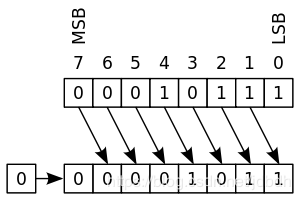
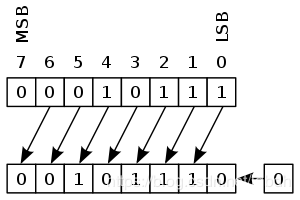
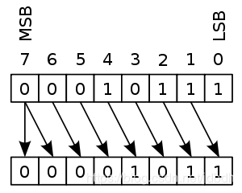
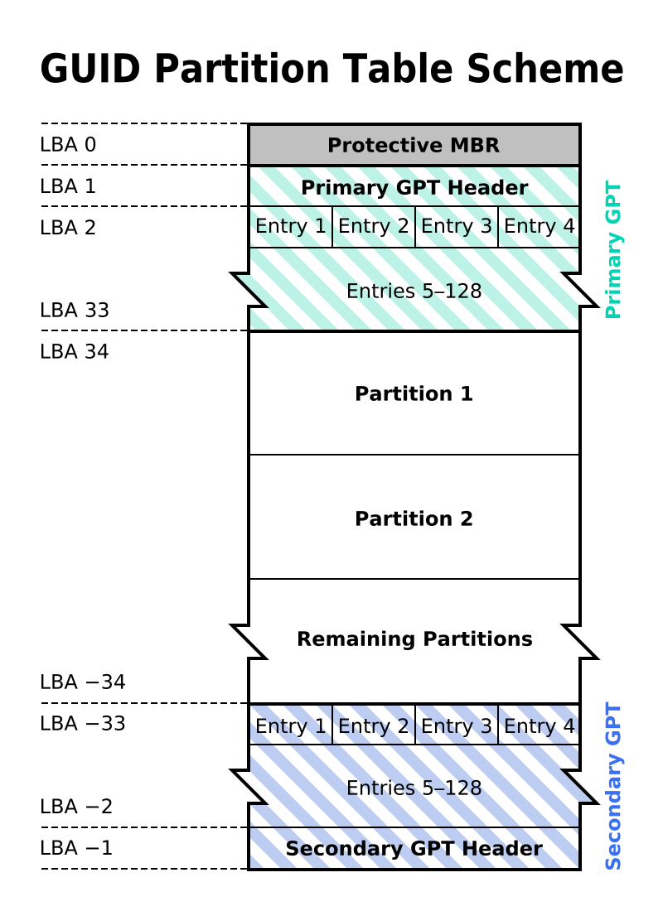

# 一 开发
## 1.1 字符串连接（java）
运行时字符串之间的连接操作（+）等同于：
```java
new StringBuilder().append("firstString").append("secondString").toString()//也可能使用StringBuffer
```
## 1.2 servlet container与server
如今很多servlet容器经常会内置web服务器（web server），因此很少有人区分java servelt容器和java web服务器了。

## 1.3 控制反转和依赖注入
DI is a subset of IoC
* **IoC** means that objects do not create other objects on which they rely to do their work. Instead, they get the objects that they need from an outside service (for example, xml file or single app service). 2 implementations of IoC, I use, are DI and ServiceLocator.
* **DI** - Dependency Injection is concrete term, in which we provide dependencies of the object at run time by using different injection techniques viz. Setter Injection, Constructor Injection or by Interface Injection.

>已发表博文：[控制反转 vs 依赖注入](https://blog.csdn.net/jdbdh/article/details/82800306)

## 1.4 类加载器和classpath
每个类加载器都可以定义一个属于自己的classpath路径

## 1.5 装箱和拆箱
基本类型自动包装时调用了包装类的valueOf方法，自动拆箱时调用了包装类的intValue方法。

## 1.6 子类方法的异常抛出
子类覆盖父类的方法可以不用抛出异常，即使父类方法有异常抛出列表；但父类引用子类对象且父类方法有异常抛出时，需要try来处理异常。

>参考:https://stackoverflow.com/questions/9036016/inheritance-method-signature-method-overriding-and-throws-clause

## 1.7 tomcat的默认web应用
tomcat中webapps下的ROOT目录代表的应用为默认应用。估计host下的该目录都为默认应用。

## 1.8 override覆盖、overload重载、hide隐藏和修饰符
* **override(覆盖)**：子类方法覆盖父类方法，子类或父类引用都是调用子类方法。
* **overload(重载)**：类的所有方法（包括继承的方法），只要方法原型参数不同，就是重载。不同参数调用不同方法。
* **hide(隐藏)**：子类继承但没有覆盖方法，只是子类作用域中隐藏了该方法，称为隐藏。如父类字段、静态方法被子类隐藏了，通过父类引用跳出子类作用域，然后调用这些方法、字段。
* **修饰符**：子类方法覆盖后访问修饰符可以修改成访问范围更广的，比如protect换成public。如果父类方法是private，那么子类同名方法不叫覆盖，而是隐藏。

## 1.9 maven配置阿里仓库
下载速度会加快。在配置文件的mirrors元素中添加mirror元素：
```xml
<mirror>
 
    <id>nexus-aliyun</id>
 
    <mirrorOf>*</mirrorOf>
 
    <name>Nexus aliyun</name>
 
    <url>http://maven.aliyun.com/nexus/content/groups/public</url>
 
</mirror>
```
## 1.10 eclipse开发问题的一些解决方案
要是maven下载的包毁坏，则在maven的repository中删除它，然后在项目中使用maven->update project...

如果编写程序过程中，eclipse出现了[莫名其妙][2]的问题，可以点击project->clean...清除项目尝试一下。如果导入项目后出现了莫名其妙的问题，很有可能是因为项目与电脑环境冲突，比如jdk版本太高，很多jar包不支持，又如数据库的[驱动包][3]不支持现有数据库的包。

如果eclipse中tomcat出了问题，可以将里面的应用删除，clean整个server的，clear jsp生成的servlet。

[2]:https://www.baidu.com/s?wd=%E8%8E%AB%E5%90%8D%E5%85%B6%E5%A6%99&amp;tn=24004469_oem_dg&amp;rsv_dl=gh_pl_sl_csd
[3]:https://www.baidu.com/s?wd=%E9%A9%B1%E5%8A%A8%E5%8C%85&tn=24004469_oem_dg&rsv_dl=gh_pl_sl_csd

## 1.11 JDK相关的环境变量
安装JDK后，最多需要设置三个环境变量：PATH，JAVA_HOME和CLASSPATH。
* **PATH**：主要为了让可执行文件java.exe（windows下）或java（linux下）能够在命令行下执行
* **JAVA_HOME**：约定俗称的一个环境变量，指向jdk安装目录。可选的，但此变量存在的理由有二。
	* 其一，有些java程序（如tomcat）在运行时可以通过该变量获得运行时资源，比如tomcat。
	* 其二（不确定对不对），当存在多个版本的jdk时，无论运行哪个jdk版本的jvm（即设置path），最终使用的运行环境还是JAVA_HOME指向的jdk。
* **CLASSPATH**：用于告诉应用类或资源的路径。可选的，默认当前工作目录。如果设置，最好也将“.”加入到变量中。在命令行，通过选项-cp能够覆盖该设置。

>参考：
>[what is the reason for the existence of the JAVA_HOME environment variable?](https://stackoverflow.com/questions/5102022/what-is-the-reason-for-the-existence-of-the-java-home-environment-variable)
>https://docs.oracle.com/javase/tutorial/essential/environment/paths.html
>https://blog.csdn.net/u011416247/article/details/79249470?utm_source=blogxgwz5

## 1.12 eclipse寻找jvm
1. eclipse先从`eclipse/jre`目录下寻找jvm
2. 如果没有，则咨询`eclipse.ini`文件
3. 最后在`PATH`路径下查找

## 1.13 Spring多容器应用
一个容器可以有父容器，比如springMVC中就有两个容器，一个web应用对应一个`ApplicationContext`容器，为父容器，每个`DispatcherServlet`对应一个`WebApplicationContext`容器，为子容器。父容器中定义的`Bean`都可以被子容器访问到，也可被子容器覆盖。在`ApplicationContext`中可以定义和业务逻辑、数据访问有关的`Bean`，而`WebApplicationContext` 中可以定义和控制器与视图解析器有关的`Bean`。

>参考：
>https://stackoverflow.com/questions/43452644/what-is-the-difference-between-spring-parent-context-and-child-context
>https://stackoverflow.com/questions/18578143/about-multiple-containers-in-spring-framework

s## 1.14 Logical Vs. Arithmetic Shift
逻辑移位和算术移位都是按位运算，但是逻辑移位用于无符号移位，算术移位用于有符号移位。
* 逻辑左移

	在大多语言中对应  `<<`
* 逻辑右移

	在大多语言中对应 `>>`
* 算术左移

	在大多语言中对应 `<<` 与逻辑左移一致
* 算术右移

	在大多语言中对应 `>>>`

>参考：
>https://open4tech.com/logical-vs-arithmetic-shift/
>https://en.wikipedia.org/wiki/Arithmetic_shift
>https://en.wikipedia.org/wiki/Logical_shift

## 1.15 jackson
教程：
[github 版](https://github.com/FasterXML/jackson-databind/)
[tutorialspoint 版](https://www.tutorialspoint.com/jackson/jackson_data_binding.htm)

>已发表博客：[Jackson入门](https://blog.csdn.net/jdbdh/article/details/87905227)

## 1.16 HashMap vs. HashTable
区别：
* `HashMap` is non synchronized. It is not-thread safe and can’t be shared between many threads without proper synchronization code whereas `HashTable` is synchronized. It is thread-safe and can be shared with many threads.
* `HashMap` allows one null key and multiple null values whereas `HashTable` doesn’t allow any null key or value.
* `HashMap` is generally preferred over `HashTable` if thread synchronization is not needed

为何HashMap允许键值为null？
>To successfully store and retrieve objects from a HashTable, the objects used as keys must implement the hashCode method and the equals method. Since null is not an object, it can’t implement these methods. HashMap is an advanced version and improvement on the Hashtable. HashMap was created later.

## 1.17 string、stringBuffer、StringBuild
* String is immutable whereas StringBuffer and StringBuider are mutable classes.
* StringBuffer is thread safe and synchronized whereas StringBuilder is not, thats why StringBuilder is more faster than StringBuffer.
* String concat + operator internally uses StringBuffer or StringBuilder class.
* For String manipulations in non-multi threaded environment, we should use StringBuilder else use StringBuffer class.

>参考：[string-vs-stringbuffer-vs-stringbuilder](https://www.journaldev.com/538/string-vs-stringbuffer-vs-stringbuilder)

## 1.18 Session技术
Session是一种会话的抽象概念, 在很多协议中都存在, 如PPPoE. 这里讨论的是HTTP的会话.

HTTP是无状态的，为了能够在HTTP协议之上保持住状态，比如用户是否登陆、购物车等等就需要一种方法来把用户的一个个无状态HTTP请求关联起来。 

这种技术就叫Session。

 Session的功能是把一个个分离的HTTP请求关联起来，只要能实现这个功能，基本上都能叫Session的一种实现。 

- 在Cookie里放个JSESSIONID，在服务器中存上状态，用户请求来了，根据JSESSIONID去服务器里查状态，这是Tomcat的实现方法。 
- 把所有状态都存在Cookie里，服务器给个签名防止伪造，每次请求来了，直接从Cookie里提取状态，这是JWT的实现方法。 
- 在Cookie里放个token，状态不存在中间件里，而是存在Redis里，这也是一种Session实现方法。 

 正确的说法是，把Session存储在Web中间件中（比如存储在Tomcat中），这种做法正在被淘汰，因为这种方案对负载均衡不友好，也不利于快速伸缩。

 把Session存在Redis和前端的方案正在慢慢崛起，尤其是现在微服务架构大行其道的情况下。 

只要HTTP还是无状态的，只要保存状态还是刚需，Session就不会消失，变化的只是它的实现方式。 

举个例子，只要人们还要出行，交通工具就不可能消失，只是实现的方法从走路变成了马车，在变成火车、汽车、飞机，未来可能还有火箭啥的。

>转载至:[session正在被淘汰吗？ - 李明阳的回答 - 知乎](https://www.zhihu.com/question/315397046/answer/695069994)

# 二 数据库
## 2.1 隔离级别
* **read_uncommited**：加写锁，直到事务结束释放，解决丢失修改问题。
* **read_commited**:在上一级别基础上加读锁（可能为乐观锁），读完立即释放，解决脏读。
* **repeatable_read**：在read_uncommited基础上加读锁（可能为乐观锁），直到事务结束释放，解决不可重复读问题。
* **serializable**：在上一级别基础上加间隙锁等等等等，因此解决了幻读。
* 
mysql的默认隔离级别：repeatable_read。

>详细参考：[JDBC 8.1小节](https://blog.csdn.net/jdbdh/article/details/86307289#81__114)

## 2.2 事务提交
在原始jdbc中，Connection默认自动提交，也就是没执行一句sql语句就当做一个事务提交。在mybatis中，默认不自动提交，在进行插入、修改等操作后需要手动提交。[并不是事务中提交后才执行sql语句][1]，而是每条都执行，只是callback利用日记可以回滚到初始状态罢了。

----
2019/2/13更新
一般Connection默认自动提交，但是涉及事务处理的Connection会被配置成非自动提交。

[1]:https://stackoverflow.com/questions/26581850/mybatis-committing-a-statement-even-when-autocommit-is-false

## 2.3 （内、外）连接
* **内连接**（inner join或join）：两表只有成功匹配的记录会被显示出来
* **左外连接**（left join或left outer join）：查询结果集包含左表所有行，和右表匹配的记录，如果无匹配则全null。
* **右外连接**：与左外连接类似。
* **全连接**：不支持，但是可以通过左外连接和右外连接的并集获得。

除了使用连接，还可以在使用如下方式进行多表连接：
```sql
select A.*,B.*
from A,B
where A.id=B.aId
```
# 三 系统
## 3.1 cpu架构
cpu有很多架构，这三种很常见：**ARM** 、**x86**(IA-32、i386)、 **x86_64**(x64、AMD64、intel64)

架构是一个很抽象的概念，不同cpu产商可以生产同一架构的cpu。操作系统通常有对应不同cpu架构的版本。

x86包括i386、i686等处理器，支持32位地址空间。x64支持64位地址空间。

arm采用精简集指令，x86_64和x86采用复杂集指令。

树莓派是arm架构的。arm架构有很多版本，ARMv3道ARMv7支持32位地址空间，ARMv8-A架构支持64位。

>参考：
>https://en.wikipedia.org/wiki/ARM_architecture https://en.wikipedia.org/wiki/X86 https://en.wikipedia.org/wiki/X86_64
>https://serverfault.com/questions/610308/x86-i386-i686-amd64-i5-i7-archtecture-processor-confusion
>https://stackoverflow.com/questions/14794460/how-does-the-arm-architecture-differ-from-x86
>https://askubuntu.com/questions/54296/difference-between-the-i386-download-and-the-amd64

## 3.2 开机引导过程
上电，主板自动读取主板上固件（rom）中的**BIOS**或**UEFI**（一段小程序），该程序执行开机自检，可以访问硬盘和主存。
>UEFI更智能, 相当于一个小操作系统

自检后查找磁盘的**第一个扇区**是否存在**引导程序**并加载。BIOS中一个磁盘最多存在一个**启动项**; 而在UEFI中, 会去磁盘中寻找**ESP**分区, 里面可能存在多个`.efi`格式的引导程序, 因此此时一个磁盘可以存在多个**启动项**.
>磁盘有MBR和GPT两种分区方式, BIOS或UEFI需支持(理解)该分区格式才能读取引导程序. BIOS能理解MBR分区格式, UEFI能理解GPT分区格式和MBR(为了兼容BOIS).

一个扇区通常不能装下整个引导程序，仅引导程序的坐标, 指出真正引导程序的位置并加载。注意，加载真正的引导程序后，此时引导程序可以做很多事情了。可以直接加载系统内核，也可以加载其他分区的引导程序来启动其他系统，因此引导程序可能会给出多个**引导项**供你选择。
>如果装了双系统(win+linux)的话, 你通常会看到引导程序grub2提供的多个引导项, 可以选择启动linux, 也可以启动windows.

引导程序加载了内核后, 交由内核运行用户空间的软件（分为系统软件和用户软件），比如加载到多用户图形化的环境供用户使用 (系统软件) , 然后用户运行自己的程序 (用户软件) .

>参考：https://en.wikipedia.org/wiki/Booting

## 3.3 intel cpu
intel的酷睿i3、i5、i7的差异主要体现在核心数、是否有Turbo Boost技术、缓存大小、超线程上。一般i7比i5好，i5比i3好。但是不是必定成立，因为每个系列都有不同年代的产品，比如i5 4200H 不一定比i3 8100好。最主要的还是要看上面的参数，当然主频也是非常非常重要的参数。

>参考：https://www.pcworld.idg.com.au/article/386100/what_difference_between_an_intel_core_i3_i5_i7_/

## 3.4 Desktop Environment

>参考：https://en.wikipedia.org/wiki/Desktop_environment

## 3.5 linux中文件后缀名
linux中文件后缀名不是必要的，仅仅只是用来描述文件如何被“执行”。下面是一些linux后缀名和它的意义：
| Linux extension              | Windows Equivalent | Short description                                            |
| :--------------------------- | :----------------- | :----------------------------------------------------------- |
| .so, .o                      | .dll               | Object that can be loaded at runtime (Similar to DLL)        |
| .a                           | .lib               | Static library                                               |
| [none], .elf(rare).bin(rare) | .exe, .com(rare)   | Linux executables                                            |
| .sh                          | .bat               | Shell script                                                 |
| .exe                         | .exe               | Mono application, Wine application                           |
| .deb                         | .msi               | Installer package for Debian/Ubuntu releases (Though .deb is much more powerful with native support for dependencies and repos). Note that .deb is actually a .ar archive with a special control file, a special file order, and a different extension. |
| .rpm                         | .msi               | Installer package for RedHat/CentOS releases.                |
| .tar.gz, .tar, .gz           | .zip               | Compressed files that can contain a program or any other data, like images, documents, etc |
| .ko                          | .sys               | Drivers and kernel modules are loaded into the Linux kernel and have more hardware access than other programs. |
| .sh, .php, .py, etc          | .bat               | Linux is capable of running any file that it has an interpreter for. A line at the top of the file called the shebang specifies what interpreter to run the file with. Windows only really runs .bat files in this way. |

>参考：https://www.quora.com/What-is-the-extension-of-a-executable-file-in-Ubuntu

## 3.6 vps和vm的区别
VPS（Virtual Private Server，虚拟专用服务器），是通过硬件虚拟化技术，在物理服务器之上模拟出来的虚拟服务器。类似于通过VMware或VirtualBox在电脑上运行一个独立的操作系统。每个VPS有独立的内存、硬盘和操作系统。您可以像使用独立服务器一样使用VPS，依据自己的需要配置软件环境。

虚拟主机实质上则是一种软件服务，只能支持特定种类的程序如PHP编写的程序。

要运行一些虚拟主机不支持的程序，如Java程序、可执行程序、NodeJS脚本等，您需要考虑VPS。如果网站访问量非常多，虚拟主机提供的资源不足，您需要考虑VPS。选择合理的VPS套餐非常重要，VPS并不总是比虚拟主机更好。由于VPS需要运行独立的操作系统，两者的资源消耗因素并不完全相同，网站在低配置VPS上的表现可能逊于在虚拟主机上的表现。

虚拟主机使用的一般是共享ip，而vpn有独立ip。

>参考：
>https://www.sugarhosts.com/zh-cn/vps/ssd-vps-hosting
>https://host.zzidc.com/xnkj/1570.html

## 3.7 门外汉之PowerShell
win10中有两种shell：powershell和cmd，对于我这种门外汉来说，都很是陌生。但总之，cmd功能有限，我也只会部分命令；**而powershell竟然有很多命令与linux bash命令相似**，对于我这linux初学者来说，用着也很是爽。。这里暂时记记常用的，会在使用中逐步更新：
* `ls`：显示目录或文件
* `pwd`：显示当前目录
* `explorer .`：于当前目录打开文件浏览器
* `cd`：改变工作目录
* `cd ~`：回到用户目录
* `man`、`help`命令或`-h`、`--help`、`/?`选项：查看命令帮助文件。（其实没啥子用）
* cat：输出文件内容
* `notepad filename`:用记事本打开文本
* 支持重定向，可用于ssh中传输文件，暂不熟
* `clear`：清空屏幕
* `echo $Env:PATH`：打印PATH变量内容。（与cmd不同，cmd中通过`%PATH%`可以获取值）
* `ls env`：打印全部环境变量
* ...

上面的命令基本够本小白使用了，毕竟有GUI的存在，不用会太多命令。
>其余命令可参考：
>[Table of Basic PowerShell Commands](https://blogs.technet.microsoft.com/heyscriptingguy/2015/06/11/table-of-basic-powershell-commands/)

## 3.8 Linux 线程、进程、进程组和会话
一个会话可以含有多个进程组，一个进程组可以含有多个进程，一个进程可以含有多个线程。每种对象都有自己的ID，如线程号，进程号，进程组号和会话号。

一个进程一般只含有一个线程，且进程号和线程号一致。

每个进程都属于一个唯一的进程组。当进程被创建时，它会称为父进程的进程组的成员。进程组的ID等于进程组的第一个成员，该进程也叫**进程组leader**。

进程组分为：前台进程组、后台进程组和孤儿进程组（Orphaned process groups）。。一个会话最多只有一个前台进程组。不属于前台的进程组就是后台进程组。后台进程组不能从终端（terminal）读，否则会得到停止信号。孤儿进程组可以属于前台或后台进程组，如果进程组leader，提前结束，那么该进程组就是孤儿进程组。进程组leader结束后，所有进程会被发送结束信号，接着发继续信号，即进程捕获或忽视结束信号，会收到继续运行信号。**会话leader**的进程组总是孤儿进程组。

会话进程组中最多只能有一个前台进程组，会话进程组是孤儿进程组。会话进程组的iD为会话leader的ID。每个会话都会有一个**控制终端**（controlling tty），每个进程被创建时会继承父进程的控制终端，因此会话中所有进程都有属性指向该控制终端。在会话被创建时，系统会赋于它控制终端。进程中的三种标准流一般都连接到控制终端的。当会话leader结束后，结束信号会发往所有前台进程组的进程。后台呢？不知道。因此，进程想要成为守护进程，一致常驻内存，需要解除进程与控制终端的绑定。

--------------------
其实我理解的不够，上面的解释我自己都是懵懵的，**很有可能有错误**。但结合实践来说，我想说明的是这几点：
* jobs应该是对应着这里的进程组，在shell上可以执行一个jobs，也就是进程组，比如通过重定向连接多个程序形成进程组。单个进程也算进程组吧。
* 每个ssh连接就是一个会话，关闭ssh，在ssh上运行的程序基本会停止。
* 想要常驻内存，称为守护进程，需要解除控制终端。
* 每个会话都会连接一个控制终端，但控制终端对应的具体设备文件名或许不知道，但是`/dev/tty`永远指着当前会话的控制终端，对它操作就是了。`/dev/tty`是指向当前会话的终端，即使你开多个会话，两个会话的当前控制终端也是不同的，即tty是动态生成数据的。

>参考：https://www.win.tue.nl/~aeb/linux/lk/lk-10.html
>https://www.gnu.org/software/libc/manual/html_node/Controlling-Terminal.html
>https://unix.stackexchange.com/questions/404555/what-is-the-purpose-of-the-controlling-terminal

## 3.9 MBR与GPT


前446个字节用于存放开机引导程序，后面是四个分区表的空间。

------

与MBR类似，LBA0前446字节用于存放开机引导程序，原本的分区表内存放特殊标志，标志为GPT分区格式。另外磁盘末还备份了分区信息。

>参考：
>[Master boot record](https://en.wikipedia.org/wiki/Master_boot_record)
>[GUID Partition Table](https://en.wikipedia.org/wiki/GUID_Partition_Table)

## 3.10 CPU部分知识
cpu中有一对寄存器，一个指向进程的PCB，一个指向含有操作系统指令的表。因此中断到来时，cpu可以找到内核，然后让内核知道当前进程，方便操作系统进行进程管理。

cpu中也有寄存器指向页表，而进程使用的是虚拟地址，当进程访问一个虚拟地址时，由cpu找到页表然后转化为实际物理地址。但是页表需要由操作系统维护，上下文切换时也要维护页表，指向不同进程的页表。

>参考
>http://faculty.salina.k-state.edu/tim/ossg/Introduction/OSworking.html#cpu-response-to-interrupts
>how linux works,Brian Ward,1.3.2 Memory Management

## 3.11 电脑硬件部分知识
* 一个超线程的核相当于两个核，但是性能肯定比不上两个核。
* 主频=外频*倍频
* FSB前端总线不等于外频
* intel cpu系列：i3、i5、i7、E5。其中，型号后有k的表示可以超频
* 主频：正常工作频率
* 睿频：根据工作情况可自动上涨的频率
* 超频：人为提升的频率，对cpu伤害大，很多cpu不支持超频

>参考：https://www.zhihu.com/question/31362682

## 3.12 linux中运行windows软件
文中给出了三种方法：
1. **Wine**     
    Wine is a way to run Windows software on Linux, but with no Windows required. Wine is an open-source “**Windows compatibility layer**” that can run Windows programs directly on your Linux desktop. ... Once it's installed, you can then download .exe files for Windows applications and double-click them to run them with Wine.兼容性和性能可能不太好。
    
    > 还有很多运行exe的工具都是基于Wine的, 如crossover, PlayOnLinux等.
    
2. **虚拟机**：如 VirtualBox, VMware, or Linux’s built-in KVM。甚至还提供将一个应用默认模拟成linux应用的功能。性能开销比较大，适合运行office、photoshop之类的软件。

3. **双系统**：运行大型游戏的最终解决方案。

>参考：https://www.pcworld.com/article/2900497/how-to-run-windows-software-in-linux-everything-you-need-to-know.html


## 显卡之大黄蜂
>见博客[显卡之大黄蜂](https://blog.csdn.net/jdbdh/article/details/93161637)

随着笔记本的使用逐渐增多, 消费者开始尝试权衡续航和性能之间的问题. 一般笔记本都是双显卡, 即核显和独显. Intel CPU的集成显卡能很好的续航, 但不能实现独立显卡的很好的性能. NVIDIA公司于是开发了switchable graphics技术, 允许用户选择使用哪种显卡(适配器), 但只有1%的用户才会切换显卡. NVIDIA又开发了Optimus技术, 允许自动切换显卡的使用, 权衡了续航和性能之间的问题.

> 打开windows任务管理器, 你会看到笔记本一般情况下使用核显, 但你玩游戏时会使用独显, 这就是Optimus技术的体现.

但是Optimus技术只适用于window7及以上版本. 为了在Linux下支持Optimus技术, 出现了[大黄蜂方案](<https://github.com/Bumblebee-Project/Bumblebee/wiki>), 一个模拟Optimus技术的方案.

> 即NVIDIA不给一个linux版的Optimus技术实现, 开源社区自己写一个!

据[ArchWiki](https://wiki.archlinux.org/index.php/Bumblebee_(简体中文))介绍, 在大黄蜂方案中, 独立显卡是按需渲染的, 并传输给核显显示, 不需要时则关闭独显, 由核显渲染与显示. 当笔记本通过电池供电时, 则自动关闭独显, 以提供续航.

> 当然, 这样性能还是比直接只使用独显要低点, 毕竟增加了一层逻辑.

据[deepin wiki](https://wiki.deepin.org/index.php?title=%E6%98%BE%E5%8D%A1&language=en#Intel_.26_NVIDIA)介绍, 可以通过以下命名强制使用独显运行程序
```bash
optirun command #使用独显运行command程序
```

> 参考
>
> * [The Bumblebee Project Wiki](<https://github.com/Bumblebee-Project/Bumblebee/wiki>)
> * [History of the project](<https://github.com/Bumblebee-Project/Bumblebee/wiki/History-of-the-project>)
> * [Bumblebee (简体中文) archwiki]([https://wiki.archlinux.org/index.php/Bumblebee_(%E7%AE%80%E4%BD%93%E4%B8%AD%E6%96%87)](https://wiki.archlinux.org/index.php/Bumblebee_(简体中文)))
> * [deepin wiki](https://wiki.deepin.org/index.php?title=%E6%98%BE%E5%8D%A1&language=en#Intel_.26_NVIDIA)

## 待机,休眠,睡眠

**待机**（Standby），将系统切换到该模式后，**除了内存，电脑其他设备的供电都将中断，只有内存依靠电力维持着其中的数据**（因为内存是易失性的，只要断电，数据就没有了）。这样当希望恢复的时候，就可以直接恢复到待机前状态。这种模式并非完全不耗电，因此如果在[待机状态](https://www.baidu.com/s?wd=待机状态&tn=SE_PcZhidaonwhc_ngpagmjz&rsv_dl=gh_pc_zhidao)下供电发生异常（例如停电），那么下一次就只能重新开机，所以待机前未保存的数据都会丢失。但这种模式的恢复速度是最快的，一般五秒之内就可以恢复。

**休眠**（Hibernate），将系统切换到该模式后，**系统会自动将内存中的数据全部转存到硬盘上一个休眠文件中，然后切断对所有设备的供电。**这样当恢复的时候，系统会从硬盘上将休眠文件的内容直接读入内存，并恢复到休眠之前的状态。这种模式完全不耗电，因此不怕休眠后供电异常，但代价是需要一块和物理内存一样大小的硬盘空间（好在现在的硬盘已经跨越TB级别了，大容量硬盘越来越便宜）。而这种模式的恢复速度较慢，取决于内存大小和硬盘速度，一般都要1分钟左右，甚至更久。

**睡眠**（Sleep），是Windows Vista/7中的新模式，这种模式结合了待机和休眠的所有优点。**将系统切换到睡眠状态后，系统会将内存中的数据全部转存到硬盘上的休眠文件中（这一点类似休眠），然后关闭除了内存外所有设备的供电，让内存中的数据依然维持着（这一点类似待机）**。这样，当我们想要恢复的时候，如果在睡眠过程中供电没有发生过异常，就可以直接从内存中的数据恢复（类似待机），速度很快；但如果睡眠过程中供电异常，内存中的数据已经丢失了，还可以从硬盘上恢复（类似休眠），只是速度会慢一点。不过无论如何，这种模式都不会导致数据丢失。

# 四 网路
## 4.1 URL、URN和URI
URL和URN是URI的一种，URN通常指向一个资源但没有给出他的具体位置和访问方式，而URL通常给出了资源的访问机制和网络地址。

A URN may be compared to a person's name, while a URL may be compared to their street address. In other words, a URN identifies an item and a URL provides a method for finding it.

关于这些名词，经常被混用和用错，所以在看到这些名词时需要从上下文辨析他的具体含义。

>参考：https://en.wikipedia.org/wiki/Uniform_Resource_Identifier#URLs_and_URNs

## 4.2 url解析
浏览器中看似有中文，其实是浏览器正确解析的结果，如果解析不了，会使用%来表示。

>可参考：[url编码](https://blog.csdn.net/jdbdh/article/details/83932406#42url_471)

## 4.3 共享IP和独立IP的区别
连接到互联网的每台计算机都分配了一个唯一的IP地址,以用来相互通信。IP地址是一个32位数字地址，通常是由4个数值从0到255的数字组成，中间有分隔点，例如192.168.0.123。尽管IP地址有数十亿之多，但这一数目仍然是有限的。

在虚拟主机行业有两种类型的IP地址：
* **独立IP地址**是指一个网站拥有自己单独的IP地址。拥有独立IP的网站，无论您输入其网址或其IP地址，都可以访问该网站。
* **共享IP地址**是指多个网站共享同一IP地址。服务器可以根据用户输入的网址来判断用户所请求的网站。在此情况下，直接输入IP地址将进入一个通用页面，而不是您所请求的网站。

由于域名注册量的迅速增长和IP地址的有限性，主机提供商不得不尽量使用共享IP。事实上，数以百计的网站往往共用相同的IP地址。静态IP主机已不再是业界规范，而且通常花费更多。

>参考：https://www.sugarhosts.com/zh-cn/hosting/dedicated-ip

## 4.4 FTTH、FTTB
光纤入户（**FTTH**）用户需要光纤连接光猫设备才可以使用。

>[光纤宽带][4]是在运营商机房通过设备把电信号调制成光信号，通过[光纤传输][5]到用户处。用户要通过[光纤上网][6]，需要使用运营商机房端设备相配套的光猫设备，把光信号转换为用户电脑等设备可以使用的电信号，通过网线连接用户设备上网使用。光纤两端光口光波长等参数要和运营商机房端设备对应起来才可以使用。因此，光猫设备应该选择运营商提供的。


小区宽带或楼宇宽带，光纤到小区或到楼宇（FTTB）。光纤连接PON设备，通过PON设备分出网线接到用户家。这种情况，用户家不需要光猫，电脑直接接到网线，通过拨号上网即可上网。

>参考：
>https://zhidao.baidu.com/question/511373417.html

[4]:https://www.baidu.com/s?wd=%E5%85%89%E7%BA%A4%E5%AE%BD%E5%B8%A6&tn=SE_PcZhidaonwhc_ngpagmjz&rsv_dl=gh_pc_zhidao
[5]:https://www.baidu.com/s?wd=%E5%85%89%E7%BA%A4%E4%BC%A0%E8%BE%93&tn=SE_PcZhidaonwhc_ngpagmjz&rsv_dl=gh_pc_zhidao
[6]:https://www.baidu.com/s?wd=%E5%85%89%E7%BA%A4%E4%B8%8A%E7%BD%91&tn=SE_PcZhidaonwhc_ngpagmjz&rsv_dl=gh_pc_zhidao

## 4.5 ipv4私有地址
* **A**类地址`10.0.0.0-10.255.255.255`
* **B**类地址`172.16.0.0—172.31.255.255`
* **C**类地址`192.168.0.0-192.168.255.255`

私有地址也是保留地址，还有其他保留地址，用以特殊用途。比如电信给我的宽带地址就不是公网地址，而是保留地址。。

>保留地址：https://en.wikipedia.org/wiki/Reserved_IP_addresses

## 4.6 md5、SHA-1
md5(**message-digest algorithm**)信息摘要算法，是一个计算出128位哈希值的函数。作为加密哈希函数，一个最基本的要求是，两个不同的信息，不可能计算出相同的哈希值。然后md5没有达到要求，但md5仍然被广泛用于验证数据的完整性，除非数据被故意修改（哈希值仍不变）。linux中可以使用命令`md5sum`得到数据的md5值。

>SHA-1也是类似的加密算法，用于验证数据完整性。

>参考：https://en.wikipedia.org/wiki/MD5
>https://www.gohacking.com/what-is-md5-hash/

## 4.7 X11 vs. VNC
VNC 是抓取图像传输，X11 是抓取绘制图像的命令传输，相同环境下X11得到的画面是无损的，并可以节约大量带宽，一种改进的压缩 X11 转发方式称为 NoMachine NX，是 Linux 下最好用的连接方式，类似的技术在 Windows 上就是 RDP。

X11 的劣势似乎是远程用户和本地用户不能共享同一个 sessions，即 X11 登录会启动一个新的 session，而不是接管当前用户正在用的那个，所以不能同时操作，甚至看不到对方的操作；RDP 登录使用的是同一个 session，尽管看不到对方的操作；VNC 使用的是同一个，并且远程和本地可以同时操作。

>来源：http://www.ruanyifeng.com/blog/2011/12/ssh_port_forwarding.html 下的评论

## 4.8 VPN原理
vpn(Virtual Private Network)在公共网络上，建立一个相距甚远的虚拟局域网。原理是，vpn客户端虚拟一个网卡，vpn服务端虚拟一个NAT设备（相当于路由器），vpn客户端与vpn服务端协商，获得私有ip地址，vpn客户端的请求通过虚拟网卡发送，经由vpn服务端到达目的地，响应再从vpn服务端返回给vpn客户端。

vpn客户端和服务端之间会加密防止数据被窃取，比如在公共wifi中，即使数据被抓包，由于加密过，信息也不会被获取。

vpn服务端相当于虚拟了一个路由器，因此连接同一个vpn服务端的所有vpn客户端处于同一个虚拟局域网中。

vpn服务端这里指的是服务器中的服务，它的虚拟NAT连接在服务器的网卡上，因此，vpn相当于在服务器上建立了一个虚拟网络，可以访问服务的私有网络，但是服务器的私有网络不能访问vpn的私有网络。

>参考：
>[vpn工作原理和搭建方法](https://blog.csdn.net/weixin_42075590/article/details/81025045)

## 4.9 socks5，shadowsocks
Socket Secure（SOCKS）是一个用代理服务器在客户端和服务端交换数据的网络协议。socks5版本额外提供了授权功能。socks5代理原理简单的说，就是一个**socks代理**作为你的设备和网络的一个桥梁。你发给其他服务器（如web）的请求，会被socks代理（位于本地）转发给**代理服务器**，由代理服务器代替用户向其他服务器发出请求。比如chrome浏览器（支持socks5协议）就可以设置代理，设置后，会将请求交由代理处理。

但是本地发往代理服务器的数据包并不会被加密，因此安全性并不高，但是速度较快。

------------------
shadowsocks是一个基于socks5开源项目，在将流量传给shadowsocks服务器时会加密流量，但是由于shadowsocks的主要目的为了绕行大陆的流量审查，因此加密主要是为了混淆流量达到绕行大陆封锁手段的目的。

vpn也可以用于翻墙，但是由于它的实现机制，会将你所有的流量传给vpn服务器，而shadowsocks可以有**选择性**的代理流量，如国内流量不走代理，国外流量走代理。但是vpn有更安全的加密方式，使你的数据不会被窃取，保证了你的隐私。

shadowsocks是一个代理，需要软件支持socks5和设置代理。windows上，很多软件，如基于chrome内核的浏览器会自动使用系统代理（即IE浏览器的代理设置），因此ss客户端只要设置好系统代理，那么就可以为很多软件代理流量；而在android环境中，ss会依靠vpn来为所有应用代理流量。如果应用不自动使用系统代理，但提供设置功能，可以选择手动设置代理。如果应用不支持设置仍要代理，可以参考方案：[如何用Shadowsocks(R)代理非浏览器软件、游戏][7]

>参考：
>[What Is Socks5 Proxy?](https://www.ibvpn.com/2018/09/what-is-socks5-proxy/)
>[Shadowsocks vs. VPNs — Everything You Need to Know](https://www.vpnmentor.com/blog/shadowsocks-vs-vpns-everything-need-know/)
>[SOCKS wiki](https://en.wikipedia.org/wiki/SOCKS)
>[shadowsocks实现原理](https://bingtaoli.github.io/2016/11/23/shadowsocks%E5%AE%9E%E7%8E%B0%E5%8E%9F%E7%90%86/)

[7]:https://vimcaw.github.io/blog/2018/03/12/%E5%A6%82%E4%BD%95%E7%94%A8Shadowsocks(R)%E4%BB%A3%E7%90%86%E9%9D%9E%E6%B5%8F%E8%A7%88%E5%99%A8%E8%BD%AF%E4%BB%B6%E3%80%81%E6%B8%B8%E6%88%8F/

## 4.10 GFW工作原理
Great Firewall(GFW)，即长城防火墙，通过很多技术来监控和过滤互联网内容，主要是在国内与国外的出口网关出进行一系列封锁手段。如下所示：
1. **关键字过滤**：如http是明文传播的，可以轻易获取关键信息，然后过滤请求。
	
	>如果是https呢？还有其他手段。	
	
2. **DNS劫持和污染**：国内运营商的DNS解析域名服务器会劫持非法DNS解析，返回错误ip或干脆不解析，更可恶的是通过DNS劫持来插入自己的广告。国内仅存的F、I两个根域名DNS镜像，由于DNS污染严重，已被与国外断开连接。而我们上网时通过DCHP自动配置的就是运行商的DNS解析服务器，可以手动设置DNS为公共DNS达到绕过DNS劫持、污染的目的。
	
	>通过公共DNS和https能够访问google、youtube吗？不能，还有手段。
	
3. **IP地址封锁**：直接将已知的google、youtube等网站对应的ip地址封锁。这样即使你能够DNS解析到对应ip也不能访问。

4. **特定端口封锁**：封锁ip的缺点很大，因为ipv4紧张，大多都是通过NAT共用一个ip地址，因此采用更“温柔”的手段封锁端口。
	
>试想，在香港或日本租用一个vps，而很多vps共用一个ipv4地址。因为一个人搭建了梯子，导致ip被封，那么其他vps搭建的网站就不能被访问了，很不合理。题外话，，我在国外的服务器经常被封端口。。原因你晓得。。

5. **SSL连接阻断**：SSL协议，位于OSI七层网络模型中的展示层，用于加密传输。目前的翻墙手段都使用加密协议绕过防火墙，交由境外服务器代理转发，达到访问国外手段的目的。但是由于建立加密通道的流量特征太过明显，GFW可以识别到它，然后阻断。目前OpenVPN就被阻断了导致无法使用，而shadowsocks通过固定秘钥的方式放弃复杂的身份认证机制，来伪装普通的tcp流量，达到混淆、绕过GFW的目的。据说GFW正在升级二代，使用人工智能识别shadowsocks流量特征？？！！

6. **随机丢包**：万能的方案，，对于任何流量，一视同仁，随机丢弃，导致国外访问变慢。
	
	>对于搭建梯子而言，可以使用一些加速方案，改进底层协议（如tcp）。如BBR，BBR改进了拥塞控制算法，大大提高了发包速度，加速了梯子，但也间接的加大了整个网络的丢包率，造成整个网络的抖动性加剧。

>参考：
>[GFW](https://en.wikipedia.org/wiki/Great_Firewall)
>https://blog.csdn.net/eerstar/article/details/47866703

## 4.11 AAA
authentication（认证）, authorization（授权）, and accounting（会计）（**AAA**）指的是控制对资源访问、实施策略、审计和提供收费服务所需的信息的过程。
* **authentication**（认证）：用于识别用户，通常使用姓名和密码认证。
* **authorization**（授权）：是一个实施策略的过程，即何种活动、资源或服务的类型或质量被允许。通常授权发生在认证的过程中，即一旦被认证，就确认了他的权力。
* **accounting**（会计）：统计会话数据和使用信息，用于授权控制、付费、数据分析、资源利用和容量规划活动。

>参考:
>[authentication, authorization, and accounting (AAA)](https://searchsecurity.techtarget.com/definition/authentication-authorization-and-accounting)

## 4.12 127.0.0.1 and 0.0.0.0
`127.0.0.0/24`是**loopback address**，通过该地址与本地主机建立连接。这些地址功能都一样，但最常用的是`127.0.0.1`，即**localhost**。可把环路地址看做另一块网卡的ip，外部主机没有办法访问该网卡，因此监听环路地址的服务只能内部访问。

0.0.0.0 是一个不可路由的元地址，用于指定无效的、未知的或不适用的目标。在路由器的环境中，只默认路由；在服务器的环境中，指服务器的所有地址。比如主机有两个ip地址，监听0.0.0.0就相当于同时监听了这两个地址。

>参考:[What is the Difference Between 127.0.0.1 and 0.0.0.0?](https://www.howtogeek.com/225487/what-is-the-difference-between-127.0.0.1-and-0.0.0.0/)

# 五 其他
## 5.1 大端小端
* **Big-Endian**：具体是指最高位字节在地址最低位、最低位字节在地址最高位的顺序来存储数据
* **Little-Endian**：使用相反的顺序来储存数据。
* 
## 5.2 CRLF（回车换行）
术语**CRLF**指Carriage Return (ASCII 13, \r)和Line Feed (ASCII 10, \n)。

例子：
 * 在Windows中同时支持**CRLF**和**LF**形式的换行符；
*  在Linux/UNIX中仅支持**LF**形式的换行符；
* http协议中，使用**CRLF**作为换行符；

注意点：
* 目前，很多编辑器都能很好的处理这两种换行方式，除了**bash script**。。
* git在commit时，最好设置自动转化为**LF**形式的换行符
* 其他情况下可以放心用。

>参考：https://github.com/Microsoft/WSL/issues/2318#issuecomment-444531035

## 5.3 ctrl+F和wrap-around
在使用ctrl+F搜索时会出现wrap-around或wrap-search供选择，它的意思是从光标处开始搜索，直到文档底部，如何还继续寻找，则从文档开始出寻找，直到原先光标的地方，也就是全文档查找。如果不启用，则查到底部则结束。
>Wrap-around means the program will search for the text you specify beginning at the place in the document where you are currently positioned, and will continue past the end, to the beginning of the document back to your current position. In other words, wrap-around search will search the entire document irrespective of where you may be positioned within it. 
>
>If you only want to search to the end of the document, turn off wrap-around search.

## 5.4 度量单位
1 `s`=10^3^ `ms`(毫秒)=10^6^ `μs`(微秒)=10^9^ `ns`(纳秒)

## 5.5 UTC和GMT
UTC和GMT差别不大，但是还是有点小区别的：
>Some computer standards are defined in terms of Greenwich mean time (GMT), which is equivalent to universal time (UT). GMT is the "civil" name for the standard; UT is the "scientific" name for the same standard. The distinction between UTC and UT is that UTC is based on an atomic clock and UT is based on astronomical observations, which for all practical purposes is an invisibly fine hair to split. Because the earth's rotation is not uniform (it slows down and speeds up in complicated ways), UT does not always flow uniformly. Leap seconds are introduced as needed into UTC so as to keep UTC within 0.9 seconds of UT1, which is a version of UT with certain corrections applied. There are other time and date systems as well; for example, the time scale used by the satellite-based global positioning system (GPS) is synchronized to UTC but is not adjusted for leap seconds

>参考：https://docs.oracle.com/javase/8/docs/api/java/util/Date.html

## 5.6 单字节编码
ANSI>ISO-8859-1>ASCII

编码方式和编码集是不同概念。

>已发表博客，参考：[字符编码](https://blog.csdn.net/jdbdh/article/details/83651915)

## 5.7 闰年
闰年2月有29天，否则28天。能够被4整除不被400整除的年份为闰年。

## 5.8 chrome app vs. extension
* **app**:It basically says that there are two kinds of apps: **hosted** and **packaged**. Hosted apps are **glorified bookmarks**. But packaged apps provide you with a somewhat best of **both worlds features**- of both extensions and apps.
* **Extensions**: of course extend the core browser functionality providing little or no additional UI apart from what is already provided by chrome.
>相关资料:[Difference between Chrome Apps and Extensions](https://stackoverflow.com/questions/5341206/difference-between-chrome-apps-and-extensions)
>[chrome app vs extension](https://developers.google.com/chrome/web-store/articles/apps_vs_extensions)

## 5.9 原、反、补码
负数的补码：从原码右边开始，找到第一个不为1的0，开始全部取反（包括0）。
## 5.10 N/A
**N/A**或**n/a**是英语“不适用”（Not applicable）等类似单词的缩写，常可在各种表格中看到。

N/A比较多用在填写表格的时候，**表示“本栏目（对我）不适用”**。在没有东西可填写，但空格也不允许此项留白的时候，可以写N/A。在英语国家，也会用n/a或者n.a.来表达，都是同一个意思。
>参考：[N/A wiki](https://zh.m.wikipedia.org/zh-hans/N/A)

## 5.11 备案
域名备案其实就是对网站备案。**没有备案的域名照样可以解析**，毕竟阿里、腾讯只是[域名注册商][511]，但要进行实名认证（ICANN规定的）。那么国家为了防止非法网站，都做了什么？
* 云服务器上，会不定期扫描80端口上的流量，由于http是明文传输，因此可以获得域名。如果发现域名没有备案，会阻止流量的通过。
* 在家庭宽带上，电信、移动等通信运营商会封锁80，443端口，即使你进行端口映射，也不能被访问。

如果想非法建站，没有备案下我们可以做什么？
* 在云服务器上，我们可以在非80端口建站；或使用https（443）协议，因为该协议是加密传输的；或使用ip访问，而不是域名。
* 在家庭宽带上，我们可以使用内网穿透工具，如ngrok，来绕过80、443端口。ngrok本质上起着流量转发的作用。
* 使用国外的云主机，域名无所谓国内外，除了cn。
----
然而这些手段还是不要用，终究是不正规的，并且域名备案真的简单。那**个人**域名（网站）备案需要注意的什么？过程如何？
1. 准备身份证、家乡的电话卡
2. 在运营商上的待备案系统上进行备案，填写对应信息
3. 电话、地址填家乡的电话卡和地址，否则你需要去公安准备暂住证。
4. 网站名称最好反应网站内容，并且限制很多，请百度。（阿里工作人员电话核查时帮我改正了）
5. 填写后让阿里邮寄幕布，接收后拍照上传。
6. 等待阿里的电话核查
7. 等待管理局的审核，可能有电话核查。
8. 备案成功，然后在网站首页按照要求写上备案号。

大致应该这些，大致要花上一个星期。


[511]:https://blog.csdn.net/jdbdh/article/details/86694019#35__60

## 5.12 safe write
一些编辑器中（如vim），会使用safe write来更新文件。过程：与简单的更新文件相反，safe write会写入一个临时文件，然后删除源文件，将临时文件名改成源文件名。

这样会对监听文件修改的程序造成问题。

>参考：[What is the advantage of “safe write” in JetBrains IntelliJ?](https://stackoverflow.com/questions/33815074/what-is-the-advantage-of-safe-write-in-jetbrains-intellij)

## 5.13 远程连接
win10自带了远程连接工具，比qq远程好用多了。按`win`，然后输入`快速助手`，或者`quick assist`

## 5.14 架构模式（MVVM、MVC）
架构模式的最终目标都是将不同的逻辑分离出来，即逻辑分层，降低项目的复杂性。如业务逻辑与展示层逻辑的分离，某个层逻辑的变动不会造成其他层的变动。

比如后端的MVC（Model-View-Controller）架构中：

- 数据逻辑（Model）：dao、service层处理数据并转化为View可用的Model；

- 交互逻辑（Controller）：controller层处理前端的请求

- 渲染逻辑（View）：将Model渲染成用户可见的视图（html），但前后端分离后，可见View的用户成了前端程序员，因此通常是将Model渲染成Json。

  > 渲染逻辑基本不用自己写逻辑，都有现成的库了，如spring mvc会帮你处理好。

又比如前端的MVVM（Model-View-ViewModel）架构：

- 数据逻辑（Model）：数据获取、处理
- 交互逻辑（ViewModel）：处理用户与View的交互。
- 渲染逻辑（View）：将model渲染到View中。。

为啥MVC和MVVM的目标一样，却又不用的名称呢？可能是大家觉得交互逻辑处理方式不一样，如数据绑定，所以就以名字来区分吧。。

比如说，前端框架Vue基本实现了MVVM，它的ViewModel提供了数据绑定的功能，Model改变时，View则自动改变，无需手动修改View的内容。这样使得程序员更多的专注于组件逻辑的编写，程序的复杂性大大降低。
## 5.15 对项目的理解
新建项目后会产生一个含有配置文件的目录，如（idea中的`.idea`）。该文件含有文件编码、编译器、运行配置等等。

新建文件时会选择项目类型，其实就是选择项目模板，为你生成一些必要的项目文件（或目录结构来着）。类似于vue的脚手架。

配置运行时配置时，需要选择运行模板，其实就是根据你配置的参数运行配置好的命令罢了。如果运行模板与你的项目类型不对应，则跑步起来，即特定运行模板才能识别你的项目类型。

配置好后，这些配置都会存在于项目的配置文件中。在一些前端项目中，几乎可以不需要idea这样的集成开发环境，比如Vue，因此vue项目的产生、编译、运行都很简单。

vue想与idea集成，也很简单，项目生产、编译、运行都可靠命令，只需要idea装上插件，能够识别vue文件并给出提示即可。

## 5.16 输入法

- 全角占两个标准（半角）字符的位置，主要为了使格式排列规整。一般输入法在汉字输入下，默认英文半角，中文字符和中文标点全角。

  > 输入法中的**全半角切换**可切换英文标点模式。

- 每个键位的码值还是由输入法决定的。

  > 输入法中的**中英文切换**可切换英文码值。

# 六 前端
## 6.1 判断页面是否处于微信环境
```javascript
//判断是否是微信浏览器的函数
function isWeiXin(){
  //window.navigator.userAgent属性包含了浏览器类型、版本、操作系统类型、浏览器引擎类型等信息，这个属性可以用来判断浏览器类型
  var ua = window.navigator.userAgent.toLowerCase();
  //通过正则表达式匹配ua中是否含有MicroMessenger字符串
  if(ua.match(/MicroMessenger/i) == 'micromessenger'){
  return true;
  }else{
  return false;
  }
}
```
## 6.2 关闭浏览器缓存
针对像chrome一样内置DevTools的浏览器，打开网络，勾选便是，如下图所示：

注意！要一直保存弃用缓存的效果，需要一直开着DevTools。

## 6.3 代码设置断点
在需要中断的地方加上`debugger`

## 6.4 CommonJS vs. AMD
CommonJS和AMD都是关于如果定义模块和它们依赖的规格（specification）。
* 由于CommonJS是同步加载的，因此实现适合用在服务端，如Node.js实现了它。
* AMD支持异步模块加载，适合用在浏览器端JS开发，RequireJS实现它。

但不是说AMD不能用在服务端，CommonJS不能用在浏览器端，详细见参考。

>小白见解：尽管ECMAScript是解析式语言，当项目增大时，分模块开发是是否有必要的，无论是服务端（Node.js）还是浏览器端（JavaScript）。在服务端可用CommonJS（Node.js以实现并提供了），浏览器端可用RequireJS。

>小白见解2：未出现模块框架时，常使用匿名函数分隔作用域，来模拟模块；现在ES6提供了模块的功能（import、export关键字），感觉可以远离框架了。。

>参考：
>* [Relation between CommonJS, AMD and RequireJS?](https://stackoverflow.com/a/16522834/10248407)
>* [CommonJS vs AMD vs RequireJS vs ES6 Modules](https://medium.com/computed-comparisons/commonjs-vs-amd-vs-requirejs-vs-es6-modules-2e814b114a0b)

## 6.5 Gulp vs. Grunt vs. Webpack
这里直接引入stackoverflow的答案，题目：[Difference between build tools and task runners](https://stackoverflow.com/questions/46838104/difference-between-build-tools-and-task-runners)

The main difference is, just as the name suggests:

A **task-runner** like **gulp** or **grunt** is used to define different tasks, define how they are called, in which order they are executed and what dependencies they have. You can configure virtually anything as a task, as long as - in this case - the Node API allows it.

A **build tool** or **bundler** like **webpack** or rollup basically executes a single task: building/bundling. You can use plugins to tell them how to do their job, but you have little control over the order of execution nor can you run specific subsets of the process (like: only transpile the code but don't bundle) in the way a task-runner allows.

Do task-runners and build systems/bundlers fit together? Yes, they do! There are plugins that connect those systems, like **gulp-webpack**. Eitherway, you can always use the Node API from inside your tasks to do whatever you like.

>小白见解：这个工具运行在Node.js的环境下，尽管Node.js是服务端脚本，但常用做开发环境，开发前端项目


>参考：
>* [Difference between build tools and task runners](https://stackoverflow.com/questions/46838104/difference-between-build-tools-and-task-runners)
>* [GULP VS GRUNT VS WEBPACK: COMPARISON OF BUILD TOOLS / TASK RUNNERS](https://da-14.com/blog/gulp-vs-grunt-vs-webpack-comparison-build-tools-task-runners)

>深度阅读：
>
>* [Webpack是答案吗](https://refined-x.com/2017/06/16/Webpack%E6%98%AF%E7%AD%94%E6%A1%88%E5%90%97/)

## 6.6 Vue、React、Angular
以前都是使用JQuery开发组件，由JQuery主要是用于操控DOM的，并不是为组件而诞生。于是出现了Vue、React、Angular，能够更好的进行组件开发。

## 6.7 Bootstrap、element ui、vant
都是前端UI解决方案，使用它可以快速搭建网站。element ui和vant都是基于vue编写的，适合于vue一起使用。element ui适合于桌面端ui，vant适合移动端ui。

## Electron

**Electron** (formerly known as **Atom Shell**[[5\]](https://en.wikipedia.org/wiki/Electron_(software_framework)#cite_note-5)) is an [open-source](https://en.wikipedia.org/wiki/Open-source_software) [framework](https://en.wikipedia.org/wiki/Software_framework) developed and maintained by [GitHub](https://en.wikipedia.org/wiki/GitHub).[[6\]](https://en.wikipedia.org/wiki/Electron_(software_framework)#cite_note-6) Electron allows for the development of desktop [GUI](https://en.wikipedia.org/wiki/GUI) applications using web technologies: It combines the [Chromium](https://en.wikipedia.org/wiki/Chromium_(web_browser)) rendering engine and the [Node.js](https://en.wikipedia.org/wiki/Node.js) runtime. 跨平台的.