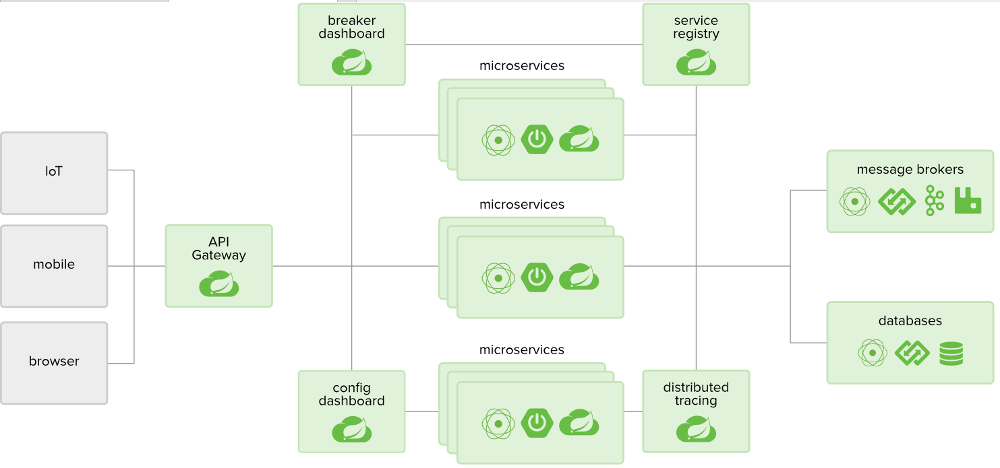
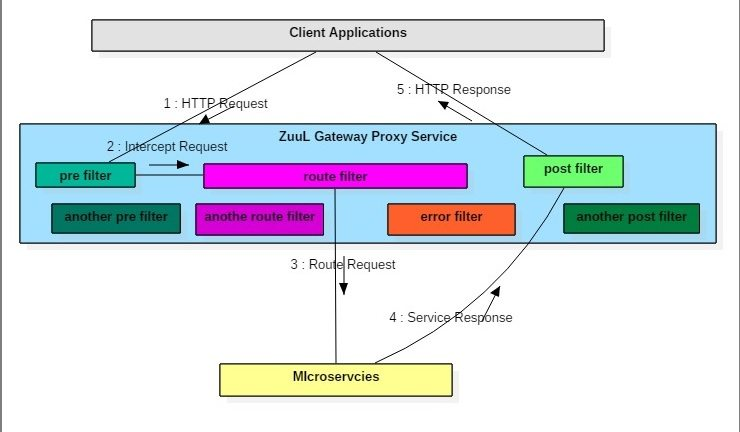

# 一 微服务介绍

## 微服务

为服务化的核心就是将传统的一站式应用(*单体应用*), 根据业务拆分成一个一个的服务, 彻底地去耦合, 每一个微服务提供单个业务功能的服务, 一个服务做一件事, 从技术角度看就是一种小而独立的处理过程, 类似进程概念, 能够自行单独启动或销毁, 拥有自己独立的数据库.

## 微服务和微服务架构

可以理解为规范与实现吧

## 优缺点

解耦, 但增加部署负担

## 微服务技术栈

| 微服务组件                                   | 实现技术                                                     |
| -------------------------------------------- | ------------------------------------------------------------ |
| 服务开发                                     | Springboot, Spring, SpringMVC                                |
| 服务配置与管理                               | Netflix公司的Archaius, 阿里的Diamond等                       |
| 服务注册与发现                               | Eureka, Consul, Zookeeper等                                  |
| 服务调用                                     | Rest, RPC, gRPC                                              |
| 负载均衡                                     | Ribbon, Nginx等                                              |
| 服务接口调用<br />(客户端调用服务的简化工具) | Feign等                                                      |
| 消息队列                                     | Kafka, RabbitMQ, ActiveMQ等                                  |
| 服务配置中心管理                             | SpringCloudConfig, Chef等                                    |
| 服务路由(API网关)                            | Zuul等                                                       |
| 服务监控                                     | Zabbix, Nagios, Metrics, Spectator等                         |
| 全链路追踪                                   | Zipkin, OpenStack, Kubernetes等                              |
| 服务部署                                     | Docker, OpenStack, Kubernetes等                              |
| 数据流操作开发包                             | SpringCloud Stream<br />(封装与Redis, Rabbit, Kafka等发送接受消息) |
| 事件消息总线                                 | Spring Cloud Bus                                             |

## 微服务框架

 除了Spring Cloud, 还有Motan(新浪), gRPC(google), Thrift(facebook), Dubbo(阿里)/DubboX(当当网). Spring Cloud和Dubbo提供的微服务功能比较全. 最初Dubbo比较火, 但由于它停止维护长达5年, 导致现在Spring Cloud用的比较多.

## 限流,熔断,降级

- **服务限流** ：当系统资源不够，不足以应对大量请求，对系统按照预设的规则进行流量限制或功能限制
- **服务熔断**：当调用目标服务的请求和调用大量超时或失败，服务调用方为避免造成长时间的阻塞造成影响其他服务，后续对该服务接口的调用不再经过进行请求，直接执行本地的默认方法
- **服务降级**：为了保证核心业务在大量请求下能正常运行，根据实际业务情况及流量，对部分服务降低优先级，有策略的不处理或用简单的方式处理

服务降级的实现可以基于人工开关降级（秒杀、电商大促等）和自动检测（超时、失败次数、故障），熔断可以理解为一种服务故障降级处理

> 为什么需要限流降级
>
> 系统承载的访问量是有限的，如果不做流量控制，会导致系统资源占满，服务超时，从而所有用户无法使用，通过服务限流控制请求的量，服务降级省掉非核心业务对系统资源的占用，最大化利用系统资源，尽可能服务更多用户

# 二 Spring Cloud介绍

## 介绍

SpringCloud是分布式微服务架构下的一站式解决方案, 是各个微服务架构组件实现技术的集合体, 俗称微服务全家桶. **它集成了这些组件, 简化了这些组件在Spring Cloud中的使用.**



> 多个微服务一起提供同样的服务或功能, 即为集群, 我们要开发的就是这些微服务, 其他的就是对微服务框架各个组件的配置. 
>
> 就像当初学SSM一样, 前期工作就是繁杂的配置. 由于Spring Cloud集成了这些组件, 因此配置还是相当简单的.

## SpringBoot vs. SpringCloud

- SpringBoot专注于快速方便的开发单个个体微服务
- SpringCloud关注全局的微服务协调与治理框架, 它将SpringBoot开发的一个个单体微服务整合并管理起来.

## SpringCloud vs. Dubbo


## 个人总结

前面说了, Spring Cloud主要是提供分布式微服务框架下的一站式解决方案, 那么来看看微服务开发都有什么挑战, Spring Cloud又给我们带来了什么解决方案.

当单体应用越来越庞大时, 业务复杂, 多人开发的协调也变得复杂起来. 这是需要将应用**拆分**成一个一个的微服务, 每个服务单独由一个小团队来开发维护. 不同微服务之间相对独立, 只需暴露出一定接口供服务之间调用即可, 如Rest API, RPC等.

当某个服务出现瓶颈后, 需要**集群**来提供高可用的能力.

每个微服务都可由`host:port`来区分, 当微服务多起来并且都集群时, 微服务之间的调用变得异常困难. 拥有某个功能的微服务的ip地址是多少? 到底调用集群中的那个微服务? 

Spring Cloud给出了答案, 使用**Eureka**来提供服务注册与发现的功能, 将微服务注册的功能自动化了, 并且调用微服务时只需提供服务名即可, 而非`host:port`, 大大简化了微服务的开发效率.

如有集群, 具体调用那个服务? **Ribbon**提供了客户端负载均衡的能力, 能够将访问请求平均分配在集群的服务器上.

微服务调用之间出现异常了怎么办? 任由其向上发出雪崩式的异常? **Hystrix**(电路熔断器)提供了解决方案, 当调用某个服务出现异常时, 断开正常执行顺序, 走后备路线(fallback). 保证了微服务架构的容错性.

> 即调用微服务出错了, 我就不执行这个方法了, 而是它的备用方法.

前端如浏览器, 调用微服务出现了跨域问题(CORS), 怎么办? **Zuul**提供了路由的功能, 充当一个网关或代理, 提供一个统一的API接口供前端访问.

> 目前个人倾向于使用Nginx

Spring Cloud使用Rest API作为微服务之间调用的接口, 可以使用`RestTemplate`作为调用其他微服务Rest API的客户端(Client), 但是使用起来仍是很麻烦. **Feign**则是一个简化Rest API调用的**声明式**的框架, 只需要使用Spring MVC注解写出对应于Rest API的接口即可像调用函数一样调用Rest API.

> 并且Hystrix在Feign中使用起来更为的方便.

-----------

内容暂且学习到这里, 还有什么Spring Cloud Config外置配置文件等什么的, 以后待学.

# 三 Eureka

## 介绍


C/S架构, 分为Eureka Server和Eureka Client. 

client有两种行为:

* 注册: 将自身的服务(service)信息注册到server中, 以供其他服务查询.
* 获取: 从server获取所有的服务信息, 以便通过服务名查找具体微服务并调用.

server主要负责维护这些信息, 如果有多个server, 则可相互复制, 共享自己的注册信息, 即Eureka Server集群.

client成功注册后, 会每隔一段时间(默认30s)向server发送一个**心跳**, 来维护服务在server中的状态. 如果持续一段时间(默认90s)后, 未接收到client的心跳, client信息将被移出.

client获取到注册信息后, 会**缓存**起来, 默认每隔30秒会重新更新本地缓存. 

如果一段时间内, 大量已注册的client已不正常的方式结束(无心跳), 那么server会进入**自我保护模式**, 这些client的信息被保护起来, 并不被删除. 

## 配置

Eureka配置分为两类:

* [eureka.instance.*](https://github.com/spring-cloud/spring-cloud-netflix/blob/master/spring-cloud-netflix-eureka-client/src/main/java/org/springframework/cloud/netflix/eureka/EurekaInstanceConfigBean.java)和注册相关的配置
* [eureka.client.*](https://github.com/spring-cloud/spring-cloud-netflix/blob/master/spring-cloud-netflix-eureka-client/src/main/java/org/springframework/cloud/netflix/eureka/EurekaClientConfigBean.java)和获取(查询)注册信息相关的配置

### Server端

* 引入Eureka服务:

  * 添加如下依赖

      ```xml
      <dependency>
          <groupId>org.springframework.cloud</groupId>
          <artifactId>spring-cloud-starter-netflix-eureka-server</artifactId>
      </dependency>
      ```
    
  * 主类中添加`@EnableEurekaServer`注解
  
      ```java
      @SpringBootApplication
      @EnableEurekaServer
      public class Application {
      
          public static void main(String[] args) {
              new SpringApplicationBuilder(Application.class).web(true).run(args);
          }
      
      }
      ```
  
  * 添加对JDK11的支持, 因为Eureka Server需要的JAXB模块在JDK11中被移出了
  
    ```xml
    <dependency>
    	<groupId>org.glassfish.jaxb</groupId>
    	<artifactId>jaxb-runtime</artifactId>
    </dependency>
    ```
  
* 配置

  * 独立模式: 即只有一个eureka server

    ```yml
    server:
      port: 8761
    
    eureka:
      instance:
        hostname: localhost #主机的域名
      client:
        registerWithEureka: false #不注册自身
        fetchRegistry: false #不获取注册信息
        serviceUrl:
          defaultZone: http://${eureka.instance.hostname}:${server.port}/eureka/ #指向自身
    ```

    server集群之间注册是需要提供`hostname`, 在独立模式下, 只需设置为`localhost`即可.

    独立模式下, server不需要注册自己, 也不需要从其他地方获取注册信息.

    然后defaultZone指向其他server的地址, 独立模式下指向自己即可

  * 集群模式: 即多个eureka server提供同样的服务

    ```yml
    eureka:
      client:
        serviceUrl:
          defaultZone: http://peer1/eureka/,http://peer2/eureka/,http://peer3/eureka/
    
    ---
    spring:
      profiles: peer1
    eureka:
      instance:
        hostname: peer1
    
    ---
    spring:
      profiles: peer2
    eureka:
      instance:
        hostname: peer2
    
    ---
    spring:
      profiles: peer3
    eureka:
      instance:
        hostname: peer3
    ```

    > 该配置只做演示, 不完整

    多个server运行于不同的配置(profile). 此时server需要向其他server注册自己, 与其他server同步注册信息, 因此`registerWithEureka`和`fetchRegistry`默认就好.

    而`defaultZone`可以指向所有server, 也可给出一个, 只要两者之间构成通路即可.

    `hostname`一般只在server之间使用, client指向server时可用ip指向server. 可以通过编辑本地`/etc/hosts`文件提供给server域名. 也可以设置`preferIpAddress`为`true`, 此时, 不同提供server`hostname`属性, 会自动从系统中获取第一个非环路ip地址.

### Client端

* 引入: 只需添加依赖即可

  ```xml
  <dependency>
      <groupId>org.springframework.cloud</groupId>
      <artifactId>spring-cloud-starter-netflix-eureka-client</artifactId>
  </dependency>
  ```

* 配置

  ```yml
  spring:
    application:
      name: service-client
  server:
    port: 8088
  
  eureka:
    client:
      service-url:
        defaultZone: http://localhost:8761/eureka/
    instance:
      lease-renewal-interval-in-seconds: 3
  ```

  client提供的服务的名字由`spring.application.name`提供, 服务之间都是通过该服务名来访问的.

  `defaultZone`指向要去注册的server地址.

  `lease-renewal-interval-in-seconds`用来设置client心跳的时间间隔, 生产环境中默认即可, 但在开发环境中可以设置快一点.

* 使用: client之间的服务调用通过`RestTemplate`实现的, Eureka默认引入(依赖)了Ribbon, 提供`RestTemplate`负载均衡的功能, 只需在注入时加上一个注解, 如:

  ```java
  @LoadBalanced
  @Bean
  RestTemplate restTemplate() {
      return new RestTemplate();
  }
  ```

  然后使用服务名来访问微服务, 如

  ```java
  tring response = restTemplate.exchange("http://student-service/getStudentDetailsForSchool/{schoolname}",
                                  HttpMethod.GET, null, new ParameterizedTypeReference<String>() {}, schoolname).getBody();
  ```

  > student-service是微服务的服务名, 如果该服务存在集群, 则负载均衡的访问某个client.

  > 除此之外, 还有Feign, 它也是访问Rest API的客户端, 比`RestTemplate`更为方便, 但有限制, 详细见下.

# 四 Ribbon

集群后, 需要一个负载均衡器将访问请求平摊在每个服务上, 达到高可用的目的. 

负载均衡分为服务端负载均衡和客户端负载均衡. 

- 服务端: 即在集群的服务前放置一个负载均衡器, 由它分发流量
- 客户端: 由请求方选择到底请求集群服务器中的哪一个

------------

Ribbon属于客户端负载均衡器, 默认与Eureka集成在一起, 因此存在Eureka时, 不必手动引入以下依赖:

```xml
<dependency>
    <groupId>org.springframework.cloud</groupId>
    <artifactId>spring-cloud-starter-netflix-ribbon</artifactId>
</dependency>
```

使用: 一般都是`RestTemplate`通过服务名访问, ribbon会从查询eureka获取的所有服务注册信息, 然后以负载均衡的方式选择一个微服务并访问. 默认算法采用轮询. 具体使用见第三章.

> 也可以使用Feign, Feign也默认Ribbon作为负载均衡器.

# 五 Feign

Feign是一个**声明式**的Rest API的客户端, 支持Spring MVC的注解, 只需要编写对应Rest API的接口即可, Feign会自动代理生成实例并注入到容器中, 极大地方便了微服务之间的调用.

> 如果存在Ribbon时, 则自动使用该负载均衡器.

> 遇到复杂API接口时, 不能够通过Spring MVC注解描述时, 可以通过接口的`default`或`static`方法加上`RestTemplate`编写该负载API的客户端.

## 引入

```xml
<dependency>
    <groupId>org.springframework.cloud</groupId>
    <artifactId>spring-cloud-starter-openfeign</artifactId>
</dependency>
```

启用Feign

```java
@EnableFeignClients
```

## 使用

只需写Rest API对应的接口+注解, 然后在接口上加上`@FeignClient`, 如

```java
@FeignClient(name = "service-client",fallback = Fallback.class,path = "/user")
@ResponseBody
public interface UserService {
    @GetMapping("/")
    public List<User> allUsers();

    @PostMapping("/")
    public void add(@RequestBody User user);

    @GetMapping("/2")
    public List<User> allUsers2();
}
```

然后注入该bean并使用即可.

* `name` 服务名
* `path` 微服务的上下文

* `url` 不存在服务发现时, 服务的具体url前缀, 如`http://localhost:8080/user`

  > `path`与`url`在不同情况下, 仅设置一个即可. 

> `path="/user"`相当于`@RequestMapping("/user")`
>
> `fallback`属性是配置Hystrix的, 见下节
>
> 但仅仅只用Feign, 无Hystrix时, 可以直接拷贝其他微服务controller的接口, 可以使用`@RestController`和`@RequestMapping`注解. 但存在Hystrix时, 只能使用上述方式, 见下节.

-----

关于方法参数, 需要使用对应注解修饰, 表示参数传递方式. 如`@RequestParam`, 否则会默认为请求体参数.

## 拦截器

* 请求处理器

  https://www.baeldung.com/spring-cloud-openfeign

* 响应处理器

  https://stackoverflow.com/questions/31722478/spring-cloud-feign-interceptor

  > Feign没有提供真正的响应处理器, 而是通过了更底层的方式来实现的.

# 六 Hystrix

## 介绍

当被调用的微服务出现某种问题或直接停止时, 一般会导致调用者超时或抛出异常, 造成该生态系统不够稳定. 

Hystrix就是用来解决这个问题, 当一个服务出现问题时, 会将执行顺序转换到其他地方, 如fall back处理函数. 仅当检测到该服务正常了, 才恢复正确的执行顺序.

本质上就是在调用其他微服务处的函数上包裹了一层Wrapper函数, 一旦出现问题就执行其他已指定的方法.

**简而言之**, 当调用一个微服务抛出异常时, 就执行对应的fallback函数.

---------

因为Hystrix在Feign中使用起来极其方便, 因此这里只介绍Feign下的Hystrix使用.

## 引入

加入依赖

```xml
<dependency>
    <groupId>org.springframework.cloud</groupId>
    <artifactId>spring-cloud-starter-netflix-hystrix</artifactId>
</dependency>
```

配置文件中允许Feign启用Hystrix

```yaml
feign:
  hystrix:
    enabled: true
```

## 使用

延续第五章的话题, `@FeignClient`的`fallback`属性指定微服务调用异常时执行的类, 如

```java
@Component
public class Fallback implements UserService {


    @Override
    public List<User> allUsers() {
        User user=new User();
        user.setName("出故障喽");
        user.setSex("是滴!是滴!!");


        return Arrays.asList(user);
    }

    @Override
    public void add(User user) {

    }

    @Override
    public List<User> allUsers2() {
        return allUsers();
    }
}
```

注意点

* 要继承`@feignClient`注解的接口

* 必须加入`@Component`注入到容器中

* 上面的例子中, 接口和实现类都作为Bean注入到了容器中, **但并不会映射到URL上**.

  > 接口能在容器中注入为bean? 其实注入的是Feign对该接口的代理.

* 既然接口和实现都配置成Bean了, 那么`@Autowired`时到底注入的哪一个? `@FeignClient`的`primary`属性默认为true, 意味着接口优先注入.

  > 非正常情况下, 见下节注意点.

之后Feign接口的哪个方法异常了, 就执行实现类`Fallback`对应的方法.

## 注意点

之前说了, Feign与Hystrix搭配使用时有几个坑要注意.

第一, Feign接口不能使用`@RestController`注解, 会造成多个Bean映射到同一个url上, 从而冲突.

> 可以使用`@ResponseBody`代替, 经测试, 不用这些注解也都行.

第二, 使用`@FeignClient`的`path`属性来代替`@RequestMapping`, 也会造成上述问题.

> 为啥会这样? 不知道...

# 七 Zuul

## 介绍

* 网关, 主要提供**路由**和**过滤**功能

## 原理

* Zuul被实现为Servlet, 但请求一般先经过默认Servlet, 即Spring MVC的`DispatcherServlet` , 然后交由Zuul的Servlet(`/zuul/*`)处理. 默认Servlet具有缓存功能, 因此不建议默认Servlet上传大文件. 

* 对于大文件, 应该直接走Zuul提供的Servlet(`/zuul/*`), 请求不会被缓存.

    > 转发时, 前缀`/zuul`会被移除

> 例子如下
>
> 1. 配置路由
>
>    ```properties
>    zuul.routes.customers=/customers/**
>    ```
> 
> 2. 发起请求到`/customers/**`, 由`DispatcherServlet`处理; 发起请求到`/zuul/customers/**` , 直接由Zuul外置Servlet处理.

## 配置

* 修改Zuul Servlet的默认URL`/zuul`

  前缀`/zuul` 可由`zuul.servlet-path`属性修改

* 路由

  > 下面都使用 ant-style 模式的URL

  微服务路由的简化形式:

  ```yaml
   zuul:
    routes:
      users: /myusers/**
  ```

  > `/myusers`的请求将被转发到`users`服务上. 如`/myusers/101`被转发到`/101`

  微服务路由更详细配置的形式:

  ```yaml
   zuul:
    routes:
      users:
        path: /myusers/**
        serviceId: users_service
  ```

  > `/myusers`的请求将被转发到`users_service`服务上

  静态路由

  ```yaml
   zuul:
    routes:
      users:
        path: /myusers/**
        url: https://example.com/users_service
  ```

  > `/myusers/101` --> `https://example.com/users_service/101`
	
  > 这里以url的形式给出, 而非微服务名.
	
  > **注意**, 该方式不支持负载均衡(Ribbon) 和熔断(Hystrix)
  
* **踩坑点**

  `path`间不要有包含关系, 如`/a/b/c/**`, `/a/b/**`, 这样会出问题, 具体什么问题还没详细测试过.

## 过滤器

### 过滤器类型

* `pre`

  请求路由器被调用

* `route`

  路由请求时调用

* `post`

  路由后使用

* `error`

  路由过程异常时使用

> 上述描述不足以概括过滤器具体行为, 必须参考下述Servlet的具体实现

### 生命周期

较复杂, 这里直接给出Zuul Servlet的源码

```java
@Override
public void service(javax.servlet.ServletRequest servletRequest, javax.servlet.ServletResponse servletResponse) throws ServletException, IOException {
    try {
        init((HttpServletRequest) servletRequest, (HttpServletResponse) servletResponse);

        // Marks this request as having passed through the "Zuul engine", as opposed to servlets
        // explicitly bound in web.xml, for which requests will not have the same data attached
        RequestContext context = RequestContext.getCurrentContext();
        context.setZuulEngineRan();

        try {
            preRoute();
        } catch (ZuulException e) {
            error(e);
            postRoute();
            return;
        }
        try {
            route();
        } catch (ZuulException e) {
            error(e);
            postRoute();
            return;
        }
        try {
            postRoute();
        } catch (ZuulException e) {
            error(e);
            return;
        }

    } catch (Throwable e) {
        error(new ZuulException(e, 500, "UNHANDLED_EXCEPTION_" + e.getClass().getName()));
    } finally {
        RequestContext.getCurrentContext().unset();
    }
}
```

总的来说, `pre`-->`route`-->`postRoute`, 异常后会执行`error`->`postRoute`.

### 定义

下面给出黑名单拦截IP的过滤器

```java
public class IpFilter extends ZuulFilter {
    // IP黑名单列表
    private List<String> blackIpList = Arrays.asList("127.0.0.1");
    public IpFilter() {
        super();
    }
    //是否执行该过滤器, true执行, false不执行.
    @Override
    public boolean shouldFilter() {
        return true
    }
    //过滤器类型, 可选值:pre|route|post|error
    @Override
    public String filterType() {
        return "pre";
    }
    //过滤器执行优先级, 数值越小, 优先级越高
    @Override
    public int filterOrder() {
        return 1;
    }
    //过滤器的业务逻辑, 返回值没啥用
    @Override
    public Object run() {
        RequestContext ctx = RequestContext.getCurrentContext();
        String ip = IpUtils.getIpAddr(ctx.getRequest());
        // 在黑名单中禁用
        if (StringUtils.isNotBlank(ip) && blackIpList.contains(ip)) {
            ctx.setSendZuulResponse(false);
            ResponseData data = ResponseData.fail("非法请求 ", ResponseCode.NO_AUTH_CODE.getCode());
            ctx.setResponseBody(JsonUtils.toJson(data));
            ctx.getResponse().setContentType("application/json; charset=utf-8");
            return null;
        }
        return null;
    }
}
```

### 解决方案

* 不同filter间数据传递

  已经过滤器执行顺序后, 通过`RequestContext`存取请求作用域内的数据

  ```java
  RequestContext ctx = RequestContext.getCurrentContext();
  ctx.set("msg", "你好吗");
  ```

  ```java
  RequestContext ctx = RequestContext.getCurrentContext();
  ctx.get("msg");
  ```

* 拦截请求

  ```java
  RequestContext ctx = RequestContext.getCurrentContext();
  ctx.setSendZuulResponse(false);
  ctx.setResponseStatusCode(HttpStatus.UNAUTHORIZED.value());
  ctx.getResponse().setContentType("application/json;charset=UTF-8");
  ctx.setResponseBody("{\"result\":\"this request is not allow!\"}");
  ctx.set("isSuccess", false);
  ```

* 放行请求

  啥都不用管, 结束`run()`即可

### `RequestContext`

提供上下文信息, 和支持在请求作用域中存储变量. 基于`ThreadLocal`实现

* 获取`RequestContext`

  ```java
  RequestContext.getCurrentContext()
  ```

* 获取请求

  ```java
  getRequest()
  ```

* 存取变量

  ```java
  get()
  ```

  ```java
  set()
  ```

## 参考

* [zuul学习四：zuul 过滤器详解](https://www.jianshu.com/p/ff863d532767)
* [Router and Filter: Zuul](https://cloud.spring.io/spring-cloud-static/spring-cloud-netflix/2.2.2.RELEASE/reference/html/#router-and-filter-zuul)

# Sentinel

* 依赖引入

  ```xml
  <dependency>
      <groupId>com.alibaba.cloud</groupId>
      <artifactId>spring-cloud-starter-alibaba-sentinel</artifactId>
  </dependency>
  ```

## 资源定义

## 规则

### 流量控制

* QPS流量控制

  * 介绍

    当 QPS 超过某个阈值的时候，则采取措施进行流量控制

  * 流控效果

    * 直接拒绝(默认) (`RuleConstant.CONTROL_BEHAVIOR_DEFAULT`)

      当QPS超过阈值后, 新的请求被拒绝, 将抛出`FlowException`异常

      > 当进行压测, 知道系统处理上限后, 可设置该效果, 防止系统奔溃

    * Warm Up (`RuleConstant.CONTROL_BEHAVIOR_WARM_UP`)

      冷启动, QPS可缓慢增加, 若流量突增, 则将在一个预热时间内, QPS将逐渐增加到阈值(超过QPS的会被拒绝). 

      > 用于启动需要额外开销的场景，例如建立数据库连接等。

    * 匀速排队 (`RuleConstant.CONTROL_BEHAVIOR_RATE_LIMITER`)

      以固定间隔时间让请求通过, 若当前请求与上个通过了的请求间隔大于预设值, 则通过; 否则, 排队等待处理. 若请求等待的时间大于最长排队等待时间, 则拒绝.

* 并发线程数控制

* 基于调用关系的流量控制

### 熔断降级

## 参考

* [如何使用](https://github.com/alibaba/Sentinel/wiki/%E5%A6%82%E4%BD%95%E4%BD%BF%E7%94%A8)

* [spring-cloud-alibaba的wiki](https://github.com/alibaba/spring-cloud-alibaba/wiki/Sentinel)

# 杂乱的学习笔记(非重点)

## [学习二](https://www.baeldung.com/spring-cloud-bootstrapping)

* Spring Cloud Config
  * 用于集中管理其他微服务的通用配置, 避免因集群而导致配置增多
  * 通常配置会被放入Git仓库中, 获得版本管理的功能
  * 分为服务端和客户端, 客户端需要指明服务器在哪
  * Spring Cloud程序初始化时会读入`bootstrap.properties`配置文件, 因此客户端关于服务器信息的配置的信息可以放入此处.
* Eureka
  * 每个服务都通过`ip/port`区分, eureka可以提供更方便定位到微服务的方式.
  * 分为server和client

* Zuul
  * 提供反向代理功能, 避免CORS的需要.

## [学习三](https://howtodoinjava.com/microservices/microservices-definition-principles-benefits/)

### 微服务介绍

* 每个微服务有都有自己的业务逻辑和数据库.
* 与单体应用相比, 微服务更倾向于将整个系统的业务逻辑拆分到更小的单元.
* 对于单个微服务的修改, 一般不会影响到其他的微服务.
* 微服务之间通常采用轻量级协议通信, 如HTTP,REST,JMS,AMQP等.
* 好处
  * 给于开发更好的扩张性, 如使用不同的语言和数据库来开发单个微服务.
  * 可方便的集群
  * 可无顾虑的尝试新技术
  * 更快的开发效率, 大型单体应用需要更周密的设计, 这种设计是十分昂贵的.

### Config Server

* 将client配置外置集中管理. 
* 也能够在修改配置后, 不刷新client, 需要加个注解, 略.

### Zuul(API Gateway)

提供给客户端(如浏览器)一个统一的访问API接口. Zuul是一个**边缘**服务, **代理**请求, 转发给对应的服务.

Zuul也提供了过滤器, 过滤某些请求. 如




## [学习四](https://cloud.spring.io/spring-cloud-static/Greenwich.SR2/single/spring-cloud.html)

### Spring Cloud提供的功能

* Distributed/versioned configuration
* Service registration and discovery
* Routing
* Service-to-service calls
* Load balancing
* Circuit Breakers
* Distributed messaging

### 基础

#### Spring Cloud Content

* **介绍**: 提供有用的工具和服务, 扩展了`ApplicationContent`的功能. 如bootstrap context, encryption, refresh scope, and environment endpoints.

* **容器**: Spring Cloud中额外提供了一个`Bootstrap`容器作为应用的父容器, 配置文件以`bootstrap.[yml|properties]`给出. 共享同一个`Environment`.

  > 回顾下, 父容器的bean可以被子容器访问和隐藏.

* **属性源**: 即配置的来源. 默认设置中, 本地配置源由`bootstrap.[yml|properties]`提供, 远程配置源由Spring Cloud Server提供. 一般情况下, 远端配置不被覆盖(隐藏), 除非远端配置源允许它, 见[Overriding the Values of Remote Properties](https://cloud.spring.io/spring-cloud-static/Greenwich.SR2/single/spring-cloud.html#overriding-bootstrap-properties); 而本地配置源可以.

* **日记配置**: 日记配置放在`bootstrap.[yml | properties]`中才会作用于所有事件.

  > 不能使用自定义前缀

#### Spring Cloud Commons

* **介绍**: 微服务由一系列基础设施和服务组成, Spring Cloud Commons则提供了关于基础设施的抽象层, 如服务发现,负载均衡,断路机制等

  > 简而言之, 即定义了基础设施服务的接口.

* **服务注册**: Commons提供了`ServiceRegistry`接口, 用于服务注册与注销. 实现类如`ZookeeperServiceRegistry`,`EurekaServiceRegistry`,`ConsulServiceRegistry`等.

  * 默认client运行服务时自动向server注册

* **负载均衡客户端**: 可选择的很多, 其中有`RestTemplate`. 该bean必须手动创建, 并添加`@LoadBalanced`注解, 如

  ```java
  @LoadBalanced
  @Bean
  RestTemplate restTemplate() {
      return new RestTemplate();
  }
  ```

  `RestTemplate`在ribbon存在时, 会被自动配置好.

### Spring Cloud Config

* **介绍**: 分为client端和server端, Spring Cloud Config可将client端的配置外置化, 集中存储在server端中. Server端默认使用git仓库为配置文件的存储仓库.

### Spring Cloud Netflix

通过Netflix组件, 可以快速配置好分布式系统的通用模式, 这些模式包括

* **Service Discovery(Eureka)**
* **Circuit Breaker(Hystrix)**
* **Intelligent Routing(Zuul)**
* **Client Side Load Balancing(Ribbon)**

# 参考

* [Spring Cloud](https://cloud.spring.io/spring-cloud-static/Greenwich.SR2/single/spring-cloud.html)

* [Spring Cloud 尚硅谷](https://www.bilibili.com/video/av42199337/?p=16)

* [Spring Cloud in HowToDoInJava](https://howtodoinjava.com/microservices/microservices-definition-principles-benefits/)

  


