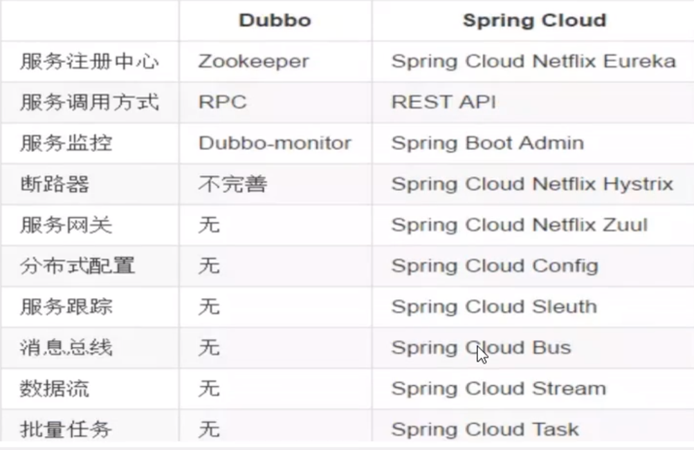
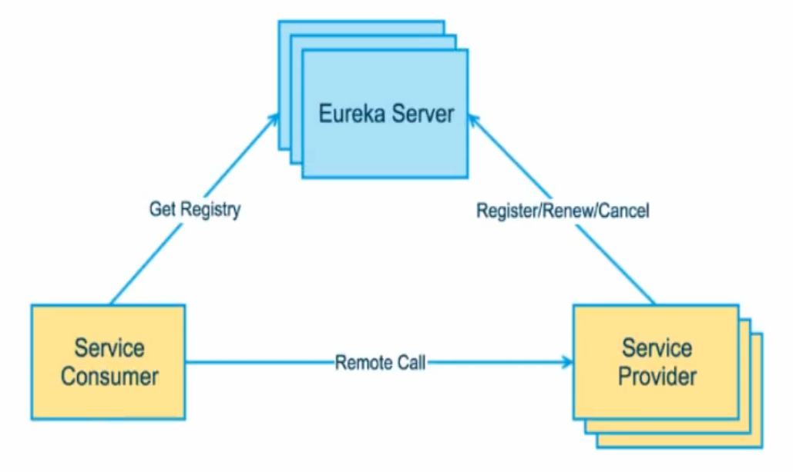

# 微服务介绍

- **微服务:** 为服务化的核心就是将传统的一站式应用, 根据业务拆分成一个一个的服务, 彻底地去耦合, 每一个微服务提供单个业务功能的服务, 一个服务做一件事, 从技术角度看就是一种小而独立的处理过程, 类似进程概念, 能够自行单独启动或销毁, 拥有自己独立的数据库.

- **微服务和微服务架构**: 可以理解为规范与实现吧

- **优缺点**: 解耦, 但增加部署负担

- **微服务技术栈**

  | 微服务组件                                   | 实现技术                                                     |
  | -------------------------------------------- | ------------------------------------------------------------ |
  | 服务开发                                     | Springboot, Spring, SpringMVC                                |
  | 服务配置与管理                               | Netflix公司的Archaius, 阿里的Diamond等                       |
  | 服务注册与发现                               | Eureka, Consul, Zookeeper等                                  |
  | 服务调用                                     | Rest, RPC, gRPC                                              |
  | 负载均衡                                     | Ribbon, Nginx等                                              |
  | 服务接口调用 (客户端调用服务的简化工具) | Feign等                                                      |
  | 消息队列                                     | Kafka, RabbitMQ, ActiveMQ等                                  |
  | 服务配置中心管理                             | SpringCloudConfig, Chef等                                    |
  | 服务路由(API网关)                            | Zuul等                                                       |
  | 服务监控                                     | Zabbix, Nagios, Metrics, Spectator等                         |
  | 全链路追踪                                   | Zipkin, OpenStack, Kubernetes等                              |
  | 服务部署                                     | Docker, OpenStack, Kubernetes等                              |
  | 数据流操作开发包                             | SpringCloud Stream (封装与Redis, Rabbit, Kafka等发送接受消息) |
  | 事件消息总线                                 | Spring Cloud Bus                                             |

- **微服务框架**: 除了Spring Cloud, 还有Motan(新浪), gRPC(google), Thrift(facebook), Dubbo(阿里)/DubboX(当当网). Spring Cloud和Dubbo提供的微服务功能比较全. 最初Dubbo比较火, 但由于它停止维护长达5年, 导致现在Spring Cloud用的比较多.

# Spring Cloud介绍

- SpringCloud是分布式微服务架构下的一站式解决方案, 是各个微服务架构组件实现技术的集合体, 俗称微服务全家桶.

  

  > 微服务那, 多张叠在一起表示集群, 我们要开发的就是这些微服务, 其他的就是对微服务框架各个组件的配置. 就像当初学SSM一样, 繁杂的配置.

- SpringBoot与SpringCloud

  - SpringBoot专注于快速方便的开发单个个体微服务
  - SpringCloud关注全局的微服务协调与治理框架, 它将SpringBoot开发的一个个单体微服务整合并管理起来.

- SpringCloud与Dubbo对比

  

## Eureka(服务注册与发现)

- 介绍: 提供**注册**和**发现**微服务的功能

- C-S架构, eureka服务端为服务注册中心, eureka客户端连接服务端并维持心跳连接.

  

  可以看到, eureka中有三大角色: Eureka Server, Eureka Client(Service Consumer, Service Provider)

- 自动保护机制: 某时刻某一个微服务不可用了, eureka不会立刻清理, 依旧会对该微服务的信息进行保存. 

  - 触发条件: 服务变更, 长时间不发送心跳

## Ribbon

- 介绍: 一套实现客户端负载均衡的工具

## Feign

以面向接口的方式简化rest接口的调用, 集成了Ribbon, 也提供了负载均衡的功能.

