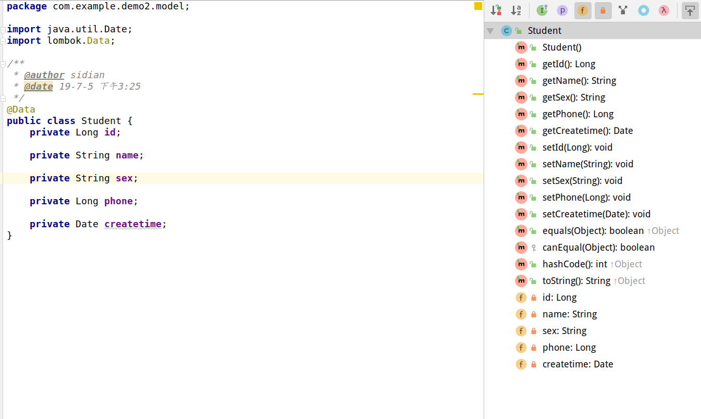

* **介绍**: 编写JavaBean时, 经常需要编写大量的setter,getter,toString,equal等方式, 可由ide代劳自动生成. 但是, 当修改了JavaBean字段后, 仍需要手动维护其他方法, 极其繁琐. 而Lombok就是解决这个问题的工具.

* **原理**: 在编译阶段为JavaBean生成相关字节码.

* **引入**: 只需要添加依赖, 如Spring Boot项目中

  ```xml
  <dependency>
      <groupId>org.projectlombok</groupId>
      <artifactId>lombok</artifactId>
      <optional>true</optional>
  </dependency>
  ```

  > 但是在使用JavaBean的setter,getter方法时, 会报错, 但能成功运行. 因为未编译前, ide看不到将被添加的方法, **因此需要下载Lombok插件**.
  
* **使用**: 这里只关注最主要的注解使用, `@Data`注解在类上, 会生成getter, setter, 无参构造函数, toString, hashcode, equals等方法. 如下所示:

  

> 参考: [Lombok介绍、使用方法、工作原理和总结](http://www.yuanrengu.com/index.php/20180324.html)

