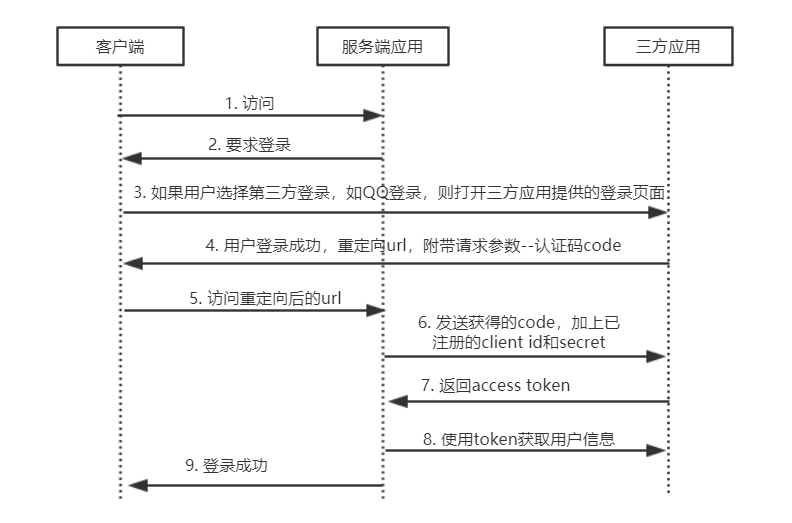
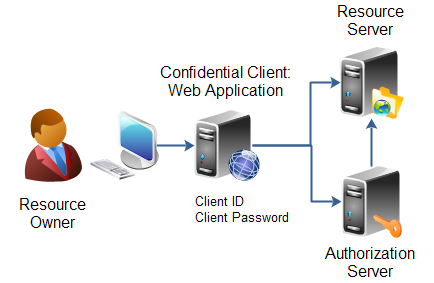
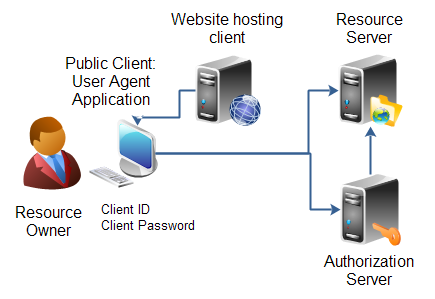
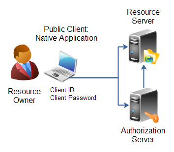
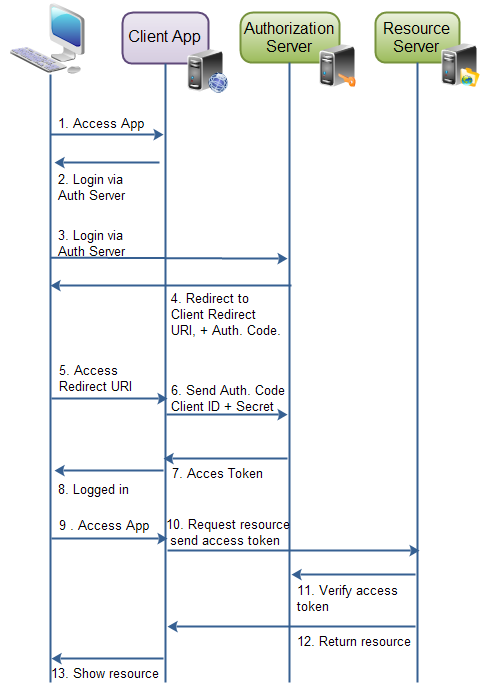
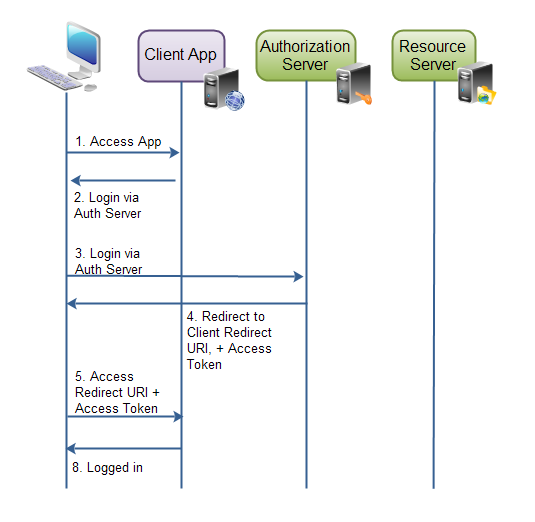

- 只是一个协议、规范

- 貌似只合适不同客户应用间分享数据，那怎么设置不同用户权限呢？

- 三方认证：应用A进行三方认证，首先需要用户在三方服务器提供的授权页面中授权，返回一个授权码（code）给应用A，应用A通过授权码获得令牌（token），通过该令牌可以访问用户在三方服务器的资源。

  > 令牌标识用户和权限的凭证。因此在微信网页授权中的access_token与服务号会话的access_token不一样，代表的用户不一样，一个代表微信用户，一个代表三方程序。

- token可以存于客户端（不建议），但之前先认证。但refresh token必须存于服务器。

  > 这里指的是本系统提供的token，三方服务上获取的token仍需要保存在服务器上。

- 三方认证流程

  

  > - 目的是为了获取代表用户信息的access token，然后可以获取用户信息完成登录或注册。
  > - 三方登录时在三方应用的页面上登录的，这样保证账号密码不被服务端应用窃取。
  > - 用户在三方登录成功后，或被重定向到服务端应用上，并附上三方应用登录成功的凭证（code），服务端应用需要该code和已注册的client id、secret（密码）来向三方应用获取token
  > - 服务端应用必须先向三方应用注册client id和secret，才能使用三方认证。

# 角色

- 资源拥有者（`Resource Owner`）：可以是人或者应用
- 资源服务器（`Resource Server`）：存储资源的服务器
- 客户应用（`client application`）：请求访问资源服务器的应用。如一个游戏应用（`client`）请求访问QQ账户信息（`Resource Server`）。
- 认证服务器（`Authorization Server`）：授权客户应用对资源拥有者的的资源的访问权限。通常与资源服务器位于同一服务器上，不强制

# 客户应用的类型

按照客户id和密码的安全性，可分为`Confidential`（安全的）和`Public`（不安全）两种。

按照客户应用类型可分：

- **Web程序**：web程序运行在服务器上，客户id和密码存在服务上，因此是安全的（`confidential`）

  

- **用户代理程序**：为运行在浏览器的程序，无后端，客户id和密码直接保存在浏览器上，不安全（`public`）

  

- **原生程序**：客户端是桌面或移动程序，客户id和密码存在PC或手机中，不安装（`public`）

  

- **混合程序**：上面类型客户端的混合体，OAuth没有提到这种程序。

# 授权

- 客户应用访问资源所有者的资源时，需要先获得资源拥有者的授权许可（Authorization Grant）。

- 授权的目的是为了获得token，它同时代表了客户应用、资源拥有者的认证和对资源的授权权限。

- 注册：在授权之前，先在授权服务器上注册，会获得唯一的客户id、secret（密码），还要配置重定向URI。只需注册一次，访问授权服务器时需要将这些数据附上，标识该客户应用。

- 授权许可：授权的方式有四种，适用于不同类型的客户应用。

  - **授权码(Authorization Code)**：授权后重定向url附带授权码，后端通过授权码获取token，适合web程序类型的客户应用（即客户应用在后端）。

    

  - **Implicit**：授权后重定向url直接附带token，后端直接获取token，不太安全，适合用户代理、原生类型的客户应用（即客户应用在前端）

    

  - **Resource Owner Password Credentials**：直接给于客户应用访问资源用户凭证（账户密码）的权限，因此直接在客户应用中授权了，不用经过授权服务器了。适合用户代理、原生类型的客户应用，并且该应用值得信任。

  - **Client Credentials**：用于在资源服务器中获取非用户相关的资源，如新闻列表。毕竟不是所有的资源都要用户登录了才能获取。

# Endpoint(端点)

端点就是OAuth2协议对一些URL起的名字。

- **Authorization Endpoint**：授权服务器给用户授权客户应用的页面的url

- **Redirection Endpoint**：用户授权后重定向的url
- **Token Endpoint**：客户应用被授权后，获取token的url

# 请求响应

介绍授权过程的大致参数，具体使用得看它的实现。

不同的授权方式，有不同的请求响应参数，大致参数见：[OAuth 2.0 Requests and Responses](<http://tutorials.jenkov.com/oauth2/request-response.html>)

# 框架-JustAuth

[关于 (justauth.wiki)](https://justauth.wiki/#/README)

# 参考

- [OAuth 2.0 tutorial](<http://tutorials.jenkov.com/oauth2/implicit-request-response.html>)