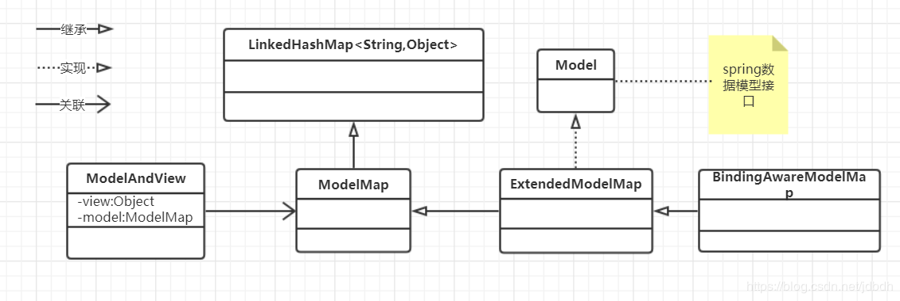

[TOC]

# 一、介绍

spring mvc源于mvc设计理念，通过将web应用分为模型层（M）、视图层（V）和控制层（C），实现了视图（比如jsp）和java Bean的解耦合、java和html的解耦合。mvc的根本好处在于前后台得到了一定的分离，大量的java代码得到了复用。现在前后端都采用了JSON数据交互，使得前后端的耦合度大大降低了。

# 二、初始化和流程

学习spring mvc，必须要了解它的初始化和流程。下面是我根据**自己的理解**描述的流程图，可能会**有不对的地方**，但大致如此。

spring mvc的组件和流程图如下所示:


spring mvc框架的主要是由**DispatcherServlet**来完成请求的响应。DispatcherServlet是一个**调度器**，负责将请求分配给**控制器**处理，然后将控制器处理的模型渲染到**视图**中，最后返回给客户端。貌似很简单，但是它确实很复杂的，因为它实现了mvc分层与解耦，下面详细介绍。

DispatcherServlet是一个servlet，需要在web应用中配置它的映射URL（通常为“/”、“/*”，“*.do”、“/app/*”），当DispatcherServlet收到一个请求时，它会查询**HandlerMapping**，找出与url对应的**处理器执行链（HandlerExecutionChain）**。DispatcherServlet然后找到**处理适配器**来执行这个执行链。执行的结果是返回一个**ModelAndView**，或者执行在执行**处理器**时便通过**HttpMessageConverter**将模型转化为响应的消息体了。如果返回的是ModelAndView，又有两种情况：一、如果视图是**逻辑视图**，则存在**视图解析**的过程，通过视图名找到对应的**视图**，最后将模型渲染到视图中并返回响应；二、如果视图是**非逻辑视图**，则不存在视图解析的过程，而是直接将模型渲染到视图中并返回响应。

上面一段话基本描述到了spring mvc的各个组件和执行的流程。下面简略简洁它的各个组件。

DispatcherServlet在初始化时，会扫出描控制器，从控制器上的注解（比如@RequestMapping）找出url与控制器方法的对应关系，再从springmvc配置文件中找出拦截器和url的对应关系，由**控制器**经过包装而成的**处理器**和拦截器组成处理器执行链。而HandlerMapping则包含url和HandlerExecutionChain的关系，因此DispatcherServlet可以找到执行链，然后交由HandlerAdapter来执行，HandlerAdapter的主要目的是为DispatcherServlet屏蔽处理器执行的细节。

这里要说说处理器和控制器的关系了，处理器是控制器的一层包装，对请求参数进行简单的处理，然后将参数传给控制器。在创建控制器时，方法参数只要遵守一定的规则，springmvc都可以将控制器想要的参数传进来。这就是通过处理器来实现的，处理器先检查控制器的参数，然后通过一定方法将请求参数、某个作用域中的属性或者http相关类传递给控制器。因此控制器可以实现的非常灵活，可以不嵌入servlet相关类代码，可以单独进行单元测试。处理器在将参数传给控制器时会涉及到**HttpMessageConverter**、**Converter**、**Formatter**这些类的处理。[HttpMessageConverter](https://docs.spring.io/spring/docs/current/spring-framework-reference/integration.html#rest-message-conversion)配合@RequestBody可以将请求的消息体转化为请求参数，配合@ResponseBody可以模型转化为响应消息体。如果使用注解@ResponseBody和HttpMessageConverter，则处理器返回的ModelAndView为null，也就**没有视图渲染的过程**了，因为响应结果已经生成好了。

处理器产生了ModelAndView后，就有了视图解析、渲染的过程了。视图分为两种：逻辑视图，非逻辑视图。如果是逻辑视图，那么ModelAndView包含的有视图名，而视图解析器的作用就是通过视图名找到视图，比如视图名“index”找到视图“/WEB-INF/jsp/index.jsp”。如果是非逻辑视图，那么ModelAndView中含有View，然后可以直接将模型渲染到视图中，比如json视图。

这里再谈谈Converter和Formatter，一般请求到来时，参数会先经过HttpMessageConverter的处理，在处理器对控制器方法进行传参时，如果不是字符串类型的，会涉及到类型转化的过程，由Converter和Formatter完成，而Formatter内部又由Converter完成。spring mvc已经提供了很多converter来满足一般的使用，但是也可以自定义。如果有@ResponseBody注解的话，控制器返回的对象会直接被HttpMessageConverter转化为响应消息体，这样便没有接下来视图解析、渲染的过程了。

# 三、配置

要配置spring mvc的环境，首先需要配置所需的jar包，关于jar包会在另一篇博客中谈到。spring mvc的关键类为DispatcherServlet，它是一个Servlet，需要在web.xml的配置文件中配置（尽管从servlet3.0开始，可以使用注解配置web.xml的内容，但是这里不谈及）。一般spring mvc应用会存在上下文层次结构（[Context Hierarchy](https://docs.spring.io/spring/docs/current/spring-framework-reference/web.html#mvc-servlet-context-hierarchy)），即存在一个顶层容器和servlet容器。顶层容器一般含有服务层服务、数据访问层对象等，servlet容器含有控制层控制器、视图解析器、处理器映射器等。也就是说存在spring ioc的容器和spring mvc的容器，不过两个容器都是WebApplicationContext的实例。当然可以只存在spring mvc的容器，只需要不配置spring ioc。

## 3.1、web.xml配置

和spring ioc配置相关的类为**ContextLoaderListener**，是一个servlet的上下文的监听器；和spring mvc配置相关的类为**DispatcherServlet**，是一个servlet。都是在web.xml中配置的，下面给出配置文件：

```xml
<?xml version="1.0" encoding="UTF-8"?>

<web-app xmlns="http://java.sun.com/xml/ns/javaee"
         xmlns:xsi="http://www.w3.org/2001/XMLSchema-instance"
         xsi:schemaLocation="http://java.sun.com/xml/ns/javaee 
          http://java.sun.com/xml/ns/javaee/web-app_3_0.xsd"
    version="3.0">

  	<!-- 配置加载Spring文件的监听器-->	
	<context-param>
		<param-name>contextConfigLocation</param-name>
		<param-value>classpath:applicationContext.xml</param-value>
	</context-param>
	<listener>
		<listener-class>
			org.springframework.web.context.ContextLoaderListener
		</listener-class>
	</listener>

	<!-- 配置Spring MVC前端核心控制器 -->
	<servlet>
		<servlet-name>dispatcher</servlet-name>
		<servlet-class>
			org.springframework.web.servlet.DispatcherServlet
		</servlet-class>
		<init-param>
			<param-name>contextConfigLocation</param-name>
			<param-value>classpath:springmvc-config.xml</param-value>
		</init-param>
		<!-- 配置服务器启动后立即加载Spring MVC配置文件 -->
		<load-on-startup>1</load-on-startup>
	</servlet>
	<servlet-mapping>
		<servlet-name>dispatcher</servlet-name>
		<url-pattern>*.do</url-pattern>
	</servlet-mapping>
</web-app>
```


这里配置了spring ioc容器和spring mvc容器，它们的配置文件通过contextConfigLocation参数值指定（不过两者都有默认值，这里不谈及了），路径可以相对于classpath路径或者web应用中WEB-INF目录，如下所示，给出了多个配置文件的路径：

```xml
<context-param>
    <param-name>contextConfigLocation</param-name>
    <param-value>
        /WEB-INF/spitter-security.xml
        classpath:service-context.xml
        ...
    </param-value>
</context-param>
```


*注意：web应用中的WEB-INF/classes和WEB-INF/lib是classpath路径，而WEB-INF不是。*

如果只想使用spring mvc容器，那么不必配置ContextLoaderListener。

## 3.2、spring ioc配置

在web.xml中指定了spring ioc的配置文件为applicationContext.xml，这里暂不配置任何内容，ssm总配置会在另一篇博客中谈及。

```xml
<?xml version="1.0" encoding="UTF-8"?>
<beans xmlns="http://www.springframework.org/schema/beans" 
	xmlns:xsi="http://www.w3.org/2001/XMLSchema-instance" 
	xmlns:aop="http://www.springframework.org/schema/aop" 
	xmlns:tx="http://www.springframework.org/schema/tx" 
	xmlns:context="http://www.springframework.org/schema/context"
    xsi:schemaLocation="
          http://www.springframework.org/schema/beans 
          http://www.springframework.org/schema/beans/spring-beans.xsd
          http://www.springframework.org/schema/aop 
          http://www.springframework.org/schema/aop/spring-aop.xsd
          http://www.springframework.org/schema/tx 
          http://www.springframework.org/schema/tx/spring-tx.xsd
          http://www.springframework.org/schema/context 
          http://www.springframework.org/schema/context/spring-context.xsd">	
</beans>
```


## 3.3、spring mvc配置

在web.xml中指定了spring mvc的配置文件为springmvc-config.xml，基本内容如注解所示：

```xml
<beans xmlns="http://www.springframework.org/schema/beans"
    xmlns:xsi="http://www.w3.org/2001/XMLSchema-instance" 
    xmlns:mvc="http://www.springframework.org/schema/mvc"
    xmlns:context="http://www.springframework.org/schema/context"
    xmlns:aop="http://www.springframework.org/schema/aop" 
    xmlns:tx="http://www.springframework.org/schema/tx"
    xsi:schemaLocation="http://www.springframework.org/schema/beans 
    http://www.springframework.org/schema/beans/spring-beans-4.3.xsd 
    http://www.springframework.org/schema/mvc 
    http://www.springframework.org/schema/mvc/spring-mvc-4.3.xsd 
    http://www.springframework.org/schema/context 
    http://www.springframework.org/schema/context/spring-context-4.3.xsd 
    http://www.springframework.org/schema/aop 
    http://www.springframework.org/schema/aop/spring-aop-4.3.xsd 
    http://www.springframework.org/schema/tx 
    http://www.springframework.org/schema/tx/spring-tx-4.3.xsd">

    <!-- 配置扫描器 -->
    <context:component-scan 
               base-package="com.luo.controller" />
    <!-- 注解驱动：配置处理器映射器和适配器 -->
    <mvc:annotation-driven />
    
    <!-- 允许静态资源访问 -->
    <mvc:default-servlet-handler/>
    
    
    <!-- 配置视图解释器ViewResolver -->
    <bean id="jspViewResolver" class=
    "org.springframework.web.servlet.view.InternalResourceViewResolver">
		<property name="prefix" value="/WEB-INF/jsp/" />
		<property name="suffix" value=".jsp" />
    </bean>	
    
    
</beans>
```


# 四、控制器开发

spring mvc简化了处理请求和响应结果的过程，开发者只需要在方法定义中声明自己所需的参数（参数类型有一定限制，不是想要什么就有什么），spring mvc就能根据参数类型正确的传入参数。方法返回时，开发者只需要放回ModelAndView，或者视图名，或者一个pojo对象，spring mvc都会正确的生成响应结果。关于控制器支持的参数类型和返回值类型，参考：https://docs.spring.io/spring/docs/current/spring-framework-reference/web.html#mvc-ann-arguments

上面谈到控制器和处理器的关系，这里我认为将处理器理解为控制器中方法的包装更为合适。

## 4.1、[@RequestMapping](https://docs.spring.io/spring/docs/current/spring-framework-reference/web.html#mvc-ann-requestmapping)

通过该注解，可以将url映射到某个控制器上（即方法）。可以指定请求路径、请求方法，然后其他的作为限定项，比如请求参数、请求头、请求类型（context-type）、结果类型（accept）。该注解可以声明到类和方法上，如果类和方法都声明，则方法对应的url为两个URL的合并。

```java
@RequestMapping(value="index2",method=RequestMethod.GET)
public ModelAndView index2(){
    ModelAndView mv=new ModelAndview();
    mv.setViewName("index");
    return mv;
}
```

假设项目名为web，那么/web/index2.do会访问index2方法。

> 注意，尽管注解中value没有显示指定index2**.do**的url，也会执行该方法，原因请参考：[Pattern Comparision](https://docs.spring.io/spring/docs/current/spring-framework-reference/web.html#mvc-ann-requestmapping-pattern-comparison)或4.1.1小节

但是@RequestMapping更适合注解在类上，方法上使用更具体的@RequestMapping的变种：

- `@GetMapping`
- `@PostMapping`
- `@PutMapping`
- `@DeleteMapping`
- `@PatchMapping`

如：

```java
@RestController
@RequestMapping("/persons")
class PersonController {
    
    //此时只能通过get方法访问此方法
    @GetMapping("/{id}")
    public Person getPerson(@PathVariable Long id) {
        // ...
    }

    @PostMapping
    @ResponseStatus(HttpStatus.CREATED)
    public void add(@RequestBody Person person) {
        // ...
    }
}
```


### [4.1.1、URL匹配模式](https://docs.spring.io/spring/docs/current/spring-framework-reference/web.html#mvc-ann-requestmapping-uri-templates)

@RequestMapping注解使用了ant样式的路径模式（[Ant-style path patterns](https://docs.spring.io/spring-framework/docs/current/javadoc-api/org/springframework/util/AntPathMatcher.html#match-java.lang.String-java.lang.String-)），规则如下：

- `?` matches one character
- `*` matches zero or more characters within a **path segment**
- `**` match zero or more **path segments**
- `{spring:[a-z]+}` matches the regexp `[a-z]+` as a path variable named "spring"

对于第四点，它可以匹配一个正则表达式并提取作为一个路径变量，下面是一个例子：

```java
@GetMapping("/{name:[a-z-]+}-{version:\\d\\.\\d\\.\\d}{ext:\\.[a-z]+}")
public void handle(@PathVariable String version, @PathVariable String ext) {
    // ...
}
```


*注意：请勿和web.xml中url pattern的\*混淆*

------

多个url模式可以同时匹配一个url，此时哪个控制器执行取决于模式的**确定性**。其中**/\****表示**默认url模式**，具有最低的确定性，最后匹配。

spring mvc会在url模式后默认添加 .* 后缀匹配，因此模式/person能够匹配/person.pdf ，/person.xml等等。后缀匹配没什么用，可以被关闭，如：

```
    <!-- 注解驱动：配置处理器映射器和适配器 -->
    <mvc:annotation-driven>
    	<!-- 不使用后缀匹配 -->
    	<mvc:path-matching suffix-pattern="false"/>
    </mvc:annotation-driven>
```


参考：[Pattern Comparison](https://docs.spring.io/spring/docs/current/spring-framework-reference/web.html#mvc-ann-requestmapping-pattern-comparison)

## [4.2、方法参数](https://docs.spring.io/spring/docs/current/spring-framework-reference/web.html#mvc-ann-arguments)

控制器的方法参数很灵活，可以声明自己需要的参数，spring mvc就会自动传入进来。不仅可以声明和servlet有关的参数，比如HttpSession，HttpServletRequest、请求参数等，还能声明和作用域范围（请求范围、会话范围）的属性、url中rest风格参数、请求头参数。下面的表格给出了所有控制器可以声明的参数类型（重要的会加粗、下划线）：

> 注意，如果是注解的话，指的是被注解的参数

| Controller method argument                                   | Description                                                  |
| ------------------------------------------------------------ | ------------------------------------------------------------ |
| `WebRequest`, `NativeWebRequest`                             | Generic access to request parameters and request and session attributes, without direct use of the Servlet API. |
| `javax.servlet.**ServletRequest**`, `javax.servlet.**ServletResponse**` | Choose any specific request or response type — for example, `ServletRequest`, `HttpServletRequest`, or Spring’s `MultipartRequest`, `MultipartHttpServletRequest`. |
| `javax.servlet.http.**HttpSession**`                         | Enforces the presence of a session. As a consequence, such an argument is never `null`. Note that session access is not thread-safe. Consider setting the`RequestMappingHandlerAdapter` instance’s `synchronizeOnSession` flag to `true` if multiple requests are allowed to concurrently access a session. |
| `javax.servlet.http.PushBuilder`                             | Servlet 4.0 push builder API for programmatic HTTP/2 resource pushes. Note that, per the Servlet specification, the injected `PushBuilder` instance can be null if the client does not support that HTTP/2 feature. |
| `java.security.Principal`                                    | Currently authenticated user — possibly a specific `Principal` implementation class if known. |
| `HttpMethod`                                                 | The HTTP method of the request.                              |
| `java.util.Locale`                                           | The current request locale, determined by the most specific `LocaleResolver`available (in effect, the configured `LocaleResolver` or `LocaleContextResolver`). |
| `java.util.TimeZone` + `java.time.ZoneId`                    | The time zone associated with the current request, as determined by a `LocaleContextResolver`. |
| `java.io.InputStream`, `java.io.Reader`                      | For access to the raw request body as exposed by the Servlet API. |
| `java.io.OutputStream`, `java.io.Writer`                     | For access to the raw response body as exposed by the Servlet API. |
| `@**PathVariable**`                                          | For access to URI template variables. See [URI patterns](https://docs.spring.io/spring/docs/current/spring-framework-reference/web.html#mvc-ann-requestmapping-uri-templates). |
| `@MatrixVariable`                                            | For access to name-value pairs in URI path segments. See [Matrix Variables](https://docs.spring.io/spring/docs/current/spring-framework-reference/web.html#mvc-ann-matrix-variables). |
| `@**RequestParam**`                                          | For access to the Servlet request parameters, including multipart files. Parameter values are converted to the declared method argument type. See [`@RequestParam`](https://docs.spring.io/spring/docs/current/spring-framework-reference/web.html#mvc-ann-requestparam)as well as [Multipart](https://docs.spring.io/spring/docs/current/spring-framework-reference/web.html#mvc-multipart-forms).*Note that use of* `*@RequestParam*` *is optional for simple parameter values. See “Any other argument”, at the end of this table.* |
| `@**RequestHeader**`                                         | For access to request headers. Header values are converted to the declared method argument type. See [`@RequestHeader`](https://docs.spring.io/spring/docs/current/spring-framework-reference/web.html#mvc-ann-requestheader). |
| `@**CookieValue**`                                           | For access to cookies. Cookies values are converted to the declared method argument type. See [`@CookieValue`](https://docs.spring.io/spring/docs/current/spring-framework-reference/web.html#mvc-ann-cookievalue). |
| `@**RequestBody**`                                           | For access to the HTTP request body. Body content is converted to the declared method argument type *by using* `*HttpMessageConverter*` *implementations.* See [`@RequestBody`](https://docs.spring.io/spring/docs/current/spring-framework-reference/web.html#mvc-ann-requestbody). |
| `HttpEntity<B>`                                              | For access to request headers and body. The body is converted with an `HttpMessageConverter`. See [HttpEntity](https://docs.spring.io/spring/docs/current/spring-framework-reference/web.html#mvc-ann-httpentity). |
| `@RequestPart`                                               | For access to a part in a `multipart/form-data` request, converting the part’s body with an `HttpMessageConverter`. See [Multipart](https://docs.spring.io/spring/docs/current/spring-framework-reference/web.html#mvc-multipart-forms). |
| `java.util.**Map**`, `org.springframework.ui.**Model**`, `org.springframework.ui.**ModelMap**` | For access to the model that is used in HTML controllers and exposed to templates as part of view rendering.通过这些类，可以将数据填充到模型中，最终这些数据会被放入请求范围内 |
| **RedirectAttributes**                                       | Specify attributes to use in case of a redirect (that is, to be appended to the query string) and flash attributes to be stored temporarily until the request after redirect. See [Redirect Attributes](https://docs.spring.io/spring/docs/current/spring-framework-reference/web.html#mvc-redirecting-passing-data) and [Flash Attributes](https://docs.spring.io/spring/docs/current/spring-framework-reference/web.html#mvc-flash-attributes).用于在重定向两个请求之间传数据的，简单属性就附加在url上，复杂的就通过session临时存储。 |
| `@**ModelAttribute**`                                        | For access to an existing attribute in the model (instantiated if not present) with data binding and validation applied. See [`@ModelAttribute`](https://docs.spring.io/spring/docs/current/spring-framework-reference/web.html#mvc-ann-modelattrib-method-args) as well as [Model](https://docs.spring.io/spring/docs/current/spring-framework-reference/web.html#mvc-ann-modelattrib-methods) and [`DataBinder`](https://docs.spring.io/spring/docs/current/spring-framework-reference/web.html#mvc-ann-initbinder).*Note that use of* `*@ModelAttribute*` *is optional (for example, to set its attributes). See “Any other argument” at the end of this table.* |
| `Errors`, `BindingResult`                                    | For access to errors from validation and data binding for a command object (that is, a `@ModelAttribute` argument) or errors from the validation of a `@RequestBody`or `@RequestPart` arguments. You must declare an `Errors`, or `BindingResult`argument immediately after the validated method argument. |
| `SessionStatus` + class-level `@**SessionAttributes**`       | For marking form processing complete, which triggers cleanup of session attributes declared through a class-level `@SessionAttributes` annotation. See[`@SessionAttributes`](https://docs.spring.io/spring/docs/current/spring-framework-reference/web.html#mvc-ann-sessionattributes) for more details.用来从model中设置会话范围属性的 |
| `UriComponentsBuilder`                                       | For preparing a URL relative to the current request’s host, port, scheme, context path, and the literal part of the servlet mapping. See [URI Links](https://docs.spring.io/spring/docs/current/spring-framework-reference/web.html#mvc-uri-building). |
| `@**SessionAttribute**`                                      | For access to any session attribute, in contrast to model attributes stored in the session as a result of a class-level `@SessionAttributes` declaration. See[`@SessionAttribute`](https://docs.spring.io/spring/docs/current/spring-framework-reference/web.html#mvc-ann-sessionattribute) for more details. |
| `@**RequestAttribute**`                                      | For access to request attributes. See [`@RequestAttribute`](https://docs.spring.io/spring/docs/current/spring-framework-reference/web.html#mvc-ann-requestattrib) for more details. |
| **Any other argument**                                       | If a method argument is not matched to any of the earlier values in this table and it is a simple type (as determined by [BeanUtils#isSimpleProperty](https://docs.spring.io/spring-framework/docs/5.1.2.RELEASE/javadoc-api/org/springframework/beans/BeanUtils.html#isSimpleProperty-java.lang.Class-), it is a resolved as a `@RequestParam`. Otherwise, it is resolved as a `@ModelAttribute`. |

上面一些重要的稍后会介绍，在这之前先介绍类型转换。

### [4.2.1、类型转换（Type Conversion）](https://docs.spring.io/spring/docs/current/spring-framework-reference/web.html#mvc-ann-typeconversion)

如果需要基于字符串类型的参数时（比如简单的请求参数@RequestParam、路径参数@PathVariable、字段头@RequestHeader、cookie  @CookieValue等），而被注解的参数不是字符串类型，这时需要用到转换器（Converter<S,T>），比如将person字符串“tom-19-man”转化为person对象，需要实现Converter<Person,String>来对字符串进行转化。当然，如果person是一个pojo对象，可以直接传参转化为person对象（前提是请求参数名和person属性名分别对应）。

而spring mvc已经自动注册了很多Converter，基本能够满足要求。至于Formmatter，也是对字符串类型进行转化的，通常用于包含日期和数字的字符串的转化，不常用。

### [4.2.2、@RequestParam](https://docs.spring.io/spring/docs/current/spring-framework-reference/web.html#mvc-ann-requestparam)

该注解用于将**请求参数**绑定到控制器**方法参数**上，如果参数pojo，则绑定到对象属性上。

如下面的代码所示，通过get方法，如果请求参数名为petId，则解析为对应类型并传给该参数：

```java
    //官网上copy下来的，它没有给出url路径，会怎么样？我不晓滴
    @GetMapping
    public String setupForm(@RequestParam("petId") int petId, Model model) { 
        Pet pet = this.clinic.loadPet(petId);
        model.addAttribute("pet", pet);
        return "petForm";
    }
```


- 注解对应的

  请求参数

  必须

  存在

  （请求参数为

  空值

  也算作存在，如“name=”）。可设置属性required=false，允许请求参数不存在。一些特殊情况如下：

  - 对于Integer、Long等基本类型的包装类，请求参数为空时，方法参数为null
  - 对于String，请求参数为空时，请求参数为空时，方法参数为""
  - 对于pojo，在required=true时，必须存在对象所有属性对应的请求参数，否则抛出异常；在required=false，对象属性对应请求参数可不存在。实际上，spring mvc会调用pojo的无参构造函数，通过setter方法设置属性。
  - 对于基本类型，请求参数为空时，类型转化失败，抛出异常。

- 注解的value属性默认使用参数名

- 简单类型，如基本类型及它的包装类、string、pojo类，可以不使用注解，但实际上还是通过该注解解析。见4.2.4小节。

仔细探讨请求参数存在与不存在的情况：

- 请求参数类似“name=”时，为请求参数为空的情况，在jquery中可传**{name:""}**或**{name:null｝**来实现
- 请求参数中不存在该字段，为不存在的情况，在jquery中无该字段 **{}** 或值为undefined **{name:undefined}** 来实现

### [4.2.3、@ModelAttribute](https://docs.spring.io/spring/docs/current/spring-framework-reference/web.html#mvc-ann-modelattrib-method-args)

@ModelAttribute注解被用来从模型中找到属性并注入方法参数，如果不存在则实例化该属性然后注入。如果被注入的属性名与请求参数名相同，那么该属性会被覆盖。比如一个pojo对象有个name属性，然后也有同名请求参数，那么pojo对象的name属性会被覆盖。

@ModelAttribute可以注解在方法和方法参数上。

- 注解在方法上时，方法返回值将作为value，注解上指定的名字作为key（如果没有给出，则默认返回类型名，首字母小写）存入model中。在处理器被执行前先执行@ModelAttribute注解的方法。
- 注解在方法参数上时，会从model中找到属性，然后注入给参数，如果没有则创建该实例。

注解在参数时的**解析过程**：

> 先从模型（model）中找到存在的属性，如果不存在则从@SessionAttributes中找到属性，如果未找到则从URI中通过Converter解析对应的路径变量，如果没有对应的路径变量则调用默认构造方法，如果有更合适的构造函数，它的参数和请求参数名一致，那么会调用该构造函数并传入请求参数来构造该属性。

> 注意
>
> 如果方法参数不用注解，且不是简单类型，那么会被当做@ModelAttribute解析。注意，它可以被请求参数覆盖，因此仍然可通过@ModelAttribute获取参数值，如果类型太复杂，可以注册自己的Converter实例。

### 4.2.4、无注解参数

无注解参数，其实上面已经谈及过了。无注解的参数如果是简单类型，则会被当作@RequesParam解析，如果不是简单类型，则会被当作@ModelAttribute解析。简单类型由 [BeanUtils#isSimpleProperty](https://docs.spring.io/spring-framework/docs/5.1.2.RELEASE/javadoc-api/org/springframework/beans/BeanUtils.html#isSimpleProperty-java.lang.Class-)给出，比如 a primitive, a String or other CharSequence, a Number, a Date, a URI, a URL, a Locale, a Class, or a corresponding array都是简单类型。

无注解参数都可以为空（除了基本类型，考虑用包装类），然后都有一些默认值。一些简单类型为空时，值为null；pojo参数为空时时，会创建默认pojo对象；非简单类型为空时，参考上一节的解析过程。

### 4.2.5、@SessionAttributes和@SessionAttribute

@SessionAttributes用于将模型属性存入session中。只能注解在controller类上，在注解属性上指定属性名或者属性的类型：

```java
@Controller
@RequestMapping("/attribute")
//可以配置属性名或类型，两者取或关系
@SessionAttributes(names={"id"},types={Role.class}) 
public class EditPetForm {
    // ...
}
```


@SessionAttributes处理过程：每当**处理器执行完毕后**，如果模型中有@SessionAttributes注解指定的属性，那么该属性会被**拷贝**到session中。通过SessionStatus的setComplete方法可以清除session中被注解指定的属性。

@SessionAttribute的作用很简单，就是从session中获得属性，默认不为空，可以省略value，使用参数名。

### 4.2.6、@RequestAttribute

从请求范围内获取属性，默认不为空，可以省略value，使用参数名。在其他控制器或者servlet、jsp使用RequestDispatcher转发请求时，可以使用该注解获取请求范围内的属性。

为什么没有@RequestAttributes来设置请求范围属性呢？因为Model在处理器执行完后最终会被放入到请求范围的，也就是没有使用@RequestAttributes的必要了。

### 4.2.7、@RequestBody

根据请求中**content-Type**指定的MIME类型，找到对应的**HttpMessageConverter**将**请求消息体**反序列化成一个**对象**。

> 常用于接收JSON参数，比如当一个content-type为application/json类型的请求到来时，会找到对应的MappingJackson2HttpMessageConverter，由它将消息体转化为对应的实体类（Entity）。
>
> 前提是jackson2的jar包已存在classpath路径上，否则白搭。

例子如下，consumes元素表示请求中content-Type必须含有application/json

```java
@PostMapping(path = "/members", consumes = "application/json")
public void addMember(@RequestBody Member member) {
    //code
}
```


### 4.2.8、其他

还有很多重要的，但是表格中已经明确给出，所以不必详细介绍。

Map、Model、ModelMap代表模型，用于存储数据到模型中。

## [4.3、返回值](https://docs.spring.io/spring/docs/current/spring-framework-reference/web.html#mvc-ann-return-types)

spring mvc支持很多中控制器方法的返回值。有很多种，我都不认识。。下面给出全部允许的返回值，但只强调常用的。其中，注解写在方法上。

| Controller method return value                               | Description                                                  |
| ------------------------------------------------------------ | ------------------------------------------------------------ |
| **@ResponseBody**                                            | The return value is converted through `HttpMessageConverter`implementations and written to the response. See [`@ResponseBody`](https://docs.spring.io/spring/docs/current/spring-framework-reference/web.html#mvc-ann-responsebody). |
| `HttpEntity<B>`, `ResponseEntity<B>`                         | The return value that specifies the full response (including HTTP headers and body) is to be converted through `HttpMessageConverter`implementations and written to the response. See [ResponseEntity](https://docs.spring.io/spring/docs/current/spring-framework-reference/web.html#mvc-ann-responseentity). |
| `HttpHeaders`                                                | For returning a response with headers and no body.           |
| **String**                                                   | A view name to be resolved with `ViewResolver` implementations and used together with the implicit model — determined through **command objects** and **@ModelAttribute methods**. The handler method can also programmatically enrich the model by declaring a **Model argument** (see [Explicit Registrations](https://docs.spring.io/spring/docs/current/spring-framework-reference/web.html#mvc-ann-requestmapping-registration)). |
| `View`                                                       | A `View` instance to use for rendering together with the implicit model — determined through command objects and `@ModelAttribute` methods. The handler method can also programmatically enrich the model by declaring a `Model` argument (see [Explicit Registrations](https://docs.spring.io/spring/docs/current/spring-framework-reference/web.html#mvc-ann-requestmapping-registration)). |
| `java.util.Map`,<br /> `org.springframework.ui.Model`        | Attributes to be added to the implicit model, with the view name implicitly determined through a `RequestToViewNameTranslator`. |
| `@ModelAttribute`                                            | An attribute to be added to the model, with the view name implicitly determined through a `RequestToViewNameTranslator`.Note that `@ModelAttribute` is optional. See "Any other return value" at the end of this table. |
| **ModelAndView object**                                      | The view and model attributes to use and, optionally, a response status. |
| `void`                                                       | *A method with a* `*void*` *return type (or* `*null*` *return value) is considered to have fully handled the response if it also has a* `*ServletResponse*`*, an*`*OutputStream*` *argument, or an* `*@ResponseStatus*` *annotation.* The same is also true if the controller has made a positive `ETag` or `lastModified`timestamp check (see [Controllers](https://docs.spring.io/spring/docs/current/spring-framework-reference/web.html#mvc-caching-etag-lastmodified) for details).If none of the above is true, a `void` return type can also indicate “no response body” for REST controllers or a default view name selection for HTML controllers. |
| `DeferredResult<V>`                                          | Produce any of the preceding return values asynchronously from any thread — for example, as a result of some event or callback. See [Asynchronous Requests](https://docs.spring.io/spring/docs/current/spring-framework-reference/web.html#mvc-ann-async) and [`DeferredResult`](https://docs.spring.io/spring/docs/current/spring-framework-reference/web.html#mvc-ann-async-deferredresult). |
| `Callable<V>`                                                | Produce any of the above return values asynchronously in a Spring MVC-managed thread. See [Asynchronous Requests](https://docs.spring.io/spring/docs/current/spring-framework-reference/web.html#mvc-ann-async) and [`Callable`](https://docs.spring.io/spring/docs/current/spring-framework-reference/web.html#mvc-ann-async-callable). |
| `ListenableFuture<V>`,<br />`java.util.concurrent.CompletionStage<V>`,<br />`java.util.concurrent.CompletableFuture<V>` | Alternative to `DeferredResult`, as a convenience (for example, when an underlying service returns one of those). |
| `ResponseBodyEmitter`, `SseEmitter`                          | Emit a stream of objects asynchronously to be written to the response with`HttpMessageConverter` implementations. Also supported as the body of a `ResponseEntity`. See [Asynchronous Requests](https://docs.spring.io/spring/docs/current/spring-framework-reference/web.html#mvc-ann-async) and [HTTP Streaming](https://docs.spring.io/spring/docs/current/spring-framework-reference/web.html#mvc-ann-async-http-streaming). |
| `StreamingResponseBody`                                      | Write to the response `OutputStream` asynchronously. Also supported as the body of a `ResponseEntity`. See [Asynchronous Requests](https://docs.spring.io/spring/docs/current/spring-framework-reference/web.html#mvc-ann-async) and [HTTP Streaming](https://docs.spring.io/spring/docs/current/spring-framework-reference/web.html#mvc-ann-async-http-streaming). |
| Reactive types — Reactor, RxJava, or others through `ReactiveAdapterRegistry` | Alternative to `DeferredResult` with multi-value streams (for example, `Flux`, `Observable`) collected to a `List`.For streaming scenarios (for example, `text/event-stream`, `application/json+stream`), `SseEmitter` and `ResponseBodyEmitter` are used instead, where `ServletOutputStream` blocking I/O is performed on a Spring MVC-managed thread and back pressure is applied against the completion of each write.See [Asynchronous Requests](https://docs.spring.io/spring/docs/current/spring-framework-reference/web.html#mvc-ann-async) and [Reactive Types](https://docs.spring.io/spring/docs/current/spring-framework-reference/web.html#mvc-ann-async-reactive-types). |
| Any other return value                                       | Any return value that does not match any of the earlier values in this table and that is a `String` or `void` is treated as a view name (default view name selection through `RequestToViewNameTranslator` applies), provided it is not a simple type, as determined by [BeanUtils#isSimpleProperty](https://docs.spring.io/spring-framework/docs/5.1.2.RELEASE/javadoc-api/org/springframework/beans/BeanUtils.html#isSimpleProperty-java.lang.Class-). Values that are simple types remain unresolved. |

这里说明下，上面的command object指的是model中的请求参数，因为请求参数被传入控制器时也被加入到了model中。4.2.2小结有提到过。command object估计指这个：`@ModelAttribute`

### [4.3.1、@ResponseBody](https://docs.spring.io/spring/docs/current/spring-framework-reference/web.html#mvc-ann-responsebody)

根据请求的**accept**头字段，选择对应**HttpMessageConverter**将控制器的**返回值**序列化到**响应消息体**中。返回值一般是Map对象或者pojo对象。

> 常用于返回json数据，当一个请求到来时，如果请求的accept字段为application/json，控制器方法被@ResponseBody注释，此时返回值被MappingJackson2HttpMessageConverter序列化成json到消息体中。
>
> 同样前提是jackson2的jar包已存在classpath路径上。

例子如下，produces元素表示请求中accept字段必须含有application/json

```java
@PostMapping(path = "/members", produces = "application/json")
@ResponseBody
public Map<...> addMember(Member member) {
    ...
    //map对象或者pojo对象
    return map;
}
```


> 如果注解上没有指定produces时，使用哪个转换器呢？见6.2 Content-Type

### 4.3.2、String

可以返回一个视图名，这个视图名会被ViewResolver解析找到对应视图，然后渲染。如：

```java
    //根据之前的配置，视图解析器会找到/WEB-INF/jsp/test.jsp这个视图
	@RequestMapping("/index2.do")
	public String test(Model model) {
		model.addAttribute("msg", "aaaa");
		return "test";
	}
```


如果字符串含有redirect:或forward:前缀，那么会执行重定向、请求转发，后面介绍。

### 4.3.3、ModelAndView

代表模型和视图，通过该注解可以直接返回视图和模型。如果用的是逻辑视图，那么存在视图解析的过程，只需要返回视图名和模型即可。如：

```java
	@RequestMapping("/test4")
	public ModelAndView test4() {
		ModelAndView mView=new ModelAndView();
		Item item=new Item();
		item.setName("apple");
		item.setPrice(23);
		mView.addObject("item", item);
		mView.setViewName("test");
		return mView;
	}
```


如果是非逻辑视图，没有视图解析的过程，需要指定视图和模型。比如指定json视图和模型，那么最终会返回json结果：

```java
    @RequestMapping(value = "/y", method = { RequestMethod.GET })  
    public ModelAndView handleRequest(HttpServletRequest arg0,  
            HttpServletResponse arg1) throws Exception {  
        // TODO Auto-generated method stub  
        ModelAndView view = new ModelAndView(new MappingJackson2JsonView());  
        view.addObject("status", "y");  
        view.addObject("info", "success");  
        return view;  
    }  
```


# 五、其他

## [5.1、Model和请求、会话范围](https://www.intertech.com/Blog/understanding-spring-mvc-model-and-session-attributes/)

在控制器开发中，可以在方法参数中传入模型，然后对模型添加数据。也可以方法内创建ModelAndView，添加数据后返回该对象。一般控制器生成视图后，会将model中的属性放入到请求范围内，供视图访问。通过@SessionAttribute声明的属性，此时也会从model拷贝到session作用范围内。

## 5.2、重定向

spring mvc框架中，重定向同时也可以传递参数，一共有两种方法，一是通过在url后添加参数，二是将参数临时保留在session中，重定向后将其清除。

能够在url中传递的数据都是简单类型，能够以字符串传递。下面的例子中，model中的数据会通过url传递：

```java
//这里进行重定向
@RequestMapping("/addRole")
public String addRole(Model model,String roleName,String note){
    ...
    model.addAttribute("roleName",roleName);
    model.addAttribute("note",note);
    model.addAttribute("id",role.getId());
    return "redirect:./showRoleJsonInfo.do";
}
//这里是被重定向的方法，方法参数来接收数据
@RequestMapping("/showRoleJsonInfo")
public ModelAndView showRoleJsonInfo(Long id,String roleName,String note){
    ...
}
```


如果传递的参数是对象，那么url不能够有效的以字符串传递参数了，那么要使用到会话：

```java
//进行重定向
@RequestMapping("/addRole3")
public String addRole3(RedirectAttributes ra,Role role){
    ...
    ra.addFlashAttribute("role",role);
    return "redirect:./showRoleJsonInfo2.do";
}
//接收session中的参数
@RequestMapping("/showRoleJsonInfo2")
public ModelAndView showRoleJsonInfo(Role role){
    ...
}
```


关于RedirectAttribute，请参考4.2的表格

## 5.3、数据模型

控制器为模型添加数据时，ModelAndView、ModelMap、Model和Map都能够添加数据到模型中，那它们的关联呢？看看一下类图：



实际上，spring创建的是BindingAwareModelMap，因此它们之间都可以相互转化，都可以添加模型数据。

## 5.4、解决中文乱码

在tomcat中，默认使用iso-8859-1解码参数，而一般参数是以utf-8发送的，这样就造成了控制器乱码的现象。可以在web.xml中配置过滤器，为每个请求指定解码编码。spring已经提供了这样的编码过滤器，不必自己写一个，只需在web.xml中添加如下代码：

```
<!-- 编码过滤器 -->
	<filter>
		<filter-name>encoding</filter-name>
		<filter-class>
			org.springframework.web.filter.CharacterEncodingFilter
		</filter-class>
		<init-param>
			<param-name>encoding</param-name>
			<param-value>UTF-8</param-value>
		</init-param>
		<init-param>  
     	  <param-name>forceEncoding</param-name>  
    	   <param-value>true</param-value>  
   		 </init-param> 
	</filter>
	<filter-mapping>
		<filter-name>encoding</filter-name>
		<url-pattern>/*</url-pattern>
	</filter-mapping>
```


## 5.5、自定义转换器（Converter）

在请求参数传入到控制器参数时，涉及到参数解析的过程，通过HttpMessageConverter、Converter、Fomatter完成。这里只讲Converter，spring mvc中已经定义了很多的Converter，能够满足一般要求。但是如果没有对应的Converter进行转换时，则需要自己定义Converter。好了介绍到这里，以后有缘再补充，，，或参考：https://docs.spring.io/spring/docs/current/spring-framework-reference/web.html#mvc-config-conversion

。。。

## 5.6、静态资源访问

一般将DispatcherServlet的url配置成"/"，这样会覆盖默认servlet。我们知道，默认servlet能够处理静态资源，比如css、js、html。但是默认servlet被DispatcherServlet覆盖后仍然能够让客户端访问到静态资源，需要配置了一个`DefaultServletHttpRequestHandler（见5.6.2）` 。它映射到URL:/**，但拥有最低的优先级，也就是找不到匹配的后端控制器时，就将请求交给了servlet容器的默认servlet处理了。

> 注意
>
> - 如果DispatcherServlet的url配置成“/*”，那么访问jsp的请求也被拦截，如果没有对应的后端控制器，那么会被交给servlet容器的默认servlet处理，它会直接将jsp源码发出来，而不是解析生成的html数据（jsp是通过名为jsp的jsp引擎解析的）。关于这些内容可以参考我的另一篇博客：[servlet映射](https://blog.csdn.net/jdbdh/article/details/85257370)
> - *如果不能正常访问静态资源，可以检查下是不是被拦截器拦截了请求哦~*

### [5.6.1、配置静态资源](https://docs.spring.io/spring/docs/current/spring-framework-reference/web.html#mvc-config-static-resources)

在spring mvc中通过mvc:resources可以配置静态资源，其中mapping指静态资源对应的URL，location值静态资源的实际路径，可以相对于web根路径，classpath路径。cache-period指定静态资源过期时间，对于缓存服务器和客户端都会缓存该静态资源，尤其是缓存服务器，用处极大。关于url匹配模式参考4.1.1小结。

```
<mvc:resources mapping="/resources/**"
    location="/public, classpath:/static/"
    cache-period="31556926" />
```


估计该url下的资源会被servlet容器的默认servlet处理吧， 没有找到相关资料。

### [5.6.2、配置默认servlet](https://docs.spring.io/spring/docs/current/spring-framework-reference/web.html#mvc-default-servlet-handler)

配置了`DefaultServletHttpRequestHandler`  后，不能被控制器匹配的url会被默认servlet处理。配置如下

```
<mvc:default-servlet-handler/>
```


该元素有个属性default-servlet-name可以指定默认servlet的名字，每个servlet容器的默认servlet名字都不相同，但是spring mvc使用一个常用的默认servlet名字**列表**来尝试检测默认serlvet。如果自己把默认servlet名字改了，可以显示指出，如：

```
<mvc:default-servlet-handler default-servlet-name="myCustomDefaultServlet"/>
```


### 5.6.3、配置web.xml

servlet-mapping配置的url映射有先后关系，后面的可以覆盖前面的，因此web.xml后面为容器的默认servlet追加几条servlet-mapping映射，可以直接让默认servlet来处理静态资源：

```
<!-- 假设默认servlet名为default，不过一般都叫defaul -->
<servlet-mapping>
    <servlet-name>default</servlet-name>
    <url-pattern>*.js</url-pattern>
</servlet-mapping>
<servlet-mapping>
    <servlet-name>default</servlet-name>
    <url-pattern>*.css</url-pattern>
</servlet-mapping>
```


## 5.7、文件上传

文件上传需要配置**MultipartResolver** Bean，**bean名字必须为multipartResolver**。当一个content-type为multipart/form-data的post请求到来时，解析器解析消息体并包裹HttpServletRequest为**MultipartHttpServletRequest**。multipart/form-data类型数据由多个part组成，每个part就是表单中的一个字段，在spring mvc中被表示为**MultipartFile**类。通过该类，可以获得上传文件信息、保存文件等。

控制器中获得字段的方法：

- 参数传入HttpServletRequest，然后类型转化为MultipartHttpServletRequest，通过该类获得MultipartFile和其他字段。如果一个字段上传多个文件，则使用该类的getFiles方法。
- 直接传入字段参数，但MultipartFile必须使用注解@RequestParam，见4.2小节。如果一个字段同时上传多个文件，则传入List<MultipartFile>。

------

MultipartResolver是一个接口，spring mvc有两种实现类：CommonsMultipartResolver和StandardServletMultipartResolver。CommonsMultipartResolver使用了Apache Commons项目下的FileUpload包，因此需要而外添加jar包；而StandardServletMultipartResolver使用了servlet3.0的multipart request parsing的解析功能，不需要额外的jar包。但是我对servlet3.0的功能不太熟悉，就使用第一个实现类。

------

CommonsMultipartResolver用到了如下jar包：

```
	<dependency>
		<groupId>commons-fileupload</groupId>
		<artifactId>commons-fileupload</artifactId>
		<version>1.3.3</version>
	</dependency>
	<dependency>
		<groupId>commons-io</groupId>
		<artifactId>commons-io</artifactId>
		<version>2.5</version>
	</dependency>
```


然后在spring mvc中配置MultipartResolver：

```
    <bean id="multipartResolver" class="org.springframework.web.multipart.commons.CommonsMultipartResolver"> 
    	<property name="defaultEncoding" value="UTF-8"/>
    </bean>
```


CommonsMultipartResolver常用[属性](https://docs.spring.io/spring-framework/docs/current/javadoc-api/org/springframework/web/multipart/commons/CommonsFileUploadSupport.html)：

- defaultEncoding：设置解析请求的默认编码，默认ISO-8859-1
- maxUploadSizePerFile：每个文件的最大上传长度，以字节为单位
- maxUploadSize：单次请求，最大的上传大小，以字节为单位

保存文件可以使用MultipartFile的transferTo方法。

简单的控制器：

```java
	@RequestMapping("/fileUpload")
	@ResponseBody
	public Map<String, String> fileUpload(@RequestParam MultipartFile filename) {
		Map<String,String> map=new HashMap<>();
		if(!filename.isEmpty()) {
			map.put("state", "ok");
			map.put("filename", filename.getOriginalFilename());
		}else {
			
			map.put("state", "bad");
		}
		return map;
	}
```


参考：
[Multipart Resolver](https://docs.spring.io/spring/docs/current/spring-framework-reference/web.html#mvc-multipart)
[multipart/form-data](https://blog.csdn.net/jdbdh/article/details/83932406#multipartformdata_534)

## 5.8、文件下载

文件的下载主要由Content-Disposition头字段控制，该字段会让浏览器将消息体保存在文件中，需要指定文件名。还需要指定文件MIME类型，一般设置为application/octet-stream。

可以直接使用servlet的最原始的方法，比如：

```java
response.setContentType("application/pdf");      
response.setHeader("Content-Disposition", "attachment; filename=\"somefile.pdf\""); 
```


这里讲spring mvc的方法，在4.3小节中，`ResponseEntity可以作为返回值直接写入到消息体中，并且能够传入头字段、状态码信息。使用例子如下：`

```java
	@RequestMapping("/download/{name:\\w+\\.\\w+}")
	public ResponseEntity<byte[]> fileDownload(HttpServletRequest request,@PathVariable String name){
		String filename=request.getServletContext().getRealPath("/css/"+name);
		File file =new File(filename);
		if(!file.exists()) {
			return new ResponseEntity<byte[]>(HttpStatus.NOT_FOUND);
		}
		HttpHeaders headers=new HttpHeaders();
		headers.setContentDispositionFormData("attachment", name);
		headers.setContentType(MediaType.APPLICATION_OCTET_STREAM);
		try {
			return new ResponseEntity<byte[]>(Files.readAllBytes(file.toPath()),headers,HttpStatus.OK);
		} catch (IOException e) {
			// TODO Auto-generated catch block
			e.printStackTrace();
			return new ResponseEntity<byte[]>(HttpStatus.INTERNAL_SERVER_ERROR);
		}
	}
	@Reque
```


http协议头部中只能存在ascii字符，Content-Disposition中文件名含有其他编码方式的字符，会显示乱码。因此使用之前需要对文件名进行url编码（url encoding，见[html4.2小节](https://blog.csdn.net/jdbdh/article/details/83932406#42url_473)），如下所示：

```java
headers.setContentDispositionFormData("attachment", URLEncoder.encode(name,"utf-8"));
```


一般文件下载最好允许被缓存：

```java
headers.setCacheControl(CacheControl.maxAge(30, TimeUnit.DAYS));//设置缓存时间
```


# [六、MVC配置](https://docs.spring.io/spring/docs/current/spring-framework-reference/web.html#mvc-config)

## [6.1、拦截器](https://docs.spring.io/spring/docs/current/spring-framework-reference/web.html#mvc-config-interceptors)

spring mvc启动期间会通过@RequestMapping注解和配置文件找到和URI对应的处理器与拦截器，构建一条执行链（HandlerExecutionChain对象）。其中，拦截器需要实现HandlerIntercept接口：

| Modifier and Type | Method and Description                                       |
| ----------------- | ------------------------------------------------------------ |
| `default boolean` | `preHandle(HttpServletRequest request, HttpServletResponse response, java.lang.Object handler)`处理器执行之前执行。返回true，让剩下的拦截器或处理器执行；false则表明已经处理了响应，不在继续执行 |
| `default void`    | `postHandle(HttpServletRequest request, HttpServletResponse response, java.lang.Object handler, ModelAndView modelAndView)`处理器结束后执行。 |
| `default void`    | `afterCompletion(HttpServletRequest request, HttpServletResponse response, java.lang.Object handler, java.lang.Exception ex)`Callback after completion of request processing, that is, after rendering the view.处理请求结束后，一般在渲染了视图之后执行。 |

单个拦截器执行过程：


多个拦截器执行过程：

preHandler1-->preHandler2-->preHandler3-->handler-->postHandler3-->postHanlder2-->postHandler1-->afterCompletion3-->afterCompletion2-->afterCompletion1

拦截器配置：

```
<mvc:interceptors>
	<!-- 全局拦截器配置 -->
    <bean class="org.springframework.web.servlet.i18n.LocaleChangeInterceptor"/>
	<!-- 只拦截匹配url -->
    <mvc:interceptor>
        <mvc:mapping path="/**"/>
        <mvc:exclude-mapping path="/admin/**"/>
        <bean class="org.springframework.web.servlet.theme.ThemeChangeInterceptor"/>
    </mvc:interceptor>
    <mvc:interceptor>
        <mvc:mapping path="/secure/*"/>
        <bean class="org.example.SecurityInterceptor"/>
    </mvc:interceptor>
</mvc:interceptors>
```


path路径参考4.1.1小结。

## [6.2 Content Types](https://docs.spring.io/spring/docs/current/spring-framework-reference/web.html#mvc-config-content-negotiation)

spring mvc通过media类型来决定使用何种HttpMessageConverter来解析或生成消息体，但必须有对应的jar包位于classpath下。判断过程如下：

1. 首先检查URL的路径扩展，如xxx.json,xxx.xml,xxx.rss等等。
2. 然后才检查Accept头字段。
3. 最后使用默认Content-Type。默认为第一个找到的与HttpMessageConverter相关的ar包

通过配置[ContentNegotiationManagerFactoryBean](https://docs.spring.io/spring-framework/docs/current/javadoc-api/org/springframework/web/accept/ContentNegotiationManagerFactoryBean.html#setMediaTypes-java.util.Properties-)可以更改它的默认行为，如下所示：


下面通过xml配置，关闭步骤一的行为，设置默认Content-Type为application/json：

```
    <mvc:annotation-driven content-negotiation-manager="contentNegotiationManager">
    	<!-- 不使用后缀匹配 -->
    	<mvc:path-matching suffix-pattern="false"/>
    </mvc:annotation-driven>

    <!--配置Content Type解析行为-->
    <bean id="contentNegotiationManager" class="org.springframework.web.accept.ContentNegotiationManagerFactoryBean">
        <property name="favorPathExtension" value="false"/><!--关闭url路径扩展-->
        <property name="defaultContentType"><!--配置默认Content Type-->
            <bean class="org.springframework.http.MediaType">
                <constructor-arg value="application"/>
                <constructor-arg value="json"/>
            </bean>
        </property>
    </bean>
```


> 如果在浏览器中测试发现，即使设置默认使用json，也返回xml，请检查下请求的头字段。在chrome中，默认会发送接收xml的accept。本人在linux中使用curl测试正确。

# 参考

* 《Java EE 互联网轻量级框架整合开发 --SSM框架和Redis实现》 杨开振
* 《Java EE 企业级应用开发教程》黑马程序员
* spring mvc官网：https://docs.spring.io/spring/docs/current/spring-framework-reference/web.html#mvc
* Ant-style path patterns：https://docs.spring.io/spring-framework/docs/current/javadoc-api/org/springframework/util/AntPathMatcher.html#match-java.lang.String-java.lang.String-
* Http Message Converters with the Spring Framework：https://www.baeldung.com/spring-httpmessageconverter-rest
* How does @ModelAttribute Work?:https://www.codelooru.com/2010/11/how-does-modelattribute-work.html
* What is @ModelAttribute in Spring MVC?:https://stackoverflow.com/questions/3423262/what-is-modelattribute-in-spring-mvc
* what is the command object in spring framework:https://stackoverflow.com/questions/7583577/what-is-the-command-object-in-spring-framework
* Understanding Spring MVC Model and Session Attributes:https://www.intertech.com/Blog/understanding-spring-mvc-model-and-session-attributes/
* json示例：http://sb33060418.iteye.com/blog/2374518
* servlet映射：https://blog.csdn.net/jdbdh/article/details/83039387

