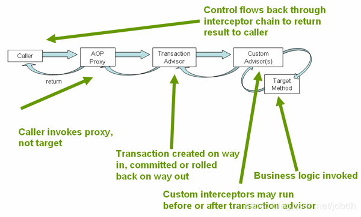

# 一 介绍

Spring提供了**一致性可编程模型**，无论底层使用什么数据访问框架（如mybatis、jdbc、hibernate），只要Spring支持且配置妥当，都可使用Spring的事务管理功能来管理事务。

Spring提供了Spring事务的两种使用方式：

* **声明式**（推荐）, 它又提供了两种声明式事务的使用方式
  * 使用AOP代理
  * 使用`@Transactional`注解, 来配置方法或类。
* **可编程式**

Spring事务本质就是, 替你管理了事务的提交与回滚, 和不同事务方法间的传递性.

> 事务基础知识见[Data/SQL](../Data/SQL.md)

## Spring相关接口（了解）

* 事务接口`PlatformTransactionManager`：是所有事务实现的一个顶层抽象类

* 异常类`TransactionException`

* 当前事务状态类`TransactionStatus`：通过` PlatformTransactionManager.getTransaction`方法获得，依赖于`TransactionDefinition`参数。表示当前环境下的一个新的或已存在的事务，即一个线程一个事务。提供了查看当前事务状态的方法和手动回滚的方法。

  > 这里的事务概念中已包含了Connection(连接)

* 事务配置类`TransactionDefinition`：配置当前事务的属性
  * Propagation（传递性）：通常一个环境下运行一个事务，但是可以指定一个方法是否要在当前环境下运行在新事务中，而悬停原来的事务。
  * Isolation（隔离性）：配置事务之间相互不影响的程度，这是底层数据库提供的功能。
  * Timeout：超时时间，超时则回滚。
  * Read-only：该事务是否可读。

# 二 声明式事务管理器（重点）

* 底层基于AOP实现，但使用它不必了解AOP

* 可以指定回滚规则：指定哪个异常会造成自动回滚。默认事务方法抛出`Unchecked`异常时（`RuntimeException`和`Error`及其子类）自动回滚。

* 声明式事务实现原理：通过AOP和事务元数据（XML或注解提供）生成AOP代理，使用`TransactionInterceptor`（提供切面？）和`PlatformTransactionManager`（提供回调、提交功能）来在方法调用处处理事务逻辑。过程如下所示：

## @Transactional

* 注解到：

  * 注解在类上，该类和子类的所有方法都会应用事务处理逻辑。方法上的注解配置可以覆盖类上的注解配置。
  * 也可单独注解在方法上

* 还需允许该注解的使用，如存在`mybatis-spring` Jar包时, 已经自动配置好了

* 可工作在`proxy`(默认)或`AspectJ`模式下. 

* 默认配置，这些配置可以通过注解修改，见[@Transactional Settings](<https://docs.spring.io/spring-framework/docs/current/spring-framework-reference/data-access.html#transaction-declarative-attransactional-settings>)

  * 传递性：`PROPAGATION_REQUIRED`
  * 隔离性：`ISOLATION_DEFAULT`
  * 可读可写
  * 超时时间为底层事务管理系统的默认时间
  * 运行时异常（`RuntimeException`）或错误（`Error`）会导致回滚，检查型（`Exception`）异常不会。

* `@Transactional`是一个元注解，因此可以构造自己的注解

## Propagation

事务方法调用其他事务方法，都处于不同的**逻辑事务**中，但**物理事务**依情况而定。

> 物理事务就是一个真正的事务, 数据库中的事务, 而逻辑事务会影响物理事务, 见下.

* `PROPAGATION_REQUIRED`（默认）：当事务方法未处于事务环境中时，则开启新物理事务，否则处于同一物理事务，但不同逻辑事务。逻辑事务中回滚异常的设置仍可用, 而其他的设置则继承于外部事务，即：

  * 内部事务方法可回滚的异常同样会造成物理事务回滚，即使外部方法未指定该方法可回滚。外部方法可以捕获`PROPAGATION_REQUIRES_NEW`异常，来得知是否回滚了。
  * 其他设置继承外部事务方法的配置, 如隔离级别, 超时时间等。

* `PROPAGATION_REQUIRES_NEW`：事务方法调用总是会开启一个新的、独立的物理事务，不会参与到外部事务中。因此事务方法的配置总是可用的（隔离级别、超时时间等）。

  > 个人猜测：内部事务方法抛出的异常，如果在外部事务回滚异常范围内，同样会造成回滚。

* `PROPAGATION_NESTED`：表现像`REQUIRED`，但是作为内部事务方法时，处于同一个物理事务，但内部事务回滚时，仅回滚自己的作用域，即使用了`savepoint`。

  >仅在JDBC资源的事务处理中有用

## Isolation

见[JDBC 隔离性](<https://blog.csdn.net/jdbdh/article/details/86307289#81__114>)

# 参考

[Transaction Management](<https://docs.spring.io/spring-framework/docs/current/spring-framework-reference/data-access.html#transaction>)