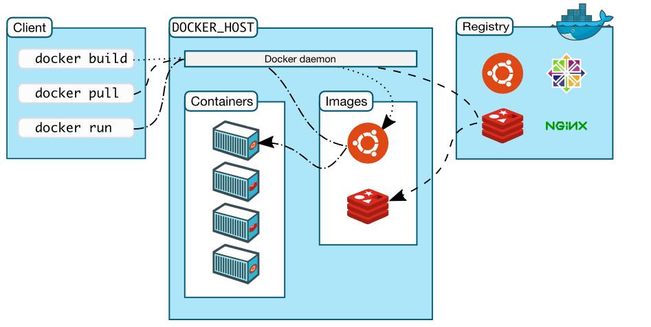
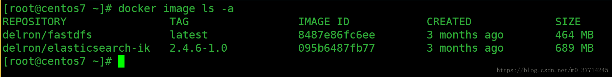

# 开始

## 介绍

> Docker只是方便了应用的分发与管理, 简化运维人员负担. 但于开发者而言, 除了方便搭建依赖组件(MySQL,Redis), 于开发无益, 徒增烦恼. 
>
> 目前okteto项目支持将代码修改同步到容器中, 利用热加载来看到修改的效果. 但体验仍不是很好.

* 基于**进程隔离**技术, 将程序以及其运行环境一起打包, 称之为**镜像**. 镜像可安全的运行在Docker存在的环境中, 而不会出现进程冲突, 此时运行的镜像称为**容器**. ( 类似程序和进程 )

* 与虚拟机本质上的区别是, 容器不带有内核, 容器功能是基于内核提供的进程隔离功能的; 而虚拟机虚拟了物理环境, 需要在该环境上运行操作系统. 

  > 因此有些容器装载了整个Linux发行版, 如Ubuntu, 但却无内容的. 有些容器可仅装可执行文件. 

* 关于性能, 并不会受太大影响, 但是内存可能会消耗更多, 因为运行了多份相同环境.

* Docker provides the ability to package and run an application in a loosely isolated environment called a container. 

* 好处
  * Docker将程序已经环境打包, 让你能够快速分发应用.
  * 使得上线和线下环境一致

* Container

  * Windows Container

    * Windows Server Container

      原生的Windows容器, 于Linux类似, 基于进程隔离 , 运行WIndows的软件.

    * Hyper-V Container

      通过Hyper-V启动**很小的**Linux虚拟机, 然后运行的Linux容器

  * Linux Container

    Linux上的容器

  > 参考
  >
  > * [Windows Container 和 Docker：你需要知道的5件事](https://www.cnblogs.com/ups216/p/6385663.html)
  >* [Windows系统下的Windows Container和Linux Contaner](https://blog.csdn.net/littleworm0/article/details/102626516)

## Docker Engine


Docker Engine是一个提供容器服务的软件, 主要由三部分组成:

1. 运行容器的守护进程dockerd
2. 提供与dockerd交互的Rest API
3. 提供与dockerd交互的命令行客户端.

## 架构



一眼就能看懂的CS架构

* Client

  客户端

* Docker Host

  服务端, Docker Engine提供服务, 同时管理镜像和容器

* Registry

  镜像注册中心, 如Docker Hub

## Docker对象

* 镜像Images

  * 是一个可读的模板, 指导Docker创建容器.
  * 镜像可以基于其他镜像构建, 或者直接构建

* 容器Containers

  * 镜像的运行实例
  * 可以创建, 开始i, 停止, 移动和删除镜像
  * 可以连接容器到网络, 添加存储
  * 默认容器间是隔离的
  * 当容器被删除时, 未写入到持久层的数据都将消失
  
  

## 安装

### Docker Desktop

* 介绍

  Docker Desktop提供了WIndows容器和Linux容器. 

  * Windows容器使用系统本身的进程隔离技术;
  * Linux容器使用Windows原生虚拟机方案Hyper-V创建虚拟机, 进而使用Linux系统的进程隔离技术.

* 安装

  ...

* 卸载

  右键卸载即可, 有些电脑却卡死, 这里给出脚本卸载方式.
  
  新建脚本, 如`remote-docker.ps1`, 内容:
  
  ```powershell
  $ErrorActionPreference = "SilentlyContinue"
  
  kill -force -processname 'Docker for Windows', com.docker.db, vpnkit, com.docker.proxy, com.docker.9pdb, moby-diag-dl, dockerd
  
  try {
  ./MobyLinux.ps1 -Destroy
  } Catch {}
  
  $service = Get-WmiObject -Class Win32_Service -Filter "Name='com.docker.service'"
  if ($service) { $service.StopService() }
  if ($service) { $service.Delete() }
  Start-Sleep -s 5
  Remove-Item -Recurse -Force "~/AppData/Local/Docker"
  Remove-Item -Recurse -Force "~/AppData/Roaming/Docker"
  if (Test-Path "C:\ProgramData\Docker") { takeown.exe /F "C:\ProgramData\Docker" /R /A /D Y }
  if (Test-Path "C:\ProgramData\Docker") { icacls "C:\ProgramData\Docker\" /T /C /grant Administrators:F }
  Remove-Item -Recurse -Force "C:\ProgramData\Docker"
  Remove-Item -Recurse -Force "C:\Program Files\Docker"
  Remove-Item -Recurse -Force "C:\ProgramData\Microsoft\Windows\Start Menu\Programs\Docker"
  Remove-Item -Force "C:\Users\Public\Desktop\Docker for Windows.lnk"
  Get-ChildItem HKLM:\software\microsoft\windows\currentversion\uninstall | % {Get-ItemProperty $_.PSPath}  | ? { $_.DisplayName -eq "Docker" } | Remove-Item -Recurse -Force
  Get-ChildItem HKLM:\software\classes\installer\products | % {Get-ItemProperty $_.pspath} | ? { $_.ProductName -eq "Docker" } | Remove-Item -Recurse -Force
  Get-Item 'HKLM:\software\Docker Inc.' | Remove-Item -Recurse -Force
  Get-ItemProperty HKCU:\software\microsoft\windows\currentversion\Run -name "Docker for Windows" | Remove-Item -Recurse -Force
  #Get-ItemProperty HKCU:\software\microsoft\windows\currentversion\UFH\SHC | ForEach-Object {Get-ItemProperty $_.PSPath} | Where-Object { $_.ToString().Contains("Docker for Windows.exe") } | Remove-Item -Recurse -Force $_.PSPath
  #Get-ItemProperty HKCU:\software\microsoft\windows\currentversion\UFH\SHC | Where-Object { $(Get-ItemPropertyValue $_) -Contains "Docker" }
  ```
  
  以管理员权限打开Powershell, 在里面运行该脚本即可.
  
  > 参考: [How to completely remove Docker in Windows 10](https://success.docker.com/article/how-to-completely-remove-docker-in-windows-10)

### Docker Toolbox

* 介绍

  对于不满足安装Docker Desktop的比较老的Mac和Windows系统, Docker Toolbox提供了传统方案. Toolbox使用VirtualBox而非Hyper-V来创建虚拟机.

* 安装条件

  * 64位
  * Windows7+
  * 使能虚拟化

  > 一般都满足

* 开始安装

  * 下载[Toolbox Releases](https://github.com/docker/toolbox/releases), 并安装

    > 默认就好

  * 安装好后, 双击Docker Quickstart Terminal, 首次打开会进行初始化.

    > 可能会碰到一些问题, 如文件下载失败, 手动下载即可; 还会遇到其他问题, 重试即可; 总之随机应变

  * Ok, 安装完毕. 但是每次重启, 都需要通过Docker Quickstart Terminal来启动Docker. 之后可以在该Terminal中执行Docker命令, 或者在其他终端中执行. ( 命令已添加到PATH下)

> 参考[Docker Toolbox overview](https://docs.docker.com/toolbox/overview/)

### Linux

```shell
apt install docker
```

# 使用

## 镜像操作

* 列出镜像

  ```shell
  docker image ls -a
  ```

  

  - REPOSITORY：镜像所在的仓库名称, 也即完整镜像名.
  - TAG：镜像标签
  - IMAGEID：镜像ID
  - CREATED：镜像的创建日期(不是获取该镜像的日期)
  - SIZE：镜像大小

  镜像有不同版本, 通过标签来表示. 可通过`ubuntu:12.04`的方式使用某具体版本的镜像.

* 拉取镜像

  ```shell
  docker image pull library/hello-world
  ```

  其中, `library`是镜像所在组, `hello-world`是镜像名. 

  组可省略, 此时默认组`library`, 该组由官方提供.

* 删除镜像

  ```shell
  docker image rm <容器名或容器id>
  ```

  > 正在运行容器的镜像是无法删除的
  
* 构建镜像

  ```
  docker build --tag bulletinboard:1.0
  ```

  > 同时指定版本

* 发布镜像

  发布镜像前, 必须通过[docker tag](https://docs.docker.com/engine/reference/commandline/tag/) 打上标签, 通过[docker push](https://docs.docker.com/engine/reference/commandline/push/) 推送上去.

  与构建镜像时打的标签不一样, 构建打的标签尽在本地用, `docker tag`的标签包含更多的信息, 如远程注册中心, 仓库名等信息, 在推送时需要用到.

  > 好像这里说的不对.
  
  若标签步不指定版本, 则默认添加`latest`

## 容器操作

* 创建容器

  ```shell
  docker run [option] <镜像名> [向启动容器中传入的命令]
  ```

  > 若镜像不存在, 会自动从你配置的仓库中下拉

  常用可选参数

  * `-i` 以交互模式运行, 即连接容器的输入输出流.

  * `-t` 在容器中创建一个伪终端.

    ----------------

  * `--name=<容器名>` 为创建的容器命名

  * `-d` 容器守护进程化

  * `-e` 为容器设置环境变量

    --------------------

  * `-v <主机目录>|<容器内目录>` 目录映射, 该选项可存在多个

  * `-p <主机端口>|<容器端口>` 端口映射, 该选项可存在多个

  * `--network=host` 将主机的网络环境映射到容器中，容器的网络与主机相同.

    > 貌似默认连接到当前主机的.
    
    ------------
    
  * `--rm` 当容器结束后自动删除

  例子

  * 交互式容器

    创建一个交互式容器，并命名为mycentos

    ```shell
    docker run -it --name=mycentos centos /bin/bash
    ```

    > 容器中可以随意执行linux命令，就是一个ubuntu的环境，当执行exit命令退出时，该容器也随之停止。

  * 守护式容器

    创建一个守护式容器，并命名为mycentos2

    ```shell
    docker run -dit --name=mycentos2 centos
    ```

    > 创建一个守护式容器:如果对于一个需要长期运行的容器来说，我们可以创建一个守护式容器。在容器内部exit退出时，容器也不会停止。

* 进入已运行的容器中

  ```shell
  docker exec -it <容器名或容器id> <进入后执行的第一个命令>
  ```

  如

  ```shell
  docker exec -it mycentos2 /bin/bash
  ```

* [查看容器](https://docs.docker.com/engine/reference/commandline/ps/)

  ```shell
  列出本机正在运行的容器
  docker container ls
  列出本机所有容器，包括已经终止运行的
  docker container ls --all
  ```

* 停止与启动容器

  ```shell
  停止一个已经在运行的容器
  docker container stop 容器名或容器id
  
  启动一个已经停止的容器
  docker container start 容器名或容器id
  
  kill掉一个已经在运行的容器
  docker container kill 容器名或容器id
  ```

* 删除容器

  ```shell
  docker container rm 容器名或容器id
  ```

## 容器To镜像

通过如下命令将容器保存为镜像

```
docker commit 容器名 镜像名
```

## 镜像备份与迁移

可以通过save命令将镜像打包成文件，拷贝给别人使用

```shell
docker save -o 保存的文件名 镜像名
```

> 例如：`docker save -o ./centos.tar centos`

对方在拿到镜像文件后，可以通过load方法，将镜像加载到本地

```shell
docker load -i ./centos.tar
```

## 其他

* 查看容器资源使用

  ```shell
  docker stats redis1 redis2
  ```

  

# Dockerfile

* 主程序

  `ENTRYPOINT`, `CMD`

# 参考

* [Docker 入门教程](http://www.ruanyifeng.com/blog/2018/02/docker-tutorial.html)
* [Docker 微服务教程](http://www.ruanyifeng.com/blog/2018/02/docker-wordpress-tutorial.html)
* [【 全干货 】5 分钟带你看懂 Docker ！](https://zhuanlan.zhihu.com/p/30713987)
* [Docker Documentation](https://docs.docker.com/) 官方文档
* [Docker Quick Start](https://hub.docker.com/?overlay=onboarding) 官方入门
* [Docker最全教程——从理论到实战(一)](https://www.cnblogs.com/codelove/p/10030439.html) 

# ----我是帅气的分割线-----

# Docker overview

* Docker Engine

  

  Client-Server程序, 组成部分如下

  * Server, 一个长期运行的守护进程`dockerd`
  * Rest API, 与server交互的接口
  * CLI, 与server交互的命令行接口, 通过Rest API实现

* Docker网络拓扑

  

  Client发起命令请求给Docker daemon, daemon执行命令, 如构建镜像, 创建容器.  镜像可自己构建, 可来自本地, 或远程的仓库Registry.

* Docker对象

  * 镜像

    只读的模板, 用于创建容器

  * 容器

    镜像的运行实例. 容器可以连接到多个网络networks, 附上存储volumes, 或基于当前容器创建镜像

  * Services

    暂不清楚

* 例子: 容器创建过程

  以交互的形式创建`ubuntu`的容器, 并在容器中运行`bash`

  ```shell
  $ docker run -i -t ubuntu /bin/bash
  ```

  执行过程如下:

  1. 若本地不存在`Ubuntu`, 将从Registry中拉去镜像, 并创建容器.

  2. 为容器创建可读写文件系统, 作为最终层. 允许容器在该层中读写文件目录.

     > 该层存储非持久的, 容器删除后将消失.

  3. 在容器中创建*网络接口network interface* , 同时分配该接口范围内的IP给容器.

     > 容器可通过该接口, 与主机网络交互, 和访问外部网络.

  4. 启动容器, 并执行`bash`, 由于`-i`和`-t`的作用, 你可以与`bash`交互

  5. 输入`exit`, 容器将被停止

     > 注意, 不是被删除, 被停止的容器还能够再次被运行.

* 底层原理

  * Namespaces

    名字空间提供隔离层, 让容器工作在自己的工作环境中, 在Linux中用到的名字空间如下

    - **The `pid` namespace:** Process isolation (PID: Process ID).
    - **The `net` namespace:** Managing network interfaces (NET: Networking).
    - **The `ipc` namespace:** Managing access to IPC resources (IPC: InterProcess Communication).
    - **The `mnt` namespace:** Managing filesystem mount points (MNT: Mount).
    - **The `uts` namespace:** Isolating kernel and version identifiers. (UTS: Unix Timesharing System).

  * Control groups

    cgroups限制应用对特殊资源的使用, 如限制容器对内存的使用量

  * Union file systems

    创建容器时添加的读写层(非持久).

  * 容器格式

    Docker Engine组合namespaces, cgroups和UnionFS成容器的方式, 即为容器格式.


# Quick Start

* 镜像&文件系统

  镜像有自己的文件系统, 构建时, 可以将本地的文件克隆到镜像中. 容器实例化时, 也会产生存储层, 从镜像的文件系统中克隆的.

* Dockerfile

  > 文件名也是`Dockerfile`

  `Dockerfile` 文件提供构建镜像的指令

  ```dockerfile
  # 该镜像基于node镜像构建
  FROM node:current-slim
  
  # 设置在镜像中操作时的工作目录
  WORKDIR /usr/src/app
  
  # 拷贝本机文件到当前目录中
  COPY package.json .
  
  # 构建镜像时运行的命令
  RUN npm install
  
  # 貌似仅做申明, 给自己看的, 没啥作用
  EXPOSE 8080
  
  # 指定启动容器时执行的命令
  CMD [ "npm", "start" ]
  
  # 拷贝剩余文件到镜像中
  COPY . .
  ```

* 关于网络

  貌似`EXPOSE`没啥用, `-p`才能映射端口. 若是都不存在, 容器将默认映射内容内的端口到本机中.

  > 参考https://stackoverflow.com/a/47594352/12574399

# Best Practices

## 保持镜像足够小

* 使用恰当的基础镜像

  如仅需JDK, 使用`openjdk`即可, 而不是`ubuntu`, 然后之上安装`openjdk`.

* 使用多阶段构建

  如, 使用`maven`镜像构建Java程序, 然后重置到`tomcat`镜像中, 将构建的Java包放入正确的目录下. 所有步骤都写在同一个dockerfile中

  若使用的Docker版本不支持多阶段构建, 可以通过合并`RUN`命令的形式减少镜像层数.

* 抽离公共部分

  若多个镜像存在公共部分, 可将之抽离成基础镜像, 其他镜像引入. 这样该基础镜像在第一次被使用后, 可以缓存起来, 导致构建速度加快.

* 标签最好不要依赖自动生成的`latest`标签.

## 持久化数据

有三种存储数据的方式

* 使用容器的可读可写层.
* 使用Volumes
* 使用挂载(bind mounts)

尽量避免使用容器的读写层, 有三点原因:

1. 容器删除后, 数据将消失
2. 将增加容器大小
3. IO访问是低效的

开发环境推荐使用挂载目录的方式, 生产环境使用Volumes. 

> secrets, configs 是什么? 

# Dockerfile Best Practices

* Docker镜像由多个只读层组成, 每层都代表一个Dockerfile指令. 每一层都是上一次的增量Delta

* 例子

  ```dockerfile
  # 从ubuntu:18.04中创建一层
  FROM ubuntu:18.04
  # 在新一层中添加目录
  COPY . /app
  # 在新一层中添加make后的结果
  RUN make /app
  # 在新一层中添加运行的命令
  CMD python /app/app.py
  ```

  生成容器时, 也会新增一层可读写层(container layer)
  
* 仅`RUN`, `COPY`, `ADD`命令会创建层, 其他命令不会, 也不会增加构建镜像的大小.

# multi-stage builds

> 要求Docker 17.05+

```dockerfile
FROM golang:1.11-alpine AS build

# Install tools required for project
# Run `docker build --no-cache .` to update dependencies
RUN apk add --no-cache git
RUN go get github.com/golang/dep/cmd/dep

# List project dependencies with Gopkg.toml and Gopkg.lock
# These layers are only re-built when Gopkg files are updated
COPY Gopkg.lock Gopkg.toml /go/src/project/
WORKDIR /go/src/project/
# Install library dependencies
RUN dep ensure -vendor-only

# Copy the entire project and build it
# This layer is rebuilt when a file changes in the project directory
COPY . /go/src/project/
RUN go build -o /bin/project

# This results in a single layer image
FROM scratch
COPY --from=build /bin/project /bin/project
ENTRYPOINT ["/bin/project"]
CMD ["--help"]
```

> Dockerfile构建的镜像, 最终来至于最后一个`From`与之后的命令. 之前的构建过程可以被引入, 但最终会消失.

Dockerfile中可存在多个`From`指令, 每个`Form`使用不同的`base`, 同时开启新的构建*阶段 stage*. 你可从某个阶段的中拷贝文件到后面的阶段中. 最终构建的镜像来自于最后的那个阶段.

引入上个阶段构建的内容, 有两种方式

1. 使用索引, 索引以0开始

   ```dockerfile
   COPY --from=0 /java/scr/target/demo.jar  ./
   ```

2. 命名阶段, 以名字索引

   ```dockerfile
   FROM golang:1.7.3 AS builder
   ...
   
   FROM alpine:latest  
   ...
   COPY --from=builder /go/src/app ./
   ```

可以从外部镜像中拷贝文件

```dockerfile
COPY --from=nginx:latest /etc/nginx/nginx.conf /nginx.conf
```

# Create a base image

创建基础镜像, 有两种方式

* 从当前环境创建

  如把本机系统的Ubuntu发行版打包成镜像

  ```dockerfile
  $ sudo debootstrap xenial xenial > /dev/null
  $ sudo tar -C xenial -c . | docker import - xenial
  
  a29c15f1bf7a
  
  $ docker run xenial cat /etc/lsb-release
  
  DISTRIB_ID=Ubuntu
  DISTRIB_RELEASE=16.04
  DISTRIB_CODENAME=xenial
  DISTRIB_DESCRIPTION="Ubuntu 16.04 LTS"
  ```

  > 具体在干啥我看不懂

  重点就是`docker import`, 它支持从归档文件tarball中创建镜像.

* 从`scratch`镜像中创建

  `scratch`是最基础, 最小的镜像, 应该啥都没有

  > 文件系统是镜像必备的

  ```dockerfile
  FROM scratch
  ADD hello /
  CMD ["/hello"]
  ```

# Kubernetes

* 介绍

  k8s用于管理, Scale和维护容器化应用

* 启动

  Docker Desktop都内置了k8s的所有功能, 在*Preferences/Kubernetes*中启动

  > 生产环境呢? 暂不知道.

* 操作

  * 创建k8s对象

    ```shell
    kubectl apply -f bb.yaml
    ```

  * 查看deployments对象

    ```shell
    kubectl get deployments
    ```

  * 查看services对象

    ```shell
    kubectl get services
    ```

  * 查看pods对象

    ```shell
    kubectl get pods
    ```

  * 查看pod日志

    ```shell
    kubectl logs demo
    ```

  * 删除k8s对象

    ```shell
    kubectl delete -f bb.yaml
    ```

* yaml配置

  配置通用模式

  * `apiVersion` 解析该对象的k8s API
  * `kind` 对象类型
  * `metadata` 元数据, 如对象名
  * `spec` 对象的所有参数和配置

  例子

  ```yaml
  apiVersion: apps/v1
  kind: Deployment
  metadata:
    name: bb-demo
    namespace: default
  spec:
    replicas: 1
    selector:
      matchLabels:
        bb: web
    template:
      metadata:
        labels:
          bb: web
      spec:
        containers:
        - name: bb-site
          image: bulletinboard:1.0
  ---
  apiVersion: v1
  kind: Service
  metadata:
    name: bb-entrypoint
    namespace: default
  spec:
    type: NodePort
    selector:
      bb: web
    ports:
    - port: 8080
      targetPort: 8080
      nodePort: 30001
  ```

  > 该文件定义了两个对象, 以`---`分隔


# 容器配置

## 自动启动容器

* 使用

  在`docker run`上添加`--restart`选项, 可选值有

  | Flag             | Description                                                  |
  | :--------------- | :----------------------------------------------------------- |
  | `no`             | 不自动重启容器(默认)                                         |
  | `on-failure`     | 容器因错误结束 (返回值非0) 时重启.                           |
  | `always`         | 当容器停止时便重启. 特例: 若被手动停止, 只能手动启动, 或Docker重启时启动. |
  | `unless-stopped` | 类似`alwaus`, 但若手动停止, 只能手动重启.                    |

* 注意点

  * 上述重启策略生效, 仅当容器启动成功. 启动成功意味着容器运行10以上, 且Docker已启动监听.
  * 手动停止容器, 不会立即重启.
  * 重启策略仅作用于容器. swarm service需要通过其他方式配置.

## 容器存活

当Docker进程结束时, 默认将关闭所有运行的容器. 有两种方法可以配置, 让容器存活下来

1. 添加配置

   在`/etc/docker/daemon.json`文件中, 添加

   ```json
   {
     "live-restore": true
   }
   ```

   重启Docker进程, 如

   ```shell
   systemctl reload docker
   ```

2. 手动运行`dockerd`, 添加参数`--live-restore`

## 运行多个进程

* 原则上, 一个容器含有一个进程即可, 通过`ENTRYPOINT`或`CMD`指定. 但也允许多个.

* 可通过Bash脚本运行多个进程, 如

  ```dockerfile
  FROM ubuntu:latest
  COPY my_first_process my_first_process
  COPY my_second_process my_second_process
  COPY my_wrapper_script.sh my_wrapper_script.sh
  # 该脚本运行上述两个脚本
  CMD ./my_wrapper_script.sh
  ```

* 通过容器类的进程管理器, 如

  ```dockerfile
  FROM ubuntu:latest
  RUN apt-get update && apt-get install -y supervisor
  RUN mkdir -p /var/log/supervisor
  COPY supervisord.conf /etc/supervisor/conf.d/supervisord.conf
  COPY my_first_process my_first_process
  COPY my_second_process my_second_process
  CMD ["/usr/bin/supervisord"]
  ```

* 为防止多个进程不能随容器关闭而结束, 可添加`--init`参数, docker会添加一个小的init进程, 帮助关闭容器内所有进程.

## 日志

`docker logs` 显示运行容器的日志信息.  日志来自于`STDOUT`和`STDERR`. 若容器的进程不打印日志stdout, stderr中, 该命令将看不到日志.

这种日志收集方式, 可以通过logging driver控制, 略.


