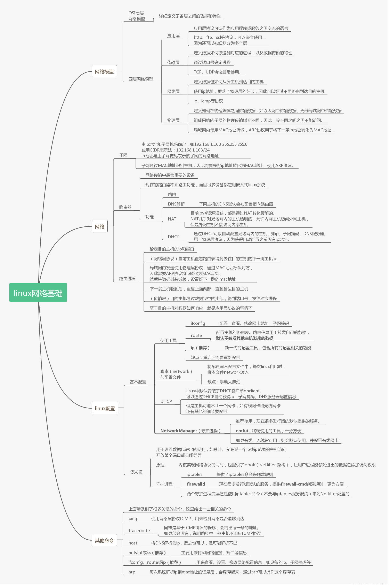
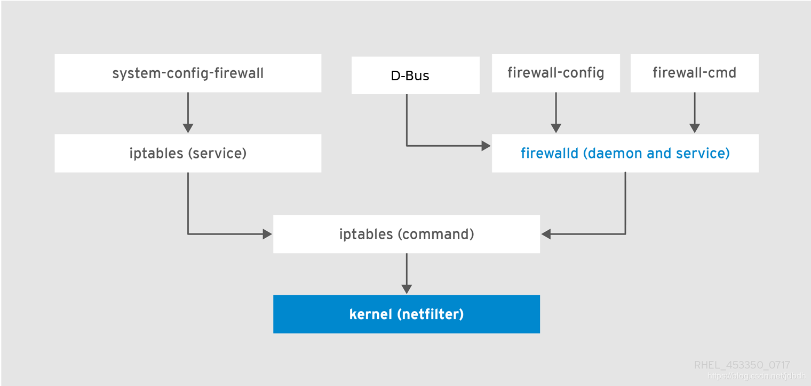

# 基础



## 网络模式

### OSI七层网络模型

* 详细定义了各层之间的功能和特性

### 四层网络模型

* 应用层
  * 应用层协议可认作为应用程序或服务之间交流的语言
  * http、ftp、ssl等协议，可以嵌套使用，因此还可以被细划分为多个层
* 传输层
  * 定义数据如何被送到对应的进程，以及数据传输的特性
  * 通过端口号确定进程
  * TCP、UDP协议最常使用。
* 网络层
  * 定义数据包如何从源主机到达目的主机
  * 使用ip地址，屏蔽了物理层的细节，因此可以经过不同路由到达目的主机
  * 常用协议有ip、icmp等
* 物理层
  * 定义如何在物理媒体之间传输数据，如以太网中传输数据、无线局域网中传输数据
  * 组成网络的子网的物理传输媒介不同，因此一般不同之间之间不能访问。
  * 局域网内使用MAC地址传输，ARP协议用于将下一条ip地址转化为MAC地址

## 网络层

### 子网

* 由ip地址和子网掩码确定，如`192.168.1.103`,`255.255.255.0`等 .

  或用CIDR表示法：`192.168.1.103/24`

  ip地址与上子网掩码表示该子网的网络地址

* 子网通过MAC地址识别主机，因此需要先将ip地址转化为MAC地址，使用ARP协议。

### 路由器

* 网络传输中最为重要的设备

* 现在的路由器不止路由功能，而且很多设备都使用嵌入式linux系统

* 功能

  * 路由

  * DNS解析

    子网主机的DNS默认会被配置指向路由器

  * NAT

    目前ipv4资源短缺，都是通过NAT转化缓解的。NAT几乎对局域网内的主机透明的，允许内网主机访问外网主机，但是外网主机不能访问内部主机

  * DHCP

    通过DHCP可以自动配置局域网内的主机，如ip、子网掩码、DNS服务器。属于物理层协议，因为获得自动配置之前没有ip地址。

### 路由过程

* 给定目的主机的ip和端口
* （网络层协议）当前主机查看路由表得到去往目的主机的下一跳主机ip
* 局域网内发送使用物理层协议，通过MAC地址标识对方，因此需要ARP协议将ip转化为MAC地址. 然后将数据封装成帧，设置好下一跳的mac地址
* 下一跳主机收到后，重复上面两部，直到到达目的主机
* （传输层）目的主机通过数据包中的头部，得到端口号，发往对应进程
* 至于目的主机对数据如何响应，就是应用层协议的事情了

> 那路由器是如何知道下一条路由的呢? 我忘了, 但至少不存在路由时, 会发往默认路由.

## 防火墙

关于防火墙，这里在做补充。先看一幅图

防火墙是内核提供的功能，可以通过`iptables`命令直接设置防火墙规则，也可以通过图中的两个守护进程提供的工具来设置，它们底层使用的命令都是`iptables`。目前发行版大都使用firewalld作为守护进程，使用`firewall-cmd`来配置规则，这里就介绍firewalld。

firewalld中，**zone**是一系列规则的集合（类似iptables命令中的chain），zone的target字段定义默认行为，如果**到来**（incoming）数据包没有匹配zone的规则，就使用默认行为。firewalld预定义了多种zone，默认网卡设备使用public。public zone中target为default，表示没有成功匹配的（incoming）数据包会被拒绝进入。

规则可以被定义为多种形式，如直接指定服务，如http，ftp，ssh；或者使用端口+协议，如80/tcp，123/udp。但是你可能会发现这些功能很有限，远没有`iptables`命令灵活，因此`firewall-cmd`提供`--direct`直接使用`iptables`命令的规则来配置防火墙。当不用直接使用iptables，这会造成firewalld服务内核数据不一致。

规则分为运行时规则和永久规则，其实就是保存为内存中副本的规则为运行时规则，保存文件中的规则为永久规则。只不过`firewall-cmd`一次只能保存一个地方，内存或文件。

网卡具体使用什么zone由NetworkManager确定，如果没有明确指定，会使用firewalld的默认zone，一般为public，但可以通过`public-cmd`修改。

# 命令

## ip

ip命令功能很强大，常用于查看、修改、设置网卡ip、路由表、设备等功能。配置不会被保存。

>代替了ifconfig、route、arp等老工具的使用

>ip [ OPTIONS ] OBJECT { COMMAND | help }
>
>* `OBJECT`：表示ip具体的某个子功能，常用的为`addr`（设置ip）、`route`（路由表）、`neighbour`（arp缓存）. 
>
> > 可使用简写.
>
>* `COMMAND`：每个object的动作都不一样，可以查询、修改、添加对应实体，但如果没有给出则默认查询
>
>* `help`：通过help可查询对应object具体用法

用法参考：[Linux命令之ip](http://www.cnblogs.com/diantong/p/9511072.html)

## ss

用于查看sockets信息。

>代替了老工具netstat的使用

```shell
ss [options]
```

默认显示所有已建立连接（non-listening）的sockets，包括TCP/UNIX/UDP类型的socket。

* `-l`:仅显示正在监听（listening）的sockets
* `无`：仅显示已建立连接（non-listening）的sockets
* `-a`：同时显示正在监听（listening）和已建立连接（non-listening）的sockets

> 注意, 已建立连接和监听是两种状态, 一种是还未连接, 所以要监听; 一种是已经连接上了, 不用监听了

-------------

* `-t`：仅显示tcp类型的sockets
* `-u`：仅显示udp类型的sockets
* `-x`：仅实现unix类型的sockets
* `无`：同时显示tcp、udp、unix类型的sockets

------------------

* `-n`：显示端口而不是服务名
* `-p`：显示使用socket的进程

> 常用命令
>
> ```
> ss -ltnp
> ```

## nmtui

NetworkManager提供的，用于配置网络的字符界面工具。如配置网卡ip、掩码、网关、DNS服务器，并且配置会被保存下来。

## firewall-cmd

* 检测防火墙状态

  ```bash
  sudo firewall-cmd --state
  ```

* 重新加载防火墙规则，运行时添加但没有保存的规则会消失

  ```bash
  sudo firewall-cmd --reload
  ```

* 一般添加规则不会被永久保存，添加`--permanent``永久保存却不会立刻生效。有两种方法解决：

  ```bash
  # 设置运行时规则后再保存
  firewall-cmd <other options>
  firewall-cmd --runtime-to-permanent
  保存到文件中，然后重新加载所有规则
  firewall-cmd --permanent <other options>
  firewall-cmd --reload
  ```

* zone操作

  ```bash
  # 查看当前默认zone
  sudo firewall-cmd --get-default-zone
  # 改变默认zone
  sudo firewall-cmd --set-default-zone=internal
  # 查看网卡设备使用的zone。网卡只会在没有明确设置zone时才使用默认zone
  sudo firewall-cmd --get-active-zones
  # 得到一个zone的全部配置
  sudo firewall-cmd --zone=public --list-all
  # 得到全部zone的配置
  sudo firewall-cmd --list-all-zones
  ```

* 添加、删除服务或端口，并且端口还可以添加一个范围的端口，如`8000-8999/tcp`

  ```bash
  # 通过服务名添加、删除服务
  sudo firewall-cmd --zone=public --add-service=http --permanent
  sudo firewall-cmd --zone=public --remove-service=http --permanent
  # 通过端口+协议添加、删除服务
  sudo firewall-cmd --zone=public --add-port=12345/tcp --permanent
  sudo firewall-cmd --zone=public --remove-port=12345/tcp --permanent
  ```

* 等等等等

参考：[Introduction to FirewallD on CentOS](https://www.linode.com/docs/security/firewalls/introduction-to-firewalld-on-centos/)

# 网络进阶

## curl

>已重新学习curl，详细见[curl](https://blog.csdn.net/jdbdh/article/details/90911383)

curl用于与服务间传输数据，支持各种协议。但我只用http协议

>curl [options] [URL...]
>默认从URL下载数据到终端

* `-i`:输出包括http头字段
* `-I`：仅获得头部
* `-v`：输出更多的信息。`>`表示请求头字段，`<`表示响应头字段，`*`表示额外信息
* `-H`:添加请求头字段
* `-b`：添加cookie
* `-L`：如果响应要求重定向，则向新地址发起请求。
* `-o` <file>：指定文件保存
* `-O`：于当前目录保存文件，文件名为远程文件名。
* `-F, --form <name=content>`：对于http协议族，curl以`multipart/form-data`类型的`Content-Type`发送post数据。如果要发送文件，`content`需要以`@`开始，后接文件名。

例子：

```bash
//下载jdk，允许重定向，以网络文件名保存在本地
curl -L -b "oraclelicense=a" -O http://download.oracle.com/otn-pub/java/jdk/10.0.2+13/19aef61b38124481863b1413dce1855f/jdk-10.0.2_linux-x64_bin.tar.gz
//向微信接口发送图片
curl -F media=@test.jpg "https://api.weixin.qq.com/cgi-bin/media/upload?access_token=ACCESS_TOKEN&type=TYPE"
```

>同类工具还有wget，但curl更强大
>最全教程：[Using curl to automate HTTP jobs](https://curl.haxx.se/docs/httpscripting.html)

## Unix Domain Sockets

socket有很多中，我们常用的是network socket，linux也提供了unix socket，它表现起来像TCP或UDP，但它只用作内部进程交流的途径，因此更高校。

# 其他

## 实时查看网速

```shell
sar -n DEV 1 100
```

命令解读

* `sar`用于打印系统活动信息
* `-n DEV`指定打印网络信息
* `1`表示每秒统计一次
* `100` 表示统计100次

输出结束

```log
07:48:29 PM     IFACE   rxpck/s   txpck/s    rxkB/s    txkB/s   rxcmp/s   txcmp/s  rxmcst/s   %ifutil
07:48:30 PM      eth0      2.00      2.00      0.12      1.21      0.00      0.00      0.00      0.00
07:48:30 PM        lo      0.00      0.00      0.00      0.00      0.00      0.00      0.00      0.00
```

分别是

* 网络接口名 IFACE
* 每秒收包率 rxpck
* 每秒发包率 txpck
* 每秒接收字节 rxkB
* 每秒发送字节 txKb
* ...
* 网络接口利用率 ifutil

## 修改主机名

```shell
hostname hk.sidian.live
```

保守起见, 再修改下`/etc/hostname`文件

## nc & telnet

`nc`用于简单的创建一个sockets并监听, 如

```shell
nc -l localhost 8080
```

> 监听本地8080端口

`telnet`简单的与监听端口的进程交互

```shell
telnet localhost 8080
```

两者都可以在里面发送消息, 只是`nc`是监听者, `telnet`是请求者罢了.

# 参考

* [Introduction to FirewallD on CentOS](https://www.linode.com/docs/security/firewalls/introduction-to-firewalld-on-centos/)
* [CHAPTER 5. USING FIREWALLS](https://access.redhat.com/documentation/en-us/red_hat_enterprise_linux/7/html/security_guide/sec-using_firewalls#sec-Introduction_to_firewalld)
* [Firewalld](https://fedoraproject.org/wiki/Firewalld?rd=FirewallD)
* [CentOS 7 中firewall-cmd命令](https://www.jianshu.com/p/411274f96492)
* [Computer network](https://en.wikipedia.org/wiki/Computer_network)
* [OSI model](https://en.wikipedia.org/wiki/OSI_model)
* [A Deep Dive into Iptables and Netfilter Architecture](https://www.digitalocean.com/community/tutorials/a-deep-dive-into-iptables-and-netfilter-architecture)
* [iptables查看、开放、删除端口、保存设置](https://www.centos.bz/2018/01/iptables%E6%9F%A5%E7%9C%8B%E3%80%81%E5%BC%80%E6%94%BE%E3%80%81%E5%88%A0%E9%99%A4%E7%AB%AF%E5%8F%A3%E3%80%81%E4%BF%9D%E5%AD%98%E8%AE%BE%E7%BD%AE/)
* [NetworkManager](https://en.wikipedia.org/wiki/NetworkManager)
* [What's the difference between Network Initscript and NetworkManager in RHEL 7?](https://access.redhat.com/solutions/783533)
* [Linux命令之ip](http://www.cnblogs.com/diantong/p/9511072.html)