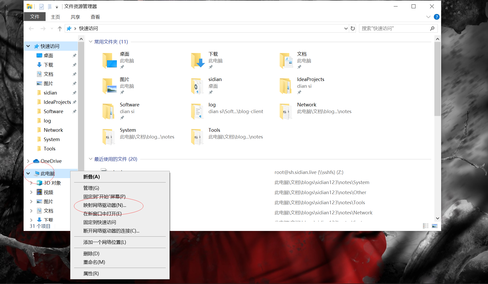
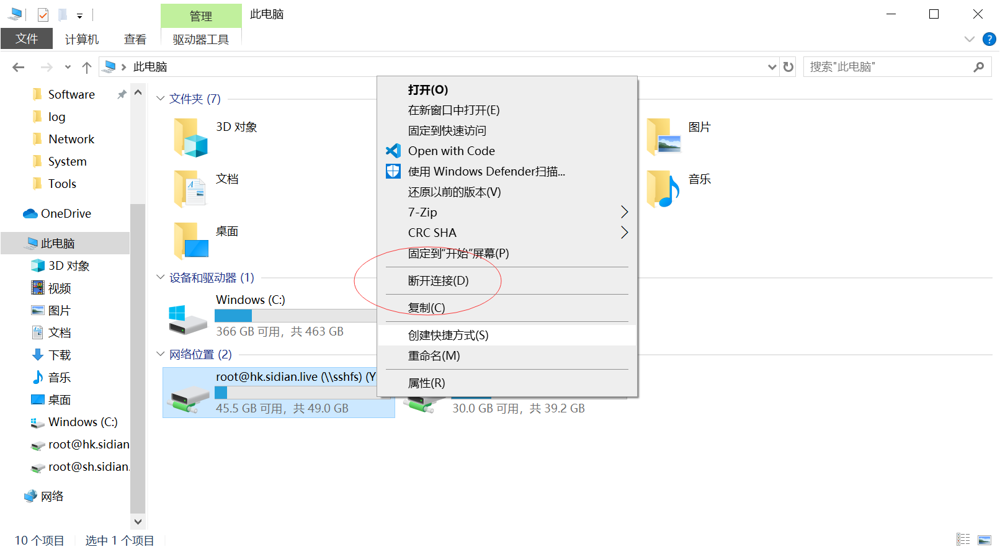

# 介绍

SSHFS ( SSH Filesystem) 是一个由SFTP协议实现的文件系统. 一般Linux发行版都支持SSH和SFTP, 因此, 服务端基本无需任何配置, 仅需一个SSHFS文件系统的实现即可.

# 文件系统实现

* [libfuse](https://github.com/libfuse)/[sshfs](https://github.com/libfuse/sshfs) 仅支持Linux和macOS版
* [billziss-gh](https://github.com/billziss-gh)/[sshfs-win](https://github.com/billziss-gh/sshfs-win) SSHFS的Windows版实现

这里介绍sshfs-win的使用

# 安装

* [WinFsp](https://github.com/billziss-gh/winfsp/releases) sshfs-win的依赖
* [SSHFS-Win](https://github.com/billziss-gh/sshfs-win/releases)

> 注意两者之间的版本要对上, 都选 Latest release 版即可

# 使用

安装后, 接下来可将远程主机上的一个目录映射到Windows上的网络设备. 

这里有两种使用方式

## Windows Explorer

1. 右键我的电脑-->映射网络驱动器

   

2. 文件夹地址中输入URL

   ```
   \\sshfs\USER@HOST[\PATH]
   ```

   > 添加自己的用户名, 远程主机地址, 和可选的文件路径

3. 断开连接

   

## 命令行

* 列出所有网络驱动

  ```powershell
  net use
  ```

* 取消映射

  ```powershell
  net use X: /delete
  ```

  > 只需指定盘符即可

* 添加映射

  ```powershell
  net use D: \\sshfs\root@hk.sidian.live
  ```

# 参考

关于更详细的URL格式和更高级的用法, 见[billziss-gh](https://github.com/billziss-gh)/**[sshfs-win](https://github.com/billziss-gh/sshfs-win)**  


